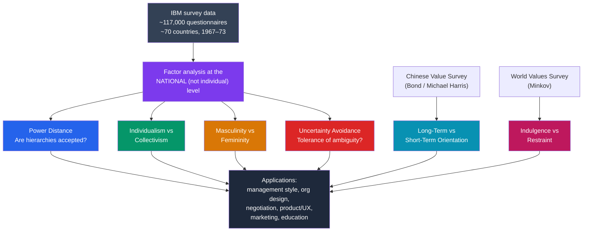

# 📊 Hofstede's Cultural Dimensions

> [!abstract] TL;DR
> **Geert Hofstede** analyzed a massive IBM employee survey (1967–1973, ~117,000 questionnaires across ~70 countries) and extracted a small set of **dimensions** on which national cultures reliably differ: **power distance**, **individualism–collectivism**, **masculinity–femininity**, **uncertainty avoidance**, and later **long-term orientation** and **indulgence–restraint**. Each nation gets a numeric score, enabling comparison and prediction in international management, negotiation, and design. The model is enormously influential but heavily critiqued: it equates *nation* with *culture*, rests on a single company's data from one era, and risks reifying dynamic cultures into fixed numbers. Best used as a heuristic vocabulary, not a deterministic law.

## Intuition — analogy FIRST

Think of Hofstede's dimensions like the axes on a colour wheel for cultures.

No single number captures a colour — you need a few coordinates (hue, saturation, brightness) to place it. Once you have those axes, you can say precise, comparative things: "this red is more saturated than that one." Hofstede's claim is that national cultures, likewise, can be located on a handful of shared axes, so instead of vague talk about a country being "more formal," you can say it scores 80 on power distance versus another's 35.

But the analogy also carries the danger. A colour coordinate describes an average of a surface under one lighting condition; move the light and it shifts. Hofstede's numbers are *averages of averages*, measured under one "lighting condition" (IBM employees around 1970). Treating them as the fixed, essential colour of a whole living nation is exactly where the model gets misused.

---

## How It Works — Six Axes of National Culture

## Key Concepts / Details

### Origin: The IBM Studies

**Geert Hofstede (1928–2020)**, a Dutch social psychologist, had access to a huge internal survey of **IBM** employees conducted between 1967 and 1973. Because respondents worked for the *same* multinational in similar jobs, Hofstede argued that systematic differences between countries must reflect **national culture** rather than occupation, employer, or organizational climate — a clever natural control. He published the core framework in *Culture's Consequences* (1980). Later dimensions were added using other datasets (the Chinese Value Survey, then the World Values Survey), because the original questionnaire was designed by Western researchers and could miss non-Western concerns.

### The Six Dimensions

| Dimension | Low pole | High pole | Illustrative high scorers |
|---|---|---|---|
| **Power Distance (PDI)** | Flat hierarchy, question authority | Steep hierarchy, defer to authority | Malaysia, many Arab and Latin American nations |
| **Individualism–Collectivism (IDV)** | Group loyalty, "we" | Personal autonomy, "I" | USA, Australia, UK (high individualism) |
| **Masculinity–Femininity (MAS)** | Cooperation, care, quality of life | Competition, achievement, assertiveness | Japan, Hungary (high MAS); Sweden, Norway (low) |
| **Uncertainty Avoidance (UAI)** | Comfortable with ambiguity, few rules | Anxiety about ambiguity, many rules | Greece, Portugal, Japan (high) |
| **Long-Term Orientation (LTO)** | Tradition, quick results, "normative" | Thrift, perseverance, adaptation, "pragmatic" | East Asian nations (high) |
| **Indulgence–Restraint (IVR)** | Restraint, suppressed gratification | Free gratification of desires | Many Western/Latin American (indulgent); Eastern Europe/Asia (restrained) |

> [!note] Naming caveats
> The label **"masculinity–femininity"** is widely criticized for baking gender stereotypes into the terminology; many scholars now prefer **"achievement vs nurturance"** or "tough vs tender." Read the dimension by its *content* (competition vs care), not its dated name.

### How the Dimensions Are Used

- **Cross-cultural management**: predicting friction between, say, a high-PDI subsidiary (expecting directive leadership) and a low-PDI headquarters (expecting participative input). **Fons Trompenaars** and the later **GLOBE project** (House et al., 2004) built related management-oriented frameworks.
- **Negotiation and communication**: high-UAI counterparts may want detailed contracts and agendas; high-LTO counterparts may prioritize long relationship-building over quick deals.
- **Product, UX, and marketing**: interface density, appeals to status vs egalitarianism, individual vs family framing — echoing the messaging patterns discussed in [[Culture_and_the_Self]].
- **Comparative research**: the country scores are a convenient (if blunt) covariate for studies comparing nations.

### Critiques — Why "Nation ≠ Culture"

The single most important caveat is the **ecological fallacy**: Hofstede's scores are properties of *national averages*, and applying them to predict an *individual's* behavior is a category error. A specific Japanese engineer may be far more individualist than a specific American one.

Other major critiques:
- **One company, one era**: IBM employees in ~1970 are not a representative cross-section of any nation; the data are also decades old for a changing world.
- **Nations are not cultures**: state borders enclose enormous internal diversity (linguistic, ethnic, regional, class). Belgium, India, or Nigeria as a *single* score is a heroic simplification.
- **Western-designed instrument**: the original questionnaire encoded Western assumptions (a live example of the concern in [[The_WEIRD_Problem]]); the LTO dimension was added precisely to correct this.
- **McSweeney (2002)** and others challenged the statistical and conceptual foundations, arguing the dimensions are partly artifacts of method.
- **Reification and stereotyping**: numeric scores can harden fluid cultures into fixed "national characters," inviting exactly the essentializing this field warns against.

> [!warning] A vocabulary, not a verdict
> Hofstede's dimensions are most defensible as a *shared language* for noticing that difference exists and along which axes — not as a precise, deterministic prediction engine for how a given person from a given country will act.

## Real-World Notes

- **Expatriate training**: Multinationals use dimension profiles to prepare relocating staff — genuinely useful for *sensitization*, dangerous if it hardens into "all people from X are Y."
- **Global teams**: Awareness that "silence in a meeting" can mean respect for hierarchy (high PDI) rather than disengagement can defuse real misunderstandings.
- **Comparative benchmarking**: hofstede-insights style country-comparison tools are popular in business, but their apparent precision (a score of 68 vs 71) far exceeds their true resolution.
- **Complement with within-country data**: pair dimension scores with local, up-to-date qualitative knowledge and remember generational change — younger cohorts often diverge from the 1970s IBM picture.

## Common Pitfalls

- **The ecological fallacy** — using a national average to predict one person. This is the number-one misuse and it is a logical error, not a nuance.
- **Treating scores as timeless** — cultures change; a 1970 dataset should not be quoted as current fact without acknowledgment.
- **Over-precision** — reporting small score gaps as if meaningful. The dimensions are coarse, not surgical.
- **Confusing description with explanation** — a high PDI score *describes* a pattern; it does not *explain why* it exists or justify it.
- **Ignoring competing frameworks** — GLOBE, Trompenaars, and Schwartz's value theory sometimes disagree with Hofstede; no single map is authoritative.

## Related Concepts

- [[_MOC_Cross_Cultural_Psychology|↑ Section MOC]]
- [[Culture_and_the_Self]] — Individualism–collectivism as a *psychological* construct, of which IDV is the national-level version
- [[The_WEIRD_Problem]] — Why a Western-designed instrument needed the LTO dimension added; sampling limits
- [[Culture_and_Cognition]] — How the dimensions co-vary with holistic vs analytic thinking styles
- [[Acculturation_and_Identity]] — What dimension "distance" between heritage and host cultures predicts about acculturative stress
- Cross-vault: [[_MOC_Microeconomics|Microeconomics]] — Culture as a variable in institutions, trust, and economic behavior
- Cross-vault: [[Research_Methods_Psychology]] — Factor analysis, levels of analysis, and the ecological fallacy

## Review Questions

1. Explain the "clever natural control" in Hofstede's use of IBM data. What confounds does sampling one company help rule out, and what new limitation does it introduce?
2. Define the ecological fallacy and give a concrete example of how misusing a power-distance score commits it.
3. The long-term orientation dimension was added *after* the original four. Why does the reason for adding it double as evidence for the WEIRD critique of the original instrument?

## Sources

- Hofstede, G. (2001). *Culture's Consequences: Comparing Values, Behaviors, Institutions and Organizations Across Nations* (2nd ed.). Sage
- Hofstede, G., Hofstede, G.J. & Minkov, M. (2010). *Cultures and Organizations: Software of the Mind* (3rd ed.). McGraw-Hill
- McSweeney, B. (2002). "Hofstede's model of national cultural differences and their consequences: A triumph of faith – a failure of analysis." *Human Relations*, 55(1), 89–118
- House, R.J. et al. (2004). *Culture, Leadership, and Organizations: The GLOBE Study of 62 Societies*. Sage

#psychology #cross-cultural-psychology #hofstede #cultural-dimensions #cross-cultural-management
