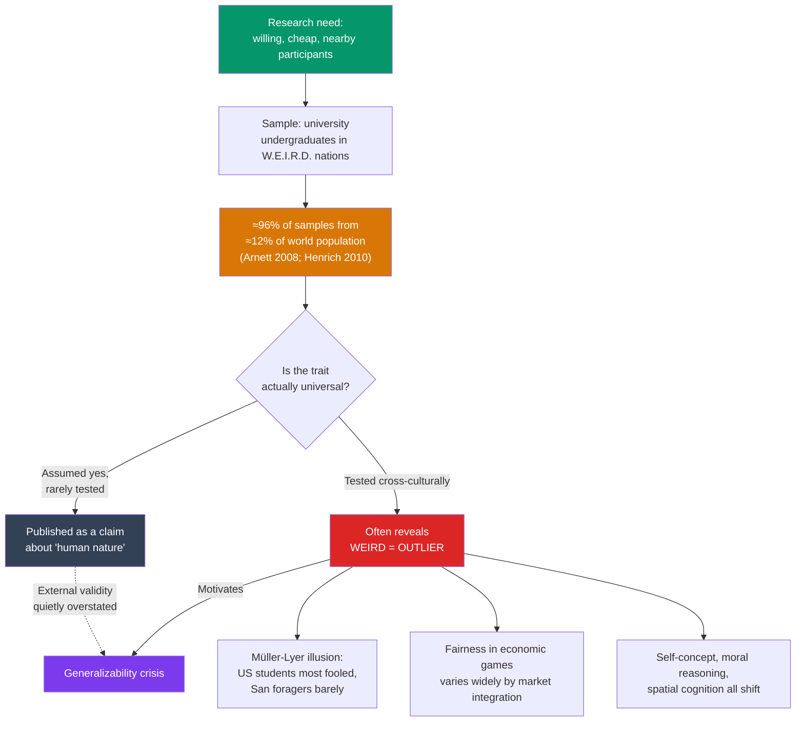

# 🧪 The WEIRD Problem

> [!abstract] TL;DR
> **Henrich, Heine, and Norenzayan (2010)** showed that the overwhelming majority of psychology's participants — and nearly all of its undergraduate subjects — are **W**estern, **E**ducated, **I**ndustrialized, **R**ich, and **D**emocratic, yet the field routinely generalizes from them to "humans" in general. Worse, on many measures where cross-cultural data exist — visual illusions, spatial reasoning, fairness, moral reasoning, self-concept — WEIRD people are not a representative middle but frequent **outliers**, often the most extreme population sampled. This is a structural threat to the external validity of psychology, distinct from (and compounding) the statistical replication crisis. The fix is not to discard existing work but to specify its scope and broaden the sample of humanity we study.

## Intuition — analogy FIRST

Imagine a nutrition science built almost entirely on one small town where everyone eats the same unusual diet, and then imagine that science publishing its findings as "how the human body processes food."

Some of what it found would be universal — the body is the body. But a great deal would silently encode that town's peculiar diet as if it were human nature. And here is the twist that makes WEIRD worse than ordinary sampling error: it turns out this town isn't a random sample of eaters, it's the *most unusual* town on the map. If you had to pick one population *least* likely to reveal what's universal about digestion, you'd have accidentally picked exactly them.

That is the situation Henrich and colleagues described. Psychology didn't just oversample a narrow slice of humanity — it oversampled a slice that is, on many dimensions, at the far tail of the human distribution, and then labeled the results "the psychology of people."

---

## How It Works — From Convenience Sample to Universal Claim

## Key Concepts / Details

### The Acronym and the Core Claim

**Joseph Henrich, Steven Heine, and Ara Norenzayan (2010)**, in "The weirdest people in the world?" (*Behavioral and Brain Sciences*), coined **WEIRD**: **W**estern, **E**ducated, **I**ndustrialized, **R**ich, **D**emocratic. Building on **Jeffrey Arnett's (2008)** survey showing that ~96% of psychological samples came from countries holding ~12% of the world's population (and heavily from American undergraduates), they made a stronger argument than "samples are narrow." Their claim was that **WEIRD participants are psychologically unusual** — often statistical outliers — precisely on the domains researchers most want to generalize.

### The Müller-Lyer Illusion as the Signature Example

The **Müller-Lyer illusion** (two equal-length lines appear unequal because of inward vs outward arrowheads) was long treated as a hardwired feature of the human visual system.

- **Segall, Campbell, and Herskovits (1966)** measured susceptibility across cultures. American undergraduates needed one line lengthened by roughly **20%** before the lines looked equal.
- Members of the **San** (foraging peoples of the Kalahari) were **barely susceptible at all** — near zero adjustment.
- The leading explanation is the **"carpentered world" hypothesis**: people raised amid rectangular buildings and manufactured right angles learn to read certain 2D cues as depth, which drives the illusion. A "hardwired" perceptual effect turned out to be experience-dependent — and WEIRD viewers were at the extreme.

This example is powerful because visual perception feels like the *least* cultural thing imaginable. If even that varies, higher-level cognition surely does.

### A Ladder of Contrast Classes

Henrich et al. argued we should ask how *representative* a WEIRD result is relative to progressively wider comparison groups.

| Contrast | Question | Frequent finding |
|---|---|---|
| WEIRD vs rest of world | Do industrialized Westerners resemble other societies? | Often no |
| Contemporary Westerners vs other industrialized | Are Americans typical Westerners? | Often unusually individualist |
| University students vs other adults | Are undergrads typical of their own society? | Often the extreme end |
| Adults vs children | Are adult patterns developmentally universal? | Some patterns are learned |

Each rung shows the same lesson: the closer you look at the actual sample, the narrower and more atypical it turns out to be.

### Domains Where WEIRD Differs

- **Fair play / economic behavior**: In cross-cultural **Ultimatum Game** studies (Henrich et al., 2001, "the 15 small-scale societies project"), offers and rejection behavior varied enormously and tracked local norms and **market integration** — there is no single "human" bargaining instinct.
- **Analytic vs holistic cognition**: WEIRD samples reason more analytically (see [[Culture_and_Cognition]]).
- **Self-concept**: WEIRD samples are unusually **independent** in self-construal (see [[Culture_and_the_Self]]).
- **Moral reasoning and folk biology**, spatial reference frames, and even some aspects of **gut microbiome-linked cognition** show WEIRD as atypical.

> [!warning] WEIRD ≠ the replication crisis
> These are two different problems that reinforce each other. The **replication crisis** is about *internal* reliability — do the same results reappear in the same population? The **WEIRD problem** is about *external* validity — do results generalize beyond the sampled population? A perfectly replicable finding can still be WEIRD-bound.

## Real-World Notes

- **Textbooks and headlines**: Findings are still frequently reported as facts about "people" when the data are entirely WEIRD. Reading critically means asking, "who was actually in this sample?"
- **Global policy and design**: Behavioral "nudges" validated on WEIRD samples can fail or backfire elsewhere; default-effect and loss-aversion magnitudes are not culturally constant.
- **Field response**: Journals increasingly ask authors to explicitly bound their generalizability claims (a "Constraints on Generality" statement, per Simons, Shoda & Lindsay, 2017) and to justify sample choice.
- **Reform, not nihilism**: The takeaway is not "psychology is worthless" but "psychology has been describing a population it mislabeled as a species" — a fixable specification error. See [[Research_Methods_Psychology]] for sampling design that addresses it.

## Common Pitfalls

- **Hearing "WEIRD" as an insult** — it is a technical acronym describing a sampling frame, not a slur against Western people. The point is representativeness, not worth.
- **Concluding nothing generalizes** — some findings *are* universal (basic emotion recognition has substantial cross-cultural agreement; certain perceptual constancies hold). The claim is that universality must be *demonstrated*, not assumed.
- **Fixing it by adding one non-Western sample** — a single additional country doesn't establish universality; it just adds a second point. Broad, theory-driven sampling is required.
- **Ignoring within-WEIRD diversity** — "Western" hides class, ethnicity, and regional variation. Even undergraduates are not interchangeable with their own societies.

## Related Concepts

- [[_MOC_Cross_Cultural_Psychology|↑ Section MOC]]
- [[Culture_and_the_Self]] — WEIRD samples are unusually independent, biasing self-concept research
- [[Culture_and_Cognition]] — The analytic reasoning WEIRD samples show is itself culturally shaped
- [[Hofstede_Cultural_Dimensions]] — An early large *non*-student, multi-nation dataset that pushed against WEIRD narrowness
- [[Acculturation_and_Identity]] — Studying migrants forces the field beyond monocultural samples
- Cross-vault: [[Research_Methods_Psychology]] — Sampling, external validity, and generalizability statements
- Cross-vault: [[Cognitive_Biases]] — Many "universal" biases were catalogued on WEIRD samples and need cross-cultural checking

## Review Questions

1. The WEIRD critique is often summarized as "psychology studies unrepresentative samples." Explain why Henrich et al.'s actual argument is *stronger* than that, using the Müller-Lyer illusion as your example.
2. Distinguish the WEIRD problem from the replication crisis. Give an example of a finding that could be highly replicable yet still WEIRD-bound.
3. A researcher responds to the WEIRD critique by re-running a US study with one additional sample of university students in another wealthy democracy and declares the effect "cross-culturally robust." Identify at least two flaws in this response.

## Sources

- Henrich, J., Heine, S.J. & Norenzayan, A. (2010). "The weirdest people in the world?" *Behavioral and Brain Sciences*, 33(2–3), 61–83
- Arnett, J.J. (2008). "The neglected 95%: Why American psychology needs to become less American." *American Psychologist*, 63(7), 602–614
- Segall, M.H., Campbell, D.T. & Herskovits, M.J. (1966). *The Influence of Culture on Visual Perception*. Bobbs-Merrill
- Henrich, J. et al. (2001). "In search of Homo economicus: Behavioral experiments in 15 small-scale societies." *American Economic Review*, 91(2), 73–78

#psychology #cross-cultural-psychology #weird #sampling-bias #generalizability
