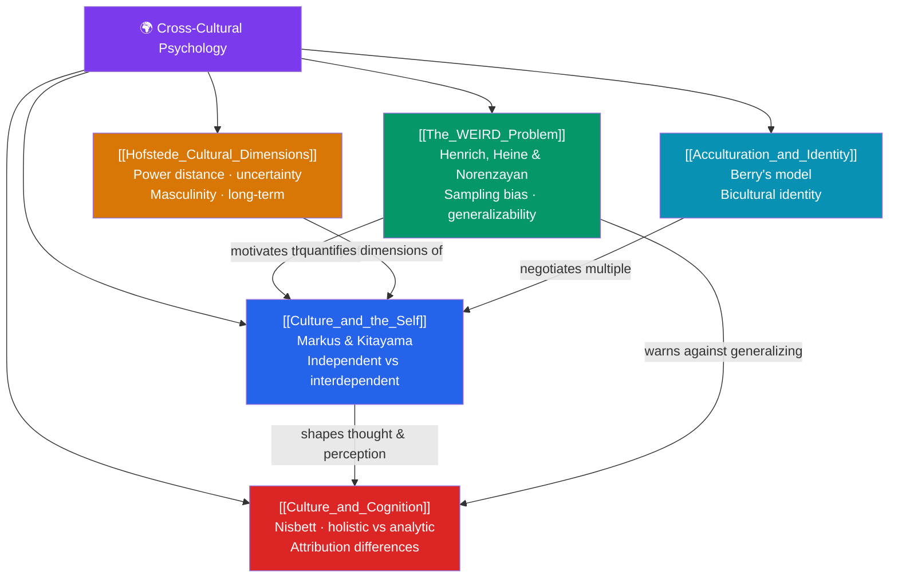

# 🌍 Cross-Cultural Psychology — Map of Content

> [!abstract] What This Section Covers
> Cross-cultural psychology asks how much of "human nature" is actually culture-specific. This section begins with the foundational insight that **the self** itself is culturally shaped — independent in some societies, interdependent in others — then confronts the field-defining **WEIRD problem**: that most psychological research samples an unrepresentative sliver of humanity. It introduces **Hofstede's dimensions** for quantifying cultural difference, shows that even basic **cognition and perception** vary across cultures, and closes with **acculturation** — how individuals navigate more than one culture at once. Together these five notes are a corrective to psychology's tendency to mistake the local for the universal.

## Concept Map

## Learning Path

1. [[Culture_and_the_Self]] — Markus and Kitayama's independent vs. interdependent self-construals and the individualism/collectivism dimension.
2. [[The_WEIRD_Problem]] — Henrich, Heine, and Norenzayan on Western, Educated, Industrialized, Rich, Democratic sampling bias and the generalizability crisis.
3. [[Hofstede_Cultural_Dimensions]] — Power distance, uncertainty avoidance, masculinity/femininity, individualism/collectivism, and long-term orientation.
4. [[Culture_and_Cognition]] — Nisbett's holistic vs. analytic thought, cultural differences in attribution, and even in perception.
5. [[Acculturation_and_Identity]] — Berry's acculturation model (integration, assimilation, separation, marginalization) and bicultural identity.

## All Notes at a Glance

| Note | Difficulty | What You'll Learn |
|------|------------|-------------------|
| [[Culture_and_the_Self]] | Beginner → Intermediate | Independent vs. interdependent self, individualism/collectivism, self-enhancement vs. self-criticism |
| [[The_WEIRD_Problem]] | Intermediate | WEIRD acronym, sampling bias in psychology, replication and generalizability concerns, sample outliers |
| [[Hofstede_Cultural_Dimensions]] | Intermediate | The IBM studies, the six dimensions, national scores, applications, and methodological critiques |
| [[Culture_and_Cognition]] | Intermediate | Holistic vs. analytic cognition, field dependence, the fundamental attribution error across cultures, perception |
| [[Acculturation_and_Identity]] | Intermediate | Berry's fourfold model, acculturative stress, bicultural identity integration, frame-switching |

## Key Questions This Section Answers

- Is the "self" a universal given, or does culture construct it differently?
- What does it mean that most published psychology is based on WEIRD samples?
- Can national cultures be meaningfully reduced to a handful of numeric dimensions?
- Do people from different cultures literally perceive and attribute causes differently?
- How do immigrants and bicultural individuals reconcile two cultural identities?

## Related Sections

- [[_MOC_Psychology_Master|↑ Psychology Master MOC]]
- [[_MOC_Psychometrics|← Psychometrics & Assessment]]
- [[_MOC_Abnormal_Psychology|→ Abnormal Psychology]]

#MOC #Psychology #CrossCulturalPsychology
