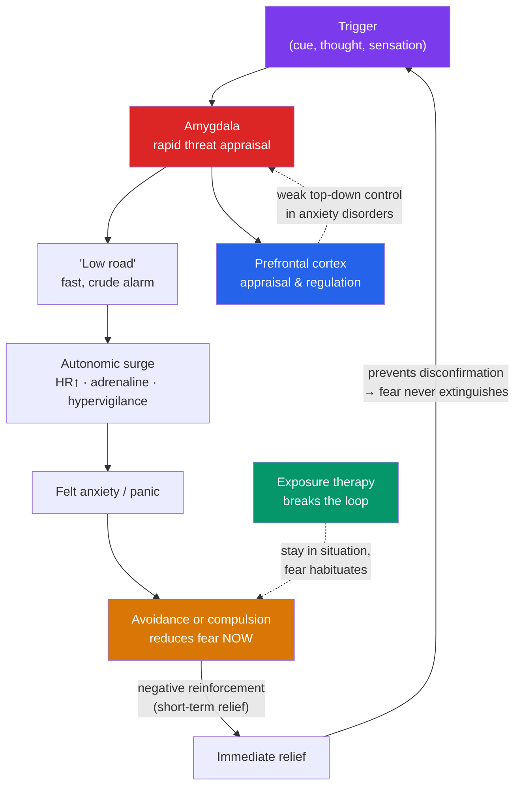

# 😰 Anxiety and OCD-Related Disorders

> [!abstract] TL;DR
> Anxiety disorders are the most common class of mental disorder — highly treatable conditions in which a normally adaptive alarm system (fear) becomes **excessive, persistent, and impairing**. The family includes **generalized anxiety disorder** (chronic, free-floating worry), **specific phobias**, **social anxiety disorder**, and **panic disorder** (recurrent panic attacks plus fear of the attacks themselves). The DSM-5 moved **OCD** into its own obsessive-compulsive spectrum and **PTSD** into trauma- and stressor-related disorders — both are covered here for their shared fear circuitry. Etiology combines a hyperactive **amygdala-based fear network**, **classical conditioning** and avoidance learning, cognitive biases, and genetic vulnerability. First-line, evidence-based treatments are **CBT with exposure** and **SSRIs/SNRIs** — with exposure-based therapy carrying the strongest evidence.

> [!info] Educational content, not diagnosis
> Everyone feels anxious sometimes; anxiety becomes a disorder only when it is excessive, persistent, and impairing. This note is educational, not diagnostic or medical advice. These conditions are common and highly treatable — if worry or fear is disrupting your life, a qualified clinician can help.

## Intuition — analogy FIRST

Think of anxiety as a **smoke detector**.

A smoke detector is life-saving precisely because it errs on the side of caution — it would rather scream at burnt toast than stay silent during a real fire. A false alarm at breakfast is a small price for catching a genuine blaze. Fear works the same way: a hair-trigger system that overreacts to ambiguous threats kept our ancestors alive, because the cost of missing a real predator vastly exceeded the cost of a false alarm.

An anxiety disorder is a smoke detector with the sensitivity dial turned too high and stuck. It fires at toast, at shadows, at nothing — and then, crucially, at the sound of its own alarm. Panic disorder is fearing the alarm itself ("what if I panic?"). OCD is compulsively checking the stove to silence a "what if it's on fire?" thought. The system isn't broken because it's afraid; it's disordered because it can't tell smoke from steam and won't turn off.

---

## How It Works — The Fear Circuit and the Cycle of Avoidance

## Key Concepts / Details

### The Anxiety Disorders

| Disorder | Core feature | Hallmark detail |
|---|---|---|
| **Generalized anxiety disorder (GAD)** | Excessive, uncontrollable worry about many domains, ≥6 months | Physical signs: restlessness, fatigue, muscle tension, sleep disturbance; worry is "free-floating" |
| **Specific phobia** | Marked fear of a specific object/situation (animals, heights, blood-injection-injury, flying) | Recognized as excessive; avoidance is central; blood-injury type can cause fainting via a vasovagal drop |
| **Social anxiety disorder** | Intense fear of scrutiny or negative evaluation in social/performance settings | Fear of embarrassment; often onset in adolescence; not mere shyness |
| **Panic disorder** | Recurrent unexpected **panic attacks** + persistent worry about more attacks | Attacks peak within minutes; **fear of fear** (anxiety sensitivity) drives the cycle; may lead to agoraphobia |
| **Agoraphobia** | Fear of situations where escape is hard or help unavailable | Public transit, crowds, open spaces, being outside home alone |

A **panic attack** is an abrupt surge of intense fear with somatic symptoms (racing heart, chest tightness, shortness of breath, dizziness, derealization) that peaks within minutes. Panic attacks are common and can occur in many disorders; **panic disorder** specifically involves recurrent unexpected attacks plus fear of their recurrence.

### OCD — Obsessive-Compulsive Disorder

In DSM-5-TR, OCD anchors its own chapter (obsessive-compulsive and related disorders, which also includes body dysmorphic disorder, hoarding, trichotillomania, and excoriation).

- **Obsessions** are intrusive, unwanted, distressing thoughts, images, or urges (contamination, harm, symmetry, taboo themes). They are **ego-dystonic** — experienced as alien and unwanted.
- **Compulsions** are repetitive behaviors or mental acts (washing, checking, counting, reassurance-seeking) performed to neutralize an obsession or prevent a feared event.
- **The vicious cycle:** obsession → anxiety spike → compulsion → temporary relief → **negative reinforcement** strengthens the compulsion, and the feared outcome is never disconfirmed.

> [!note] Intrusive thoughts are near-universal
> Most people experience occasional intrusive thoughts (e.g., "what if I pushed someone off this platform?"). In OCD, the difference is not the thought's content but the **catastrophic appraisal** of it ("having this thought means I'm dangerous") and the compulsive response. People with OCD are not more likely to act on their thoughts — the distress comes precisely from finding them repugnant.

### PTSD — Post-Traumatic Stress Disorder

Reclassified in DSM-5 under trauma- and stressor-related disorders. Follows exposure to actual or threatened death, serious injury, or sexual violence. Four symptom clusters:

1. **Intrusion** — flashbacks, nightmares, intrusive memories.
2. **Avoidance** — of trauma-related reminders, thoughts, places.
3. **Negative alterations in cognition and mood** — persistent negative beliefs, detachment, anhedonia.
4. **Arousal and reactivity** — hypervigilance, exaggerated startle, sleep and concentration problems.

Symptoms persist >1 month and cause impairment. Most people exposed to trauma do **not** develop PTSD (resilience is the norm); risk reflects a diathesis-stress interaction — see [[Models_of_Abnormality]].

### Etiology — Why the Alarm Gets Stuck

**Learning (classical conditioning).** The classic account traces phobias to **classical conditioning**: a neutral stimulus (CS) paired with an aversive event (UCS) comes to evoke fear (CR). **Little Albert** (Watson & Rayner, 1920) conditioned an infant to fear a white rat paired with a loud noise. **Mowrer's two-factor theory** explains why phobias persist: fear is *acquired* by classical conditioning and *maintained* by operant conditioning — **avoidance is negatively reinforced** because it reduces fear, which prevents the person from ever learning the feared outcome won't occur. See [[Classical_Conditioning]] for the underlying mechanism. **Preparedness** (Seligman) explains why we more readily condition fears of evolutionarily relevant threats (snakes, spiders) than modern ones (cars, outlets).

**Biology.** A hyperactive **amygdala** (the brain's threat detector) with weak top-down regulation from the **prefrontal cortex** produces exaggerated fear responses. GABA and serotonin systems are implicated (benzodiazepines enhance GABA; SSRIs modulate serotonin). Anxiety disorders are moderately heritable, reflecting a general vulnerability rather than disorder-specific genes.

**Cognition.** Anxiety involves systematic biases: **attentional bias** toward threat, **catastrophizing** (overestimating danger), **intolerance of uncertainty** (central to GAD), and **anxiety sensitivity** (fearing the bodily sensations of anxiety — the engine of panic disorder). Compare with the broader account in the vault's cognitive-bias material.

### Evidence-Based Treatment

| Treatment | Mechanism | Notes |
|---|---|---|
| **Exposure therapy** | Systematic, graded confrontation of feared cues without avoidance → fear **extinction/habituation**; the person learns the feared outcome doesn't occur (inhibitory learning) | Strongest evidence for phobias, panic, OCD, PTSD. Variants: systematic desensitization, flooding, in-vivo, imaginal, VR |
| **ERP (Exposure and Response Prevention)** | Exposure to obsessional cues **while preventing the compulsion** | The gold-standard psychotherapy for **OCD** |
| **Cognitive-behavioral therapy (CBT)** | Identify and restructure catastrophic appraisals; combine with behavioral exposure | First-line across the anxiety family; see [[Cognitive_Behavioral_Therapy]] |
| **Trauma-focused therapies** | Prolonged exposure, cognitive processing therapy (CPT), EMDR | First-line for **PTSD** |
| **SSRIs / SNRIs** | Increase serotonin (± norepinephrine) availability | First-line pharmacotherapy; effect builds over weeks |
| **Benzodiazepines** | Enhance GABA for rapid relief | Short-term only; tolerance and dependence risk; generally avoided in PTSD |

**Bottom line:** exposure-based CBT and SSRIs are the pillars, often combined. Applied relaxation, mindfulness, and acceptance-based therapies (ACT) are effective adjuncts.

## Real-World Notes

- **Anxiety and depression travel together.** Comorbidity is very high; many people meet criteria for both, and shared vulnerability underlies the overlap — see [[Mood_Disorders]].
- **Avoidance feels helpful and makes things worse.** The single most important clinical insight is that avoidance provides short-term relief while entrenching the fear long-term. Effective therapy asks people to do the counterintuitive thing: approach, not avoid.
- **Panic is frightening but not dangerous.** Panic attacks are the fear system misfiring; they are intensely unpleasant but not physically harmful. Understanding this (psychoeducation) is itself therapeutic.
- **OCD is widely misused as slang.** "I'm so OCD about my desk" trivializes a serious, distressing condition. People with OCD are not merely tidy — they are trapped in a cycle they recognize as excessive and wish to escape.

## Common Pitfalls

- **Confusing anxiety (the emotion) with an anxiety disorder.** Anxiety is a normal, adaptive emotion. The disorder is the excessive, persistent, impairing version — not the presence of any anxiety at all.
- **Offering reassurance as treatment.** Reassurance-seeking is itself a compulsion in OCD and health anxiety; well-meaning reassurance provides brief relief but reinforces the cycle, much like avoidance.
- **Assuming exposure means "just tough it out."** Exposure is structured, graded, collaborative, and paced — not reckless overwhelming. Flooding a person without preparation can be counterproductive.
- **Reading intrusive thoughts as intentions.** In OCD, distressing intrusive thoughts are the opposite of desires; treating them as revealing "true intentions" deepens shame and misunderstands the disorder.

## Related Concepts

- [[_MOC_Abnormal_Psychology|↑ Section MOC]]
- [[Models_of_Abnormality]] — The diathesis-stress and biopsychosocial frameworks that explain onset
- [[Mood_Disorders]] — Highly comorbid; shared cognitive and biological vulnerabilities
- [[Schizophrenia_and_Psychosis]] — Contrast: anxiety obsessions are ego-dystonic; psychotic delusions are held with conviction
- [[Personality_and_Neurodevelopmental_Disorders]] — Cluster C personality disorders overlap with chronic anxiety
- Cross-vault: [[Classical_Conditioning]] — The learning mechanism behind phobia acquisition and avoidance
- Cross-vault: [[Cognitive_Behavioral_Therapy]] — The front-line psychotherapy for the whole family

## Review Questions

1. Using **Mowrer's two-factor theory**, explain how a specific phobia is first acquired and then maintained. Why does avoidance make a phobia persist rather than fade, and how does exposure therapy exploit the opposite principle?
2. Distinguish a **panic attack** from **panic disorder**, and explain the role of **anxiety sensitivity** ("fear of fear") in turning isolated attacks into a chronic disorder.
3. In OCD, why is it inaccurate to say that people with distressing harm-related obsessions are dangerous? Explain the concepts of ego-dystonic thoughts and catastrophic appraisal, and describe how ERP treats the disorder.

## Sources

- American Psychiatric Association (2022). *Diagnostic and Statistical Manual of Mental Disorders, Fifth Edition, Text Revision (DSM-5-TR)*. APA Publishing.
- Craske, M.G. et al. (2014). "Maximizing exposure therapy: An inhibitory learning approach." *Behaviour Research and Therapy*, 58, 10–23.
- Mowrer, O.H. (1960). *Learning Theory and Behavior*. New York: Wiley.
- Bandelow, B., Michaelis, S. & Wedekind, D. (2017). "Treatment of anxiety disorders." *Dialogues in Clinical Neuroscience*, 19(2), 93–107.

#psychology #abnormal-psychology #anxiety #ocd #ptsd
