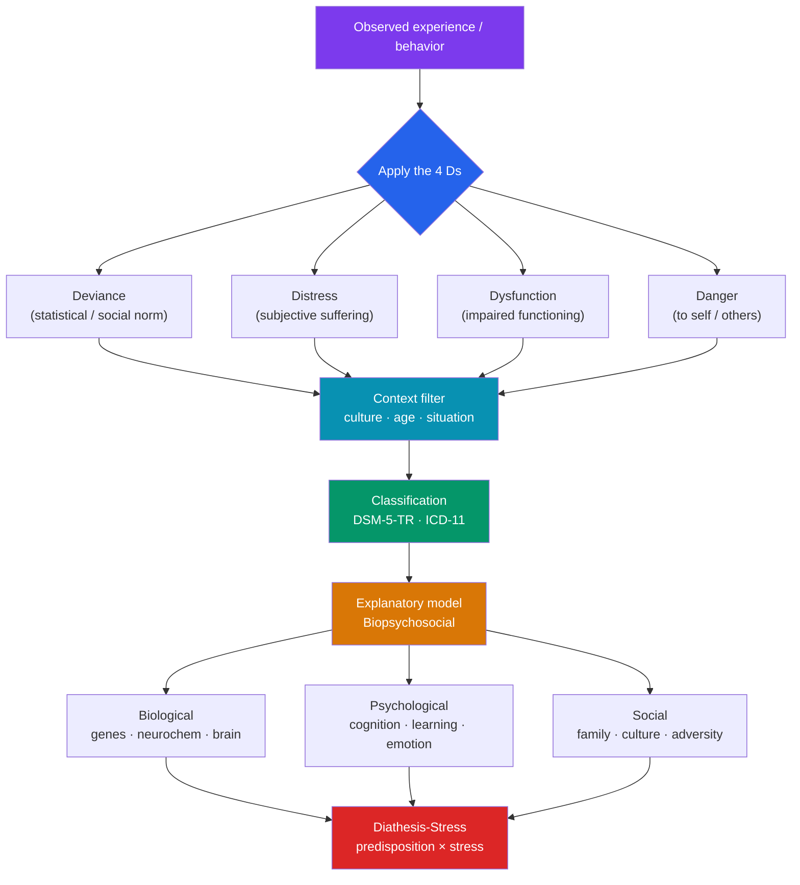

# 🧭 Models of Abnormality

> [!abstract] TL;DR
> "Abnormal" is not a fact about a person but a judgment made against a standard — and the standard matters enormously. Clinicians commonly weigh the **4 Ds** (deviance, distress, dysfunction, danger), but no single criterion is sufficient. The dominant explanatory framework is the **biopsychosocial model**, which treats disorders as arising from biological, psychological, and social causes acting together. Two classification systems — the **DSM-5-TR** (American Psychiatric Association) and the **ICD-11** (World Health Organization) — provide shared diagnostic language. The **medical model** made mental disorder treatable but drew sharp critiques from Rosenhan, Szasz, and the anti-psychiatry movement. The **diathesis-stress** framework reconciles nature and nurture: a predisposition (diathesis) becomes disorder only when stress exceeds a threshold.

> [!info] Educational content, not diagnosis
> This note explains how professionals think about mental disorder. It is not a diagnostic tool or medical advice. Diagnosis requires a qualified clinician who evaluates the whole person in context. Mental disorders are common, treatable health conditions — not character flaws.

## Intuition — analogy FIRST

Think about what makes a note in a song "wrong."

A single note is never wrong in isolation. A C-sharp is beautiful in one key and jarring in another; a "wrong" note in a jazz solo is a "right" note in the next bar. Wrongness is a **relationship** — between the note, the key, the moment, and the listener's expectations. Change the context and the same note flips from error to expression.

Judging a mind as "abnormal" works the same way. A behavior that is disordered in one context (hearing voices while alone) may be sanctioned in another (a religious vision within a tradition that expects it). Intense grief is expected after a bereavement and pathological only if it is severe, prolonged, and impairing. This is why clinicians never diagnose a behavior in isolation — they ask about **context, culture, duration, and impact**. The models below are competing answers to one question: *against which standard should we measure the note?*

---

## How It Works — From Criteria to Diagnosis

## Key Concepts / Details

### Defining Abnormality — The 4 Ds

No single criterion defines a disorder; clinicians triangulate across several. The classic heuristic is the **4 Ds**:

| Criterion | Question it asks | Strength | Limitation |
|---|---|---|---|
| **Deviance** | Is it statistically rare or norm-violating? | Captures the unusual | Genius and creativity are also rare; norms are culturally relative and can be unjust |
| **Distress** | Does the person suffer? | Centers subjective experience | Some conditions (e.g., mania, some personality disorders) involve little felt distress |
| **Dysfunction** | Does it impair work, relationships, self-care? | Ties to real-world impact | "Impairment" depends on role expectations that vary by culture |
| **Danger** | Is there risk of harm to self or others? | Flags urgent cases | Applies to a small minority; overstating it fuels stigma |

**Key insight:** a mental disorder is usually defined by a *pattern* that combines several Ds — most centrally **distress or impairment** that is not merely an expectable response to a common stressor and is not simply socially deviant behavior. The DSM-5-TR explicitly excludes deviance alone (political, religious, or sexual nonconformity is **not** a disorder).

### Historical Context — From Demons to Medicine

- **Supernatural model** (ancient–medieval): disorder as possession, sin, or witchcraft; "treatments" included exorcism and trephination.
- **Somatogenic tradition** (Hippocrates): imbalance of the four humors — an early biological view.
- **Moral treatment** (Pinel, Tuke; ~1800): humane care, unchaining patients — a turn toward compassion.
- **The medical model** (Kraepelin, late 1800s): disorders as discrete diseases with symptoms, courses, and causes — the foundation of modern classification.

### The Biopsychosocial Model

Proposed by **George Engel (1977)** as a corrective to a purely biomedical view, this is the mainstream integrative framework. It holds that disorders emerge from the **interaction** of three levels:

- **Biological** — genetic vulnerability, neurotransmitter systems, brain structure, prenatal and immune factors.
- **Psychological** — learning history, cognitive styles (e.g., negative thinking), coping, temperament, trauma.
- **Social** — family dynamics, poverty, discrimination, isolation, culture, life events.

No level is privileged; depression, for example, can be triggered by a genetic diathesis, maintained by rumination, and precipitated by job loss all at once. This model also grounds treatment: medication (bio), psychotherapy (psycho), and social support (social) are complementary, not competing.

### Classification Systems — DSM-5-TR and ICD-11

Shared diagnostic language enables research, communication, treatment planning, and (in many systems) reimbursement.

| Feature | **DSM-5-TR** (2022) | **ICD-11** (in force 2022) |
|---|---|---|
| Publisher | American Psychiatric Association | World Health Organization |
| Scope | Mental disorders only | All diseases; a mental-health chapter |
| Use | Dominant in US research/clinical | Global standard for morbidity/mortality stats |
| Approach | Mostly **categorical**, with dimensional elements (e.g., severity specifiers, the alternative model for personality disorders) | Increasingly **dimensional**, especially for personality disorders |
| Basis | Explicit operationalized criteria | Clinical descriptions and diagnostic requirements |

**Categorical vs. dimensional.** Categorical systems ask "disorder: yes/no?"; dimensional systems place people on **continua of severity**. Reality is often dimensional (anxiety is a spectrum, not an on/off switch), which is why both manuals are moving toward hybrid models. The ICD-11 fully abandoned discrete personality-disorder categories in favor of severity plus trait domains.

> [!note] Diagnosis is a tool, not a verdict
> A diagnosis is shorthand that guides treatment and predicts course — it is not the person's identity. People-first phrasing ("a person with schizophrenia," not "a schizophrenic") reflects this and is standard in current clinical writing.

### The Medical Model and Its Critiques

The medical model treats disorders as illnesses with biological substrates, diagnosed by symptom clusters and treated (often) medically. Its benefits are real: it destigmatized many conditions as "no-fault" illnesses and drove effective treatments. But it drew serious critiques:

- **Rosenhan (1973), "On Being Sane in Insane Places."** Eight healthy pseudopatients were admitted to psychiatric hospitals after reporting a single symptom (hearing the word "thud"), then behaved normally. All were admitted, most diagnosed with schizophrenia, and only released once they accepted the label and were noted as "in remission." Staff reinterpreted ordinary behavior (note-taking) as pathology. Rosenhan argued that context and labels, not the individuals, drove the "diagnoses," exposing the **unreliability and stickiness of psychiatric labels**. *(The study has since been critiqued for methodological and possibly fabricated elements, but its influence on reforming diagnostic reliability — a major driver of the DSM-III's operationalized criteria — is historically significant.)*
- **Thomas Szasz, *The Myth of Mental Illness* (1961).** Argued that "mental illness" is a category error: illness properly refers to bodily disease, whereas most psychiatric conditions are "problems in living" relabeled as disease to justify social control. Widely criticized for dismissing genuine suffering and biological findings, but influential in advancing patient rights.
- **Anti-psychiatry movement** (R.D. Laing, Michel Foucault, David Cooper). Challenged coercive practices, institutionalization, and the power dynamics of diagnosis; contributed to deinstitutionalization and the rise of patient-rights and recovery movements.

The mature contemporary position accepts the reality and treatability of disorders **while** taking the critiques seriously: diagnoses can stigmatize, labels are culturally shaped, and clinical power must be exercised ethically.

### The Diathesis-Stress Framework

The **diathesis-stress model** explains why two people with similar risk have different outcomes. A **diathesis** is a predisposition — genetic, neurobiological, or acquired (e.g., early trauma). **Stress** is an environmental trigger. Disorder emerges only when **stress exceeds the threshold set by the diathesis**: a person with high vulnerability may break down under mild stress, while a resilient person withstands severe stress.

- Elegantly integrates the biopsychosocial levels: diathesis is often biological/psychological; stress is often social.
- Extended by **differential susceptibility** (some "vulnerability" genes are really *sensitivity* genes — they amplify both bad and good environments) and by protective factors and **resilience**.
- Underlies gene–environment interaction research (e.g., early work on stressful life events, though specific candidate-gene findings have proven hard to replicate — the broader framework remains robust).

## Real-World Notes

- **Culture shapes the standard.** The DSM-5-TR includes a Cultural Formulation Interview and catalogs cultural concepts of distress (e.g., *ataque de nervios*). What counts as deviant or distressing is not culture-free — see [[Psychological_Disorders_Overview]].
- **Diagnosis affects access.** In many health systems a diagnostic code is the gateway to treatment, insurance, and accommodations — a practical reason the "just a label" critique cannot be the whole story.
- **The reliability revolution.** Concerns about inconsistent diagnosis (dramatized by Rosenhan) drove the DSM-III (1980) to adopt explicit, checklist-style criteria, greatly improving inter-rater reliability — the backbone of today's manuals.
- **Recovery orientation.** Modern services increasingly emphasize recovery, lived experience, and shared decision-making, partly in response to anti-psychiatry critiques of purely custodial care.

## Common Pitfalls

- **Equating "abnormal" with "rare" or "with "bad."** Statistical rarity alone is not disorder (rare talent isn't pathology), and social deviance alone is explicitly excluded by the DSM. Distress/impairment is central.
- **Reifying diagnoses.** Treating a category as a fixed "thing in the brain" ignores that many categories are provisional, dimensional, and revised each edition. A diagnosis describes a pattern; it does not name a fixed essence.
- **Reading the critiques as "mental illness isn't real."** Szasz and Rosenhan exposed real problems with *labeling and power* — not the reality of suffering. Both over- and under-diagnosis cause harm.
- **Ignoring context and culture.** Applying one culture's norms universally produces false positives (pathologizing difference) and false negatives (missing distress expressed in unfamiliar idioms).

## Related Concepts

- [[_MOC_Abnormal_Psychology|↑ Section MOC]]
- [[Anxiety_and_OCD_Disorders]] — The first diagnostic family classified within this framework
- [[Mood_Disorders]] — Depression as a case study in the biopsychosocial and diathesis-stress models
- [[Schizophrenia_and_Psychosis]] — The paradigm case for diathesis-stress and the neurodevelopmental model
- [[Personality_and_Neurodevelopmental_Disorders]] — Where the categorical-vs-dimensional debate is most acute
- [[Psychological_Disorders_Overview]] — Broad survey of disorder families across the vault
- Cross-vault: [[Cognitive_Behavioral_Therapy]] — How the psychological level of the model becomes treatment

## Review Questions

1. A person meditates alone for days and reports vivid visions within a contemplative tradition that expects them; they feel calm and function well afterward. Using the 4 Ds and the context filter, explain why this would likely **not** be judged a disorder, and specify what would have to change for that judgment to shift.
2. Explain the diathesis-stress model and use it to account for why two siblings with the same genetic risk for depression can have different outcomes. How do differential susceptibility and resilience refine the basic model?
3. Summarize the core claim of Rosenhan's "On Being Sane in Insane Places" and Szasz's *The Myth of Mental Illness*. What legitimate problem did each expose, and why is "therefore mental illness is not real" an unwarranted conclusion?

## Sources

- American Psychiatric Association (2022). *Diagnostic and Statistical Manual of Mental Disorders, Fifth Edition, Text Revision (DSM-5-TR)*. APA Publishing.
- Engel, G.L. (1977). "The need for a new medical model: a challenge for biomedicine." *Science*, 196(4286), 129–136.
- Rosenhan, D.L. (1973). "On Being Sane in Insane Places." *Science*, 179(4070), 250–258.
- World Health Organization (2019/2022). *ICD-11 for Mortality and Morbidity Statistics*. Geneva: WHO.

#psychology #abnormal-psychology #classification #dsm-5 #biopsychosocial
