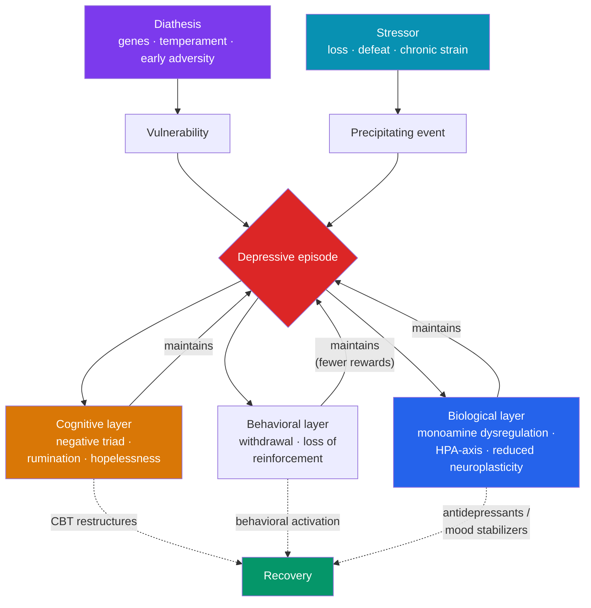

# 🌗 Mood Disorders

> [!abstract] TL;DR
> Mood disorders are treatable conditions in which emotional state — the background "weather" of the mind — becomes stuck, extreme, and impairing. **Major depressive disorder (MDD)** involves persistent low mood or loss of interest plus cognitive, physical, and behavioral symptoms lasting ≥2 weeks. **Bipolar disorder** adds episodes of **mania** (bipolar I) or **hypomania** (bipolar II) — periods of elevated or irritable mood and heightened energy — making it fundamentally different from unipolar depression despite the shared depressive episodes. Biological accounts center on the **monoamine hypothesis** (and its well-documented limits); psychological accounts center on **Beck's cognitive theory** and **learned helplessness**. Evidence-based treatment combines **CBT** and **antidepressants** for depression, and **mood stabilizers** (notably lithium) for bipolar disorder — with the crucial caveat that antidepressants alone can destabilize bipolar disorder.

> [!info] Educational content, not diagnosis
> Sadness is not depression, and this note is educational, not diagnostic or medical advice. Mood disorders are common, serious, and highly treatable medical conditions. If you or someone you know is struggling — especially with thoughts of self-harm — please contact a qualified professional or a crisis line. Recovery is the expected outcome with treatment.

## Intuition — analogy FIRST

Think of mood as the **climate**, and emotions as the **weather**.

Weather is momentary — a passing storm of grief, a sunny hour of joy. Climate is the slow-moving baseline that shapes which weather is even possible. A healthy climate has range: it rains and clears, warms and cools, and always returns toward a livable set point.

Mood disorders are disorders of **climate, not weather**. In depression, the climate settles into a persistent overcast that no single good day can lift — the set point itself has dropped, so even genuinely pleasant events fail to warm things up (this is *anhedonia*, the loss of the ability to feel pleasure). In bipolar disorder, the climate swings between extended droughts of depression and overheated stretches of mania, each lasting days to weeks, not minutes. The key clinical distinction is **duration and pervasiveness**: everyone has bad weather; a mood disorder is a change in the climate.

---

## How It Works — Convergent Causes of a Depressive Episode

## Key Concepts / Details

### Major Depressive Disorder (MDD)

DSM-5-TR requires ≥5 symptoms during the same 2-week period, representing a change from baseline, and **at least one** must be depressed mood or loss of interest/pleasure (anhedonia). A common mnemonic is **SIG E CAPS**:

| | Symptom domain |
|---|---|
| **S** | **S**leep disturbance (insomnia or hypersomnia) |
| **I** | Loss of **I**nterest / pleasure (anhedonia) |
| **G** | **G**uilt or worthlessness |
| **E** | Loss of **E**nergy / fatigue |
| **C** | **C**oncentration difficulties |
| **A** | **A**ppetite / weight change |
| **P** | **P**sychomotor agitation or retardation |
| **S** | **S**uicidal ideation |

- **Course:** episodic and recurrent; a single untreated episode often lasts 6–12 months, and risk of recurrence rises with each episode.
- **Persistent depressive disorder (dysthymia):** chronic, lower-grade depressed mood lasting ≥2 years.
- **Related specifiers/conditions:** peripartum onset, seasonal pattern, and premenstrual dysphoric disorder.
- Depression is a leading cause of disability worldwide and carries elevated suicide risk — a reason it is treated as a serious medical condition, not a mood one can simply "snap out of."

### Bipolar Disorder

The defining feature is **at least one manic or hypomanic episode**, which shifts the diagnosis out of the unipolar category entirely.

| | Bipolar I | Bipolar II |
|---|---|---|
| **Key episode** | ≥1 full **manic** episode (≥1 week or hospitalization) | ≥1 **hypomanic** episode + ≥1 major depressive episode |
| **Mania severity** | Marked impairment, may include psychosis | Milder ("hypo-"), no marked impairment/psychosis |
| **Depression required?** | Not required for diagnosis (but usual) | Required |

**Mania** = a distinct period of abnormally elevated, expansive, or irritable mood **and** increased energy, plus symptoms often remembered as **DIG FAST**: **D**istractibility, **I**ndiscretion/impulsivity, **G**randiosity, **F**light of ideas, **A**ctivity increase, decreased **S**leep need, **T**alkativeness. Manic episodes can involve psychotic features and risky behavior; **hypomania** is a milder version without marked impairment or psychosis.

- **Cyclothymic disorder:** chronic fluctuating hypomanic and depressive symptoms not meeting full episode criteria (≥2 years).
- Bipolar disorder is **highly heritable** — among the most heritable psychiatric conditions — underscoring a strong biological diathesis.

### Biological Explanations — The Monoamine Hypothesis and Its Limits

The **monoamine hypothesis** proposes that depression results from a deficiency of monoamine neurotransmitters — **serotonin, norepinephrine, and dopamine** — at synapses. It arose from serendipity: drugs that deplete monoamines (reserpine) induced depression, while drugs that raise them (MAOIs, tricyclics, later SSRIs) relieved it.

> [!warning] The monoamine hypothesis is incomplete
> It cannot be the whole story. **(1) The timing problem:** antidepressants raise synaptic monoamines within hours, but mood improves only after **2–6 weeks** — so a simple "low serotonin" account fails. **(2) Depletion studies:** experimentally lowering serotonin does not reliably cause depression in healthy people. **(3) The 2022 umbrella review** (Moncrieff et al.) found no consistent evidence that depression is caused by low serotonin. Current thinking emphasizes **downstream neuroplasticity** — antidepressants may work by promoting BDNF-driven synaptic and neurogenic changes, and by modulating the **HPA-axis** stress response — not by simply "topping up" a chemical. The takeaway is nuance, not dismissal: antidepressants help many people; the *mechanism* is more complex than the marketing slogan "chemical imbalance."

Other biological factors: HPA-axis hyperactivity and elevated cortisol, disrupted circadian and sleep architecture, reduced hippocampal volume, and inflammation.

### Psychological Explanations

**Beck's cognitive theory.** Aaron Beck proposed that depression is maintained by systematic negative thinking. Its core is the **negative cognitive triad** — persistently negative views of the **self** ("I am worthless"), the **world** ("everything is against me"), and the **future** ("it will never improve"). These are driven by **negative schemas** (formed by early experience) and **cognitive distortions** (all-or-nothing thinking, overgeneralization, catastrophizing). This theory is the direct foundation of CBT — see [[Cognitive_Behavioral_Therapy]].

**Learned helplessness.** Martin Seligman found that dogs (and later humans) exposed to **uncontrollable** aversive events stopped trying to escape even when escape became possible — they had learned that responding was futile. The reformulated model added **attributional style**: depression is likelier in people who explain bad events as **internal, stable, and global** ("it's my fault, it always happens, it ruins everything"). This **hopelessness theory** links the cognitive and behavioral accounts. (Seligman's later work notes the finding is really that *helplessness* is the default and *control* is learned — but the depressive attributional pattern remains robust.)

**Behavioral account.** Reduced positive reinforcement (Lewinsohn): withdrawal → fewer rewarding experiences → deeper withdrawal, a self-reinforcing spiral that **behavioral activation** targets directly.

### Evidence-Based Treatment

| Condition | First-line psychotherapy | First-line pharmacotherapy | Notes |
|---|---|---|---|
| **MDD** | **CBT**, behavioral activation, interpersonal therapy (IPT) | **SSRIs / SNRIs** | Combination often best for moderate–severe; effects build over weeks |
| **Bipolar disorder** | Psychoeducation, CBT, family-focused therapy (as adjuncts) | **Mood stabilizers** — lithium, valproate, lamotrigine; some atypical antipsychotics | **Antidepressant monotherapy can trigger mania** — must be paired with a stabilizer |
| **Severe / treatment-resistant** | — | ECT (highly effective, esp. for severe/psychotic/suicidal depression); ketamine/esketamine; TMS | ECT remains the most effective acute treatment for severe depression |

- **Lithium** is a first-line mood stabilizer with the added benefit of reducing suicide risk; it requires blood-level monitoring due to a narrow therapeutic window.
- **Maintenance matters:** because both disorders recur, continuing treatment after remission substantially lowers relapse risk.

## Real-World Notes

- **The bipolar diagnostic delay.** Because people usually seek help during depression (not mania), bipolar disorder is frequently misdiagnosed as unipolar depression for years — and treated with antidepressants alone, which can precipitate mania. Screening for past manic/hypomanic episodes is essential.
- **Anhedonia is the quiet core.** The most disabling feature is often not sadness but the loss of interest and pleasure — a reason depression can look like "flatness" or exhaustion rather than crying.
- **Depression is not weakness.** Willpower-based advice ("cheer up," "get out more") misunderstands the biology and cognition involved and can deepen guilt. Effective help is treatment plus support, not exhortation.
- **High comorbidity with anxiety.** Anxiety and mood disorders overlap heavily and share vulnerabilities — see [[Anxiety_and_OCD_Disorders]].

## Common Pitfalls

- **Treating bipolar depression like unipolar depression.** The single most consequential error: antidepressants without a mood stabilizer risk triggering mania or rapid cycling.
- **Reducing depression to "low serotonin."** The monoamine hypothesis is a useful but incomplete model; presenting it as settled fact overstates the science and can set up disillusionment when a first drug doesn't work.
- **Confusing sadness or grief with MDD.** Normal sadness and bereavement are context-appropriate and time-limited; MDD is pervasive, persistent, and impairing. (The DSM-5 removed the automatic "bereavement exclusion," but clinical judgment about context remains essential — see [[Models_of_Abnormality]].)
- **Assuming mania feels bad to the person.** Early mania can feel euphoric and productive, which is why insight is often low and people resist treatment — the damage (financial, relational, legal) frequently becomes clear only afterward.

## Related Concepts

- [[_MOC_Abnormal_Psychology|↑ Section MOC]]
- [[Models_of_Abnormality]] — The diathesis-stress and biopsychosocial frameworks behind mood-disorder onset
- [[Anxiety_and_OCD_Disorders]] — Highly comorbid; shared cognitive and biological vulnerabilities
- [[Schizophrenia_and_Psychosis]] — Overlap at the boundary: psychotic depression, mania with psychosis, and schizoaffective disorder
- [[Personality_and_Neurodevelopmental_Disorders]] — Mood instability in borderline PD vs. episodic mood disorders
- Cross-vault: [[Cognitive_Behavioral_Therapy]] — Grows directly out of Beck's cognitive theory of depression

## Review Questions

1. State the **monoamine hypothesis** and give three specific reasons it is considered incomplete. What do current neuroplasticity-based accounts propose instead, and why does the delayed onset of antidepressant effect matter for the argument?
2. Describe **Beck's negative cognitive triad** and the **reformulated learned-helplessness (hopelessness) theory**. How does each translate into a specific component of treatment (cognitive restructuring vs. behavioral activation)?
3. Why is it clinically critical to distinguish bipolar disorder from unipolar MDD *before* prescribing? Explain the mania risk and name the first-line class of medication used to stabilize bipolar disorder.

## Sources

- American Psychiatric Association (2022). *Diagnostic and Statistical Manual of Mental Disorders, Fifth Edition, Text Revision (DSM-5-TR)*. APA Publishing.
- Beck, A.T. (1967). *Depression: Clinical, Experimental, and Theoretical Aspects*. Harper & Row.
- Abramson, L.Y., Metalsky, G.I. & Alloy, L.B. (1989). "Hopelessness depression: A theory-based subtype of depression." *Psychological Review*, 96(2), 358–372.
- Moncrieff, J. et al. (2022). "The serotonin theory of depression: a systematic umbrella review of the evidence." *Molecular Psychiatry*, 28, 3243–3256.

#psychology #abnormal-psychology #depression #bipolar #mood-disorders
