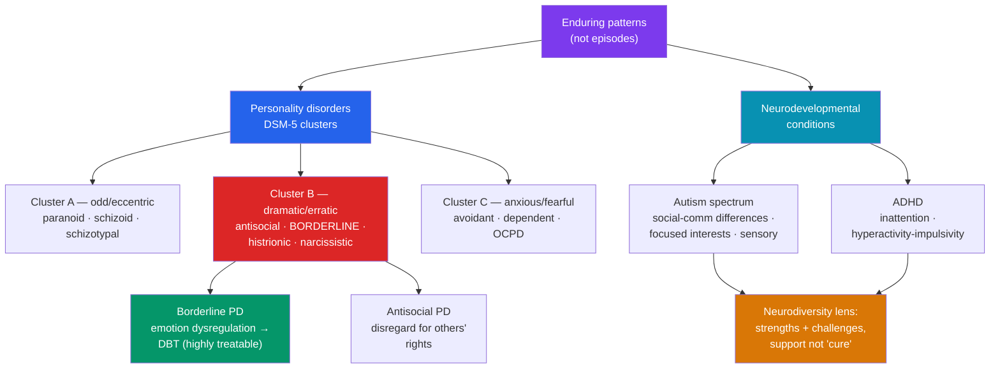

# 🧩 Personality and Neurodevelopmental Disorders

> [!abstract] TL;DR
> This note covers two very different families that share a common thread: they concern **enduring patterns** rather than discrete episodes. **Personality disorders** are pervasive, inflexible patterns of inner experience and behavior that deviate from cultural expectations and cause distress or impairment; the DSM-5 groups ten into **three clusters** — A (odd/eccentric), B (dramatic/erratic), and C (anxious/fearful) — illustrated here by **borderline** and **antisocial** PD. **Neurodevelopmental conditions** — **autism spectrum** and **ADHD** — begin in development and reflect differences in how the brain processes information. Modern, evidence-based framing treats these through a **neurodiversity-aware lens**: real challenges that deserve support and accommodation, paired with genuine strengths, and described in the person's own preferred terms. Both families are widely misunderstood and heavily stigmatized; accuracy and respect are part of getting the science right.

> [!info] Educational content, not diagnosis
> This note is educational, not diagnostic or medical advice. Personality-disorder labels have a difficult history of being used dismissively; current practice emphasizes that these are understandable responses to temperament and (often) early adversity, and that conditions like borderline PD are **highly treatable**. Autism and ADHD are lifelong forms of neurodivergence, not diseases to be "cured." People-first *and* identity-first language both appear here because communities differ in preference — always follow the individual's lead.

## Intuition — analogy FIRST

Think of personality as the **operating system** and episodic disorders as the **apps**.

An app (a depressive episode, a panic attack) launches, runs for a while, and closes; you can point to when it started and when it ended. The operating system is different — it is always running underneath, shaping how *every* app behaves. You don't "catch" an OS; it's the persistent style in which the whole system operates.

**Personality disorders** are OS-level patterns: pervasive, long-standing, and touching most areas of life, which is why they can't be "cured" in two weeks like an episode — but the OS *can* be updated, which is exactly what modern therapies do. **Neurodevelopmental conditions** are more like a **different OS architecture entirely** — not a corrupted version of the "standard" system, but a genuinely different one with its own strengths (different attention allocation, pattern recognition, deep focus) and its own friction points in a world built for the majority architecture. The neurodiversity lens asks us to stop calling every difference a "bug."

---

## How It Works — Two Families of Enduring Patterns

## Key Concepts / Details

### What Makes a Pattern a Personality Disorder

A **personality disorder** is an enduring pattern of inner experience and behavior that is **pervasive and inflexible**, **deviates markedly** from cultural expectations, has **onset by adolescence/early adulthood**, is **stable over time**, and leads to **distress or impairment**. The pattern shows across cognition, affect, interpersonal functioning, and impulse control. Because personality is still developing, PDs are diagnosed cautiously (or not at all) before adulthood.

### The Three Clusters

| Cluster | Theme | Disorders | Quick descriptor |
|---|---|---|---|
| **A** | Odd / eccentric | Paranoid, Schizoid, Schizotypal | Social detachment or distrust; schizotypal shares a genetic spectrum with [[Schizophrenia_and_Psychosis]] |
| **B** | Dramatic / emotional / erratic | Antisocial, **Borderline**, Histrionic, Narcissistic | Emotional intensity, impulsivity, unstable relationships |
| **C** | Anxious / fearful | Avoidant, Dependent, Obsessive-compulsive (OCPD) | Pervasive anxiety; overlaps with [[Anxiety_and_OCD_Disorders]] |

> [!note] Categorical vs. dimensional — a live debate
> The cluster system is criticized for weak validity and heavy overlap (many people meet criteria for several PDs). The DSM-5 therefore includes an **Alternative Model for Personality Disorders (AMPD)** based on level of personality functioning plus five **trait domains** (negative affectivity, detachment, antagonism, disinhibition, psychoticism — echoing the Big Five). The **ICD-11 abandoned categories entirely**, rating personality dysfunction by **severity** plus trait qualifiers. The field is moving from "which type?" toward "how severe, and along which dimensions?" — see [[Models_of_Abnormality]].

### Borderline Personality Disorder (BPD) — Cluster B

Characterized by a **pervasive pattern of instability** in relationships, self-image, and emotions, plus marked impulsivity. DSM-5 lists nine criteria (≥5 needed), including frantic efforts to avoid abandonment, unstable intense relationships, identity disturbance, impulsivity, recurrent self-harm or suicidal behavior, affective instability, chronic emptiness, intense anger, and transient stress-related paranoia/dissociation.

- **Etiology (biosocial model, Linehan):** a biological predisposition to **emotional vulnerability** (intense, easily triggered, slow-to-recover emotions) interacting with an **invalidating environment** — a diathesis-stress account. Childhood trauma/adversity is common but neither necessary nor sufficient.
- **Treatment — a success story:** **Dialectical Behavior Therapy (DBT)** — developed specifically for BPD — has strong evidence for reducing self-harm and improving functioning, combining acceptance and change strategies with skills in mindfulness, distress tolerance, emotion regulation, and interpersonal effectiveness. Other effective approaches: mentalization-based treatment (MBT), transference-focused and schema therapy. **Long-term prognosis is good** — most people improve substantially and many achieve remission.

> [!warning] Stigma alert — BPD
> "Borderline" is one of the most stigmatized labels in mental health, sometimes used pejoratively even by clinicians. This is unjust: BPD reflects profound emotional pain and is among the **most treatable** personality disorders. People-first, non-blaming language and evidence-based therapy — not dismissal — are the standard of care.

### Antisocial Personality Disorder (ASPD) — Cluster B

A pervasive pattern of **disregard for and violation of the rights of others** since age 15 (with evidence of conduct disorder before 15), diagnosed only in adults (≥18). Features include deceitfulness, impulsivity, irritability/aggression, reckless disregard for safety, irresponsibility, and lack of remorse.

- **ASPD vs. psychopathy:** these overlap but are **not identical**. Psychopathy (measured by Hare's PCL-R) emphasizes callous-unemotional traits and shallow affect; ASPD is defined more by observable **antisocial behavior**. Most people with ASPD are not "psychopaths," and the term "psychopath" is not a DSM diagnosis.
- **Etiology:** gene–environment interplay — reduced fear conditioning and amygdala/prefrontal differences, interacting with adverse rearing (a diathesis-stress pattern). Not "born evil"; conduct problems in childhood are a developmental precursor.
- **Treatment:** historically difficult; the focus is on managing behavior, treating comorbid substance use, and early intervention in conduct disorder. Sensationalized media portrayals badly distort a condition that mostly involves chronic impulsivity and interpersonal harm, not dramatic villainy.

### Neurodevelopmental Conditions — A Neurodiversity-Aware Lens

Neurodevelopmental conditions emerge in the developmental period and reflect **differences in brain development**, not acquired illness. The **neurodiversity paradigm** reframes them as natural variations in human cognition — real support needs *and* genuine strengths — rather than deficits to be erased. This lens is now mainstream in research and self-advocacy, alongside continued attention to the substantial challenges many people face.

**Autism Spectrum Disorder (ASD).** DSM-5 defines ASD by two core domains: (1) persistent differences in **social communication and interaction**, and (2) **restricted, repetitive patterns** of behavior, interests, or activities, including **sensory** sensitivities. Key points:

- It is a **spectrum** with wide variation in support needs (DSM-5 uses Levels 1–3); "high/low functioning" labels are discouraged by many autistic people as misleading.
- Strengths often include deep focus, pattern recognition, honesty, and expertise in areas of interest; challenges often involve social-communication mismatch, sensory overload, and executive function.
- The **double empathy problem** (Milton): communication difficulty is **mutual** — a mismatch between autistic and non-autistic styles — not a one-sided deficit.
- **Support, not cure:** evidence-based support focuses on communication, skills, accommodations, and mental-health care. The old vaccine-autism claim is **thoroughly debunked and fraudulent**; autism is highly heritable and neurodevelopmental.

**Attention-Deficit/Hyperactivity Disorder (ADHD).** Defined by developmentally excessive, impairing **inattention** and/or **hyperactivity-impulsivity** present before age 12 in multiple settings. Presentations: predominantly inattentive, predominantly hyperactive-impulsive, or combined.

- Best understood as differences in **executive function and self-regulation** (Barkley) — working memory, sustained attention, inhibition, and time management — often with **interest-based attention** (hyperfocus on engaging tasks) rather than a global inability to attend.
- Highly heritable; involves dopamine/norepinephrine signaling and prefrontal-striatal networks.
- **Treatment:** stimulant medication (methylphenidate, amphetamines) is highly effective and well-evidenced, plus non-stimulants (atomoxetine), behavioral strategies, and environmental accommodations. Often persists into adulthood, where it is frequently under-recognized, especially in women and girls.

| Condition | Core difference | Common strengths | Common challenges | Evidence-based support |
|---|---|---|---|---|
| **Autism (ASD)** | Social-communication style; focused interests; sensory processing | Deep focus, pattern detection, honesty, domain expertise | Social mismatch, sensory overload, transitions | Communication support, accommodations, co-occurring mental-health care |
| **ADHD** | Executive function / self-regulation; attention allocation | Creativity, hyperfocus, energy, divergent thinking | Sustained attention, organization, time, impulsivity | Stimulant/non-stimulant medication, behavioral skills, accommodations |

## Real-World Notes

- **Comorbidity is the rule.** Autism and ADHD frequently co-occur (and DSM-5 now permits dual diagnosis), and both raise the likelihood of anxiety and depression — see [[Anxiety_and_OCD_Disorders]] and [[Mood_Disorders]]. Personality disorders are also highly comorbid with mood and substance-use disorders.
- **Late and missed diagnosis.** Autistic and ADHD adults — particularly women — are often diagnosed late because childhood criteria were built around boys; "masking" (camouflaging traits) can hide difficulties at real psychological cost.
- **Dimensional thinking helps.** Framing personality and neurodevelopment as continua (traits everyone has, to differing degrees) reduces "us vs. them" stigma and matches where classification systems are heading.
- **Accommodation changes outcomes.** For neurodevelopmental conditions, adjusting the environment (predictability, sensory-friendly spaces, flexible deadlines) is often as impactful as treating the person — a social-model insight.

## Common Pitfalls

- **Using "borderline" or "antisocial" as insults.** Both are serious clinical conditions; BPD in particular is highly treatable, and pejorative use worsens the very stigma that deters help-seeking.
- **Equating ASPD with "evil" or with psychopathy.** ASPD is a behavioral pattern with developmental and environmental roots; it is not a synonym for psychopathy, and most people with it are not violent criminals from film.
- **Treating autism/ADHD as diseases to cure.** The evidence base and the affected communities favor **support and accommodation**, not normalization. Framing difference as pure deficit is both inaccurate and harmful.
- **Ignoring strengths — or ignoring challenges.** The neurodiversity lens is a balance: celebrating strengths does not mean denying real impairment, and providing support does not mean pathologizing identity. Hold both.
- **Diagnosing PDs in adolescents casually.** Personality is still forming; premature labeling can be stigmatizing and inaccurate.

## Related Concepts

- [[_MOC_Abnormal_Psychology|↑ Section MOC]]
- [[Models_of_Abnormality]] — Categorical vs. dimensional classification, most contested here
- [[Anxiety_and_OCD_Disorders]] — Cluster C overlaps heavily with chronic anxiety; OCPD vs. OCD distinction
- [[Mood_Disorders]] — Distinguishing BPD's rapid affective instability from bipolar mood episodes
- [[Schizophrenia_and_Psychosis]] — Schizotypal PD shares a genetic spectrum with schizophrenia
- Cross-vault: [[Cognitive_Behavioral_Therapy]] — DBT (for BPD) grew out of the CBT tradition

## Review Questions

1. Define what makes a pattern a **personality disorder**, name the three DSM-5 **clusters** with their themes, and explain why the field is shifting toward **dimensional** models (cite the DSM-5 alternative model and ICD-11).
2. Compare **borderline** and **antisocial** personality disorder in terms of core features and etiology. Why is BPD considered highly treatable, and what specific therapy was designed for it? Distinguish ASPD from psychopathy.
3. Explain the **neurodiversity-aware** framing of autism and ADHD. Using the **double empathy problem** and the idea of executive-function differences, argue why "cure" is the wrong goal and describe two evidence-based supports for each condition.

## Sources

- American Psychiatric Association (2022). *Diagnostic and Statistical Manual of Mental Disorders, Fifth Edition, Text Revision (DSM-5-TR)*. APA Publishing.
- Linehan, M.M. (1993). *Cognitive-Behavioral Treatment of Borderline Personality Disorder*. Guilford Press.
- Milton, D.E.M. (2012). "On the ontological status of autism: the 'double empathy problem'." *Disability & Society*, 27(6), 883–887.
- Barkley, R.A. (1997). "Behavioral inhibition, sustained attention, and executive functions: constructing a unifying theory of ADHD." *Psychological Bulletin*, 121(1), 65–94.

#psychology #abnormal-psychology #personality-disorders #neurodiversity #autism-adhd
