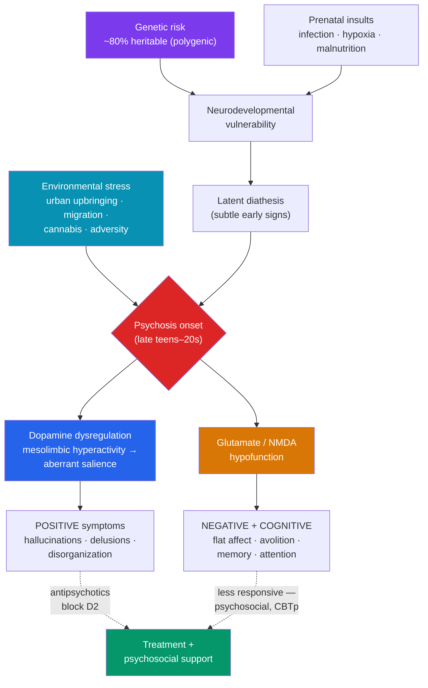

# 🧠 Schizophrenia and Psychosis

> [!abstract] TL;DR
> Schizophrenia is a serious but treatable psychotic disorder in which the ordinary boundaries between internal experience and external reality break down. Its symptoms divide into **positive symptoms** (added experiences: hallucinations, delusions, disorganized thought), **negative symptoms** (subtracted capacities: flat affect, avolition, social withdrawal — often the most disabling and hardest to treat), and **cognitive symptoms** (attention, working memory, executive function). Biological accounts center on the **dopamine hypothesis** (refined to focus on subcortical dopamine dysregulation) with a growing role for **glutamate**. Onset is best explained by the **neurodevelopmental** and **diathesis-stress** models: a genetic/developmental vulnerability interacts with environmental stressors. **Antipsychotics** are the cornerstone of treatment, alongside psychosocial support. A critical, evidence-based point about **stigma**: people with schizophrenia are far more likely to be **victims** of violence than perpetrators.

> [!info] Educational content, not diagnosis — and a note on stigma
> This note is educational, not diagnostic or medical advice. Schizophrenia is among the most stigmatized health conditions, and that stigma is not supported by evidence. Most people with schizophrenia are not violent; when substance use is accounted for, their elevated risk to others is small, and they are **far more often victims than perpetrators**. With treatment and support, many people live full, meaningful lives. Language matters: "a person with schizophrenia," never "a schizophrenic."

## Intuition — analogy FIRST

Imagine a control room where every incoming signal is tagged as **"external"** or **"self-generated."**

Normally this tagging is automatic and flawless: you know that your inner voice is *yours*, that the memory of a face is a memory and not the face itself, that a passing thought is a thought and not a message. This tagging system — sometimes called **source monitoring** — is so reliable you never notice it working.

In psychosis, the tagging system falters. A self-generated inner voice gets mislabeled "external," and now you *hear* someone speaking (a hallucination). A coincidence gets tagged "meaningful and about me," and now a stranger's glance is a coded signal (a delusion of reference). The person isn't "making things up" — from the inside, the mislabeled signals feel *exactly* as real as correctly-labeled ones, because the very system that certifies reality is the one malfunctioning. This is why you cannot argue someone out of a delusion: to them, the evidence of their senses is intact. Understanding this is the beginning of compassion — and of effective, non-confrontational care.

---

## How It Works — Vulnerability, Dopamine, and Symptom Domains

## Key Concepts / Details

### The Symptom Domains

DSM-5-TR requires ≥2 of five characteristic symptoms (at least one of the first three) for a significant portion of one month, with continuous signs for ≥6 months and functional decline.

| Domain | Definition | Examples |
|---|---|---|
| **Positive** (added) | Experiences in excess of normal function | **Hallucinations** (most often auditory — voices), **delusions** (fixed false beliefs: persecutory, grandiose, reference, control), **disorganized speech** (loosening of associations, word salad), grossly disorganized/catatonic behavior |
| **Negative** (subtracted) | Reductions in normal function | **Flat/blunted affect**, **alogia** (poverty of speech), **avolition** (loss of goal-directed drive), **anhedonia**, **asociality** |
| **Cognitive** | Impaired information processing | Deficits in working memory, attention, processing speed, executive function |

> [!note] Why negative symptoms matter most
> The public image of schizophrenia is dominated by positive symptoms, but **negative and cognitive symptoms are usually more predictive of long-term disability** and are far less responsive to current medications. They are also easily mistaken for laziness or depression, which delays understanding and support. Much modern research targets exactly these harder-to-treat domains.

**Related psychotic disorders:** brief psychotic disorder (<1 month), schizophreniform disorder (1–6 months), **schizoaffective disorder** (psychosis + mood episodes — a bridge to [[Mood_Disorders]]), delusional disorder, and substance-induced psychosis.

### The Dopamine Hypothesis (and Glutamate)

The **dopamine hypothesis** originally proposed that psychosis results from **excess dopamine activity**. Two pharmacological clues drove it:

1. **Antipsychotics** (which block **D2 receptors**) reduce positive symptoms — and their clinical potency correlates with D2-binding affinity.
2. **Dopamine agonists** (amphetamines, L-DOPA) can *induce* psychotic symptoms.

The hypothesis has been **substantially refined**:

- The relevant abnormality is **presynaptic dopamine dysregulation in the striatum**, not simply "too much dopamine everywhere."
- A **pathway distinction:** excess **mesolimbic** dopamine → positive symptoms; **deficient mesocortical/prefrontal** dopamine → negative and cognitive symptoms. This explains why D2-blockers help positive symptoms but not negative ones.
- **Aberrant salience** (Kapur): dysregulated dopamine assigns undue significance to neutral stimuli, so ordinary events feel urgently meaningful — the raw material from which delusions and hallucinations are constructed.

**The glutamate hypothesis** complements dopamine: **NMDA-receptor hypofunction** (modeled by drugs like ketamine and PCP, which produce both positive *and* negative symptoms in healthy people) may be a more upstream cause, with dopamine changes downstream. This helps explain the negative and cognitive symptoms that dopamine alone cannot.

### Diathesis-Stress and the Neurodevelopmental Model

Schizophrenia is a paradigm case for **diathesis-stress** (see [[Models_of_Abnormality]]).

- **Diathesis (genetic/developmental):** heritability is high (~80%), but the genetics are **polygenic** — many small-effect variants, not a single "schizophrenia gene." Concordance is ~50% in identical twins, proving genes are necessary but **not sufficient**. Prenatal and perinatal insults (maternal infection, obstetric complications, malnutrition, winter birth) add developmental vulnerability.
- **The neurodevelopmental model:** the disorder is seeded early (subtle prenatal brain-development differences) but expresses in **late adolescence/early adulthood**, when normal synaptic pruning and prefrontal maturation may unmask the latent vulnerability. Enlarged ventricles and gray-matter reductions are observed.
- **Stress (environmental):** urban upbringing, migration and minority status, childhood adversity, and **heavy adolescent cannabis use** (especially high-potency, in the genetically vulnerable) all raise risk. The two-hit idea: an early developmental "hit" plus a later environmental "hit."

Because most people with the diathesis never develop the disorder, prevention and early-intervention efforts focus on reducing modifiable stressors and treating the **prodrome** and first episode promptly.

### Treatment

| Approach | What it does | Notes |
|---|---|---|
| **First-generation (typical) antipsychotics** | Strong D2 blockade (haloperidol, chlorpromazine) | Effective for positive symptoms; higher risk of **extrapyramidal side effects** and tardive dyskinesia |
| **Second-generation (atypical) antipsychotics** | D2 + serotonin (5-HT2A) action (risperidone, olanzapine, aripiprazole) | First-line; fewer motor effects but metabolic side effects (weight, glucose, lipids) |
| **Clozapine** | Unique efficacy in treatment-resistant cases | Requires blood monitoring (agranulocytosis risk); reduces suicide risk |
| **Psychosocial** | CBT for psychosis (CBTp), family psychoeducation, social-skills training, supported employment | Improves function, adherence, and negative-symptom outcomes; reduces relapse |
| **Early intervention** | Coordinated specialty care for first-episode psychosis | Earlier treatment (shorter **duration of untreated psychosis**) predicts better outcomes |

- Antipsychotics primarily target **positive** symptoms; **negative and cognitive** symptoms respond poorly, which is why psychosocial care is essential rather than optional.
- **Prognosis is heterogeneous:** outcomes range widely; a substantial proportion achieve meaningful recovery, and the old assumption of inevitable decline is outdated.

### Combating Stigma — What the Evidence Says

- **Violence.** The association between schizophrenia and violence is small and is largely explained by co-occurring substance use; the overwhelming majority of people with schizophrenia are never violent. They are **several times more likely to be victims** of violence than the general population.
- **Recovery is real.** Stigmatizing narratives of "hopeless deterioration" are contradicted by long-term follow-up studies showing wide-ranging outcomes including full recovery.
- **Language and framing.** Person-first language, focusing on the person's goals, and challenging media caricatures all measurably reduce stigma and improve help-seeking.

## Real-World Notes

- **The prodrome and early intervention.** Psychosis is usually preceded by a **prodromal** phase (social withdrawal, odd beliefs, declining function). Reducing the **duration of untreated psychosis** improves outcomes — a major rationale for early-intervention services.
- **Insight varies.** Reduced insight (**anosognosia**) is itself a feature of the illness, not stubbornness; it complicates treatment adherence and calls for collaborative, non-coercive engagement.
- **Suicide risk is elevated**, particularly early in the illness and with retained insight into losses — a reason integrated care and support are vital.
- **Hallucinations are not unique to schizophrenia.** They occur in mood disorders with psychotic features, delirium, substance use, and even in the general population at subclinical levels — diagnosis depends on the full clinical picture (see [[Models_of_Abnormality]]).

## Common Pitfalls

- **Equating schizophrenia with "split personality."** Schizophrenia is not dissociative identity disorder; the "split" refers historically to a split between thought and emotion/reality, not multiple personalities. This confusion fuels misunderstanding.
- **Assuming dangerousness.** The stereotype of the "violent schizophrenic" is statistically wrong and actively harmful; it deters help-seeking and worsens isolation. Correct it explicitly.
- **Treating "positive/negative" as "good/bad."** *Positive* means *added* (symptoms present) and *negative* means *subtracted* (capacities lost) — not desirable vs. undesirable. Negative symptoms are, if anything, more disabling.
- **Reading the dopamine hypothesis as complete.** D2 blockade treats positive symptoms but leaves negative and cognitive symptoms largely untouched — direct evidence that dopamine excess is only part of the picture, with glutamate and neurodevelopment also implicated.

## Related Concepts

- [[_MOC_Abnormal_Psychology|↑ Section MOC]]
- [[Models_of_Abnormality]] — The diathesis-stress and neurodevelopmental frameworks in their purest form
- [[Mood_Disorders]] — Schizoaffective disorder and psychotic depression sit at the boundary between the two
- [[Anxiety_and_OCD_Disorders]] — Contrast: obsessions are recognized as one's own (ego-dystonic); delusions are held with conviction
- [[Personality_and_Neurodevelopmental_Disorders]] — Schizotypal personality shares a genetic spectrum with schizophrenia
- Cross-vault: [[Cognitive_Behavioral_Therapy]] — CBT for psychosis (CBTp) as an evidence-based adjunct

## Review Questions

1. Distinguish **positive**, **negative**, and **cognitive** symptoms with examples, and explain why negative symptoms are often more disabling and harder to treat than the positive symptoms that dominate public perception.
2. State the original **dopamine hypothesis**, then explain three ways it has been refined (pathway specificity, presynaptic dysregulation, aberrant salience) and how the **glutamate/NMDA** hypothesis addresses its gaps.
3. Using the **diathesis-stress** and **neurodevelopmental** models, explain why ~50% twin concordance shows that genes are necessary but not sufficient, and identify two environmental stressors that raise risk. Then correct the common but false claim that people with schizophrenia are usually dangerous.

## Sources

- American Psychiatric Association (2022). *Diagnostic and Statistical Manual of Mental Disorders, Fifth Edition, Text Revision (DSM-5-TR)*. APA Publishing.
- Howes, O.D. & Kapur, S. (2009). "The dopamine hypothesis of schizophrenia: version III — the final common pathway." *Schizophrenia Bulletin*, 35(3), 549–562.
- Kapur, S. (2003). "Psychosis as a state of aberrant salience." *American Journal of Psychiatry*, 160(1), 13–23.
- Fazel, S. et al. (2009). "Schizophrenia and violence: systematic review and meta-analysis." *PLoS Medicine*, 6(8), e1000120.

#psychology #abnormal-psychology #schizophrenia #psychosis #stigma
