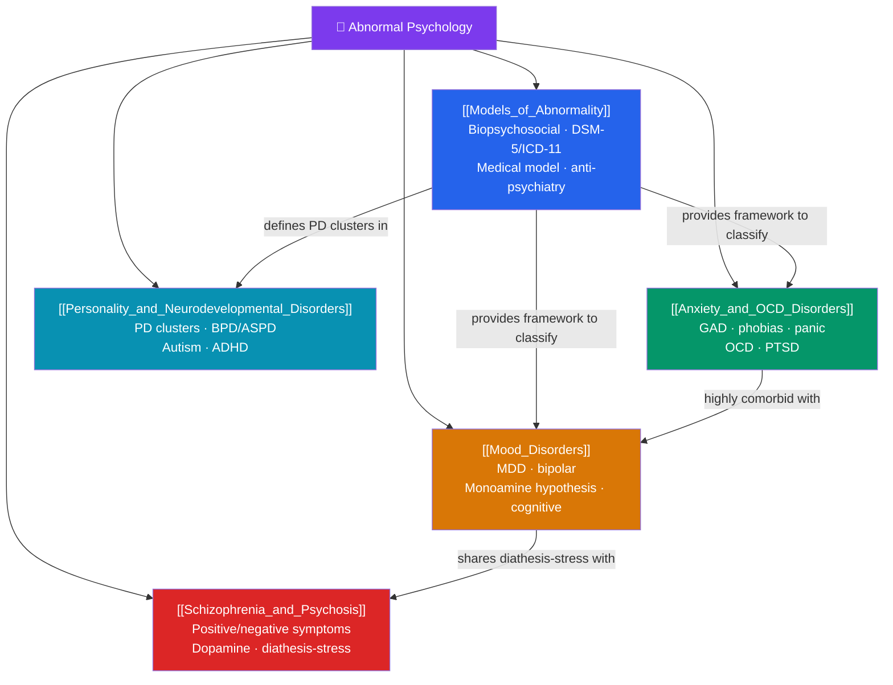

# 🧩 Abnormal Psychology — Map of Content

> [!abstract] What This Section Covers
> Abnormal psychology studies psychological disorders — how they are defined, classified, explained, and treated. This section opens with the deep question of what "abnormal" even means and the **models** used to answer it, from the biopsychosocial framework to the DSM-5 and its critics. It then surveys the major diagnostic families: the **anxiety and OCD-related disorders**, the **mood disorders**, **schizophrenia and other psychoses**, and finally the **personality and neurodevelopmental disorders**. Throughout, the emphasis is on etiology (biological, cognitive, and social causes) and evidence-based treatment. Together these five notes map the landscape of mental disorder without losing sight of the person behind the diagnosis.

## Concept Map

## Learning Path

1. [[Models_of_Abnormality]] — Defining abnormality, the biopsychosocial model, DSM-5 and ICD-11, and the medical-model debate and anti-psychiatry.
2. [[Anxiety_and_OCD_Disorders]] — Generalized anxiety, specific phobias, panic disorder, OCD, and PTSD — their etiology and treatment.
3. [[Mood_Disorders]] — Major depressive disorder, bipolar disorder, the monoamine hypothesis, and cognitive theories of depression.
4. [[Schizophrenia_and_Psychosis]] — Positive and negative symptoms, the dopamine hypothesis, and the diathesis-stress model.
5. [[Personality_and_Neurodevelopmental_Disorders]] — The DSM personality-disorder clusters, borderline and antisocial PD, autism spectrum, and ADHD.

## All Notes at a Glance

| Note | Difficulty | What You'll Learn |
|------|------------|-------------------|
| [[Models_of_Abnormality]] | Beginner → Intermediate | The 4 D's, biopsychosocial model, DSM-5 vs. ICD-11, categorical vs. dimensional, anti-psychiatry critiques |
| [[Anxiety_and_OCD_Disorders]] | Intermediate | GAD, phobias, panic disorder, OCD, PTSD, fear conditioning, cognitive models, CBT & exposure, SSRIs |
| [[Mood_Disorders]] | Intermediate | MDD and bipolar I/II, the monoamine hypothesis, Beck's cognitive triad, learned helplessness, treatments |
| [[Schizophrenia_and_Psychosis]] | Intermediate → Advanced | Positive/negative/cognitive symptoms, dopamine hypothesis, diathesis-stress, antipsychotics, prognosis |
| [[Personality_and_Neurodevelopmental_Disorders]] | Intermediate → Advanced | Clusters A/B/C, borderline & antisocial PD, autism spectrum, ADHD, developmental etiology |

## Key Questions This Section Answers

- What criteria distinguish a mental disorder from ordinary distress or difference?
- Why do anxiety and depression co-occur so often?
- What does the monoamine hypothesis get right — and where does it fall short?
- How does the diathesis-stress model explain why not everyone at risk develops schizophrenia?
- Are personality disorders best understood as categories or as extremes on continuous dimensions?

## Related Sections

- [[_MOC_Psychology_Master|↑ Psychology Master MOC]]
- [[_MOC_Cross_Cultural_Psychology|← Cross-Cultural Psychology]]
- Cross-vault: [[Cognitive_Behavioral_Therapy]] — the front-line evidence-based treatment for most of these disorders

#MOC #Psychology #AbnormalPsychology
