# 🧠 Psychology — Master Map of Content

> [!abstract] About This Vault
> A comprehensive psychology reference: **37 notes across 6 sections**, covering the full spectrum from biological foundations to clinical applications. It runs from the historical roots and neuroscience underpinnings, through cognitive mechanisms (memory, attention, decision-making, bias), social forces (conformity, persuasion, group dynamics), developmental arcs (Piaget, Erikson, attachment), the drivers of motivation and emotion, and into applied fields (CBT, positive psychology, behavioral economics, organizational behavior). Every note pairs intuition-first analogies with landmark experiments, key theories, real-world applications, and review questions. Cross-linked to [[Game_Theory]], [[Microeconomics]], and [[Behavioral Finance]]. Start at the section matching your goal or follow one of the four learning paths.

## Vault Architecture

```mermaid
graph TD
    Master["🧠 Psychology Master"]

    Master --> S01["01 Foundations"]
    Master --> S02["02 Cognitive Psychology"]
    Master --> S03["03 Social Psychology"]
    Master --> S04["04 Developmental Psychology"]
    Master --> S05["05 Motivation & Emotion"]
    Master --> S06["06 Clinical & Applied"]

    S01 --> S01a["History & Schools"]
    S01 --> S01b["Research Methods"]
    S01 --> S01c["Biological Basis"]
    S01 --> S01d["Sensation & Perception"]
    S01 --> S01e["States of Consciousness"]

    S02 --> S02a["Memory Systems"]
    S02 --> S02b["Attention & Cognitive Load"]
    S02 --> S02c["Language & Thought"]
    S02 --> S02d["Problem Solving & Decisions"]
    S02 --> S02e["Cognitive Biases"]

    S03 --> S03a["Social Influence & Conformity"]
    S03 --> S03b["Attitudes & Persuasion"]
    S03 --> S03c["Group Dynamics"]
    S03 --> S03d["Prejudice & Discrimination"]
    S03 --> S03e["Prosocial Behavior"]

    S04 --> S04a["Piaget's Cognitive Dev"]
    S04 --> S04b["Attachment Theory"]
    S04 --> S04c["Language Development"]
    S04 --> S04d["Moral Development"]
    S04 --> S04e["Lifespan Development"]

    S05 --> S05a["Theories of Motivation"]
    S05 --> S05b["Maslow's Hierarchy"]
    S05 --> S05c["Emotion Theories"]
    S05 --> S05d["Stress & Coping"]
    S05 --> S05e["Happiness & Wellbeing"]

    S06 --> S06a["Psychological Disorders"]
    S06 --> S06b["CBT"]
    S06 --> S06c["Positive Psychology"]
    S06 --> S06d["Behavioral Economics"]
    S06 --> S06e["Organizational Psychology"]

    style Master fill:#7c3aed,color:#fff
    style S01 fill:#2563eb,color:#fff
    style S02 fill:#059669,color:#fff
    style S03 fill:#d97706,color:#fff
    style S04 fill:#dc2626,color:#fff
    style S05 fill:#db2777,color:#fff
    style S06 fill:#0891b2,color:#fff
```

## Sections at a Glance

| # | Section | Notes | Entry Point | Difficulty |
|---|---------|-------|-------------|------------|
| 01 | Foundations | 5 | [[_MOC_Psychology_Foundations]] | Beginner |
| 02 | Cognitive Psychology | 5 | [[_MOC_Cognitive_Psychology]] | Beginner → Intermediate |
| 03 | Social Psychology | 5 | [[_MOC_Social_Psychology]] | Intermediate |
| 04 | Developmental Psychology | 5 | [[_MOC_Developmental_Psychology]] | Intermediate |
| 05 | Motivation & Emotion | 5 | [[_MOC_Motivation_Emotion]] | Beginner → Intermediate |
| 06 | Clinical & Applied | 5 | [[_MOC_Clinical_Applied]] | Intermediate → Advanced |

---

## Learning Paths

### Path 1 — Student (General Psychology Survey)

> Best for: undergraduates, curious learners building a broad foundation in psychology.

**Foundations → Development → Cognition → Social → Motivation → Applied**

[[_MOC_Psychology_Foundations]] → [[History_and_Schools_of_Psychology]] → [[Biological_Basis_of_Behavior]] → [[_MOC_Developmental_Psychology]] → [[Piagets_Cognitive_Development]] → [[Attachment_Theory]] → [[_MOC_Cognitive_Psychology]] → [[Memory_Systems]] → [[Cognitive_Biases]] → [[_MOC_Social_Psychology]] → [[Social_Influence_and_Conformity]] → [[_MOC_Motivation_Emotion]] → [[Maslows_Hierarchy]] → [[_MOC_Clinical_Applied]] → [[Psychological_Disorders_Overview]]

---

### Path 2 — Clinician / Therapist

> Best for: mental health practitioners, counseling students, and anyone working in therapeutic contexts.

**Foundations → Disorders → CBT → Emotion → Wellbeing → Developmental**

[[Biological_Basis_of_Behavior]] → [[States_of_Consciousness]] → [[_MOC_Clinical_Applied]] → [[Psychological_Disorders_Overview]] → [[Cognitive_Behavioral_Therapy]] → [[Positive_Psychology]] → [[_MOC_Motivation_Emotion]] → [[Stress_and_Coping]] → [[Happiness_and_Wellbeing]] → [[Emotion_Theories]] → [[_MOC_Developmental_Psychology]] → [[Attachment_Theory]] → [[Moral_Development]]

---

### Path 3 — Business / UX Professional

> Best for: product managers, UX designers, marketers, and organizational leaders who want to apply psychology.

**Cognition → Biases → Social → Persuasion → Behavioral Economics → Org Psychology**

[[_MOC_Cognitive_Psychology]] → [[Attention_and_Cognitive_Load]] → [[Memory_Systems]] → [[Cognitive_Biases]] → [[Problem_Solving_and_Decision_Making]] → [[_MOC_Social_Psychology]] → [[Attitudes_and_Persuasion]] → [[Social_Influence_and_Conformity]] → [[Group_Dynamics]] → [[_MOC_Clinical_Applied]] → [[Behavioral_Economics_Psychology]] → [[Organizational_Psychology]] → [[Positive_Psychology]]

---

### Path 4 — Researcher

> Best for: psychology researchers, behavioral scientists, and academics wanting methodological grounding.

**Research Methods → Biological → Cognitive → Social Experiments → Statistical Rigor**

[[Research_Methods_Psychology]] → [[Biological_Basis_of_Behavior]] → [[Sensation_and_Perception]] → [[_MOC_Cognitive_Psychology]] → [[Memory_Systems]] → [[Language_and_Thought]] → [[_MOC_Social_Psychology]] → [[Social_Influence_and_Conformity]] → [[Prejudice_and_Discrimination]] → [[_MOC_Developmental_Psychology]] → [[Lifespan_Development]] → [[Moral_Development]]

---

## Cross-Vault Links

- **[[Game_Theory]]** — Strategic decision-making intersects with [[Cognitive_Biases]], [[Behavioral_Economics_Psychology]], and [[Problem_Solving_and_Decision_Making]] (bounded rationality, prospect theory, Nash equilibria in social behavior)
- **[[Microeconomics]]** — Consumer utility theory connects to [[Maslows_Hierarchy]], [[Theories_of_Motivation]], and [[Behavioral_Economics_Psychology]] (rational actor model vs. psychological reality)
- **[[Behavioral Finance]]** — Loss aversion, mental accounting, and herding behavior bridge [[Cognitive_Biases]], [[Emotion_Theories]], and [[Group_Dynamics]]

---

## Section MOC Index

- [[_MOC_Psychology_Foundations]] — The bedrock: historical schools, research methods, neuroscience of behavior, perception, and consciousness.
- [[_MOC_Cognitive_Psychology]] — Mental processes: memory systems, attention, language, decision-making, and cognitive biases.
- [[_MOC_Social_Psychology]] — Human in context: conformity, persuasion, group behavior, prejudice, and altruism.
- [[_MOC_Developmental_Psychology]] — Change across time: Piaget, attachment, language, morality, and lifespan development.
- [[_MOC_Motivation_Emotion]] — What drives us: motivation theories, Maslow, emotion, stress, and wellbeing.
- [[_MOC_Clinical_Applied]] — Psychology in practice: disorders, CBT, positive psychology, behavioral economics, and organizational behavior.

#MOC #Psychology #MasterMOC
