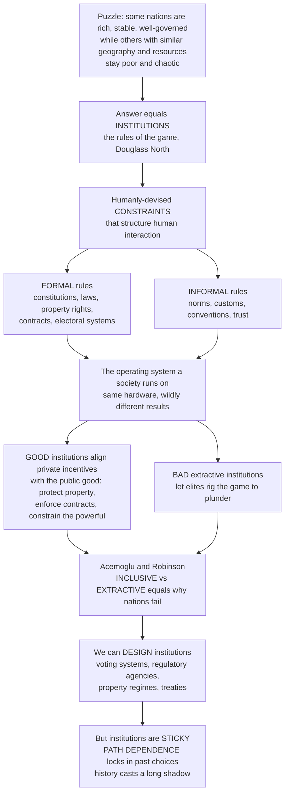

# 🏛️ Institutions and Institutional Design

> [!abstract] TL;DR
> **Institutions are the "rules of the game"** — the humanly-devised **constraints** that structure human interaction (Douglass North), both **formal** (constitutions, laws, property rights, contracts, electoral systems) and **informal** (norms, customs, conventions, trust). They are the *operating system* a society runs on: the same people and resources produce wildly different results depending on whether the rules **align private incentives with the public good** (protecting property, enforcing contracts, constraining the powerful) or let elites **rig the game** for themselves. Acemoglu and Robinson's *Why Nations Fail* thesis distills it to **inclusive versus extractive** institutions. The exciting, hard payoff for public policy: institutions can be **deliberately designed** — yet they are famously **sticky** through **path dependence**, which is why reform is difficult and history casts such a long shadow. This is arguably the single most important lens in all of political economy.

---

## Intuition

**Analogy — the operating system a society runs on.** Take two computers with identical hardware — the same processor, the same memory, the same power supply. Install a fast, secure, well-designed operating system on one and a buggy, corrupt, crash-prone one on the other, and they behave like completely different machines. The hardware never changed; the *rules governing how the hardware is used* did. Societies are the same. Give two countries similar geography, climate, and resources, and they can still end up one rich and stable, the other poor and chaotic — because they are running different **institutions**: different rules for who owns what, whose promises are enforced, who holds power, and how it is checked.

Douglass North (a Nobel laureate) put it precisely: institutions are the humanly-devised **constraints that structure human interaction**. **Good institutions align private incentives with the public good** — they make it *profitable* to be productive, protect property so people dare to invest, enforce contracts so strangers can trade, and constrain the powerful from plundering everyone else. **Bad ("extractive") institutions** let a narrow elite rig the game to enrich themselves, destroying the incentive for everyone else to build. Acemoglu and Robinson's influential answer to *why nations fail* is exactly this: whether a society's institutions are **inclusive** (broad participation, secure rights, checks on power) or **extractive**. The thrilling implication for policy is that we can **design** institutions — craft a voting system, a regulatory agency, a property regime, or a treaty to produce better outcomes. The sobering catch is that institutions are **sticky**: **path dependence** locks in past choices, even bad ones, which is why history's shadow falls so long across the present.

---

## How It Works

### Core mechanics

1. **Institutions constrain and enable.** They are not organizations — they are the *rules*; organizations (firms, parties, courts) are the *players* who act within, and try to change, those rules. North's phrase: institutions are the rules of the game, organizations are the teams.
2. **They come in two layers.** *Formal* institutions are written and third-party enforced (constitutions, statutes, property titles, contracts, electoral law). *Informal* institutions are unwritten but powerful (norms, conventions, customs, trust, codes of conduct). The two must fit: paste a formal rule on top of a hostile informal reality and it stays "law on paper."
3. **Their job is to shape incentives.** Institutions **reduce uncertainty**, **lower transaction costs** (the cost of finding, bargaining, and enforcing), **enable cooperation** among strangers, and **allocate power**. When the rules make productive behaviour pay, people invest, trade, and innovate.
4. **Alignment is the whole game.** Where institutions align private return with social value — secure property, enforced contracts, constrained rulers — a society builds. Where they let the powerful extract — insecure rights, expropriation, rigged access — the rational response is to *not* invest, and the society stagnates.
5. **They persist.** Increasing returns, vested interests, coordination effects, and legitimacy make institutions **self-reinforcing**. This is why reform is hard, why transplants fail, and why the past constrains the present — **path dependence**.

### Flow / Architecture



---

## Key Concepts

### Secondary

- **Institutions are the rules of the game.** They are the agreed constraints that structure how people interact — who owns what, whose promises are kept, who holds power.
- **Formal vs informal.** *Formal* = written and enforced (laws, constitutions, contracts). *Informal* = unwritten but real (norms, customs, trust). Both shape behaviour.
- **Rules vs players.** Institutions are the *rules*; organizations — companies, governments, courts — are the *players*. A soccer match: the rulebook is the institution, the teams are the organizations.
- **Good vs bad institutions.** *Inclusive* rules let many people participate and protect their rights, so everyone has reason to work and build. *Extractive* rules let a few grab everything, so most people stop trying. This is a leading explanation of why some countries prosper and others do not.

### Undergraduate

- **North's definition and functions.** Institutions are humanly-devised constraints that structure interaction; their functions are to **reduce uncertainty**, **structure incentives**, **lower transaction costs**, **enable cooperation**, and **allocate power**.
- **New Institutional Economics (NIE).** Institutions are the *deep determinant* of economic performance. Key figures: **Coase** (property rights and the firm; when transaction costs matter, the assignment of rights shapes outcomes), **Williamson** (transaction costs and governance structures — markets vs hierarchies), and **North** (institutional change and economic history).
- **The "institutions rule" thesis.** Rodrik, Subramanian, and Trebbi argue institutions trump geography and integration in explaining income levels. Acemoglu, Johnson, and Robinson use colonial settler mortality as an instrument to show that *institutions* — not latitude or culture — primarily explain the wealth of nations, addressing the reverse-causality problem.
- **Inclusive vs extractive (Why Nations Fail).** Inclusive institutions provide broad access, secure property, pluralism, and checks on power; extractive ones concentrate access and rights in a narrow elite. The keys are **property rights**, the **rule of law**, and **credible commitment** — a ruler who *cannot* credibly promise not to expropriate cannot attract investment.
- **Institutional design.** The deliberate crafting of rules to hit goals: **electoral systems** (first-past-the-post vs proportional), **regulatory agencies**, **property and contract regimes**, **federal structures**, **constitutions and checks-and-balances**, and **international institutions/treaties**. Design is applied **mechanism design**: getting incentives right. **Ostrom's design principles** show how communities can craft robust rules to govern shared resources without pure state or market solutions.

### Graduate

- **Three institutionalisms.** *Rational-choice institutionalism* treats institutions as **equilibria / incentive structures** (self-enforcing because no one gains by deviating). *Historical institutionalism* emphasises **path dependence, critical junctures, and timing and sequence** — when things happen changes what is possible. *Sociological institutionalism* stresses **legitimacy, isomorphism, and the "logic of appropriateness"** (actors do what is seen as proper, not just what pays).
- **Credible commitment.** North and Weingast (1989) argue England's Glorious Revolution mattered because it made the Crown's promise not to expropriate *credible* by binding the sovereign to Parliament — unlocking secure debt and the financial revolution. Institutions solve time-inconsistency by tying the ruler's hands.
- **Institutional change.** Beyond abrupt change at **critical junctures** (crises, revolutions), Mahoney and Thelen model **gradual** transformation: **layering** (adding new rules atop old), **drift** (changing effects as the environment shifts), **conversion** (redeploying rules to new ends), and **displacement**. Pierson formalises **increasing returns** as the engine of persistence.
- **Path dependence and non-ergodicity.** Brian Arthur and Paul David: with increasing returns, early, possibly random events get **locked in** (QWERTY, driving side, VHS), so the system can settle on a **suboptimal** standard and *not* correct. History is not a mere backdrop — it selects the equilibrium.
- **Design under stickiness.** The hard problem is crafting institutions that are **self-enforcing, incentive-compatible, and robust** — and recognising that **transplantation often fails** because imported formal rules collide with local informal institutions and cannot be sustained.

---

## Python Demo

```python
# Institutions and institutional design, two core pictures:
#   (a) INSTITUTIONS SHAPE OUTCOMES -- how the RULES set incentives:
#       an investment game played under weak vs strong property-rights /
#       contract enforcement. Better institutions raise the private return
#       and pull the equilibrium toward more investment and output.
#   (b) PATH DEPENDENCE & LOCK-IN -- a Polya-urn adoption process with
#       increasing returns: early random choices get amplified and lock in,
#       so different histories converge to DIFFERENT stable institutions,
#       and a suboptimal one can persist. Reform is hard.
# Pure numpy + matplotlib.

import numpy as np
import matplotlib.pyplot as plt

rng = np.random.default_rng(42)

# ----------------------------------------------------------------------
# (a) Rules -> incentives -> investment.
#     A citizen chooses investment x >= 0, producing output A * x**alpha.
#     Only a fraction q of output is SECURE: with weak institutions
#     (low q) elites can expropriate, so the effective private return is
#     q * A * x**alpha, while the cost of investing is x.
#     Payoff(x; q) = q * A * x**alpha - x.
#     Stronger property rights / enforcement (higher q) raise q, so the
#     equilibrium investment x* and output rise: extractive -> inclusive.
# ----------------------------------------------------------------------
A, alpha = 5.0, 0.5
q_grid = np.linspace(0.05, 1.0, 200)     # institutional quality / enforcement
x_grid = np.linspace(0.0, 12.0, 3000)    # candidate investment levels

inv_star, out_star = [], []
for q in q_grid:
    payoff = q * A * x_grid ** alpha - x_grid
    x_opt = x_grid[np.argmax(payoff)]
    inv_star.append(x_opt)
    out_star.append(A * x_opt ** alpha)
inv_star = np.array(inv_star)
out_star = np.array(out_star)

# ----------------------------------------------------------------------
# (b) Path dependence via a Polya urn (Brian Arthur's increasing returns).
#     Two competing institutional standards B and R start symmetric. Each
#     period one more adopter picks a standard with probability equal to
#     its current share -> positive feedback. Early luck is amplified and
#     the share LOCKS IN. Different histories -> different lock-ins.
# ----------------------------------------------------------------------
n_steps, n_paths = 800, 14
paths = np.zeros((n_paths, n_steps))
for p in range(n_paths):
    b, r = 1, 1                          # start equal, no built-in advantage
    for t in range(n_steps):
        if rng.random() < b / (b + r):   # adopt in proportion to share
            b += 1
        else:
            r += 1
        paths[p, t] = b / (b + r)

# ---- plots ----
fig, (ax1, ax2) = plt.subplots(1, 2, figsize=(13, 5.2))

ax1.plot(q_grid, inv_star, lw=2.4, color="C0", label="Equilibrium investment x*")
ax1.plot(q_grid, out_star, lw=2.4, color="C1", label="Output  A x*^alpha")
ax1.axvspan(0.05, 0.30, color="red", alpha=0.08)
ax1.axvspan(0.75, 1.00, color="green", alpha=0.08)
ax1.text(0.075, 9.3, "Extractive:\ninsecure rights\nlow investment",
         color="darkred", fontsize=9)
ax1.text(0.60, 2.4, "Inclusive:\nsecure rights\nhigh investment",
         color="darkgreen", fontsize=9)
ax1.set_xlabel("Institutional quality q  (property rights / contract enforcement)")
ax1.set_ylabel("Investment and output")
ax1.set_title("(a) Institutions shape outcomes: rules -> incentives -> investment")
ax1.legend(loc="upper left", fontsize=8)
ax1.grid(alpha=0.3)

for p in range(n_paths):
    ax2.plot(paths[p], lw=1.3, alpha=0.8)
ax2.axhline(0.5, ls="--", color="black", lw=1.2)
ax2.text(410, 0.52, "symmetric start: no standard is better", fontsize=8)
ax2.set_ylim(0, 1)
ax2.set_xlabel("Adoption step (time)")
ax2.set_ylabel("Share of standard B")
ax2.set_title("(b) Path dependence: increasing returns lock in different outcomes")
ax2.grid(alpha=0.3)

plt.tight_layout()
plt.show()

print(f"Extractive (q=0.10): investment ~ {inv_star[np.argmin(abs(q_grid-0.10))]:.2f}, "
      f"output ~ {out_star[np.argmin(abs(q_grid-0.10))]:.2f}")
print(f"Inclusive  (q=0.95): investment ~ {inv_star[np.argmin(abs(q_grid-0.95))]:.2f}, "
      f"output ~ {out_star[np.argmin(abs(q_grid-0.95))]:.2f}")
print("Polya-urn final shares:", np.round(paths[:, -1], 2))
print("-> identical rules, identical start, yet each history LOCKS IN differently.")
```

The left panel makes the incentive-alignment story concrete: as institutional quality rises, the secure private return rises, and equilibrium investment and output climb from an extractive low to an inclusive high — nothing about the technology `A` or the citizen's abilities changed, only the *rules*. The right panel makes stickiness visceral: fourteen runs of an *identical, symmetric* process lock in at very different shares, because increasing returns amplify early accidents. That is path dependence — why two societies starting alike can diverge permanently, why a suboptimal institution can persist, and why reform must fight the momentum of the rules already in place.

---

## Real-World Applications

- **Property rights and credible commitment — the Glorious Revolution.** North and Weingast's classic case: constraining the English Crown through Parliament made the promise *not to expropriate* credible, letting the state borrow cheaply and igniting Britain's financial revolution. A pure institutional-design story about tying the sovereign's hands.
- **Inclusive vs extractive on a border — Nogales.** Acemoglu and Robinson's opening image: Nogales, Arizona and Nogales, Sonora share climate, geography, and ethnicity but sit under different institutions across a fence, and diverge sharply in income, health, and order — geography held constant, institutions vary.
- **Post-communist transition and transplant failure.** "Shock therapy" mass privatization in 1990s Russia imported formal market rules without the supporting informal institutions and rule of law, enabling oligarchic capture — a cautionary tale that institutions cannot simply be copied from rich countries.
- **Ostrom's commons.** Field studies of irrigation districts, alpine pastures, and inshore fisheries show communities designing durable, self-enforcing rules (clear boundaries, graduated sanctions, monitoring, nested enforcement) to govern common-pool resources — institutional design without pure state or market control.
- **Electoral-system design.** Choosing first-past-the-post versus proportional representation in a new or post-conflict constitution deliberately engineers incentives for coalition-building, minority inclusion, and party fragmentation — designing the rules of political competition itself.
- **Lock-in in everyday standards.** QWERTY keyboards, the side of the road we drive on, and metric-vs-imperial units are textbook path-dependent institutions: entrenched not because they are best but because switching costs and coordination lock them in.

---

## Common Pitfalls

- **Confusing institutions with organizations.** Institutions are the *rules*; organizations are the *players*. Blaming "the government" (an organization) when the problem is the incentive structure (the institution) misdiagnoses the fix. Change the rules, not just the personnel.
- **Ignoring informal institutions.** Reformers obsess over formal law and forget that norms, trust, and customs do the real enforcing. A formally excellent constitution over a hostile informal order stays "law on paper," which is why identical formal rules produce different results in different societies.
- **Institutional transplantation.** Copying rich-country institutions wholesale usually fails: rules imported without the local informal foundations and complementary institutions are not self-enforcing and get gamed or ignored.
- **Correlation is not causation.** Rich countries have good institutions — but does the institution cause the wealth, or vice versa? Naive cross-country regressions cannot tell; this is why Acemoglu, Johnson, and Robinson use an instrument (settler mortality) to identify the causal effect.
- **Design hubris — forgetting path dependence.** Assuming you can redesign rules on a blank slate ignores increasing returns, vested interests, and lock-in. Reforms that fight entrenched equilibria without an incentive-compatible transition path stall or backfire.
- **Assuming rules are self-enforcing.** A well-drafted rule that no one has an incentive to obey or enforce is inert. Good design is **incentive-compatible**: obeying the rule must be in the players' own interest, or a credible third party must enforce it.

---

## Related Concepts

Cross-vault anchors (Glob-verified files elsewhere in the vault):

- [[Political_Institutions_and_Constitutions]] — the political-science machinery (legislatures, executives, constitutions) that formal institutional design actually configures.
- [[Development_Economics]] — the macro growth question where the "institutions rule" thesis competes with geography and human capital as the deep determinant of prosperity.
- [[Development_Economics_and_Political_Development]] — state capacity, order, and political development as the institutional substrate of growth.
- [[Increasing_Returns_and_Path_Dependence]] — the formal engine behind institutional stickiness, lock-in, and non-ergodicity modelled in the Polya-urn demo.
- [[Institutions_Cooperation_and_Norms]] — the complexity-economics view of informal institutions and how cooperative norms emerge and self-enforce.
- [[Revelation_Principle_and_IC]] — mechanism design and incentive compatibility, the theory behind crafting rules people willingly obey.
- [[Repeated_Games_and_Folk_Theorems]] — why cooperation can be self-enforcing over time, the game-theoretic basis for durable informal institutions.
- [[Correlated_Equilibrium]] — institutions as shared signals that coordinate behaviour, the rational-choice-institutionalist reading of a rule as an equilibrium.

Within this vault, this Foundations note sits beside sibling notes (some to be built): *Public_Policy_and_Governance_Overview* (the hub), *The_State_Markets_and_Governance* (the state-vs-market frame institutions arbitrate), *Public_Choice_and_Political_Economy* (institutions as the arena for self-interested political actors), *Institutions_Rules_and_Commons_Governance* (Ostrom's design principles in depth), and *Federalism_and_Multilevel_Governance* (a major axis of institutional design).

---

## Review Questions

1. **(Secondary)** Explain the difference between an *institution* and an *organization* using a game of soccer. Then give one *formal* and one *informal* institution that shapes your school or workplace, and say how each changes people's behaviour.
2. **(Undergraduate)** Two neighbouring regions share climate, soil, and resources, yet one is prosperous and the other poor. Using the idea of *inclusive vs extractive* institutions and the notion of *credible commitment*, explain how institutions could produce this divergence, and describe one concrete institutional reform that might narrow the gap — and why it could still fail.
3. **(Graduate)** "We should just copy the institutions of successful countries." Critique this using (i) the distinction between formal and informal institutions, (ii) path dependence and increasing returns, and (iii) the requirement that institutions be self-enforcing and incentive-compatible. Under what conditions might a transplant nonetheless succeed?

---

## Sources

- Douglass C. North, *Institutions, Institutional Change and Economic Performance* (Cambridge University Press, 1990) — the foundational definition of institutions and the theory of institutional change and path dependence.
- Daron Acemoglu and James A. Robinson, *Why Nations Fail: The Origins of Power, Prosperity, and Poverty* (Crown, 2012) — the inclusive-vs-extractive thesis and the institutions-not-geography argument.
- Elinor Ostrom, *Governing the Commons: The Evolution of Institutions for Collective Action* (Cambridge University Press, 1990) — design principles for robust, self-governed common-pool-resource institutions.
- Oliver E. Williamson, "The New Institutional Economics: Taking Stock, Looking Ahead," *Journal of Economic Literature* 38(3), 2000 — transaction-cost economics and governance structures.
- Daron Acemoglu, Simon Johnson, and James A. Robinson, "The Colonial Origins of Comparative Development," *American Economic Review* 91(5), 2001 — the settler-mortality instrument identifying the causal effect of institutions on income.

---

#public-policy #institutions #institutional-design #path-dependence #inclusive-vs-extractive
