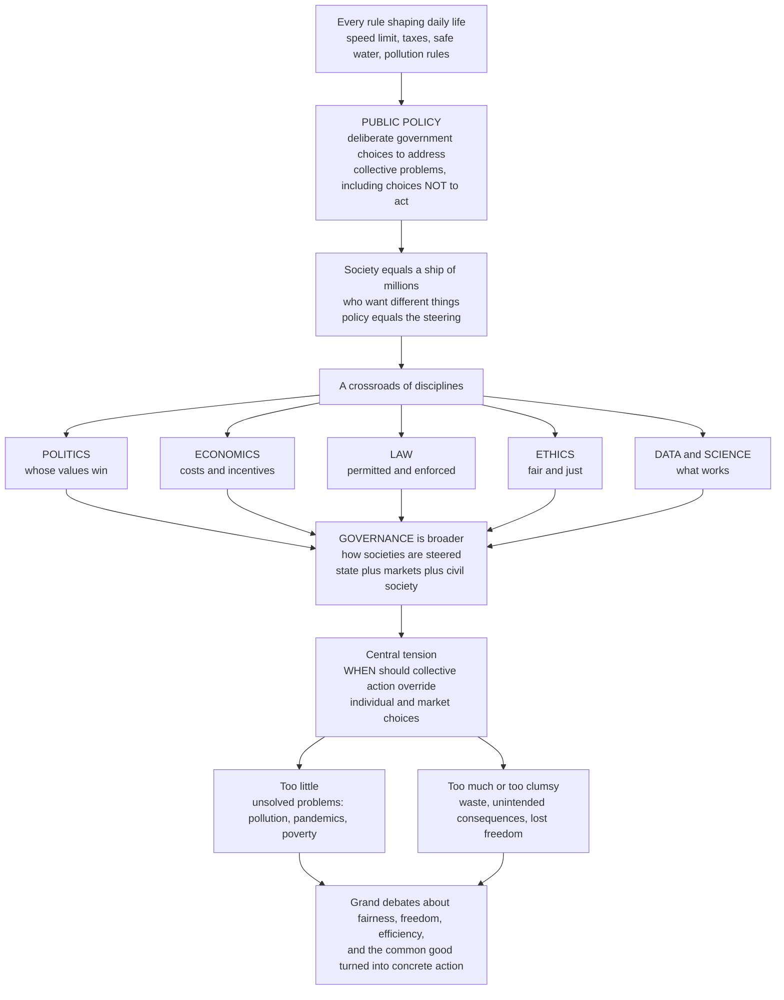

# 🧭 Public Policy and Governance Overview

> [!abstract] TL;DR
> **Public policy** is the set of deliberate courses of action — and inaction — that governments (and increasingly markets and civil society) take to address collective problems: what governments "choose to do or not to do" (Dye), the "authoritative allocation of values" (Easton). **Governance** is the broader frame — the processes and institutions through which a society is *steered* and collective decisions are made, exercised, and held accountable, whether by the state, markets, or networks. The field sits at the crossroads of **politics** (whose values win), **economics** (costs and incentives), **law** (what is permitted and enforced), **ethics** (what is fair), and **data science** (what actually works), and is animated by one permanent tension: *when and how should collective action override or shape individual and market choices?* This is the entry note (hub) for the Public Policy and Governance vault.

---

## Intuition

**Analogy — steering the ship.** Picture a vast ship carrying millions of passengers who want different destinations: some want speed, some safety, some to turn back, some to change course entirely. Left alone, the crowd cannot steer — everyone pulls a different way and the ship drifts onto the rocks. **Public policy is the steering** of that ship: the ongoing, contested process of deciding *where* a community of millions should go and *how* to get there, using the levers of collective power — laws, money, regulations, and programs. Crucially, choosing *not* to touch the wheel is also a choice, with consequences.

Now widen the view. The wheel is only part of the story. There is also *who is allowed on the bridge*, *how the crew is held accountable*, and *whether some steering is delegated to private tugboats and volunteer lookouts*. That wider picture — how the whole vessel is steered, by whom, and under what rules — is **governance**. Every rule that shapes your daily life, from the speed limit to the tax you pay to whether your drinking water is safe, is the product of this steering. Public policy is where a society's grandest debates — about fairness, freedom, efficiency, and the common good — get turned into concrete, consequential action.

---

## How It Works

### The core idea

Public policy is best read as a chain: **intent → decisions → actions → outcomes**. A collective problem is recognised (or ignored); values and interests contend over what to do; an authoritative choice is made; institutions implement it; and the world changes (or fails to) in measurable ways. Two definitions anchor the field. Thomas **Dye**: policy is *"whatever governments choose to do or not to do"* — deliberately including inaction. David **Easton**: policy is *"the authoritative allocation of values for a society"* — emphasising that policy always distributes benefits and burdens, and that its authority is what makes it binding.

**Governance** is the wider container. "Government" is the set of state institutions; "**governance**" is the *process* of steering, which can be carried out by the state alone, by markets, by non-profit networks, or by all of them together. "Good governance" is usually defined by rule of law, accountability, transparency, participation, and effectiveness.

### Why the field is interdisciplinary

Policy questions cannot be answered from inside any single discipline. Each supplies one lens:

- **Politics** — whose values and interests prevail? (power, institutions, the policy process)
- **Economics** — what are the costs, benefits, and incentives? (market failures, efficiency, distribution)
- **Law** — what is permitted, and how is it enforced? (authority, rights, regulation)
- **Ethics** — what is fair, just, and good for the community? (justice, the common good)
- **Data and science** — what actually works, and at what cost? (evidence, evaluation)

### The four central questions

Every policy debate reduces to four questions, which also organise this vault: **Why** does government act (rationales)? **Whose** interests and values prevail (politics and power)? **What** works and at what cost (analysis and evaluation)? **How** is policy made real (implementation and governance)?

### Flow / Architecture



---

## Key Concepts

### Secondary

- **Public policy** — the deliberate choices governments make (or refuse to make) to solve shared problems. Examples you already live inside: speed limits, income tax, clean-water standards, how schools are funded, what a factory may release into a river.
- **Government vs governance** — *government* is the set of official state bodies; *governance* is the broader act of steering a society, which today also involves businesses, charities, and citizens.
- **Action and inaction both count** — deciding *not* to regulate, tax, or spend is itself a policy choice with real consequences.
- **The central trade-off** — too little collective action leaves problems markets cannot fix (pollution, pandemics, poverty); too much or too clumsy action brings waste, red tape, and lost freedom.

### Undergraduate

- **Rationales for intervention** — the standard economic case for government action is **market failure**: externalities, public goods, information problems, and market power. Alongside efficiency sit **equity** (fairness of the distribution) and **rights** (things owed to persons regardless of efficiency).
- **The policy process / policy cycle** — a stylised loop: *agenda-setting → formulation → adoption → implementation → evaluation → (revision or termination)*. Real policymaking is messier and more iterative than the tidy cycle suggests, but the cycle is a useful map.
- **Policy analysis** — the systematic comparison of alternatives against criteria (efficiency, equity, feasibility, cost), of which **cost-benefit analysis** is the workhorse tool.
- **Instruments of policy** — the "toolbox" a government steers with: **regulation** (rules and standards), **taxes and subsidies** (prices and incentives), **spending and provision** (programs, transfers), **information** (disclosure, campaigns), and **nudges** (choice architecture).
- **Good governance criteria** — rule of law, accountability, transparency, participation, and effectiveness; the yardsticks by which steering is judged, not just its direction.

### Graduate

- **Theories of the policy process** — models that explain how policy actually changes: **incrementalism** (Lindblom's "muddling through"), **punctuated equilibrium** (Baumgartner and Jones — long stability broken by bursts), **multiple streams** (Kingdon's problem, policy, and politics streams joined in a "window"), and the **advocacy coalition framework** (Sabatier).
- **Public choice and political economy** — applying economic reasoning to politics: voters, politicians, and bureaucrats as self-interested actors; **rent-seeking**, **regulatory capture**, the **median voter theorem**, and **Arrow's impossibility theorem** (no perfect way to aggregate preferences).
- **Collective action and the commons** — Olson's *Logic of Collective Action* (why groups under-provide shared goods) and **Ostrom's** demonstration that communities can govern common-pool resources without pure state or market solutions, undermining the tidy state-vs-market binary.
- **The efficiency-equity trade-off** — Okun's "leaky bucket": redistribution can raise fairness but may lower total output, so policy often chooses a point on a frontier rather than a single "best" outcome.
- **Governance beyond government** — networked, polycentric, and multi-level governance; the shift from hierarchical "government" to steering through markets, partnerships, and civil society. See Fukuyama's account of governance as *the state's capacity to make and enforce rules and deliver services*, distinct from democracy.
- **Wicked problems** — Rittel and Webber's insight that many policy problems (climate, poverty, health) have no definitive formulation, no stopping rule, and no true-or-false solution, only better-or-worse ones.

---

## Python Demo

```python
# Two foundational pictures of what public policy is about:
#   (a) policy as BALANCE  -> the net social benefit of intervention peaks at
#       an intermediate level; both too little and too much are costly.
#   (b) the STATE vs MARKET spectrum -> how strongly government action is
#       justified depends on the type of good (private -> public / merit).
# Pure numpy + matplotlib, no scipy / sklearn.

import numpy as np
import matplotlib.pyplot as plt

# ----------------------------------------------------------------------
# (a) The optimal level of government intervention.
#     Benefits of collective action rise with diminishing returns (concave);
#     costs (administration, distortion, lost freedom) rise faster (convex).
#     Net social benefit = benefit - cost peaks at an INTERMEDIATE effort.
# ----------------------------------------------------------------------
effort = np.linspace(0, 10, 400)              # intensity of intervention
benefit = 12 * (1 - np.exp(-0.45 * effort))   # concave: diminishing returns
cost = 0.12 * effort ** 2                      # convex: rising marginal cost
net = benefit - cost
opt = effort[np.argmax(net)]                   # welfare-maximising level

fig, (ax1, ax2) = plt.subplots(1, 2, figsize=(13, 5.4))

ax1.plot(effort, benefit, lw=2, label="Social benefit of action")
ax1.plot(effort, cost, lw=2, label="Cost of action")
ax1.plot(effort, net, lw=2.6, color="black", label="Net social benefit")
ax1.axvline(opt, ls="--", color="green")
ax1.annotate("Optimal intervention",
             xy=(opt, net.max()),
             xytext=(opt + 0.6, net.max() - 3.5),
             arrowprops=dict(arrowstyle="->"))
ax1.text(0.3, -2.4, "Too little:\nunsolved problems", color="darkred", fontsize=9)
ax1.text(opt + 1.6, -2.4, "Too much:\nwaste, lost freedom", color="darkred", fontsize=9)
ax1.set_xlabel("Intensity of government intervention")
ax1.set_ylabel("Value (arbitrary units)")
ax1.set_title("Policy as balance: the optimal level of intervention")
ax1.legend(loc="lower center", fontsize=8)
ax1.grid(alpha=0.3)

# ----------------------------------------------------------------------
# (b) The state vs market spectrum across types of goods.
#     Rivalry and excludability determine how well markets supply a good,
#     and thus how strong the case for government action is.
# ----------------------------------------------------------------------
goods = ["Private goods\n(food, phones)",
         "Club goods\n(toll roads, streaming)",
         "Common-pool\n(fisheries, aquifers)",
         "Merit goods\n(education, vaccines)",
         "Public goods\n(defense, clean air)"]
gov_role = np.array([0.15, 0.40, 0.65, 0.75, 0.95])   # justified state role
colors = plt.cm.RdYlBu_r(gov_role)

y = np.arange(len(goods))
ax2.barh(y, gov_role, color=colors, edgecolor="black")
ax2.set_yticks(y)
ax2.set_yticklabels(goods, fontsize=9)
ax2.set_xlim(0, 1)
ax2.set_xlabel("Justified role of the state  (0 = pure market, 1 = pure state)")
ax2.set_title("Where government action is more vs less justified")
for yi, v in zip(y, gov_role):
    ax2.text(v + 0.02, yi, f"{int(v * 100)} percent", va="center", fontsize=8)
ax2.grid(axis="x", alpha=0.3)

plt.tight_layout()
plt.show()

print(f"Net social benefit is maximised at intervention level ~ {opt:.2f} "
      f"(out of 10) -- neither zero nor the maximum.")
```

The left panel makes the field's core message concrete: policy is not "more government good, less government bad" (or the reverse) but the search for a balance where the marginal benefit of collective action equals its marginal cost. The right panel shows *why* that balance shifts by domain — the case for the state grows as goods become less excludable and more non-rival, which is exactly why defense and clean air are almost never left to markets while smartphones almost always are.

---

## Real-World Applications

- **Environmental policy — the carbon price.** Greenhouse gases are a textbook negative externality: the polluter does not bear the full social cost. Carbon taxes and cap-and-trade systems (the EU Emissions Trading System, British Columbia's carbon tax) are policy instruments that internalise that cost — a direct application of the market-failure rationale and Pigouvian pricing.
- **Public health — pandemic response.** COVID-19 was a live seminar in public policy and governance: contested trade-offs between liberty and collective welfare, expertise and democratic accountability, and national versus local authority — all under deep uncertainty and time pressure, exactly the profile of a "wicked problem."
- **Social policy — the welfare state.** Pensions, unemployment insurance, and health systems embody the equity rationale for intervention and sit squarely on Okun's efficiency-equity trade-off; different countries choose visibly different points on that frontier.
- **Governance reform — digital government.** Estonia's e-government and India's Aadhaar/UPI stack show governance "beyond government": the state steers through digital platforms and public-private networks, changing not *what* is provided but *how* it is delivered and held accountable.
- **Regulation — the administrative state.** Central banks, food-safety agencies, and environmental regulators translate broad statutes into enforceable rules — the implementation stage where policy either becomes real or quietly fails.

---

## Common Pitfalls

- **Confusing policy with law or politics.** *Politics* is the contest over whose values win; *law* is the authoritative rules and their enforcement; *policy* is the chosen course of action that runs through both. Treating them as synonyms hides where a decision actually gets made — and where it can be changed.
- **Ignoring inaction.** Analysts often study only what governments *do*. But choosing not to regulate, tax, or spend is a policy with winners and losers, and it must be evaluated against the same alternatives as active intervention.
- **The "if only we had the right expert" fallacy.** Good analysis does not settle policy, because policy allocates values, not just facts. Evidence informs the *what works* question but cannot answer the *whose values prevail* question; pretending otherwise fuels the expertise-versus-democracy tension.
- **Assuming implementation is automatic.** Many "good" policies fail not at design but at delivery — under-funded agencies, misaligned incentives, and street-level discretion. The gap between the statute and the outcome is where most policy failures actually live.
- **The state-versus-market false binary.** Real governance is rarely pure state or pure market; Ostrom showed communities self-governing commons, and most modern services are hybrids. Framing every question as "government or market" throws away the most interesting options.
- **Treating wicked problems like tame ones.** Climate, poverty, and inequality have no definitive formulation or final solution. Demanding a single "correct" fix produces brittle policies; iterative, adaptive approaches usually do better.

---

## Related Concepts

Cross-vault anchors (Glob-verified files elsewhere in the vault):

- [[Policy_Analysis_and_the_Policy_Process]] — the political-science treatment of the policy cycle and analytic methods that this vault deepens with dedicated analysis and evaluation notes.
- [[Political_Economy_and_Market_State_Relations]] — the state-versus-market question that frames the vault's central tension.
- [[Political_Institutions_and_Constitutions]] — the institutional machinery through which policy is authorised and constrained.
- [[Welfare_States_and_Social_Policy]] — the paradigm case of the equity rationale and the efficiency-equity trade-off.
- [[Market_Failures]] — the core economic rationale for when government action is justified.
- [[Public_Goods]] — non-rival, non-excludable goods markets under-provide, at the "pure state" end of the spectrum in the demo.
- [[Externalities_and_Pigouvian_Tax]] — the microeconomic basis for carbon pricing and corrective taxation.
- [[Rule_of_Law_and_Due_Process]] — the legal foundation of good governance and the limits on how the state may act.
- [[Administrative_Law_and_Regulation]] — the legal architecture of the regulatory state where implementation happens.
- [[Tax_Policy]] — the fiscal instrument through which much of policy is funded and incentives are set.
- [[Systems_Failure_and_Wicked_Problems]] — the systems-thinking account of why many policy problems resist clean solutions.
- [[Distributive_Justice_and_Inequality]] — the ethical debate over what a fair allocation of benefits and burdens even means.

Within this vault, this hub opens onto sibling notes (to be built): *The_Policy_Process_and_Policy_Cycle*, *Theories_of_the_Policy_Process*, *The_State_Markets_and_Governance*, *Rationales_for_Government_Intervention*, and *Institutions_and_Institutional_Design* in Foundations, then later anchors such as *Cost_Benefit_Analysis*, *Public_Choice_and_Political_Economy*, *Health_Policy_and_Systems*, and *The_Reach_and_Future_of_Public_Policy*.

---

## Review Questions

1. **(Secondary)** Give three rules that shaped your day today and explain why each is an example of public policy rather than a private choice. Then describe one area where a government's *decision not to act* is itself a policy.
2. **(Undergraduate)** A city has smog from car traffic. Using the market-failure rationale, explain why this is a policy problem, then compare a regulation (emissions standards) with a price instrument (a congestion charge) on efficiency, equity, and feasibility. Which would you recommend and why?
3. **(Graduate)** "Good analysis can tell us what works, but it cannot tell us what to do." Evaluate this claim using the distinction between the efficiency and equity rationales and the expertise-versus-democracy tension. Then explain how Ostrom's work and the concept of wicked problems complicate any purely technocratic model of policymaking.

---

## Sources

- Thomas R. Dye, *Understanding Public Policy* (Pearson) — the "what governments choose to do or not to do" definition and the policy-process framework.
- David L. Weimer and Aidan R. Vining, *Policy Analysis: Concepts and Practice* (Routledge) — market-failure rationales and the analytic toolkit.
- Michael E. Kraft and Scott R. Furlong, *Public Policy: Politics, Analysis, and Alternatives* (CQ Press) — the interdisciplinary framing and the policy cycle.
- Francis Fukuyama, "What Is Governance?", *Governance* 26(3), 2013 — governance as state capacity, distinct from democracy.
- Elinor Ostrom, *Governing the Commons* (Cambridge University Press, 1990) — self-governance of common-pool resources beyond the state-market binary.

---

#public-policy #governance #policy-analysis #political-economy #the-state
