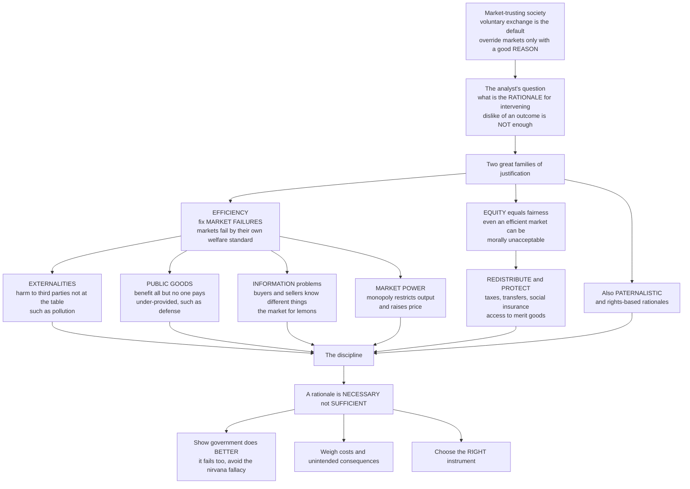

# 🏛️ Rationales for Government Intervention

> [!abstract] TL;DR
> In a society that broadly trusts markets and individual choice, overriding them requires a **legitimate justification — a rationale — not mere dislike of an outcome**. Policy analysis organizes those justifications into two great families. **Efficiency** corrects the well-understood **market failures** — externalities (pollution), under-provided public goods (defense), information problems (the market for "lemons"), and market power (monopoly) — where free markets predictably fail *by their own welfare standard*. **Equity** addresses distributions that even a *perfectly efficient* market may render morally unacceptable, justifying redistribution and protection on grounds of justice. Supplementary grounds are **paternalistic** (protecting people from predictable errors) and **rights-based**. The crucial discipline: a rationale is **necessary but not sufficient** — you must also show government will actually do *better* than the flawed market (government fails too) and pick the right instrument. This is the policy/normative counterpart to Microeconomics's market-failure theory.

---

## Intuition

**Analogy — you need a warrant to search the house.** In a free society, the police cannot search your home just because an officer has a hunch or dislikes you. They need a *warrant*: a specific, legitimate, articulable reason that a neutral judge will accept. Government intervention in the economy works the same way. The default is voluntary exchange and individual choice; the presumption is that people are free to trade, spend, and live as they wish. So before the state overrides that default — taxing, banning, mandating, subsidizing — the policy analyst demands a **warrant for intervention**. "I don't like how this turned out" is not a warrant. A disciplined, recognized *rationale* is.

There are essentially two great families of such warrants. The first is **efficiency**: fixing the specific, well-understood situations where free markets predictably produce bad outcomes *even by their own standard of maximizing total welfare* — the four classic **market failures**. A factory's pollution harms neighbors who were never at the bargaining table (an **externality**). National defense benefits everyone but no one will pay for it because you cannot be excluded from enjoying it, so the market under-provides it (a **public good**). You cannot tell a good used car from a lemon, so good cars vanish from the market (an **information** failure). A monopolist restricts output and gouges prices (**market power**). In each case, in principle, government *can* make everyone better off. The second family is **equity**: even a flawlessly efficient market can produce distributions we find morally unacceptable — vast inequality, people unable to afford food or healthcare — so we intervene to *redistribute* and protect the vulnerable on grounds of *justice*, not efficiency. Alongside these sit **paternalistic** rationales (protecting people from their own predictable mistakes) and **rights-based** ones.

The crucial discipline — the fine print on the warrant — is this: finding a rationale is **necessary but not sufficient**. You must still prove that government intervention will actually do *better* than the imperfect market it replaces, because **government fails too**. Comparing a flawed market to an idealized, all-knowing government is the "nirvana fallacy." Learning the rationales for intervention is learning the disciplined **"why"** that must precede every government action.

---

## How It Works

### Core mechanics

1. **Start from the presumption.** In a liberal-market framework, voluntary exchange and individual choice are the default. Intervention bears the *burden of proof*.
2. **Ask the disciplined question.** For any proposed action: *what is the rationale?* Which recognized, legitimate justification applies?
3. **Sort into the two families.** *Efficiency* (fix a market failure so the pie is larger) or *equity* (change who gets which slice on grounds of fairness) — plus paternalistic and rights-based grounds.
4. **Diagnose the specific failure or injustice.** If efficiency: which of the four — externality, public good, information, market power? If equity: what distributional standard is violated, and by how much?
5. **Apply the sufficiency test.** A rationale identifies a *problem*; it does not license *any* response. Show government can do better (avoid the nirvana fallacy), weigh the intervention's own costs and unintended consequences, and select the appropriate instrument.

The efficiency family rests on the **First Welfare Theorem**: a competitive equilibrium is Pareto efficient *only if* there are no externalities, no public goods, no market power, and symmetric information. Each market failure is a violated condition, and each has a matched corrective tool. The equity family is orthogonal: the theorem says nothing about *whether the efficient distribution is fair* — a Pareto-efficient outcome can be wildly unequal, which is exactly why equity is a *separate* warrant.

### Flow / Architecture



---

## Key Concepts

### Secondary

- **The warrant for intervention** — before government overrides free choice, it needs a legitimate *reason*. Not "I don't like the result," but a recognized justification.
- **The two families** — *efficiency* (fix cases where markets waste resources) and *equity* (make the distribution fairer). They are different reasons and can point in different directions.
- **Externalities** — costs or benefits that spill onto bystanders. Pollution is a *negative* externality (the polluter does not pay the full cost); vaccination is a *positive* one (others benefit too).
- **Public goods** — things everyone can enjoy and no one can be shut out of, like clean air or national defense. Because you cannot charge for them, private firms under-supply them.
- **Necessary but not sufficient** — spotting a problem does not prove government can fix it better. Governments make mistakes too.

### Undergraduate

- **The efficiency rationale = market failure.** The First Welfare Theorem guarantees an efficient competitive market *only* when four conditions hold; each violation is a canonical failure with a matched remedy:
  - **Externalities** — private cost/benefit diverges from social cost/benefit → over- or under-production. Remedies: **Pigouvian taxes/subsidies**, tradable permits (cap-and-trade), **Coasean bargaining** with clear property rights, or direct regulation.
  - **Public goods** — *non-rival* and *non-excludable* → the **free-rider problem** → under-provision → collective (usually tax-funded) provision. Related categories: common-pool resources, club goods, merit goods.
  - **Information failures** — *asymmetric information* produces **adverse selection** (Akerlof's "lemons," insurance markets unraveling) and **moral hazard** (hidden action). Remedies: mandatory disclosure, licensing, standards, warranties, screening.
  - **Market power** — monopoly/oligopoly set price above marginal cost, restricting output and creating deadweight loss → antitrust and utility regulation.
- **The equity / distributional rationale.** Even an efficient market can yield poverty and inequality that society deems *unjust*. Intervention here rests on **fairness**, not efficiency: redistribution through **taxes and transfers**, **social insurance** and safety nets, and guaranteed access to **merit goods** (health, education).
- **The efficiency–equity distinction (and trade-off).** Efficiency is about the *size* of the pie; equity is about *who gets which slice*. Okun's "leaky bucket": moving income toward fairness can shrink the pie, so policy often picks a point on a frontier rather than a single "best."
- **Government failure.** Intervention is not automatically welfare-improving: **regulatory capture**, **public-choice** distortions (politicians maximize votes, bureaucrats maximize budgets), state information limits, and real implementation costs.

### Graduate

- **The Bator anatomy.** Francis Bator's "Anatomy of Market Failure" (1958) traces failures to non-appropriability, non-convexities, and public-good characteristics — showing the four categories are surface symptoms of deeper conditions under which prices fail to carry the right signals.
- **The nirvana fallacy (Demsetz).** Comparing a *real, imperfect* market to an *idealized, omniscient* government stacks the deck. The correct comparison is institution-vs-institution: imperfect market vs imperfect government vs imperfect voluntary/community arrangement (Ostrom's polycentric option).
- **Government failure theory (Le Grand; public choice).** A symmetric literature catalogs *why the state fails*: rent-seeking, agency loss, soft budget constraints, time-inconsistency, and the impossibility results (Arrow) that no rule perfectly aggregates preferences. Intervention must clear a *comparative* institutional bar.
- **Internalities and libertarian paternalism.** Behavioral economics adds a rationale the classical framework lacks: people harm *their own* future selves through present bias, bounded rationality, and framing effects ("internalities"). This grounds **nudges** and choice architecture — steering without coercion — as a distinct, contested instrument class.
- **Second-best and instrument choice.** With multiple simultaneous distortions, fixing one failure in isolation can *reduce* welfare (theory of the second best). Instrument choice — price vs quantity (Weitzman), tax vs standard, provision vs mandate — depends on the slopes of costs and benefits and on information and enforcement asymmetries.
- **Beyond micro-failures.** Missing markets (no insurance against many risks), coordination failures, and macroeconomic instability (stabilization) extend the rationale set beyond the static four, linking to public finance and macro policy.

---

## Python Demo

```python
# Two rationales for government intervention, made concrete.
#   (a) EFFICIENCY: a negative externality (pollution) makes the free market
#       OVER-produce; a Pigouvian tax equal to the marginal external harm
#       moves output to the social optimum and erases the deadweight loss.
#   (b) EQUITY: efficiency does NOT pin down the distribution. Two economies
#       with the SAME total income (same efficient "pie") can differ wildly
#       in fairness -> equity is a SEPARATE justification, shown via Lorenz
#       curves and the Gini coefficient.
# Pure numpy + matplotlib (no scipy / sklearn).

import numpy as np
import matplotlib.pyplot as plt

rng = np.random.default_rng(0)
fig, (ax1, ax2) = plt.subplots(1, 2, figsize=(13, 5.4))

# ----------------------------------------------------------------------
# (a) THE EFFICIENCY RATIONALE: externality and its correction.
#     Demand = marginal (social) benefit MB.  Private marginal cost MPC
#     ignores the external harm.  Social marginal cost MSC = MPC + MEC.
#     Free market:    MB = MPC -> Q_private (TOO MUCH).
#     Social optimum: MB = MSC -> Q_social  (efficient).
#     Pigouvian tax = MEC lifts private cost to MSC, moving output to Q_social.
# ----------------------------------------------------------------------
Q = np.linspace(0, 100, 500)
a, b = 100.0, 0.8          # inverse demand:      MB  = a - b*Q
c, d = 20.0, 0.5           # private supply:      MPC = c + d*Q
MEC  = 20.0                # marginal external cost (the pollution harm)

MB, MPC = a - b * Q, c + d * Q
MSC = MPC + MEC

Q_priv = (a - c) / (b + d)             # MB = MPC
Q_soc  = (a - c - MEC) / (b + d)       # MB = MSC
P_priv = a - b * Q_priv

ax1.plot(Q, MB,  lw=2, label="Marginal benefit (demand)")
ax1.plot(Q, MPC, lw=2, label="Private marginal cost MPC")
ax1.plot(Q, MSC, lw=2, ls="--", label="Social marginal cost MSC = MPC + harm")
ax1.axvline(Q_priv, color="crimson", ls=":", lw=1.4)
ax1.axvline(Q_soc,  color="green",   ls=":", lw=1.4)

# deadweight loss: overproduction from Q_soc to Q_priv (MSC above MB)
Qdw = np.linspace(Q_soc, Q_priv, 60)
ax1.fill_between(Qdw, a - b * Qdw, (c + d * Qdw) + MEC,
                 color="crimson", alpha=0.25, label="Deadweight loss")
ax1.annotate("Free market\nover-produces", xy=(Q_priv, P_priv),
             xytext=(Q_priv + 3, P_priv + 20), fontsize=8,
             arrowprops=dict(arrowstyle="->"))
ax1.annotate("Pigouvian tax = harm\nmoves output here", xy=(Q_soc, a - b * Q_soc),
             xytext=(Q_soc - 33, a - b * Q_soc + 15), fontsize=8,
             arrowprops=dict(arrowstyle="->"))
ax1.set_xlabel("Quantity produced")
ax1.set_ylabel("Price / marginal value")
ax1.set_title("Efficiency rationale: externality and its correction")
ax1.legend(fontsize=7.5, loc="upper right")
ax1.set_ylim(0, 110)
ax1.grid(alpha=0.3)

# ----------------------------------------------------------------------
# (b) THE EQUITY RATIONALE: same efficient pie, different fairness.
# ----------------------------------------------------------------------
def gini(x):
    x = np.sort(x)
    n = x.size
    idx = np.arange(1, n + 1)
    return (2 * np.sum(idx * x) / (n * np.sum(x))) - (n + 1) / n

def lorenz(x):
    x = np.sort(x)
    return np.concatenate([[0], np.cumsum(x) / np.sum(x)])

market = rng.lognormal(mean=0.0, sigma=1.1, size=5000)   # efficient but unequal
alpha = 0.45                                             # redistribution strength
redistributed = market + alpha * (market.mean() - market)  # SAME total (pie fixed)

p = np.linspace(0, 1, market.size + 1)
ax2.plot([0, 1], [0, 1], color="gray", ls="--", label="Perfect equality")
ax2.plot(p, lorenz(market), lw=2, color="crimson",
         label=f"Market outcome (Gini {gini(market):.2f})")
ax2.plot(p, lorenz(redistributed), lw=2, color="green",
         label=f"After redistribution (Gini {gini(redistributed):.2f})")
ax2.fill_between(p, p, lorenz(market), color="crimson", alpha=0.10)
ax2.set_xlabel("Cumulative share of population")
ax2.set_ylabel("Cumulative share of income")
ax2.set_title("Equity rationale: same pie, different fairness")
ax2.legend(fontsize=8, loc="upper left")
ax2.grid(alpha=0.3)

plt.tight_layout()
plt.show()

print(f"(a) Free market Q = {Q_priv:.1f} vs social optimum Q = {Q_soc:.1f}; "
      f"a Pigouvian tax of {MEC:.0f} closes the gap and erases the deadweight loss.")
print(f"(b) Total income unchanged ({market.sum():.0f}); Gini falls from "
      f"{gini(market):.2f} to {gini(redistributed):.2f} with NO change in the pie -- "
      f"equity is a separate justification from efficiency.")
```

The left panel is the **efficiency rationale** made concrete: because the polluter's private cost curve (MPC) sits below the true social cost (MSC), the free market settles where marginal benefit meets *private* cost and over-produces; the shaded triangle is the resulting deadweight loss, and a Pigouvian tax exactly equal to the marginal external harm shifts output to the social optimum. The right panel isolates the **equity rationale**: both Lorenz curves describe economies with the *same total income* — the same efficient pie — yet one is far more unequal than the other. Efficiency simply does not determine fairness, which is precisely why redistribution needs its *own* warrant. (The demo holds the pie fixed for clarity; in practice distortionary redistribution can shrink it — Okun's leaky bucket.)

---

## Real-World Applications

- **Carbon pricing (externality → efficiency).** Greenhouse emissions are the largest market failure by dollar magnitude: the emitter does not bear the social cost. Carbon taxes and cap-and-trade (the EU Emissions Trading System, British Columbia's carbon tax) are the Pigouvian remedy — a direct enactment of the efficiency rationale and the left panel above.
- **National defense and basic research (public goods → efficiency).** Non-excludable, non-rival goods that no private firm will fund at the efficient level because free-riding is rational. Governments provide them collectively through taxation — the textbook public-good warrant.
- **Insurance and used cars (information → efficiency).** Adverse selection makes voluntary health-insurance pools unravel (the healthy exit, premiums spiral) and drives good used cars out of the market. Rationale-driven responses: community rating and mandates, mandatory disclosure, lemon laws, professional licensing.
- **Antitrust and utility regulation (market power → efficiency).** Breaking up or regulating monopolies (the Standard Oil breakup, telecom and electricity price regulation) targets the deadweight loss from output restriction.
- **The welfare state (equity).** Pensions, unemployment insurance, and progressive taxes embody the *fairness* warrant, not the efficiency one; different countries deliberately choose different points on Okun's efficiency-equity frontier.
- **Retirement auto-enrollment (paternalism / internalities).** Default enrollment in pension plans corrects present bias and inertia — a behavioral, nudge-based rationale that the classical four-failure taxonomy does not contain.

---

## Common Pitfalls

- **Calling every disliked outcome a "market failure."** A market that fails to serve the poor is (usually) a *distributional* problem, not an efficiency failure. Efficiency is about the size of the pie; equity is about the slices. Conflating them hides which of the two warrants you are actually invoking — and they call for different tools.
- **The nirvana fallacy.** Comparing a real, imperfect market to an idealized, omniscient, benevolent government "proves" intervention too easily. The honest comparison is imperfect market vs imperfect government (vs imperfect community self-governance). Government failure is real and must be weighed.
- **Rationale as blank cheque.** Identifying a valid rationale is *necessary but not sufficient*. It licenses *a* response, not *any* response. You must still show the specific instrument beats doing nothing after accounting for its own costs and unintended consequences.
- **Ignoring the second-best.** With several distortions at once, correcting one in isolation can *lower* welfare. Piecemeal "fix the obvious failure" reasoning can backfire when other failures remain.
- **Forgetting positive externalities and merit goods.** The instinct is to think "externality = pollution = tax." But vaccination, education, and R&D are *under-produced* positive externalities calling for *subsidy*, not restriction.
- **Treating efficiency and equity as the same axis.** A Pareto-efficient allocation can be grotesquely unequal, and an equal one inefficient. Assuming "efficient" implies "fair" (or vice versa) erases the entire second family of rationales.

---

## Related Concepts

Cross-vault anchors (Glob-verified files elsewhere in the vault):

- [[Market_Failures]] — the Microeconomics *theory* of efficiency failures; this note is its policy/normative counterpart, giving the disciplined "why" for acting on it. Distinct basename, linked to deliberately.
- [[Externalities_and_Pigouvian_Tax]] — the microeconomic mechanics of the externality failure and its corrective tax, dramatized in the left panel of the demo.
- [[Public_Goods]] — non-rival, non-excludable goods and the free-rider problem underlying the public-good rationale.
- [[Coase_Theorem]] — the property-rights/bargaining alternative to Pigouvian correction when transaction costs are low.
- [[Adverse_Selection]] — the "lemons" and insurance-unraveling core of the information-failure rationale.
- [[Monopoly]] — the market-power failure and the antitrust/regulation response.
- [[Distributive_Justice_and_Inequality]] — the ethical debate over what a *fair* distribution even is, which the equity rationale presupposes.
- [[Behavioral_Public_Policy_and_Libertarian_Paternalism]] — the behavioral/paternalistic rationale (internalities, nudges) that supplements the classical four.
- [[Bounded_Rationality_and_Satisficing]] — the cognitive basis for paternalistic intervention and "internalities."
- [[Welfare_States_and_Social_Policy]] — the paradigmatic institutional expression of the equity rationale and the efficiency-equity trade-off.
- [[Political_Economy_and_Market_State_Relations]] — the state-vs-market framing and the government-failure caveat that constrains every rationale.
- [[Policy_Analysis_and_the_Policy_Process]] — where rationale meets the analytic toolkit (cost-benefit analysis, instrument choice) that tests sufficiency.

Within this vault, this note sits beside its Foundations siblings (prose references, to be built): the entry hub *Public_Policy_and_Governance_Overview*; *The_State_Markets_and_Governance*, which develops the government-failure caveat and the nirvana fallacy; *Externalities_and_Environmental_Policy* and *Public_Goods_and_Collective_Provision*, which deepen two of the four efficiency failures into full policy domains; and *Behavioral_Public_Policy_and_Nudges*, which develops the paternalistic family.

---

## Review Questions

1. **(Secondary)** Explain, using the "warrant" idea, why "I don't like how the market turned out" is not by itself a good enough reason for the government to step in. Give one example of a genuine *efficiency* reason and one genuine *equity* reason.
2. **(Undergraduate)** A city has heavy traffic smog. Identify which of the four market failures applies, and compare a Pigouvian congestion charge with an emissions *standard* on efficiency, equity, and feasibility. Then explain why identifying the failure is "necessary but not sufficient" for recommending either.
3. **(Graduate)** "Because a market failure exists, the government should intervene." Critique this inference using the nirvana fallacy and government-failure theory. Then, drawing on the efficiency-equity distinction and the theory of the second best, explain two situations in which a *correctly identified* rationale should still *not* lead to intervention.

---

## Sources

- David L. Weimer and Aidan R. Vining, *Policy Analysis: Concepts and Practice* (Routledge) — the canonical market-failure / government-failure framework for the "rationale for intervention" question.
- Joseph E. Stiglitz, *Economics of the Public Sector* (W. W. Norton) — the efficiency and equity rationales and the economics of collective provision.
- Francis M. Bator, "The Anatomy of Market Failure," *Quarterly Journal of Economics* 72(3), 1958 — the foundational taxonomy of why markets fail.
- Julian Le Grand, "The Theory of Government Failure," *British Journal of Political Science* 21(4), 1991 — the symmetric case that government fails too, grounding the sufficiency caveat.

---

#public-policy #market-failure #externalities #public-goods #equity
