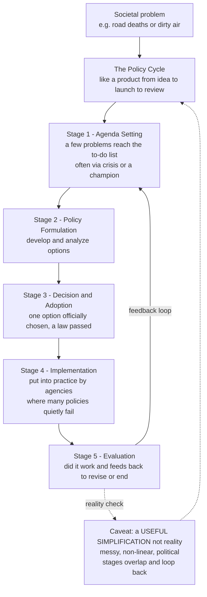

# 🔁 The Policy Process and Policy Cycle

> [!abstract] TL;DR
> The **policy cycle** is the classic map of how a problem in society becomes government action — a rough life cycle of five recognizable stages: **agenda-setting** (a few problems reach the crowded to-do list), **formulation** (options are drafted and analyzed), **adoption** (one option is officially chosen), **implementation** (agencies put it into practice, where many policies quietly fail), and **evaluation** (did it work? — feeding back to revision or termination). The stages are an indispensable *heuristic*, not a causal theory: real policymaking is messy, non-linear, contested, and political, so this tidy loop is a useful map of a chaotic territory.

---

## Intuition

**Analogy:** How does a problem in society — too many road deaths, or dirty air — actually become a government policy that changes things? It is not random. Policies tend to move through a rough life cycle, like a **product going from idea to launch to review**. First someone notices thousands of possible problems, but only a few land on the "to-do list" (agenda-setting — why *this* problem, now? Usually it takes a crisis, a shocking statistic, or a champion to push it up). Then a team designs possible versions ("what could we do about it?"). Then leadership picks one and signs off (the political "yes, we'll ship *this*"). Then it actually gets built and rolled out by the people on the ground — and this is where a great idea can quietly die from bad execution. Finally someone asks "did it work?" and the answer feeds back into the next revision.

In policy terms the product manager's roadmap becomes the **policy cycle**, the launch decision becomes a law being passed, the engineering-and-rollout phase becomes bureaucratic **implementation**, and the post-launch review becomes **evaluation** that closes the loop. The crucial caveat: this cycle is a *useful simplification*, not reality. Real policymaking loops back, skips stages, and matches floating solutions to problems opportunistically rather than logically.

---

## How It Works

### Core mechanics

1. **Agenda-setting** — Out of thousands of competing problems, a few gain governmental attention. What matters is *problem definition* (problems are framed, not given), *focusing events* (a crisis, a disaster, a viral statistic), *policy entrepreneurs* who champion an issue, and the scarcity of agenda "slots."
2. **Policy formulation** — Officials, experts, and interest groups develop and analyze alternative solutions. The choice of *policy instruments* — regulation, spending, or information ("sticks, carrots, and sermons") — happens here.
3. **Decision-making / adoption** — One option is authoritatively selected and legitimated: a law is passed, a rule is issued. Decision models range from the *rational-comprehensive* ideal to Lindblom's *incrementalism* ("muddling through").
4. **Implementation** — Agencies, bureaucracies, and *street-level bureaucrats* turn text into action. Resources, compliance, and discretion determine success. The **implementation gap** is where well-intentioned policies fail.
5. **Evaluation** — Outcomes are assessed for effectiveness and efficiency. Results feed back into *reformulation*, *continuation*, or *termination* — the feedback loop that closes the cycle.

The whole model is a **stages heuristic** (Lasswell, Jones, Anderson): analytically it separates distinct tasks; empirically those tasks overlap, loop, and blur.



---

## Key Concepts

### Secondary (intuitive grasp)
- **The five stages:** problem noticed → gets on the agenda → options designed → one chosen → put into practice → checked to see if it worked.
- **Feedback loop:** evaluation is not the end — what we learn loops back to fix, continue, or scrap the policy.
- **Where policies die:** a great law that is badly *implemented* achieves nothing; and most problems never even make it onto the agenda.

### Undergraduate (mechanisms and vocabulary)
- **Problem definition / construction:** problems are *framed*, not objectively given; how an issue is described (a "crime wave" vs a "public-health crisis") shapes which solutions look sensible.
- **Kingdon's policy window:** the *problem*, *policy*, and *politics* streams flow independently; when a **policy window** opens they can be coupled by a **policy entrepreneur** — a brief, unpredictable opportunity for change.
- **Focusing events:** disasters, crises, or dramatic statistics that vault an issue up the agenda.
- **Policy instruments (sticks, carrots, sermons):** regulation (mandates/bans), fiscal tools (taxes/subsidies/spending), and information (campaigns, disclosure).
- **Decision models:** rational-comprehensive vs Lindblom's **incrementalism**; bounded rationality.
- **Implementation gap & street-level bureaucrats:** front-line staff (police, teachers, caseworkers) exercise discretion that reshapes policy in practice.

### Graduate (critique and theory)
- **Heuristic, not causal theory — Sabatier's critique:** the cycle offers no testable mechanism of *why* policy moves between stages; stages are analytically separable but empirically intertwined; the model understates power, ideas, and disorder.
- **Richer theories of the policy process:** **Multiple Streams** (Kingdon), **Punctuated Equilibrium** (Baumgartner & Jones — long stability broken by bursts of change), the **Advocacy Coalition Framework** (Sabatier & Jenkins-Smith), and the **garbage-can model** (Cohen, March & Olsen — solutions chasing problems).
- **Policy feedback & path dependence:** enacted policies reshape politics and constituencies, making some future paths sticky and others foreclosed.
- **Termination:** the rarely-studied, politically hardest stage — ending a program that has organized beneficiaries around it.
- **Attention as the scarce resource:** agendas have limited carrying capacity; salience rises and fades (Downs' *issue-attention cycle*), producing punctuated rather than smooth policy change.

---

## Python Demo

```python
# The policy process, quantified two ways:
#   (a) the policy-cycle FUNNEL + a FEEDBACK loop that revises the policy each cycle
#   (b) AGENDA-SETTING as competition for scarce attention (Downs' issue-attention cycle)
import numpy as np
import matplotlib.pyplot as plt

rng = np.random.default_rng(42)

# ---------- (a) Funnel: many problems enter, few survive to effectiveness ----------
stages = ["Problems\nrecognized", "On agenda", "Formulated", "Adopted",
          "Implemented", "Effective\n(evaluated)"]
counts = np.array([1000, 120, 60, 30, 20, 8])   # attrition through the stages

# ---------- (b) Feedback loop: evaluation closes the gap each iteration ----------
iters = np.arange(0, 8)
effectiveness = 1 - 0.9 * (0.6 ** iters)         # asymptotically approaches target=1

# ---------- (c) Downs' issue-attention cycle after a focusing event ----------
t = np.linspace(0, 60, 400)                      # months
def issue_attention(t, t0, height, rise=3.0, fall=15.0):
    rising = np.exp(-((t - t0) ** 2) / (2 * rise ** 2))   # ramp up to the event
    fading = np.exp(-(t - t0) / fall)                     # slow post-peak decay
    return height * np.where(t < t0, rising, fading)
issue_a = issue_attention(t, t0=8, height=1.0)

# ---------- (d) Competition for a fixed number of agenda slots ----------
n_issues, AGENDA_SLOTS = 6, 3
peaks = rng.uniform(5, 45, n_issues)
heights = rng.uniform(0.4, 1.0, n_issues)
widths = rng.uniform(15, 40, n_issues)
salience = np.array([h * np.exp(-((t - p) ** 2) / w)
                     for p, h, w in zip(peaks, heights, widths)])
cutoff = np.sort(salience, axis=0)[-AGENDA_SLOTS]  # K-th highest salience at each t

fig, ax = plt.subplots(2, 2, figsize=(13, 9))

# (a) funnel
y = np.arange(len(stages))[::-1]
ax[0, 0].barh(y, counts, color=plt.cm.viridis(np.linspace(0.15, 0.9, len(stages))))
for yi, c in zip(y, counts):
    ax[0, 0].text(c, yi, f" {c}", va="center", fontsize=9)
ax[0, 0].set_yticks(y); ax[0, 0].set_yticklabels(stages, fontsize=8)
ax[0, 0].set_xscale("log"); ax[0, 0].set_xlabel("Number of issues (log scale)")
ax[0, 0].set_title("(a) Policy-cycle funnel: many enter, few survive")

# (b) feedback loop convergence
ax[0, 1].plot(iters, effectiveness, "o-", color="#16a085", lw=2)
ax[0, 1].axhline(1.0, ls="--", color="grey", label="target outcome")
ax[0, 1].set_ylim(0, 1.1)
ax[0, 1].set_xlabel("Cycle iteration (evaluation -> revision)")
ax[0, 1].set_ylabel("Policy effectiveness")
ax[0, 1].set_title("(b) Feedback loop closes the gap over cycles")
ax[0, 1].legend(loc="lower right", fontsize=8)

# (c) issue-attention cycle
ax[1, 0].plot(t, issue_a, color="#c0392b", lw=2)
ax[1, 0].axvline(8, ls=":", color="black")
ax[1, 0].text(9, 0.9, "focusing event", fontsize=8)
ax[1, 0].set_xlabel("Time (months)"); ax[1, 0].set_ylabel("Public / media attention")
ax[1, 0].set_title("(c) Downs' issue-attention cycle: spike then fade")

# (d) competition for limited agenda slots
for s in salience:
    ax[1, 1].plot(t, s, lw=1.3, alpha=0.8)
ax[1, 1].plot(t, cutoff, "k--", lw=1.6, label=f"agenda cutoff (top {AGENDA_SLOTS})")
ax[1, 1].fill_between(t, cutoff, salience.max(axis=0), color="gold", alpha=0.18)
ax[1, 1].set_xlabel("Time (months)"); ax[1, 1].set_ylabel("Issue salience")
ax[1, 1].set_title("(d) Competition for limited agenda slots")
ax[1, 1].legend(loc="upper right", fontsize=8)

plt.tight_layout()
plt.savefig("policy_process.png", dpi=120)
plt.show()

# Takeaway: only ~0.8% of recognized problems reach effective policy (a),
# revision loops steadily improve outcomes (b), attention spikes then fades (c),
# and at any moment only a few issues clear the agenda cutoff (d).
```

The funnel makes the attrition concrete: agenda scarcity and the implementation gap together mean the vast majority of problems never become effective policy. The attention panels show *why* agenda-setting is competitive — salience is a scarce, fluctuating resource, so issues must be pushed through a narrow window before they fade.

---

## Real-World Applications

> **Example — Road safety (seatbelt and drink-driving laws):** For decades rising traffic deaths were treated as an unavoidable cost of driving (never on the agenda). Advocacy, crash-test research, and vivid casualty statistics acted as a *focusing* force (agenda-setting); engineers and lawyers *formulated* mandates and standards; legislatures *adopted* seatbelt and blood-alcohol laws; police and vehicle regulators *implemented* enforcement; and long-run fatality data *evaluated* the effect, feeding back into graduated-licensing and airbag rules. A textbook traverse of all five stages — with the biggest gains coming from *implementation* (enforcement), not the law's mere existence.

> **Example — Clean-air and tobacco control:** Pollution and smoking were long "non-issues." Scientific evidence plus a **policy window** (Kingdon) coupled a ready-made solution (emissions standards, indoor-smoking bans) to a receptive political mood. Both illustrate *punctuated equilibrium*: decades of stability, then rapid, comprehensive change once the window opened.

> **Example — COVID-19 response:** A dramatic focusing event forced dozens of issues onto every government's agenda simultaneously, overwhelming the scarce agenda capacity (panel d). Formulation and adoption were compressed into days, and outcomes diverged massively based on *implementation* capacity — the same policy on paper produced very different results depending on delivery on the ground.

---

## Common Pitfalls

- **Mistaking the map for the territory** — Treating the neat five-stage cycle as a description of how policy *really* works. It is a heuristic for organizing thought; real processes are non-linear, overlapping, and iterative (Sabatier's critique). Use it to structure analysis, not to predict.
- **Ignoring implementation ("adoption equals success")** — Assuming that once a law passes the problem is solved. Most failures happen *after* adoption, in the implementation gap, through under-resourcing, non-compliance, or street-level discretion.
- **Treating problems as objective and given** — Problems are *constructed and framed*; whoever defines the problem largely determines which solutions seem legitimate. Skipping problem-definition analysis hides the most consequential politics.
- **Linear, sequential thinking** — Expecting stages to run once, in order. In reality evaluation reopens agenda-setting, formulation restarts after failed adoption, and solutions often precede the problems they get attached to (garbage-can model).
- **Underestimating attention scarcity** — Assuming a well-evidenced problem will naturally rise to the agenda. Agendas have limited capacity; without a focusing event or entrepreneur, sound proposals stall indefinitely.
- **Evaluation as an afterthought** — Bolting on evaluation only at the end, without baseline data or a credible counterfactual, so the feedback loop cannot actually inform revision.

---

## Related Concepts

- [[Policy_Analysis_and_the_Policy_Process]] — the Political Science companion that details Kingdon's multiple streams, punctuated equilibrium, and the implementation gap with an analyst's toolkit.
- [[Feedback_Loops_and_Causality]] — the systems-thinking foundation for the evaluation-to-revision loop that closes the policy cycle; balancing loops explain why some policies self-correct and others oscillate.
- [[Systems_Failure_and_Wicked_Problems]] — why many policy problems resist the tidy cycle altogether: ill-defined, interconnected, and contested "wicked" problems have no stopping rule.
- [[Judgment_and_Decision_Making]] — the cognitive-science account of bounded rationality and heuristics underlying the decision-making stage and the gap between rational-comprehensive and incremental models.

This note is the foundational map for the **Public_Policy_and_Governance** vault; its sibling notes build on it in prose: a *Public_Policy_and_Governance_Overview* frames the field, *Theories_of_the_Policy_Process* expands the multiple-streams / punctuated-equilibrium / advocacy-coalition critiques, *Rationales_for_Government_Intervention* asks when policy is warranted at all, *Agenda_Setting_and_Framing* deep-dives stage one, and *Program_Evaluation_and_Causal_Inference* deep-dives stage five and the feedback loop.

---

## Review Questions

1. **(Secondary)** Name the five stages of the policy cycle in order, and explain in one sentence why a good law can still fail to solve a problem.
2. **(Undergraduate)** Using Kingdon's three streams, explain how a long-ignored problem can suddenly reach the agenda after a focusing event. Why is timing more important than the quality of the proposed solution?
3. **(Graduate)** Sabatier argued the stages heuristic "is not a causal theory." What does the cycle model fail to explain, and how do the multiple-streams and punctuated-equilibrium frameworks address those gaps? Given a real policy area of your choice, argue whether the cycle helps or misleads analysis.

---

## Sources

- Kingdon, J. W. — *Agendas, Alternatives, and Public Policies* (2nd ed., 2011).
- Anderson, J. E. — *Public Policymaking: An Introduction* (8th ed., 2015).
- Howlett, M., Ramesh, M. & Perl, A. — *Studying Public Policy: Policy Cycles and Policy Subsystems* (3rd ed., 2009).
- Sabatier, P. A. (ed.) — *Theories of the Policy Process* (multiple editions).

---

#public-policy #policy-cycle #agenda-setting #policy-implementation #policy-process
