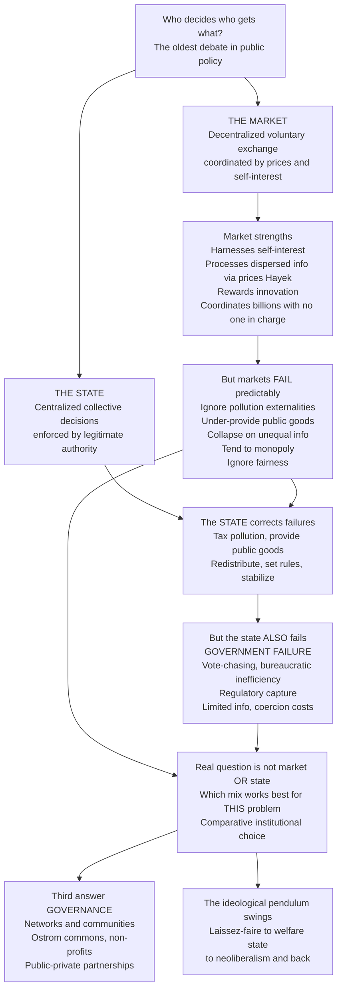

# ⚖️ The State, Markets, and Governance

> [!abstract] TL;DR
> The oldest and most consequential question in all of public policy is **who should decide who gets what** — the **MARKET** (millions of buyers and sellers trading freely, coordinated by prices) or the **STATE** (collective decisions enforced by legitimate authority). Markets are astonishing coordinators: they harness self-interest, process vast **dispersed information through prices** (Hayek's insight that no central planner could ever know what a market "knows"), reward innovation, and organize billions of decisions with **no one in charge** — yet they **fail predictably**, ignoring pollution, under-providing public goods, collapsing under unequal information, tending to monopoly, and disregarding **fairness**. The state can correct these failures, but it too fails predictably (**government failure**): vote-chasing, bureaucratic bloat, regulatory capture, limited information, and the costs of coercion. So the real question is never "market **or** state" — both are essential and both fail — but the pragmatic, **comparative-institutional** one: for *this* problem, which imperfect institution, or which **hybrid of state, market, and community governance** (Ostrom's commons, networks, partnerships), works least badly. This state–market relationship is the foundational lens through which every policy question in this vault is ultimately viewed.

---

## Intuition

**Analogy — two ways to run a dinner for a thousand people.** You could hand everyone money and open a food hall: a thousand cooks and eaters trading freely, prices telling the curry stall to make more and the sushi stall to make less, nobody in charge, and — remarkably — everyone roughly fed by nightfall. That is the **MARKET**. Or you could appoint a head chef who plans every plate, rations the salt, and enforces the menu. That is the **STATE**. The food hall is miraculous at matching a thousand tastes to a thousand dishes using only prices — but it will happily let the person with no money go hungry, it will fill the room with smoke nobody paid to clean up, and the biggest stall may quietly buy out the rest. The head chef can feed the penniless, ban the smoke, and break up the monopoly — but he cannot possibly know every diner's craving, he will be lobbied by the stalls, and he may keep cooking whatever keeps *him* in the job. Neither the food hall nor the head chef is "the answer." The real question is which dishes to leave to the hall, which to hand to the chef, and which to let the **diners organize among themselves** — a neighborhood potluck, run by neither.

That third option matters. Long before there was a state or a market, communities fed themselves by shared rules — and Elinor Ostrom showed that self-organized communities can still manage shared resources (fisheries, forests, irrigation) without either a central planner or private ownership. The whole of public policy is the art of assigning each problem to the coordinating mechanism — market, state, or **governance** by community and network — that handles *its* particular failures least badly.

---

## How It Works

### Core Mechanics

**1. Two great coordinating mechanisms.** Every society must solve the same problem — allocating scarce resources among competing uses and people. There are two pure ways to do it. The **market** decentralizes the decision to voluntary exchange: prices emerge from countless bilateral trades and act as signals and incentives, so that self-interested actors, pursuing only their own ends, are led "as if by an invisible hand" to a coordinated outcome nobody designed. The **state** centralizes the decision: a collective authority, legitimated by law or democratic mandate, makes binding rules and backs them with **coercion** (taxes, regulations, prohibitions).

**2. The case for the market — efficiency, information, incentives.** Under idealized conditions (many buyers and sellers, no externalities, full information, well-defined property rights), the **First Welfare Theorem** proves a competitive equilibrium is **Pareto-efficient** — you cannot make anyone better off without making someone worse off. Just as important is Hayek's **knowledge problem**: the information needed to run an economy — every local shortage, preference, and skill — is *dispersed* across millions of minds and never given to any single planner. The **price mechanism** is a giant, decentralized information processor: a frost in Brazil raises the coffee price worldwide, and every buyer economizes without ever knowing *why*. This is why central planning stumbles on the **socialist calculation debate** — without market prices, planners are computing blind.

**3. Why markets fail — the standard rationales for intervention.** The First Welfare Theorem's assumptions are routinely violated, producing the four canonical **market failures**: **externalities** (pollution imposes costs on third parties the price ignores), **public goods** (national defense, clean air, basic research are non-excludable and non-rival, so private actors under-provide them), **information asymmetries and incomplete markets** (unequal information collapses insurance and lemons markets), and **market power / monopoly** (concentration lets sellers restrict output and raise price). Beyond efficiency lies a fifth, deeper failure: markets can be perfectly efficient and grossly **unjust** — a market can clear while millions starve, because efficiency says nothing about **distribution**. These are the reasons societies reach for the state.

**4. The case against the state — government failure.** The state can correct all of the above — tax the polluter, fund the public good, regulate the monopolist, redistribute to the poor, stabilize the macroeconomy. But the **public-choice** critique insists government is not a benevolent, omniscient fixer. Politicians chase **votes** and bureaucrats chase **budgets**, not social welfare; interest groups engage in **rent-seeking** and **capture** the very regulators meant to police them; planners face the same information limits Hayek diagnosed; interventions breed **unintended consequences**; and coercion itself carries liberty and deadweight costs. Both markets **and** governments fail.

**5. The comparative-institutional turn.** Because *both* institutions are imperfect, the correct question is not "does the market fail?" (it does) but "**which imperfect institution is less bad for this particular problem?**" — Wolf's *Markets or Governments* and Coase's insistence on comparing real institutions rather than a real market against an idealized state. Policy becomes a **comparative** choice among flawed alternatives, decided problem by problem.

**6. Beyond the dichotomy — governance.** The "market vs state" framing is too binary. A vast middle ground exists: the **third sector** (civil society, non-profits), **polycentric governance** through overlapping community institutions, **public–private partnerships**, and networks. Ostrom's Nobel work demonstrated that **common-pool resources** are frequently governed sustainably by neither market nor state but by self-organized communities following durable design principles. The intellectual shift is from **government** (command from the center) to **governance** (coordination across many actors and levels).

**7. The historical pendulum.** Which mix a society favors swings ideologically over time: classical **laissez-faire** liberalism → the **New Deal / welfare-state** expansion and Keynesian demand management → **neoliberalism** (privatization, deregulation, "the market knows best") → and, after the 2008 crisis and the pandemic, a renewed re-evaluation of the state's role. The state–market balance is the very axis of the left–right debate.

### Flow / Architecture



---

## Key Concepts

**Secondary (intuitive foundations)**
- **Two ways to coordinate a society.** The **market** = free voluntary trade, guided by prices, nobody in charge. The **state** = collective rules, made and enforced by government.
- **What markets are great at.** Matching supply to demand, rewarding good ideas, and organizing billions of choices without a planner — all through prices.
- **What markets ignore.** Pollution (costs pushed onto others), things everyone needs but no one will pay for (defense, clean air), and **fairness** — a market can run smoothly while people go hungry.
- **Why we can't just use government instead.** Government can fix those gaps, but it wastes money, gets captured by lobbyists, and can't know everything. Both sides fail.
- **A third path.** Communities can manage shared resources themselves (a village sharing a fishery), which is neither pure market nor pure state — this is **governance**.

**Undergraduate (formal economics and political economy)**
- **First Welfare Theorem.** A competitive equilibrium is Pareto-efficient *if* markets are complete and competitive with no externalities — the formal case for markets, and a map of exactly when it breaks.
- **The four canonical market failures.** Externalities, public goods, market power, asymmetric information — each with a matching corrective policy (Pigouvian tax, public provision, antitrust, disclosure/mandates).
- **Hayek's knowledge problem and the calculation debate.** Prices aggregate dispersed local knowledge no planner can collect; without them, central planning cannot rationally allocate. The Mises–Hayek vs Lange–Lerner debate is the theoretical core.
- **Public-choice theory / government failure.** Applying self-interest to *political* actors: median-voter dynamics, rent-seeking, regulatory capture (Stigler), bureaucratic budget-maximizing, and the resulting inefficiencies of intervention.
- **Comparative institutional analysis.** Wolf's symmetry of market and non-market failure; Coase's demand to compare *actual* institutions. The policy question is which flawed institution minimizes total (allocative + transaction + political) cost.

**Graduate (synthesis and frontier)**
- **Polycentric governance and the commons.** Ostrom's refutation of the "tragedy of the commons" inevitability: self-organized common-pool-resource institutions with monitoring, graduated sanctions, and nested enterprises — a governance mode orthogonal to the market–state axis.
- **Embeddedness and the social construction of markets.** Polanyi's *Great Transformation* — markets are politically instituted, not natural; the "self-regulating market" is a utopia. North's institutions as the "rules of the game" shaping economic performance.
- **The theory of the second best.** When one optimality condition is unattainable, satisfying the *others* is no longer necessarily optimal — so removing one distortion (deregulating) can *reduce* welfare, complicating any clean "more market vs more state" prescription.
- **Varieties of capitalism.** Liberal Market Economies vs Coordinated Market Economies vs developmental states — the state–market boundary is drawn differently across nations with systematically different growth and distribution.
- **Market design as engineered governance.** Mechanism/auction design (spectrum auctions, matching markets) shows the boundary is not a line but a *design space*: the state constructs markets where none existed, blurring "market vs state" entirely.

---

## Python Demo

```python
# The State, Markets, and Governance
# (a) COMPARATIVE INSTITUTIONS: for each problem, which failure is worse?
#     Welfare loss under pure-market vs pure-government provision across a
#     spectrum of goods -> the better institution depends on the problem,
#     with a hybrid-governance band where neither clearly dominates.
# (b) HAYEK PRICE COORDINATION: a decentralized price adjusts to clear a
#     market, aggregating dispersed supply/demand info no planner has --
#     different starting guesses all self-organize to the same equilibrium.

import numpy as np
import matplotlib.pyplot as plt

# ---------- (a) Market failure vs government failure: the optimal mix ----------
# s = severity of market failure for a good, from ~0 (near-private good, tiny
# externality) to 1 (pure public good / large externality like pollution).
s = np.linspace(0.0, 1.0, 400)

# Market welfare loss GROWS with the severity of the market failure (markets
# do fine at low s, terribly at high s -> convex).
market_loss = 1.00 * s**2

# Government welfare loss is a roughly FIXED institutional cost (bureaucracy,
# capture, information limits) that barely scales with the good's severity.
gov_loss = 0.25 + 0.10 * s

# Best-achievable loss = choose the less-bad institution problem by problem.
best_loss = np.minimum(market_loss, gov_loss)

# Crossover (comparative-institutional boundary) and a "hybrid governance" band
# where the two institutions are within 0.05 of each other (neither dominates).
cross_idx = np.argmin(np.abs(market_loss - gov_loss))
s_cross = s[cross_idx]
hybrid = np.abs(market_loss - gov_loss) < 0.05

fig, (ax1, ax2) = plt.subplots(1, 2, figsize=(13, 5))

ax1.plot(s, market_loss, color="#b45309", lw=2.5, label="Pure-market provision")
ax1.plot(s, gov_loss, color="#065f46", lw=2.5, label="Pure-government provision")
ax1.plot(s, best_loss, color="#1e40af", lw=2.0, ls="--",
         label="Comparative-institutional best")
ax1.axvline(s_cross, color="gray", ls=":", lw=1.5)
ax1.fill_between(s, 0, 1.2, where=s < s_cross, color="#b45309", alpha=0.06)
ax1.fill_between(s, 0, 1.2, where=s > s_cross, color="#065f46", alpha=0.06)
ax1.fill_between(s, 0, 1.2, where=hybrid, color="#6d28d9", alpha=0.18,
                 label="Hybrid governance band")
ax1.text(0.14, 1.02, "MARKET\nwins", ha="center", color="#b45309", fontsize=10)
ax1.text(0.85, 1.02, "STATE\nwins", ha="center", color="#065f46", fontsize=10)
ax1.set_xlabel("Severity of market failure for the good\n(private good -> public good / pollution)")
ax1.set_ylabel("Welfare loss (lower is better)")
ax1.set_title("(a) No universal winner:\nthe less-bad institution depends on the problem")
ax1.set_ylim(0, 1.2)
ax1.legend(loc="upper left", fontsize=8)
ax1.grid(alpha=0.25)

# ---------- (b) Hayek: decentralized price coordination to equilibrium ----------
# Linear demand D(p) = d0 - d1*p and supply S(p) = s0 + s1*p. No auctioneer:
# price rises with excess demand and falls with excess supply (tatonnement).
d0, d1 = 100.0, 2.0    # demand intercept / slope
s0, s1 = 20.0, 3.0     # supply intercept / slope
p_star = (d0 - s0) / (d1 + s1)   # analytic market-clearing price

k = 0.05                # adjustment speed
T = 60
starts = [5.0, 20.0, 35.0]      # three "planners' guesses" / dispersed starts
colors = ["#dc2626", "#0c4a6e", "#d97706"]

for p0, c in zip(starts, colors):
    p = np.zeros(T)
    p[0] = p0
    for t in range(1, T):
        excess_demand = (d0 - d1 * p[t-1]) - (s0 + s1 * p[t-1])
        p[t] = p[t-1] + k * excess_demand      # price moves on excess demand
    ax2.plot(p, color=c, lw=2, label=f"start p={p0:.0f}")

ax2.axhline(p_star, color="black", ls="--", lw=1.5,
            label=f"market-clearing p*={p_star:.1f}")
ax2.set_xlabel("Iteration (decentralized adjustment, no central planner)")
ax2.set_ylabel("Price")
ax2.set_title("(b) Hayek's price mechanism:\ndispersed guesses self-organize to one clearing price")
ax2.legend(loc="best", fontsize=8)
ax2.grid(alpha=0.25)

plt.tight_layout()
plt.savefig("state_markets_governance.png", dpi=120)
print(f"Comparative-institutional crossover at s = {s_cross:.2f}")
print(f"Below it markets are less bad; above it the state is less bad.")
print(f"Market self-organizes to p* = {p_star:.2f} from every starting guess.")
```

**What it shows.** Panel (a) makes the comparative-institutional point concrete: pure-market loss is small for near-private goods but explodes for pollution and public goods, while government's failure cost is roughly fixed — so the **crossover** marks where the state becomes the less-bad institution, with a purple band where neither dominates and **hybrid governance** may do best. There is *no universal winner*. Panel (b) is Hayek in miniature: three different starting prices, each ignorant of the "true" equilibrium, all **converge to the same market-clearing price** through purely local excess-demand adjustments — decentralized coordination aggregating information no single actor possesses.

---

## Real-World Applications

> **Carbon pricing (externalities → state corrects the market).** Greenhouse emissions are the textbook externality: the market price of fuel ignores the climate damage. The EU Emissions Trading System and carbon taxes are the state re-pricing the externality so the market can work correctly again — a *market-based* government intervention, exactly the hybrid the comparative-institutional view predicts.

> **The 2008 financial crisis and the pendulum.** Three decades of neoliberal deregulation (the "market knows best" era) preceded a systemic collapse that only massive state bailouts and new regulation (Dodd–Frank) could arrest — a textbook swing of the historical pendulum back toward the state, and a live case of government correcting information-asymmetry and systemic-risk market failures.

> **Ostrom's commons (governance beyond market and state).** Alpine grazing meadows, Spanish *huerta* irrigation communities, and inshore fisheries have been governed sustainably for centuries by neither privatization nor state control but by self-organized community rules — the empirical backbone of the "third answer," polycentric governance.

> **Public goods provision (national defense, basic research).** No profit-seeking firm will supply national defense (non-excludable, non-rival), so it is almost universally state-provided and tax-financed — the clearest case where markets structurally under-provide and only collective action suffices.

---

## Common Pitfalls

- **The Nirvana fallacy (comparing real markets to an idealized state).** Diagnosing a market failure and then assuming a perfectly informed, benevolent government will fix it. The honest comparison is between *both* institutions as they actually are, warts and all — Coase's and Wolf's central discipline.
- **Treating "market failure" as automatically implying "government."** A market failure is necessary but not sufficient for intervention: if the government failure is worse than the market failure, doing nothing (or using community governance) may be better. The existence of a problem does not identify who should solve it.
- **Assuming markets are "natural" and the state is an intrusion.** Every market rests on state-defined property rights, contract enforcement, and courts (Polanyi's point). Markets are *constructed*, so "leaving it to the market" is itself a political choice about which rules to set.
- **Ideological monism ("markets always" or "the state always").** The pendulum's swings show that *both* pure positions periodically overreach and provoke correction. The comparative-institutional view is not centrist mush — it is the recognition that the right answer is problem-specific.
- **Forgetting the second best.** Removing one distortion in a world full of others can reduce welfare. "Deregulate because free markets are efficient" ignores that efficiency requires *all* the conditions to hold at once.
- **Ignoring distribution by hiding behind efficiency.** "The market outcome is efficient" is not a defense of its justice — efficiency is silent about *who* gets what. Equity is a separate, legitimate rationale for intervention.

---

## Related Concepts

**Cross-vault links (Glob-verified):**

- [[Market_Failures]] — the four canonical reasons markets alone are insufficient; this note's engine room for "why the state gets involved."
- [[Public_Goods]] — the non-excludable, non-rival goods markets structurally under-provide, the clearest case for collective provision.
- [[Externalities_and_Pigouvian_Tax]] — pollution as the paradigm market failure and the state re-pricing it, the model behind carbon pricing above.
- [[Coase_Theorem]] — the counterpoint showing that with clear property rights and low transaction costs, *markets* can internalize externalities without the state — a pillar of the comparative-institutional view.
- [[Political_Economy_and_Market_State_Relations]] — the political-science treatment of the same contested boundary, adding varieties of capitalism and the "markets are politically constructed" thesis.
- [[Economies_as_Complex_Adaptive_Systems]] — reframes Hayek's spontaneous order as emergence, deepening why no central planner can compute what a market "knows."

**Within this vault (siblings, to be built):** this note is the foundational lens for *Public_Policy_and_Governance_Overview*; it supplies the market-failure half of *Rationales_for_Government_Intervention*; the government-failure half feeds *Public_Choice_and_Political_Economy*; the "rules of the game" thread runs into *Institutions_and_Institutional_Design*; and the commons / third-answer thread continues in *Institutions_Rules_and_Commons_Governance*.

---

## Review Questions

1. **(Secondary)** Give one thing the market does better than any government could, and one thing the market cannot do at all. Why does each strength or weakness arise?
2. **(Secondary → Undergraduate)** Explain Hayek's "knowledge problem" in your own words, and use it to say why abolishing prices and planning an economy centrally tends to fail.
3. **(Undergraduate)** A city has terrible traffic congestion (an externality). Walk through the comparative-institutional analysis: what would a pure-market response, a pure-state response, and a Coasean/governance response each look like, and what determines which is least bad?
4. **(Undergraduate)** "This market has a market failure, therefore the government should intervene." Identify the two logical gaps in this sentence and name the fallacy the first one commits.
5. **(Graduate)** Ostrom showed communities can govern common-pool resources without market privatization or state control. Where does this "third answer" sit relative to the market–state axis, and what design conditions make it succeed or fail?
6. **(Graduate)** Using the theory of the second best and Polanyi's embeddedness thesis, construct the strongest possible case *against* the slogan "less regulation always means freer, more efficient markets."

---

## Sources

- Hayek, F. A. (1945). ["The Use of Knowledge in Society."](https://www.econlib.org/library/Essays/hykKnw.html) *American Economic Review*, 35(4), 519–530.
- Wolf, C. (1988). *Markets or Governments: Choosing between Imperfect Alternatives.* MIT Press.
- Stiglitz, J. E. & Rosengard, J. K. (2015). *Economics of the Public Sector* (4th ed.). W. W. Norton.
- Ostrom, E. (1990). *Governing the Commons: The Evolution of Institutions for Collective Action.* Cambridge University Press.
- Polanyi, K. (1944). *The Great Transformation: The Political and Economic Origins of Our Time.* Beacon Press.

---

#public-policy #state-vs-market #market-failure #government-failure #governance
