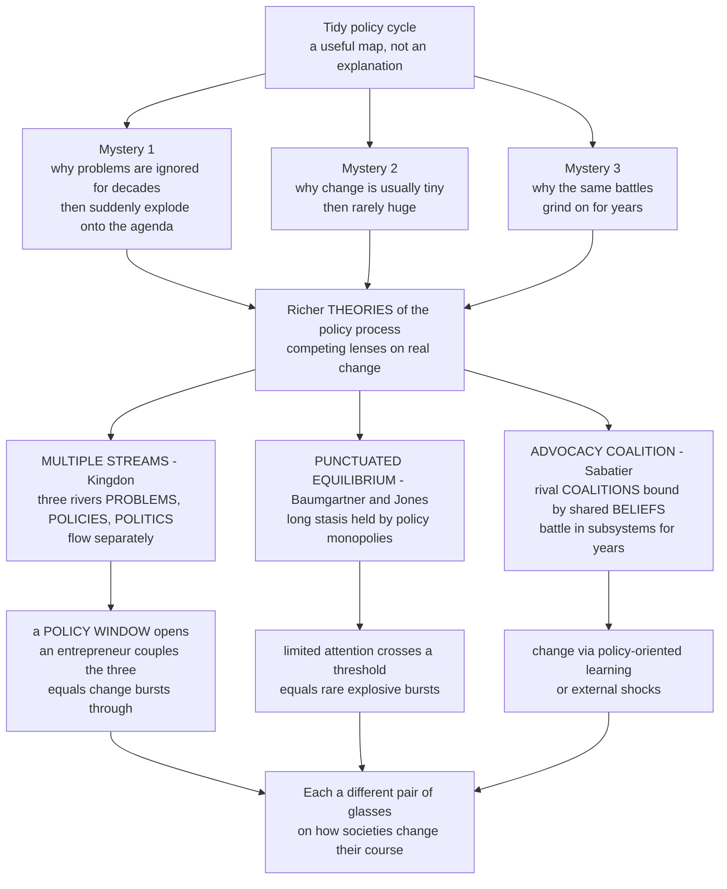

# 🌊 Theories of the Policy Process

> [!abstract] TL;DR
> The tidy **policy cycle** is a useful *map* but not an *explanation* — it cannot tell you why some problems are ignored for decades then explode onto the agenda, why policy usually changes in tiny increments punctuated by rare dramatic lurches, or why the same coalitions grind out the same battles for years. To answer these mysteries, political scientists built causal **theories of the policy process**, three of which are essential. The **Multiple Streams Framework** (Kingdon) pictures three independent rivers — **problems, policies, politics** — that couple only when a **policy window** opens and a **policy entrepreneur** joins them. **Punctuated Equilibrium Theory** (Baumgartner & Jones) explains the *rhythm* of change: long stasis enforced by **policy monopolies** and bounded attention, broken by rare explosive **punctuations**, leaving a telltale **leptokurtic** (fat-tailed) signature. The **Advocacy Coalition Framework** (Sabatier) explains persistent *conflict*: rival **coalitions** bound by shared **belief systems** battle within **subsystems** for years, changing only through **learning** or **external shocks**. Each is a different pair of glasses; together they reveal that policymaking is stranger, more path-dependent, and more idea-driven than any stage model implies.

---

## Intuition

**Analogy — three pairs of glasses for a mystery no map can solve.** Imagine you are handed a beautiful subway map of "how a bill becomes a law": problem → agenda → formulation → adoption → implementation → evaluation. It is clean, it is teachable — and it is almost useless for predicting anything. The map cannot tell you *why the train sometimes sits in the station for thirty years and then rockets three stops in a week.* To see the hidden machinery you need not a better map but better **glasses**, and it turns out three different pairs each reveal a different truth.

Put on the first pair — **Multiple Streams** — and the calm government scene dissolves into **three separate rivers flowing past each other**: a river of *problems* (indicators worsening, disasters happening), a river of *policy ideas* bobbing in a "primeval soup" waiting for a taker, and a river of *politics* (moods, elections, who holds power). Most days the rivers never touch and nothing happens. Then a rare **policy window** opens — a crisis, a new administration — and a nimble **policy entrepreneur** lashes the three rivers together, and change bursts through. Timing and luck suddenly explain everything.

Swap to the second pair — **Punctuated Equilibrium** — and you see the *rhythm*: policy sits in near-frozen stasis, tweaked at the margins by entrenched insiders, because human and institutional **attention is scarce** and issues stay ignored until pressure crosses a threshold; then attention **cascades**, the dam breaks, and change comes in one violent lurch. Measure the changes and they form a strange **fat-tailed** distribution — a towering spike of tiny adjustments plus a few earthquakes — nothing like the gentle bell curve "steady incrementalism" would produce.

Put on the third pair — **Advocacy Coalition** — and the same policy arena reveals **rival teams** who have been fighting for a generation, each glued together not by self-interest alone but by a shared **belief system** so sticky that people almost never change their minds except through slow **learning** or an outside **shock**. That is why the climate battle, the gun battle, the drug-policy battle feel eternal. Three lenses, three truths — and together they explain how societies really change their collective course.

---

## How It Works

### Core mechanics

1. **Why the cycle is not enough.** The [[Policy_Analysis_and_the_Policy_Process|stages heuristic]] (the policy cycle) is a descriptive *scaffold*, not a causal *theory*: it never says why an issue jumps stages, stalls, or skips them. Sabatier's field-defining project was to replace the heuristic with **falsifiable models** of agenda change, policy change, and stability that give explicit roles to **ideas, institutions, and interests**.

2. **Multiple Streams Framework (MSF).** Descended from the "garbage can" model of organizational choice, MSF treats government as three largely **independent streams**:
   - **Problem stream** — conditions become *problems* through **indicators**, **focusing events** (crises, disasters), and **feedback** from existing programs.
   - **Policy stream** — solutions ferment in a **"policy primeval soup"** inside policy communities; ideas survive by **technical feasibility** and **value acceptability**, not by matching any particular problem.
   - **Politics stream** — the **national mood**, **elections**, **interest-group** pressure, and **administrative turnover** move on their own logic.
   A **policy window** opens (predictably, e.g. a budget cycle, or unpredictably via a focusing event). A **policy entrepreneur** invests resources to **couple** the streams — attaching a ready solution to a live problem in a favorable political moment — and the issue reaches the decision agenda.

3. **Punctuated Equilibrium Theory (PET).** Policy exhibits two regimes. In **stasis**, a **policy monopoly** (an insider subsystem plus a supportive **policy image**) enforces **negative feedback** and incremental tweaking. Because attention is a scarce resource, most issues are processed serially and ignored. When a challenger reframes the **image** or shifts the **venue** (from a friendly committee to a hostile court or the mass public), **positive feedback** and **attention cascades** ignite a **punctuation** — rapid, large-scale change. Aggregated over many issues, the *disproportionate information processing* of bounded institutions produces a **leptokurtic** distribution of changes: extreme peak, extreme tails.

4. **Advocacy Coalition Framework (ACF).** Policy is made inside a **subsystem** by two-to-four **advocacy coalitions**. Members are bound by a three-tier **belief system**: **deep core** (fundamental values, near-immutable), **policy core** (basic strategy for the subsystem, very stable), and **secondary beliefs** (instrumental details, more flexible). Coalitions compete for years. Change to secondary beliefs comes from **policy-oriented learning**; change to the policy core almost always requires an **external shock** (elections, crises, spillover). **Policy brokers** mediate to reach workable compromise.

5. **The common threads.** All three rest on **bounded rationality** and share the "**three I's**" — **ideas** (images, beliefs, the soup), **institutions** (venues, subsystems, rules), and **interests** (coalitions, entrepreneurs). They are **complementary lenses**, not rivals: MSF explains *timing*, PET explains *rhythm and magnitude*, ACF explains *persistent conflict*.

### One diagram — from a map that fails to three lenses that work



---

## Key Concepts

### Secondary (the big picture)
- **The cycle is a map, not an engine.** It shows the *steps* of policymaking but not *why* change happens or stalls.
- **Multiple Streams:** problems, policies, politics flow separately; a **policy window** plus a **policy entrepreneur** couples them.
- **Punctuated Equilibrium:** most change is tiny; occasionally there is a huge, sudden lurch.
- **Advocacy Coalitions:** groups that share deep **beliefs** fight over policy for years and rarely change their minds.

### Undergraduate (the mechanisms)
- **MSF components:** problem stream (**indicators, focusing events, feedback**), policy stream (**primeval soup**, selection by **technical feasibility** and **value acceptability**), politics stream (**national mood, turnover, interest groups**); windows open predictably or via focusing events; **coupling** by entrepreneurs.
- **PET components:** **policy monopolies**, **policy images**, **venue shopping**, **negative vs positive feedback**, **bounded attention** and serial processing, and the empirical **leptokurtic / fat-tailed** distribution of policy change.
- **ACF components:** **subsystems**, **coalitions**, the three-tier **belief system** (deep core / policy core / secondary), **policy-oriented learning**, **external perturbations**, and **policy brokers**.
- **Intellectual lineage:** MSF descends from the **garbage can model** (Cohen, March, Olsen); the baseline it improves on is Lindblom's **incrementalism** ("the science of muddling through").

### Graduate (frontiers and synthesis)
- **Micro-foundations of PET:** *disproportionate information processing* under **bounded rationality** and institutional **friction/cost**; the general punctuation thesis extends from budgets to attention and elections (Jones & Baumgartner, *The Politics of Attention*).
- **ACF refinements:** the "**devil shift**" (coalitions demonize opponents), the stability of the policy core, and how minority coalitions marshal resources; belief-system measurement debates.
- **Adjacent frameworks:** the **Institutional Analysis and Development (IAD)** framework (Ostrom) linking rules and commons governance; the **Social Construction of Target Populations** (Ingram & Schneider — who gets what and why); the **Narrative Policy Framework**; **policy diffusion and innovation** (Berry & Berry); and **historical institutionalism / path dependence**.
- **Synthesis and testing:** the frameworks are **complementary**, not mutually exclusive; scholars combine MSF windows with ACF subsystems and PET signatures. The recurring debate is *operationalization* — Sabatier's criteria for what makes a "good" policy theory (clarity, falsifiability, scope). The unifying vocabulary is the **three I's**: **ideas, institutions, interests**.

---

## Python Demo

```python
"""
Theories of the Policy Process -- two computational signatures.

(a) PUNCTUATED EQUILIBRIUM (Baumgartner & Jones): policy change over time is
    mostly tiny incremental tweaks punctuated by rare, huge lurches. The
    distribution of CHANGES is LEPTOKURTIC -- a towering peak of small
    adjustments plus a few extreme jumps, with far fatter tails than the
    Gaussian a "steady incrementalist" world would produce. This fat-tailed
    shape is the empirical fingerprint found across budgets and attention data.

(b) MULTIPLE STREAMS (Kingdon): three independent streams (problem, policy,
    politics) fluctuate on their own; a POLICY WINDOW opens -- and major change
    becomes possible -- only in the rare moments all three align (a coupling).
"""
import numpy as np
import matplotlib.pyplot as plt

rng = np.random.default_rng(42)
T = 4000

# ---------- (a) Punctuated-equilibrium change process ----------
p_jump = 0.02                          # punctuations are rare
is_jump = rng.random(T) < p_jump
small = rng.normal(0.0, 1.0, T)        # routine incremental adjustments
big   = rng.normal(0.0, 12.0, T)       # explosive punctuations
changes = np.where(is_jump, big, small)
level = np.cumsum(changes)             # the "policy level" trajectory

mu, sd = changes.mean(), changes.std()
excess_kurt = np.mean(((changes - mu) / sd) ** 4) - 3.0   # Gaussian -> 0

# ---------- (b) Multiple-streams coupling ----------
def stream(rho=0.92):
    """A slow autocorrelated stream scaled to 0..1."""
    x = np.zeros(T)
    innov = rng.normal(0.0, 1.0, T)
    for t in range(1, T):
        x[t] = rho * x[t-1] + np.sqrt(1 - rho**2) * innov[t]
    return (x - x.min()) / (x.max() - x.min())

problem, policy, politics = stream(), stream(), stream()
thr = 0.72
window = (problem > thr) & (policy > thr) & (politics > thr)

# ---------- Plots ----------
fig, ax = plt.subplots(1, 3, figsize=(15.5, 4.4))

# stasis-then-lurch trajectory
ax[0].plot(level, color="#1f77b4", lw=1.0)
jump_idx = np.where(is_jump)[0]
ax[0].scatter(jump_idx, level[jump_idx], s=14, color="crimson",
              zorder=3, label="punctuations")
ax[0].set_title("Policy level over time\nlong stasis, rare lurches")
ax[0].set_xlabel("time"); ax[0].set_ylabel("cumulative policy change")
ax[0].legend(loc="upper left", fontsize=8)

# leptokurtic distribution vs Gaussian, log-y to reveal the fat tails
lo, hi = changes.min(), changes.max()
bins = np.linspace(lo, hi, 60)
ax[1].hist(changes, bins=bins, density=True, color="#8888cc",
           alpha=0.7, label="policy changes")
xg = np.linspace(lo, hi, 400)
gauss = np.exp(-0.5 * ((xg - mu) / sd) ** 2) / (sd * np.sqrt(2 * np.pi))
ax[1].plot(xg, gauss, "r--", lw=1.8, label="Gaussian, same variance")
ax[1].set_yscale("log")
ax[1].set_title("Distribution of changes\nleptokurtic, excess kurtosis "
                f"approx {excess_kurt:.1f}")
ax[1].set_xlabel("size of policy change"); ax[1].set_ylabel("density, log scale")
ax[1].legend(fontsize=8)

# three streams + coupling windows (first 600 steps for readability)
seg = slice(0, 600)
t = np.arange(T)[seg]
ax[2].plot(t, problem[seg],  label="problem",  lw=1.0)
ax[2].plot(t, policy[seg],   label="policy",   lw=1.0)
ax[2].plot(t, politics[seg], label="politics", lw=1.0)
ax[2].axhline(thr, color="grey", ls=":", lw=1.0)
ax[2].fill_between(t, 0, 1, where=window[seg], color="gold", alpha=0.35,
                   label="policy window open")
ax[2].set_title("Multiple streams\nchange possible only when all three align")
ax[2].set_xlabel("time"); ax[2].set_ylabel("stream level, 0..1")
ax[2].legend(fontsize=8, loc="upper right")

plt.tight_layout()
plt.show()

print(f"Excess kurtosis of policy changes: {excess_kurt:.2f}  (Gaussian = 0)")
print(f"Coupling windows opened: {window.sum()} of {T} steps "
      f"({100 * window.sum() / T:.1f} percent of the time)")
```

**What to notice.** The middle panel is the crux of PET: on a log scale the histogram towers far above the dashed Gaussian at the center *and* stays above it in the tails — the same "peak plus fat tails" that Baumgartner & Jones found in U.S. budget authority and congressional attention. The right panel is the crux of MSF: change is only *possible* in the rare gold bands where all three streams clear the threshold at once — the alignment is scarce and timing-dependent, exactly why entrepreneurs and luck matter.

---

## Real-World Applications

> **U.S. tobacco control (PET, Baumgartner & Jones's own case).** For decades a **policy monopoly** framed tobacco as an agricultural commodity and jobs program; the friendly **image** and congressional **venue** enforced stasis. When health advocates reframed it as a public-health and children's issue and shifted the fight into **courts, the FDA, and the states**, positive feedback cascaded into a rapid **punctuation** — master settlements, advertising bans, and taxes. A textbook stable-then-lurch trajectory.

> **The 2008 financial crisis and TARP (MSF).** The crash was a classic **focusing event** that opened a **policy window**. Solutions such as bank recapitalization had long floated in the **policy soup**; a favorable **politics stream** (a lame-duck administration and an incoming one both alarmed) let entrepreneurs **couple** a ready solution to the live problem within weeks — change that had been unthinkable months earlier.

> **Climate policy stalemate (ACF).** The climate subsystem is dominated by durable rival **coalitions** whose disagreement runs to the **policy core** (the role of markets, growth, and the state). Because core beliefs barely move, incremental **learning** shifts only secondary details; the big lurches (Paris Agreement, national carbon pricing) tend to follow **external shocks** — elections, extreme-weather focusing events, or economic upheaval.

> **COVID-19 as a global window (MSF + PET).** The pandemic simultaneously opened windows across dozens of policy domains — remote work, public-health authority, fiscal transfers — producing synchronized **punctuations** in areas frozen for years, then partial reversion as the windows closed. A live demonstration that magnitude and timing, not orderly stages, govern real change.

---

## Common Pitfalls

- **Treating the policy cycle as a causal theory.** The stages heuristic *describes* steps; it cannot *predict* jumps or stalls. Using it to "explain" change is the single most common error — it is a filing system, not an engine.
- **Reifying the three streams as fully independent.** MSF's streams are *analytically* separate, but entrepreneurs, institutions, and prior policy actively link them. Forgetting the **coupling agent** turns the framework into fatalism about luck.
- **Reading punctuations as randomness or irrationality.** The fat tail is not noise; it is the *lawful* consequence of **bounded attention** and institutional friction. "It just happened suddenly" misses that stasis was *manufactured* by a monopoly and the burst was *triggered* by an image or venue shift.
- **Confusing incrementalism with the absence of theory.** "Muddling through" is a substantive claim about bounded rationality, not a null result — and PET is precisely the theory of *when* incrementalism breaks.
- **Expecting belief change to be easy in ACF.** Deep-core and policy-core beliefs are extraordinarily sticky; assuming coalitions will be persuaded "by the evidence" ignores the **devil shift** and the need for external shocks.
- **Forcing one lens to do all the work.** MSF, PET, and ACF illuminate *different* dynamics (timing, rhythm, conflict). Insisting a single framework explains everything discards their **complementarity** — the whole point of a *plural* toolkit.

---

## Related Concepts

- [[Policy_Analysis_and_the_Policy_Process]] — the Political-Science companion that lays out the policy cycle these theories go *beyond*; read it first to see the map before you put on the glasses.
- [[Feedback_Loops_and_Causality]] — PET is literally a story of **negative feedback** (monopoly-enforced stasis) flipping to **positive feedback** (attention cascades); this note supplies the systems vocabulary.
- [[Bifurcations_and_Tipping_Points]] — a punctuation is a policy **tipping point**: a slow-moving control parameter (accumulating attention) crossing a threshold into a sudden regime shift, complete with hysteresis.
- [[Cascades_and_Systemic_Risk]] — the **attention cascade** that drives a punctuation is a contagion process on a network of venues and actors, the same mathematics of thresholds and tipping.
- [[Bounded_Rationality_and_Satisficing]] — the shared micro-foundation: limited attention and satisficing are *why* institutions process information disproportionately and *why* the cycle's "rational" stages fail.
- [[Increasing_Returns_and_Path_Dependence]] — policy monopolies, sticky belief systems, and window timing make policy strongly **path-dependent**; early choices lock in and are costly to reverse.

Within this vault, this note sits directly alongside its siblings (files to come): the *Public_Policy_and_Governance_Overview* orientation, *The_Policy_Process_and_Policy_Cycle* (the stages heuristic examined here), *Agenda_Setting_and_Framing* (the mechanics of images, focusing events, and windows), *Institutions_Rules_and_Commons_Governance* (Ostrom's IAD framework mentioned above), and *Public_Choice_and_Political_Economy* (the interests-and-incentives lens complementing the ideas-and-institutions emphasis here).

---

## Review Questions

**Secondary.** In one sentence each, state the *core idea* of the Multiple Streams Framework, Punctuated Equilibrium Theory, and the Advocacy Coalition Framework. What is the one thing the simple "policy cycle" cannot explain that these theories can?

**Undergraduate.** A long-ignored problem suddenly reaches the national agenda after a disaster and a change of government, and a ready-made reform is adopted within a month. Using MSF, identify each **stream**, name the **focusing event** and the **policy window**, and explain the role of the **policy entrepreneur**. Then explain, using PET, why the *distribution* of policy changes over many such issues would look **leptokurtic** rather than Gaussian.

**Graduate.** MSF, PET, and ACF are often described as **complementary lenses** rather than rivals. Design a single case study (choose a real policy domain) in which you would deploy *all three* — specifying which dynamic each explains (timing, magnitude/rhythm, persistent conflict), how you would **operationalize and test** each (indicators, distributional signatures, coded belief systems), and where the frameworks make **conflicting or overlapping** predictions. How do the "three I's" — ideas, institutions, interests — reconcile them?

---

## Sources

- Kingdon, J. W. — *Agendas, Alternatives, and Public Policies* (overview: [Multiple Streams Framework](https://en.wikipedia.org/wiki/Multiple_streams_framework))
- Baumgartner, F. R. & Jones, B. D. — *Agendas and Instability in American Politics* (overview: [Punctuated equilibrium in social theory](https://en.wikipedia.org/wiki/Punctuated_equilibrium_in_social_theory))
- Sabatier, P. A. & Jenkins-Smith, H. C. — *Policy Change and Learning: An Advocacy Coalition Approach* (overview: [Advocacy Coalition Framework](https://en.wikipedia.org/wiki/Advocacy_coalition_framework))
- Weible, C. M. & Sabatier, P. A. (eds.) — [*Theories of the Policy Process*, Routledge](https://www.routledge.com/Theories-of-the-Policy-Process/Weible/p/book/9780813350523)
- Cairney, P. — [Policy Concepts in 1000 Words (MSF, PET, ACF explainers)](https://paulcairney.wordpress.com/1000-words/)

---

#public-policy #multiple-streams #punctuated-equilibrium #advocacy-coalition #policy-change
