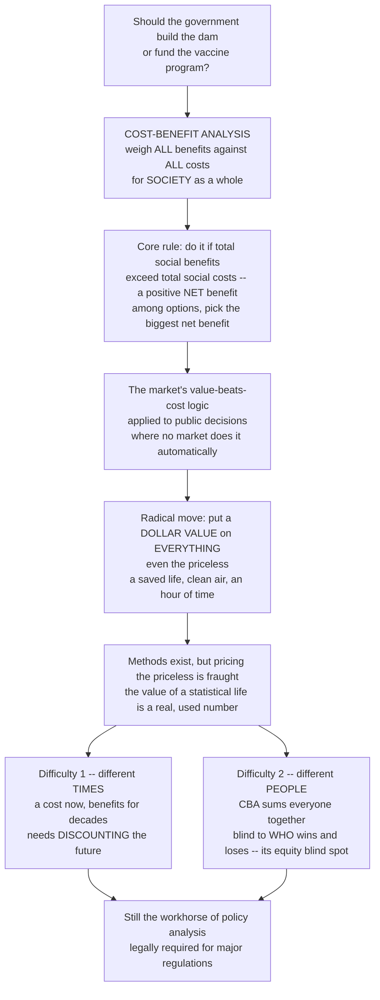

# ⚖️ Cost-Benefit Analysis

> [!abstract] TL;DR
> **Cost-benefit analysis (CBA)** is society's most systematic attempt to answer "is this policy actually worth it?" It adds up **all** the good a policy does (benefits) and **all** the resources and harm it uses (costs) — but for **society as a whole**, not one budget — and applies a beautifully simple rule: **do it if total social benefits exceed total social costs** (a positive **net benefit**), and among competing options pick the biggest net benefit. Its power and its controversy both flow from one radical move — putting a **dollar value on everything**, even the priceless (a saved life, clean air, an hour of your time). Its two famous difficulties are that costs and benefits fall at different **times** (requiring **discounting** of the future) and on different **people** (its notorious blind spot on **who** wins and loses). Despite the critiques, CBA is the workhorse of policy analysis and a legal requirement for major regulations.

---

## Intuition

**Analogy:** Should the government build this dam, tighten that pollution rule, or fund this vaccine program? CBA answers such questions the way a rational person weighs any big personal decision — say, whether to do a home renovation. You add up **all the good things** it will do (more space, higher resale value, comfort), add up **all the bad things and resources** it will use (the money, the months of noise and disruption), and you go ahead only if the good outweighs the bad. CBA does exactly this, but for an entire **society** rather than one household: sum every benefit to everyone, sum every cost to everyone, and proceed only if benefits win.

In technical terms this is the **market's logic** — do things where the value created exceeds the cost — applied deliberately to public decisions where **there is no market to do it automatically**. The genius and the trouble both come from the one radical move that makes the arithmetic possible: you must put a **dollar value on everything**, including things with no price tag — a saved life, a clear view, an hour of a commuter's time, a wetland. Economists have ingenious methods to do this, but pricing the priceless is exactly where CBA becomes ethically and technically fraught.

---

## How It Works

### Core mechanics

1. **Define the policy and its alternatives.** Always relative to a baseline — the world *with* the policy versus the world *without* it (the counterfactual), and against rival options.
2. **Enumerate all impacts, and decide whose count (standing).** Every consequence to whomever "counts" — usually all members of society — is listed as a cost or a benefit.
3. **Predict the impacts.** How many lives saved, tons of pollution avoided, hours of travel time cut? This usually needs causal evidence from program evaluation.
4. **Monetize everything.** Convert every impact into dollars. Market goods use prices and **opportunity cost**; non-market goods (safety, clean air, time) need special valuation methods (below).
5. **Discount to present value.** Because costs and benefits arrive in different years, convert each future flow to today's value using a **discount rate**, then sum to a **net present value (NPV)**.
6. **Apply the decision rule.** Proceed if **NPV = PV(benefits) − PV(costs) > 0**; among alternatives, **maximize net benefit**.
7. **Do sensitivity analysis.** Re-run under different assumptions (discount rate, value of life, effect size) to see how robust the verdict is and which assumption drives it.

The theoretical license for the summation rule is the **Kaldor-Hicks (potential-Pareto) criterion**: a policy is worth doing if the winners *could* fully compensate the losers and still come out ahead — even if that compensation never actually happens. That "even if it never happens" is precisely the equity blind spot.



---

## Key Concepts

### Secondary (intuitive grasp)
- **The core rule:** add up all the good, add up all the bad, do it if the good wins — but for society, not just yourself.
- **Net benefit:** benefits minus costs. Positive means worth doing; among options, pick the biggest net benefit.
- **Pricing the priceless:** to compare a saved life with a construction cost, both must be in the same units — dollars. That is powerful and uncomfortable at the same time.
- **The two hard parts:** costs and benefits come at different *times* and land on different *people*.

### Undergraduate (mechanisms and vocabulary)
- **Welfare-economics foundation:** CBA operationalizes the goal of **allocative efficiency** via the **Kaldor-Hicks** criterion — winners *could* compensate losers. It rests on **willingness to pay (WTP)** as the measure of value.
- **Decision rules and their pitfalls:** maximize **net present value**, *not* the **benefit-cost ratio (BCR)**. A tiny project can have a huge BCR yet a small net benefit; ratios also mislead when a cost can be netted against a benefit. Use BCR only under a hard budget constraint.
- **Monetizing non-market goods — revealed preference:** infer value from actual behavior. **Hedonic pricing** reads the price of clean air or quiet off house-price and wage differentials; **travel-cost** methods value parks by what visitors spend to get there; **averting behavior** values safety by what people spend to avoid risk.
- **Monetizing non-market goods — stated preference:** ask people directly via **contingent valuation** or WTP/WTA surveys — the only way to capture **existence value** (valuing a species you will never see), but plagued by hypothetical bias and scope insensitivity.
- **The value of a statistical life (VSL):** *not* the price of an identified person — it is WTP for small mortality-risk reductions scaled up. If 100,000 people each pay $100 to cut their annual death risk by 1-in-100,000 (one expected life saved), the implied VSL is $10 million. This is the real number used to justify safety, health, and environmental rules.
- **Discounting:** future dollars are converted to present value; long-horizon projects (climate, infrastructure) are extraordinarily sensitive to the chosen rate.

### Graduate (critique and theory)
- **WTP vs WTA divergence:** willingness to *pay* to gain a good and willingness to *accept* to give it up should be close but empirically differ sharply (endowment effect / loss aversion), so the chosen reference point can flip a verdict.
- **The discounting controversy for the far future:** the whole climate debate (Stern's ~1.4% vs Nordhaus's ~4.5%) is essentially a fight over the discount rate; the ethical question of the **rate of pure time preference** — how much to weight future generations — is smuggled into a technical parameter. Constant exponential discounting can make catastrophic distant harms nearly vanish; **declining discount rates** and social-discount-rate debates respond to this.
- **The distributional blind spot and distributional weights:** unweighted CBA is **indifferent to who gains and loses** — a dollar to a billionaire counts the same as a dollar to a pauper. **Distributional weights** can be added, but choosing them reintroduces the value judgments CBA claimed to avoid; hence the **efficiency-vs-equity** and **positive-vs-normative** tensions.
- **Standing and manipulability:** whose costs and benefits count (non-citizens? future people? animals?) is a normative choice with huge leverage, and boundary/valuation choices make CBA manipulable by advocates on both sides.
- **Uncertainty and the value of information:** proper CBA treats uncertain impacts probabilistically (expected NPV, option value, quasi-option value) rather than with single point estimates.

---

## Python Demo

```python
# Cost-Benefit Analysis, four moves:
#   (a) NPV DECISION: discount a stream of costs & benefits to present value -> net benefit
#   (b) CHOOSE among alternatives by MAXIMIZING net benefit (not the benefit-cost RATIO)
#   (c) SENSITIVITY tornado: which contested assumption (VSL, discount rate, ...) drives the verdict?
#   (d) DISTRIBUTIONAL blind spot: positive aggregate net benefit that still makes groups worse off
import numpy as np
import matplotlib.pyplot as plt

def npv(rate, cashflows, times):
    """Net present value = sum of flows discounted to today (links -> Discounting)."""
    return np.sum(cashflows / (1.0 + rate) ** times)

# ---------- (a) A worked CBA: a 30-year dam ----------
years = np.arange(0, 31)
r = 0.03                                   # social discount rate
costs = np.zeros_like(years, dtype=float)
costs[0] = 500.0                           # upfront capital ($M)
costs[1:] = 12.0                           # annual operation & maintenance
benefits = np.zeros_like(years, dtype=float)
benefits[3:] = 60.0                        # benefits begin after 3-yr construction

disc = 1.0 / (1.0 + r) ** years
cum_costs = np.cumsum(costs * disc)
cum_benefits = np.cumsum(benefits * disc)
PVC, PVB = cum_costs[-1], cum_benefits[-1]
NPV, BCR = PVB - PVC, PVB / PVC

# ---------- (b) Alternatives: maximize NET BENEFIT, beware the RATIO ----------
alts = {                                   # name: (PV benefits, PV costs)
    "Small\nfloodwall": (140.0, 70.0),     # highest ratio, tiny net benefit
    "Levee\nupgrade":   (430.0, 300.0),
    "Dam":              (PVB,   PVC),       # from panel (a)
    "Mega-\nreservoir": (1500.0, 1180.0),
}
names = list(alts)
net = np.array([b - c for b, c in alts.values()])
ratio = np.array([b / c for b, c in alts.values()])
best_net, best_ratio = int(np.argmax(net)), int(np.argmax(ratio))

# ---------- (c) Sensitivity tornado for a SAFETY REGULATION ----------
# NB = PV of (lives*VSL - annual cost) over T years, minus upfront compliance capital.
def rule_nb(vsl, lives, ccap, cann, rate, T=20):
    t = np.arange(1, T + 1)
    annual = lives * vsl - cann
    return np.sum(annual / (1.0 + rate) ** t) - ccap

base = dict(vsl=10.0, lives=2.0, ccap=100.0, cann=8.0, rate=0.03)   # $M, statistical lives/yr
lo_hi = {                                   # (low, high) for each contested assumption
    "Value of a\nstatistical life": ("vsl",  6.0, 14.0),
    "Lives saved\nper year":        ("lives", 1.0, 3.0),
    "Compliance\ncapital":          ("ccap", 60.0, 160.0),
    "Annual\ncompliance cost":      ("cann", 4.0, 14.0),
    "Discount\nrate":               ("rate", 0.01, 0.07),
}
nb_base = rule_nb(**base)
spans = []
for label, (key, lo, hi) in lo_hi.items():
    los = rule_nb(**{**base, key: lo})
    his = rule_nb(**{**base, key: hi})
    spans.append((label, min(los, his), max(los, his), abs(his - los)))
spans.sort(key=lambda s: s[3])              # widest bar (biggest driver) on top

# ---------- (d) Distributional winners vs losers for the dam ----------
groups = ["Irrigation\nfarmers", "Hydropower\n& city water", "Displaced\nvillages",
          "Downstream\nfishery", "Taxpayer\ncost share"]
impact = np.array([420.0, 240.0, -150.0, -95.0, -80.0])   # $M, sums to +335 (approx NPV)

fig, ax = plt.subplots(2, 2, figsize=(13, 9))

# (a) cumulative discounted costs vs benefits
ax[0, 0].plot(years, cum_benefits, color="#16a085", lw=2.2, label="Cumulative PV benefits")
ax[0, 0].plot(years, cum_costs, color="#c0392b", lw=2.2, label="Cumulative PV costs")
ax[0, 0].fill_between(years, cum_costs, cum_benefits,
                      where=cum_benefits >= cum_costs, color="#16a085", alpha=0.15)
ax[0, 0].set_title(f"(a) NPV of a dam = ${NPV:,.0f}M  |  BCR = {BCR:.2f}  ->  PROCEED")
ax[0, 0].set_xlabel("Year"); ax[0, 0].set_ylabel("Present value ($M)")
ax[0, 0].legend(loc="upper left", fontsize=8)

# (b) net benefit vs benefit-cost ratio
x = np.arange(len(names))
bars = ax[0, 1].bar(x, net, color="#34495e")
bars[best_net].set_color("#16a085")
ax[0, 1].set_xticks(x); ax[0, 1].set_xticklabels(names, fontsize=8)
ax[0, 1].set_ylabel("Net benefit, PVB - PVC ($M)")
for xi, (nb, rt) in enumerate(zip(net, ratio)):
    ax[0, 1].text(xi, nb + 8, f"BCR {rt:.2f}", ha="center", fontsize=8)
ax[0, 1].set_title(f"(b) Pick MAX net benefit ({names[best_net].strip()}),\n"
                   f"not max ratio ({names[best_ratio].strip()})")

# (c) sensitivity tornado
y = np.arange(len(spans))
for yi, (label, lo, hi, _) in enumerate(spans):
    ax[1, 0].barh(yi, hi - lo, left=lo,
                  color="#e67e22" if lo < 0 < hi else "#2980b9", alpha=0.85)
ax[1, 0].axvline(0, color="black", lw=1.2)
ax[1, 0].axvline(nb_base, color="grey", ls="--", lw=1, label=f"baseline NB = ${nb_base:.0f}M")
ax[1, 0].set_yticks(y); ax[1, 0].set_yticklabels([s[0] for s in spans], fontsize=8)
ax[1, 0].set_xlabel("Net benefit of the safety rule ($M)")
ax[1, 0].set_title("(c) Which assumption drives the verdict?\nVSL swings it from reject to proceed")
ax[1, 0].legend(loc="lower right", fontsize=8)

# (d) distributional blind spot
colors = ["#16a085" if v > 0 else "#c0392b" for v in impact]
ax[1, 1].bar(np.arange(len(groups)), impact, color=colors)
ax[1, 1].axhline(0, color="black", lw=1)
ax[1, 1].axhline(impact.sum(), color="#8e44ad", ls="--", lw=1.5,
                 label=f"aggregate net = +${impact.sum():.0f}M")
ax[1, 1].set_xticks(np.arange(len(groups))); ax[1, 1].set_xticklabels(groups, fontsize=8)
ax[1, 1].set_ylabel("Impact by group ($M)")
ax[1, 1].set_title("(d) Positive aggregate, yet 3 groups LOSE\nKaldor-Hicks: winners COULD compensate -- but do they?")
ax[1, 1].legend(loc="upper right", fontsize=8)

plt.tight_layout()
plt.savefig("cost_benefit_analysis.png", dpi=120)
plt.show()

# Takeaways:
#  (a) discounting a cost-now/benefits-later stream still clears the bar -> proceed.
#  (b) the small floodwall has the best RATIO but the dam has the biggest NET benefit -> build the dam.
#  (c) the contested VALUE OF A STATISTICAL LIFE, not the discount rate, decides this safety rule.
#  (d) a project can be "efficient" in aggregate while making real people worse off -> CBA's equity blind spot.
```

The panels dramatize the whole method: **(a)** the core discount-and-net worked example, **(b)** why analysts maximize net benefit rather than the seductive but misleading ratio, **(c)** how a single contested valuation — here the value of a statistical life — can flip the answer from *reject* to *proceed*, and **(d)** the distributional blind spot that a positive aggregate NPV conceals.

---

## Real-World Applications

> **Example — US regulatory impact analysis (OMB Circular A-4 / OIRA):** By executive order, every "economically significant" US federal regulation must pass a formal CBA reviewed by the Office of Information and Regulatory Affairs. Agencies monetize expected lives saved using an official **value of a statistical life** (roughly $10-12M), monetize health and environmental gains, discount over the rule's horizon (A-4 historically prescribed 3% and 7% sensitivity rates), and report net benefits. This is CBA as literal law — the workhorse that decides whether a clean-air or workplace-safety rule goes forward.

> **Example — Clean air and the value of a statistical life:** The US EPA's retrospective analysis of the Clean Air Act estimated benefits (chiefly avoided premature deaths, valued via VSL) exceeding costs by more than 30-to-1. The result is entirely driven by the VSL and the mortality estimates — exactly the contested assumptions in panel (c) — which is why the number attached to a statistical life is one of the most consequential parameters in all of public policy.

> **Example — Climate policy and the discount rate:** The **social cost of carbon** — the monetized damage from one extra ton of CO2 — is a CBA output feeding directly into climate regulation. Because the damages stretch centuries into the future, the estimate is dominated by the discount rate: the Stern Review's low rate produced urgent, large numbers; Nordhaus's higher rate produced far smaller ones. Same physics, opposite policy, because of one number about how much the far future counts.

> **Example — Infrastructure and transport appraisal (UK Green Book, World Bank):** Major dams, rail lines, and highways are appraised by discounting decades of costs and monetized benefits — travel-time savings (a huge, non-market category valued via wage rates), accidents avoided, and emissions — into a net present value and benefit-cost ratio, exactly as in panels (a) and (b).

---

## Common Pitfalls

- **Ranking projects by the benefit-cost ratio.** A small, cheap project can post a spectacular BCR yet deliver a trivial net benefit; ratios also flip when a cost is netted against a benefit. Under an unconstrained budget, always **maximize net present value**, not the ratio (panel b).
- **Hiding a value judgment in the discount rate.** For long-horizon policies the choice of discount rate is not a neutral technicality — it silently decides how much unborn generations count. State it explicitly and run the sensitivity (panel c); do not let one buried parameter dictate the verdict.
- **Treating a positive aggregate NPV as "everyone benefits."** Kaldor-Hicks only says winners *could* compensate losers, not that they *do*. A rule can be efficient in total while devastating a specific community — CBA is silent on this unless distributional weights or a separate equity analysis are added (panel d).
- **Double-counting or mixing transfers with real effects.** Higher land values that merely capitalize a nearby benefit, or taxes that move money between pockets, are **transfers**, not new social benefits. Counting both the benefit and its capitalized reflection inflates the answer.
- **Baseline and standing errors.** Forgetting to measure against the *without-policy* counterfactual (crediting a policy for gains that would have happened anyway), or quietly changing whose costs and benefits "count," can manufacture almost any result.
- **False precision from point estimates.** Reporting a single NPV for a deeply uncertain future invites overconfidence. Present ranges, expected values, and sensitivity/tornado analysis so readers see how contested the verdict really is.
- **Assuming the priceless has been priced correctly.** Contingent-valuation surveys suffer hypothetical bias and scope insensitivity; hedonic and wage-risk estimates rest on strong assumptions. Monetized non-market values are estimates with wide error bars, not facts.

---

## Related Concepts

- [[Time_Value_of_Money]] — the present-value / discounting engine underneath every CBA; converting future costs and benefits to today's dollars is step 5 of the method.
- [[Capital_Budgeting]] — the firm-level twin of CBA; the same NPV decision rule, but maximizing private profit rather than social welfare.
- [[DCF_Analysis]] — discounted-cash-flow valuation is CBA's private-sector cousin, discounting a projected stream to a present value.
- [[Consumer_and_Producer_Surplus]] — the welfare-economics measuring stick; social benefit is ultimately changes in surplus, and willingness to pay is the currency both share.
- [[Externalities_and_Pigouvian_Tax]] — externalities are the market failures CBA is used to correct; the social cost of carbon is literally a monetized externality.
- [[Market_Failures]] — CBA is the tool for deciding whether government intervention to fix a market failure actually improves welfare.
- [[Scarcity_and_Opportunity_Cost]] — "cost" in CBA means opportunity cost, the true value of the next-best use of the resources a policy consumes.
- [[Distributive_Justice_and_Inequality]] — the ethical frame for CBA's equity blind spot: aggregate efficiency says nothing about a fair distribution of gains and losses.
- [[Future_Generations_and_Intergenerational_Justice]] — the moral stakes of discounting; how the treatment of the far future turns a technical rate into a question of justice.
- [[Ethical_Frameworks_in_Practice]] — CBA is applied welfarist consequentialism; the utilitarian roots and their critics explain both its appeal and its opponents.

This note anchors the **Policy Analysis and Evaluation** section of the **Public_Policy_and_Governance** vault; its sibling notes build on it in prose: a *Policy_Analysis_Methods* note situates CBA among the analyst's tools, *Discounting_and_Valuing_the_Future* deep-dives the discount-rate controversy, *Cost_Effectiveness_and_Multi_Criteria_Analysis* covers the alternatives to full monetization, *Public_Economics_and_Welfare* supplies the Kaldor-Hicks and welfare-economics foundation, and *Program_Evaluation_and_Causal_Inference* provides the impact estimates that CBA monetizes.

---

## Review Questions

1. **(Secondary)** In one sentence, state the core rule of cost-benefit analysis, and explain why CBA has to put a dollar value on things like a saved life or an hour of time even though they have no price tag.
2. **(Undergraduate)** A small floodwall has a benefit-cost ratio of 2.0 and a net benefit of $70M; a dam has a ratio of 1.44 and a net benefit of $326M. With no binding budget constraint, which should the analyst recommend and why? What does this reveal about the danger of ranking projects by ratios?
3. **(Graduate)** A proposed climate regulation is "worth it" at a 1.4% discount rate but fails at a 4.5% rate, and its aggregate net benefit is positive while it concentrates costs on a low-income region. Explain how *both* the discount-rate choice and the Kaldor-Hicks criterion smuggle value judgments into an ostensibly technical analysis, and describe two concrete ways an analyst could make those judgments transparent.

---

## Sources

- Boardman, A., Greenberg, D., Vining, A. & Weimer, D. — *Cost-Benefit Analysis: Concepts and Practice* (5th ed., Cambridge University Press, 2018).
- US Office of Management and Budget — *Circular A-4: Regulatory Analysis* (guidance on federal cost-benefit and regulatory impact analysis).
- Viscusi, W. K. & Aldy, J. E. — "The Value of a Statistical Life: A Critical Review of Market Estimates Throughout the World," *Journal of Risk and Uncertainty*, 27(1), 2003.
- Sunstein, C. R. — *The Cost-Benefit Revolution* (MIT Press, 2018).
- Arrow, K. et al. — "Determining Benefits and Costs for Future Generations," *Science*, 341, 2013 (on discounting the far future).

---

#public-policy #cost-benefit-analysis #value-of-statistical-life #net-present-value #welfare-economics
