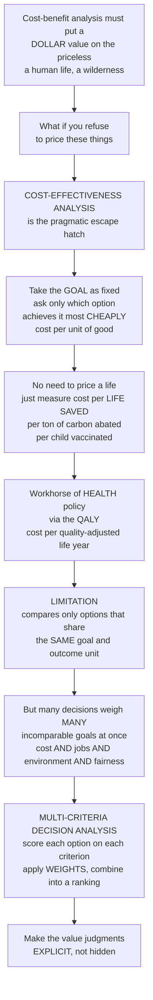

# ⚖️ Cost-Effectiveness and Multi-Criteria Analysis

> [!abstract] TL;DR
> **Cost-benefit analysis** has a discomfort at its heart: to compare everything on one scale it must put a **dollar value on the priceless** — a human life, a child's health, a wilderness. **Cost-effectiveness analysis (CEA)** is the pragmatic escape hatch. It takes a **goal as fixed** and asks only the modest question *which option achieves it most cheaply?* — cost per life saved, per ton of carbon abated, per child vaccinated — so it never has to price a life. In health, where the outcome is the clever **QALY** (a Quality-Adjusted Life Year, one year of perfect health), *cost per QALY* lets wildly different treatments be ranked on one ruler, making CEA the workhorse of health-technology assessment and **league-table** priority-setting. Its limitation is the flip side of its virtue: because it never monetizes benefits, it can only compare options with the **same** outcome — it cannot weigh a clinic against a highway. When a decision involves **many incomparable goals at once** (cost *and* jobs *and* environment *and* fairness), analysts turn to **multi-criteria decision analysis (MCDA)**, which scores each option on each criterion, applies explicit **weights**, and aggregates into a ranking — surfacing the value judgments rather than hiding them. These are the tools analysts reach for when pure dollars-and-cents logic breaks down.

---

## Intuition

**Analogy — you don't have to price the painting to buy the cheapest frame that fits it.** Suppose you have decided, for reasons beyond debate, that a certain painting *will* hang on your wall. You no longer need to argue about what the painting is *worth* in dollars — that fight is over. The only question left is a comfortable one: of the frames that will hold it, which is *cheapest*? You have quietly sidestepped the impossible valuation and kept a decision you can actually make.

Cost-benefit analysis refuses that comfort. To rule on whether a project is worth doing at all, it insists on translating *every* consequence into money — including the human life saved by a guardrail and the forest drowned by a dam. Many people feel, deeply, that some things should never carry a price tag, and the whole method stalls on that objection. **Cost-effectiveness analysis is the way around it.** Instead of asking "do the dollar benefits exceed the dollar costs?", it takes the *goal* as given — save lives, cut emissions, vaccinate children — and asks the more modest, more acceptable question: **which option delivers that goal most cheaply, and how much good do we get per dollar?** You never price a life; you just measure **cost per life saved**, **cost per ton of carbon**, **cost per child vaccinated**, and pick the best bang for the buck. This is the everyday workhorse of health policy, where the outcome is bottled into a unit called the **QALY** — one year of perfect health — so that a hip replacement (which adds *quality*) and a cancer drug (which adds *years*) can be compared by their **cost per QALY** and ranked to see where a fixed health budget buys the most good.

CEA's power is also its cage. Because it never converts benefits into money, it can only line up options that share the *same* outcome measure — you cannot use "cost per QALY" to decide between a vaccination program and a new subway line, because they buy different kinds of good. When a real decision pulls on **many incomparable goals at once** — cost *and* effectiveness *and* equity *and* environmental impact *and* political feasibility — the single-ruler trick fails. Then analysts reach for **multi-criteria decision analysis (MCDA)**, which does not force everything into one currency. Instead it **scores** each option on each criterion, applies **weights** that state openly how much each goal matters, and combines them into an overall ranking — making the value judgments *explicit and inspectable* rather than smuggled in. Learning cost-effectiveness and multi-criteria analysis is learning the practical tools an analyst picks up exactly when the tidy dollars-and-cents logic of cost-benefit analysis runs into the discomfort of pricing the priceless.

---

## How It Works

### Core mechanics

1. **Start where cost-benefit analysis stalls.** If monetizing the main benefit is impossible, distasteful, or politically toxic (a life, a species, a child's future), *don't*. Fix the objective instead and compete on cost.
2. **Choose one common effectiveness measure.** All the options on the table must produce the *same* kind of outcome, expressed in one natural unit: lives saved, cases averted, tons of CO2 abated, students graduated — or, in health, the **QALY** (or its burden-of-disease mirror image, the **DALY**).
3. **Compute the ratio.** The **cost-effectiveness ratio** is *cost per unit of effect* — dollars per QALY, dollars per life saved. Lower is better; it is the price of one more unit of good.
4. **Apply the decision logic.**
   - For a **fixed goal** (e.g. avert 10,000 cases): choose the *cheapest* way to reach it — pure technical efficiency.
   - For a **fixed budget**: fund options in ascending order of cost per unit until the money runs out — this **maximizes total effect** and is exactly the greedy/knapsack logic of a **league table**.
5. **Use the incremental ratio for "should we upgrade?" choices.** When comparing a more expensive option to a cheaper one for the *same* patient or problem, compute the **ICER = Δcost / Δeffect** — the extra cost of one more unit of good from switching up — and compare it to a **willingness-to-pay threshold** (e.g. a NICE-style cost per QALY society will pay).
6. **When goals are plural and incommensurable, switch to MCDA.** Define the criteria; **score** each option on each (measuring and rescaling to a common 0–1 range); assign **weights** reflecting value priorities (the crux, and the subjective part); **aggregate** (weighted sum, MAUT, AHP, or outranking methods like ELECTRE) into an overall ranking.
7. **Stress-test the value judgments.** Because both the willingness-to-pay threshold and the MCDA weights *are* the ethics of the decision, run **sensitivity analysis**: does the recommendation flip when the weights or threshold move within a defensible range? If so, say so out loud.

The through-line from cost-benefit analysis to CEA to MCDA is a widening of what you refuse to monetize: CBA monetizes everything; CEA monetizes costs but not the single benefit; MCDA monetizes nothing beyond cost and instead scores each objective on its own scale. All three share one discipline — **structuring the trade-off transparently** rather than deciding by hunch.

### Flow / Architecture



---

## Key Concepts

### Secondary

- **The escape hatch.** When you cannot bear to put a dollar figure on something priceless, stop trying to price it. Decide the *goal* first, then just ask which option reaches it most cheaply.
- **Cost per unit of good.** The core number is simple: money spent divided by good achieved — cost per life saved, cost per child vaccinated. A smaller number means better value.
- **The QALY.** A **Quality-Adjusted Life Year** is one year of life in perfect health. It bundles *how long* and *how well* you live so we can compare a treatment that adds years against one that adds quality.
- **League table.** A ranked list of interventions from best value to worst. With a fixed pot of money, you fund from the top down and get the most total good for the budget.
- **Many goals, no single ruler.** Some choices involve cost *and* fairness *and* the environment all at once. **Multi-criteria analysis** scores each option on each goal and combines the scores with weights, instead of forcing everything into money.

### Undergraduate

- **CEA vs CBA.** Cost-benefit analysis monetizes *both* sides and produces a net dollar figure; cost-effectiveness analysis monetizes *only costs* and leaves the benefit in natural units. CEA's advantage: it dodges the value-of-life controversy and is far more acceptable for health and safety. Its limitation: it can only rank options that share **one** outcome measure, and it *cannot tell you whether the goal itself is worth pursuing* — that judgment has to come from outside the analysis.
- **The three decision rules.** *Fixed effect → minimize cost.* *Fixed budget → maximize effect* (fund lowest cost-per-unit first). *Neither fixed → use the ICER against a threshold.*
- **ICER and the threshold.** The **incremental cost-effectiveness ratio** is `Δcost / Δeffect` between two options; you adopt the pricier option only if its ICER falls below the **willingness-to-pay threshold** (e.g. NICE in England historically used roughly £20,000–£30,000 per QALY). One option **dominates** another if it is both cheaper *and* more effective.
- **Cost-utility analysis and the QALY.** CEA using the QALY as its unit is called **cost-utility analysis**. The **DALY** (Disability-Adjusted Life Year) is its counterpart for measuring disease *burden*; the WHO and the Global Burden of Disease project use it to prioritize globally.
- **Health-technology assessment (HTA) and priority-setting.** Agencies (NICE, ICER in the US, the Global Fund) use cost per QALY to decide which drugs and programs a public system will fund — an explicit act of **rationing** with real ethical stakes.
- **MCDA mechanics.** Define criteria → **score** alternatives on each (measurement and scaling) → assign **weights** → **aggregate** to an overall ranking. The weighted-sum model is the simplest; **AHP** derives weights from pairwise comparisons; **outranking** methods (ELECTRE, PROMETHEE) compare options head-to-head without full aggregation.
- **Sensitivity is not optional.** Since thresholds and weights *encode the values*, the honest analyst reports how the ranking changes as they vary — false precision is the field's cardinal sin.

### Graduate

- **The efficiency frontier and shadow price of the budget.** Ranking by cost per QALY and funding down the list is exactly solving a **linear/knapsack allocation** to maximize total health under a budget constraint; the willingness-to-pay threshold is the **shadow price** (dual/opportunity cost) of that constraint — the health displaced elsewhere by the last dollar spent. This is why a *fixed threshold* and a *fixed budget* are two views of the same optimization, and why divisibility, **indivisibilities** (lumpy programs), and **portfolio/interaction effects** break the clean league-table story.
- **QALY construction and its critiques.** QALYs require **health-state utilities** (elicited via time trade-off, standard gamble, or tariffs like the EQ-5D) that presume interpersonal comparability, additive separability, and constant proportional trade-off. Critiques: they can systematically undervalue life extension for the disabled or elderly (the "QALY trap"), embed age-weighting controversies, and treat a QALY as equally valuable to whomever it accrues — colliding with **equity** concerns (hence equity-weighted QALYs, the "fair innings" argument, and distributional cost-effectiveness analysis).
- **CEA vs CBA formally.** CBA maximizes net social benefit and can compare *across* domains but must monetize (value of a statistical life, contingent valuation); CEA is a **constrained** analysis that presumes the objective is worth pursuing and optimizes *within* it. CEA answers "how," CBA answers "whether" — conflating them is a category error.
- **MCDA aggregation theory.** Weighted-sum aggregation is a special case of **Multi-Attribute Utility Theory (MAUT)** and is only valid under **preferential independence**; when criteria interact, additive models mislead and one needs multiplicative utilities or non-compensatory **outranking**. **Weights are not importance ratings** — in a weighted sum they are *scaling constants* that depend on the ranges of the criteria (the classic "range sensitivity" error), which is why weight elicitation (swing weighting, AHP) must be done against the actual score ranges.
- **Goal programming, Pareto and dominance.** MCDA sits atop **multi-objective optimization**: the honest object is the **Pareto frontier** of non-dominated options; weights merely select a point on it. **Goal programming** minimizes deviations from targets on each objective — a complementary formulation when objectives are aspiration levels rather than things to maximize.
- **Manipulability and the politics of weights.** Because weights and thresholds are value-laden and outcome-determining, they are **gameable** — an advocate can back into a preferred ranking by tuning weights. This is why MCDA's real product is *transparency and stakeholder deliberation over the weights*, not the final number; combining it with **distributional analysis** and **risk/uncertainty analysis** (probabilistic sensitivity, cost-effectiveness acceptability curves) is standard best practice.

---

## Python Demo

```python
# Cost-effectiveness and multi-criteria analysis, made concrete.
#   (a) COST-EFFECTIVENESS LEAGUE TABLE: rank interventions by cost per QALY,
#       compare to a willingness-to-pay THRESHOLD, and fund the most
#       cost-effective first under a FIXED BUDGET (greedy = knapsack logic).
#       Plus an ICER between two mutually exclusive options vs the threshold.
#   (b) MCDA WEIGHTED SCORING + WEIGHT SENSITIVITY: score four policy options
#       on four incommensurable criteria, normalise, weight, and rank -- then
#       vary the EQUITY weight to show the ranking FLIPS on a value judgment.
# Pure numpy + matplotlib.

import numpy as np
import matplotlib.pyplot as plt

fig, (ax1, ax2) = plt.subplots(1, 2, figsize=(13.5, 5.6))

# ----------------------------------------------------------------------
# (a) COST-EFFECTIVENESS LEAGUE TABLE + fixed-budget allocation
# ----------------------------------------------------------------------
names = np.array(["Vaccinate", "Screen", "Statins", "Rehab",
                  "Surgery", "New drug", "Gene tx"])
cost  = np.array([  2.0,   8.0,  12.0,  15.0,  30.0,  90.0, 250.0])   # $ millions
qalys = np.array([ 4000,  3000,  2000,   900,  1500,  1200,   400])   # QALYs gained
cost_per_qaly = cost * 1e6 / qalys                                    # $ per QALY

order  = np.argsort(cost_per_qaly)            # cheapest health first
names_s, cpq_s = names[order], cost_per_qaly[order]
cost_s, qaly_s = cost[order], qalys[order]

threshold = 20000.0                           # willingness to pay: $20k per QALY
good = cpq_s <= threshold

ax1.barh(np.arange(len(names_s)), cpq_s,
         color=np.where(good, "#2ca02c", "#d62728"))
ax1.axvline(threshold, color="black", ls="--", lw=1.4)
ax1.text(threshold * 1.05, 0.15, "WTP threshold\n$20k / QALY", fontsize=8, va="bottom")
ax1.set_yticks(np.arange(len(names_s)))
ax1.set_yticklabels(names_s)
ax1.invert_yaxis()
ax1.set_xscale("log")
ax1.set_xlabel("Cost per QALY  ($, log scale)")
ax1.set_title("Cost-effectiveness league table\ngreen = below threshold = good value")
ax1.grid(alpha=0.3, axis="x")

# Fixed-budget greedy allocation: fund most cost-effective first.
budget = 40.0                                 # $ millions
spent, gained, funded = 0.0, 0.0, []
for nm, c, q in zip(names_s, cost_s, qaly_s):
    if spent + c <= budget:
        spent, gained = spent + c, gained + q
        funded.append(nm)

# Incremental cost-effectiveness ratio (ICER) between two mutually
# exclusive options for the SAME condition (standard vs intensive care).
c_std, q_std = 5.0,  600      # standard care:  $5m,  600 QALYs
c_new, q_new = 12.0, 900      # intensive care: $12m, 900 QALYs
icer = (c_new - c_std) * 1e6 / (q_new - q_std)

# ----------------------------------------------------------------------
# (b) MCDA: weighted scoring + sensitivity of the ranking to the weights
# ----------------------------------------------------------------------
alts = ["Option A", "Option B", "Option C", "Option D"]
crit = ["Cost", "Effectiveness", "Equity", "Feasibility"]
# raw scores: Cost in $m (LOWER is better); the other three 0-10 (HIGHER is better)
raw = np.array([
    [20, 8, 4, 9],    # A: cheap, effective, low equity, easy
    [45, 9, 9, 5],    # B: pricey, very effective, high equity, hard
    [30, 6, 7, 7],    # C: middling all round
    [15, 5, 8, 8],    # D: cheapest, less effective, equitable, easy
], dtype=float)
benefit = np.array([False, True, True, True])      # is higher better?

def normalize(raw, benefit):
    lo, hi = raw.min(0), raw.max(0)
    z = (raw - lo) / (hi - lo)                     # min-max to [0, 1]
    z[:, ~benefit] = 1.0 - z[:, ~benefit]          # invert cost-type criteria
    return z

Z = normalize(raw, benefit)
base_w = np.array([0.30, 0.30, 0.20, 0.20])        # cost, eff, equity, feasibility
base_scores = Z @ base_w

# Sweep the EQUITY weight from 0 to 0.6; split the remainder among the
# other three criteria in their base proportions (0.3, 0.3, 0.2).
w_eq_grid = np.linspace(0.0, 0.6, 121)
others = np.array([0.30, 0.30, 0.20]); others = others / others.sum()
curves = np.zeros((len(alts), w_eq_grid.size))
for k, weq in enumerate(w_eq_grid):
    w = np.empty(4)
    w[2] = weq
    w[[0, 1, 3]] = (1.0 - weq) * others
    curves[:, k] = Z @ w

colors = ["#1f77b4", "#ff7f0e", "#2ca02c", "#9467bd"]
for i, nm in enumerate(alts):
    ax2.plot(w_eq_grid, curves[i], lw=2.2, color=colors[i], label=nm)
ax2.axvline(0.20, color="gray", ls=":", lw=1.2)
ax2.text(0.205, curves.min() + 0.02, "base equity weight", fontsize=8, rotation=90, va="bottom")

# Locate where the base winner (A) is overtaken by the eventual winner (B).
diff = curves[1] - curves[0]                       # B minus A
cross_idx = np.where(np.sign(diff[:-1]) != np.sign(diff[1:]))[0]
if cross_idx.size:
    xc = w_eq_grid[cross_idx[0]]
    ax2.axvline(xc, color="red", ls="--", lw=1.2)
    ax2.text(xc + 0.005, curves.max() - 0.05, f"rank flips\nat w_eq ~ {xc:.2f}",
             fontsize=8, color="red")

ax2.set_xlabel("Weight placed on the EQUITY criterion")
ax2.set_ylabel("Overall weighted score")
ax2.set_title("MCDA weighted scoring + weight sensitivity\nthe winner depends on the value judgment")
ax2.legend(fontsize=8, loc="center right")
ax2.grid(alpha=0.3)

plt.tight_layout()
plt.show()

# ----- narrative output -------------------------------------------------
print("(a) League table (cost per QALY, cheapest health first):")
for nm, v in zip(names_s, cpq_s):
    tag = "fund (<= threshold)" if v <= threshold else "poor value"
    print(f"      {nm:9s}: ${v:>8,.0f} / QALY   {tag}")
print(f"    Fixed budget ${budget:.0f}m -> fund {funded}; "
      f"spent ${spent:.0f}m, gained {gained:.0f} QALYs (most good per dollar).")
print(f"    ICER of intensive vs standard care = ${icer:,.0f} / QALY "
      f"-> {'ADOPT' if icer <= threshold else 'REJECT'} at a ${threshold:,.0f} threshold.\n")

rank0 = np.array(alts)[np.argsort(-curves[:, 0])]
rank1 = np.array(alts)[np.argsort(-curves[:, -1])]
print("(b) MCDA ranking is a function of the weights, not a fact:")
print(f"      equity weight = 0.0  -> ranking {list(rank0)}  (winner {rank0[0]})")
print(f"      equity weight = 0.6  -> ranking {list(rank1)}  (winner {rank1[0]})")
print("    Same options, same data -- the recommendation flips purely on how")
print("    much we decide equity matters. MCDA makes that value judgment explicit.")
```

The **left panel** is the cost-effectiveness league table: each intervention is priced in *cost per QALY* and sorted from best value at the top, with a willingness-to-pay threshold splitting the good-value (green) options from the poor-value (red) ones. Reading down the list is how a fixed health budget is best spent — the greedy allocation funds Vaccinate → Screen → Statins → Rehab and stops when the money runs out, buying the most total health per dollar, and the printed **ICER** shows the incremental logic for a single upgrade decision against the threshold. The **right panel** isolates the uncomfortable truth of MCDA: as the weight on *equity* rises, the overall scores cross and the recommendation **flips** from Option A (cheap and effective but inequitable) to Option B (costly and hard but equitable). Nothing about the options changed — only a stated value did. That is the entire point: MCDA does not hide the trade-off inside a single number, it puts the weight (and therefore the ethics) on the table where it can be argued about.

---

## Real-World Applications

- **Health-technology assessment (the flagship).** England's **NICE**, the US **ICER**, Australia's **PBAC**, and Canada's **CADTH** decide which drugs and devices public systems will fund by estimating **cost per QALY** and comparing it to a willingness-to-pay threshold. This is cost-utility analysis and league-table priority-setting operating on billions of dollars of drug spending.
- **Global health prioritization.** The **Disease Control Priorities** project and the WHO-CHOICE program rank interventions by **cost per DALY averted** so that scarce aid buys the most health — insecticide-treated bed nets, childhood vaccination, and oral rehydration repeatedly top the league table, guiding funders like the Global Fund and Gavi.
- **Cancer screening decisions.** Whether and how often to screen (mammography intervals, colonoscopy vs FIT, PSA testing) is settled largely by cost-effectiveness modelling of cost per life-year or QALY gained against harms and false positives — a direct application of CEA where monetizing a life would be intolerable.
- **Climate and environmental policy.** **Marginal abatement cost curves** are league tables for carbon: interventions ranked by **cost per ton of CO2 abated**, funded cheapest-first to hit an emissions target — CEA applied where the "benefit" (a stable climate) resists clean monetization.
- **MCDA in infrastructure and regulation.** Transport-project appraisal (UK's WebTAG, the EU's multi-criteria appraisal), water-resource and energy-siting decisions, and drug **benefit-risk** assessment use formal MCDA to combine cost, safety, environmental impact, equity, and feasibility with stakeholder-elicited weights when no single money metric is credible.
- **Priority-setting under a hard budget.** Ministries of health and hospital formulary committees use league tables and ICER thresholds to allocate fixed budgets across competing programs — the concrete act of rationing that CEA was built to discipline.

---

## Common Pitfalls

- **Using CEA to answer a "whether" question.** Cost-effectiveness analysis assumes the goal is worth pursuing; it only finds the cheapest way there. Asking "is this program worth its cost at all?" or comparing *across* domains (a clinic vs a road) requires cost-benefit analysis or MCDA — CEA structurally cannot answer it.
- **Comparing options with different outcome units.** A cost per QALY and a cost per ton of CO2 are not on the same ruler. The moment two options produce different *kinds* of good, the ratio comparison is meaningless and you must monetize (CBA) or move to MCDA.
- **Treating the QALY as ethically neutral.** QALYs bake in contestable value judgments — they can undervalue life extension for disabled or elderly patients and treat a QALY as equally worthy no matter who receives it. Pair cost-utility results with an explicit **equity** analysis; do not let the number pretend to be the whole ethics.
- **Confusing MCDA weights with "importance."** In a weighted sum, weights are **scaling constants tied to the criterion ranges**, not free-standing importance scores. Eliciting weights without reference to the actual score ranges (the range-sensitivity error) produces a ranking that looks rigorous but is arbitrary.
- **False precision and manipulable weights.** A three-decimal overall score conveys certainty the inputs do not support, and an advocate can quietly tune weights to back into a favored answer. Always run **sensitivity analysis** on weights and thresholds and report when the ranking flips within a defensible range — the transparency *is* the deliverable.
- **Ignoring indivisibilities and interactions in league tables.** The clean "fund cheapest-first" story assumes divisible, independent programs. Lumpy fixed-cost programs, capacity constraints, and interventions that interact (screening plus treatment) break the simple ranking and require true portfolio optimization.
- **Dominance and ICER traps.** Forgetting to discard **dominated** options (more costly *and* less effective) before computing ICERs, or comparing every option to a common baseline instead of to the next-best non-dominated option, produces nonsensical incremental ratios.

---

## Related Concepts

Cross-vault anchors (Glob-verified files elsewhere in this vault):

- [[Health_Policy_and_Economics_of_Public_Health]] — the epidemiology-side home of cost-utility analysis, the QALY, ICERs, and NICE-style thresholds; this note is the policy-analysis counterpart that situates CEA alongside CBA and MCDA. Distinct basename, linked deliberately.
- [[Screening_Programs_and_Early_Detection]] — the paradigm CEA application, where cost per life-year gained (against harms and false positives), not a monetized life, decides screening intervals and modalities.
- [[Evidence_Based_Medicine_and_Clinical_Trials]] — the source of the *effectiveness* estimates (the "effect" in cost-per-effect); a CEA is only as good as the trial evidence feeding its denominator.
- [[Integer_Programming]] — the optimization backbone of budget allocation and league tables: funding the most cost-effective options under a fixed budget is a knapsack/integer program, and the willingness-to-pay threshold is its constraint's shadow price.
- [[Decision_Making_Under_Uncertainty]] — the decision-analytic frame in which thresholds, weights, and probabilistic sensitivity analysis (cost-effectiveness acceptability curves) live; CEA and MCDA are its applied policy instruments.

Within this vault, this note sits beside its Section 02 siblings (prose references, some to be built): *Cost_Benefit_Analysis*, the fuller-monetization method whose discomfort at pricing the priceless motivates CEA and MCDA; *Policy_Analysis_Methods*, whose "confront the trade-offs" step these tools operationalize; *Program_Evaluation_and_Causal_Inference*, which supplies the credible effect estimates CEA divides by; *Health_Policy_and_Systems*, the domain where cost-utility analysis and league-table rationing bite hardest; and *Risk_Analysis_and_Decision_Under_Uncertainty*, which supplies the sensitivity and probabilistic machinery that keeps thresholds and weights honest.

---

## Review Questions

1. **(Secondary)** A health ministry has a fixed budget and a list of programs, each with a known cost and a known number of lives it would save. Explain in plain language how a *league table* helps them spend the money to save the most lives — and why they never had to decide "how many dollars a life is worth."
2. **(Undergraduate)** A new drug costs $12m and yields 900 QALYs; standard care costs $5m and yields 600 QALYs. Compute the ICER and decide whether to adopt the drug at a $20,000-per-QALY threshold. Then explain two reasons this cost-effectiveness answer might still be the *wrong* recommendation once equity is considered.
3. **(Graduate)** You must choose among four infrastructure options that differ on cost, effectiveness, environmental impact, and equity. Argue when you would use CBA, CEA, or MCDA, and why. Then explain why an MCDA ranking that "flips" as you vary the weights is not a failure of the method but its most honest output — and how you would present that to a decision-maker without either hiding the value judgment or retreating behind false precision.

---

## Sources

- Michael F. Drummond, Mark J. Sculpher, Karl Claxton, Greg L. Stoddart, and George W. Torrance, *Methods for the Economic Evaluation of Health Care Programmes* (Oxford University Press) — the standard reference on CEA, cost-utility analysis, QALYs, and ICERs.
- Anthony E. Boardman, David H. Greenberg, Aidan R. Vining, and David L. Weimer, *Cost-Benefit Analysis: Concepts and Practice* (Cambridge University Press) — the cost-effectiveness chapters and the CEA-vs-CBA distinction.
- Valerie Belton and Theodor J. Stewart, *Multiple Criteria Decision Analysis: An Integrated Approach* (Springer) — the canonical treatment of MCDA methods, weighting, and aggregation.
- Peter J. Neumann, Gillian D. Sanders, Louise B. Russell, Joanna E. Siegel, and Theodore G. Ganiats (eds.), *Cost-Effectiveness in Health and Medicine*, 2nd ed. (Oxford University Press) — the "reference case" and best-practice standards for CEA in health.
- National Institute for Health and Care Excellence (NICE), *NICE Health Technology Evaluations: The Manual* — a live example of cost-per-QALY thresholds and priority-setting in practice.

---

#public-policy #cost-effectiveness #qaly #multi-criteria-analysis #priority-setting
