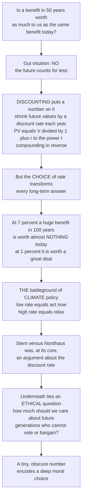

# ⏳ Discounting and Valuing the Future

> [!abstract] TL;DR
> **Discounting** converts future costs and benefits into a **present value** so flows arriving at different times can be compared on one ledger — the engine underneath all cost-benefit analysis. It shrinks future values by a **discount rate** each year (the discount factor is `1 / (1+r)^t`), which is simply compounding run in reverse. Because compounding is exponential, the *choice* of rate — a seemingly technical "3 percent versus 7 percent" — utterly transforms the verdict on anything long-term: at a high rate a huge benefit a century away is worth almost nothing today, while at a low rate it dominates. This makes the discount rate **the** central battleground of climate economics (the Stern-versus-Nordhaus debate turned on it), and beneath the arithmetic lies an explosive moral question: how much should the present generation care about future generations who cannot vote or bargain with us? A tiny, obscure number encodes a deep ethical choice about our obligations to the future.

---

## Intuition

**Analogy:** Is a benefit you will receive in 50 years worth as much to you as the same benefit today? Almost everyone instinctively says *no*. A dollar in your hand today beats a dollar promised in half a century; a clean river now feels more valuable than a clean river your great-grandchildren will enjoy. That gut feeling — **the future counts for less** — is nearly universal. Discounting is just economists putting a *number* on that intuition. It turns out to be one of the most quietly powerful, and ethically explosive, ideas in all of public policy.

The mechanism is disarmingly simple: it is **compounding in reverse**. Just as money in a savings account grows a little each year, a future benefit is *shrunk* a little each year to express its worth today. Push the benefit far enough into the future and, at a healthy rate, it withers to almost nothing in today's terms.

Here is what makes it explosive. Because the shrinking compounds, the *rate* you pick — a few percentage points — does not just nudge the answer for long-horizon problems; it *rewrites* it. At a 7 percent rate, a gigantic benefit 100 years from now is worth a rounding error today, so a policy that pays off only in the distant future looks worthless: **relax**. At a 1 percent rate, that same distant benefit looms large, so preventing a far-off catastrophe looks urgent: **act now**. Two reasonable-sounding numbers, opposite policies. That is exactly why the famous **Stern versus Nordhaus** clash over climate economics was, at its core, an argument about the discount rate — and why underneath the technical dispute sits a profound question: is it *fair* to discount future people's welfare simply because they are not born yet? Discounting forces our intergenerational values out into the open, and reveals that an obscure decimal encodes a moral choice.

---

## How It Works

### Core mechanics

1. **Put every flow on one ledger.** A policy produces costs and benefits scattered across years. To compare them you cannot just add dollars from different dates — a 2026 dollar and a 2126 dollar are not the same good. Discounting translates them all into today's equivalent, the **present value (PV)**.
2. **Shrink by the discount factor each year.** The present value of an amount `V` arriving in year `t` is `PV = V / (1+r)^t`, where `r` is the **discount rate**. The multiplier `1/(1+r)^t` is the **discount factor** — always below 1 for future flows, and falling geometrically as `t` grows.
3. **Why discount at all?** Three distinct reasons stack up: (a) the **time value of money** / opportunity cost of capital — a dollar today can be *invested* and grow, so a future dollar must be worth less; (b) **pure time preference** — sheer impatience, valuing the present just because it is the present; and (c) for consumption, **diminishing marginal utility** — if future generations are richer, an extra dollar means less to them, so their gains weigh less.
4. **Assemble the social rate (the Ramsey rule).** The economists' recipe for the social discount rate is the **Ramsey equation**: `r = rho + eta * g`. Here `rho` is the rate of **pure time preference** (impatience), `g` is the **growth rate of consumption** (how much richer the future is), and `eta` is the **elasticity of marginal utility** (how fast extra consumption loses value). The whole ethical fight hides inside `rho`.
5. **Compounding makes the rate decisive.** Over decades and centuries, `PV` is *hyper-sensitive* to `r`. Nudge the rate a couple of points and a distant benefit either vanishes or dominates. For any long-lived project — infrastructure, nuclear-waste storage, and above all **climate change** — the discount rate silently controls the answer.

### Two schools for choosing the rate

- **Descriptive / positive:** *observe* how people actually trade off time in markets (interest rates, returns on capital). This yields *higher* rates, roughly 5-7 percent (Nordhaus). It says "use the world's real trade-offs, not a philosopher's."
- **Prescriptive / normative:** *choose* the rate on ethical grounds, typically setting pure time preference near zero because favoring ourselves over the unborn is unjustifiable. This yields *low* rates, roughly 1-2 percent (Stern). It says "the market's impatience is not a moral guide."



---

## Key Concepts

### Secondary (intuitive grasp)
- **Present value:** future money and future good things are worth *less* to us now, so we shrink them to a "today value" before comparing.
- **Discount factor:** each year in the future, multiply by a number just under 1 (`1/(1+r)`). Do it enough times and a far-off benefit almost disappears.
- **The rate is everything for the long run:** a high rate makes the far future look worthless; a low rate makes it matter a lot. Picking the rate is half the decision.
- **Why it is a moral question:** discounting decides how much weight we give to people who are not born yet — that is ethics, not just math.

### Undergraduate (mechanisms and vocabulary)
- **The discount factor and NPV:** `PV = V/(1+r)^t`; a project's **net present value** sums discounted benefits minus discounted costs — accept if NPV is positive. This is the arithmetic core of cost-benefit analysis.
- **Three reasons to discount:** opportunity cost of capital (time value of money), pure time preference (impatience), and diminishing marginal utility of a richer future.
- **The Ramsey equation:** `r = rho + eta * g`. Learn to read it: raise impatience `rho` or growth `g` or the elasticity `eta`, and the rate rises.
- **Descriptive vs prescriptive:** market-observed rates (higher, ~5-7 percent) versus ethically chosen rates (lower, ~1-2 percent). The gap is not empirical error — it is a values dispute.
- **Real vs nominal, social vs private:** discount *real* (inflation-adjusted) flows with a real rate; the **social** discount rate governs public projects and differs from a firm's **private** cost of capital.
- **Compounding sensitivity:** at 7 percent, value roughly halves every 10 years; over a century the discount factor is astronomically small.

### Graduate (critique and theory)
- **Descriptive-vs-prescriptive as ethics-vs-positive-economics:** the debate is fundamentally about whether the social rate should *describe* observed behavior or *prescribe* a just intergenerational trade-off. Ramsey called discounting future utility for its own sake "ethically indefensible... a polite expression for rapacity."
- **The Stern-Nordhaus debate:** Stern's near-zero `rho` (~0.1 percent) yields a low rate and urgent, aggressive mitigation; Nordhaus's market-calibrated rate (~4-5 percent) yields gradual "policy ramp" mitigation in the **DICE** model. The **social cost of carbon** swings by an order of magnitude with the rate.
- **Declining / gamma discounting (Weitzman):** with *uncertainty about the future rate itself*, the certainty-equivalent discount factor is dominated over long horizons by the *lowest* plausible rate, so the effective long-run rate **declines** with horizon — a rigorous, non-behavioral case for schedules like the UK Green Book's stepped rates.
- **Hyperbolic discounting and time-inconsistency:** a declining rate makes preferences **time-inconsistent** (present bias / the "diet tomorrow" pattern), the behavioral cousin of declining social rates — but arising from psychology rather than uncertainty.
- **Deep uncertainty and fat tails (Weitzman's Dismal Theorem):** when catastrophic outcomes have fat-tailed probabilities, expected discounted damages can be unbounded, and the *risk* structure — not the point-estimate rate — dominates. Discounting under deep uncertainty is unsettled.
- **Dual discounting and non-substitutable goods:** if environmental goods cannot be traded for consumption (a lost species is not "bought back" by GDP), some argue for a *lower* discount rate on ecological services than on money — separate discount rates for separate goods.
- **Intergenerational equity and sustainability:** frameworks demanding *non-declining* wellbeing across generations, and the claim that future people — who cannot consent, vote, or bargain — have rights that pure time preference wrongfully overrides.

---

## Python Demo

```python
# Discounting and valuing the future, quantified four ways:
#   (a) PRESENT VALUE vs horizon at several discount rates (the divergence)
#   (b) PV of a benefit fixed 100 years out, as a function of the rate (why rate dominates)
#   (c) EXPONENTIAL (time-consistent) vs HYPERBOLIC (present-biased) discount factors
#   (d) INTERGENERATIONAL threshold: spend now to avoid a future catastrophe,
#       the verdict FLIPS at a critical discount rate
import numpy as np
import matplotlib.pyplot as plt

# ---------- (a) PV of a fixed future benefit vs time horizon ----------
t = np.arange(0, 201)                       # years into the future
future_benefit = 1.0                        # normalized face value (e.g. $1 trillion)
rates = [0.01, 0.03, 0.07]                  # 1%, 3%, 7%
pv_curves = {r: future_benefit / (1 + r) ** t for r in rates}

# ---------- (b) PV of a benefit fixed 100 years out, as a function of r ----------
r_grid = np.linspace(0.001, 0.10, 500)      # 0.1% .. 10%
T_far = 100
pv_100yr = future_benefit / (1 + r_grid) ** T_far

# ---------- (c) Exponential vs hyperbolic discount factors ----------
tt = np.linspace(0, 60, 400)
r_exp = 0.05                                # constant-rate exponential
D_exp = np.exp(-r_exp * tt)                 # e^{-r t}: time-consistent
k_hyp = 0.15                                # hyperbolic steepness
D_hyp = 1.0 / (1.0 + k_hyp * tt)            # 1/(1+k t): present-biased, fat tail

# ---------- (d) Intergenerational trade-off with a threshold rate ----------
# Spend C now to prevent a catastrophe of damage Dmg arriving in year T.
# Net present value of acting:  NPV(r) = -C + Dmg / (1+r)^T
C, Dmg, T = 1.0, 30.0, 100                  # spend 1 now to avoid 30 in 100 years
npv = -C + Dmg / (1 + r_grid) ** T
r_star = (Dmg / C) ** (1.0 / T) - 1.0       # rate where NPV crosses zero

fig, ax = plt.subplots(2, 2, figsize=(13, 9))

# (a) divergence of PV curves
for r in rates:
    ax[0, 0].plot(t, pv_curves[r], lw=2, label=f"r = {int(r*100)}%")
ax[0, 0].set_xlabel("Years into the future (t)")
ax[0, 0].set_ylabel("Present value of a $1 benefit")
ax[0, 0].set_title("(a) At high rates, distant benefits collapse to ~0")
ax[0, 0].legend()
ax[0, 0].annotate("a benefit 100 yrs out\nis worth almost nothing at 7%",
                  xy=(100, pv_curves[0.07][100]), xytext=(70, 0.45),
                  fontsize=8, arrowprops=dict(arrowstyle="->"))

# (b) the rate dominates the long-horizon verdict
ax[0, 1].plot(r_grid * 100, pv_100yr, color="#8e44ad", lw=2)
ax[0, 1].set_xlabel("Discount rate r (%)")
ax[0, 1].set_ylabel("PV of a $1 benefit 100 years out")
ax[0, 1].set_title("(b) A benefit fixed 100 yrs out: PV vs the rate")
for rr in (0.01, 0.03, 0.07):
    ax[0, 1].scatter([rr*100], [1/(1+rr)**100], zorder=5)
    ax[0, 1].annotate(f"{int(rr*100)}%: {1/(1+rr)**100:.3f}",
                      xy=(rr*100, 1/(1+rr)**100), xytext=(rr*100+0.5, 0.25+rr),
                      fontsize=8)

# (c) exponential vs hyperbolic
ax[1, 0].plot(tt, D_exp, lw=2, label="exponential  e^(-r t)  (consistent)")
ax[1, 0].plot(tt, D_hyp, lw=2, ls="--", label="hyperbolic  1/(1+k t)  (present bias)")
ax[1, 0].set_xlabel("Years into the future (t)")
ax[1, 0].set_ylabel("Discount factor (weight on the future)")
ax[1, 0].set_title("(c) Hyperbolic drops fast near-term, keeps a fatter tail")
ax[1, 0].legend(fontsize=8)

# (d) intergenerational threshold
ax[1, 1].plot(r_grid * 100, npv, color="#c0392b", lw=2)
ax[1, 1].axhline(0, color="grey", lw=1)
ax[1, 1].axvline(r_star * 100, ls=":", color="black")
ax[1, 1].fill_between(r_grid * 100, npv, 0, where=(npv > 0),
                      color="#2ecc71", alpha=0.25)
ax[1, 1].fill_between(r_grid * 100, npv, 0, where=(npv <= 0),
                      color="#e74c3c", alpha=0.20)
ax[1, 1].text(0.4, npv.max()*0.5, "ACT NOW\n(NPV > 0)", color="green", fontsize=9)
ax[1, 1].text(6.2, npv.min()*0.5, "RELAX\n(NPV < 0)", color="firebrick", fontsize=9)
ax[1, 1].set_xlabel("Discount rate r (%)")
ax[1, 1].set_ylabel("NPV of spending now to avoid catastrophe")
ax[1, 1].set_title(f"(d) Verdict flips at r* = {r_star*100:.2f}%")

plt.tight_layout()
plt.savefig("discounting_and_the_future.png", dpi=120)
plt.show()

# Takeaways:
#  (a)/(b) at 1% a $1 benefit 100 yrs out is worth ~$0.37; at 7% it is ~$0.001 —
#          a ~300x swing from the rate alone, so the rate dominates climate-scale calls.
#  (c)     hyperbolic discounting is present-biased and time-inconsistent.
#  (d)     the SAME policy is "obviously worth it" or "obviously not" purely by rate choice.
print(f"PV of $1 in 100 yrs @1% = {1/1.01**100:.4f},  @3% = {1/1.03**100:.4f},  @7% = {1/1.07**100:.5f}")
print(f"Intergenerational threshold rate r* = {r_star*100:.2f}%  (act below it, relax above it)")
```

Panels (a) and (b) make the "tyranny of compounding" concrete: a benefit a century away is worth about 37 cents on the dollar at 1 percent but a tenth of a cent at 7 percent — a roughly 300-fold swing driven by *nothing but the rate*. Panel (c) contrasts time-consistent exponential discounting with present-biased hyperbolic discounting. Panel (d) is the punchline: a single policy (spend 1 now to avoid 30 later) is a clear "yes" below the threshold rate and a clear "no" above it — the rate, not the science of the damages, decides.

---

## Real-World Applications

> **Example — The social cost of carbon (SCC):** Every climate regulation is justified by an estimated dollar cost of emitting one more ton of CO2, integrating damages that stretch centuries ahead. Because those damages are far in the future, the SCC is *dominated* by the discount rate. The U.S. Interagency Working Group's SCC roughly tripled when the central discount rate was lowered, and later revisions incorporating declining long-run rates and updated damages pushed estimates higher still. No parameter moves the number more than the rate.

> **Example — The Stern Review vs Nordhaus's DICE model:** Stern (2006) adopted a near-zero pure-time-preference rate on explicit ethical grounds, producing a low effective discount rate and a call for immediate, aggressive mitigation (~1-2 percent of GDP). Nordhaus, using market-calibrated rates (~4-5 percent) in the DICE integrated-assessment model, derived a gradual "policy ramp." The two reached opposite policy conclusions from *largely the same climate science* — the divergence lived almost entirely in the discount rate.

> **Example — Nuclear-waste storage and long-lived infrastructure:** Deep geological repositories must remain safe for tens of thousands of years. Under conventional exponential discounting, harms 10,000 years out have essentially zero present value, which many find morally absurd — a key motivation for *declining* discount-rate schedules (UK Treasury Green Book, France's Lebègue report) that refuse to let the far future vanish entirely.

> **Example — Government cost-benefit rulebooks:** The U.S. OMB Circular A-4 long mandated parallel analyses at 3 percent and 7 percent, and its 2023 update moved toward a lower ~2 percent rate; the UK Green Book prescribes a 3.5 percent base rate *declining* to 1 percent beyond 75 years. These are not accounting footnotes — they are institutionalized ethical choices about how much the future counts.

---

## Common Pitfalls

- **Treating the discount rate as a neutral technical input** — The rate is where the ethics hides. Presenting a single "objective" rate conceals a values choice (especially the pure-time-preference term `rho`) that can flip the recommendation. Always run sensitivity analysis across a defensible range.
- **Using one constant rate over century-plus horizons** — Constant exponential discounting annihilates the far future and ignores rate *uncertainty*. Weitzman's gamma-discounting result shows the certainty-equivalent long-run rate should *decline*; a flat 7 percent for a 300-year problem is indefensible.
- **Confusing descriptive and prescriptive rates** — Borrowing a market return (which reflects private impatience and risk) to weigh *intergenerational public welfare* smuggles in an ethical stance while pretending to be purely empirical. Be explicit about which framework you are using and why.
- **Mixing real and nominal, or social and private** — Discounting nominal flows with a real rate (or vice versa), or applying a firm's cost of capital to a public good, produces silent, large errors. Keep units and the rate consistent.
- **Ignoring diminishing marginal utility and distribution** — The Ramsey `eta * g` term matters: if the future is richer, extra consumption for them is worth less; but if climate damage makes the future *poorer*, growth `g` can turn negative and the rate should *fall*. A single headline rate hides this.
- **Discounting catastrophic, fat-tailed risks with a standard rate** — Under deep uncertainty (Weitzman's Dismal Theorem), the *tail* of the damage distribution, not the central discounted estimate, can dominate. Standard expected-NPV discounting can badly understate the case for precaution.
- **Forgetting who bears the discounting** — The people whose welfare is being shrunk are future generations who cannot consent, vote, or bargain. Framing discounting as pure finance obscures that it is, in Ramsey's phrase, potentially "a polite expression for rapacity."

---

## Related Concepts

- [[Time_Value_of_Money]] — the finance bedrock: discounting is time value of money applied to policy, and the discount factor `1/(1+r)^t` comes straight from present-value mechanics.
- [[The_Power_of_Compounding]] — discounting is compounding run in reverse; the same exponential force that grows a savings account shrinks distant future values to near zero.
- [[Intertemporal_Choice_and_Discounting]] — the behavioral-economics account of how *individuals* actually trade off present against future, the empirical root of the descriptive approach.
- [[Present_Bias_and_Self_Control]] — hyperbolic discounting and time-inconsistency at the personal level ("diet tomorrow"), the psychological cousin of declining long-run social rates.
- [[Future_Generations_and_Intergenerational_Justice]] — the ethical core: whether discounting the welfare of the unborn is defensible when they cannot consent, vote, or bargain.
- [[Climate_Ethics]] — the moral framing of the Stern-Nordhaus dispute and of how present sacrifice weighs against future harm.
- [[Environmental_Justice_and_Sustainability]] — the demand for non-declining wellbeing across generations that a positive pure-time-preference rate can violate.
- [[Ecological_Economics_and_Natural_Capital]] — valuing non-substitutable natural capital over long horizons, where the choice of discount rate (and dual discounting) is decisive.

Within this vault, this note is the quantitative heart of policy evaluation and connects in prose to its siblings: *Cost_Benefit_Analysis* (discounting is the step that makes CBA possible across time), *Policy_Analysis_Methods* (which situates discounting among the analyst's tools), *Risk_Analysis_and_Decision_Under_Uncertainty* (deep uncertainty, fat tails, and Weitzman's Dismal Theorem), *Environmental_and_Climate_Policy* (the central application, where the social cost of carbon hinges on the rate), and *Public_Economics_and_Welfare* (the welfare-economic foundations of the social discount rate and the Ramsey rule).

---

## Review Questions

1. **(Secondary)** In your own words, why is a benefit of $1,000 arriving in 50 years worth less to us today than $1,000 right now? Give two distinct reasons, and explain what a "discount rate" does to that future amount.
2. **(Undergraduate)** Compute the present value of a $1 billion benefit arriving in 100 years at discount rates of 1 percent, 3 percent, and 7 percent. Using your numbers, explain why the *choice* of rate — rather than the science of the future benefit — dominates the evaluation of long-horizon climate policy.
3. **(Graduate)** The Stern Review chose a near-zero rate of pure time preference on ethical grounds; Nordhaus argued for a market-calibrated rate. Frame this as a descriptive-versus-prescriptive dispute. Is discounting the *welfare* of future generations (as opposed to the *money*) ethically defensible? In your answer, address Ramsey's "polite expression for rapacity," Weitzman's case for *declining* long-run rates under uncertainty, and how deep, fat-tailed catastrophic risk complicates any single-rate analysis.

---

## Sources

- Ramsey, F. P. — "A Mathematical Theory of Saving," *The Economic Journal*, 38(152), 1928.
- Stern, N. — *The Economics of Climate Change: The Stern Review*, Cambridge University Press, 2007.
- Nordhaus, W. D. — "A Review of the Stern Review on the Economics of Climate Change," *Journal of Economic Literature*, 45(3), 2007.
- Weitzman, M. L. — "Gamma Discounting," *American Economic Review*, 91(1), 2001.
- Arrow, K. et al. — "Determining Benefits and Costs for Future Generations," *Science*, 341(6144), 2013.

---

#public-policy #discounting #social-discount-rate #intergenerational-equity #climate-economics
