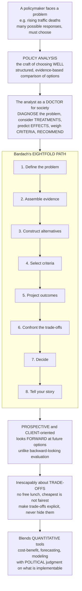

# 🧭 Policy Analysis Methods

> [!abstract] TL;DR
> **Policy analysis** is the disciplined craft of helping a decision-maker *choose well* among competing options — the systematic, client-oriented investigation of a policy problem and its alternatives so that decisions rest on evidence and reasoning rather than hunch, ideology, or the loudest lobbyist. It is **prospective**: it looks *forward* to compare future options (unlike **evaluation**, which looks backward at what a policy already did). Its widely-taught recipe is Bardach's **Eightfold Path** — define the problem, assemble evidence, construct alternatives, select criteria, project outcomes, confront the trade-offs, decide, tell your story — and its defining discipline is making **trade-offs explicit**, because there is rarely a free lunch: the cheapest option is not the fairest, and the fairest is not the most feasible. It blends rigorous quantitative tools (cost-benefit analysis, forecasting, modeling) with political judgment about what is actually implementable.

---

## Intuition

**Analogy:** A policymaker facing a problem — say, rising traffic deaths — has many possible responses on the table: lower the speed limits, redesign the roads, tighten enforcement, mandate seatbelts, or do nothing at all. Each will help a different amount, cost a different amount, fall on different people, and be more or less politically feasible. Somebody has to choose. **Policy analysis is the craft of helping them choose *well*** — a structured, evidence-based process for laying the options side by side and comparing their likely consequences before anyone commits.

Think of the policy analyst as a **doctor for society's problems**. A good doctor does not just prescribe the first pill that comes to mind. First they **diagnose** (what exactly is wrong, and what is causing it?), then consider **treatments** (what are the realistic options?), predict their **effects** (what will each likely do — benefits, side-effects, who is helped and who is harmed?), weigh those against **criteria** (will it work, what does it cost, is it fair, can we actually do it?), and only then **recommend**. Policy analysis follows exactly this arc, and its most famous articulation is Eugene Bardach's **Eightfold Path**: (1) define the problem, (2) assemble evidence, (3) construct alternatives, (4) select criteria, (5) project outcomes, (6) confront the trade-offs, (7) decide, (8) tell your story. The crucial discipline is that this analysis is **prospective and client-oriented** — it looks *forward* to help a specific decision-maker choose among future options, which is what separates it from evaluation's backward look at what a policy already accomplished. And it is inescapably about **trade-offs**: the cheapest option is rarely the fairest, the fairest rarely the most feasible. Good analysis makes those trade-offs *explicit* rather than burying them — and stays humble, blending quantitative rigor with judgment about what politics will actually allow.

---

## How It Works

### Core mechanics

Policy analysis is the bridge between research/evidence and political decision — "providing information to improve the basis for policy decisions" (Weimer & Vining). The rational frameworks (Bardach's Eightfold Path; Weimer-Vining; Patton-Sawicki-Clark) all share the same skeleton:

1. **Define the problem** — Frame *what* is wrong and *how big* it is. This is the single most important and most error-prone step: problems are **constructed**, not handed to you. "Too many young men die on rural roads at night" points to different solutions than "traffic is dangerous." Size the problem so the intervention can be scaled to it.
2. **Assemble evidence** — Gather data, research, and expert knowledge relevant to the problem and to how proposed remedies have performed elsewhere. Evidence is expensive; collect what changes the decision, not everything.
3. **Construct alternatives** — Generate a real menu of options, always including the **status quo / "do nothing"** as a baseline. Draw on the toolbox of policy instruments — regulation, taxes/subsidies, spending, information ("sticks, carrots, and sermons").
4. **Select criteria** — Choose the yardsticks the options will be judged against: **efficiency/cost**, **equity/fairness**, **effectiveness**, **administrative and political feasibility**, and **legality**. Naming criteria surfaces the values in play.
5. **Project outcomes** — Predict what each alternative would *likely* do on each criterion — benefits, costs, distribution, and the **uncertainty** around them — using models, evidence, and analogy. This is forecasting under irreducible uncertainty, so it needs ranges, not false precision.
6. **Confront the trade-offs** — Lay the alternatives against the criteria in a matrix and compare. This is the *essence*: usually **no option dominates** — each wins on some criteria and loses on others, so the choice is a genuine trade-off, not a lookup.
7. **Decide** — Apply weights and judgment (or hand a structured choice to the client) and reach a recommendation.
8. **Tell your story** — Communicate the reasoning clearly enough that a busy, non-expert decision-maker can follow it, act on it, and defend it. Analysis that cannot be explained is analysis that does not get used ("speaking truth to power," Wildavsky).

The **analytical toolkit** filling steps 4–6 includes **cost-benefit analysis** (monetize and compare), **cost-effectiveness and multi-criteria analysis**, **risk analysis and decision under uncertainty**, **forecasting and modeling**, and qualitative methods (stakeholder analysis, scenario planning) — quantitative rigor *and* political judgment together.



---

## Key Concepts

### Secondary (intuitive grasp)
- **Choosing well, not just choosing:** analysis lines up the options — lower speed limits, better roads, enforcement, seatbelts, do nothing — and compares what each would likely cost and achieve.
- **The doctor's arc:** diagnose the problem → list treatments → predict effects → weigh them → recommend. That is the whole idea.
- **No free lunch:** the cheapest option is usually not the fairest, and the fairest is usually not the easiest to pass. Every real choice trades something for something.
- **Forward-looking:** analysis is done *before* deciding, to pick among future options — different from checking afterward whether a policy worked.

### Undergraduate (mechanisms and vocabulary)
- **Prospective / ex-ante vs retrospective / ex-post:** *analysis* compares future alternatives to inform a decision; *evaluation* assesses what an enacted policy actually did. Analysis *for* the decision vs evaluation *of* the decision.
- **Client orientation:** analysis serves a specific decision-maker with a specific question — which carries ethical duties (honesty about uncertainty, disclosing whose values the criteria encode).
- **Problem definition as construction:** how the problem is framed largely determines which solutions look legitimate; the highest-leverage and most error-prone step.
- **Policy instruments:** regulation, fiscal tools (taxes/subsidies/spending), and information — the raw material for *constructing alternatives*.
- **Criteria:** efficiency, equity/fairness, effectiveness, cost, administrative and political feasibility, legality — each with a rationale, often in tension.
- **The outcomes/criteria (trade-off) matrix:** the core artifact — alternatives as rows, criteria as columns; comparing across it is where the real judgment happens.
- **Positive vs normative:** separate claims about what *is* or *will* happen (forecasting) from claims about what *should* be (values and criteria).

### Graduate (critique and theory)
- **The rational-analytic frameworks and their limits:** Bardach, Weimer-Vining, and Patton-Sawicki all assume a decomposable problem and a client who wants reasoned advice — but real decisions are shaped by **bounded rationality**, power, and politics. Analysis *informs* choice; it cannot *replace* it.
- **Pareto dominance and the non-existence of a dominant option:** an alternative is *dominated* only if another beats it on every criterion; typically several options are **non-dominated**, so aggregation requires explicit, contestable weights.
- **Uncertainty and sensitivity analysis:** projected outcomes are distributions, not points; the "best" choice can flip with assumptions, so credible analysis reports ranges and tests robustness rather than a single number.
- **Wildavsky's "speaking truth to power":** analysis is a political act performed inside institutions; its craft is as much rhetorical and organizational (getting used) as technical (being right).
- **The "streetlight" fallacy and analysis paralysis:** the temptation to measure only what is easy to quantify (and to keep analyzing past the point of usefulness) — both distort the decision the analysis is meant to serve.
- **Values are inescapable:** choosing criteria and weights embeds normative commitments; good analysis makes them transparent rather than smuggling them in under a veneer of objectivity.

---

## Python Demo

```python
# Policy analysis, quantified:
#   (a) ALTERNATIVES x CRITERIA trade-off matrix (the core artifact of analysis)
#   (b) the PARETO frontier -- usually no single option dominates all criteria
#   (c) OUTCOME PROJECTION UNDER UNCERTAINTY -- outcomes are distributions, not points
#   (d) SENSITIVITY -- the "winner" changes with the weights we choose
import numpy as np
import matplotlib.pyplot as plt

rng = np.random.default_rng(7)

# ---- Alternatives scored on each criterion; higher is always better ----
# (cost is entered as "cost-efficiency" so that 10 = cheap, matching "higher = better")
alternatives = ["Lower speed\nlimits", "Road\nredesign", "Stricter\nenforcement",
                "Seatbelt\nmandate", "Do\nnothing"]
criteria = ["Effectiveness", "Cost-efficiency", "Equity", "Feasibility"]

S = np.array([
    [7, 9, 6, 5],    # lower speed limits: effective & cheap, but politically hard
    [8, 2, 7, 4],    # road redesign: very effective & equitable, but expensive & slow
    [6, 5, 4, 6],    # stricter enforcement: moderate; falls harder on the poor
    [9, 8, 8, 7],    # seatbelt mandate: strong across the board
    [1, 10, 3, 10],  # do nothing: free & trivially feasible, but ineffective & inequitable
], dtype=float)

# ---- Pareto frontier: i is DOMINATED if some j is >= on all criteria and > on one ----
def pareto_mask(M):
    n = M.shape[0]
    nondom = np.ones(n, dtype=bool)
    for i in range(n):
        for j in range(n):
            if i != j and np.all(M[j] >= M[i]) and np.any(M[j] > M[i]):
                nondom[i] = False
                break
    return nondom

nd = pareto_mask(S)                      # non-dominated (Pareto-optimal) options

# ---- Equal-weight aggregate score (0-1) ----
weights = np.ones(len(criteria)) / len(criteria)
agg = (S / 10.0) @ weights

# ---- Monte Carlo outcome projection: annual lives saved is UNCERTAIN, not a point ----
mean_saved = S[:, 0] * 40                              # effect scales with effectiveness
std_saved  = np.array([120, 200, 90, 70, 15.0])       # projection uncertainty per option
samples = rng.normal(mean_saved[:, None], std_saved[:, None], size=(len(alternatives), 4000))
samples = np.clip(samples, 0, None)

# ---- Sensitivity: sweep the weight placed on EQUITY, split the rest equally ----
w_eq = np.linspace(0, 1, 100)
eq = criteria.index("Equity")
others = [k for k in range(len(criteria)) if k != eq]
sens = np.zeros((len(alternatives), len(w_eq)))
for t, we in enumerate(w_eq):
    w = np.full(len(criteria), (1 - we) / len(others)); w[eq] = we
    sens[:, t] = (S / 10.0) @ w

# ------------------------------- plotting -------------------------------
fig, ax = plt.subplots(2, 2, figsize=(13, 9))

# (a) the trade-off matrix as a heatmap
im = ax[0, 0].imshow(S, cmap="RdYlGn", vmin=0, vmax=10, aspect="auto")
ax[0, 0].set_xticks(range(len(criteria))); ax[0, 0].set_xticklabels(criteria, fontsize=8, rotation=15)
ax[0, 0].set_yticks(range(len(alternatives))); ax[0, 0].set_yticklabels(alternatives, fontsize=8)
for i in range(S.shape[0]):
    for j in range(S.shape[1]):
        ax[0, 0].text(j, i, int(S[i, j]), ha="center", va="center", fontsize=9)
ax[0, 0].set_title("(a) Alternatives x criteria trade-off matrix\nno row is best in every column")
fig.colorbar(im, ax=ax[0, 0], fraction=0.046, pad=0.04, label="score (10 = best)")

# (b) aggregate score, Pareto-optimal options highlighted
colors = ["#2e86de" if m else "#b2bec3" for m in nd]
yb = np.arange(len(alternatives))
ax[0, 1].barh(yb, agg, color=colors)
ax[0, 1].set_yticks(yb); ax[0, 1].set_yticklabels(alternatives, fontsize=8)
ax[0, 1].set_xlabel("Equal-weight aggregate score (0-1)")
ax[0, 1].set_title("(b) Aggregate score\nblue = Pareto non-dominated, grey = dominated")
for yi, (v, m) in enumerate(zip(agg, nd)):
    ax[0, 1].text(v + 0.005, yi, "PF" if m else "", va="center", fontsize=8, color="#2e86de")

# (c) outcome projection under uncertainty
ax[1, 0].boxplot(samples.T, showfliers=False)
ax[1, 0].set_xticks(range(1, len(alternatives) + 1))
ax[1, 0].set_xticklabels([a.replace("\n", " ") for a in alternatives], rotation=20, fontsize=7)
ax[1, 0].set_ylabel("Projected lives saved / year")
ax[1, 0].set_title("(c) Outcome projection under UNCERTAINTY\nranges overlap -> best depends on risk")

# (d) sensitivity of the ranking to the equity weight
for i, a in enumerate(alternatives):
    ax[1, 1].plot(w_eq, sens[i], lw=2, label=a.replace("\n", " "))
ax[1, 1].set_xlabel("Weight placed on EQUITY")
ax[1, 1].set_ylabel("Weighted score (0-1)")
ax[1, 1].set_title("(d) Sensitivity analysis\nranking flips as we value equity more")
ax[1, 1].legend(fontsize=7, loc="upper left")

plt.tight_layout()
plt.savefig("policy_analysis_methods.png", dpi=120)
plt.show()

# Takeaway: the Pareto frontier keeps several non-comparable options alive (a, b);
# projected outcomes are DISTRIBUTIONS, not points (c); and the "winner" changes with
# the weights we choose (d) -- which is exactly why analysis must surface trade-offs and
# run sensitivity checks instead of handing back one 'objective' answer.
```

The trade-off matrix (a) makes the central fact of analysis visible: **no alternative is best on every criterion.** The Pareto view (b) shows that even "do nothing" survives as non-dominated (it is unbeatable on cost and feasibility), so the choice cannot be settled by the data alone — it needs weights, and weights encode values. Panel (c) shows outcomes are *ranges*, not points, and panel (d) shows the ranking *flips* as we weight equity more heavily — which is precisely why honest analysis reports uncertainty and runs sensitivity checks rather than declaring one objectively "correct" option.

---

## Real-World Applications

> **Example — Road safety (the running case):** Confronted with rising traffic deaths, an analyst *defines* the problem (are deaths concentrated among young drivers, on rural roads, at night, unbelted?), *assembles* crash and enforcement evidence, *constructs* alternatives (speed limits, road redesign, enforcement, seatbelt mandates, plus the status-quo baseline), *selects* criteria (lives saved, cost, equity, feasibility), *projects* each option's likely effect with its uncertainty, and *confronts* the trade-offs in a matrix. The recommendation is rarely the single "best" option — it is the defensible package given the client's weights on cost versus equity.

> **Example — Regulatory Impact Analysis (RIA):** Most OECD governments and U.S. federal agencies (under long-standing executive orders) require agencies to conduct prospective policy analysis — problem definition, alternatives, and a cost-benefit or cost-effectiveness projection — *before* issuing a major rule. This is Bardach's Eightfold Path institutionalized: analysis as the mandated bridge between evidence and a binding decision.

> **Example — Congressional Budget Office (CBO) and legislative "scoring":** When Congress considers a bill, the CBO produces a prospective, client-oriented projection of its budgetary and (often) distributional effects over a 10-year window. It is a textbook *ex-ante* analysis — forward-looking, comparing a proposed policy against a baseline — and its explicit uncertainty ranges are exactly the sensitivity-analysis discipline the demo illustrates.

> **Example — Public-health interventions (QALYs and NICE):** Bodies like the UK's NICE compare health interventions with cost-effectiveness analysis (cost per quality-adjusted life year), a multi-criteria projection under uncertainty. The controversy over the "right" cost-per-QALY threshold is the values-and-weights problem from panel (b) made public: the data narrow the options, but a normative choice still has to close the decision.

---

## Common Pitfalls

- **Solving the wrong problem** — Rushing past *problem definition*, the highest-leverage and most error-prone step. A problem framed as "not enough enforcement" forecloses solutions that a "road design" framing would surface. Whoever defines the problem largely decides the answer, so interrogate the framing first.
- **Hiding the trade-offs** — Presenting one "objectively best" option as if the data settled it. There is rarely a dominant choice; concealing the trade-offs (or the weights that produced the winner) substitutes the analyst's values for the client's and destroys the analysis's legitimacy.
- **False precision / ignoring uncertainty** — Reporting a single point estimate for outcomes that are genuinely uncertain, and skipping **sensitivity analysis**. If the recommendation flips under plausible assumptions, the client needs to know that *before* deciding.
- **The "streetlight" fallacy** — Measuring only what is easy to quantify (dollars, counts) and dropping hard-to-monetize but decisive criteria like equity, dignity, or long-run resilience. What gets left out of the matrix silently gets a weight of zero.
- **Forgetting the status quo and feasibility** — Omitting the "do nothing" baseline (so gains look bigger than they are) or recommending an option that is administratively or politically impossible. An unimplementable "best" answer is worse than a good-enough one that can actually pass.
- **Analysis paralysis** — Endlessly refining the model past the point where more analysis would change the decision. Analysis serves a decision on a deadline; know when it is *good enough* to act.
- **Confusing analysis with evaluation** — Treating a backward look at what a policy *did* as if it answered the forward question of what to *choose next*. They use different logics; keep prospective analysis and retrospective evaluation distinct.

---

## Related Concepts

- [[Policy_Analysis_and_the_Policy_Process]] — the Political Science companion that situates analysis within the wider policy process (multiple streams, agenda-setting, implementation); this note focuses on the analyst's *methods and toolkit*, that note on the *process* they operate in.
- [[Systems_Failure_and_Wicked_Problems]] — why many real policy problems resist the tidy rational-analytic template: ill-defined, interconnected, contested "wicked" problems have no clean problem definition and no stopping rule, stress-testing steps 1 and 6.
- [[Decision_Making_Under_Uncertainty]] — the critical-thinking foundations of steps 5–7: expected value, risk versus uncertainty, and why sensitivity analysis and humility are non-negotiable when projecting outcomes.
- [[The_Policy_Process_and_Policy_Cycle]] — the vault's map of how a problem becomes action; policy analysis is the disciplined method that fills the *formulation* stage of that cycle.

This note is the **analytical foundation for the entire Public_Policy_and_Governance vault**; its Section-02 siblings deepen the toolkit in prose: a *Public_Policy_and_Governance_Overview* frames the field, *Cost_Benefit_Analysis* details the monetize-and-compare method, *Cost_Effectiveness_and_Multi_Criteria_Analysis* handles outcomes that resist a common dollar metric, *Risk_Analysis_and_Decision_Under_Uncertainty* formalizes step 5 under uncertainty, and *Program_Evaluation_and_Causal_Inference* provides the retrospective counterpart that closes the loop this prospective analysis opens.

---

## Review Questions

1. **(Secondary)** List the eight steps of Bardach's Eightfold Path in order, and explain in one sentence why the *cheapest* option to reduce traffic deaths might still be a poor recommendation.
2. **(Undergraduate)** Distinguish prospective (ex-ante) analysis from retrospective (ex-post) evaluation. Using the road-safety example, describe one question each would ask, and explain why the two require different logics.
3. **(Graduate)** In the demo, "do nothing" is Pareto non-dominated yet clearly a bad policy on effectiveness. Explain how this is possible, why the aggregate ranking depends on the criteria weights, and what an analyst's ethical obligation is when the recommendation flips under a plausible reweighting. Relate your answer to Wildavsky's idea of "speaking truth to power."

---

## Sources

- Bardach, E. & Patashnik, E. M. — *A Practical Guide for Policy Analysis: The Eightfold Path to More Effective Problem Solving* (6th ed., CQ Press).
- Weimer, D. L. & Vining, A. R. — *Policy Analysis: Concepts and Practice* (6th ed., Routledge).
- Wildavsky, A. — *Speaking Truth to Power: The Art and Craft of Policy Analysis* (Transaction).
- Patton, C. V., Sawicki, D. S. & Clark, J. J. — *Basic Methods of Policy Analysis and Planning* (3rd ed., Routledge).

---

#public-policy #policy-analysis #eightfold-path #trade-offs #decision-making
