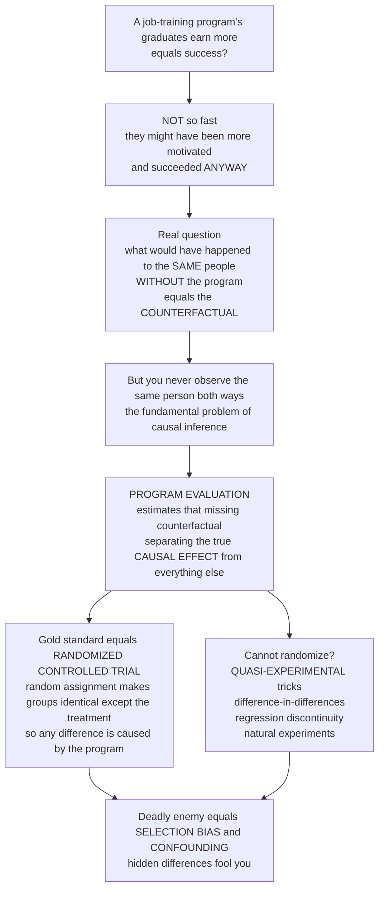

# 🧪 Program Evaluation and Causal Inference

> [!abstract] TL;DR
> **Program evaluation** is the science of answering one deceptively hard question: *did the policy actually work?* A government spends a billion dollars on job training and afterward participants earn more — but they might have earned more **anyway**, because motivated people both sign up *and* succeed. To credit the program you must estimate the **counterfactual**: what would have happened to those *same* people without it — an alternate reality you can never directly observe (the **fundamental problem of causal inference**). The gold standard is the **randomized controlled trial (RCT)**, where random assignment makes a control group a valid stand-in for the counterfactual, so any difference in outcomes *must* be caused by the program. When you cannot randomize, evaluators use **quasi-experimental** designs — difference-in-differences, regression discontinuity, natural experiments — all while fighting the ever-present enemies of **selection bias** and **confounding**. This is the difference between evidence and wishful thinking.

---

## Intuition

**Analogy:** A government spends a billion dollars on a job-training program, and afterward, participants are earning more. Success? **Not so fast** — this is the single most important and most-violated principle in all of policy evaluation. The people who *signed up* for training might have been more motivated and would have found better jobs **anyway**, even without the program. To know if the *program* actually caused the improvement, you have to answer an impossible-sounding question: what would have happened to those **same people** if they had **not** gotten the training? That imaginary alternate reality is called the **counterfactual**, and it is the holy grail of causal inference — because you can never observe the same person both *with* and *without* the treatment.

That impossibility has a name — the **fundamental problem of causal inference**. **Program evaluation** is the discipline of estimating that missing counterfactual, of separating the program's true **causal effect** from everything else that was going on. The gold standard is the **randomized controlled trial (RCT)**: randomly assign people to get the program or not, so the two groups are identical *on average* — in motivation, background, everything — except for the treatment. Then any difference in outcomes must be caused by the program. Randomization is magic because it makes the control group a valid stand-in for the counterfactual. When you cannot randomize — which, in policy, is often — evaluators use clever **quasi-experimental** tricks to approximate it: comparing a group before and after a policy against a similar group that was not affected (**difference-in-differences**), exploiting arbitrary cutoffs where people just above and below an eligibility threshold are essentially identical (**regression discontinuity**), or finding **natural experiments**. The deadly enemy throughout is **selection bias** and **confounding** — the ever-present risk that the treated and untreated groups differ in some hidden way that *also* affects the outcome, fooling you into crediting the program.

---

## How It Works

### Core mechanics

1. **State the causal question precisely.** Program evaluation is usually *retrospective* (ex-post): a policy already ran; did it *cause* the observed outcome? This is **impact evaluation**, and it differs from **process/implementation evaluation** (was the program delivered as intended?), from **formative** evaluation (how do we improve it while running?), and **summative** evaluation (should we keep, scale, or kill it?). Impact evaluation serves both *accountability* and *learning*.
2. **Define the effect as a difference in potential outcomes.** In the **potential-outcomes / Rubin causal model**, each unit has an outcome *if treated*, $Y_i(1)$, and *if not treated*, $Y_i(0)$. The individual causal effect is $Y_i(1) - Y_i(0)$ — but you only ever see one of the two. The **counterfactual** is the unseen one.
3. **Aggregate to estimable quantities.** Since individual effects are unobservable, we target averages: the **Average Treatment Effect (ATE)** across everyone, or the **Average Treatment Effect on the Treated (ATT)** for those who actually got the program.
4. **Confront the threats.** A naive "before-vs-after" or "participants-vs-non-participants" comparison is contaminated by **selection bias** (the treated differ systematically — through self-selection or program targeting) and **confounding** (a third factor drives *both* who gets treated *and* the outcome). "Correlation is not causation" is precisely this warning.
5. **Choose an identification strategy** that recovers a credible counterfactual:
   - **RCT** — random assignment balances *observed and unobserved* confounders, making the control group a valid counterfactual and delivering unbiased effects.
   - **Quasi-experiments** — difference-in-differences, regression discontinuity, instrumental variables, matching / propensity scores, synthetic control, natural experiments, interrupted time series. Each buys credibility with a specific, sometimes-untestable *assumption*.
6. **Interpret and use the result.** Weigh **internal validity** (is the causal estimate right *here*?) against **external validity** (does it generalize elsewhere?); distinguish effect *size* from statistical *significance*; check **heterogeneous effects** and mechanisms; and feed the verdict back into the policy cycle as **evidence-based policy**.



---

## Key Concepts

### Secondary (intuitive grasp)
- **The counterfactual:** the "what would have happened otherwise" world. You can never see it directly for the same person, so you must *estimate* it with a comparison group.
- **Correlation is not causation:** more earnings *after* a program does not prove the program *caused* them — the participants might have improved anyway.
- **Randomization = fairness = a valid comparison:** flipping a coin to decide who gets the program makes the two groups alike in every respect except the treatment, so a later difference must be the program's doing.
- **Impact vs process:** "did it work?" (impact) is a different question from "was it delivered as planned?" (process). Both matter.

### Undergraduate (mechanisms and vocabulary)
- **Potential outcomes (Rubin model):** each unit has $Y(1)$ and $Y(0)$; the causal effect is their difference; only one is ever observed — the **fundamental problem of causal inference**.
- **ATE vs ATT:** the effect for a random person vs the effect for those who actually enrolled; self-selection makes them diverge.
- **Selection bias, decomposed:** the naive difference equals the true effect on the treated **plus** a bias term $E[Y(0)\mid D=1] - E[Y(0)\mid D=0]$ — the gap in *untreated* potential outcomes between the groups. Randomization drives it to zero.
- **Confounding & reverse causality:** a lurking common cause, or the outcome influencing the "treatment," both masquerade as program effects.
- **Quasi-experimental toolkit:**
  - **Difference-in-differences (DiD):** compare the *change* over time in a treated group to the change in a comparison group, netting out shared trends; hinges on the **parallel-trends** assumption.
  - **Regression discontinuity (RD):** exploit an arbitrary eligibility **cutoff**; units just above and below are as-good-as-randomly assigned, so the jump in outcome at the threshold is the local effect.
  - **Instrumental variables (IV):** use a source of *exogenous* variation that shifts treatment but affects the outcome only through it.
  - **Matching / propensity scores:** balance *observed* covariates so treated and comparison units look alike.
- **Internal vs external validity:** is the estimate correct in the study — and does it travel?

### Graduate (critique and theory)
- **The credibility revolution (Angrist & Pischke):** the shift from structural modeling to transparent *design-based* identification — pick a research design whose assumptions are defensible, and let it, not a functional form, do the causal work. The mindset is: "what is your identification strategy?"
- **The RCT movement and its limits (Banerjee, Duflo, Kremer; J-PAL; Nobel 2019):** field experiments transformed development economics, but face **external-validity** limits (the effect in one context need not hold in another), ethical and political constraints, cost, and the "randomista" critique that not everything worth knowing can be randomized. **SUTVA** (no interference / spillovers, one version of treatment) can fail — herd immunity, general-equilibrium wage effects, network spillovers.
- **Assumptions as the currency of credibility:** DiD needs **parallel trends** (and is fragile under staggered adoption and treatment-effect heterogeneity — the recent DiD econometrics literature); RD needs no manipulation of the running variable and continuity of confounders at the cutoff; IV needs *relevance* and the *exclusion restriction*; matching needs **conditional independence** (unconfoundedness), which is **untestable**. **Synthetic control** builds a weighted counterfactual from donor units; **interrupted time series** models the pre-trend and looks for a break.
- **The LaLonde problem:** LaLonde (1986) showed non-experimental estimators of a training program diverged wildly from the experimental benchmark — the classic warning that observational designs can badly mislead, motivating design-based inference and later reconciliations via propensity scores.
- **Beyond the point estimate:** heterogeneous treatment effects (for whom does it work?), mechanisms (why?), **scaling** and **replication** (does a pilot survive at national scale?), the **evidence hierarchy**, and cost-effectiveness of the effect — feeding the **policy cycle** and the broader **evidence-based policy** debate over what counts as good-enough evidence for action.

---

## Python Demo

```python
# Program evaluation, hand-rolled with numpy + matplotlib (no sklearn / statsmodels):
#   (a) SELECTION BIAS vs RANDOMIZATION -- why naive comparisons mislead, and how
#       random assignment recovers the TRUE causal effect
#   (b) the selection mechanism visualized (unobserved "motivation" drives BOTH
#       who enrolls AND the outcome -- classic confounding)
#   (c) DIFFERENCE-IN-DIFFERENCES -- treated vs control, before vs after; the effect
#       is the change in the treated MINUS the change in the control (parallel trends)
#   (d) REGRESSION DISCONTINUITY -- an outcome jumping at an eligibility cutoff; the
#       jump is the local causal effect
import numpy as np
import matplotlib.pyplot as plt

rng = np.random.default_rng(7)
N = 4000
TRUE_EFFECT = 3000.0          # the program truly raises annual earnings by $3,000

# ---------- (a)+(b) Selection bias vs randomization ----------
motivation = rng.normal(0, 1, N)                 # UNOBSERVED driver of both D and Y
Y0 = 20000 + 4000 * motivation + rng.normal(0, 3000, N)   # earnings WITHOUT program
Y1 = Y0 + TRUE_EFFECT                             # earnings WITH program (constant effect)

# Self-selection: the motivated are far more likely to enroll
p_enroll = 1 / (1 + np.exp(-1.6 * motivation))
D_self = rng.binomial(1, p_enroll)
Y_self = np.where(D_self == 1, Y1, Y0)
naive = Y_self[D_self == 1].mean() - Y_self[D_self == 0].mean()   # BIASED (inflated)

# Randomized assignment: a coin flip, independent of motivation
D_rct = rng.binomial(1, 0.5, N)
Y_rct = np.where(D_rct == 1, Y1, Y0)
rct = Y_rct[D_rct == 1].mean() - Y_rct[D_rct == 0].mean()        # UNBIASED

# ---------- (c) Difference-in-differences ----------
# Two groups, two periods. A common trend (economic growth) lifts BOTH groups;
# only the treated group also receives the program between pre and post.
COMMON_TREND = 2500.0
treated_pre  = 22000.0
control_pre  = 26000.0                      # groups differ in LEVELS -- DiD nets this out
treated_post = treated_pre + COMMON_TREND + TRUE_EFFECT
control_post = control_pre + COMMON_TREND
did = (treated_post - treated_pre) - (control_post - control_pre)  # recovers TRUE_EFFECT
counterfactual_post = treated_pre + COMMON_TREND                   # treated w/o program

# ---------- (d) Regression discontinuity ----------
# Running variable = a need score; those at/below the cutoff get the program.
CUTOFF = 50.0
score = rng.uniform(0, 100, N)
treat_rd = (score <= CUTOFF).astype(float)
Y_rd = 30000 - 120 * score + TRUE_EFFECT * treat_rd + rng.normal(0, 2500, N)
# Hand-rolled local linear fit on each side (np.polyfit is numpy, not statsmodels)
left = score <= CUTOFF
bl, al = np.polyfit(score[left],  Y_rd[left],  1)     # slope, intercept -- treated side
br, ar = np.polyfit(score[~left], Y_rd[~left], 1)     # untreated side
jump = (al + bl * CUTOFF) - (ar + br * CUTOFF)        # discontinuity = local effect

# ---------------- Plots ----------------
fig, ax = plt.subplots(2, 2, figsize=(13, 9))

# (a) biased naive vs unbiased RCT vs truth
labels = ["TRUE\neffect", "Naive\n(self-selected)", "RCT\n(randomized)"]
vals   = [TRUE_EFFECT, naive, rct]
colors = ["#2c3e50", "#c0392b", "#16a085"]
ax[0, 0].bar(labels, vals, color=colors)
ax[0, 0].axhline(TRUE_EFFECT, ls="--", color="grey")
for i, v in enumerate(vals):
    ax[0, 0].text(i, v + 120, f"${v:,.0f}", ha="center", fontsize=9)
ax[0, 0].set_ylabel("Estimated program effect ($)")
ax[0, 0].set_title("(a) Selection bias inflates the naive estimate;\nrandomization recovers the truth")

# (b) the selection mechanism
s = rng.choice(N, 800, replace=False)
ax[0, 1].scatter(motivation[s][D_self[s] == 0], Y_self[s][D_self[s] == 0],
                 s=10, alpha=0.5, color="#7f8c8d", label="did NOT enroll")
ax[0, 1].scatter(motivation[s][D_self[s] == 1], Y_self[s][D_self[s] == 1],
                 s=10, alpha=0.5, color="#c0392b", label="enrolled")
ax[0, 1].set_xlabel("Unobserved motivation"); ax[0, 1].set_ylabel("Earnings ($)")
ax[0, 1].set_title("(b) Motivation drives BOTH enrollment and earnings\n(the hidden confounder)")
ax[0, 1].legend(fontsize=8, loc="upper left")

# (c) difference-in-differences
xt = [0, 1]
ax[1, 0].plot(xt, [treated_pre, treated_post], "o-", color="#c0392b", lw=2, label="Treated")
ax[1, 0].plot(xt, [control_pre, control_post], "o-", color="#16a085", lw=2, label="Control")
ax[1, 0].plot(xt, [treated_pre, counterfactual_post], "o--", color="#c0392b",
              lw=1.5, alpha=0.7, label="Treated counterfactual\n(parallel trend)")
ax[1, 0].annotate("", xy=(1, treated_post), xytext=(1, counterfactual_post),
                  arrowprops=dict(arrowstyle="<->", color="black"))
ax[1, 0].text(1.02, (treated_post + counterfactual_post) / 2,
              f"DiD = ${did:,.0f}", fontsize=9, va="center")
ax[1, 0].set_xticks(xt); ax[1, 0].set_xticklabels(["Before", "After"])
ax[1, 0].set_ylabel("Earnings ($)")
ax[1, 0].set_title("(c) Difference-in-differences:\nchange in treated minus change in control")
ax[1, 0].legend(fontsize=8, loc="upper left")

# (d) regression discontinuity
ax[1, 1].scatter(score[s], Y_rd[s], s=8, alpha=0.35, color="#95a5a6")
gl = np.linspace(0, CUTOFF, 50); gr = np.linspace(CUTOFF, 100, 50)
ax[1, 1].plot(gl, al + bl * gl, color="#c0392b", lw=2.5, label="treated (score <= cutoff)")
ax[1, 1].plot(gr, ar + br * gr, color="#2980b9", lw=2.5, label="untreated (score > cutoff)")
ax[1, 1].axvline(CUTOFF, ls=":", color="black")
ax[1, 1].text(CUTOFF + 2, ar + br * CUTOFF + 1500,
              f"jump = ${jump:,.0f}", fontsize=9)
ax[1, 1].set_xlabel("Running variable: need score"); ax[1, 1].set_ylabel("Earnings ($)")
ax[1, 1].set_title("(d) Regression discontinuity:\nthe jump at the cutoff is the local effect")
ax[1, 1].legend(fontsize=8, loc="upper right")

plt.tight_layout()
plt.savefig("program_evaluation.png", dpi=120)
plt.show()

print(f"TRUE effect           : ${TRUE_EFFECT:,.0f}")
print(f"Naive (self-selected) : ${naive:,.0f}   <- BIASED (inflated by selection)")
print(f"RCT (randomized)      : ${rct:,.0f}   <- recovers the truth")
print(f"Diff-in-differences   : ${did:,.0f}")
print(f"Regression discontinuity jump: ${jump:,.0f}")
```

The naive participant-vs-non-participant comparison is badly **inflated**: motivation raises both enrollment *and* earnings, so the enrolled would have out-earned the others *even without the program*. Randomization severs that link and lands on the truth. Panels (c) and (d) show the two workhorse quasi-experiments recovering the same effect *without* a coin flip — DiD by differencing out a common trend, RD by comparing near-identical units on either side of an arbitrary cutoff.

---

## Real-World Applications

> **Example — Job-training programs (the canonical case):** Evaluations of programs like the U.S. **National Supported Work** demonstration (studied by LaLonde) are the founding lesson of the field: naive comparisons of trainees to non-trainees gave wildly different answers than the experiment, because trainees self-select. Randomized and well-designed quasi-experimental studies since then routinely find modest, heterogeneous effects — often *positive for some subgroups and near-zero for others* — which is exactly why the counterfactual matters.

> **Example — Progresa / Oportunidades (Mexico):** This conditional-cash-transfer program was **rolled out randomly** across villages, creating a large-scale RCT. It credibly showed that paying families conditional on school attendance and clinic visits raised enrollment and health — evidence so persuasive that dozens of countries copied the design. A textbook case of randomization producing policy-changing evidence.

> **Example — J-PAL and the RCT movement:** Banerjee, Duflo, and Kremer (Nobel 2019) built a global network running hundreds of field experiments — on deworming, microcredit, teacher incentives, bed nets — turning development policy from anecdote into evidence. The movement also crystallized the **external-validity** debate: an effect measured in Kenyan schools need not replicate in Indian ones.

> **Example — Minimum-wage difference-in-differences:** Card and Krueger's study of fast-food employment across the New Jersey–Pennsylvania border compared the *change* in NJ (which raised its minimum wage) to the *change* in PA (which did not) — a **natural experiment** analyzed with DiD that overturned textbook predictions and helped launch the credibility revolution.

> **Example — Regression discontinuity in eligibility rules:** Whenever a benefit, scholarship, or class-size rule switches at a sharp threshold (an income line, a test score, Maimonides' 40-pupil rule), RD turns that arbitrary cutoff into a natural experiment, estimating the local effect from units just above and below.

---

## Common Pitfalls

- **Crediting the program for pre-existing differences (selection bias)** — The headline error: comparing volunteers to non-volunteers, or the enrolled to the not-enrolled, when the two groups differ in motivation, need, or targeting. The fix is a design that makes the groups comparable — ideally randomization.
- **Naive before-vs-after** — Attributing to the program any change that happened over the same period, ignoring economy-wide trends, maturation, or regression to the mean. DiD and interrupted time series exist precisely to net out those shared trends.
- **Confounding by a lurking common cause** — A third variable that drives both who gets treated and the outcome. Controlling only for *observed* confounders (matching, regression) leaves *unobserved* ones untouched — which is why RCTs, which balance the unobserved too, are the gold standard.
- **Assuming parallel trends without checking** — DiD is only as good as the assumption that, absent treatment, the two groups would have moved in parallel. Always inspect pre-treatment trends; a diverging pre-trend invalidates the design.
- **Manipulation and confounders at an RD cutoff** — If people can *sort* just across the eligibility line (manipulating the running variable), or if other things also change discontinuously at the cutoff, the RD estimate is contaminated. Test for bunching and covariate smoothness.
- **Confusing statistical significance with importance** — A precisely estimated but tiny effect can be significant yet policy-irrelevant; a large effect can be non-significant in a small trial. Report effect *sizes* and confidence intervals, and weigh cost-effectiveness.
- **Ignoring external validity (over-generalizing a pilot)** — Assuming an effect found in one context, sample, or small pilot will hold when scaled nationally. Scaling changes implementation quality, spillovers (SUTVA), and general-equilibrium effects.
- **Violating SUTVA through spillovers** — Treating one unit can affect others (herd immunity, wage effects, information diffusion), so the "control" group is not a clean counterfactual. Design for it or measure the spillover.
- **Skipping process evaluation** — A null impact result can mean the *program* failed *or* that it was never delivered as designed. Without implementation evaluation you cannot tell "theory failure" from "delivery failure."

---

## Related Concepts

- [[Potential_Outcomes_Framework]] — the Econometrics note formalizing $Y(1)$, $Y(0)$, ATE/ATT, and the selection-bias decomposition this note applies to policy; the mathematical core of the counterfactual idea.
- [[Difference_in_Differences]] — the Econometrics deep-dive on the parallel-trends design used in demo panel (c); read it for the estimator, standard errors, and staggered-adoption caveats.
- [[Regression_Discontinuity]] — the Econometrics treatment of the cutoff design in demo panel (d), including sharp vs fuzzy RD and bandwidth choice.
- [[Instrumental_Variables]] — the Econometrics method for exogenous variation when treatment is endogenous; identifies the local effect for compliers.
- [[Propensity_Score_Matching]] — the Econometrics approach to balancing *observed* covariates under conditional independence, and why it cannot fix *unobserved* confounding.
- [[Randomized_Controlled_Trials_in_Populations]] — the Epidemiology view of the gold-standard experimental design, with the clinical-trial and public-health lineage of randomization.
- [[Causal_Inference_in_Epidemiology]] — the population-health counterpart, framing the same counterfactual logic through Hill's criteria and epidemiologic study designs.
- [[Confounding_and_Effect_Modification]] — the Epidemiology account of the "deadly enemy" confounding, and how effect modification relates to heterogeneous treatment effects.
- [[AB_Testing_for_ML]] — the applied-ML sibling: online experiments *are* RCTs, sharing randomization, power analysis, and the treated-vs-control counterfactual logic.
- [[The_Policy_Process_and_Policy_Cycle]] — this note is the deep-dive on stage five (evaluation) and the feedback loop that closes that cycle.

This note lives in the **Policy Analysis and Evaluation** section of the **Public_Policy_and_Governance** vault and is written to be read alongside its sibling notes in prose: *Policy_Analysis_Methods* supplies the prospective, ex-ante toolkit that program evaluation complements ex-post; *Cost_Effectiveness_and_Multi_Criteria_Analysis* takes a credibly-estimated effect and asks whether it is worth the money; *Evidence_Based_Policy_and_Policy_Experiments* situates evaluation inside the broader movement to govern by evidence; *Behavioral_Public_Policy_and_Nudges* is a domain where RCTs became the default proving ground; and *Public_Choice_and_Political_Economy* explains the political incentives that make honest evaluation so hard to commission and act upon.

---

## Review Questions

1. **(Secondary)** A city reports that people who attended its free financial-literacy classes now have higher savings than people who did not attend. Explain in plain language why this is *not* proof that the classes worked, and describe one way to design a fairer test.
2. **(Undergraduate)** Write the selection-bias decomposition of the naive difference $E[Y\mid D=1] - E[Y\mid D=0]$ into the effect on the treated plus a bias term. Explain what the bias term represents, and state precisely why random assignment sets it to zero.
3. **(Graduate)** You cannot randomize a new state-level tax credit. Compare a **difference-in-differences** design and a **regression-discontinuity** design for evaluating it: state the key identifying assumption of each, describe a concrete threat that would violate that assumption, and explain which quantity (ATE, ATT, or a local effect) each identifies. Then argue how you would weigh the internal- vs external-validity trade-off before recommending the credit be scaled nationally.

---

## Sources

- Angrist, J. D. & Pischke, J.-S. — *Mostly Harmless Econometrics: An Empiricist's Companion* (2009).
- Banerjee, A. V. & Duflo, E. — *Poor Economics* (2011); and their randomized-field-experiment program with J-PAL (Nobel Memorial Prize in Economics, 2019, with M. Kremer).
- Gertler, P. J., Martinez, S., Premand, P., Rawlings, L. B. & Vermeersch, C. M. J. — *Impact Evaluation in Practice* (2nd ed., World Bank, 2016).
- Rubin, D. B. (1974) — "Estimating Causal Effects of Treatments in Randomized and Nonrandomized Studies," *Journal of Educational Psychology*.
- LaLonde, R. J. (1986) — "Evaluating the Econometric Evaluations of Training Programs with Experimental Data," *American Economic Review*.

---

#public-policy #program-evaluation #causal-inference #randomized-controlled-trials #counterfactual
