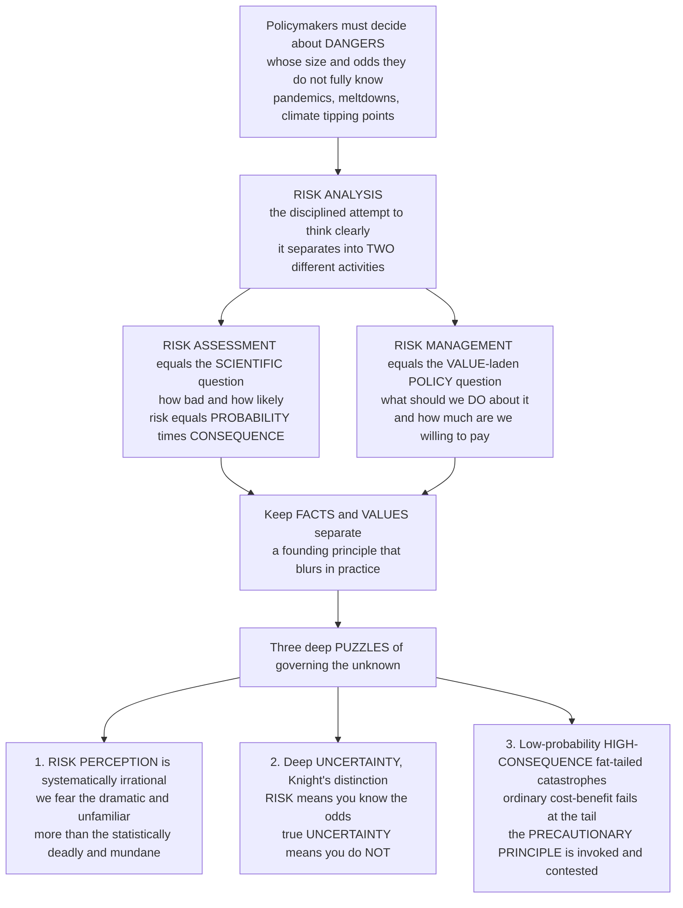

# ⚠️ Risk Analysis and Decision Under Uncertainty

> [!abstract] TL;DR
> **Risk analysis** is the disciplined attempt to think clearly about dangers whose size and likelihood we do not fully know — a possible pandemic, a reactor meltdown, a novel chemical, a financial crash, a climate tipping point. It splits into two activities that must not be confused: **risk assessment**, the *scientific* question of *how bad and how likely* (classically **risk = probability × consequence**), and **risk management**, the *value-laden policy* question of *what to do and how much to sacrifice* to reduce it. Keeping facts and values separate is a founding principle that blurs in practice. The field is full of deep puzzles: human **risk perception** is systematically irrational (we dread the dramatic and unfamiliar far more than the statistically deadlier and mundane, distorting policy toward the wrong dangers); **Knight's distinction** between calculable *risk* and genuine *uncertainty* breaks the ordinary expected-value math for novel threats; and **low-probability, high-consequence "fat-tailed" catastrophes** may warrant something like the contested **precautionary principle** rather than standard cost-benefit. Risk analysis is how societies try to govern the unknown and the dangerous.

---

## Intuition

**Analogy — the fire department that has to guess.** Imagine a town whose fire department must decide, every year, how much to spend on prevention — but it never knows which building will burn, when, or how badly. Some fires are common and small; a few could level the whole town. The department must do two very different jobs, and it gets into trouble whenever it lets them bleed together. The first job is a *scientific* one: for each hazard, *how likely is it, and how bad would it be?* A one-in-a-million chance of losing the whole town and a near-certain singed kitchen can carry the "same" expected loss on paper, even though they demand utterly different responses. The second job is a *values* one: *given those estimates, what should we actually do, and how much are we willing to pay or give up to be safer?* No amount of measurement answers that second question — it is a choice about what the town cares about.

That is exactly the structure of **risk analysis**. **Risk assessment** is the factual estimate of probability and consequence; **risk management** is the value-laden decision about acceptable risk and how to reduce it. And here is where our fire chief — like every policymaker — gets ambushed by human psychology. People panic about the rare, vivid, dreaded fire (the arson, the explosion) and shrug at the boring, statistically deadlier one (the space heater, the frayed wire), so public pressure pushes the department to spend fortunes averting tiny risks while ignoring huge ones. Worse, for genuinely *novel* dangers the department cannot even honestly write down the odds — **Frank Knight** called this true *uncertainty*, as opposed to the *risk* of a fair die whose odds you know — and when the worst case is catastrophic and irreversible, the ordinary "multiply probability by consequence" arithmetic quietly fails, which is why people reach for the **precautionary principle**: *when in doubt about catastrophic, irreversible harm, err on the side of caution*. That principle is itself deeply contested — but the underlying problem is unavoidable. Understanding risk analysis is understanding how societies try to govern the unknown, and how badly our intuitions mislead us when they do.

---

## How It Works

### Core mechanics

Risk analysis is a chain from *danger* to *decision*, built on one non-negotiable separation and haunted by three recurring puzzles.

1. **Frame the hazard.** Identify a threat to health, safety, environment, security, finance, or technology whose probability and consequences are uncertain. The naive scalar is **risk = probability × consequence** (expected loss), but richer conceptions add **severity, reversibility, distribution** (who bears it), and **dread** (how frightening it is), because a single expected-value number hides everything that makes a hazard politically and morally distinctive.
2. **Risk assessment (the science).** The NRC "Red Book" four-step template: **hazard identification** (can this thing cause harm?), **dose-response / exposure-response** (how does harm scale with dose or exposure?), **exposure assessment** (who is exposed, and how much?), and **risk characterization** (combine into a probability-and-magnitude estimate, *with its uncertainty*). This is the *positive*, technical layer — what *is* and *will* happen.
3. **Risk management (the values).** Given the assessment, decide *what to do*: which control options, at what cost, to reach what "acceptable" level of residual risk. This is the *normative* layer — it weighs the cost of control against the value of the harm avoided, and it necessarily embeds someone's values about how safe is safe enough.
4. **Risk communication.** Convey the risk honestly to the public and stakeholders — a distinct craft, because the *perceived* risk and the *assessed* risk routinely diverge, and mishandled communication can create panic or complacency out of the same numbers.
5. **Choose a decision rule appropriate to the epistemic state.** If probabilities are *known* (**risk**), expected-value / expected-utility maximization applies. If they are *unknown or contested* (**deep uncertainty**), that math loses its footing, and analysts turn to robustness rules — **maximin**, **minimax-regret**, robust decision-making, scenario planning, and (for catastrophic, irreversible tails) **precautionary** approaches — plus the **value of information** in simply *waiting to learn*.

**The founding separation and why it blurs.** The Red Book's core reform was to insulate the *scientific* assessment from the *political* management so that science is not bent to fit a desired verdict. In practice the wall is porous: choosing which hazards to study, which models and safety factors to use, and how to characterize deep uncertainty are all shot through with value judgments. The discipline is not to pretend the wall is perfect, but to make every value choice **explicit and contestable** rather than smuggling it in under a veneer of objectivity.



---

## Key Concepts

### Secondary (intuitive grasp)
- **Two jobs, never confused:** first ask *how likely and how bad* (assessment); then ask *what should we do about it* (management). Measurement answers the first; values answer the second.
- **Risk = chance × size:** a tiny chance of a huge disaster and a big chance of a small harm can be the "same" on paper — yet they call for very different responses.
- **We fear the wrong things:** people dread sharks, terrorism, and plane crashes and shrug at cars, heart disease, and slippery bathtubs, even though the mundane ones kill far more.
- **When you truly do not know the odds:** for brand-new dangers you often cannot honestly put a number on the chance, and "just multiply it out" stops working.

### Undergraduate (mechanisms and vocabulary)
- **The risk-analysis framework (NRC Red Book):** *risk assessment* (hazard identification → dose-response → exposure → risk characterization) is kept separate from *risk management* (the choice of acceptable risk and controls) and *risk communication*. The fact/value distinction is its organizing principle.
- **Knight's distinction:** **risk** = probabilities known or estimable (dice, actuarial mortality) → expected-value and decision theory apply; **uncertainty** (or *ambiguity*) = probabilities unknown or contested; **deep uncertainty** = novel, unprecedented dangers where even the model structure is unreliable ("unknown unknowns").
- **Risk perception and the psychometric paradigm (Slovic):** perceived risk is driven less by death tolls than by qualitative factors — **dread**, **unfamiliarity/novelty**, **involuntariness**, **catastrophic potential**, and **uncontrollability**. Voluntary, familiar, controllable hazards feel small even when deadly.
- **Availability and affect heuristics:** we judge probability by how easily vivid examples come to mind, and by gut feeling, so a single dramatic event (a crash, an attack) inflates perceived risk far beyond its statistics.
- **Decision rules:** **expected value / utility** for risk; **maximin** (maximize the worst case) and **minimax-regret** (minimize the largest "if only" regret) for uncertainty; **Monte-Carlo and sensitivity analysis** to propagate uncertainty; **value of information** to decide whether waiting to learn beats acting now.
- **Risk-cost-benefit analysis:** the workhorse of risk *management* — monetize the harm avoided and compare it to the cost of control — and its Achilles heel when the harm is catastrophic, irreversible, or genuinely unquantifiable.

### Graduate (critique and theory)
- **The limits of expected-utility maximization:** EU theory presumes a known probability distribution. Under **ambiguity** (Ellsberg) and **deep uncertainty** it is not just hard but ill-defined; robust and precautionary criteria are attempts to decide *well* without a trustworthy distribution, at the cost of the elegant optimality EU provides.
- **Fat tails and the failure of ordinary CBA:** for **heavy-tailed** (power-law / infinite-variance) loss distributions, the expected loss is dominated by rare extreme events, so any analysis that truncates or thin-tails the distribution (Gaussian value-at-risk before 2008) is catastrophically wrong. **Weitzman's "dismal theorem"** shows that under fat-tailed climate uncertainty and unbounded marginal damages, willingness-to-pay to avoid catastrophe can diverge, breaking naive discounted cost-benefit at the tail.
- **The precautionary principle — formulations and critique:** from weak ("lack of full certainty is no excuse for inaction") to strong ("proponents must prove safety before proceeding"). **Strengths:** it takes catastrophe, irreversibility, and deep uncertainty seriously where CBA cannot. **Critiques (Sunstein, *Laws of Fear*):** it is often *incoherent* because inaction is also risky — every regulation creates **risk-risk / health-health trade-offs** (banning a pesticide may raise food prices and malnutrition; blocking nuclear may entrench coal), so a principle that ignores the risks of *not* acting can paralyze or even *increase* net harm; it also lacks a cost ceiling.
- **Expert vs lay risk and democratic risk governance:** dismissing the public as merely "irrational" is itself a mistake — lay judgments encode legitimate *values* (dread, involuntariness, unfair distribution, distrust of institutions) that a pure fatality count omits. The governance problem is reconciling technical assessment with democratic legitimacy without either technocratic capture or "**probability neglect**" (treating a scary outcome as if probability did not matter at all).
- **Resilience and robustness vs prediction:** when you cannot forecast the specific shock, invest in **systems that fail gracefully** — redundancy, robustness, adaptive capacity — rather than in ever-more-precise (and brittle) point predictions. This reframes risk management from "predict and control" to "prepare and adapt," central to **existential and global catastrophic risk**.

---

## Python Demo

```python
# Risk & decision under uncertainty, quantified:
#   (a) RISK PERCEPTION vs REALITY  -> public dread tracks how scary a hazard feels,
#       not how many it kills (the perception gap that distorts policy).
#   (b) EQUAL EXPECTED LOSS, OPPOSITE CHARACTER -> a rare catastrophe and a common
#       nuisance can sit on the same "probability x consequence" iso-risk curve.
#   (c) DECISION RULES UNDER DEEP UNCERTAINTY -> expected value, maximin, and
#       minimax-regret can each recommend a DIFFERENT policy when you cannot
#       assign probabilities.
#   (d) FAT TAILS -> for heavy-tailed losses, a handful of extreme events dominate
#       total expected loss, so ignoring the tail is catastrophic (why precaution).
# Pure numpy + matplotlib.
import numpy as np
import matplotlib.pyplot as plt

rng = np.random.default_rng(42)
fig, ax = plt.subplots(2, 2, figsize=(13.5, 9.5))

# ---------------------------------------------------------------- (a)
# Perceived dread (0-10 salience) vs actual annual US deaths (approx, log scale).
hazards = ["Terrorism", "Air\ntravel", "Sharks", "Cars", "Heart\ndisease"]
actual_deaths = np.array([60.0, 50.0, 1.0, 40000.0, 695000.0])   # rough annual US
perceived = np.array([9.2, 7.5, 6.8, 3.0, 3.2])                  # subjective dread 0-10
x = np.arange(len(hazards))
axa = ax[0, 0]
axa.bar(x, actual_deaths, color="#8395a7", log=True, width=0.6,
        label="Actual annual US deaths (log)")
axa.set_xticks(x); axa.set_xticklabels(hazards, fontsize=8)
axa.set_ylabel("Actual annual US deaths (log scale)")
axa.set_title("(a) Risk perception vs reality:\nfear tracks DREAD, not death tolls")
axt = axa.twinx()
axt.plot(x, perceived, "o-", color="#c0392b", lw=2, ms=8,
         label="Perceived dread / salience")
axt.set_ylabel("Perceived dread / media salience (0-10)", color="#c0392b")
axt.set_ylim(0, 10)
axt.tick_params(axis="y", colors="#c0392b")

# ---------------------------------------------------------------- (b)
# Iso-risk curve: all (probability, consequence) pairs with the SAME expected loss.
EV = 1000.0                                   # target expected loss (lives-equivalent)
p = np.logspace(-6, -0.3, 400)                # probability axis
C = EV / p                                    # consequence that keeps p*C = EV
axb = ax[0, 1]
axb.loglog(p, C, color="#2e86de", lw=2, label=f"Iso-risk curve: p x C = {EV:.0f}")
# Two hazards with IDENTICAL expected loss but opposite character:
axb.scatter([1e-4], [1e7], s=90, color="#c0392b", zorder=5)
axb.annotate("Rare CATASTROPHE\np=1e-4, loss=1e7", (1e-4, 1e7),
             textcoords="offset points", xytext=(-20, -38), fontsize=8, color="#c0392b")
axb.scatter([0.2], [5000], s=90, color="#27ae60", zorder=5)
axb.annotate("Common NUISANCE\np=0.2, loss=5e3", (0.2, 5000),
             textcoords="offset points", xytext=(-120, 18), fontsize=8, color="#1e8449")
axb.set_xlabel("Probability of the event (log)")
axb.set_ylabel("Consequence if it happens (log)")
axb.set_title("(b) Equal expected loss, OPPOSITE character:\nsame 'risk' on paper, different policy problem")
axb.legend(fontsize=8, loc="lower left")

# ---------------------------------------------------------------- (c)
# Payoff matrix: 3 policies x 3 (unprobabilized) futures; higher payoff = better.
acts = ["Precaution", "Balanced\nhedge", "Business\nas usual"]
states = ["Mild", "Moderate", "Catastrophic"]
P = np.array([
    [ 4,  4,  4],    # Precaution: flat, moderate everywhere
    [ 2,  6,  5],    # Balanced hedge: highest average
    [ 9,  5, -3],    # Business as usual: best if mild, worst if catastrophic
], dtype=float)

ev   = P.mean(axis=1)                          # expected value, equal-prob assumption
mm   = P.min(axis=1)                           # maximin: value the worst case
regret = P.max(axis=0) - P                     # regret vs best act in each state
mmr  = -regret.max(axis=1)                     # minimax-regret (negate so "higher=better")

rules = {"Expected value\n(equal probs)": ev, "Maximin\n(worst case)": mm,
         "Minimax-regret": mmr}
axc = ax[1, 0]
w = 0.25
for i, (name, score) in enumerate(rules.items()):
    s = (score - score.min()) / (score.max() - score.min() + 1e-9)  # 0-1 per rule
    bars = axc.bar(np.arange(len(acts)) + i * w, s, width=w, label=name)
    winner = int(np.argmax(score))
    bars[winner].set_edgecolor("black"); bars[winner].set_linewidth(2.5)
axc.set_xticks(np.arange(len(acts)) + w)
axc.set_xticklabels(acts, fontsize=8)
axc.set_ylabel("Rule score (normalized 0-1)")
axc.set_title("(c) Decision rules DISAGREE under deep uncertainty\n(bold = each rule's chosen policy)")
axc.legend(fontsize=7, loc="upper right")
print("Chosen policy by rule:",
      {n: acts[int(np.argmax(s))].replace(chr(10), " ") for n, s in rules.items()})

# ---------------------------------------------------------------- (d)
# Fat tail vs thin tail: what share of TOTAL loss comes from the biggest events?
n = 200_000
thin  = rng.exponential(scale=1.0, size=n)        # thin-tailed losses
heavy = rng.pareto(a=1.5, size=n) + 1.0           # heavy-tailed (alpha=1.5, infinite variance)
def loss_concentration(losses):
    s = np.sort(losses)[::-1]                      # largest first
    frac_events = np.arange(1, len(s) + 1) / len(s)
    frac_loss = np.cumsum(s) / s.sum()
    return frac_events, frac_loss
fe_t, fl_t = loss_concentration(thin)
fe_h, fl_h = loss_concentration(heavy)
axd = ax[1, 1]
axd.plot(fe_t * 100, fl_t * 100, lw=2, color="#27ae60", label="Thin tail (exponential)")
axd.plot(fe_h * 100, fl_h * 100, lw=2, color="#c0392b", label="Fat tail (Pareto, a=1.5)")
axd.axvline(1, ls="--", color="gray")
top1_heavy = np.interp(0.01, fe_h, fl_h) * 100
axd.set_xlim(0, 25)
axd.set_xlabel("Largest X percent of events")
axd.set_ylabel("Share of TOTAL expected loss")
axd.set_title(f"(d) Fat tails: top 1 percent of events = {top1_heavy:.0f} percent of loss\nignoring the tail is catastrophic")
axd.legend(fontsize=8, loc="lower right")

plt.tight_layout()
plt.savefig("risk_analysis_and_decision_under_uncertainty.png", dpi=120)
plt.show()
```

Panel (a) shows the core paradox of **risk perception**: public dread runs almost *inversely* to the death toll — sharks and terrorism terrify, cars and heart disease barely register — so democratic pressure pushes policy to spend fortunes on the vivid and cheap-to-fear while neglecting the mundane and deadly. Panel (b) makes "risk = probability × consequence" concrete: a one-in-ten-thousand catastrophe and a one-in-five nuisance sit on the *same* iso-risk curve yet are utterly different policy problems, which is why a single expected-value number is never the whole story. Panel (c) is the heart of **decision under uncertainty**: with the same payoff table but *no* agreed probabilities, expected value favors the **Balanced hedge**, while both robustness rules — **maximin** and **minimax-regret** — favor **Precaution**; when you genuinely cannot assign odds, *which rule you adopt* changes the recommended policy. Panel (d) shows why catastrophic **fat tails** break ordinary cost-benefit: for a heavy-tailed loss, the largest ~1 percent of events account for the bulk of total expected loss, so any analysis that thin-tails or truncates the distribution radically understates the danger — the quantitative case for precaution.

---

## Real-World Applications

> **Example — the EPA and the NRC "Red Book" (chemical risk).** When the U.S. EPA regulates a pollutant or pesticide, it runs the four-step **risk assessment** (hazard identification, dose-response, exposure, characterization) and then, in a formally *separate* **risk management** step, decides an acceptable exposure limit weighing costs and benefits. This is the Red Book's fact/value separation institutionalized — and the endless fights over which safety factors and low-dose extrapolations to use are exactly where the "wall" between science and values turns out to be porous.

> **Example — nuclear probabilistic risk assessment (PRA).** The 1975 Rasmussen Report (WASH-1400) pioneered **probabilistic risk assessment** for reactors: fault trees and event trees multiplying component-failure probabilities to estimate the chance and consequence of a core meltdown. It is the purest form of "risk = probability × consequence" — and its post-Three-Mile-Island and post-Fukushima critiques (missed common-cause failures, underweighted deep-uncertainty tails) are a case study in why rare, high-consequence estimates are so fragile.

> **Example — financial systemic risk and the 2008 crash.** Pre-2008 value-at-risk models assumed thin (Gaussian) tails, so a "25-standard-deviation" week was, on those models, impossible several days running. The crisis was a live demonstration of **panel (d)**: heavy-tailed, correlated losses in which the neglected tail *was* the whole risk. Post-crisis stress testing and macroprudential regulation shifted toward robustness and scenario analysis over point prediction.

> **Example — COVID-19 and decision under deep uncertainty.** Early 2020 was **Knightian uncertainty** in real time: unknown fatality rate, unknown transmissibility, unknown duration. Lockdown decisions could not rest on trustworthy expected-value math, so governments effectively used precautionary and robustness reasoning ("act now against the plausible catastrophic tail") — and paid the price of **risk-risk trade-offs** (economic harm, missed care, mental health) that a single-hazard focus underweighted.

> **Example — the EU precautionary principle (REACH, GMOs, climate).** The EU has written the **precautionary principle** into law: under threat of serious or irreversible harm, absence of full scientific certainty is not grounds for inaction. It shapes chemical regulation (REACH), GMO approvals, and climate policy — and is precisely the contested terrain Sunstein critiques, since blocking one risk (e.g., GM crops) can raise others (yields, pesticide use), and the principle alone does not say how to balance them.

---

## Common Pitfalls

- **Collapsing assessment into management** — Letting the desired *policy* answer bend the *scientific* estimate (or vice versa). When a regulator picks safety factors to reach a pre-decided verdict, the "science" is really disguised values. The fix is not a perfect wall but making every value choice explicit and contestable.
- **Probability neglect** — Reacting to a *scary outcome* as if its likelihood were irrelevant, so tiny risks with vivid consequences (a rare contaminant, a terror scenario) command budgets that far deadlier mundane risks never get. Salience is not probability; force the low base rate back into the conversation.
- **Treating deep uncertainty as if it were risk** — Manufacturing a single point probability for a genuinely unprecedented threat and running clean expected-value math on it (false precision). If the recommendation flips across plausible, unresolvable assumptions, say so and switch to robustness/precautionary rules rather than pretending to know the odds.
- **Thin-tailing a fat-tailed world** — Assuming Gaussian, bounded losses for processes (financial, climatic, pandemic) whose danger *lives in the tail*. As panel (d) shows, truncating the tail can hide most of the expected loss; model the tail explicitly or assume it dominates.
- **Precaution as one-sided paralysis** — Invoking the precautionary principle against the risk of *acting* while ignoring the risk of *not* acting. Every regulation has **risk-risk / health-health trade-offs**; a precaution that bans nuclear and entrenches coal, or blocks a drug and leaves a disease untreated, can increase net harm. Precaution must be applied to *both* sides of the ledger.
- **Dismissing the public as merely irrational** — Reading lay risk perception as pure error to be corrected by experts. Dread, involuntariness, unfair distribution, and distrust are *legitimate values*, not mistakes; ignoring them produces technically "optimal" policies that are democratically illegitimate and unimplementable.

---

## Related Concepts

Cross-vault anchors (Glob-verified files elsewhere in the vault):

- [[Risk_Ambiguity_and_Uncertainty]] — the behavioral-economics treatment of Knight's distinction and the Ellsberg ambiguity aversion that underlies why deep uncertainty defeats expected-utility math.
- [[Availability_and_Representativeness]] — the availability and affect heuristics that *cause* the risk-perception gap in panel (a): we judge probability by how easily a vivid example comes to mind.
- [[Prospect_Theory]] — why people overweight small probabilities and treat losses asymmetrically, deepening the psychology of how catastrophic and rare risks are (mis)valued.
- [[Bifurcations_and_Tipping_Points]] — the dynamical-systems structure behind the irreversible, catastrophic thresholds (climate, ecosystems) that most justify precaution over cost-benefit.
- [[Resilience_and_Robustness]] — the systems-thinking alternative to prediction: when you cannot forecast the shock, build systems that fail gracefully — the robustness logic behind panel (c).
- [[Cascades_and_Systemic_Risk]] — how local failures propagate into fat-tailed, system-wide catastrophes (finance, infrastructure), the network mechanism behind panel (d).
- [[Sustainability_and_Planetary_Boundaries]] — the planetary-scale, irreversible risks (the archetypal precautionary-principle domain) framed as boundaries not to cross.
- [[Pandemics_and_Emerging_Infections]] — the canonical low-probability, high-consequence public-health catastrophe governed under Knightian uncertainty, as in the COVID example.
- [[Mathematics/06_Probability_and_Statistics/Probability_Theory|Probability Theory]] — the formal machinery of probability and expected value that risk *assessment* rests on, and whose assumptions (finite variance, known distributions) fat tails and deep uncertainty violate.

Within this vault, this note formalizes step 5 (project outcomes) of its Section-02 sibling *Policy_Analysis_Methods* under uncertainty. Its siblings deepen the toolkit in prose: *Cost_Benefit_Analysis* is the monetize-and-compare method that risk-cost-benefit analysis extends (and that fat tails and irreversibility break); *Discounting_and_Valuing_the_Future* supplies the intertemporal weights that Weitzman's dismal theorem stresses for catastrophic climate risk; *Environmental_and_Climate_Policy* is the paradigm domain of precaution and tipping points; and *Behavioral_Public_Policy_and_Nudges* draws on the same risk-perception psychology to design choice architecture around biased risk judgments.

---

## Review Questions

1. **(Secondary)** Explain, using the fire-department analogy, why "how likely and how bad is this danger?" and "what should we do about it?" are two different questions — and give one everyday example where people fear a statistically minor risk far more than a deadlier one.
2. **(Undergraduate)** Distinguish Knight's *risk* from *uncertainty*, and explain why the ordinary "expected value = probability × consequence" calculation works for the first but not the second. Using panel (c) of the demo, describe a situation in which maximin and expected value would recommend *different* policies, and say which you would trust and why.
3. **(Graduate)** "For catastrophic, irreversible, fat-tailed risks, standard cost-benefit analysis should be replaced by the precautionary principle." Evaluate this claim. Bring in Weitzman's dismal theorem and the demo's fat-tail result *in favor*, and Sunstein's risk-risk / health-health critique *against*, and state the conditions under which precaution is coherent rather than paralyzing.

---

## Sources

- Paul Slovic, *The Perception of Risk* (Earthscan, 2000) — the psychometric paradigm: dread, unfamiliarity, involuntariness, and the systematic gap between perceived and actual risk.
- Frank H. Knight, *Risk, Uncertainty and Profit* (1921) — the foundational distinction between measurable *risk* and true *uncertainty*.
- National Research Council, *Risk Assessment in the Federal Government: Managing the Process* (the "Red Book," 1983) — the separation of risk assessment from risk management and the four-step assessment framework.
- Cass R. Sunstein, *Laws of Fear: Beyond the Precautionary Principle* (Cambridge University Press, 2005) — probability neglect, risk-risk trade-offs, and the incoherence critique of the precautionary principle.
- Martin L. Weitzman, "On Modeling and Interpreting the Economics of Catastrophic Climate Change," *Review of Economics and Statistics* 91(1), 2009 — the "dismal theorem" on fat-tailed catastrophic risk.

---

#public-policy #risk-analysis #uncertainty #risk-perception #precautionary-principle
