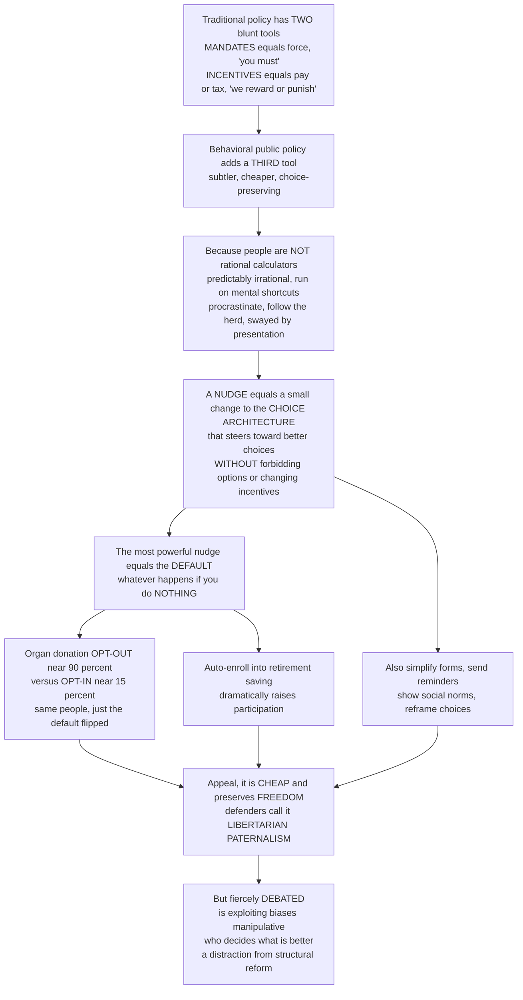

# 👉 Behavioral Public Policy and Nudges

> [!abstract] TL;DR
> Traditional public policy has only two blunt levers for changing behavior: **mandates** (force people — "you must") and **incentives** (pay or tax them — "we'll reward or punish you"). **Behavioral public policy** adds a third, subtler, cheaper lever built on a discovery from psychology: people are *not* the perfectly rational calculators standard economics assumes — we are predictably irrational, run on mental shortcuts, procrastinate, follow the herd, and are heavily swayed by how choices are **presented**. A **nudge** (Thaler & Sunstein's Nobel-winning idea) is a small change to the **choice architecture** — the environment in which people decide — that steers them toward better choices *without forbidding any option or significantly changing the economic incentives*. Its single most powerful instrument is the **default**: whatever happens if you do nothing. Because people are inertia-prone, flipping the default transforms behavior on a massive scale — **opt-out** organ-donation systems reach donation consent near **90 percent** while **opt-in** systems languish near **15 percent** (same people, same freedom, wildly different outcome), and **automatic enrollment** dramatically raises retirement saving. Its defenders call it **libertarian paternalism**: paternalistic in steering you toward your own good, libertarian in leaving you free to refuse. The approach is cheap, choice-preserving, and often works brilliantly — which is why **200-plus "nudge units"** now run policy **RCTs** worldwide. But it is fiercely contested: is exploiting people's biases *manipulative*, even for their own good? Who decides what is "better"? And is it a distraction from bigger **structural** reform? This is the public-policy-application view; the behavioral-economics theory lives in [[Behavioral_Public_Policy_and_Libertarian_Paternalism]] and [[Nudges_and_Choice_Architecture]].

---

## Intuition

**Analogy — the school cafeteria that cannot be neutral.** A cafeteria director wants students to eat better. She has the two textbook tools every policymaker knows. She could *mandate*: ban the desserts outright — effective, but the kids revolt and it tramples their freedom. Or she could use *incentives*: raise the price of cake and subsidize the salad — but that costs money, and hungry teenagers with cash will still buy the cake. Then a behavioral scientist points out something she had never considered: **whatever she does, the food has to be arranged in *some* order**, and *where she puts things changes what students eat*, no matter what. Put the fruit at eye level and the fries at the far end, and healthy choices rise — without banning anything, without changing a single price, without anyone being forced. She has not restricted freedom or spent money; she has simply *redesigned the choice*. That is a **nudge**. And the deepest version of the trick is the **default** — the option that happens if the student just grabs a tray and does nothing: put the salad as the automatic side (fries available on request) and watch salad consumption soar, purely because people go with the flow.

Now scale that cafeteria up to a whole country. Traditional policy forces behavior through **mandates** or pays to change it through **incentives** — both assuming a rational citizen who weighs costs and benefits. But real people are *predictably irrational* (link: [[The_Rational_Actor_Model_and_Its_Limits]]): they procrastinate on the pension form, follow whatever their neighbors do, dread the vivid over the deadly, and are swayed by how a choice is framed. So a government can steer behavior by **redesigning the choice architecture** rather than commanding it. The most powerful lever is still the humble default: countries where organ donation is **opt-out** (you are a donor unless you tick a box to decline) reach consent near **90 percent**, while **opt-in** countries (you must tick a box to join) sit near **15 percent** — the *same* people, with the *same* freedom to choose, producing a life-and-death difference *just from flipping the default*. Its champions call this **libertarian paternalism** — steering you toward your own good while leaving every door open. Its critics call it manipulation. Understanding behavioral public policy is understanding a quiet revolution in how the public sector tries to improve lives: by **redesigning choices rather than commanding them**.

---

## How It Works

### Core mechanics

Behavioral public policy is a pipeline from a *psychological fact* to a *cheaper policy instrument*, sitting beside — not replacing — mandates and incentives.

1. **Start from the departure.** Standard policy assumes *homo economicus*: a rational agent who, given the right incentives, chooses well. Behavioral science documents that real people exhibit **bounded rationality** and systematic **biases** — present bias and procrastination, status-quo and default bias, loss aversion, anchoring, availability, overconfidence, and heavy social influence (link: [[Heuristics_and_Biases_Overview]]). They therefore make choices *against their own interests* — under-saving, not claiming benefits they qualify for, never switching to a better deal.
2. **Get a new rationale.** These self-imposed harms are **internalities** (harms you inflict on your own future self, as opposed to *externalities* imposed on others). They ground a *behavioral* rationale for intervention that the classical market-failure taxonomy lacks — and they point to a new *toolkit*.
3. **Recognize that choice architecture is unavoidable.** Every choice is presented in *some* way: some default, some order, some framing must exist and will steer millions. **There is no neutral design.** Refusing to design the environment does not protect freedom; it just hands the outcome to accident or to whichever firm profits from the friction.
4. **Deploy a nudge.** A **nudge** is, in Thaler & Sunstein's exact definition, "any aspect of the choice architecture that alters people's behavior in a predictable way without forbidding any options or significantly changing their economic incentives." It is a **third way** between mandates and incentives: cheap, choice-preserving, and often startlingly effective.
5. **Reach for the default first.** The most powerful nudge is the **default** — the option that obtains when the person does nothing. Because inertia and status-quo bias are so strong, changing the default changes behavior massively (organ donation, auto-enrollment). Other nudges: **simplification** and cutting friction (removing "sludge"), **social-norm** messages (telling people what their peers do), **framing and salience**, **reminders and prompts**, **commitment devices**, and **feedback and disclosure**.
6. **Test it, then scale it.** Because effects are behavioral and context-dependent, nudges are validated with **randomized controlled trials** ("test, learn, adapt") before scale-up — the same causal-inference discipline used for any program (a sibling topic developed in prose below).

**The framing that makes it public policy.** In the economics of the public sector, a government choosing how to change behavior faces a menu: **mandate** (regulation, bans), **incentive** (taxes, subsidies), or **nudge** (choice architecture). Behavioral public policy is the claim that the third option is frequently the *least-coercive tool that works*, and that behavioral insight should also improve the *design* of the first two — better-framed mandates, better-targeted incentives.

### Flow / Architecture



---

## Key Concepts

### Secondary (intuitive grasp)

- **The three tools of policy.** To change behavior a government can *force* you (mandate), *pay or charge* you (incentive), or *redesign the choice* (nudge). The nudge is the cheap new one that leaves you free.
- **People are not perfectly rational.** We put things off, copy the crowd, and are swayed by how a choice looks — so the *arrangement* of a decision matters, not just the facts.
- **A nudge changes the setup, not the rules.** It forbids nothing and pays nothing; it just makes the better choice easier or more obvious (fruit at eye level, salad as the default side).
- **The default is king.** Whatever happens when you do nothing is what most people end up with. Flip the default and you flip the behavior.
- **Organ donation, the famous case.** Where you are a donor *unless you opt out*, roughly nine in ten consent; where you must *opt in*, roughly one in seven. Same people, same freedom — just a different default.
- **Freedom stays.** You can always opt out. That is why supporters call it "steering without shoving."

### Undergraduate (mechanisms and vocabulary)

- **The behavioral foundation.** The departure from the **rational-actor (homo economicus)** model: **bounded rationality**, and systematic biases — **present bias**/procrastination (link: [[Present_Bias_and_Self_Control]]), **status-quo and default bias**, **loss aversion** (link: [[Loss_Aversion_and_the_Endowment_Effect]]), anchoring, availability, overconfidence, and **social influence** (link: [[Social_Norms_and_Conformity]]) — so people systematically choose against their own interest.
- **Internalities as a rationale.** Self-imposed harms (present-biased under-saving, inertia) create a behavioral case for intervention distinct from correcting externalities — a *new warrant* and a *new toolkit*, not just a new tax.
- **Nudge, defined precisely.** Alters behavior *predictably*, *without forbidding options*, and *without significantly changing economic incentives*. A tax is not a nudge; a ban is not a nudge; rearranging the form is.
- **Choice architecture.** How options are structured, ordered, and presented shapes decisions. Because *some* arrangement is unavoidable, "there is no neutral design" — the only question is whether it is designed on purpose and in the chooser's interest.
- **The key nudge types.**
  - **Defaults** — the option that obtains with no action; the most powerful nudge, exploiting inertia. The organ-donation **opt-in vs opt-out** natural experiment (~15 vs ~90 percent) and **automatic enrollment** in pensions (Thaler & Benartzi's *Save More Tomorrow*) are the flagships.
  - **Simplification and reducing friction** — cutting paperwork and "**sludge**" (friction that blocks good choices) so eligible people actually enroll or claim.
  - **Social norms / comparisons** — showing peer behavior ("most people in your area pay on time"; your energy use vs neighbors').
  - **Framing and salience** — how a choice is worded and what is made prominent.
  - **Reminders and prompts**, **commitment devices**, **feedback and disclosure** (calorie labels, energy labels).
- **Design frameworks.** Practitioner mnemonics: **EAST** (make it *Easy, Attractive, Social, Timely*) and **MINDSPACE** (Messenger, Incentives, Norms, Defaults, Salience, Priming, Affect, Commitments, Ego).
- **Libertarian paternalism.** The justification (Thaler & Sunstein): steer toward welfare while **preserving liberty to choose**. Paternalistic in the goal, libertarian in the freedom to opt out.
- **Institutions.** The rise of **behavioral insights teams / "nudge units"** — the UK **Behavioural Insights Team (BIT)**, the US **Office of Evaluation Sciences (OES)** / former SBST, the OECD, the World Bank — running policy **RCTs** across savings, health, tax, energy, and benefit take-up.

### Graduate (critique and theory)

- **The manipulation-and-autonomy debate.** Is it ethically legitimate to *exploit* people's biases, even for their own good? Critics argue nudges can bypass rational agency and thus offend **autonomy** (link: [[Informed_Consent_and_Autonomy]]); defenders reply that choice architecture is unavoidable and that *transparent* nudges (ones people would endorse if told) preserve agency. The test many adopt is whether the intervention steers toward what the person would choose **"as judged by themselves" (AJBT)**, not what a planner prefers.
- **Who decides what is "better," and who nudges the nudgers?** The paternalism problem: a nudge presumes a normative benchmark for the "right" choice, and government designers have their own biases, political incentives, and blind spots. Transparency, contestability, and evaluation are the proposed safeguards.
- **Effectiveness, durability, and the evidence base.** Real-world nudge effects are often **small** and sometimes **fade**; meta-analyses face **publication bias** and **replication** concerns, and headline effect sizes shrink at scale. The honest claim is *high cost-effectiveness per dollar*, not large absolute effects — nudges are cheap, so even small effects can beat costly alternatives (Benartzi et al.).
- **The i-frame vs s-frame critique (Chater & Loewenstein).** Nudges operate on the **individual frame (i-frame)**; the danger is that a cheap, politically convenient i-frame intervention **crowds out** or serves as a **substitute for structural (s-frame)** reform — e.g., promoting individual recycling nudges instead of regulating producers. Behavioral policy can be captured to *distract* from the bigger levers.
- **Nudge vs boost.** An alternative program (**boosts**, Hertwig & Grüne-Yanoff) aims to *build people's competence* (financial literacy, statistical reasoning) so they choose well themselves, rather than steering a passive chooser — a more autonomy-respecting but costlier and slower path.
- **Frontiers and dark sides.** **Sludge audits** (finding and removing friction, including exploitative friction); **digital and personalized nudging** and its risks — **dark patterns** and "**hyper-nudging**," where firms and states use data to micro-target influence at scale; and **mainstreaming** behavioral science across the whole policy cycle, not just as bolt-on nudges but as better mandates and incentives.
- **Effect sizes vs bigger policy levers.** The mature position places nudges as a *bounded complement* to regulation, taxation, and public provision — powerful where inertia and framing dominate, weak against binding constraints (poverty, price, supply), and never a full replacement for structural policy.

---

## Python Demo

```python
# Behavioral public policy, made quantitative:
#   (a) THE POWER OF DEFAULTS -- OPT-IN vs OPT-OUT.
#       Every person has a private "net benefit of enrollment" b (mixed sign) and
#       faces a HASSLE COST h of taking action to move AWAY from the default.
#       Opt-in  (default = NOT enrolled): a person acts to ENROLL only if b > h.
#       Opt-out (default = ENROLLED):     a person acts to LEAVE  only if -b > h.
#       With IDENTICAL preferences, flipping the default alone reproduces the
#       dramatic organ-donation / retirement-savings participation gap: the
#       "default-driven" middle (|b| < h) simply goes with whatever it is given.
#   (b) NUDGE vs INCENTIVE vs MANDATE -- cost-effectiveness (behavior change per $).
#       Nudges are cheap, so even a MODEST effect can dominate on impact-per-dollar
#       (the Benartzi et al. 2017 finding), the economic case for the third tool.
# Pure numpy + matplotlib (no scipy).
import numpy as np
import matplotlib.pyplot as plt
from math import erf

def norm_cdf(x, mu=0.0, sigma=1.0):
    # standard normal CDF via the error function, vectorized (no scipy)
    z = (x - mu) / (sigma * np.sqrt(2.0))
    return 0.5 * (1.0 + np.vectorize(erf)(z))

fig, (ax1, ax2) = plt.subplots(1, 2, figsize=(13.5, 5.6))

# ----------------------------------------------------------------------
# (a) DEFAULT EFFECT: participation vs hassle cost, opt-in vs opt-out.
#     Net benefit b ~ Normal(mu, sigma) across the population (mixed preferences).
#     Participation(opt-in)  = P(b > h)      -> only the strongly-motivated join.
#     Participation(opt-out) = P(b > -h)     -> only the strongly-motivated leave.
# ----------------------------------------------------------------------
mu, sigma = 0.0, 1.0                 # weakly-mixed preferences (as many for as against)
h = np.linspace(0.0, 3.0, 300)       # hassle cost of acting to switch away from default

part_optin  = 1.0 - norm_cdf(h,  mu, sigma)   # must act to enroll
part_optout = 1.0 - norm_cdf(-h, mu, sigma)   # must act to leave

ax1.plot(h, part_optin * 100,  lw=2.4, color="#c0392b", label="OPT-IN default: not enrolled")
ax1.plot(h, part_optout * 100, lw=2.4, color="#27ae60", label="OPT-OUT default: enrolled")
ax1.fill_between(h, part_optin * 100, part_optout * 100, color="#f1c40f", alpha=0.30,
                 label="Default-driven population (|b| < h)")

# highlight h = 1: reproduces the organ-donation-style ~16 vs ~84 gap
h0 = 1.0
p_in  = (1.0 - norm_cdf(np.array([h0]), mu, sigma))[0] * 100
p_out = (1.0 - norm_cdf(np.array([-h0]), mu, sigma))[0] * 100
ax1.axvline(h0, ls=":", color="gray", lw=1.3)
ax1.scatter([h0, h0], [p_in, p_out], s=60, color=["#c0392b", "#27ae60"], zorder=5)
ax1.annotate(f"opt-in ~{p_in:.0f}%",  (h0, p_in),  xytext=(h0 + 0.15, p_in - 8),  fontsize=8, color="#c0392b")
ax1.annotate(f"opt-out ~{p_out:.0f}%", (h0, p_out), xytext=(h0 + 0.15, p_out + 3), fontsize=8, color="#1e8449")
ax1.set_xlabel("Hassle cost of switching away from the default")
ax1.set_ylabel("Participation rate (percent)")
ax1.set_title("(a) The power of DEFAULTS: opt-in vs opt-out\nsame preferences, just the default flipped")
ax1.set_ylim(0, 100)
ax1.legend(fontsize=8, loc="center right")
ax1.grid(alpha=0.3)

# ----------------------------------------------------------------------
# (b) COST-EFFECTIVENESS: extra people reaching the goal per $1000 spent.
#     Illustrative figures in the spirit of Benartzi et al. (2017): nudges are
#     so cheap that impact-PER-DOLLAR dwarfs incentives and mandates even when
#     their absolute effect is smaller.
# ----------------------------------------------------------------------
tools       = ["Nudge\n(auto-enroll /\nreminder)", "Financial\nincentive\n(subsidy)", "Mandate\n(regulation +\nenforcement)"]
effect_pp   = np.array([25.0, 12.0, 40.0])     # percentage-point behavior change achieved
cost_per_k  = np.array([2.0, 55.0, 30.0])      # program cost ($) per person reached
# additional adopters per $1000 = (effect fraction) / (cost per person) * 1000
per_1000 = (effect_pp / 100.0) / cost_per_k * 1000.0

colors = ["#2e86de", "#e67e22", "#8e44ad"]
bars = ax2.bar(tools, per_1000, color=colors, width=0.6)
for b, val, eff in zip(bars, per_1000, effect_pp):
    ax2.text(b.get_x() + b.get_width() / 2, val + 1.5, f"{val:.0f}",
             ha="center", fontsize=10, fontweight="bold")
    ax2.text(b.get_x() + b.get_width() / 2, 2, f"effect\n+{eff:.0f} pp",
             ha="center", fontsize=7.5, color="white")
ax2.set_ylabel("Extra people reaching the goal per $1000")
ax2.set_title("(b) NUDGE vs INCENTIVE vs MANDATE\ncost-effectiveness: the cheap third tool wins per dollar")
ax2.grid(alpha=0.3, axis="y")

plt.tight_layout()
plt.savefig("behavioral_public_policy_and_nudges.png", dpi=120)
plt.show()

print(f"(a) At hassle cost h={h0}: opt-in participation ~{p_in:.0f}% vs "
      f"opt-out ~{p_out:.0f}% -- a {p_out - p_in:.0f} point swing from the DEFAULT alone.")
print("(b) Impact per $1000 -> " +
      ", ".join(f"{t.splitlines()[0]}: {v:.0f}" for t, v in zip(tools, per_1000)) +
      "  (nudge dominates on cost-effectiveness despite a smaller absolute effect).")
```

Panel (a) is the **power of the default** made mechanical. Every person has the *same* underlying preference distribution and the *same* freedom to choose; the only thing that changes is which option is the automatic one. Under an **opt-in** default only the strongly motivated bother to *enroll*, so participation is low; under an **opt-out** default only the strongly motivated bother to *leave*, so participation is high. The yellow band is the **default-driven** middle — everyone whose preference is weaker than the hassle of acting, who simply keeps whatever they are given. At a modest hassle cost the model reproduces the organ-donation-style gap (roughly 16 percent versus 84 percent) *purely from flipping the default*, with identical people and identical liberty. Panel (b) shows why the "third tool" is economically attractive: a nudge's *absolute* effect can be smaller than a mandate's, yet because it costs so little per person, its **impact per dollar** dominates both the financial incentive and the mandate — the quantitative heart of Benartzi et al.'s "should governments invest more in nudging?" (The figures are illustrative; real audits, not stylized numbers, must decide any specific case.)

---

## Real-World Applications

> **Example — organ donation (the flagship default).** Johnson & Goldstein's *"Do Defaults Save Lives?"* (Science, 2003) compared European countries: **opt-in** nations (Germany, the UK, Denmark) sat near **15 percent** effective consent, while **opt-out** nations (Austria, France, Sweden) reached near **90 percent**, holding culture and attitudes roughly constant. The difference is almost entirely the **default** — the single most-cited demonstration that choice architecture can move a life-and-death outcome without removing anyone's freedom to decline.

> **Example — automatic enrollment and *Save More Tomorrow* (retirement saving).** Thaler & Benartzi showed that switching a pension plan's default from opt-in to **automatic enrollment** raises participation from roughly 40 percent to over 90 percent, and their *Save More Tomorrow* program pre-commits workers to raise contributions with future raises (defeating present bias and loss aversion). Enshrined in the US Pension Protection Act (2006), the UK's auto-enrollment, and New Zealand's KiwiSaver, it is behavioral public policy's largest-scale success.

> **Example — the UK Behavioural Insights Team and tax-compliance social norms.** The UK's BIT (the original "nudge unit") ran RCTs with HMRC showing that letters telling late taxpayers that **"most people in your area have already paid"** measurably increased on-time payment — a pure **social-norm** nudge that brought forward revenue at near-zero cost, and a template copied by nudge units worldwide.

> **Example — energy use and home energy reports.** Opower's home energy reports (studied by Allcott) show households how their consumption compares with **similar neighbors**, nudging usage down by around 2 percent on average — small per household but vast in aggregate, and a canonical **social-comparison** intervention now embedded in utility programs.

> **Example — benefit and college take-up via simplification.** Field experiments by Bettinger et al. showed that having tax preparers **pre-fill the US FAFSA** financial-aid form (removing sludge) raised college enrollment among low-income students far more cheaply than grant increases of comparable effect — a demonstration that cutting **friction** can beat spending more money, and that "hassle" itself is a policy variable.

> **Example — institutionalizing behavioral insight.** The US **Office of Evaluation Sciences** (successor to the SBST), the OECD's behavioral-insights network, and the World Bank's *Mind, Society, and Behavior* report show behavioral public policy moving from clever one-offs to a permanent, RCT-driven function embedded across health, tax, energy, and safety-net design.

---

## Common Pitfalls

- **Believing a "neutral" default exists.** Refusing to design the choice environment does not preserve freedom — it just hands the outcome to accident or to whichever firm profits from the friction. *Some* default always operates; the only real question is whether it is chosen deliberately and in the chooser's interest.
- **Nudging as a substitute for structural reform (the i-frame trap).** The cheapest, most politically convenient intervention is often an individual-level nudge, which can **crowd out** the harder structural (s-frame) fix — promoting personal recycling instead of regulating producers, or financial-literacy tips instead of curbing predatory lending. Ask whether the nudge is *complementing* or *displacing* the bigger lever.
- **Manipulation and opacity.** A nudge that only works because people do not understand it edges toward manipulation and offends autonomy. The safeguard is **transparency** and the AJBT test — steer only toward what people would endorse for themselves if the nudge were disclosed.
- **Overclaiming effect sizes.** Headline nudge effects are often *small*, sometimes *fade*, and shrink at scale; the literature carries real **publication-bias and replication** concerns. Claim *cost-effectiveness per dollar*, not large absolute effects, and demand an RCT before scaling.
- **Backfire and reactance.** Poorly designed nudges can provoke resistance (people who feel manipulated do the opposite), reinforce a *bad* norm ("most people cheat on taxes"), or widen gaps if only the savvy respond. Test heterogeneity and distributional effects, not just the average.
- **Weaponizing the tool (sludge and dark patterns).** The same science that removes friction to help people can *add* friction to trap them — hard-to-cancel subscriptions, deceptive defaults, "hyper-nudging." A nudge is only libertarian paternalism if it genuinely serves the chooser; otherwise it is exploitation.

---

## Related Concepts

Cross-vault anchors (Glob-verified files elsewhere in the vault):

- [[Behavioral_Public_Policy_and_Libertarian_Paternalism]] — the Behavioral-Economics *theory* of this topic (the AJBT welfare standard, the nudge-to-shove spectrum, i-frame vs s-frame); this note is its public-policy *application* counterpart. Distinct basename, linked to deliberately.
- [[Nudges_and_Choice_Architecture]] — the mechanics of nudges and choice architecture at the level of the individual decision, which this note lifts into the government toolkit.
- [[The_Rational_Actor_Model_and_Its_Limits]] — the *homo economicus* assumption whose failure is the entire premise for adding a third policy tool.
- [[Heuristics_and_Biases_Overview]] — the catalogue of systematic biases (present bias, status quo, availability) that nudges are engineered to exploit or counteract.
- [[Present_Bias_and_Self_Control]] — the procrastination/inertia that makes defaults and commitment devices (Save More Tomorrow) so powerful.
- [[Loss_Aversion_and_the_Endowment_Effect]] — why the reference point set by a default is so sticky, and why *losing* an auto-enrolled benefit feels worse than never gaining it.
- [[Social_Norms_and_Conformity]] — the herd behavior behind social-comparison nudges (tax-compliance letters, energy reports).
- [[Judgment_and_Decision_Making|Judgment and Decision Making]] — the cognitive-science account of how people actually decide, the basic science under choice architecture.
- [[Cognitive_Biases|Cognitive Biases]] — the psychology-vault treatment of the biases that make behavior predictably steerable.
- [[Informed_Consent_and_Autonomy]] — the ethics-vault anchor for the manipulation-and-autonomy critique: whether steering via biases can respect a person's agency.

Within this vault, this note sits in Section-03 (Economics of the Public Sector) and connects in prose (siblings, to be built): *Rationales_for_Government_Intervention* supplies the "internalities" warrant that justifies the behavioral toolkit; *Public_Economics_and_Welfare* frames the "as judged by themselves" welfare standard nudges target; *Program_Evaluation_and_Causal_Inference* is the RCT machinery that validates every nudge before scale-up; *Regulation_and_Regulatory_Economics* is the mandate/incentive alternative that nudges complement and sometimes displace; and *Risk_Analysis_and_Decision_Under_Uncertainty* draws on the same risk-perception psychology this note exploits for choice design.

---

## Review Questions

1. **(Secondary)** Using the cafeteria analogy, explain the difference between a *mandate*, an *incentive*, and a *nudge*, and say why changing the **default** side dish can change what students eat without taking away anyone's freedom. Why do opt-out and opt-in organ-donation systems produce such different consent rates among otherwise similar people?
2. **(Undergraduate)** A government wants more low-income families to claim a benefit they are entitled to. Design one *nudge*, one *incentive*, and one *mandate* to raise take-up, and use panel (b) of the demo to argue which is likely most **cost-effective per dollar**. Explain why identifying a nudge as cheap is *not* the same as identifying it as effective, and how you would test it.
3. **(Graduate)** "Nudging is either manipulative or a distraction from real reform." Evaluate this claim, drawing on the **autonomy/manipulation** debate (and the AJBT and transparency safeguards) *and* the **i-frame vs s-frame** critique. Under what conditions is a nudge a legitimate, autonomy-respecting complement to structural policy, and when does it become a cheap substitute that crowds the structural fix out?

---

## Sources

- Richard H. Thaler and Cass R. Sunstein, *Nudge: Improving Decisions About Health, Wealth, and Happiness* (Yale University Press, 2008; rev. Penguin, 2021) — the founding statement of nudges, choice architecture, defaults, and libertarian paternalism.
- Daniel Kahneman, *Thinking, Fast and Slow* (Farrar, Straus and Giroux, 2011) — the dual-process psychology and systematic biases that make behavior predictably steerable.
- Eric J. Johnson and Daniel Goldstein, "Do Defaults Save Lives?" *Science* 302 (2003): 1338–1339 — the opt-in vs opt-out organ-donation evidence for the power of defaults.
- Shlomo Benartzi et al., "Should Governments Invest More in Nudging?" *Psychological Science* 28(8) (2017): 1041–1055 — the cost-effectiveness case: nudges deliver large behavior change per dollar relative to traditional interventions.
- Nick Chater and George Loewenstein, "The i-frame and the s-frame: How focusing on individual-level solutions has led behavioral public policy astray," *Behavioral and Brain Sciences* (2023) — the structural-reform critique of nudge-centric policy.

---

#public-policy #nudges #choice-architecture #defaults #libertarian-paternalism
