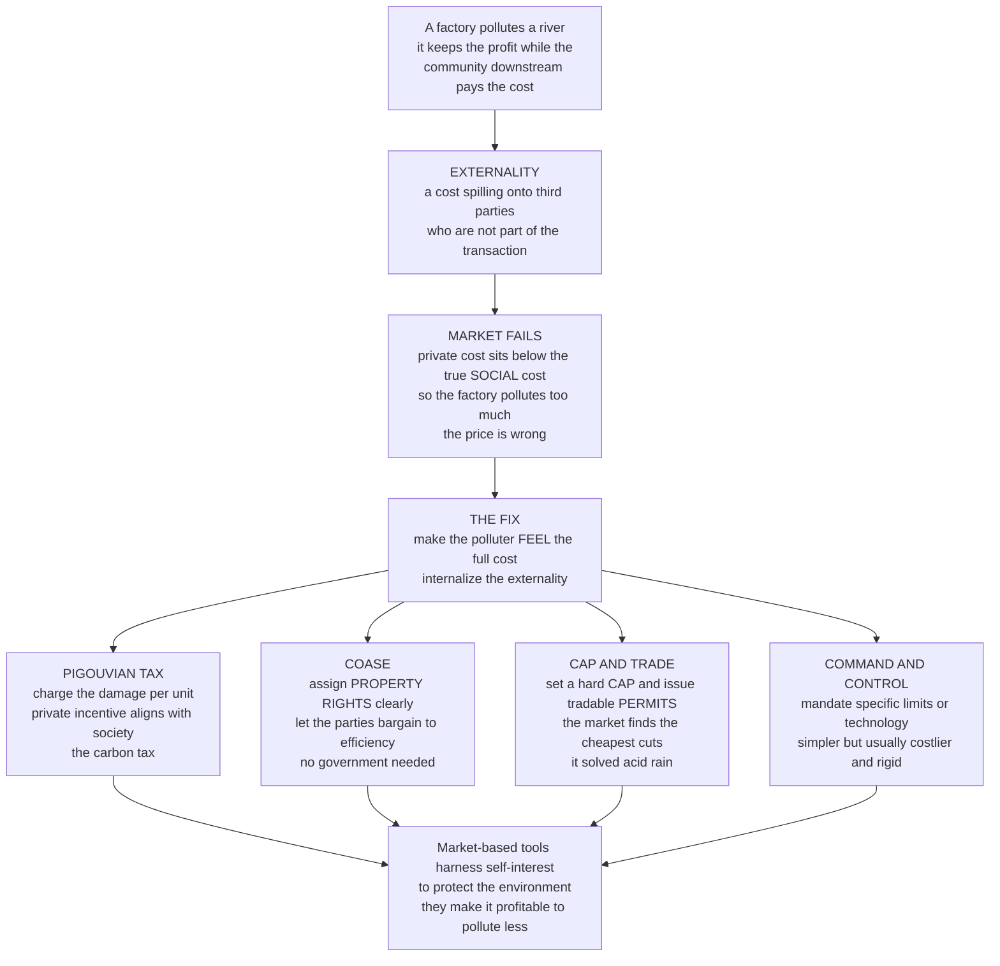

# 🏭 Externalities and Environmental Policy

> [!abstract] TL;DR
> An **externality** is a cost (or benefit) that spills onto third parties who were never part of the transaction — when a factory pollutes a river, it keeps the profit while the community downstream pays for the dirty water, a cost the factory never "sees" in its books. This is the single most important idea in environmental policy: because the polluter's **private** cost is lower than the true **social** cost, the market pollutes **too much** — the price is wrong. The entire game of environmental policy is fixing this by making the polluter *feel* the full cost — **internalizing the externality**. The instruments are the core debate: a **Pigouvian tax** charges the exact damage per unit so private incentives align with society (a carbon tax); **Coasean bargaining** says clear property rights plus cheap negotiation can reach efficiency with no government at all; **cap-and-trade** fixes a hard emissions cap and lets a permit market find the cheapest cuts (it famously solved acid rain); and blunt **command-and-control** simply mandates limits or technologies. The elegant insight economists prize is that market-based tools harness self-interest to protect the environment — they make it *profitable* to pollute less — which is decisive for climate change, the greatest market failure and collective-action problem of all. This is the **policy-instruments** view; it complements Microeconomics's theory of the [[Externalities_and_Pigouvian_Tax]] and Ecology's [[Environmental_Policy_and_Governance]].

---

## Intuition

**Analogy — the factory and the river.** Imagine a factory on a riverbank. It runs its machines, sells its product, and pockets the profit. But its waste flows downstream, and a town that had nothing to do with the sale now drinks dirty water, loses its fishery, and pays the doctor's bills. The factory captured the *benefit*; strangers bear the *cost* — and crucially, that cost never appears anywhere in the factory's accounts. It is invisible to the very decision that created it. That spilled-over, uncounted cost is an **externality**, and it is the economic heart of every environmental problem.

Here is why the market fails. A well-functioning market is supposed to make producers weigh *all* the costs of what they do against the value they create, so they produce exactly the right amount. But the factory only weighs the costs it actually pays — its **private cost** — while ignoring the harm downstream. So the true **social cost** (private cost *plus* the damage to the town) is higher than what the factory feels. Because the factory's cost is artificially low, it produces — and pollutes — **too much**. The price of its product is simply *wrong*: too cheap, because it silently omits the cost of the river.

Once you see that, the whole of environmental policy becomes one question: **how do we make the polluter feel the full cost?** Economists call this *internalizing the externality*, and there are several ways to do it — choosing among them is the central policy debate. The classic economist's answer, from **Pigou**, is a **tax**: charge the polluter exactly the damage they cause per unit, and suddenly their private incentive lines up with society's — they cut pollution to the efficient level all on their own (a **carbon tax** is the famous case). A rival, elegant answer from **Coase** says you may not need government at all: if you clearly assign **property rights** — who *owns* the river? — and bargaining is cheap, the parties will negotiate their own way to the efficient outcome. The modern favorite for pollution is **cap-and-trade**: the government sets a hard **cap** on total pollution, issues that many tradable **permits**, and lets the market trade them — guaranteeing the environmental target while letting firms find the cheapest way to hit it (this is how the U.S. solved acid rain, remarkably cheaply). The blunt, traditional approach is **command-and-control** regulation: just legally mandate specific limits or technologies — simpler, but usually more expensive and less flexible.

The deep beauty is that market-based tools — taxes and permits — **harness self-interest to protect the environment**. They make it *profitable* to pollute less. Understand externalities and the instruments that correct them, and you understand the economic core of environmental policy — and of the greatest collective-action problem of all, climate change.

---

## How It Works

### Core mechanics

1. **Name the spillover.** An externality is any cost or benefit of an activity that falls on third parties and is **not reflected in the market price**. *Negative* externalities (pollution, congestion, antibiotic resistance) impose uncompensated harm; *positive* externalities (vaccination, education, R&D) confer uncompensated benefits.
2. **Find the wedge between private and social.** For a negative externality, the **marginal social cost (MSC)** exceeds the **marginal private cost (MPC)** by the **marginal external cost (MEC)** — the per-unit damage. The market equilibrates where marginal benefit meets *private* cost, so it lands past the social optimum: **too much** of the polluting good. (For a positive externality the mirror holds: the market *under*-produces.)
3. **Measure the loss.** The gap between market output and the efficient output is **allocative inefficiency**; the wasted welfare is a **deadweight loss** — value destroyed because the price carried the wrong signal.
4. **Internalize it.** Every instrument does one thing: force the decision-maker to face the full social cost, so the private optimum becomes the social optimum. The instruments differ in *how* they do it and in who bears the cost.
5. **Pick the instrument.** The core policy choice: a **price** instrument (Pigouvian tax) fixes the cost per unit and lets quantity adjust; a **quantity** instrument (cap-and-trade) fixes total pollution and lets the price adjust; **Coasean** bargaining fixes property rights and lets private negotiation adjust both; **command-and-control** fixes the behavior directly. Under uncertainty about costs and benefits, price and quantity are *not* equivalent — this is Weitzman's "prices vs. quantities."

### The key result behind market-based tools

When many polluters have **different** marginal abatement costs, a **single uniform price** on pollution (a tax rate, or the equilibrium permit price under cap-and-trade) makes every firm cut until its marginal abatement cost equals that price. This **equalizes marginal abatement cost across all firms** — the mathematical condition for hitting any pollution target at **least total cost**. A uniform command-and-control mandate ("everyone cut the same amount") ignores that firms differ, forcing expensive abaters to over-abate and letting cheap ones off easy — reaching the *same* environmental result for *more* money.



---

## Key Concepts

### Secondary (intuitive grasp)

- **Externality** — a side-effect cost or benefit that lands on people outside the deal. Pollution is the classic *bad* one; a neighbor's vaccination that protects you is a *good* one.
- **Private vs social cost** — the polluter only pays *its own* cost, not the harm to others. Because part of the cost is hidden from it, it does *too much* of the harmful thing.
- **The price is wrong** — dirty products look cheap because the damage they cause is not in the price tag. Fix the price and behavior fixes itself.
- **Internalizing** — the whole goal: make the polluter *feel* the cost it inflicts, so it cleans up on its own.
- **Two big fixes** — *tax* pollution (make it cost money to pollute) or *cap* it (set a limit and let firms trade the right to pollute).

### Undergraduate (mechanisms and vocabulary)

- **The efficiency logic.** Negative externality ⇒ `MSC = MPC + MEC` ⇒ market output where `MB = MPC` exceeds the social optimum where `MB = MSC` ⇒ overproduction and a deadweight-loss triangle. Positive externality ⇒ `MSB = MPB + MEB` ⇒ underproduction; correct with a **subsidy**.
- **(1) Pigouvian taxes and subsidies.** A tax set equal to the marginal external damage at the optimum (`t = MEC`) shifts the private cost up to the social cost, moving output to the efficient level. For pollution the leading case is the **carbon tax**; setting the level requires the **social cost of carbon**, which hinges on discounting (see *Discounting_and_Valuing_the_Future*). A carbon tax can also raise revenue to cut other distortionary taxes — the **double dividend**.
- **(2) The Coase theorem.** With clearly assigned **property rights** and **low transaction costs**, private **bargaining** reaches the efficient outcome *regardless of who holds the rights* — markets, not government, do the correcting. Assignment affects *distribution*, not *efficiency*. It breaks down with high transaction costs, many parties, holdouts, and the **tragedy of the commons**.
- **(3) Cap-and-trade / tradable permits.** A **quantity** instrument: government sets the total **cap**, issues that many permits, and lets firms trade. The market discovers the **least-cost** allocation of abatement and *prices* the externality endogenously. Landmark cases: the U.S. **SO₂ acid-rain program** and the **EU Emissions Trading System (ETS)**.
- **(4) Command-and-control regulation.** Direct **standards** (emission limits), **technology mandates**, or **bans**. Simple and certain about the environmental outcome, but **static-inefficient** (ignores cost differences across firms) and **dynamically inefficient** (no reward for cutting below the standard, so weak innovation incentive).
- **(5) Information, liability, and voluntary tools.** Disclosure (emissions registries, eco-labels), **liability** rules that make polluters pay for damages after the fact, and voluntary programs — softer instruments that shift incentives without a hard price or cap.
- **Why economists lean market-based.** Cost-effectiveness (equalized marginal abatement cost) plus a *continuous* incentive to innovate cheaper abatement, since every ton cut saves tax or frees a sellable permit.

### Graduate (critique and theory)

- **Prices vs. quantities under uncertainty (Weitzman, 1974).** With unknown abatement costs, a **tax** fixes the price and lets quantity vary; a **cap** fixes quantity and lets price vary. Which is better depends on relative slopes: if the **marginal damage** curve is *steep* (a threshold/tipping point), a **quantity** cap is safer; if marginal damage is *flat* relative to steep marginal costs (as many argue for the *stock* pollutant CO₂), a **price** (tax) limits cost blowups better. Hybrids (price collars, banking/borrowing, safety valves) blend the two.
- **Coase's real argument.** "The Problem of Social Cost" (1960) is less a policy prescription than a critique: externalities are *reciprocal*, and with zero transaction costs the initial rights assignment is efficiency-irrelevant — so the *interesting* world is one of **positive transaction costs**, where institutions and rights allocation *do* matter. This reframes the whole field around comparative institutional cost.
- **Weak vs strong double dividend.** Recycling carbon revenue to cut distortionary taxes yields a *weak* dividend (cheaper than lump-sum rebates); the *strong* claim — that green taxes are net costless because they also fix the tax system — is contested by the **tax-interaction effect**, where a carbon price can *worsen* pre-existing labor-tax distortions.
- **Distribution and the just transition.** Carbon prices are often **regressive** (energy is a larger budget share for the poor). **Revenue recycling** — per-capita dividends, targeted transfers — can flip the incidence progressive. Instrument *choice* also allocates rents: **grandfathered** (free) permits hand windfalls to incumbents; **auctioned** permits raise public revenue like a tax.
- **The global commons and free-riding.** Climate is the ultimate **collective-action problem**: benefits of mitigation are global and non-excludable, so every nation is tempted to free-ride (see *Public_Goods_and_Collective_Provision*). Domestic carbon prices alone leak emissions abroad (**carbon leakage**), motivating **border carbon adjustments** and treaty design as a repeated game.
- **Dynamic efficiency and induced innovation.** The strongest long-run case for pricing is **directed technical change**: a durable, credible carbon price redirects R&D toward clean technology, a channel command-and-control standards capture only clumsily.
- **The second-best caveat.** With multiple simultaneous distortions, a *single* Pigouvian correction need not raise welfare; optimal instrument design must account for the whole distorted system.

---

## Python Demo

```python
# Externalities & environmental policy, made concrete in two panels of theory
# plus two of instrument choice:
#   (a) EXTERNALITY + PIGOUVIAN CORRECTION -- the free market over-produces a
#       polluting good because private cost < social cost; the deadweight loss;
#       a Pigouvian tax = marginal external damage moves output to the optimum.
#   (b) LEAST-COST ABATEMENT -- several firms with DIFFERENT marginal abatement
#       cost (MAC) curves must jointly cut a fixed amount of pollution. A uniform
#       CARBON PRICE (a tax, or the equilibrium permit price under cap-and-trade)
#       equalizes MAC across firms and hits the target at LEAST total cost --
#       far cheaper than a uniform command-and-control mandate. Panels show the
#       cost comparison and the permit-market trades.
# Pure numpy + matplotlib.

import numpy as np
import matplotlib.pyplot as plt

fig, ax = plt.subplots(2, 2, figsize=(13, 9))

# ----------------------------------------------------------------------
# (a) EXTERNALITY and PIGOUVIAN CORRECTION
#     Inverse demand = marginal benefit:  MB  = a - b*Q
#     Private marginal cost:               MPC = c + d*Q
#     Marginal external cost (pollution):  MEC = constant
#     Social marginal cost:                MSC = MPC + MEC
#     Free market  : MB = MPC -> Q_market  (TOO MUCH)
#     Social optimum: MB = MSC -> Q_social (efficient)
#     Pigouvian tax = MEC lifts private cost to MSC, shifting output to Q_social.
# ----------------------------------------------------------------------
Q = np.linspace(0, 100, 500)
a, b = 100.0, 0.8      # marginal benefit (demand)
c, d = 10.0, 0.5       # private marginal cost (supply)
MEC  = 24.0            # per-unit external damage (the pollution harm)

MB, MPC = a - b * Q, c + d * Q
MSC = MPC + MEC
Q_mkt = (a - c) / (b + d)            # MB = MPC
Q_soc = (a - c - MEC) / (b + d)      # MB = MSC

ax[0, 0].plot(Q, MB,  lw=2, label="Marginal benefit (demand)")
ax[0, 0].plot(Q, MPC, lw=2, label="Private marginal cost (MPC)")
ax[0, 0].plot(Q, MSC, lw=2, ls="--", label="Social marginal cost (MPC + harm)")
ax[0, 0].axvline(Q_mkt, color="crimson", ls=":", lw=1.4)
ax[0, 0].axvline(Q_soc, color="green",   ls=":", lw=1.4)
# deadweight loss from over-production (Q_soc -> Q_mkt, where MSC exceeds MB)
Qdw = np.linspace(Q_soc, Q_mkt, 60)
ax[0, 0].fill_between(Qdw, a - b * Qdw, (c + d * Qdw) + MEC,
                      color="crimson", alpha=0.25, label="Deadweight loss")
ax[0, 0].annotate("free market\nover-produces",
                  xy=(Q_mkt, a - b * Q_mkt),
                  xytext=(Q_mkt + 2, a - b * Q_mkt + 22), fontsize=8,
                  arrowprops=dict(arrowstyle="->"))
ax[0, 0].annotate("Pigouvian tax = harm\nmoves output here",
                  xy=(Q_soc, a - b * Q_soc),
                  xytext=(Q_soc - 34, a - b * Q_soc + 12), fontsize=8,
                  arrowprops=dict(arrowstyle="->"))
ax[0, 0].set_xlabel("Quantity of the polluting good")
ax[0, 0].set_ylabel("Price / marginal value")
ax[0, 0].set_title("(a) Externality + Pigouvian correction")
ax[0, 0].legend(fontsize=7.5, loc="upper right")
ax[0, 0].set_ylim(0, 110); ax[0, 0].grid(alpha=0.3)

# ----------------------------------------------------------------------
# (b)-(d) LEAST-COST ABATEMENT across firms with different MAC slopes.
#     Firm i has MAC_i(a) = k_i * a  (steeper k = costlier to abate).
#     Total required abatement A_total is shared across the firms.
#
#     Uniform carbon PRICE p*: each firm abates until MAC_i = p*, so a_i = p*/k_i.
#       Sum a_i = A_total  =>  p* = A_total / sum(1/k_i).  MAC equalized at p*.
#       Firm cost = integral_0^{a_i} k_i * a da = 0.5 * k_i * a_i^2.
#     Uniform MANDATE: every firm cuts A_total / N regardless of its cost.
# ----------------------------------------------------------------------
k = np.array([0.5, 1.0, 2.0, 4.0])     # 4 firms: cheap -> expensive abaters
names = ["Firm A\n(cheap)", "Firm B", "Firm C", "Firm D\n(costly)"]
N = len(k)
A_total = 40.0

# market-based (tax OR cap-and-trade equilibrium)
p_star = A_total / np.sum(1.0 / k)     # equilibrium carbon / permit price
a_price = p_star / k                    # abatement per firm; MAC equalized at p_star
cost_price = 0.5 * k * a_price**2
# uniform command-and-control mandate
a_mand = np.full(N, A_total / N)
cost_mand = 0.5 * k * a_mand**2

# (b) MAC curves + the single price that equalizes marginal abatement cost
av = np.linspace(0, 24, 200)
for ki, nm in zip(k, ["A", "B", "C", "D"]):
    ax[0, 1].plot(av, ki * av, lw=1.8, label=f"MAC {nm} (k={ki})")
ax[0, 1].axhline(p_star, color="black", ls="--", lw=1.6,
                 label=f"carbon price p* = {p_star:.1f}")
ax[0, 1].axvline(A_total / N, color="grey", ls=":",
                 label=f"uniform mandate = {A_total/N:.0f} each")
for ai in a_price:
    ax[0, 1].scatter([ai], [p_star], color="black", zorder=5)
ax[0, 1].set_xlabel("Abatement by a firm (tons cut)")
ax[0, 1].set_ylabel("Marginal abatement cost")
ax[0, 1].set_title("(b) One price equalizes MAC across firms")
ax[0, 1].legend(fontsize=7.5, loc="upper left"); ax[0, 1].grid(alpha=0.3)

# (c) total abatement cost: market-based vs uniform mandate
tot_price, tot_mand = cost_price.sum(), cost_mand.sum()
bars = ax[1, 0].bar(["Market-based\n(tax / cap-and-trade)", "Uniform\nmandate"],
                    [tot_price, tot_mand],
                    color=["#2e86de", "#c0392b"], alpha=0.85)
for bar, v in zip(bars, [tot_price, tot_mand]):
    ax[1, 0].text(bar.get_x() + bar.get_width()/2, v + 4, f"{v:.0f}",
                  ha="center", fontsize=10)
ax[1, 0].set_ylabel("Total cost to hit the SAME target")
saving = 100 * (1 - tot_price / tot_mand)
ax[1, 0].set_title(f"(c) Same target, {saving:.0f}% cheaper via the market")
ax[1, 0].grid(alpha=0.3, axis="y")

# (d) permit-market trades: allocate each firm the mandate as free permits,
#     then let them trade. permits_traded = mandate - actual abatement.
#     abate MORE than mandate  -> SELL permits (cheap abaters).
#     abate LESS than mandate  -> BUY  permits (costly abaters).
permits = a_mand - a_price                         # + = sell, - = buy
colors = ["#27ae60" if x > 0 else "#e74c3c" for x in permits]
ax[1, 1].bar(names, permits, color=colors, alpha=0.85)
ax[1, 1].axhline(0, color="black", lw=1)
ax[1, 1].set_ylabel("Permits sold (+)  /  bought (-)")
ax[1, 1].set_title("(d) Permit market: cheap abaters sell, costly abaters buy")
ax[1, 1].grid(alpha=0.3, axis="y")

plt.tight_layout()
plt.savefig("externalities_and_environmental_policy.png", dpi=120)
plt.show()

# --- Numeric takeaways -------------------------------------------------
print(f"(a) Free market Q = {Q_mkt:.1f} vs social optimum Q = {Q_soc:.1f}; "
      f"a Pigouvian tax of {MEC:.0f}/unit closes the gap and erases the DWL.")
print(f"(b) Equilibrium carbon price p* = {p_star:.2f}; every firm's MAC = p* "
      f"(abatement: {np.round(a_price,1)}).")
print(f"(c) Total cost -- market-based = {tot_price:.0f} vs uniform mandate = "
      f"{tot_mand:.0f}  ({saving:.0f}% cheaper for the SAME emissions cut).")
print(f"(d) Net permits traded balances to zero: {permits.sum():.2f} "
      f"(cheap firms sell, costly firms buy).")
```

Panel **(a)** is the externality theorem made visible: because the polluter's private cost curve sits *below* the true social cost, the free market settles where marginal benefit meets *private* cost and over-produces; the shaded triangle is the deadweight loss, and a Pigouvian tax exactly equal to the marginal external damage slides output to the social optimum. Panels **(b)–(d)** are the case for market-based tools: four firms differ in how expensive abatement is, and a *single* carbon price makes each abate until its marginal cost equals that price — **equalizing marginal abatement cost**, the least-cost condition. The result (panel c) hits the *same* environmental target for roughly 40 percent less than forcing every firm to cut the same amount, and panel (d) shows the mechanism under cap-and-trade: cheap abaters cut deeply and *sell* permits, costly abaters buy them and cut less — the market quietly reshuffles the work to whoever can do it cheapest.

---

## Real-World Applications

> **Example — The U.S. Acid Rain Program (cap-and-trade's landmark win).** Title IV of the 1990 Clean Air Act capped SO₂ emissions from power plants and issued tradable allowances. Utilities that could scrub or switch to low-sulfur coal cheaply cut deeply and sold allowances; expensive abaters bought them — exactly panel (d). Emissions fell faster than required at a fraction of the cost engineers had projected under command-and-control, becoming the textbook proof that a price on pollution finds least-cost abatement.

> **Example — Carbon taxes (Pigou in practice).** Sweden's carbon tax (introduced 1991, now among the world's highest) and British Columbia's revenue-neutral carbon tax (2008) charge emitters per ton of CO₂ — a direct Pigouvian correction. BC's design recycled the revenue into income- and business-tax cuts (the double-dividend idea) and paired it with per-capita rebates to blunt regressivity, illustrating that *how the revenue is used* decides the distributional politics.

> **Example — The EU Emissions Trading System (the world's largest carbon market).** The EU ETS caps emissions across power and industry and lets ~10,000 installations trade allowances. Early over-allocation crashed the price (a design lesson), later fixed by a Market Stability Reserve that tightens supply — a live demonstration of *quantity* instruments and the price volatility that motivates hybrid price-floor designs.

> **Example — Coasean solutions and their limits.** Water-quality trading, wetland mitigation banking, and conservation easements assign tradable property rights over environmental services and let parties bargain — Coase in action where parties are few and rights are clear. But for diffuse, many-party problems like global CO₂, transaction costs are prohibitive, which is precisely why climate needs a tax or a cap rather than pure bargaining.

> **Example — Command-and-control where it fits.** Bans on leaded gasoline and CFCs (Montreal Protocol), catalytic-converter mandates, and appliance efficiency standards are prescriptive rules. For a small set of substitutable technologies with a clear "right answer," a mandate can be simpler and more certain than a price — the pragmatic case for prescriptive tools.

---

## Common Pitfalls

- **Confusing the price and quantity instruments as identical.** A tax fixes the *cost per ton* and lets emissions float; a cap fixes *emissions* and lets the price float. Under cost uncertainty they diverge sharply (Weitzman): the choice should turn on whether you fear a runaway *price* or a runaway *quantity*. Treating them as interchangeable ignores the central design question.
- **Setting the Pigouvian tax at the wrong margin.** The efficient tax equals marginal external damage *at the optimum*, not average damage or "whatever raises enough revenue." For carbon, that number is the social cost of carbon, which is dominated by the discount rate — get the discounting wrong and the whole tax is wrong.
- **Assuming Coasean bargaining always works.** Coase requires clear property rights *and* low transaction costs. With many diffuse parties, holdouts, and free-riders — the tragedy of the commons — private bargaining collapses, and invoking Coase becomes an excuse for inaction on exactly the problems (like climate) that most need policy.
- **Grandfathering permits and calling it efficient.** Cap-and-trade is cost-effective regardless of allocation, but giving permits away *free* to incumbents (grandfathering) hands them windfall rents and forgoes public revenue. Auctioning captures the same efficiency while funding rebates or tax cuts — the distributional choice is separate from, and often more contested than, the efficiency one.
- **Ignoring the regressivity of carbon pricing.** Energy is a bigger share of poor households' budgets, so a naive carbon price is regressive and politically fragile (see the *gilets jaunes*). Revenue recycling — dividends or targeted transfers — can make the net effect progressive, but only if it is designed in from the start.
- **Treating command-and-control as "free certainty."** Mandates feel decisive, but by forcing uniform cuts they ignore cost differences across firms (static inefficiency) and reward no one for beating the standard (weak innovation incentive) — usually the same environmental result for substantially more money.
- **Forgetting positive externalities.** The reflex is "externality means pollution means tax." But vaccination, education, and R&D are *under*-produced positive externalities that call for *subsidy*, not restriction — the same divergence between private and social value, running the other way.

---

## Related Concepts

Cross-vault anchors (Glob-verified files elsewhere in the vault):

- [[Externalities_and_Pigouvian_Tax]] — the Microeconomics *theory* of the externality and its corrective tax; this note is its policy-instruments counterpart, comparing that tax against permits, bargaining, and mandates. Distinct basename, linked to deliberately.
- [[Coase_Theorem]] — the property-rights / bargaining alternative to Pigouvian correction, and its transaction-cost limits, developed formally in Microeconomics.
- [[Public_Goods]] — non-rival, non-excludable goods and the free-rider problem that make the global climate commons resist private solutions.
- [[Market_Failures]] — the umbrella taxonomy in which externalities sit as one of the four canonical efficiency failures.
- [[Environmental_Policy_and_Governance]] — Ecology's governance-and-institutions treatment of environmental protection; this note supplies the economic *instrument* logic beneath it. Distinct basename, linked to deliberately.
- [[Energy_Policy_and_Decarbonization]] — where carbon pricing, cap-and-trade, and standards are applied to the energy transition and net-zero targets.
- [[Emissions_and_the_Climate_Impact_of_Energy]] — the physical externality (greenhouse emissions) that carbon pricing is designed to internalize.
- [[Ecological_Economics_and_Natural_Capital]] — valuing the natural capital and ecosystem services that externalities silently degrade.
- [[Price_of_Anarchy]] — the game-theoretic measure of how far self-interested behavior falls short of the social optimum, the abstract sibling of the externality wedge.

Within this vault, this note is the instrument-choice hub of the *Economics of the Public Sector* section and connects in prose to its siblings: *Rationales_for_Government_Intervention* (externalities as the leading efficiency warrant for acting), *Public_Goods_and_Collective_Provision* (the free-rider structure of the global climate commons), *Regulation_and_Regulatory_Economics* (the command-and-control end of the spectrum and its cost-effectiveness critique), *Discounting_and_Valuing_the_Future* (which fixes the social cost of carbon that sets the Pigouvian tax level), and *Environmental_and_Climate_Policy* (the applied policy domain where these instruments are chosen and combined).

---

## Review Questions

1. **(Secondary)** In your own words, explain why a factory that pollutes a river ends up polluting "too much" from society's point of view. What does it mean to "internalize the externality," and give two different ways a government could make the factory feel the cost it inflicts.
2. **(Undergraduate)** Four power plants must jointly cut 40 tons of emissions, but they differ in how expensive abatement is. Explain why a single carbon price (a tax, or the equilibrium permit price under cap-and-trade) achieves this at lower total cost than ordering each plant to cut 10 tons. What condition on marginal abatement costs does the price achieve, and why is that the least-cost condition?
3. **(Graduate)** You must design climate policy for a stock pollutant under deep uncertainty about abatement costs. Using Weitzman's "prices vs. quantities," argue for either a carbon tax or a cap-and-trade system, and explain how a hybrid (price floor/ceiling) hedges the weakness of your choice. Then address two second-order design questions: whether to auction or grandfather permits, and how to prevent the policy from being regressive.

---

## Sources

- Arthur C. Pigou, *The Economics of Welfare* (Macmillan, 1920) — the founding case for taxing activities whose private cost falls short of their social cost.
- Ronald H. Coase, "The Problem of Social Cost," *Journal of Law and Economics* 3 (1960) — property rights, bargaining, and transaction costs as the alternative frame for externalities.
- Robert N. Stavins, "Experience with Market-Based Environmental Policy Instruments," in *Handbook of Environmental Economics*, Vol. 1 (Elsevier, 2003) — the empirical record of taxes and tradable permits.
- Martin L. Weitzman, "Prices vs. Quantities," *Review of Economic Studies* 41(4) (1974) — the canonical analysis of instrument choice under uncertainty.
- Nicholas Stern, *The Economics of Climate Change: The Stern Review* (Cambridge University Press, 2007) — climate change framed as "the greatest market failure the world has seen."

---

#public-policy #externalities #carbon-tax #cap-and-trade #environmental-policy
