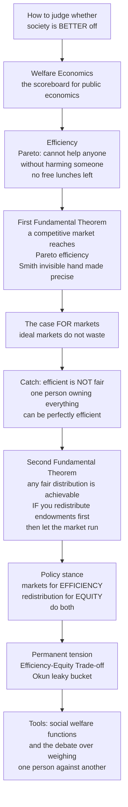

# ⚖️ Public Economics and Welfare

> [!abstract] TL;DR
> **Public economics** is the economics of the public sector — how government affects the economy through **spending, taxation, and regulation**, and how to evaluate and design those interventions. Its normative foundation is **welfare economics**: the framework that scores whether a policy makes society *better off*. The scoring rests on **Pareto efficiency** (an outcome where no one can be made better off without making someone worse off — all mutually beneficial trades exhausted) and on two profound results. The **First Fundamental Theorem** says an idealized competitive market reaches a Pareto-efficient outcome — Adam Smith's invisible hand made mathematically exact, the deep case *for* markets. The crucial catch: **efficient is not fair** — a world where one person owns everything can be perfectly Pareto-efficient. The **Second Fundamental Theorem** offers the resolution: *any* fair distribution can be reached as a market outcome if you first redistribute the initial endowments, which grounds the modern stance — **use markets for efficiency, taxes-and-transfers for equity**. But redistribution leaks (Okun's **leaky bucket**), so the permanent **efficiency–equity trade-off**, together with the **social welfare functions** that weigh one person's gains against another's, forms the value-laden heart of every public-sector decision.

## Intuition

**Analogy — the scoreboard for society.** Imagine you are the referee for the whole economy and someone proposes a change: a tax cut, a new welfare program, a deregulation. Your job is to rule whether society is now *better off*. But better by whose count? You need a scoreboard. **Welfare economics is that scoreboard** — the branch of economics that tries to answer, rigorously, whether one arrangement of society beats another.

The first line the scoreboard draws is **efficiency**, made precise by Vilfredo Pareto: an outcome is **Pareto-efficient** if you cannot make anyone better off without making someone else worse off — every free lunch has already been eaten, no mutually beneficial trade is left on the table. From this fall two deep results. The **First Theorem** says a competitive free market, left alone, automatically lands on an efficient point — the invisible hand, formalized; ideal markets do not waste. That is the powerful case *for* markets. But here is the sting: **efficient does not mean fair**. A world where one billionaire owns everything and everyone else starves can be perfectly Pareto-efficient — you cannot feed the poor without "harming" the rich by taking from them. Efficiency is *necessary but wildly insufficient*.

The **Second Theorem** rescues us: *any* fair distribution you choose can be reached as a market outcome — **if** you first hand out the initial resources the way you want, then let the market run. This is the intellectual backbone of modern policy: **use markets to grow the pie efficiently, use redistribution to slice it fairly — do both.** The permanent tension is that redistribution is a **leaky bucket** (Okun): carrying resources from rich to poor spills some to disincentives and administration, so a fairer split can shrink the pie. Welfare economics hands us the tools to reason about that leak — **social welfare functions** that add up everyone's wellbeing, and the deep, unresolved argument over *how* to weigh one person's gain against another's. Understanding this apparatus is understanding the conceptual scoreboard behind every claim that a policy "makes society better off."

---

## How It Works

### Core mechanics

Public economics organizes the study of government around four questions (Musgrave; Stiglitz & Rosengard): **When** should government intervene (efficiency and equity rationales)? **How** (which instruments — taxes, spending, regulation)? **What** are the effects? And **why** does it actually do what it does (political economy)? Welfare economics answers the *when* and supplies the yardstick for the rest.

1. **Positive vs normative.** *Positive* economics describes what *is* ("a carbon tax raises gasoline prices by X"). *Normative* economics judges what *ought* to be ("society should adopt it"). Welfare economics is the disciplined half of the normative side — it makes value judgments *explicit* rather than smuggling them in.

2. **Pareto efficiency and Pareto improvements.** A change is a **Pareto improvement** if it helps at least one person and harms no one. An allocation is **Pareto-efficient** when no such improvement remains. The catch that limits the criterion: almost every real policy creates *winners and losers*, so the Pareto criterion — which refuses to rank any change that hurts someone — is **incomplete**. It cannot, by itself, decide most policy questions.

3. **The compensation principle (Kaldor–Hicks).** To rank win-lose policies we relax Pareto to *potential* Pareto: a change is **Kaldor–Hicks efficient** if the winners gain enough that they *could* fully compensate the losers and still come out ahead — whether or not they actually do. Sum the willingness-to-pay: if net benefits are positive, do it. This is the theoretical engine of **cost–benefit analysis**.

4. **The First Fundamental Theorem.** Under ideal conditions — many price-taking buyers and sellers, complete markets, no externalities, no public goods, no asymmetric information — every competitive equilibrium is Pareto-efficient. Markets, left alone, exhaust the gains from trade. When its assumptions fail you get **market failures**, which are precisely the efficiency-based *rationales* for government to step in.

5. **The Second Fundamental Theorem.** *Any* Pareto-efficient allocation can be sustained as a competitive equilibrium given the right **lump-sum** redistribution of initial endowments. This separates **efficiency from distribution**: pick the fair distribution you want, redistribute endowments to match, then let markets do the efficient allocating. The practical caveat is fatal in its purity — true lump-sum transfers (independent of behavior) barely exist, so *real* redistribution uses income and consumption taxes that **distort** incentives. We live in a **second-best** world.

6. **Efficiency is not equity.** Total **surplus** (consumer plus producer surplus) measures the *size* of the pie — an efficiency concept, silent about who gets the slices. Two allocations can have identical total surplus yet wildly different fairness. Choosing among efficient points requires a **distributional value judgment**.

7. **Social welfare functions (SWFs).** A SWF aggregates individual utilities $u_i$ into one social ranking $W$. The **utilitarian** SWF sums utilities, $W=\sum_i u_i$ (Bentham). The **Rawlsian/maximin** SWF scores society by its worst-off member, $W=\min_i u_i$. **Weighted / inequality-averse** SWFs sit between, e.g. $W=\sum_i u_i^{1-\rho}/(1-\rho)$ with aversion $\rho>0$. On the **utility possibility frontier** (the efficient boundary of everyone's attainable utilities), each SWF picks a *different* "bliss point" — proving that ranking efficient outcomes is inseparable from a stance on distribution. Underneath lies the **interpersonal comparison problem** (is my utility even commensurable with yours?) and **Arrow's impossibility theorem** (no aggregation rule satisfies all reasonable fairness axioms at once).

8. **The efficiency–equity trade-off.** Okun's **leaky bucket**: moving \$1 from rich to poor delivers less than \$1 because taxes blunt incentives and administration costs money — the **deadweight loss** of intervention. So a more equal distribution can mean a smaller total. How much leak a society will tolerate for how much equality is *the* recurring value judgment of public finance, and it foreshadows the section's coming topics: externalities, public goods, taxation, and regulation.

### Flow / Architecture



---

## Key Concepts

### Secondary Level

- **Efficiency means no waste.** An outcome is Pareto-efficient when you cannot make someone better off without making someone else worse off — every win-win trade has already happened.
- **The invisible hand, made precise.** Under ideal conditions a free market reaches an efficient outcome on its own. That is the strongest case for letting markets work.
- **Efficient is not the same as fair.** A world where one person owns everything and everyone else starves can be perfectly efficient. Efficiency is necessary but not enough.
- **The leaky bucket.** When government carries money from rich to poor, some spills along the way (through lost incentives and admin costs). Fairness can cost some total wealth — the core trade-off of public policy.

### Undergraduate Level

- **Consumer, producer, and total surplus.** Total surplus measures the *size* of the pie (efficiency); it says nothing about how the slices are split (equity). See [[Consumer_and_Producer_Surplus]].
- **Two fundamental theorems.** *First:* a competitive equilibrium is Pareto-efficient (assumptions: price-taking, complete markets, no [[Market_Failures]]). *Second:* any efficient allocation is reachable as an equilibrium after suitable lump-sum redistribution — separating efficiency from distribution.
- **Kaldor–Hicks and cost–benefit analysis.** A policy passes if winners *could* compensate losers and still gain (potential Pareto). Summing willingness-to-pay is the logic behind government cost–benefit analysis — but potential compensation is not actual compensation.
- **Utilitarian vs Rawlsian SWFs.** Utilitarianism maximizes the *sum* of utilities; Rawls's maximin maximizes the *worst-off*. On the utility possibility frontier they pick different points, so distribution requires a value judgment. Connects to [[Distributive_Justice_and_Inequality]].
- **Deadweight loss.** The efficiency cost of a tax or distortion — the surplus destroyed, not merely transferred. It is the "size of the leak" in redistribution. See [[Tax_Policy]].
- **Positive vs normative.** Welfare economics is the disciplined normative layer: it makes value judgments explicit instead of hiding them.

### Graduate Level

- **Lump-sum infeasibility and the second-best.** Because non-distorting lump-sum transfers cannot be implemented (they would have to depend on unobservable ability, not behavior), the Second Theorem's clean separation breaks down. Real redistribution runs through **optimal income taxation** (Mirrlees), trading equity gains against efficiency losses — the formal leaky bucket.
- **Bergson–Samuelson SWF and distributional weights.** A social welfare function $W(u_1,\dots,u_n)$ ranks allocations; its curvature encodes inequality aversion, and its gradient defines **distributional weights** used to reweight benefits by whose they are in modern cost–benefit analysis.
- **Arrow's impossibility theorem.** No social choice rule can simultaneously satisfy unrestricted domain, Pareto, independence of irrelevant alternatives, and non-dictatorship — a fundamental limit on aggregating preferences into a social ranking. See [[Price_of_Anarchy]] for a related gap between individual choice and social optimum.
- **Interpersonal comparisons and the capability turn.** Utilitarian summation presumes cardinal, comparable utilities. Sen critiques both utility and primary-goods metrics, reframing welfare as **capabilities** — real freedoms to be and do.
- **Atkinson inequality index and social welfare.** The Atkinson index derives inequality directly from an inequality-averse SWF, letting a chosen aversion parameter translate a distribution into an "equally distributed equivalent" income.
- **First-best vs constrained-efficient.** In economies with informational or incentive constraints, the relevant benchmark is not first-best Pareto efficiency but **constrained (second-best) efficiency**, which reshapes every policy prescription.

---

## Python Demo

```python
# Welfare economics, made visual:
#   (a) the utility possibility frontier (UPF) is the EFFICIENT boundary --
#       every point on it is Pareto-efficient, yet three different social
#       welfare functions each crown a DIFFERENT point as "best," proving that
#       choosing among efficient outcomes is a value judgment about distribution.
#   (b) the LEAKY BUCKET: as redistribution intensifies, equality rises but
#       total output falls (resources leak to disincentives) -- the
#       efficiency-equity trade-off, with utilitarian vs Rawlsian optima marked.
import numpy as np
import matplotlib.pyplot as plt

# ---------- (a) Utility possibility frontier + social welfare functions ----------
Umax = 10.0
uA = np.linspace(0.01, Umax - 0.01, 400)
uB = Umax * (1.0 - (uA / Umax) ** 2) ** 0.5   # concave efficient frontier (quarter ellipse)

# Three social welfare functions evaluated along the frontier:
W_util  = uA + uB                              # Utilitarian: sum of utilities
W_rawls = np.minimum(uA, uB)                   # Rawlsian: welfare of the worst-off
W_wtd   = 0.75 * uA + 0.25 * uB                # Weighted utilitarian (favours person A)

def best_point(W):
    i = int(np.argmax(W))
    return uA[i], uB[i]

pu = best_point(W_util)    # tangency where frontier slope = -1 (symmetric point)
pr = best_point(W_rawls)   # on the 45-degree line: uA = uB
pw = best_point(W_wtd)     # skewed toward person A

fig, (ax1, ax2) = plt.subplots(1, 2, figsize=(13, 5.4))

ax1.plot(uA, uB, color="#1f77b4", lw=2.5, label="Utility possibility frontier\n(all points Pareto-efficient)")
ax1.plot([0, Umax], [0, Umax], "--", color="gray", lw=1, label="equal-utility line")
for (x, y), name, col in [(pu, "Utilitarian (sum)", "#d62728"),
                          (pr, "Rawlsian (maximin)", "#2ca02c"),
                          (pw, "Weighted (favours A)", "#9467bd")]:
    ax1.scatter([x], [y], s=120, color=col, zorder=5, edgecolor="k")
    ax1.annotate(name, (x, y), textcoords="offset points", xytext=(8, 8), fontsize=9, color=col)
ax1.set_xlabel("Utility of person A")
ax1.set_ylabel("Utility of person B")
ax1.set_title("Same efficient frontier, different 'best' point\n=> ranking efficient outcomes needs a value judgment")
ax1.legend(loc="lower left", fontsize=8)
ax1.set_xlim(0, Umax); ax1.set_ylim(0, Umax)

# ---------- (b) The leaky bucket: efficiency-equity trade-off ----------
t = np.linspace(0.0, 1.0, 400)          # redistribution intensity, 0 = none, 1 = maximal
yr0, yp0 = 100.0, 20.0                    # initial rich / poor incomes
tax        = t * (yr0 - 60.0)            # amount taxed from the rich (up to equalizing)
leak_rate  = 0.6 * t                      # marginal leak grows with intensity (disincentives)
delivered  = tax * (1.0 - leak_rate)      # what actually reaches the poor
rich  = yr0 - tax
poor  = yp0 + delivered
total = rich + poor                       # society's total output (falls as leak grows)
equality = 1.0 - np.abs(rich - poor) / (rich + poor)   # 0 = max gap, 1 = perfectly equal

# Where each philosophy stops redistributing:
W_util_log = np.log(rich) + np.log(poor)  # utilitarian with diminishing marginal utility
i_util  = int(np.argmax(W_util_log))
i_rawls = int(np.argmax(poor))            # Rawlsian: maximize the poor person's income

ax2.plot(equality, total, color="#ff7f0e", lw=2.5)
ax2.scatter([equality[0]], [total[0]], s=90, color="#d62728", zorder=5, edgecolor="k",
            label="No redistribution (max output, max inequality)")
ax2.scatter([equality[i_util]], [total[i_util]], s=110, color="#8c564b", zorder=6, edgecolor="k",
            label="Utilitarian optimum (diminishing MU)")
ax2.scatter([equality[i_rawls]], [total[i_rawls]], s=110, color="#2ca02c", zorder=6, edgecolor="k",
            label="Rawlsian optimum (max the worst-off)")
ax2.set_xlabel("Equality  (higher = more equal)")
ax2.set_ylabel("Total output  (efficiency)")
ax2.set_title("Okun's leaky bucket: buying equality costs output\n=> the efficiency-equity trade-off")
ax2.legend(loc="lower left", fontsize=8)

plt.tight_layout()
plt.savefig("public_economics_and_welfare.png", dpi=130)
print("Frontier bliss points (uA, uB):")
print(f"  Utilitarian : {pu[0]:.2f}, {pu[1]:.2f}")
print(f"  Rawlsian    : {pr[0]:.2f}, {pr[1]:.2f}")
print(f"  Weighted    : {pw[0]:.2f}, {pw[1]:.2f}")
print(f"Leaky bucket: utilitarian stops at t={t[i_util]:.2f}, Rawlsian at t={t[i_rawls]:.2f}")
```

Running it shows two lessons at once: on the frontier, the utilitarian, Rawlsian, and weighted rules each pick a *different* efficient point (efficiency alone cannot choose); and on the leaky-bucket curve, pushing for more equality steadily lowers total output, with a utilitarian and a Rawlsian halting redistribution at different intensities — the value judgment made numerical.

---

## Real-World Applications

> **Cost–benefit analysis in government (OMB Circular A-4, EPA, UK Green Book).** Regulatory agencies formally apply the Kaldor–Hicks/potential-Pareto criterion: monetize all benefits and costs, and approve a rule if aggregate net benefits are positive. Distributional weights and equity screens are the ongoing attempt to bolt fairness onto a fundamentally efficiency-based test.

> **Carbon taxes and Pigouvian pricing.** A carbon tax is the First Theorem applied in reverse: a negative externality means the free-market outcome is *not* efficient, so a corrective price restores the efficient quantity. The revenue's use (rebates to households) is a Second-Theorem, equity-side choice layered on top.

> **The Earned Income Tax Credit (EITC) and welfare design.** Every transfer program is a live experiment in the leaky bucket: designers trade off the equity value of aid against the efficiency cost of the phase-out's implicit marginal tax on work. Optimal-tax theory (Mirrlees) is the mathematics of choosing that balance.

> **Top marginal income tax rates.** The debate over the revenue-maximizing top rate is the efficiency–equity trade-off in one number: how much do high earners reduce effort or shift income (the leak) versus how much a society values redistribution (the SWF's inequality aversion).

> **Health resource allocation (QALYs, NICE).** Bodies like the UK's NICE rank treatments by cost per quality-adjusted life-year — an explicit social welfare function over health, forced into the open because a fixed budget makes the interpersonal-comparison problem unavoidable.

---

## Common Pitfalls

- **Treating "efficient" as "good."** The single most common error. Pareto efficiency is silent about fairness; a grotesquely unequal allocation can be fully efficient. Efficiency is necessary, never sufficient — always ask *whose* welfare and *what* distribution.
- **Assuming markets are automatically efficient.** The First Theorem holds *only* under its assumptions (no externalities, public goods, market power, or information asymmetries). Where those fail — i.e., in most interesting cases — you get [[Market_Failures]], and the invisible hand no longer delivers efficiency.
- **Taking the Second Theorem literally.** Its clean "redistribute endowments, then let markets run" prescription relies on **lump-sum** transfers that do not distort behavior. Real taxes distort, so we live in a second-best world where redistribution genuinely costs efficiency. Quoting the theorem as if costless redistribution were available is a classic sleight of hand.
- **Confusing potential with actual compensation.** Kaldor–Hicks asks only whether winners *could* compensate losers. If they never do, the losers are simply worse off. A string of "efficient" reforms can leave the same group repeatedly harmed while the ledger looks positive.
- **Treating the utilitarian sum as objective.** Adding utilities presumes they are cardinal and interpersonally comparable, and it is indifferent to distribution (a dollar to a billionaire counts the same as a dollar to a pauper). Arrow's impossibility theorem shows no aggregation rule escapes all such value-laden choices.
- **Mis-sizing the leak.** Ideologues at both poles err: assuming redistribution is costless (no leak) *or* that it always destroys more than it delivers (all leak). The honest answer is empirical and program-specific — measure the bucket before ruling on it.

---

## Related Concepts

Cross-vault links (verified to exist):

- [[Consumer_and_Producer_Surplus]] — the surplus and deadweight-loss apparatus that operationalizes "efficiency" and measures the size of the leak.
- [[Market_Failures]] — precisely the violations of the First Theorem's assumptions; the efficiency rationale for government intervention.
- [[Perfect_Competition]] — the idealized market structure under which the First Fundamental Theorem's efficiency result holds.
- [[Utility_Theory]] — individual utility, the raw material a social welfare function aggregates into a social judgment.
- [[Distributive_Justice_and_Inequality]] — the ethical companion: Rawls's maximin, egalitarianism, and the philosophy behind the equity side of the trade-off.
- [[Tax_Policy]] — where deadweight loss and the leaky bucket become concrete fiscal design.
- [[Price_of_Anarchy]] — the game-theoretic cousin: how far self-interested equilibrium can fall short of the social-welfare optimum.

Within this section (notes to come, referenced in prose): *Rationales_for_Government_Intervention* extends the efficiency and equity cases sketched here; *Cost_Benefit_Analysis* builds directly on the Kaldor–Hicks compensation principle; *Externalities_and_Environmental_Policy*, *Taxation_and_Public_Finance*, and *Social_Choice_and_Voting* apply this scoreboard to the specific instruments of the public sector — the last picking up Arrow's impossibility theorem.

---

## Review Questions

**Secondary.** Explain, with a concrete example, how an economy can be perfectly Pareto-efficient and yet deeply unjust. Why does this show that "efficient" and "fair" are different questions?

**Undergraduate.** (a) State the two Fundamental Theorems of Welfare Economics and explain what each one buys us. (b) Why is the Second Theorem's reliance on lump-sum transfers its Achilles heel, and what does that imply for real-world redistribution? (c) A reform makes group A better off by \$100 and group B worse off by \$60. Is it a Pareto improvement? Is it Kaldor–Hicks efficient? Should it be adopted — and what extra information would you need to decide?

**Graduate.** (a) Explain how Arrow's impossibility theorem constrains the project of constructing a social welfare function, and how the Bergson–Samuelson approach or Sen's capability framework responds. (b) Using the leaky-bucket model (transfer $T$, leak rate rising in intensity), derive the redistribution level at which a Rawlsian stops and contrast it with a utilitarian who has logarithmic utility. Interpret the gap as a statement about inequality aversion.

---

## Sources

- Stiglitz, J. E. & Rosengard, J. K. — *Economics of the Public Sector* (4th ed., W. W. Norton). [Publisher](https://wwnorton.com/books/9780393937091)
- Boadway, R. & Bruce, N. — *Welfare Economics* (Basil Blackwell). [WorldCat](https://search.worldcat.org/title/11621908)
- Okun, A. M. — *Equality and Efficiency: The Big Tradeoff* (Brookings Institution Press). [Brookings](https://www.brookings.edu/books/equality-and-efficiency/)
- Arrow, K. J. — *Social Choice and Individual Values* (3rd ed., Yale University Press). [Yale UP](https://yalebooks.yale.edu/book/9780300179316/social-choice-and-individual-values/)
- Mas-Colell, A., Whinston, M. D. & Green, J. R. — *Microeconomic Theory* (Oxford), Ch. 16 on the Fundamental Theorems. [Publisher](https://global.oup.com/academic/product/microeconomic-theory-9780195073409)

---

#public-policy #welfare-economics #pareto-efficiency #efficiency-equity-tradeoff #public-economics
