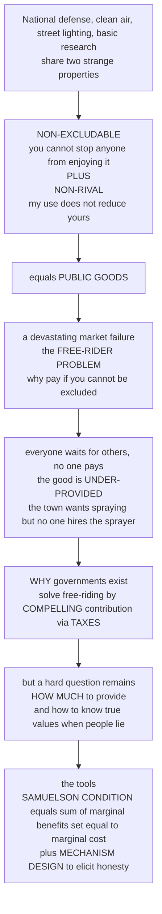

# 🏛️ Public Goods and Collective Provision

> [!abstract] TL;DR
> Some of society's most valuable things — national defense, clean air, street lighting, basic research, a functioning legal system — share two strange properties that break the market: they are **non-excludable** (once they exist you cannot stop anyone from enjoying them) and **non-rival** (my enjoying them does not leave less for you). These are **public goods**, and they generate a devastating market failure — the **free-rider problem**: if you cannot be excluded whether or not you pay, self-interest says *wait for others to pay*, so everyone waits and the good, though everyone wants it, goes massively **under-provided** or unprovided. This is precisely **why governments exist to provide such goods** — they beat free-riding by **compelling contribution through taxes**. But two hard questions remain that markets could answer for private goods and cannot answer here: **how much** to provide (the elegant **Samuelson condition** — sum everyone's marginal benefit and set it equal to marginal cost) and how to learn people's **true valuations** when everyone is tempted to misreport ("**preference revelation**," attacked by clever incentive-compatible **mechanisms**). This is the collective-provision/policy view of Microeconomics's public-goods theory (see [[Public_Goods]]).

---

## Intuition

**Analogy — the town that wants the mosquitoes gone but where no one will hire the sprayer.** Imagine a small town plagued by mosquitoes. Everyone would gladly pay something to have the swamp sprayed; collectively the town values it far more than it costs. But spraying the town's air protects *everyone* who breathes it — you cannot spray only the yards of people who chipped in (**non-excludable**), and one resident's relief from bites does not use up another's (**non-rival**). So each resident reasons: "If my neighbours pay for the sprayer, I get clean air for free; if they don't, my lone contribution won't cover the truck anyway. Either way, I'm better off keeping my money." Every resident thinks exactly this — and so *no one* hires the sprayer, and the mosquitoes win, even though every single person wanted them gone. Individually rational choices produce a collectively terrible outcome.

That is the whole story in miniature. **Public goods** are things with the swamp-spraying shape: national defense (you cannot defend the country from invasion for only the taxpayers), a lighthouse's beam (it shines on every ship, paying or not), clean air, street lighting, basic scientific knowledge, a working court system. Their non-excludability creates the **free-rider problem**, which drives voluntary, market provision far below what everyone actually wants. The classic escape is not persuasion but **compulsion**: a government makes *everyone* pay through **taxes**, so the good finally gets provided. This is one of the two deepest reasons — alongside externalities — that we have a government at all. It also opens a subtle problem the market never had to solve: once the state decides to provide, **how much** should it provide, and how can it possibly know what people truly value when each of us has every incentive to lie — understating our value to shave our tax bill, or overstating it if someone else foots the cost?

---

## How It Works

### Core mechanics

1. **Diagnose the two properties.** A pure public good is **non-excludable** (you cannot feasibly prevent a non-payer from consuming it) *and* **non-rival** (one person's consumption does not diminish the amount available to anyone else). Both must hold; each alone gives a different creature (see the taxonomy below).
2. **Trace the free-rider logic.** Non-excludability means the benefit reaches me regardless of my payment. A self-interested person therefore contributes nothing, hoping to ride on others. Because *everyone* faces this incentive, voluntary contributions collapse to far below the efficient level — the good is **under-provided** or not provided at all. The structure is an *n*-player **prisoner's dilemma**: cooperation (contribute) is collectively best but individually dominated (see [[Nash_Equilibrium]]).
3. **Note it worsens with group size.** The larger the group, the smaller each person's pivotal effect and the larger the crowd to ride on, so the incentive to free-ride *rises* and the gap between voluntary provision and the efficient level *widens* — a central reason global public goods (climate stability) are the hardest of all.
4. **Compel contribution — the government solution.** Because persuasion fails, the state substitutes **coercion**: mandatory **taxation**. Everyone must pay, so the good gets funded. This is the core economic justification for a huge share of what government does — defense, courts, public health, basic research.
5. **Solve the "how much" problem — the Samuelson condition.** For a *private* good, efficiency requires each consumer's marginal benefit to equal marginal cost. For a *public* good, since *everyone consumes the same single quantity simultaneously*, you **vertically sum** demand: efficiency requires the **sum of all individuals' marginal benefits to equal marginal cost**, $\sum_i MB_i = MC$ (equivalently $\sum_i MRS_i = MRT$).
6. **Confront preference revelation.** The Samuelson rule needs everyone's true marginal benefit — but people benefit no matter what they *say*, so they have every incentive to **misreport** (understate to lower their tax share, or free-ride outright). Getting honest valuations is the deep, unsolved-in-general problem, attacked imperfectly by **voting**, by the (infeasible) **Lindahl** personalized prices, and by incentive-compatible **mechanisms** (Clarke–Groves / VCG; see [[VCG_Mechanism]], [[Revelation_Principle_and_IC]]).

### Flow / Architecture



---

## Key Concepts

### Secondary

- **Public good** — something everyone can enjoy and no one can be shut out of, like clean air, street lighting, or national defense. Because you cannot charge people to use it, private firms will not supply enough of it.
- **Non-excludable** — you cannot stop someone who did not pay from enjoying it. The streetlight shines on everyone who walks by.
- **Non-rival** — one person using it does not leave less for anyone else. My benefiting from the lighthouse's beam takes nothing from you.
- **The free-rider problem** — if you get the benefit whether or not you pay, the tempting move is to let *others* pay and enjoy it for free. When everyone thinks this way, nobody pays and the good never gets made.
- **Why we have government** — the classic fix is to make *everyone* contribute through **taxes**, so goods that everyone wants but no one will pay for individually finally get provided.

### Undergraduate

- **The 2×2 taxonomy.** Cross *excludable / non-excludable* with *rival / non-rival*:

  | | **Rival** | **Non-rival** |
  |---|---|---|
  | **Excludable** | **Private goods** — food, clothes, a haircut | **Club goods** — cinema, toll road, cable TV, an uncongested park |
  | **Non-excludable** | **Common-pool resources** — fisheries, groundwater, a congestible commons | **Pure public goods** — national defense, clean air, basic knowledge, a lighthouse |

  Public goods sit bottom-right; the other three cells are close cousins with their own failures. **Common-pool resources** invite the *tragedy of the commons* (overuse) rather than under-provision; **club goods** can be privately supplied because a price *can* be charged.
- **The free-rider problem, formally.** In a voluntary-contribution game, the dominant strategy is to contribute (near) zero: my private return per dollar contributed is only my *own* share of the marginal benefit, which is a fraction of the *social* return. The Nash equilibrium under-provides; the shortfall **grows with group size**.
- **The collective-action problem (Olson).** Mancur Olson generalized this: latent groups fail to organize for their common interest precisely because the benefit is a public good to the group. Small groups and "selective incentives" (private perks for contributors) partially escape it.
- **Provision vs production.** Government *funding* a good (deciding it exists and paying via taxes) is distinct from government *producing* it. The state can fund and let private firms build (defense contractors, contracted-out garbage collection); the public-goods argument is about *provision*, not necessarily public production.
- **The Samuelson condition.** Optimal quantity where $\sum_i MB_i = MC$ — the **vertical summation** of individual demands (all consume the same $Q$), versus the **horizontal summation** for private goods (each unit goes to one buyer). This is the efficient answer to "how much."
- **Alternatives to tax-funded provision.** Philanthropy and voluntary giving (Wikipedia, open source), the **warm glow** of giving, reputation and social norms, **assurance contracts** (Kickstarter-style "provide only if a threshold is pledged"), **club** provision, and **public–private partnerships**.

### Graduate

- **Samuelson (1954), rigorously.** The Pareto-efficient level of a pure public good satisfies $\sum_{i=1}^{n} MRS^i_{G,x} = MRT_{G,x}$: the summed marginal rates of substitution equal the marginal rate of transformation. Samuelson himself stressed that *no decentralized pricing system* has an incentive structure that leads to this optimum — the informational crux below.
- **Lindahl equilibrium.** Erik Lindahl's personalized-price benchmark charges each person a price equal to their marginal valuation at the common quantity; the sum of personalized prices covers marginal cost, and every consumer *voluntarily* demands the same efficient $Q$. Beautiful but **not incentive-compatible and informationally infeasible**: agents shade their reported valuations to lower their Lindahl price — the free-rider problem wearing a pricing mask.
- **Preference revelation and demand-revealing mechanisms.** Because reports do not affect one's benefit, truthful revelation is not automatic. **Clarke–Groves / VCG** mechanisms make truth-telling a dominant strategy by charging each agent the *externality* their report imposes on others (the pivot tax), reaching the efficient decision — but at the cost of **budget imbalance** (payments need not sum to cost) and vulnerability to collusion, and the **Gibbard–Satterthwaite / Myerson–Satterthwaite** impossibilities bound what any mechanism can achieve (see [[Revelation_Principle_and_IC]], [[VCG_Mechanism]]).
- **The Tiebout model and fiscal federalism.** Charles Tiebout (1956) argued that for *local* public goods, mobile citizens "vote with their feet," sorting into jurisdictions whose tax-service bundles match their preferences — a quasi-market that partially reveals preferences and can approach efficiency. This grounds **fiscal federalism**: match each good to the jurisdiction whose scale matches its benefit reach (local parks vs national defense vs *global* public goods). See [[Federalism_and_Decentralization]].
- **Impure, local, and global public goods; congestion.** Most real goods are *impure* — non-rival only up to a **congestion** point (roads, courts). The **spatial reach** of benefits determines the right level of provision; **global public goods** (climate stability, pandemic preparedness, financial stability) have no world government to compel contribution, so international provision is a giant *n*-country collective-action failure escaped only by treaties, clubs, and side-payments.
- **Crowding-out and merit goods.** Public provision can **crowd out** voluntary contribution (government funding of the arts partly displaces private giving), though warm-glow motives make crowd-out incomplete. **Merit goods** (education, vaccination) are supplied publicly on grounds partly of positive externalities and partly of paternalism — a rationale *distinct* from pure public-goodness, often conflated with it.

---

## Python Demo

```python
# Public goods and collective provision, made concrete with numpy + matplotlib.
#
#   (a) FREE-RIDER / UNDER-PROVISION and how it WORSENS with group size.
#       Quasilinear model: each of N identical people gets benefit a*sqrt(G)
#       from the total public good G = sum of contributions (cost 1 per unit).
#         - Voluntary (Nash): the marginal contributor sets a/(2*sqrt(G)) = 1,
#           so TOTAL voluntary provision G_vol = (a/2)^2 -- independent of N.
#         - Efficient (Samuelson): maximize N*a*sqrt(G) - G, giving
#           G_opt = (N*a/2)^2, which grows like N^2.
#       => the fraction of the optimum actually provided is 1/N^2: the market
#          failure gets DRAMATICALLY worse as the group grows.
#
#   (b) SAMUELSON CONDITION / OPTIMAL PROVISION via VERTICAL summation.
#       For a public good everyone consumes the SAME quantity, so we add
#       individual demands VERTICALLY (sum marginal benefits at each Q) and
#       set the sum equal to marginal cost -> the efficient quantity Q*.
#       Contrast: a private good would sum demands HORIZONTALLY.

import numpy as np
import matplotlib.pyplot as plt

fig, (ax1, ax2) = plt.subplots(1, 2, figsize=(13, 5.4))

# ----------------------------------------------------------------------
# (a) UNDER-PROVISION vs GROUP SIZE
# ----------------------------------------------------------------------
a = 10.0
N = np.arange(1, 26)
G_vol = np.full_like(N, (a / 2) ** 2, dtype=float)   # voluntary total: flat
G_opt = (N * a / 2.0) ** 2                            # efficient total: ~N^2

ax1.plot(N, G_opt, "o-", color="green", lw=2, ms=4,
         label="Efficient level (Samuelson)")
ax1.plot(N, G_vol, "s-", color="crimson", lw=2, ms=4,
         label="Voluntary provision (Nash free-riding)")
ax1.fill_between(N, G_vol, G_opt, color="crimson", alpha=0.12,
                 label="Under-provision gap")
ax1.set_yscale("log")
ax1.set_xlabel("Group size N")
ax1.set_ylabel("Total public good provided (log scale)")
ax1.set_title("Free-riding under-provision worsens with group size")
ax1.legend(fontsize=8, loc="upper left")
ax1.grid(alpha=0.3, which="both")
ax1.annotate("fraction of optimum provided = 1 / N^2",
             xy=(20, G_vol[0]), xytext=(6.5, G_vol[0] * 6),
             fontsize=8, arrowprops=dict(arrowstyle="->"))

# ----------------------------------------------------------------------
# (b) SAMUELSON CONDITION: vertical summation of demand
# ----------------------------------------------------------------------
Q = np.linspace(0, 100, 600)
# three consumers, linear inverse demands (marginal benefits), truncated at 0
demands = [(50.0, 0.9), (40.0, 0.6), (30.0, 0.4)]         # (intercept, slope)
MB = [np.maximum(0.0, A - b * Q) for (A, b) in demands]
MB_sum = np.sum(MB, axis=0)                                # VERTICAL sum
MC = 30.0                                                  # constant marginal cost

# efficient Q*: largest Q where the vertical-summed MB still covers MC
feasible = Q[MB_sum >= MC]
Q_star = feasible.max() if feasible.size else 0.0

for i, mb in enumerate(MB):
    ax2.plot(Q, mb, lw=1.4, alpha=0.7, label=f"Consumer {i+1} marginal benefit")
ax2.plot(Q, MB_sum, lw=2.6, color="purple",
         label="Vertical sum of marginal benefits")
ax2.axhline(MC, color="black", ls="--", lw=1.4, label=f"Marginal cost = {MC:.0f}")
ax2.axvline(Q_star, color="green", ls=":", lw=1.6)
ax2.plot([Q_star], [MC], "o", color="green", ms=8)
ax2.annotate(f"Efficient Q* = {Q_star:.0f}\nsum of MB = MC",
             xy=(Q_star, MC), xytext=(Q_star + 6, MC + 22),
             fontsize=8, arrowprops=dict(arrowstyle="->"))
ax2.set_xlabel("Quantity of the public good Q")
ax2.set_ylabel("Marginal benefit / cost")
ax2.set_title("Samuelson condition: sum marginal benefits, set equal to MC")
ax2.legend(fontsize=7.5, loc="upper right")
ax2.set_ylim(0, 130)
ax2.grid(alpha=0.3)

plt.tight_layout()
plt.show()

print(f"(a) With N=25, voluntary provision = {G_vol[-1]:.0f} but the efficient "
      f"level = {G_opt[-1]:.0f}: only {G_vol[-1]/G_opt[-1]*100:.2f}% of the "
      f"optimum is provided -- free-riding scales catastrophically.")
print(f"(b) Vertically summing the three consumers' marginal benefits and setting "
      f"the sum equal to marginal cost {MC:.0f} gives the efficient quantity "
      f"Q* = {Q_star:.0f}; no single consumer would ever demand this much alone.")
```

The left panel is the **free-rider problem** made quantitative: voluntary (Nash) provision is flat — adding people does *not* raise total private contribution, because each newcomer free-rides — while the efficient (Samuelson) level climbs roughly as the square of group size, so the shaded under-provision gap explodes and the fraction of the optimum actually delivered collapses as $1/N^2$. This is the mathematical heart of why large-group public goods (national, global) cannot be left to voluntary provision. The right panel is the **Samuelson condition**: because all consumers share the same single quantity, we stack their marginal-benefit curves **vertically** and read off the efficient $Q^\*$ where that sum meets marginal cost — a level far above what any individual, or a market summing demand horizontally, would ever choose.

---

## Real-World Applications

- **National defense and the legal system — the textbook cases.** Non-excludable and non-rival at the national scale; no private market would fund an army or an impartial court system at the efficient level because free-riding is rational. Both are funded by compulsory taxation — the purest expression of collective provision and the historical core of the state.
- **Basic scientific research and public health.** Fundamental knowledge is non-rival (infinite copies at zero cost) and hard to exclude once published, so private firms under-invest in *basic* (as opposed to applied, patentable) research. Governments fund it directly (NIH, NSF, CERN). **Disease eradication** (smallpox, near-eradication of polio) is a global public good delivered by compelled, coordinated public spending.
- **Street lighting, clean air, flood defense, lighthouses.** The canonical local public goods — the streetlight famously shines on payer and non-payer alike. (Coase's historical work on lighthouses showed even these were sometimes privately funded via port dues, i.e. by *converting* them into club goods with a chokepoint for charging — a reminder that excludability is partly a technology, not a fixed fact.)
- **Climate stability and pandemic preparedness — global public goods.** Greenhouse-gas mitigation benefits every country and excludes none, so each nation is tempted to free-ride on others' emission cuts. With no world government to compel contribution, provision depends on treaties (Paris Agreement) acting as voluntary-contribution mechanisms — precisely the *n*-player collective-action failure the model predicts, which is why global public goods are chronically under-supplied.
- **Preference-revealing mechanisms in practice.** Cost-benefit analysis for public projects uses contingent-valuation surveys and revealed-preference methods to *estimate* the aggregate willingness-to-pay the Samuelson condition needs. Spectrum and procurement **auctions** apply VCG-style incentive-compatible design to elicit true valuations where the theory says naive asking would fail.
- **Local provision and "voting with your feet."** Tiebout sorting is visible in how families choose municipalities by their school-quality/property-tax bundle, revealing preferences for local public goods that no central planner could easily survey — the intuition behind decentralizing many services to the local level.

---

## Common Pitfalls

- **Equating "government-provided" with "public good."** Many state-provided goods (highways, hospitals, schooling) are *not* pure public goods — they congest (become rival) and can be priced (excludable). Public provision is a *response* to various failures and equity aims, not the *definition* of a public good. Conversely, some genuine public goods are privately provided (open source, historically some lighthouses).
- **Confusing non-rivalry with zero cost.** Non-rivalry means my consumption does not reduce yours, *not* that production is free. A lighthouse, a satellite network, or a research programme has large fixed and maintenance costs; the point is the *marginal* cost of another user is near zero.
- **Assuming free-riding means literally zero provision.** Experiments show people initially contribute 40–60% of endowment out of warm glow, fairness, and confusion — but contributions **decay toward the free-riding prediction** with repetition unless punishment or communication is allowed. "Under-provided," not always "unprovided."
- **Applying the Samuelson condition as if valuations were observable.** The rule $\sum_i MB_i = MC$ is exactly right and almost never directly usable, because it needs everyone's *true* marginal benefit — and the whole difficulty is that people will not honestly reveal it. Treating the condition as a plug-and-play formula skips the entire preference-revelation problem.
- **Ignoring government failure.** Compulsion solves free-riding but introduces its own pathologies: rent-seeking over which "public goods" get funded, capture, and the impossibility of aggregating preferences perfectly through voting. Identifying a public good is *necessary but not sufficient* to justify a *particular* public program.
- **Forgetting that excludability is endogenous.** Encryption, tolling technology, and paywalls can turn a would-be public good into a club good, dissolving the free-rider problem — at the cost of new access and equity concerns. Whether something *is* a public good is partly a choice about technology and institutions, not a law of nature.

---

## Related Concepts

Cross-vault anchors (Glob-verified files elsewhere in the vault):

- [[Public_Goods]] — the Microeconomics *theory* of public goods (the four-cell taxonomy, the voluntary-contribution game, Lindahl pricing). This note is its **collective-provision / policy** counterpart; distinct basename, linked to deliberately.
- [[Market_Failures]] — public-good under-provision is one of the four canonical market failures; the umbrella diagnosis this note specializes.
- [[Externalities_and_Pigouvian_Tax]] — the *other* deepest reason government exists; positive externalities and public goods are close cousins, both cases where private benefit falls short of social benefit.
- [[Coase_Theorem]] — the property-rights / bargaining alternative: making a good excludable (as with historical lighthouse port dues) can convert a public-good problem into a private transaction.
- [[Nash_Equilibrium]] — the free-rider problem is an *n*-player prisoner's dilemma; the under-provision result is a Nash equilibrium of the voluntary-contribution game.
- [[Revelation_Principle_and_IC]] — the incentive-compatibility machinery behind the preference-revelation problem: can we design rules under which honest reporting is optimal?
- [[VCG_Mechanism]] — Clarke–Groves / VCG demand-revealing mechanisms that make truth-telling dominant for public-good decisions, and their budget-balance limits.
- [[Overexploitation_and_Sustainable_Harvesting]] — the *common-pool-resource* cousin (rival but non-excludable): the tragedy of the commons, the mirror image of public-good under-provision.
- [[Federalism_and_Decentralization]] — the Tiebout model and fiscal federalism: matching each public good to the jurisdiction whose scale fits its benefit reach.

Within this vault, this note sits in the *Economics of the Public Sector* section beside prose-referenced siblings (to be built): *Rationales_for_Government_Intervention* (the disciplined "why" that public goods help justify), *Externalities_and_Environmental_Policy* (the twin efficiency rationale), *Taxation_and_Public_Finance* (how compelled contribution is actually raised and shared), *Collective_Action_and_Interest_Groups* (Olson's logic of why groups fail to provide their own common goods), and *Institutions_Rules_and_Commons_Governance* (Ostrom's evidence that communities can sometimes self-provide without the state).

---

## Review Questions

1. **(Secondary)** A town is troubled by mosquitoes. Everyone would benefit from spraying, but no one hires the sprayer. Using the words *non-excludable* and *free-rider*, explain why the private market fails here, and why making everyone pay through taxes fixes it.
2. **(Undergraduate)** Distinguish the four cells of the excludable × rival taxonomy with one example each. Then use the Samuelson condition to explain why the efficient quantity of a public good is found by summing demand *vertically* rather than *horizontally*, and why voluntary provision falls short of that quantity.
3. **(Graduate)** "Government provides public goods because markets under-supply them" is only half an argument. (a) Explain why the Samuelson condition, though correct, cannot be applied directly, and how the preference-revelation problem undermines both Lindahl pricing and naive surveys. (b) Sketch how a VCG mechanism restores incentive-compatibility and state one serious limitation. (c) For a *global* public good such as climate stability, explain why the very features that justify domestic provision make international provision especially hard.

---

## Sources

- Paul A. Samuelson, "The Pure Theory of Public Expenditure," *Review of Economics and Statistics* 36(4), 1954 — the founding statement of the optimal-provision condition.
- Mancur Olson, *The Logic of Collective Action* (Harvard University Press, 1965) — why groups fail to provide their common goods and the role of selective incentives.
- Joseph E. Stiglitz and Jay K. Rosengard, *Economics of the Public Sector* (4th ed., W. W. Norton) — the standard treatment of public goods, free-riding, and collective provision.
- Richard Cornes and Todd Sandler, *The Theory of Externalities, Public Goods, and Club Goods* (2nd ed., Cambridge University Press, 1996) — the unified formal theory across the taxonomy.
- Charles M. Tiebout, "A Pure Theory of Local Expenditures," *Journal of Political Economy* 64(5), 1956 — "voting with your feet" and local public goods.

---

#public-policy #public-goods #free-rider-problem #collective-provision #samuelson-condition
