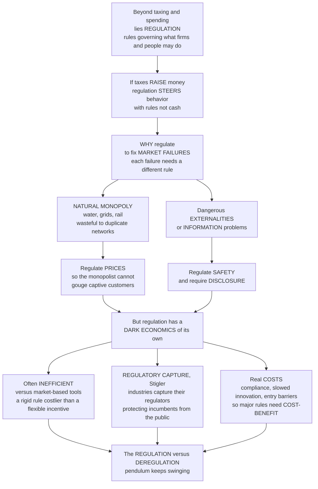

# 🚦 Regulation and Regulatory Economics

> [!abstract] TL;DR
> Beyond taxing and spending, government steers the economy with a quieter, pervasive tool: **regulation** — the rules governing what firms and individuals may do. If taxes are how the state *raises money*, regulation is how it *directly steers behavior with rules rather than cash*. The economic **rationale** is to fix **market failures**, and each failure calls for a different rule: **natural monopoly** → regulate **prices** so the monopolist cannot gouge captive customers; dangerous **externalities** and **information** gaps → regulate **safety** and require **disclosure**. But regulation carries a dark economics of its own. It is often **inefficient** versus flexible market-based incentives; it is prone to **regulatory capture** (Stigler's Nobel insight — industries influence their own regulators to protect incumbents *from* the public); and it imposes real **costs** (compliance, slowed innovation, entry barriers) that must be weighed against benefits via **cost-benefit analysis**. The eternal **regulation-versus-deregulation pendulum** swings on exactly these trade-offs.

---

## Intuition

**Analogy — the referee, not the tax collector.** Government has two very different ways to shape a football match. It can *tax the ticket revenue* (raise money and redistribute it), or it can *put a referee on the field* who blows the whistle, sets the rules of play, and sends players off. Regulation is the referee. It does not take your money; it tells you what moves are legal — you cannot sell a drug without proving it is safe, you cannot dump toxins in the river, the water company cannot charge whatever it likes. If taxing and spending is government's *wallet*, regulation is its *whistle*: a quieter but far more pervasive lever that reaches into drug safety, pollution limits, utility prices, financial risk, and professional licensing.

**Why blow the whistle at all?** The economic answer is to fix **market failures** — and, crucially, *each failure calls for a different rule*. When an industry is a **natural monopoly** — water pipes, the electricity grid, railways, where duplicating competing networks is wastefully inefficient so one firm dominates — we regulate **prices**, because a monopolist facing captive customers will restrict output and gouge. When there are dangerous **externalities** (pollution) or **information** problems (you cannot tell a safe drug from a dangerous one), we regulate **safety** and require **disclosure**: prove the drug is safe, label the food, certify the electrician.

**But the referee can be bought — and the whistle is costly.** Regulation has a dark economics of its own, and this is what separates naive from serious analysis. *First*, it is often **inefficient** compared with market-based alternatives: a rigid command ("every plant must install *this* scrubber") is usually costlier than a flexible incentive (a pollution tax) that lets each firm find *its own* cheapest fix. *Second*, and more insidiously, there is **regulatory capture** — George Stigler's Nobel insight that the very industries being regulated have enormous incentives to influence, and often "capture," their regulators, twisting the rules to protect incumbents and block competitors, so that regulation meant to protect the public ends up protecting the *industry from the public*. *Third*, regulation imposes real **costs** — compliance burdens, slowed innovation, barriers to entry — that must be weighed against its benefits, which is why major rules now require **cost-benefit analysis** before adoption. The perpetual, pendulum-swinging debate — *more* regulation to protect people versus *deregulation* to unleash markets — turns on exactly these trade-offs. Understanding the economics of regulation is understanding one of government's most powerful and most-abused levers.

---

## How It Works

### Core mechanics

1. **Regulation is rule-making, not money-moving.** Distinct from taxing and spending, regulation *constrains or directs* the behavior of firms and individuals through binding rules, made and enforced by administrative agencies — the "regulatory state."
2. **Two broad kinds.** *Economic* regulation targets **prices, entry, and competition** in specific industries (utilities, airlines, banking). *Social* regulation targets **health, safety, environment, and consumer/worker protection** *across* industries (the FDA, EPA, OSHA).
3. **Diagnose the market failure first.** The economic rationale is to correct a specific failure, and the failure dictates the tool: **natural monopoly** → price and entry regulation; **externalities** → safety/environmental limits; **information asymmetry** → disclosure, labeling, licensing, product-safety and drug approval; **market power** → antitrust.
4. **Choose the instrument.** *Command-and-control* (fixed standards, mandates, bans) offers certainty but is statically inefficient and inflexible. *Incentive-based, performance-based, and information-based* approaches (taxes, tradable permits, outcome standards, disclosure) let each actor find the least-cost path.
5. **Anticipate regulatory failure.** Rules can be *captured* by the regulated, generate *rent-seeking*, and impose compliance costs and entry barriers. Good governance therefore subjects major rules to **cost-benefit / regulatory-impact analysis**, centralized review, and periodic reform.

The **public-interest theory** says regulation exists to correct market failures for the public good. The competing **economic (capture) theory** of Stigler says regulation is often "acquired by the industry and designed and operated primarily for its benefit" — regulators serving the regulated, with entry barriers shielding incumbents. Real regulatory systems live somewhere between these poles, which is why *instrument choice* and *cost-benefit discipline* matter so much.

### Flow / Architecture



---

## Key Concepts

### Secondary

- **Regulation = rules, not money.** Government shapes the economy not only by taxing and spending but by setting *rules* — safety standards, pollution limits, licenses, price controls — that say what businesses and people may and may not do.
- **Why regulate?** Mainly to fix problems markets create on their own: monopolies that overcharge, pollution that harms bystanders, and dangers buyers cannot see (unsafe drugs or food).
- **Natural monopoly.** For water, electricity, and rail it is wasteful to build competing networks, so one firm dominates. Left alone it would overcharge, so government regulates its **prices**.
- **Safety and disclosure.** For dangerous or hard-to-judge products, government demands proof of safety and honest labels — you cannot sell a drug without showing it works and is safe.
- **The catch.** Regulation is not free. It can be clumsy, costly, and — worst of all — the industry being regulated often ends up influencing the rules in its own favor. This is why people argue endlessly about whether we have too much or too little.

### Undergraduate

- **Economic vs social regulation.** *Economic*: control of price/entry/competition in one industry (rate regulation of utilities). *Social*: cross-industry protection of health, safety, environment, consumers, workers.
- **Natural monopoly and the price-regulation dilemma.** High fixed cost + low marginal cost ⇒ **declining average cost**, so a single firm serves the market most cheaply but can exploit captive buyers. The regulator faces a dilemma: **marginal-cost pricing** (P = MC) is *efficient* but leaves the firm losing money (P < AC, needs a subsidy); **average-cost / rate-of-return** pricing (P = AC) lets the firm *break even* but keeps price above MC, so some inefficiency remains. Modern **price-cap / incentive regulation** tries to preserve cost-cutting incentives that pure rate-of-return regulation dulls.
- **The four rationales.** Natural monopoly (price/entry regulation), **externalities** (environmental and safety rules), **information asymmetries** (disclosure, licensing, certification, drug approval), and **market power** (antitrust).
- **Instrument choice.** *Command-and-control* standards give certainty but are inflexible and statically inefficient; **market-based** (taxes, cap-and-trade), **performance-based** (hit an outcome, choose your own means), and **information-based** (labels, disclosure) instruments are usually cheaper and more adaptive.
- **The economic theory of regulation (capture).** Stigler: regulation is often demanded *by* the regulated because it can deliver entry barriers, price supports, and protection from competition. **Rent-seeking** (Tullock) and the **revolving door** deepen it.
- **Concentrated benefits, diffuse costs.** A rule that hands a small industry a large total gain while spreading a larger total cost thinly over millions will still pass: the industry's per-member stake is huge (worth lobbying), each citizen's is tiny (not worth fighting) — Olson's logic of collective action.
- **Costs of regulation.** Direct compliance costs, entry barriers, dampened competition, ambiguous innovation effects, unintended consequences, and "red tape" — all to be weighed against benefits via **cost-benefit analysis**.

### Graduate

- **Rate-of-return vs price-cap regulation.** Rate-of-return ("fair return on the rate base") invites the **Averch-Johnson effect** (over-capitalization / gold-plating) and blunts cost discipline. **Price caps (RPI − X)** and yardstick/incentive schemes restore efficiency incentives but shift risk and demand sophisticated regulators — the core of modern utility regulation.
- **Peltzman-Becker generalization of capture.** Peltzman (1976) recast Stigler as a *vote/support-maximizing regulator* balancing producer and consumer coalitions; Becker (1983) modeled regulation as competition among pressure groups where deadweight-loss pressures partially discipline the outcome — capture as equilibrium, not conspiracy.
- **Public-interest vs private-interest theories.** The normative "correct market failure" account versus positive theories (capture, rent-seeking, bureaucratic self-interest) that predict *who actually gets protected*. Empirical regulation research asks which theory fits a given industry's history.
- **Instrument choice under uncertainty (Weitzman).** Prices vs quantities: when marginal-cost curves are steep relative to marginal benefits, price instruments dominate; when marginal damages are steep (thresholds), quantity instruments dominate. This underlies the tax-vs-cap-and-trade debate.
- **Responsive and risk-based regulation (Ayres & Braithwaite).** An **enforcement pyramid** escalating from persuasion to sanction, plus risk-based targeting of scarce enforcement — a middle path between pure deregulation and rigid command-and-control.
- **Regulatory governance machinery.** Notice-and-comment **rulemaking**, **regulatory impact analysis (RIA)** and centralized review (e.g. OIRA), **regulatory budgets** and one-in-two-out rules, and "better/smart regulation" agendas — the institutions that try to discipline both over- and under-regulation.
- **Deregulation cycles and frontiers.** Airline (1978), telecom, trucking, and financial deregulation, and the *re-regulation* that followed crises (2008). New frontiers: platform/antitrust regulation of Big Tech, AI governance, gig-work classification, systemic financial risk, and regulatory **sandboxes** for fintech.

---

## Python Demo

```python
# The economics of REGULATION in two pictures.
#   (a) NATURAL MONOPOLY & PRICE REGULATION: a firm with a large fixed cost and
#       low marginal cost has a DECLINING average cost, so one firm serves the
#       market most cheaply -- but left alone it restricts output and gouges.
#       We compare three price rules the regulator can choose:
#         * unregulated MONOPOLY  (MR = MC): high price, restricted output, DWL
#         * MARGINAL-COST pricing (P = MC): efficient, but P < AC so the firm
#           LOSES money and needs a subsidy
#         * AVERAGE-COST / "fair-return" pricing (P = AC): break-even, but P > MC
#           so a little inefficiency remains  ->  the regulator's dilemma.
#   (b) REGULATORY CAPTURE: the logic of CONCENTRATED BENEFITS, DIFFUSE COSTS.
#       A favorable rule hands a small industry a big TOTAL rent while spreading
#       a larger TOTAL cost thinly across millions. Per member, the industry's
#       stake dwarfs each citizen's, so the industry lobbies while the public
#       stays rationally ignorant -- and an inefficient rule still passes.
# Pure numpy + matplotlib.

import numpy as np
import matplotlib.pyplot as plt

fig, (ax1, ax2) = plt.subplots(1, 2, figsize=(13, 5.4))

# ----------------------------------------------------------------------
# (a) NATURAL MONOPOLY and the price-regulation dilemma
#     Inverse demand:  P  = a - b*Q
#     Total cost:      TC = F + c*Q   ->   MC = c ,  AC = F/Q + c  (declining)
# ----------------------------------------------------------------------
a, b, c, F = 100.0, 1.0, 10.0, 800.0
Q  = np.linspace(1, 95, 500)
P  = a - b * Q
MR = a - 2 * b * Q
MC = c * np.ones_like(Q)
AC = F / Q + c

Q_m  = (a - c) / (2 * b);  P_m  = a - b * Q_m          # monopoly: MR = MC
Q_mc = (a - c) / b;        P_mc = c                    # P = MC (efficient)
disc = (a - c) ** 2 - 4 * b * F                        # P = AC: b Q^2 -(a-c)Q +F =0
Q_ac = ((a - c) + np.sqrt(disc)) / (2 * b);  P_ac = a - b * Q_ac

ax1.plot(Q, P,  lw=2, label="Demand = marginal benefit")
ax1.plot(Q, MR, lw=1.5, ls="--", color="gray", label="Marginal revenue")
ax1.plot(Q, MC, lw=2, label="Marginal cost MC")
ax1.plot(Q, AC, lw=2, label="Average cost AC, declining")

for Qx, Px, col, lab in [(Q_m,  P_m,  "crimson",    "Monopoly"),
                         (Q_ac, P_ac, "darkorange", "Avg-cost / fair-return"),
                         (Q_mc, P_mc, "green",      "Marginal-cost / efficient")]:
    ax1.scatter([Qx], [Px], color=col, s=45, zorder=5)
    ax1.annotate(f"{lab}\nQ={Qx:.0f}, P={Px:.0f}", xy=(Qx, Px),
                 xytext=(Qx + 1.5, Px + 6), fontsize=7.5, color=col)

# deadweight loss of the unregulated monopoly vs the efficient MC-pricing output
Qdw = np.linspace(Q_m, Q_mc, 60)
ax1.fill_between(Qdw, a - b * Qdw, c, color="crimson", alpha=0.18,
                 label="Deadweight loss of monopoly")
ax1.set_xlabel("Quantity")
ax1.set_ylabel("Price / cost")
ax1.set_title("Natural monopoly and the price-regulation dilemma")
ax1.legend(fontsize=7.5, loc="upper right")
ax1.set_ylim(0, 105)
ax1.grid(alpha=0.3)

# ----------------------------------------------------------------------
# (b) REGULATORY CAPTURE: concentrated benefits vs diffuse costs
# ----------------------------------------------------------------------
n_firms, n_public = 20, 300_000_000
B = 2.0e9      # total benefit the rule hands the industry
C = 3.0e9      # total cost the rule imposes on the public  (C > B: inefficient!)
per_firm    = B / n_firms          # each firm's stake   -> huge
per_citizen = C / n_public         # each citizen's stake -> tiny

labels = ["Industry\ntotal benefit B", "Public\ntotal cost C",
          "Per FIRM\nstake B/N", "Per CITIZEN\nstake C/M"]
vals   = [B, C, per_firm, per_citizen]
colors = ["steelblue", "firebrick", "steelblue", "firebrick"]
bars = ax2.bar(labels, vals, color=colors, alpha=0.85)
ax2.set_yscale("log")
ax2.set_ylabel("US dollars, log scale")
ax2.set_title("Regulatory capture: concentrated benefits, diffuse costs")
for rect, v in zip(bars, vals):
    ax2.text(rect.get_x() + rect.get_width() / 2, v * 1.4,
             f"${v:,.0f}", ha="center", fontsize=7.5)
ax2.text(0.5, 0.03,
         "Society loses C - B, yet each firm's huge stake\n"
         "buys lobbying while each citizen shrugs off $10",
         transform=ax2.transAxes, ha="center", fontsize=8,
         bbox=dict(boxstyle="round", fc="lightyellow", ec="gray"))
ax2.grid(alpha=0.3, axis="y")

plt.tight_layout()
plt.show()

print("(a) Natural monopoly price rules:")
print(f"    Unregulated monopoly : Q={Q_m:.0f}, P={P_m:.0f}   (restricts output, gouges)")
print(f"    Average-cost pricing : Q={Q_ac:.0f}, P={P_ac:.0f}   (break-even, small inefficiency)")
print(f"    Marginal-cost pricing: Q={Q_mc:.0f}, P={P_mc:.0f}   (efficient, but loses F=${F:.0f})")
print("(b) Regulatory capture:")
print(f"    Per-firm stake ${per_firm:,.0f} vs per-citizen stake ${per_citizen:,.2f} "
      f"-> ratio {per_firm/per_citizen:,.0f} to 1")
print(f"    Net social loss from the inefficient rule = ${C-B:,.0f}, yet it passes.")
```

The **left panel** dramatizes the regulator's core dilemma. Because average cost *declines* over the whole market (huge fixed cost `F`, low marginal cost `c`), this is a **natural monopoly**: one firm is cheapest, but unregulated it sets `MR = MC`, restricting output to `Q = 45` and charging `P = 55` — the shaded triangle is the deadweight loss. The regulator can push price down to **marginal cost** (`P = 10`, `Q = 90`) for full efficiency, but then `P < AC` and the firm bleeds money equal to its fixed cost (someone must subsidize it). Or it can set **average-cost / fair-return** price (`P = 20`, `Q = 80`), where the firm exactly breaks even — the practical compromise, at the cost of a little residual inefficiency because price still exceeds marginal cost. The **right panel** is Stigler's capture logic quantified: the rule is *socially inefficient* (public cost `$3B` exceeds industry benefit `$2B`), yet it passes, because per-member incentives are wildly asymmetric — each of 20 firms stands to gain `$100,000,000` while each of 300 million citizens loses about `$10`. The industry mobilizes; the public rationally ignores it. Concentrated benefits beat diffuse costs.

---

## Real-World Applications

- **Utility price regulation (natural monopoly).** Electricity, water, gas, and rail networks are regulated on price and entry precisely because duplicating the network is wasteful. The historic shift from **rate-of-return** to **price-cap (RPI − X)** regulation — pioneered in UK privatizations and widespread in US public utility commissions — is the left panel's dilemma playing out in policy.
- **Drug approval and food safety (information + externality).** The FDA's requirement to *prove* safety and efficacy before sale, and mandatory nutrition and hazard labeling, are textbook responses to information asymmetry — you cannot judge a pill's safety at the pharmacy counter.
- **Environmental regulation, command vs market-based.** The US moved from uniform "install this scrubber" mandates toward the **SO₂ cap-and-trade** program under the 1990 Clean Air Act — a live demonstration that a flexible, market-based instrument can hit the same target far more cheaply than rigid command-and-control.
- **Airline deregulation (1978) and the pendulum.** The dismantling of CAB route-and-fare control unleashed competition, lower fares, and new entrants — the canonical deregulation success — while the 2008 financial crisis triggered *re-regulation* (Dodd-Frank), illustrating the swing back toward systemic-risk rules.
- **Occupational licensing (capture and entry barriers).** Licensing that began as consumer protection frequently hardens into an entry barrier protecting incumbents — a widely studied instance of Stigler capture, from hair-braiding to taxi medallions.
- **Cost-benefit review of major rules.** Executive-order-mandated **regulatory impact analysis** and centralized OIRA review in the US require agencies to quantify costs and benefits before adopting economically significant rules — the institutional embodiment of "weigh the costs."

---

## Common Pitfalls

- **"Market failure ⇒ regulate."** Identifying a failure is *necessary but not sufficient*. Regulation fails too (capture, compliance cost, rigidity); the honest comparison is imperfect market versus imperfect regulator, not a real market versus an idealized planner.
- **Confusing the two theories of regulation.** Assuming every rule serves the "public interest" ignores capture; assuming every rule is pure capture ignores genuine safety and environmental gains. Real regulation is a mix — diagnose the specific industry.
- **Command-and-control by reflex.** Prescribing a *specific technology* ("install this device") locks in today's method and kills innovation. A **performance or price** instrument that specifies the *outcome* usually reaches the goal at lower cost.
- **Ignoring the natural-monopoly pricing trap.** Demanding marginal-cost pricing "because it's efficient" bankrupts the firm; demanding average-cost pricing forgets the residual inefficiency. There is no free lunch — the regulator is choosing *which* imperfection to tolerate.
- **Counting benefits, hiding costs (and vice versa).** Regulatory debates routinely tally lives saved while ignoring compliance burden and lost competition — or the reverse. Serious analysis puts both on the same ledger.
- **Static thinking about entry barriers.** A rule that looks protective today may entrench incumbents for decades. Watch for licensing, standards, and approval regimes that quietly convert consumer protection into a moat.
- **Treating deregulation as free.** Removing rules can unleash growth *or* systemic risk (2008). Deregulation is an instrument with its own costs, not a costless default.

---

## Related Concepts

Cross-vault anchors (Glob-verified files elsewhere in the vault; this note is the **economics-of-regulation** view — distinct basename, linked to deliberately):

- [[Administrative_Law_and_Regulation]] — the **legal** machinery of the regulatory state (agencies, rulemaking, judicial review) that this note treats through an economic lens.
- [[Regulatory_Politics_and_Administrative_Law]] — the **political-science** account of regulatory politics and bureaucracy; the capture and rent-seeking dynamics here are its economic counterpart.
- [[Market_Failures]] — the taxonomy of failures (externalities, public goods, information, market power) that supplies regulation's economic rationale.
- [[Monopoly]] — the microeconomics of monopoly pricing and deadweight loss underlying the natural-monopoly / price-regulation panel of the demo.
- [[Externalities_and_Pigouvian_Tax]] — the market-based alternative to command-and-control safety/environmental rules.
- [[Coase_Theorem]] — the property-rights/bargaining route that can substitute for regulation when transaction costs are low.
- [[Asymmetric_Information]] — the information-failure basis for disclosure, labeling, licensing, and product/drug approval.
- [[Law_and_Economics]] — the broader efficiency-of-legal-rules tradition into which regulatory economics fits.
- [[Political_Economy_and_Market_State_Relations]] — the state-versus-market framing and the interest-group forces that shape which regulations survive.
- [[Nudges_and_Choice_Architecture]] — information- and default-based "regulation lite" that supplements command-and-control and taxes.

Within this vault, this note sits in **Economics of the Public Sector** beside its siblings (prose references): it operationalizes the *Rationales_for_Government_Intervention* by turning each market failure into a concrete rule; it complements *Externalities_and_Environmental_Policy*, which deepens the safety/environmental instrument choice; it depends on *Cost_Benefit_Analysis* as the discipline for weighing regulatory costs against benefits; its capture and rent-seeking dynamics are developed in *Public_Choice_and_Political_Economy*; and the agencies that make and enforce these rules are the subject of *Bureaucracy_and_Public_Administration*.

---

## Review Questions

1. **(Secondary)** Explain, in your own words, why the government regulates the *price* of your local water company but not the price of restaurants. What is different about water that makes competition impractical?
2. **(Undergraduate)** A natural monopoly has high fixed and low marginal costs. Using average and marginal cost, explain the regulator's dilemma between *marginal-cost pricing* and *average-cost (fair-return) pricing*. Which is efficient, which is financially sustainable, and why can you not have both without a subsidy?
3. **(Graduate)** "Regulation, though ostensibly for the public interest, is often acquired by the industry and operated for its benefit." State Stigler's capture thesis precisely, connect it to the logic of *concentrated benefits and diffuse costs*, and evaluate two institutional reforms (e.g. cost-benefit review, price-cap regulation, sunset clauses) for whether they mitigate capture or merely relocate it.

---

## Sources

- George J. Stigler, "The Theory of Economic Regulation," *Bell Journal of Economics and Management Science* 2(1), 1971 — the foundational capture / economic theory of regulation.
- W. Kip Viscusi, Joseph E. Harrington Jr., David E. M. Sappington, *Economics of Regulation and Antitrust* (MIT Press) — the standard graduate text on natural monopoly, instrument choice, and regulatory economics.
- Ian Ayres and John Braithwaite, *Responsive Regulation: Transcending the Deregulation Debate* (Oxford University Press, 1992) — the enforcement pyramid and the middle path between command-and-control and deregulation.
- Stephen G. Breyer, *Regulation and Its Reform* (Harvard University Press, 1982) — the classic mapping of regulatory rationales, tools, and reform, from a future Supreme Court justice.

---

#public-policy #regulation #natural-monopoly #regulatory-capture #regulatory-economics
