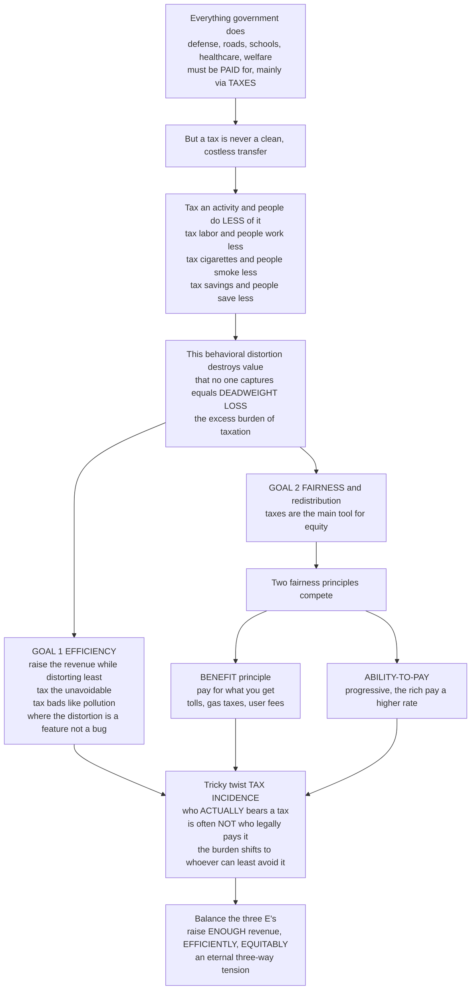

# 🏛️ Taxation and Public Finance

> [!abstract] TL;DR
> Everything government does — defense, roads, schools, healthcare, welfare — has to be **paid for**, and the main way is **taxes**. But a tax is never a clean, costless transfer: because taxing an activity leads people to do **less** of it, taxation destroys value that no one captures — the **deadweight loss** or **excess burden**. So efficient tax design raises the needed revenue while distorting behavior as little as possible (tax the unavoidable; tax "bads" like pollution, where the distortion is the *point*). At the same time, taxes are the primary instrument of **fairness and redistribution**, pitting the **benefit principle** against **ability-to-pay** and progressive against flat structures — and complicated by the subtle fact that who *actually* bears a tax (its **incidence**) often differs from who legally pays it. The whole field is a three-way tension: raise **Enough** revenue, **Efficiently**, and **Equitably**. This is the tax-design view of public finance; it complements the Macroeconomics fiscal-policy notes.

---

## Intuition

**Analogy — the household bill nobody can escape.** A society is like a household that has agreed to buy some things *together* — a shared roof (defense), a shared driveway (roads), shared insurance (healthcare, pensions), and help for members who fall on hard times (welfare). Someone has to pay the bill, and the way the household collects the money is **taxes**. Chief Justice Marshall's line, "the power to tax is the power to destroy," is only half the story: it is *also* the power to *build* a society. The whole art is how you split the bill.

Here is the catch that makes taxation deep rather than mere accounting: **a tax is never a clean transfer of money from a pocket to the treasury.** Every tax changes behavior, and that behavior change creates *hidden* damage. Tax labor, and people work a bit less. Tax cigarettes, and people smoke less. Tax savings, and people save less. Each time, some **beneficial activity that would have happened simply doesn't** — a trade that would have made both sides better off never occurs. That destroyed value is captured by *no one*: not the buyer, not the seller, not the government. Economists call it **deadweight loss**, the **excess burden** of taxation. A tax can raise, say, a billion in revenue yet cost society *more* than a billion, because of all the good activity it quietly discouraged.

That single fact drives the first great goal of tax design — **efficiency**: raise the revenue you need while distorting behavior as *little* as possible. Two tricks follow. **Tax things people cannot easily avoid** (land does not flee, and demand for it barely shifts), so behavior — and the deadweight loss — barely moves. And **tax the "bads" you actually want less of**, like pollution: there the behavioral distortion is not a bug but the entire *feature*.

But taxes are not only about efficiency. They are the primary tool of **fairness and redistribution**, and that pulls in a *different* direction. Two fairness principles fight it out: the **benefit principle** (you should pay for what you *get* — like a toll or a gas tax) versus **ability-to-pay** (you should pay according to what you can *afford* — the basis for **progressive** taxes, where the rich pay a higher *rate*). And there is a famously tricky twist: **who actually bears a tax — its "incidence" — is often not who legally pays it.** A tax "on companies" may really land on workers or customers, because the burden slides toward whoever can *least avoid* it. So the field forever balances the **three E's** — raising **Enough** revenue, **Efficiently**, and **Equitably** — an eternal three-way tension. Understanding taxation is understanding how societies finance collective life and, through the design of the tax code, quietly **encode their values** about fairness and about what to encourage or discourage.

---

## How It Works

### Core mechanics

1. **The bill comes first.** Every public good, transfer, and salary in the budget must be financed. Taxation is the dominant revenue source (borrowing only defers the bill to future taxes). This is why public finance studies *revenue and expenditure together*.
2. **A tax drives a wedge.** A per-unit tax splits the single market price into two: a higher price **buyers pay** and a lower price **sellers keep**, with the government taking the gap. That wedge shrinks the quantity traded below the free-market level.
3. **The shrinkage is the damage.** Every unit that *would* have been traded (buyer valued it above the seller's cost) but now isn't, is a mutually beneficial trade destroyed. Summed up, that is the **deadweight loss / excess burden** — a cost *over and above* the revenue collected.
4. **Efficiency = minimize the wedge damage per dollar raised.** Deadweight loss grows with the **square** of the tax rate and with **elasticity** (how strongly behavior responds). So tax *inelastic* things (the **Ramsey inverse-elasticity rule**), keep bases **broad** and rates **low**, and welcome the distortion only when the taxed activity is itself harmful (**Pigouvian** taxes).
5. **Equity pulls the other way.** Efficient taxes (on food, on labor at low incomes) are often *regressive*. Fairness — via **ability-to-pay** and **progressivity** — argues for taxing what is easy to avoid (high incomes, capital) precisely *because* the burden should track capacity, accepting some efficiency loss.
6. **Incidence hides the truth.** The law names a *remitter* (**statutory incidence**), but the *economic* burden settles on whichever side of the market is more **inelastic** — regardless of who writes the check. Judge a tax by its economic incidence, not its label.
7. **Balance the three E's.** Real tax systems are negotiated compromises among **adequacy** (enough revenue), **efficiency** (least distortion), and **equity** (fairness) — plus simplicity and administrability.

### Flow / Architecture



---

## Key Concepts

### Secondary

- **Why taxes exist.** Collective things — armies, roads, courts, schools — cannot be bought by one person alone, so we pool money through taxes to buy them together.
- **Taxes change behavior.** When you tax something, people do less of it. That is *why* a "sin tax" on cigarettes or soda works — and also why taxes have hidden costs.
- **Deadweight loss, in plain words.** A tax doesn't just move money to the government; it *scares off* some trades that would have made both sides happy. The value of those lost trades is pure waste — no one gets it.
- **Who pays isn't who the law names.** A tax "on the store" often shows up as a higher price *you* pay. The real burden lands on whoever can't easily walk away.
- **Fair vs efficient.** Two different questions: *does the tax waste little?* (efficient) and *is the tax fair?* (equitable). A tax can be one without the other.
- **Progressive, flat, regressive.** *Progressive* = higher earners pay a higher *share* of income; *flat/proportional* = everyone pays the same share; *regressive* = lower earners pay a higher share (many sales taxes work out this way).

### Undergraduate

- **Public finance and the budget.** The study of government **revenue and expenditure** and their economic effects. The **budget** ties spending, taxes, and the resulting **deficit/debt** together; taxation funds **public goods**, **redistribution**, and the **correction of externalities**.
- **Types of taxes and the tax mix.** *Income* (personal and corporate), *consumption* (sales / **VAT**), *payroll / social-insurance*, *property*, *wealth*, *capital-gains*, *excise* and *"sin" / Pigouvian*, *tariffs*, and *land-value*. **Direct** taxes (on income/wealth, hard to shift) vs **indirect** taxes (on transactions, embedded in prices). The **tax base** is what you tax; the **tax mix** is the portfolio of instruments.
- **Criteria for a good tax system** (Adam Smith's canons, modernized): **efficiency** (minimal distortion), **equity** (fairness), **certainty/transparency**, **convenience/administrability** (low compliance and collection cost), and **adequacy** (raises enough, reliably).
- **The cost of taxation — deadweight loss.** The **Harberger triangle**: for a per-unit tax $t$, $DWL \approx \tfrac{1}{2}\,\varepsilon \,\tfrac{t^2}{P}\,Q$. Two lessons: DWL rises with the **square of the rate** (so one **broad base at a low rate** beats a narrow base at a high rate), and it rises with **elasticity** (elastic activities are costly to tax).
- **The Ramsey rule.** To raise revenue with least distortion, set tax rates **inversely proportional to elasticity** — tax *inelastic* goods more. Its logical endpoint: a **land-value tax** (supply perfectly inelastic → near-zero deadweight loss), Henry George's insight.
- **Pigouvian / corrective taxes.** When an activity imposes external harm (pollution, congestion), a tax equal to the marginal external cost is efficiency-*improving*: the behavioral distortion is exactly what you want. Here efficiency and revenue align — the "double dividend."
- **The Laffer curve.** Revenue = rate × base, but the base *shrinks* as the rate rises; revenue therefore climbs, peaks at a **revenue-maximizing rate**, then falls. Most economists place actual advanced-economy rates on the *upward* side (rate cuts lose revenue).
- **Equity, two ways.** The **benefit principle** (pay in proportion to benefits received — tolls, gas taxes, user fees) vs **ability-to-pay** (pay in proportion to capacity). **Horizontal equity** = equals treated equally; **vertical equity** = appropriate differences across unequals. Progressivity is measured by whether the **average** rate rises with income (distinct from the **marginal** rate on the last dollar).
- **Tax incidence — the crucial distinction.** **Statutory** (legal) incidence names who remits; **economic** incidence identifies who really bears it. The burden falls on the **more inelastic side** of the market: consumers' share $= \dfrac{\varepsilon_s}{\varepsilon_s+\varepsilon_d}$, producers' share $= \dfrac{\varepsilon_d}{\varepsilon_s+\varepsilon_d}$. Whether the tax is "on" buyers or sellers changes nothing about who pays.
- **The efficiency–equity trade-off.** The most efficient taxes (broad consumption taxes, land) are often regressive; the most redistributive (steep income and wealth taxes) distort most. Tax design chooses a point on this frontier — Okun's "leaky bucket."

### Graduate

- **Optimal commodity taxation.** Ramsey (1927) formalizes minimum-distortion revenue-raising; the **inverse-elasticity rule** is its special case under separability. **Diamond–Mirrlees (1971)** production-efficiency theorem: optimal systems tax *final* goods, not *intermediate* inputs — the efficiency case for VAT that zero-rates business inputs.
- **The Mirrlees optimal income tax.** Mirrlees (1971) frames redistribution as a **mechanism-design** problem under *hidden ability*: the planner maximizes a social welfare function subject to individuals' **incentive-compatibility** (labor-supply) constraints. Results: a nontrivial optimal *nonlinear* schedule, the famous "zero marginal rate at the very top" edge case, and rate shapes that depend on the ability distribution, labor-supply elasticities, and inequality aversion. **Diamond–Saez** operationalize it: revenue-maximizing top rate $\tau^* = 1/(1+a\,e)$ with Pareto parameter $a$ and taxable-income elasticity $e$.
- **Elasticity of taxable income (ETI).** The modern sufficient statistic: behavioral response to taxation shows up not just as reduced labor supply but as **avoidance, timing, and reclassification**. ETI (and the shape of the income distribution) largely determine the efficiency cost of high rates and the revenue-maximizing top rate.
- **General-equilibrium incidence.** Partial-equilibrium incidence understates the story. **Harberger (1962)** analyzes corporate-tax incidence in a two-sector general-equilibrium model; open-economy versions (mobile capital, immobile labor) imply a substantial share of the **corporate tax falls on labor** via lower wages — an unresolved empirical debate central to policy.
- **Capital vs labor taxation.** **Atkinson–Stiglitz (1976):** with optimal nonlinear labor taxation and weak separability, *no* additional commodity (or capital-income) tax is warranted — a benchmark against which arguments *for* capital taxation (uninsurable risk, inheritance, rents, borrowing constraints) are made. Deeply contested (Chamley–Judd zero-capital-tax results vs their recent critiques).
- **Avoidance, evasion, and enforcement.** The **tax gap** (owed minus collected); the theory of evasion (Allingham–Sandmo) as a gamble against audit probability and penalties; **third-party information reporting** and withholding as the real engines of compliance. Enforcement is itself an optimization problem (marginal revenue of enforcement vs its cost).
- **International tax and BEPS.** **Base erosion and profit shifting**: multinationals relocate paper profits to low-tax jurisdictions (**tax havens**), eroding national bases. Policy responses: the **OECD/G20 two-pillar** framework and the **global minimum tax** (Pillar Two, 15%), plus proposals for formulary apportionment.
- **Tax expenditures.** Deductions, exemptions, credits, and preferential rates are **"hidden spending"** run through the tax code — economically equivalent to on-budget outlays but far less scrutinized (the mortgage-interest deduction, employer health-insurance exclusion). They erode the base, complicate the system, and are often regressive.
- **Public expenditure and fiscal structure (brief).** The composition of spending (**social insurance**, public goods, transfers), the **fiscal balance**, **deficit and debt sustainability**, and **fiscal federalism** — the assignment of taxes and spending across levels of government (Tiebout sorting, vertical fiscal imbalance, intergovernmental transfers).

---

## Python Demo

```python
# Taxation and public finance, made concrete with four panels:
#   (1) DEADWEIGHT LOSS / EXCESS BURDEN -- a per-unit tax drives a wedge into a
#       supply-and-demand market: quantity falls, government collects a revenue
#       RECTANGLE, and society loses a deadweight-loss TRIANGLE of forgone trades.
#   (2) DWL grows with the SQUARE of the tax rate and with ELASTICITY -- so it is
#       efficient to tax INELASTIC things (the Ramsey inverse-elasticity rule).
#   (3) TAX INCIDENCE -- the burden splits by RELATIVE elasticity; the more
#       inelastic side pays more, no matter who legally remits the tax.
#   (4) PROGRESSIVITY -- average vs marginal tax rates across income for a flat
#       vs a progressive schedule, and the resulting fall in the Gini coefficient.
# Pure numpy + matplotlib (no scipy / sklearn).

import numpy as np
import matplotlib.pyplot as plt

rng = np.random.default_rng(0)
fig, axes = plt.subplots(2, 2, figsize=(13.5, 10.5))
ax1, ax2, ax3, ax4 = axes.ravel()

# ----------------------------------------------------------------------
# (1) DEADWEIGHT LOSS: a per-unit tax t drives a wedge into the market.
#     Inverse demand  Pb = a - b*Q     (price buyers pay)
#     Inverse supply  Ps = c + e*Q     (price sellers keep)
#     No tax:  a - b*Q = c + e*Q  ->  Q0
#     Tax t:   Pb - Ps = t        ->  Qt = (a - c - t)/(b + e)
# ----------------------------------------------------------------------
a, b, c, e = 100.0, 1.0, 10.0, 1.0
t = 20.0
Q = np.linspace(0, 100, 500)
demand, supply = a - b * Q, c + e * Q

Q0 = (a - c) / (b + e)                 # free-market quantity
Qt = (a - c - t) / (b + e)             # after-tax quantity (smaller)
Pb = a - b * Qt                        # price buyers pay
Ps = c + e * Qt                        # price sellers keep
revenue = t * Qt
dwl = 0.5 * t * (Q0 - Qt)

ax1.plot(Q, demand, lw=2, label="Demand (marginal benefit)")
ax1.plot(Q, supply, lw=2, label="Supply (marginal cost)")
# revenue rectangle: between Ps and Pb, from 0 to Qt
ax1.fill_between([0, Qt], [Ps, Ps], [Pb, Pb], color="steelblue", alpha=0.30,
                 label=f"Tax revenue = {revenue:.0f}")
# deadweight-loss triangle: forgone trades from Qt to Q0
Qd = np.linspace(Qt, Q0, 50)
ax1.fill_between(Qd, a - b * Qd, c + e * Qd, color="crimson", alpha=0.30,
                 label=f"Deadweight loss = {dwl:.0f}")
ax1.axvline(Qt, color="gray", ls=":", lw=1)
ax1.axvline(Q0, color="gray", ls=":", lw=1)
ax1.annotate("buyers pay Pb", xy=(0, Pb), xytext=(6, Pb + 6), fontsize=8)
ax1.annotate("sellers keep Ps", xy=(0, Ps), xytext=(6, Ps - 10), fontsize=8)
ax1.set_xlabel("Quantity"); ax1.set_ylabel("Price")
ax1.set_title("(1) A tax wedge: revenue rectangle + deadweight-loss triangle")
ax1.legend(fontsize=8, loc="upper right"); ax1.grid(alpha=0.3)
ax1.set_xlim(0, 100); ax1.set_ylim(0, 110)

# ----------------------------------------------------------------------
# (2) DWL ~ t^2 and ~ elasticity.  For linear curves DWL = 0.5 * t^2 / (b+e).
#     Flatter curves (small slopes) = MORE elastic = MORE deadweight loss.
# ----------------------------------------------------------------------
t_grid = np.linspace(0, 40, 200)
inelastic = 0.5 * t_grid**2 / (3.0 + 3.0)   # steep curves: hard to avoid
elastic   = 0.5 * t_grid**2 / (0.5 + 0.5)   # flat curves: easy to avoid
ax2.plot(t_grid, inelastic, lw=2, color="green",
         label="Inelastic good (efficient to tax)")
ax2.plot(t_grid, elastic, lw=2, color="crimson",
         label="Elastic good (costly to tax)")
ax2.annotate("DWL rises with the\nSQUARE of the tax rate", xy=(30, elastic[150]),
             xytext=(4, elastic[150]), fontsize=8,
             arrowprops=dict(arrowstyle="->"))
ax2.set_xlabel("Tax rate  t"); ax2.set_ylabel("Deadweight loss")
ax2.set_title("(2) DWL grows with rate^2 and with elasticity -> Ramsey rule")
ax2.legend(fontsize=8, loc="upper left"); ax2.grid(alpha=0.3)

# ----------------------------------------------------------------------
# (3) TAX INCIDENCE: burden shares depend on RELATIVE elasticity, not on who
#     legally pays.  Fix supply elasticity = 1; vary demand elasticity.
#       consumer share = e_s / (e_s + e_d);  producer share = e_d / (e_s + e_d)
# ----------------------------------------------------------------------
e_s = 1.0
e_d = np.linspace(0.1, 5.0, 200)
consumer_share = e_s / (e_s + e_d)
producer_share = e_d / (e_s + e_d)
ax3.plot(e_d, consumer_share, lw=2, color="steelblue", label="Consumers' burden share")
ax3.plot(e_d, producer_share, lw=2, color="darkorange", label="Producers' burden share")
ax3.axvline(1.0, color="gray", ls=":", lw=1)
ax3.axhline(0.5, color="gray", ls=":", lw=1)
ax3.annotate("inelastic demand ->\nconsumers bear more", xy=(0.3, e_s/(e_s+0.3)),
             xytext=(0.5, 0.80), fontsize=8, arrowprops=dict(arrowstyle="->"))
ax3.annotate("equal elasticities:\n50/50 split", xy=(1.0, 0.5),
             xytext=(2.2, 0.62), fontsize=8, arrowprops=dict(arrowstyle="->"))
ax3.set_xlabel("Demand elasticity (supply elasticity fixed at 1)")
ax3.set_ylabel("Share of tax burden")
ax3.set_title("(3) Incidence: the more INELASTIC side pays more")
ax3.legend(fontsize=8, loc="center right"); ax3.grid(alpha=0.3); ax3.set_ylim(0, 1)

# ----------------------------------------------------------------------
# (4) PROGRESSIVITY: average vs marginal rate for a progressive bracket
#     schedule, vs a 20 percent flat tax; plus the Gini reduction.
# ----------------------------------------------------------------------
brackets = np.array([0, 20_000, 50_000, 100_000, 250_000])   # lower thresholds
rates    = np.array([0.00, 0.10, 0.20, 0.30, 0.40])          # marginal rates

def tax_owed(income, brackets, rates):
    income = np.atleast_1d(income).astype(float)
    edges = np.append(brackets, np.inf)
    tax = np.zeros_like(income)
    for i in range(len(rates)):
        band = np.clip(income - edges[i], 0, edges[i + 1] - edges[i])
        tax += band * rates[i]
    return tax

def marginal_rate(income, brackets, rates):
    idx = np.searchsorted(brackets, income, side="right") - 1
    return rates[idx]

inc = np.linspace(1_000, 400_000, 400)
avg_prog = tax_owed(inc, brackets, rates) / inc
marg_prog = marginal_rate(inc, brackets, rates)
ax4.plot(inc / 1000, avg_prog * 100, lw=2, color="green", label="Progressive: AVERAGE rate")
ax4.plot(inc / 1000, marg_prog * 100, lw=2, ls="--", color="darkgreen", label="Progressive: MARGINAL rate")
ax4.axhline(20, color="crimson", lw=2, label="Flat 20 percent (avg = marg)")
ax4.set_xlabel("Income (thousands)"); ax4.set_ylabel("Tax rate (percent)")
ax4.set_title("(4) Progressivity: average rate RISES with income")
ax4.legend(fontsize=8, loc="lower right"); ax4.grid(alpha=0.3)

plt.tight_layout(); plt.show()

# ----- redistribution: Gini before vs after the progressive tax + rebate -----
def gini(x):
    x = np.sort(x); n = x.size; idx = np.arange(1, n + 1)
    return (2 * np.sum(idx * x) / (n * np.sum(x))) - (n + 1) / n

incomes = rng.lognormal(mean=10.6, sigma=0.75, size=5000)   # skewed income distribution
tax = tax_owed(incomes, brackets, rates)
post = incomes - tax + tax.mean()                            # uniform per-capita rebate (balanced)

print(f"(1) Tax t={t:.0f}: quantity falls {Q0:.0f} -> {Qt:.0f}; "
      f"revenue={revenue:.0f}, but society ALSO loses a deadweight loss of {dwl:.0f}.")
print(f"(2) Same tax, elastic good's DWL is {elastic[-1]/inelastic[-1]:.0f}x the inelastic good's "
      f"-> tax the inelastic (Ramsey).")
print(f"(3) With inelastic demand (e_d=0.3) consumers bear {e_s/(e_s+0.3):.0%} of the tax, "
      f"regardless of who legally remits it.")
print(f"(4) Progressive tax + rebate cuts the Gini from {gini(incomes):.3f} "
      f"to {gini(post):.3f} -- redistribution in action.")
```

Panel 1 is the **excess burden** made visible: the per-unit tax splits the price into what buyers pay and what sellers keep, quantity falls from the free-market level, the government collects the blue **revenue rectangle**, and the red **deadweight-loss triangle** measures the mutually beneficial trades that now never happen — a cost on top of the revenue. Panel 2 shows *why the shape of the tax matters*: deadweight loss grows with the **square of the rate** (favoring broad bases and low rates) and with **elasticity** (the flat, easy-to-avoid curve loses far more), which is exactly the logic of the **Ramsey inverse-elasticity rule** — tax the inelastic. Panel 3 isolates **incidence**: the burden splits purely by *relative* elasticity, so the more inelastic side pays more no matter whose name is on the tax form. Panel 4 turns to **equity**: a progressive bracket schedule makes the *average* rate climb with income (the definition of progressivity), while a flat tax holds it constant — and the printout shows the resulting drop in the Gini coefficient once revenue is rebated.

---

## Real-World Applications

- **Value-added tax (VAT) — efficiency through a broad base.** Every OECD country except the United States uses a VAT, raising roughly 5–10 percent of GDP with less distortion than income taxes because it is **broad-based** and — following **Diamond–Mirrlees** — zero-rates business inputs to avoid cascading. A textbook enactment of "broad base, low rate."
- **British Columbia's carbon tax — the Pigouvian ideal.** Introduced revenue-neutrally in 2008 (rising from CAD 10 to 65 per tonne), it cut emissions relative to the rest of Canada while rebating revenue. Here the behavioral distortion *is* the goal: the tax corrects a pollution externality, so efficiency and revenue align.
- **The land-value tax — Ramsey's endpoint.** Because land supply is perfectly inelastic, taxing it causes essentially *zero* deadweight loss (Henry George, echoed in the **Mirrlees Review**). Estonia, parts of Pennsylvania, and Singapore use land/property value taxation heavily for exactly this efficiency reason.
- **Payroll-tax incidence — statutory vs economic.** Social-security payroll taxes are split "half employer, half employee" on paper, but the economic literature finds labor supply is far more inelastic than labor demand, so **workers bear nearly the entire tax** through lower wages — regardless of the statutory split. A live demonstration of Panel 3.
- **The global minimum tax — fighting BEPS.** The OECD/G20 **Pillar Two** 15 percent minimum (adopted by 140+ jurisdictions) is a direct response to profit-shifting into tax havens: when the base can flee, no single country can tax it efficiently, so the response is *coordinated*.
- **Tax expenditures — spending hidden in the code.** The U.S. mortgage-interest deduction and employer-health-insurance exclusion each cost the treasury more than many on-budget programs, yet face far less scrutiny because they appear as "tax cuts" rather than "spending." Recognizing them as spending is a core public-finance discipline.

---

## Common Pitfalls

- **Treating a tax as a costless transfer.** The headline number ("raises 1 billion") ignores the **excess burden** — the value of trades the tax discouraged. The true cost is revenue *plus* deadweight loss; a well-designed tax minimizes the second term.
- **Confusing statutory with economic incidence.** "We'll tax corporations, not people" is a category error: taxes are borne by *people* — shareholders, workers, or consumers — determined by elasticities, not by whose name is on the form. Always ask who *really* pays.
- **Mixing up marginal and average rates.** Work incentives (and deadweight loss) hinge on the **marginal** rate — the tax on the *next* dollar. Fairness comparisons use the **average** rate. Progressivity is about the average rate *rising*; a high marginal rate on a small band is not the same thing.
- **Assuming you're on the far side of the Laffer curve.** Revenue does eventually fall as rates rise, but that peak is high; most advanced economies sit on the *upward* slope, where rate cuts *lose* revenue. Invoking Laffer to justify every cut is empirically unsupported.
- **Ignoring the base while obsessing over the rate.** Because deadweight loss scales with the *square* of the rate, a **narrow base at a high rate** is far more distorting than a **broad base at a low rate** raising the same money. Loopholes and carve-outs quietly wreck efficiency.
- **Forgetting general equilibrium.** Partial-equilibrium incidence can mislead: a tax on one sector reshuffles capital and labor economy-wide, so the burden can land far from the taxed market (the corporate-tax-on-labor debate).
- **Confusing efficiency with fairness.** The most efficient taxes are often regressive, and the most redistributive are often distorting. Pretending one axis settles the other hides the genuine **trade-off** every tax system must navigate.

---

## Related Concepts

Cross-vault anchors (Glob-verified files elsewhere in the vault):

- [[Tax_Policy]] — the Macroeconomics fiscal-policy view (Laffer curve, supply-side, revenue as a lever on aggregate demand and debt). This note is the *tax-design / public-finance* complement: efficiency, incidence, and equity of the tax *instruments* themselves. Distinct basename, linked to deliberately.
- [[Budget_Deficits_and_Debt]] — the other side of the ledger: when taxes fall short of spending, the gap becomes debt, i.e. deferred future taxation. Public finance studies revenue and expenditure *together*.
- [[Elasticity]] — the single most important input to tax analysis: it governs deadweight loss, the Ramsey rule, and how incidence splits between buyers and sellers.
- [[Consumer_and_Producer_Surplus]] — the welfare accounting behind the deadweight-loss triangle: a tax shrinks total surplus by more than it collects.
- [[Externalities_and_Pigouvian_Tax]] — the case where the behavioral distortion is a *feature*: a corrective tax equal to marginal external harm improves efficiency while raising revenue.
- [[Public_Goods]] — a primary *reason* taxation exists: non-excludable, under-provided goods must be financed collectively rather than through markets.
- [[Distributive_Justice_and_Inequality]] — the ethical foundation the equity rationale presupposes: what *counts* as a fair distribution, which ability-to-pay and progressivity operationalize.
- [[Public_Finance_and_Fiscal_Policy]] — the Political-Science framing of the same field: the politics of who is taxed, how revenue is spent, and the fiscal contract between state and citizen.

Within this vault, this note sits in *Economics of the Public Sector* beside its siblings (prose references, to be built): *Public_Economics_and_Welfare* (the efficiency–equity welfare framework this note applies to taxes); *Public_Goods_and_Collective_Provision* (what tax revenue buys); *Externalities_and_Environmental_Policy* (the policy domain where Pigouvian taxes live); *Social_Policy_and_the_Welfare_State* (the redistribution and transfers that taxes finance); and *Rationales_for_Government_Intervention* (the upstream "why," of which "who pays" is the downstream "how").

---

## Review Questions

1. **(Secondary)** A city puts a new tax on soda. Explain, in plain language, two things that happen beyond the government collecting money: how people's behavior changes, and why the tax's *real* cost to society can be larger than the revenue it raises. Would this tax be described as *efficient*, *fair*, both, or neither — and why might reasonable people disagree?
2. **(Undergraduate)** A government must raise a fixed amount of revenue and is choosing between (a) a high tax on gasoline (inelastic demand) and (b) an equal-revenue tax on restaurant meals (elastic demand). Using the Ramsey rule and the fact that deadweight loss scales with the square of the rate and with elasticity, argue which is more *efficient*. Then explain why the *efficient* choice might still be rejected on *equity* grounds, and identify who bears each tax using the incidence formula.
3. **(Graduate)** "A corporate income tax makes corporations, not workers, pay their fair share." Critique this claim using the distinction between statutory and economic incidence and the general-equilibrium (Harberger / open-economy) corporate-tax literature. Then, drawing on the Mirrlees optimal-income-tax framework and the elasticity of taxable income, explain how a revenue-maximizing top marginal rate is derived and why it depends on both behavioral responses and the shape of the income distribution.

---

## Sources

- Joseph E. Stiglitz and Jay K. Rosengard, *Economics of the Public Sector*, 4th ed. (W. W. Norton) — the standard text on taxation, public goods, and the efficiency-equity framework.
- James A. Mirrlees, "An Exploration in the Theory of Optimal Income Taxation," *Review of Economic Studies* 38(2), 1971 — the foundation of modern optimal-tax theory.
- Emmanuel Saez and Gabriel Zucman, *The Triumph of Injustice* (W. W. Norton, 2019) — progressivity, tax avoidance, and the incidence of taxes across the income distribution.
- Joel Slemrod and Jon Bakija, *Taxing Ourselves: A Citizen's Guide to the Debate over Taxes*, 5th ed. (MIT Press) — an accessible synthesis of efficiency, equity, incidence, and administrability.
- OECD, *Tax Policy Reforms* and the *Two-Pillar / Global Minimum Tax* framework — contemporary international taxation, BEPS, and base erosion.

---

#public-policy #taxation #public-finance #deadweight-loss #tax-incidence
