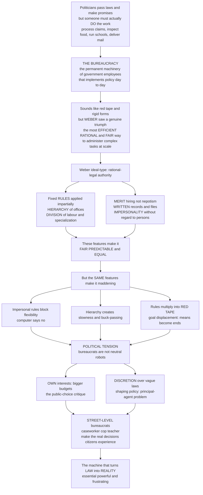

# 🏛️ Bureaucracy and Public Administration

> [!abstract] TL;DR
> **Public administration** is the implementation of government policy — the management of the programs and agencies that turn a passed law into a delivered service — and **bureaucracy** is its characteristic organizational form: hierarchical, rule-bound, and staffed by permanent, merit-hired officials. Max **Weber** saw the bureaucratic machine not as a curse but as a *triumph*: the most technically efficient, rational, and above all **fair** way ever devised to administer complex tasks at scale, because its impartial **rules**, **hierarchy**, **merit** hiring, written records, and impersonal treatment "without regard to persons" replaced the arbitrary rule of kings and cronies with predictability and equal treatment. Yet the very features that make bureaucracy fair make it maddening — impersonal rules block flexibility, hierarchy breeds slowness, and rules multiply into **red tape** — while bureaucrats' own interests (Niskanen's budget-maximizing) and wide **discretion** over vague statutes mean the "unelected" administrative state quietly shapes policy, raising the enduring **principal-agent** problem of how elected officials control the experts who actually run things, and placing real power in the hands of the **street-level bureaucrats** citizens actually meet. This note opens the vault's section on governance and implementation.

---

## Intuition

**Analogy — the machine that turns law into reality.** Politicians make grand promises and pass laws — but a law is just words on paper until *someone actually does the work*. Someone has to process the benefit claims, inspect the food, run the schools, deliver the mail, staff the agencies, answer the phones, and stamp the forms. That someone is the **bureaucracy**: the vast, permanent machinery of government employees who implement policy day to day. "Bureaucracy" is almost a swear word — we picture red tape, rigid rules, and soul-crushing forms — but Max Weber, who first analyzed it, saw a genuine triumph: the most **efficient, rational, and fair** way ever devised to administer complex tasks at scale.

Here is the twist that makes the whole subject fascinating. Weber's *ideal* bureaucracy has beautiful features, each designed to replace the whim of kings and the favours of cronies: fixed **rules** applied impartially (so you are treated the same as everyone else, not by mood or bribe), a clear **hierarchy** (chains of command and accountability), a specialized **division of labour**, **merit-based** hiring (not nepotism), **written records**, and **impersonality** — decisions made "without regard to persons," the same rules for the powerful and the poor. These features are *exactly why* bureaucracy is fair and predictable. But the very same features that make it fair make it infuriating: the impersonal rules that prevent favouritism also prevent flexibility (you cannot get an exception even when you clearly deserve one — "computer says no"); the hierarchy that ensures accountability also creates slowness and buck-passing; the rules that ensure consistency also multiply into red tape. There is also a deep *political* tension — bureaucrats are not neutral robots executing orders. They have their **own interests** (bigger budgets, more staff, job security) and enormous **discretion** in interpreting vague laws, so the unelected bureaucracy quietly makes policy. And at the very bottom, the **street-level bureaucrats** — the caseworker, the cop, the teacher — make the real decisions that *are* the policy as ordinary citizens experience it. To understand bureaucracy is to understand the machine that turns law into reality, and why that machine is simultaneously essential, powerful, and frustrating.

---

## How It Works

### Core mechanics

1. **From policy to administration.** A statute states *intent*; administration supplies *action*. The transition from deciding (policy) to doing (administration) is where most of what government actually *is* takes place — and where most policies succeed or quietly fail. The classical **Wilson dichotomy** proposed a clean split between *politics* (choosing goals) and *administration* (neutrally executing them); a century of scholarship has shown the line is blurred, because administrators constantly make value-laden choices.
2. **Weber's ideal-type bureaucracy.** As the purest form of **rational-legal authority**, Weber's bureaucracy is defined by six interlocking features: (a) fixed **jurisdictional rules** and official competencies; (b) a **hierarchy** of offices; (c) management by **written documents** and files; (d) **specialized training** and division of labour; (e) full-time **career** officials; and (f) rule-following conducted *sine ira et studio* — "without anger or bias," impersonally. Together these make the office separate from the officeholder and the treatment of cases impersonal — the engine of fairness and equal treatment that displaced patronage and patrimonialism.
3. **The pathologies.** Robert **Merton** showed the same rules produce **goal displacement**: means become ends, so following the procedure correctly matters more than actually helping anyone. Add **red tape**, rigidity, slowness, buck-passing, Parkinson's Law ("work expands to fill the time available"), and the Peter Principle ("people rise to their level of incompetence"), and the fairness-producing machine becomes the frustration-producing machine — the same features, seen from the other side.
4. **The politics of the machine.** Bureaucrats are actors with interests. The **public-choice** view (Niskanen) models the **budget-maximizing bureau** that over-supplies output because bigger budgets mean status, security, and staff. Because statutes are vague, agencies wield **discretion** that amounts to policymaking. This creates the **principal-agent problem**: elected "principals" must control bureaucratic "agents" who hold expertise and private information — via oversight that is either constant "police patrols" or citizen-triggered "fire alarms."
5. **Street level.** Michael **Lipsky** showed that front-line workers — police, teachers, caseworkers, benefit clerks — exercise discretion under chronic resource constraints. Their coping routines (rationing, creaming, rule-bending) effectively *make* policy as citizens experience it. The statute is abstract; the caseworker is the state.

### Flow / Architecture



---

## Key Concepts

### Secondary

- **Public administration** — the everyday work of *running* the government: managing the agencies, programs, and public servants who deliver what laws promise. It is the "doing" that follows the "deciding."
- **Bureaucracy** — the organizational form of that work: layers of offices, written rules, and permanent staff who process cases according to procedure rather than personal favour.
- **Why rules feel fair *and* frustrating** — the same impersonal rule that stops an official from giving your rival special treatment also stops the official from bending the rule when *you* deserve an exception. Fairness and flexibility trade off.
- **Merit vs spoils** — jobs won by qualification and exams (the **civil service**) versus jobs handed out as political rewards (the **spoils system**). Merit is the modern norm because it curbs corruption and builds competence.
- **Street-level bureaucrats** — the government workers you actually meet: the benefits clerk, the police officer, the teacher, the passport officer. Their on-the-spot choices are, for you, what "the policy" really is.

### Undergraduate

- **Weber's ideal type** — bureaucracy as the purest expression of **rational-legal authority**, defined by fixed jurisdictional rules, hierarchy, written files, specialized training, career officials, and impersonal rule-following (*sine ira et studio*). Weber's claim: it is *technically superior* to every earlier form of administration — the reason it spread everywhere.
- **The iron cage** — Weber's warning that bureaucratic rationalization, once dominant, becomes an inescapable "iron cage" (*stahlhartes Gehäuse*) that traps modern life in calculated efficiency and disenchantment even as it delivers order.
- **Bureaucratic dysfunctions** — **goal displacement** (Merton: rule-following becomes the goal), **red tape**, **bureaupathology**, over-conformity, and rigidity. The mechanisms that guarantee consistency also produce inflexibility; the accountability of hierarchy also produces slowness and buck-passing.
- **The politics-administration dichotomy** — Woodrow **Wilson's** foundational claim (1887) that administration is a neutral, business-like execution of politically decided ends. Its later **critique** (Waldo, Appleby): administrators inescapably exercise judgment, values, and power, so the dichotomy is a useful ideal but a false description.
- **Bureaucratic discretion** — because statutes are written broadly, agencies must fill in the details, effectively *making* policy when they implement it. Discretion is unavoidable and is where much real governance lives.
- **State capacity** — the administrative muscle to actually collect taxes, enforce rules, and deliver services. Weak capacity is why "good" policies fail in practice; strong, professional bureaucracies are a hallmark of effective states.

### Graduate

- **The principal-agent problem** — elected "principals" (legislators, ministers) delegate to bureaucratic "agents" who hold **expertise** and **private information** and may pursue their own goals. Control mechanisms trade off cost and coverage: continuous **"police-patrol"** oversight versus decentralized, citizen-triggered **"fire-alarm"** oversight (McCubbins and Schwartz). The core tension is **political control vs bureaucratic autonomy** — and neutral competence versus democratic responsiveness.
- **Public choice and the budget-maximizing bureau** — William **Niskanen's** model: a monopoly bureau with an information advantage over its sponsor maximizes its *budget* (a proxy for salary, perks, and power) rather than social welfare, systematically **over-supplying** output — in the classic result, up to *twice* the efficient level, dissipating all social surplus. This grounds the "empire-building," rent-seeking critique of the administrative state.
- **Capture and iron triangles** — agencies can be "captured" by the very interests they regulate; stable **iron triangles** (agency + legislative committee + interest group) and looser **policy networks** entrench who benefits, blurring the line between regulator and regulated.
- **Representative bureaucracy** — the theory (Kingsley, Mosher) that a civil service demographically mirroring the public will produce more legitimate and responsive outcomes; *passive* representation (who staff are) can translate into *active* representation (whose interests are served) through street-level discretion.
- **The administrative state and its legal control** — the vast rule-making apparatus of modern agencies, disciplined by **administrative law** (notice-and-comment, judicial review, delegation doctrine). The enduring democratic dilemma: how to hold an "unelected" but indispensable expert bureaucracy accountable without crippling it.
- **Reform traditions** — the arc from **classical public administration** (Weber, Wilson, Taylorist "principles") → **New Public Management** (markets, competition, performance metrics, "run government like a business") → **new governance / collaborative** and networked approaches → **digital government** and algorithmic administration. Each wave re-answers the same question: how to keep the machine both *effective* and *accountable*.

---

## Python Demo

```python
# Two quantitative pictures of why bureaucracy is fair AND frustrating,
# and why it can grow beyond the socially efficient size.
#
#   (a) RULES vs DISCRETION -- the red-tape trade-off. As procedures grow
#       more rigid, CONSISTENCY/FAIRNESS rises (variance across identical
#       cases falls) but RESPONSIVENESS/SPEED falls (unusual cases get worse
#       service). Overall performance -- which needs BOTH -- peaks at an
#       intermediate level of rigidity: some rules good, too many bad.
#
#   (b) NISKANEN'S BUDGET-MAXIMIZING BUREAU -- a self-interested bureau with
#       an information advantage expands output to where TOTAL benefit only
#       just equals TOTAL cost, roughly DOUBLE the efficient output where
#       MARGINAL benefit equals MARGINAL cost -- dissipating all surplus.
#
# Pure numpy + matplotlib.

import numpy as np
import matplotlib.pyplot as plt

# ----------------------------------------------------------------------
# (a) The rules-vs-discretion (red-tape) trade-off.
# ----------------------------------------------------------------------
rigidity = np.linspace(0, 1, 400)              # 0 = pure discretion, 1 = pure rules

fairness = 1 - np.exp(-3.2 * rigidity)         # consistency rises, saturates
responsiveness = np.exp(-2.6 * rigidity)       # speed/flexibility falls
eps = 1e-9
# performance needs BOTH -> harmonic mean peaks in the interior
performance = 2 * (fairness * responsiveness) / (fairness + responsiveness + eps)
best = rigidity[np.argmax(performance)]

fig, (ax1, ax2) = plt.subplots(1, 2, figsize=(13, 5.4))

ax1.plot(rigidity, fairness, lw=2.2, label="Fairness / consistency (up)")
ax1.plot(rigidity, responsiveness, lw=2.2, label="Responsiveness / speed (down)")
ax1.plot(rigidity, performance, lw=2.8, color="black",
         label="Overall performance (needs both)")
ax1.axvline(best, ls="--", color="green")
ax1.annotate("Sweet spot:\nsome rules, some discretion",
             xy=(best, performance.max()),
             xytext=(best + 0.06, performance.max() - 0.34),
             arrowprops=dict(arrowstyle="->"))
ax1.text(0.02, 0.04, "Pure discretion:\nfavouritism, arbitrariness",
         color="darkred", fontsize=8)
ax1.text(0.60, 0.04, "Pure rules:\nred tape, computer says no",
         color="darkred", fontsize=8)
ax1.set_xlabel("Procedural rigidity  (0 = discretion, 1 = rules)")
ax1.set_ylabel("Value (0 to 1)")
ax1.set_title("Why bureaucracy is fair AND frustrating")
ax1.legend(loc="center right", fontsize=8)
ax1.grid(alpha=0.3)

# ----------------------------------------------------------------------
# (b) Niskanen's budget-maximizing bureau.
#     Total benefit TB(Q) = a*Q - b*Q^2   (society's valuation, concave)
#     Total cost    TC(Q) = c*Q           (linear, constant marginal cost)
#     Efficient Q*  : marginal benefit = marginal cost -> a - 2bQ = c
#     Niskanen Q_n  : the bureau expands until TB(Q) = TC(Q)  (all surplus gone)
# ----------------------------------------------------------------------
a, b, c = 10.0, 0.5, 2.0
Q = np.linspace(0, 20, 400)
TB = a * Q - b * Q ** 2
TC = c * Q

Q_star = (a - c) / (2 * b)                 # efficient output (MB = MC)  -> 8
Q_nisk = (a - c) / b                        # Niskanen output (TB = TC)   -> 16

ax2.plot(Q, TB, lw=2.4, label="Total social benefit  TB(Q)")
ax2.plot(Q, TC, lw=2.4, label="Total cost  TC(Q)")
ax2.fill_between(Q, TC, TB, where=(TB > TC), alpha=0.15, color="green")

for Qv, lab, col in [(Q_star, "Efficient  Q*\n(MB = MC)", "green"),
                     (Q_nisk, "Niskanen  Q_n\n(TB = TC, budget maxed)", "darkred")]:
    ax2.axvline(Qv, ls="--", color=col)
    ax2.annotate(lab, xy=(Qv, a * Qv - b * Qv ** 2),
                 xytext=(Qv - 3.4, 60), fontsize=8, color=col,
                 arrowprops=dict(arrowstyle="->", color=col))

ax2.set_xlabel("Bureau output / budget  Q")
ax2.set_ylabel("Value (arbitrary units)")
ax2.set_title("The budget-maximizing bureau over-supplies")
ax2.legend(loc="lower center", fontsize=8)
ax2.grid(alpha=0.3)

plt.tight_layout()
plt.show()

print(f"(a) Overall performance peaks at rigidity ~ {best:.2f} -- "
      f"neither pure discretion nor pure rules.")
print(f"(b) Efficient output Q* = {Q_star:.1f}, "
      f"Niskanen output Q_n = {Q_nisk:.1f}  -> the bureau supplies "
      f"{Q_nisk / Q_star:.0f}x the efficient amount.")
```

The left panel makes the analogy quantitative: fairness (consistency across identical cases) *rises* with procedural rigidity, while responsiveness (speed and flexibility on unusual cases) *falls* — and because good administration needs both, overall performance peaks at an intermediate mix, not at pure rules or pure discretion. The right panel gives the public-choice punchline: a self-interested bureau that knows more than its sponsor pushes output out to where total benefit only just covers total cost — here `Q_n = 16`, exactly twice the efficient `Q* = 8` — so the entire social surplus (the green wedge) is dissipated by empire-building.

---

## Real-World Applications

- **The tax authority (IRS, HMRC).** The paradigm Weberian machine: millions of taxpayers processed by fixed rules "without regard to persons," which is precisely what makes the system fair — and precisely what makes it feel rigid when your genuinely unusual situation does not fit any form field. State capacity to tax is the fiscal foundation of every other policy.
- **Welfare and benefits administration.** Lipsky's original terrain: caseworkers deciding eligibility under time and budget pressure ration attention, "cream" easier cases, and bend or enforce rules — so the lived reality of social policy is set at the counter, not in the statute. Same law, very different outcomes by office and worker.
- **Regulatory agencies (FDA, EPA, financial regulators).** Congress writes broad statutes; agencies fill them with binding rules — the discretion that turns implementation into policymaking, and the arena where **regulatory capture** and iron triangles are studied.
- **Policing and schools.** The officer's decision to arrest or warn, the teacher's decision to refer or overlook — high-discretion, low-visibility choices by street-level workers that *are* criminal-justice and education policy for the citizen in front of them.
- **Digital and algorithmic government.** Estonia's e-services and modern benefits portals push Weberian impersonality to its logical end — rules encoded in software. This can slash red tape *or* harden "computer says no" into an appeal-proof wall, moving discretion from the caseworker to the (often opaque) algorithm.

---

## Common Pitfalls

- **Treating "bureaucracy" as a pure insult.** The pejorative hides Weber's point: the impersonal, rule-bound machine is *why* you are treated the same as the powerful and the poor. Dismantle it carelessly and you often get not freedom but the return of favouritism and patronage.
- **Assuming implementation is automatic.** The gap between a statute and an outcome — under-funded agencies, misaligned incentives, street-level rationing — is where most "good" policies actually die. Design without administrative capacity is wishful thinking.
- **Ignoring bureaucratic self-interest.** The naive model treats officials as neutral executors. Public choice insists they have budgets to grow and jobs to protect; ignoring this leaves you blind to empire-building, over-supply, and gaming of performance metrics.
- **Over-controlling the agents.** Reacting to discretion with ever-more rules and monitoring produces goal displacement, defensive box-ticking, and *more* red tape — degrading the very competence oversight was meant to secure. The principal-agent cure can be worse than the disease.
- **Forgetting the street level.** Reformers rewrite the statute and declare victory, but the policy citizens experience is made by the caseworker and the cop. Change that ignores front-line discretion, workload, and incentives changes the paper, not the reality.
- **Confusing efficiency with accountability.** New Public Management's "run it like a business" can boost speed while eroding the impartiality, records, and due process that make public administration *legitimate*. The public sector's product is partly *fairness itself*, which markets do not price.

---

## Related Concepts

Cross-vault anchors (Glob-verified files elsewhere in the vault):

- [[Regulatory_Politics_and_Administrative_Law]] — the regulatory arm of the administrative state, where discretion, capture, and the principal-agent problem play out under legal control.
- [[State_Formation_and_Political_Development]] — the rise of the modern merit-based civil service and *state capacity*, the administrative muscle without which policy cannot land.
- [[Political_Institutions_and_Constitutions]] — the constitutional machinery that authorizes, delegates to, and constrains the bureaucracy.
- [[Policy_Analysis_and_the_Policy_Process]] — situates administration as the *implementation* stage of the policy cycle this note deepens.
- [[Political_Economy_and_Market_State_Relations]] — the state-versus-market frame within which the public-choice critique of the bureau is argued.
- [[Work_Organizations_and_Bureaucracy]] — the sociology of Weber's bureaucracy, the iron cage, Taylorism, and modern organizational control.
- [[Classical_Sociological_Theory]] — Weber's rationalization and rational-legal authority, the theoretical root of the bureaucratic ideal type.
- [[Organizations_and_Formal_Structures]] — formal hierarchy, division of labour, and institutional isomorphism as general features of organizations, of which public bureaucracy is one case.
- [[Engineering_Organization_Design]] — the same hierarchy-versus-autonomy and coordination trade-offs seen inside modern technical organizations.
- [[Signaling_Games]] — the game-theoretic backbone of the principal-agent problem: action under asymmetric information and private effort.

Within this vault (siblings in the governance-and-implementation arc, built or to be built): this note opens onto *Public_Policy_and_Governance_Overview* (the hub), *Policy_Implementation_and_Governance* (the delivery gap and implementation research), *Public_Management_and_Performance* (New Public Management and performance regimes), *Public_Choice_and_Political_Economy* (Niskanen, rent-seeking, and the economics of politics), and *Corruption_Accountability_and_Transparency* (the accountability of the unelected state).

---

## Review Questions

1. **(Secondary)** Bureaucracy is often used as an insult, yet Weber called it a triumph. Give one everyday example where a bureaucratic rule treated you *fairly* (the same as everyone else) and one where the same rule was *frustrating* (no exception when you deserved one), and explain why both come from the *same* feature.
2. **(Undergraduate)** A benefits agency wants to cut errors, so it adds ten new verification steps to every claim. Using the rules-versus-discretion trade-off, explain what improves, what gets worse, and how a street-level caseworker is likely to *cope* with the new workload — and how that coping quietly reshapes the policy citizens actually receive.
3. **(Graduate)** "The problem of the administrative state is not incompetence but control." Using the principal-agent framework, Niskanen's budget-maximizing bureau, and the police-patrol-versus-fire-alarm distinction, evaluate how elected officials can discipline an expert bureaucracy that holds private information — and explain why *more* monitoring can make outcomes worse rather than better.

---

## Sources

- Max Weber, *Economy and Society* (University of California Press) — the ideal-type of bureaucracy and rational-legal authority, "without regard to persons," and the iron cage.
- James Q. Wilson, *Bureaucracy: What Government Agencies Do and Why They Do It* (Basic Books, 1989) — how real agencies behave, tasks, discretion, and the limits of the market model.
- Michael Lipsky, *Street-Level Bureaucracy: Dilemmas of the Individual in Public Services* (Russell Sage, 1980; 2010 ed.) — front-line discretion and coping as de facto policymaking.
- William A. Niskanen, *Bureaucracy and Representative Government* (Aldine-Atherton, 1971) — the budget-maximizing bureau and the public-choice critique.
- Mathew D. McCubbins and Thomas Schwartz, "Congressional Oversight Overlooked: Police Patrols versus Fire Alarms," *American Journal of Political Science* 28(1), 1984 — mechanisms of political control over bureaucracy.

---

#public-policy #bureaucracy #public-administration #weber #street-level-bureaucracy
