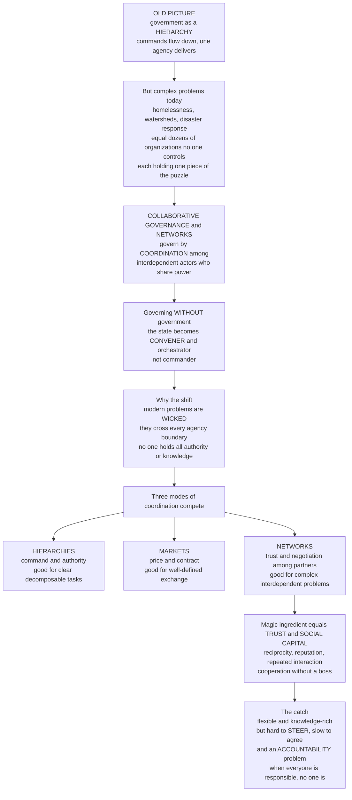

# 🕸️ Collaborative Governance and Networks

> [!abstract] TL;DR
> For most of modern history we pictured government as a **HIERARCHY**: commands flow down from the top and a single agency delivers a service. But look at how any complex problem is actually tackled today — homelessness, watershed management, opioid addiction, disaster response — and you find something completely different: **dozens of organizations** (city agencies, non-profits, businesses, federal grants, community groups, hospitals) that **no one controls**, each holding a piece of the puzzle, having to **work together** to get anything done. This is the world of **collaborative governance** and **policy networks** — governing not by command but by **coordination among interdependent actors who share power**, a shift captured by the phrase **"governing WITHOUT government."** The state becomes less the commander and more the **CONVENER, orchestrator, and partner**. Three modes of coordination compete: **hierarchies** (command — good for clear tasks), **markets** (price/contract — good for well-defined exchange), and **networks** (trust and negotiation — good for complex, interdependent problems). The magic ingredient that makes networks work is not authority but **TRUST and SOCIAL CAPITAL** — reciprocity, reputation, and repeated interaction that let independent parties cooperate without a boss. The catch is real: networks tap distributed knowledge and flex, but they are devilishly hard to **STEER** (no one is in charge), **slow** (everyone must agree), and — most seriously — they create an **ACCOUNTABILITY problem**: when everyone is responsible, no one is.

---

## Intuition

**Analogy — from an orchestra with a conductor to a jazz ensemble with none.** Old-fashioned government was a symphony orchestra: a conductor at the front (the minister), a printed score (the law), and each section playing exactly its assigned part on cue. Command flowed from the podium; a single, unified body produced the sound. Now watch how a city actually fights homelessness. There is no podium. Instead there is a **jazz ensemble** — a housing agency, a mental-health clinic, a food bank, a landlord association, a police outreach unit, three charities, and a federal grant office — none of whom the others employ, each improvising off the others in real time, listening and adjusting, held together not by a conductor's baton but by a groove of **mutual trust** built over years of playing together. No one is "in charge," yet music emerges. That is collaborative governance: coordination without command.

Why did the conductor disappear? Because modern problems are **"wicked"** — they cross the boundaries of every single agency, and no one organization has the authority, resources, or knowledge to solve them alone. Homelessness is at once a housing problem, a health problem, an addiction problem, an income problem, and a criminal-justice problem; no ministry "owns" it. When the puzzle pieces are scattered across many hands, the only way to see the whole picture is to get those hands to **cooperate**. The state's role morphs from *doing* the work to **convening the people who can**. The gift of the jazz ensemble is adaptation and distributed genius; its curse is that when the music falls apart, it is genuinely unclear whose fault it was — the "problem of many hands."

---

## How It Works

### Core Mechanics

**1. From government to governance.** The twentieth-century model was the sovereign, hierarchical **state**: a bureaucracy that made policy and delivered it through its own chain of command. Since the 1980s that model has been "hollowed out." Fiscal limits, privatization, the rise of a large **third sector** (non-profits, NGOs), and above all the sheer **complexity** of problems pushed delivery *outward and downward* — to contractors, partnerships, and networks. Political scientist **R.A.W. Rhodes** named the result **"governing without government"**: policy is now made and delivered by **self-organizing, interdependent networks** that the state can influence but not command. The state does not vanish; it changes job — from **doer** to **convener, orchestrator, and meta-governor**.

**2. Three modes of coordination.** Society has exactly three ways to coordinate action, and every governance arrangement mixes them:
   - **Hierarchies** coordinate by **authority** — a boss issues commands (the bureaucracy). Fast, clear, accountable; but rigid and blind to what the center cannot see.
   - **Markets** coordinate by **price and contract** — parties exchange voluntarily (competitive tendering, outsourcing). Efficient for well-defined, arms-length exchange; but poor where trust, adaptation, and non-contractible quality matter.
   - **Networks** coordinate by **trust, reciprocity, and negotiation** among interdependent partners (Walter Powell's *"neither market nor hierarchy"*). Flexible, knowledge-rich, good at complex problems; but slow and hard to steer.
   The insight is that each mode **fits different tasks**, and real governance is a **hybrid** — with the state doing **"meta-governance,"** choosing and tuning the mix.

**3. Collaborative governance proper.** This is the deliberate arrangement where public agencies bring **non-state stakeholders** (business, non-profits, communities, citizens) into **collective, consensus-oriented, deliberative** decision-making — and often into **co-production** of the service itself. **Ansell & Gash's** influential model describes a cycle: **starting conditions** (power/resource asymmetries, prior history), **institutional design** (ground rules, who is at the table), and **facilitative leadership** feed a **collaborative process** that spirals through **face-to-face dialogue → trust-building → commitment → shared understanding → intermediate outcomes** and back around. Trust is not a precondition you assume; it is an **output you must slowly grow**.

**4. Policy networks as structure.** Around any policy area sits a **web of interdependent actors** — a *policy community* (tight, stable, insider) or a looser *issue network* (open, fluid). We can analyze this web with **network science**: actors are **nodes**, relationships are **ties**, and metrics reveal who matters — **degree centrality** (who is most connected), **betweenness / brokers** (who bridges otherwise separate clusters), and **structural holes** (gaps a broker profits by spanning). The actor with high betweenness is the **boundary-spanner** who holds the network together; remove them and it fragments.

**5. Trust and social capital as the currency.** Because no one can *command* the others, networks run on **social capital** — **Robert Putnam's** term for the norms and networks (reciprocity, reputation, repeated interaction) that enable cooperation. Trust substitutes for authority: I keep my promises today because we will meet again tomorrow and my reputation is on the line. This is exactly the logic of **repeated games** — cooperation is sustainable when the shadow of the future is long, and collapses when interactions are one-shot.

**6. The steering and accountability problems.** Networks buy flexibility at a price. **Steering** is hard — you cannot order a network you do not control ("herding cats"); the best the state can do is **meta-govern** (set the frame, fund, convene, arbitrate). Worse is the **accountability deficit**: when a network fails, **who is answerable?** Responsibility is diffused across many organizations — the **"problem of many hands"** — so democratic accountability, transparency, and blame all blur. Add power imbalances (stronger partners capture the process), transaction costs, and slowness, and the trade-off is stark: **flexibility and inclusion versus accountability and decisiveness.**

### Flow / Architecture



---

## Key Concepts

### Secondary (the big picture)
- **Command vs coordination.** Old government gave *orders* down a hierarchy; modern governance *coordinates* many independent organizations that no one bosses.
- **Why the change.** Big problems (homelessness, climate, disasters) cross every agency's boundary, and no single body has all the money, power, or knowledge — so they must **team up**.
- **The state as convener.** Government becomes the one who **brings people to the table** and keeps them talking, not the one who does all the work — "governing without government."
- **Trust is the glue.** With no boss, partners cooperate because they trust each other, expect to meet again, and care about their reputation.
- **The downside.** Networks are flexible but slow, hard to steer, and when they fail it is unclear **who to blame** — because everyone is a little bit responsible.

### Undergraduate (the mechanisms)
- **The three coordination modes:** **hierarchy** (authority), **market** (price/contract), **network** (trust/negotiation) — Powell's *"neither market nor hierarchy."* Each suits different tasks; real systems are **hybrids**.
- **Ansell & Gash collaborative-governance model:** starting conditions → institutional design + facilitative leadership → the collaborative process cycle of **trust-building → commitment → shared understanding → outcomes**. Trust is *produced*, not assumed.
- **Policy-network typology:** tight, stable **policy communities** vs open, fluid **issue networks**; the older **iron triangle**; and the **Advocacy Coalition Framework** (from [[Theories_of_the_Policy_Process]]) as coalitions inside a subsystem.
- **Network analysis of governance:** nodes and ties; **degree centrality**, **betweenness / brokers**, **structural holes**, **density** — identifying the **boundary-spanner** who bridges clusters.
- **Social capital (Putnam):** norms and networks (reciprocity, reputation, repeated interaction) that make cooperation possible — the substitute for formal authority.
- **Public–private partnerships (PPPs) and co-production:** contracting and citizen co-creation of services as concrete network forms.

### Graduate (frontiers and tensions)
- **Meta-governance:** the state's second-order role of "**governing the governance**" — choosing the coordination mix, setting frames, funding, convening, and arbitrating without direct command (Jessop, Sørensen & Torfing). How do you steer what you don't control?
- **The accountability deficit and the "problem of many hands":** diffused responsibility across a network dissolves the clear chain that democratic accountability requires; debates over **network accountability**, transparency, and legitimacy (input vs output vs throughput legitimacy).
- **Collaborative advantage vs collaborative inertia** (Huxham & Vangen): the gap between the *promise* of synergy and the *reality* of exhausting, slow, conflict-prone joint working; when collaboration is worth its transaction costs.
- **Power, capture, and exclusion within networks:** consensus can mask domination; well-resourced insiders shape the agenda and the "table" itself, raising equity and democratic-legitimacy concerns.
- **The interdependence engine:** why networks form at all — **resource dependence** (Rhodes) and the game-theoretic logic that repeated interaction plus reputation sustains cooperation (folk theorems), while one-shot settings collapse to defection.

---

## Python Demo

```python
# Collaborative Governance and Networks -- three computational pictures
#
# (a) COORDINATION MODES: performance of a HIERARCHY (a central coordinator
#     with limited local knowledge) vs a NETWORK (distributed actors sharing
#     information and adapting) as problem INTERDEPENDENCE/COMPLEXITY rises.
#     Hierarchy wins on simple, decomposable tasks; the network wins on
#     complex, interdependent "wicked" ones -- there is a crossover.
#
# (b) TRUST / COOPERATION EMERGENCE: replicator dynamics on a cooperation
#     game. With REPEATED interaction + reputation (long shadow of the future)
#     cooperation stabilises; in a ONE-SHOT world it collapses to defection.
#
# (c) POLICY-NETWORK STRUCTURE: a small web of actors; Brandes betweenness
#     identifies the BROKER / boundary-spanner who holds the network together.

import numpy as np
import matplotlib.pyplot as plt

# ---------- (a) Hierarchy vs network performance vs complexity ----------
c = np.linspace(0.0, 1.0, 400)                 # normalized problem interdependence
# Hierarchy: excellent on decomposable tasks, collapses as interdependence rises
# (a single coordinator cannot see or process all the cross-links).
perf_hierarchy = np.exp(-2.5 * c)
# Network: pays a fixed coordination/consensus OVERHEAD, but its distributed
# information integration scales with interdependence.
integration = 1.0 - np.exp(-3.0 * c)
perf_network = 0.25 + 0.70 * integration
crossover = c[np.argmin(np.abs(perf_hierarchy - perf_network))]

# ---------- (b) Cooperation: repeated/reputation vs one-shot ----------
# Prisoner's-dilemma payoffs: T > R > P > S
T, R, P, S = 5.0, 3.0, 1.0, 0.0
steps, dt = 300, 0.05

def cooperation_path(w, x0=0.35):
    """Replicator dynamics for cooperation fraction x under continuation
    probability w (w=0 -> one-shot; w high -> long shadow of the future)."""
    x = np.zeros(steps); x[0] = x0
    disc = 1.0 / (1.0 - w)                       # expected repetitions
    for k in range(1, steps):
        xi = x[k-1]
        # Reciprocators cooperate with cooperators over the whole relationship,
        # punish defectors after one round; defectors exploit once then face P.
        pi_C = xi * (R * disc) + (1 - xi) * (S + w * P * disc)
        pi_D = xi * (T + w * P * disc) + (1 - xi) * (P * disc)
        x[k] = xi + dt * xi * (1 - xi) * (pi_C - pi_D)   # replicator equation
        x[k] = min(max(x[k], 0.0), 1.0)
    return x

coop_repeated = cooperation_path(w=0.80)         # trust can be sustained
coop_oneshot  = cooperation_path(w=0.00)         # trust collapses

# ---------- (c) Policy network + betweenness (Brandes) ----------
labels = ["City\nagency", "Federal\ngrant", "Health\ndept",
          "CONVENER\n(broker)", "NGO", "Business", "Community\ngroup", "Hospital"]
pos = np.array([[-2.0, 1.0], [-2.7, 0.0], [-2.0, -1.0], [0.0, 0.0],
                [2.0, 1.0], [2.7, 0.5], [2.7, -0.5], [2.0, -1.0]])
edges = [(0,1),(1,2),(0,2),                       # government cluster
         (4,5),(5,6),(6,7),(4,7),(4,6),           # community cluster
         (0,3),(2,3),(4,3),(7,3)]                 # only the broker bridges them
n = len(labels)
A = np.zeros((n, n), dtype=int)
for i, j in edges:
    A[i, j] = A[j, i] = 1

def betweenness(A):
    n = A.shape[0]; bc = np.zeros(n)
    for s in range(n):
        dist = -np.ones(n); sigma = np.zeros(n); preds = [[] for _ in range(n)]
        dist[s] = 0; sigma[s] = 1; queue = [s]; order = []
        while queue:
            v = queue.pop(0); order.append(v)
            for w in np.where(A[v] == 1)[0]:
                if dist[w] < 0:
                    dist[w] = dist[v] + 1; queue.append(w)
                if dist[w] == dist[v] + 1:
                    sigma[w] += sigma[v]; preds[w].append(v)
        delta = np.zeros(n)
        for w in reversed(order):
            for v in preds[w]:
                delta[v] += (sigma[v] / sigma[w]) * (1 + delta[w])
            if w != s:
                bc[w] += delta[w]
    return bc / 2.0                                # undirected: each pair twice

bc = betweenness(A)
broker = int(np.argmax(bc))

# ---------- Plots ----------
fig, ax = plt.subplots(1, 3, figsize=(16.5, 4.8))

ax[0].plot(c, perf_hierarchy, color="#b45309", lw=2.5, label="Hierarchy (command)")
ax[0].plot(c, perf_network,  color="#065f46", lw=2.5, label="Network (trust/negotiation)")
ax[0].axvline(crossover, color="gray", ls=":", lw=1.5)
ax[0].fill_between(c, 0, 1.05, where=c < crossover, color="#b45309", alpha=0.07)
ax[0].fill_between(c, 0, 1.05, where=c > crossover, color="#065f46", alpha=0.07)
ax[0].text(0.12, 0.95, "HIERARCHY\nwins", color="#b45309", ha="center", fontsize=9)
ax[0].text(0.82, 0.95, "NETWORK wins\n(wicked problems)", color="#065f46",
           ha="center", fontsize=9)
ax[0].set_xlabel("Problem interdependence / complexity")
ax[0].set_ylabel("Coordination performance")
ax[0].set_title("(a) Different modes fit different tasks")
ax[0].set_ylim(0, 1.05); ax[0].legend(loc="center left", fontsize=8)
ax[0].grid(alpha=0.25)

ax[1].plot(coop_repeated, color="#1e40af", lw=2.5,
           label="Repeated + reputation (trust sustains)")
ax[1].plot(coop_oneshot, color="#dc2626", lw=2.5,
           label="One-shot (trust collapses)")
ax[1].set_xlabel("Time (imitation of higher payoff)")
ax[1].set_ylabel("Fraction cooperating")
ax[1].set_title("(b) Trust is what makes a network hold")
ax[1].set_ylim(-0.02, 1.02); ax[1].legend(loc="center right", fontsize=8)
ax[1].grid(alpha=0.25)

for i, j in edges:
    ax[2].plot([pos[i,0], pos[j,0]], [pos[i,1], pos[j,1]],
               color="#94a3b8", lw=1.2, zorder=1)
sizes = 250 + 900 * (bc / bc.max())
colors = ["#f59e0b" if k == broker else "#3b82f6" for k in range(n)]
ax[2].scatter(pos[:,0], pos[:,1], s=sizes, c=colors, zorder=2,
              edgecolors="black", linewidths=0.8)
for k, lab in enumerate(labels):
    ax[2].annotate(lab, pos[k], ha="center", va="center", fontsize=6.5, zorder=3)
ax[2].set_title("(c) The BROKER holds the network together\n"
                "node size = betweenness centrality")
ax[2].axis("off")

plt.tight_layout()
plt.savefig("collaborative_governance_networks.png", dpi=120)

print(f"(a) Hierarchy-vs-network crossover at interdependence c = {crossover:.2f}")
print(f"(b) Final cooperation  repeated = {coop_repeated[-1]:.2f}   "
      f"one-shot = {coop_oneshot[-1]:.2f}")
print(f"(c) Broker (max betweenness) = node {broker} "
      f"'{labels[broker].replace(chr(10), ' ')}'  bc = {bc[broker]:.1f}")
```

**What it shows.** Panel (a) makes the "neither market nor hierarchy" claim concrete: the hierarchy is best for **simple, decomposable** tasks but its performance collapses as interdependence rises, while the network pays a fixed coordination overhead yet **overtakes** once the problem is complex enough — the crossover marks where wicked problems demand networks. Panel (b) is the engine of trust: with a **long shadow of the future** and reputation, reciprocators out-earn defectors and cooperation climbs, whereas in the **one-shot** world defection always pays more and cooperation collapses — exactly why networks run on repeated interaction. Panel (c) computes **betweenness centrality** on a two-cluster policy network and finds that the middle **convener** is the sole boundary-spanner whose removal would split government from community — the structural embodiment of the orchestrating state.

---

## Real-World Applications

> **Watershed and ecosystem governance (collaborative governance, textbook case).** Managing a river basin (the Chesapeake Bay Program, CALFED in California) is impossible by command: the water crosses farms, cities, factories, and several states, none of whom controls the others. What works is a standing collaborative — federal and state agencies, farmers, environmental NGOs, utilities, and scientists at one table — slowly building trust and shared data toward negotiated targets. Ansell & Gash's model was built substantially on exactly such natural-resource cases.

> **Disaster response as an emergent network.** After Hurricane Katrina or in COVID-19, no single agency delivered relief; FEMA, the National Guard, city agencies, the Red Cross, faith groups, Walmart's logistics, and mutual-aid volunteers self-organized into a dense response **network**. Failures were widely traced to weak **coordination and unclear accountability** across the many hands — the steering problem in its rawest form.

> **The "hollow state" in social services (PPPs and contracting).** In many welfare states, government funds but no longer *delivers*: employment services, foster care, and homelessness programs are contracted out to webs of non-profits and firms. The state becomes purchaser and **meta-governor** of a delivery network it does not staff — Milward & Provan's "hollow state," with all its measurement and accountability headaches.

> **Global climate governance without a world government.** There is no sovereign to command emissions cuts, so the regime is a sprawling **network** — the UNFCCC, national governments, cities (C40), corporations, and NGOs coordinating through pledges, monitoring, and reputation rather than authority. The Paris Agreement's "pledge and review" is governance-without-government at planetary scale, and its steering and accountability weaknesses are precisely the network's known pathologies.

---

## Common Pitfalls

- **Assuming trust can be ordered or assumed.** Trust is an **output** grown through repeated, face-to-face interaction, not an input you decree on day one. Collaboratives that skip the slow trust-building phase (Ansell & Gash's cycle) fracture at the first conflict.
- **Mistaking "no one in charge" for "no power."** Networks are not flat utopias. Well-resourced insiders shape who sits at the table and what counts as consensus — **capture and exclusion** hide beneath the language of partnership. Always ask *whose* voice the network amplifies and whose it silences.
- **Ignoring the accountability deficit.** Celebrating flexibility while forgetting the **problem of many hands** leaves no one answerable when the network fails. Designing accountability *in* (clear roles, transparency, a nameable lead) is as important as designing the collaboration.
- **Using a network where a hierarchy or market would do.** Networks are slow and costly. For a **clear, decomposable, urgent** task (evacuate a building; process a tax return), command or contract is better. Reserve networks for genuinely **complex, interdependent** problems — panel (a) of the demo.
- **Confusing consensus with legitimacy.** A network reaching agreement is not automatically democratically legitimate; the un-elected partners answer to no electorate. Deliberative quality, transparency, and a link back to elected authority are what confer legitimacy — not mere agreement.
- **Believing the state has disappeared.** "Governing without government" is a slogan, not a literal claim. The state still funds, frames, convenes, and arbitrates — it **meta-governs**. Forgetting this misses where real leverage over a network still lies.

---

## Related Concepts

**Cross-vault links (Glob-verified):**

- [[The_State_Markets_and_Governance]] — the foundational market–state–governance triad this note extends; it introduces the "third answer" (community and network governance) that this note develops into collaborative governance.
- [[Systems_Failure_and_Wicked_Problems]] — the *reason* networks are needed: wicked problems cross every organizational boundary and defy any single authority, forcing coordination among many actors.
- [[Network_Science_Fundamentals]] — supplies the formal toolkit (nodes, ties, centrality, density) for analyzing policy networks as graphs, including who the brokers are.
- [[Social_Capital_and_Trust]] — Putnam's norms-and-networks concept is the **currency** that lets networks cooperate without authority; the sociological engine behind panel (b).
- [[Repeated_Games_and_Folk_Theorems]] — the game-theoretic proof that cooperation is sustainable under a long shadow of the future and collapses when one-shot — the microfoundation of network trust.
- [[Theories_of_the_Policy_Process]] — advocacy coalitions, subsystems, and policy brokers are the policy-network dynamics that operate *inside* the arenas this note describes.

Within this vault, this note is the network-and-collaboration keystone of Section 04 and sits directly alongside its governance-and-implementation siblings (files to come): **Policy_Implementation_and_Governance** (networks are how policy actually gets delivered on the ground), **Bureaucracy_and_Public_Administration** (the hierarchy mode these networks complement and partly displace), **Federalism_and_Multilevel_Governance** (vertical networks across levels of government), **Public_Management_and_Performance** (the New Public Management and contracting agenda that hollowed the state), and **Corruption_Accountability_and_Transparency** (the accountability deficit and problem of many hands examined head-on).

---

## Review Questions

**Secondary.** Explain, using the orchestra-versus-jazz-ensemble analogy, the difference between governing by **command** and governing by **coordination**. Give one real problem (like homelessness or disaster relief) and name three different organizations that would have to work together to solve it, none of which controls the others.

**Undergraduate.** Powell called networks *"neither market nor hierarchy."* Define all three coordination modes and state, with reasons, which mode best fits (a) processing millions of tax returns, (b) buying office paper, and (c) reducing chronic homelessness in a city. Then explain why **trust** — not authority or price — is the coordinating mechanism in the third case, linking your answer to the logic of repeated interaction.

**Graduate.** Collaborative governance promises "collaborative advantage" but risks a serious **accountability deficit**. Using the "problem of many hands," explain *why* democratic accountability is harder in a governance network than in a traditional hierarchy. Then design two concrete institutional mechanisms — one improving accountability, one preserving the network's flexibility — and analyze the trade-off between them. Where does **meta-governance** by the state fit into your design?

---

## Sources

- Rhodes, R. A. W. (1996). ["The New Governance: Governing without Government."](https://onlinelibrary.wiley.com/doi/10.1111/j.1467-9248.1996.tb01747.x) *Political Studies*, 44(4), 652–667.
- Ansell, C. & Gash, A. (2008). ["Collaborative Governance in Theory and Practice."](https://academic.oup.com/jpart/article/18/4/543/1090370) *Journal of Public Administration Research and Theory*, 18(4), 543–571.
- Powell, W. W. (1990). ["Neither Market nor Hierarchy: Network Forms of Organization."](https://www.uzh.ch/cmsssl/suz/dam/jcr:ffffffff-fbd6-1538-0000-000006970744/11.10_powell_90.pdf) *Research in Organizational Behavior*, 12, 295–336.
- Putnam, R. D. (2000). *Bowling Alone: The Collapse and Revival of American Community.* Simon & Schuster. (Overview: [Social capital](https://en.wikipedia.org/wiki/Social_capital))
- Provan, K. G. & Kenis, P. (2008). ["Modes of Network Governance: Structure, Management, and Effectiveness."](https://academic.oup.com/jpart/article/18/2/229/955386) *Journal of Public Administration Research and Theory*, 18(2), 229–252.

---

#public-policy #collaborative-governance #policy-networks #governance-without-government #accountability
