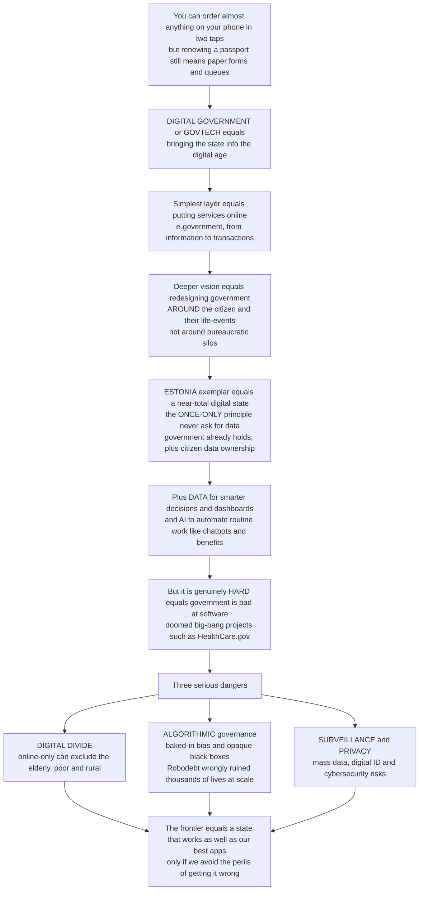

# 🏛️ Digital Government and GovTech

> [!abstract] TL;DR
> **Digital government** (or **GovTech**) is the ongoing, difficult effort to bring the state into the digital age — to make public services as easy, fast, and user-friendly as the best apps, and to use data and technology to govern better. At its simplest it means putting services online (**e-government**), but the deeper vision is **digital-era governance** (Dunleavy): redesigning government *around the citizen and their needs* rather than around bureaucratic silos. The transformative exemplar is **Estonia**, a near-total digital state built on shared data-exchange (X-Road) and digital ID, enforcing a brilliant **once-only principle** — the government may never ask you for information it already holds — while giving citizens ownership and visibility of their own data. Beyond services, it means using **data** for smarter decisions and **AI** to automate routine work. But it is genuinely *hard*: government's record of doomed "big bang" IT projects (HealthCare.gov, the UK NHS programme) is notorious. And it carries three serious dangers — the **digital divide** that excludes the very people who most need services, **algorithmic governance** risks of baked-in bias and opaque decisions that have wrongly ruined thousands of lives at scale (the Dutch child-benefits scandal, Australia's Robodebt), and threats to **privacy and security**.

---

## Intuition

**Analogy — the two-tap phone versus the paper-form queue.** You can order almost anything on your phone in two taps and have it on your doorstep tomorrow. The whole experience is designed around *you*: it remembers your address, it never makes you re-type what it already knows, it works at midnight from your sofa. Now try to renew a passport, apply for benefits, or file taxes. Too often that still means paper forms, long queues, and offices open only when you happen to be at work — and the tenth form asking for the same name and address the government already has on file nine times over. **Digital government is the effort to close that gap** — to make dealing with the state feel like the best app you use, not the worst.

The shallow version is just "put the forms online" (e-government). The deep version is more radical: stop organizing services around the *agency's* internal boxes ("Department of This," "Bureau of That") and start organizing them around a *citizen's life event* — having a baby, losing a job, starting a company. Estonia is the poster child: you can vote, sign legally binding documents, and register a company in minutes, entirely online, and the state is *forbidden* from asking you for data it already holds. That is the promise. The peril is that the same digitization can quietly abandon the elderly and the poor who cannot get online, and that an automated system making millions of decisions can bake in bias and err at a scale no human bureaucracy ever could.

---

## How It Works

### Core mechanics

1. **The evolution: e-government → digital government → data-and-AI government.** The first wave, **e-government**, simply moved information and then transactions online (a website, then an online form). The second wave, **digital-era governance** (Dunleavy, Margetts, and colleagues), is a shift in the *operating model*, not just the channel: **reintegration** of fragmented services, **needs-based holism** (organizing around the citizen's whole situation), and pervasive **digitization** of administrative processes. The third wave adds **data-driven and AI-enabled** government: analytics for policy, and automation of routine decisions.

2. **Citizen-centric redesign and platforms.** Modern practice starts from **user research and service design** — mapping real user needs and *life events* rather than org charts. The pioneering models are the UK's **Government Digital Service (GDS / GOV.UK)** and the US **Digital Service / 18F**. The organizing idea is **government-as-a-platform**: build shared reusable components (identity, payments, notifications) exposed as **APIs**, so agencies compose services instead of rebuilding everything, and data interoperates across silos.

3. **The once-only principle and data sharing.** A citizen should provide any piece of information to the state *once*, after which agencies share it among themselves (with safeguards). Estonia realizes this through **X-Road**, a secure data-exchange layer, plus a universal **digital ID**, near-total online services, **e-Residency**, and — crucially — **citizen visibility**: you can see who accessed your data and when. This flips ownership toward the citizen.

4. **Data and AI in government.** Beyond services, digital government means **open data** and transparency, **analytics** for evidence-based operations, and **automation** — chatbots, robotic process automation, and **automated decision-making** for fraud detection, benefits eligibility, and risk scoring — promising efficiency and personalization.

5. **Why it is hard, and the risks.** Government is famously bad at building software: monolithic **"big bang"** procurements clash with iterative technology, producing late, over-budget failures. The shift is toward **agile, modular delivery** and in-house capacity. And three dangers loom over the whole enterprise: the **digital divide** (exclusion), **algorithmic governance** harms (bias, error at scale, opacity, loss of due process), and **surveillance / privacy / security** risks of a data-rich state.

### Flow / Architecture



---

## Key Concepts

### Secondary

- **E-government** — putting government information and services online: a website you can read, then a form you can actually submit without visiting an office.
- **Digital government / GovTech** — the bigger effort to make dealing with the state as easy as the best app, and to use data and technology to run government better.
- **The once-only principle** — you should only have to give the government a piece of information *once*; after that it should reuse what it already has instead of making you fill the same form again and again.
- **The digital divide** — the gap between people who can easily use online services and those who cannot (no internet, no device, no confidence). Moving services online can leave the second group behind.
- **Estonia** — the country that made almost everything digital: voting, signing documents, and starting a company online in minutes, with citizens able to see who looked at their data.

### Undergraduate

- **Digital-era governance (DEG)** — Dunleavy and Margetts' successor to New Public Management: **reintegration** of splintered services, **needs-based holism** (organize around the citizen's situation), and deep **digitization** that changes the operating model, not merely the delivery channel.
- **Government-as-a-platform** — build shared, reusable components (identity, payments, notifications) exposed via **APIs** and standards, so services are composed rather than rebuilt; drives interoperability and lowers the cost of new services.
- **Service design and GDS/USDS** — user research organized around **life events**, iterative prototyping, and design standards, pioneered by the UK's GOV.UK / Government Digital Service and the US Digital Service and 18F.
- **Digital identity and X-Road** — a trusted digital ID plus a secure data-exchange layer let agencies verify people and share data safely, the technical backbone of the once-only principle (Estonia's model).
- **Automated decision-making (ADM)** — rules-based or ML systems that decide or heavily shape consequential outcomes (benefits, fraud flags, risk scores); the efficiency payoff and the accountability hazard live here.
- **Digital-by-default vs assisted digital** — a policy choice: make online the primary channel, but retain **assisted-digital and offline** routes so the excluded are not shut out — the core equity design decision.

### Graduate

- **The digital transformation debate** — Mergel, Edelmann, and Haug distinguish *digitization* (analog to digital), *digitalization* (process change), and *digital transformation* (a holistic redesign of the organization, its culture, and its relationship to citizens); most "digital government" programs stall at the first two.
- **Algorithmic governance and error at scale** — automated systems inherit and amplify bias from training data and proxies; applied to whole populations, even a *small* false-positive rate becomes a *mass* harm. Australia's **Robodebt** (automated income-averaging that raised unlawful debts against hundreds of thousands) and the Dutch **toeslagenaffaire** (a fraud-detection algorithm that wrongly accused tens of thousands of families, disproportionately minorities) are the canonical failures; both combined error at scale with **opacity** and the loss of contestability and due process.
- **Contestability, automation bias, and the "black box"** — legitimate administrative decisions require reasons a citizen can challenge; opaque models plus **automation bias** (humans deferring to the machine) erode due process. This links algorithmic accountability to **administrative law**: transparency, explanation, appeal, and impact assessments.
- **Digital public infrastructure (DPI)** — the "rails" model: population-scale, interoperable, often open building blocks — **India's Aadhaar** (digital ID) and **UPI** (real-time payments) are the reference case — enabling private and public services atop shared public infrastructure, with attendant inclusion, privacy, and lock-in stakes.
- **Big-bang vs agile delivery, and procurement pathology** — waterfall, monolithic megaprojects concentrate risk (HealthCare.gov's 2013 launch, the abandoned UK NHS National Programme for IT); the probability of catastrophic failure and cost overrun rises steeply with scope. The remedy is **incremental, modular, in-house-capable** delivery and modernized procurement — importing agile from software engineering into the bureaucracy.
- **Vendor lock-in and dependence on Big Tech** — outsourcing core digital infrastructure to a few large vendors trades capability for sovereignty risk, switching costs, and concentration of power over public functions.

---

## Python Demo

```python
# Digital government: two hard truths in one figure.
#   (a) THE DIGITAL DIVIDE -> moving a service online lifts access for the
#       connected majority but can REDUCE it for those without internet,
#       devices or skills. "Digital-by-default" abandons the vulnerable tail;
#       "digital-plus-assisted" (retaining offline channels) protects it.
#   (b) ALGORITHMIC ERROR AT SCALE -> a fraud / eligibility classifier with a
#       small false-positive rate, applied to millions, wrongly flags huge
#       numbers of innocent people (Robodebt-style), and a biased feature
#       concentrates that harm on one group.
# Pure numpy + matplotlib.

import numpy as np
import matplotlib.pyplot as plt

fig, (ax1, ax2) = plt.subplots(1, 2, figsize=(13.5, 5.6))

# ---------------------------------------------------------------------------
# (a) The digital divide: access vs the share of a service moved online.
# ---------------------------------------------------------------------------
share_online = np.linspace(0, 1, 101)       # fraction of the service digitized
connected_frac = 0.80                        # digitally-connected majority
excluded_frac = 1 - connected_frac           # elderly / low-income / rural
base_access = 0.70                           # everyone's pre-digital access level

# Connected users gain convenience as the service goes online.
access_connected = base_access + 0.30 * share_online
# DIGITAL-BY-DEFAULT: offices close, the excluded lose their channel.
access_excluded_default = base_access - 0.55 * share_online
# DIGITAL-PLUS-ASSISTED: offline / assisted routes retained -> access held.
access_excluded_assisted = base_access + 0.05 * share_online

avg_default = connected_frac * access_connected + excluded_frac * access_excluded_default

ax1.plot(share_online, access_connected, lw=2.4, color="tab:green",
         label="Connected majority (80 percent)")
ax1.plot(share_online, access_excluded_default, lw=2.4, color="tab:red",
         label="Digitally excluded -- digital-by-default")
ax1.plot(share_online, access_excluded_assisted, lw=2.4, ls="--",
         color="tab:blue", label="Digitally excluded -- digital-plus-assisted")
ax1.plot(share_online, avg_default, lw=1.6, color="black",
         label="Population average (default) -- still rises")
ax1.fill_between(share_online, access_excluded_default,
                 access_excluded_assisted, color="tab:red", alpha=0.12)
ax1.annotate("EXCLUSION GAP\nthe vulnerable tail left worse off",
             xy=(0.9, access_excluded_default[90]), xytext=(0.28, 0.14),
             arrowprops=dict(arrowstyle="->"), fontsize=9)
ax1.set_xlabel("Share of the service moved online")
ax1.set_ylabel("Access / ease of use (0 to 1)")
ax1.set_ylim(0, 1.05)
ax1.set_title("The digital divide:\naverage access rises while the tail collapses")
ax1.legend(fontsize=7.5, loc="lower left")
ax1.grid(alpha=0.3)

# ---------------------------------------------------------------------------
# (b) Algorithmic error at scale + biased-feature disparate impact.
# ---------------------------------------------------------------------------
fpr = np.linspace(0, 0.10, 101)     # false-positive rate of the classifier
population = 1_000_000              # people screened
prevalence = 0.02                   # true fraud / ineligibility rate (small)
innocent = population * (1 - prevalence)

wrongly_flagged = fpr * innocent    # innocent people wrongly flagged
group_b_multiplier = 2.2            # biased feature raises Group B's effective FPR
flagged_A = fpr * innocent
flagged_B = np.clip(fpr * group_b_multiplier, 0, 1) * innocent

ax2.plot(fpr * 100, wrongly_flagged, lw=2.6, color="black",
         label="Innocent people wrongly flagged (whole population)")
ax2.plot(fpr * 100, flagged_A, lw=2.0, ls="--", color="tab:blue",
         label="Group A (fair FPR)")
ax2.plot(fpr * 100, flagged_B, lw=2.0, ls="--", color="tab:red",
         label="Group B (biased feature, 2.2x FPR)")

mark = 0.05
ax2.scatter([mark * 100], [mark * innocent], color="black", zorder=5)
ax2.annotate(f"a '5 percent' error on 1,000,000\n-> about {mark*innocent:,.0f} innocent flagged",
             xy=(mark * 100, mark * innocent), xytext=(0.8, 62000),
             arrowprops=dict(arrowstyle="->"), fontsize=9)
ax2.set_xlabel("Classifier false-positive rate (percent)")
ax2.set_ylabel("Innocent people wrongly flagged")
ax2.set_title("Algorithmic error at SCALE:\na tiny error rate is a mass harm")
ax2.legend(fontsize=7.5, loc="upper left")
ax2.grid(alpha=0.3)

plt.tight_layout()
plt.show()

print("Digital divide at full online rollout:")
print(f"  connected access {access_connected[-1]:.2f}, "
      f"excluded/default {access_excluded_default[-1]:.2f}, "
      f"excluded/assisted {access_excluded_assisted[-1]:.2f}")
print(f"Algorithmic harm: a 5 percent FPR on {population:,} people wrongly "
      f"flags about {0.05*innocent:,.0f} innocent individuals;")
print(f"  with a biased feature, Group B is flagged at "
      f"{group_b_multiplier:.1f}x the rate of Group A -- same rule, unequal harm.")
```

The left panel is the equity trap of digitization: as a service moves online, the *population average* access actually **rises** (the connected 80 percent get real convenience), which makes the reform look like a success — yet the digitally excluded fall off a cliff under **digital-by-default**, and only survive if the design **retains assisted and offline channels** (the dashed blue line and the shaded gap). Averages hide abandonment. The right panel is the arithmetic of algorithmic governance: multiply even a *tiny* per-person error rate by a *population-scale* deployment and you get tens of thousands of wrongful flags — and a single biased feature tilts that harm sharply onto one group. This is the Robodebt lesson in one line: a "5 percent error" is not a rounding footnote when it lands on real families.

---

## Real-World Applications

- **Estonia — the digital state.** X-Road data exchange, a universal digital ID, e-Residency, and the once-only principle let citizens do almost everything online while *seeing* who accessed their data. The most complete real-world proof that redesigning government around the citizen is possible.
- **UK GDS and GOV.UK.** The Government Digital Service consolidated hundreds of fragmented department sites into one design-standardized platform, popularized service design around user needs, and exported the "government-as-a-platform" and design-system model to dozens of countries; the US Digital Service and 18F followed after the HealthCare.gov crisis.
- **India's DPI — Aadhaar and UPI.** Population-scale digital ID (Aadhaar) plus interoperable real-time payments (UPI) became shared **digital public infrastructure** on which both public benefits and private fintech run — the leading example of the DPI movement, and a live debate over inclusion, privacy, and exclusion errors.
- **HealthCare.gov (2013) and the UK NHS NPfIT.** The archetypal **big-bang failures**: a monolithic US health-insurance exchange that collapsed on launch (rescued by a small agile "tech surge"), and a roughly ten-billion-pound UK NHS IT programme abandoned as unworkable. Both drove the shift toward agile, modular, in-house delivery.
- **Robodebt (Australia) and the toeslagenaffaire (Netherlands).** Two automated systems that wrongly accused and financially ruined hundreds of thousands of people — unlawful automated debt-averaging in Australia, and a discriminatory childcare-benefits fraud algorithm in the Netherlands that helped bring down the government. The defining cautionary tales of **algorithmic governance** gone wrong.

---

## Common Pitfalls

- **Mistaking a website for transformation** — putting a PDF form online while leaving the bureaucratic process, silos, and data-hoarding untouched. Real digital government redesigns the *operating model*, not just the front door (the digitization-vs-transformation gap).
- **Digital-by-default without assisted digital** — closing offline channels in the name of efficiency abandons the elderly, poor, and rural who most depend on the service. Always retain multichannel and assisted routes; measure the *tail*, not the average.
- **Deploying automated decisions without contestability** — shipping an opaque model that flags fraud or denies benefits with no explanation, appeal, or human review invites Robodebt-scale disaster. Build transparency, due process, and impact assessments *before* deployment, not after the scandal.
- **Ignoring error at scale** — a "small" false-positive rate becomes a mass harm across millions, and a biased feature concentrates it on protected groups. Validate on real distributions, audit for disparate impact, and pilot before population rollout.
- **The big-bang megaproject** — a multi-year, fixed-scope, waterfall contract that must all work on launch day concentrates risk catastrophically. Deliver in small, working, iterative slices, and keep enough in-house engineering capacity to avoid total vendor dependence.
- **Data maximalism and surveillance creep** — collecting and linking everything "because we can" turns a service state into a surveillance state and a single breach into a catastrophe. Apply data minimization, purpose limitation, strong security, and citizen visibility of access.

---

## Related Concepts

Cross-vault anchors (Glob-verified files elsewhere in this vault):

- [[AI_Bias_and_Fairness]] — the machine-learning account of how automated decisions inherit and amplify bias; the technical core of algorithmic-governance harm (Robodebt, toeslagenaffaire).
- [[Responsible_AI]] — the governance frameworks (accountability, transparency, impact assessments) a state needs before it automates consequential decisions.
- [[Administrative_Law_and_Regulation]] — the legal machinery of reasons, due process, and appeal that automated public decisions must satisfy; contestability lives here.
- [[Privacy_and_Data_Protection]] — the legal limits on the data-rich state: minimization, purpose limitation, and the rights that constrain once-only data sharing and digital ID.
- [[AI_and_the_Law]] — the emerging legal treatment of automated decision-making, liability, and algorithmic accountability in government.
- [[DLP_and_Data_Protection]] — the security side: protecting the mass of citizen data and critical digital public infrastructure from breach and misuse.
- [[Agile_Product_Delivery]] — the iterative, modular delivery discipline that is the antidote to doomed big-bang government IT projects.
- [[Program_Evaluation_and_Causal_Inference]] — how to test whether a digitized service or automated system actually improves outcomes rather than just moving them online.
- [[Behavioral_Public_Policy_and_Nudges]] — choice architecture and defaults in digital service design, which shape uptake and can help or harm the excluded.
- [[Regulation_and_Regulatory_Economics]] — the frame for governing the state's *own* algorithms and its dependence on a few large technology vendors.

Within this vault (sibling notes in Governance and Implementation, referenced in prose): this note extends *Policy_Implementation_and_Governance* into the digital channel, and complements *Bureaucracy_and_Public_Administration* (the organization being transformed), *Public_Management_and_Performance* (the dashboards, data, and accountability tools), *Collaborative_Governance_and_Networks* (open government, civic tech, and public-private delivery), *Evidence_Based_Policy_and_Policy_Experiments* (testing whether digital services actually work), and *The_Reach_and_Future_of_Public_Policy* (where the digital state is headed).

---

## Review Questions

1. **(Secondary)** Explain the "once-only principle" in your own words, and give one everyday example of how government *not* following it wastes your time. Why does Estonia treat this as a right rather than a convenience?
2. **(Undergraduate)** A city plans to move all benefits applications online to save money. Using the ideas of the *digital divide* and *digital-by-default vs assisted digital*, explain who might be helped, who might be harmed, and two concrete design choices that would protect the vulnerable tail without giving up the efficiency gains.
3. **(Graduate)** Australia's Robodebt combined an automated decision system with population-scale deployment and weak contestability. Analyze the failure along three axes — *error at scale*, *bias/disparate impact*, and *due process/opacity* — and specify what a responsible design (drawing on administrative-law safeguards and agile delivery) would have required before launch. When, if ever, is fully automated decision-making appropriate for consequential public decisions?

---

## Sources

- Patrick Dunleavy, Helen Margetts, Simon Bastow, and Jane Tinkler, "New Public Management Is Dead — Long Live Digital-Era Governance," *Journal of Public Administration Research and Theory* 16(3), 2006.
- Helen Margetts and Andre Naumann, "Government as a Platform: What Can Estonia Show the World?" (Oxford Internet Institute research report, 2017).
- Virginia Eubanks, *Automating Inequality: How High-Tech Tools Profile, Police, and Punish the Poor* (St. Martin's Press, 2018).
- Ines Mergel, Noella Edelmann, and Nathalie Haug, "Defining Digital Transformation: Results from Expert Interviews," *Government Information Quarterly* 36(4), 2019.
- e-Estonia briefing materials on X-Road, digital identity, and the once-only principle (e-estonia.com).

---

#public-policy #digital-government #govtech #digital-divide #algorithmic-governance
