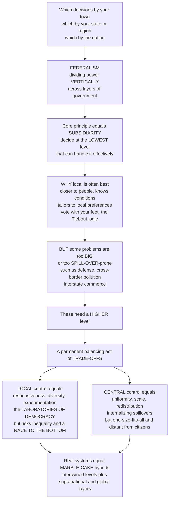

# 🏛️ Federalism and Multilevel Governance

> [!abstract] TL;DR
> Every policy in this vault has to be delivered by *some* level of government — and choosing which level is one of the deepest problems in organising collective life. **Federalism** is the system that divides power **vertically** across layers (local, state or regional, national, and now supranational), giving each its own sphere. Its organising principle is **subsidiarity**: decisions should be made at the **lowest level capable of handling them effectively**. Local government is closer to people, knows local conditions, tailors policy to diverse preferences, and lets citizens "**vote with their feet**" (Tiebout) — but some problems are simply too **big** or too **spillover-prone** (defense, cross-border pollution, interstate commerce) for the local level and demand a **higher** one. So federalism is a permanent balancing act with real trade-offs: local control buys responsiveness, diversity, and policy **experimentation** (the "**laboratories of democracy**") at the price of inequality, coordination failure, and a "**race to the bottom**"; central control buys uniformity, scale, redistribution, and spillover-handling at the price of one-size-fits-all insensitivity. Real systems are messy "**marble-cake**" hybrids, and modern **multilevel governance** extends the ladder up to the EU and the global commons. This is the *Governance and Implementation* note on how to slice the vertical division of power.

---

## Intuition

**Analogy — who decides what, at which table?** Picture three tables in three rooms. At the small table sits your town council, deciding where to put the new stoplight, how often the library opens, and whether dogs are allowed in the park. At the medium table sits your state or region, deciding speed limits, school curricula, and how the hospital is funded. At the grand table sits the national government, deciding on the army, the currency, and the rules for trade between regions. Now the hard question: **which decision belongs at which table?** Put the stoplight decision at the national table and you get a distant bureaucracy that has never seen your intersection ruling on it badly. Put the *army* at the town table and no town will pay for a defense that protects everyone whether they chip in or not — it collapses. The whole art of **federalism** is assigning each decision to the *right* table.

There is an elegant principle for the assignment, called **subsidiarity**: push every decision down to the **lowest table that can still handle it well**. Why down? Because the lower table is closer to the people affected, knows the local terrain, and can tailor its choice to what *this* community actually wants — Texas and Vermont genuinely want different things, and a citizen who dislikes their town's bundle of taxes and services can *move* to one that fits (Tiebout's "vote with your feet"). But subsidiarity has a crucial escape clause — *only if the lower level can handle it effectively*. When a problem is too **big** to fund locally (national defense), or **spills across borders** so that one town's pollution or one state's lax banking rules harm its neighbours, or needs a single uniform rule so commerce is not strangled by a patchwork — then, and only then, the decision must climb to a higher table. Federalism is the permanent, contested negotiation over exactly where each decision sits, and modern **multilevel governance** just adds more tables above the nation (the EU) and pulls in non-state players too.

---

## How It Works

### Core mechanics

1. **Divide sovereignty vertically.** In a **federal** system a written constitution splits authority between a central government and constituent governments (states, provinces, Länder, cantons), each with a guaranteed sphere neither can simply abolish. Contrast a **unitary** system (one sovereign centre that *delegates* to localities and can revoke that delegation) and a **confederal** one (sovereign members loosely bound, the centre weak). Federalism is the middle path: **shared, constitutionally entrenched** sovereignty.
2. **Assign the powers.** Constitutions carve up authority into **enumerated** powers (explicitly granted to the centre), **reserved** powers (left to the states), and **concurrent** powers (shared, with a supremacy rule for conflicts). The map is never clean, and the boundary is fought over for centuries (the US "commerce clause," Germany's concurrent competences).
3. **Apply subsidiarity to place each function.** For any given policy, ask: what is the smallest jurisdiction whose scale matches the problem's benefit reach and that has the capacity to deliver it? Local parks and schools go low; defense, currency, and interstate trade rules go high; the middle is contested.
4. **Weigh the decentralization trade-off (Oates).** Local provision **tailors** the good to heterogeneous local preferences and invites experimentation, but forgoes **economies of scale** and ignores cross-border **spillovers**. Central provision internalises spillovers, captures scale, and can **redistribute**, but imposes a **uniform** level that fits no one perfectly. The optimum depends on how *diverse* preferences are versus how *large* the spillovers and scale economies are.
5. **Let the fiscal system carry it.** Real federalism runs on money: which level **taxes** what, and **intergovernmental transfers** (equalisation grants, matching grants, block grants) that plug the gap between a jurisdiction's spending responsibilities and its own revenue — the **vertical fiscal imbalance** — and between rich and poor jurisdictions — **horizontal** imbalance. **Unfunded mandates** (the centre orders, the locality pays) are the recurring flashpoint.
6. **Accept that levels intertwine.** The tidy "**layer-cake**" picture of neatly separated tiers (dual federalism) gave way in practice to "**marble-cake**" federalism, where national, state, and local authority swirl together in almost every program (cooperative federalism), and the long historical drift is toward the centre.
7. **Extend the ladder upward — multilevel governance.** Above the nation sit **supranational** bodies (the EU is the paradigm) and the thin, ungoverned layer of **global** problems (climate, pandemics, financial stability) where no world government exists to compel contribution. Governance also spreads *sideways* to non-state actors — Hooghe and Marks's **Type I** (nested, general-purpose jurisdictions) versus **Type II** (task-specific, overlapping) multilevel governance, echoing Ostrom's **polycentric** order.

### Flow / Architecture



---

## Key Concepts

### Secondary

- **Federalism** — a way of running a country by splitting power between one national government and several regional ones (states or provinces), so that *both* have real authority instead of one boss deciding everything.
- **Subsidiarity** — the rule of thumb that a decision should be made at the **lowest level that can do it well**: the town handles the streetlight, the nation handles the army.
- **Voting with your feet** — if you dislike the taxes and services where you live, you can *move* to a town that suits you better; the threat of people leaving pushes local governments to do a good job.
- **Laboratories of democracy** — because different states can try different policies at the same time, the country gets to *see what works* and copy the winners, like running many small experiments instead of betting everything on one.
- **Race to the bottom** — the danger that states compete for businesses by cutting taxes and protections lower and lower, until everyone is worse off — a competition nobody really wins.

### Undergraduate

- **Federal vs unitary vs confederal.** *Federal*: constitutionally shared sovereignty between centre and constituent units (US, Germany, India, Canada, Australia, Brazil). *Unitary*: one sovereign centre that may delegate to localities but can reclaim the power (France, Japan). *Confederal*: sovereign members, a weak centre (the pre-1789 US, the EU in part). The line between "strong federation" and "confederation" is a spectrum, not a wall.
- **The division of powers.** Constitutions specify **enumerated** (central), **reserved** (state), and **concurrent** (shared) powers, plus a **supremacy** clause deciding conflicts. Judicial interpretation of elastic clauses (the US commerce clause, the "necessary and proper" clause) has driven a long **centralising** drift.
- **Dual vs cooperative federalism.** *Dual* ("layer cake"): tiers operate in separate, sovereign spheres. *Cooperative* ("**marble cake**", Grodzins): tiers are intertwined, co-funding and co-administering the same programs — the empirical reality of modern federations.
- **Fiscal federalism.** The economics of *which level taxes, spends, and transfers*. Core results: assign **allocation** of local public goods to local government, but assign **redistribution** and macro **stabilisation** to the centre (Musgrave's three branches), because mobile citizens would undermine local redistribution.
- **The decentralization theorem (Oates).** Absent spillovers and scale economies, providing a public good at the **local** level is at least as efficient as uniform central provision, and strictly better when local **preferences differ** — because local government can match provision to local demand while the centre must pick one level for all.
- **The Tiebout model.** For *local* public goods, mobile households "**vote with their feet**," sorting into the jurisdiction whose tax-and-service bundle matches their preferences — a quasi-**market** for local public goods that partially solves the preference-revelation problem the centre cannot. (See [[Public_Goods]].)
- **Intergovernmental transfers.** **Equalisation** grants (level the fiscal playing field), **matching** grants (centre pays a share to induce local spending, good for spillovers), and **block** grants (lump sums, more local discretion). **Unfunded mandates** shift cost without funding — a chronic grievance.

### Graduate

- **Oates' decentralization theorem, precisely.** If a public good's consumption is confined to each jurisdiction and provision costs are equal across levels, then decentralised (jurisdiction-specific) provision is Pareto-superior to a single uniform central level whenever demand is **heterogeneous** across jurisdictions; the welfare gain rises with the **variance** of local preferences and falls with the size of **spillovers** and **economies of scale**. The optimal degree of decentralisation trades preference-matching against spillover-internalisation — the content of the Python demo below.
- **Tiebout's assumptions and their fragility.** The efficiency result needs costless mobility, full information, many jurisdictions, no inter-jurisdictional externalities, no scale economies, and financing by head (benefit) taxes rather than redistributive taxes. Relax any — especially with **property taxes** and **redistribution** — and sorting produces **segregation by income**, capitalisation into land prices, and exclusionary zoning rather than clean efficiency.
- **The assignment problem (Musgrave–Oates).** *Allocation* of local public goods → local; *redistribution* → central (local redistribution is undone by the exit of the taxed rich and entry of the aided poor — the **mobility problem**); *stabilisation* (monetary and countercyclical fiscal policy) → central, since sub-units cannot run independent monetary policy and their fiscal multipliers leak across open borders.
- **Tax competition and the race to the bottom.** With mobile capital, jurisdictions best-respond by **cutting** capital taxes to attract the base, driving rates toward an **inefficiently low** Nash equilibrium and under-providing public goods — a negative fiscal **externality** each imposes on the others. The empirical magnitude is contested (offset by agglomeration rents, tax exporting, and "**race to the top**" in some standards), but the logic is why coordination (EU minimum-tax rules, the OECD global minimum tax) is sought.
- **Types of multilevel governance (Hooghe & Marks, 2003).** **Type I**: a limited number of **general-purpose**, non-overlapping, durable jurisdictions nested like Russian dolls (the classic federal ladder). **Type II**: a large number of **task-specific**, overlapping, flexible jurisdictions matched to particular problems (special districts, river-basin authorities, functional agencies). Real governance blends both.
- **Polycentric governance (Ostrom).** Many overlapping centres of decision-making, formally independent but mutually adjusting, can govern shared resources more robustly than a single monopoly authority — nested rules matching the scale of each problem, empirically the norm for successful commons management.
- **Global public goods and the missing top tier.** Climate stability, pandemic preparedness, and financial stability are non-excludable at the *planetary* scale, but there is **no world government** to compel contribution, so their provision is an *n*-country collective-action failure escaped only imperfectly by treaties, clubs, and side-payments — federalism's assignment problem with the top table empty.

---

## Python Demo

```python
# Federalism, made concrete with numpy + matplotlib.
#
#   (a) SUBSIDIARITY / OATES' DECENTRALIZATION THEOREM.
#       Compare the welfare of providing a public good LOCALLY vs CENTRALLY as
#       preference HETEROGENEITY (sigma) grows, for small vs large SPILLOVERS/
#       scale economies.
#         - LOCAL  : perfectly tailors the good to each jurisdiction's ideal
#                    (no mismatch loss), BUT forgoes spillover-internalisation
#                    and economies of scale -> a fixed welfare penalty "loss".
#         - CENTRAL: one uniform level for all -> a mismatch loss that grows
#                    with the VARIANCE of preferences (k * sigma^2), BUT captures
#                    the spillover/scale gain.
#       Crossover at sigma* = sqrt(loss / k): central wins for low heterogeneity
#       or large spillovers; local wins for high heterogeneity or small spillovers.
#       -> this DERIVES the optimal level of government for a given policy.
#
#   (b) LABORATORIES OF DEMOCRACY / POLICY DIFFUSION.
#       Many jurisdictions start with DIVERSE policies; each period they imitate
#       the best-performing peer (diffusion) plus a little experimentation noise.
#       The best policy is DISCOVERED and SPREADS, so mean performance climbs
#       toward the optimum -> federal experimentation as collective learning.

import numpy as np
import matplotlib.pyplot as plt

fig, (ax1, ax2) = plt.subplots(1, 2, figsize=(13, 5.4))

# ----------------------------------------------------------------------
# (a) SUBSIDIARITY: local vs central welfare as heterogeneity grows
# ----------------------------------------------------------------------
sigma = np.linspace(0.0, 3.0, 400)     # heterogeneity of local preferences
W0 = 10.0                              # common baseline welfare
k = 1.0                                # weight on central uniform-provision mismatch
loss_small = 1.5                       # spillover + scale gain central captures (SMALL)
loss_large = 5.0                       # spillover + scale gain central captures (LARGE)

W_central = W0 - k * sigma**2                       # central: mismatch grows with variance
W_local_small = np.full_like(sigma, W0 - loss_small)  # local forgoes small spillover/scale
W_local_large = np.full_like(sigma, W0 - loss_large)  # local forgoes large spillover/scale

sig_star_small = np.sqrt(loss_small / k)   # crossover when spillovers small
sig_star_large = np.sqrt(loss_large / k)   # crossover when spillovers large

ax1.plot(sigma, W_central, lw=2.6, color="navy",
         label="CENTRAL: uniform level, captures spillovers/scale")
ax1.plot(sigma, W_local_small, lw=2.2, color="green",
         label="LOCAL, small spillovers")
ax1.plot(sigma, W_local_large, lw=2.2, color="darkorange", ls="--",
         label="LOCAL, large spillovers")

for s, c in [(sig_star_small, "green"), (sig_star_large, "darkorange")]:
    ax1.axvline(s, color=c, ls=":", lw=1.3)
    ax1.plot([s], [W0 - k * s**2], "o", color=c, ms=7)

ax1.annotate("small spillovers:\ncentral wins only\nfor low heterogeneity",
             xy=(sig_star_small, W0 - loss_small),
             xytext=(sig_star_small + 0.25, W0 - 5.6),
             fontsize=8, arrowprops=dict(arrowstyle="->"))
ax1.annotate("large spillovers:\ncentral wins over a\nwider range",
             xy=(sig_star_large, W0 - loss_large),
             xytext=(0.15, 2.2), fontsize=8,
             arrowprops=dict(arrowstyle="->"))
ax1.text(2.35, 9.2, "high heterogeneity\n-> LOCAL wins", color="green", fontsize=8)
ax1.set_xlabel("Preference heterogeneity across jurisdictions (sigma)")
ax1.set_ylabel("Welfare of provision")
ax1.set_title("Oates' decentralization theorem: which level is optimal")
ax1.legend(fontsize=7.5, loc="lower left")
ax1.set_ylim(0, 11)
ax1.grid(alpha=0.3)

# ----------------------------------------------------------------------
# (b) LABORATORIES OF DEMOCRACY: policy experimentation and diffusion
# ----------------------------------------------------------------------
rng = np.random.default_rng(42)
M, T = 30, 40                 # 30 jurisdictions, 40 time periods
p_star = 0.75                 # the (unknown) best policy on [0, 1]
alpha = 0.25                  # imitation / diffusion rate toward the leader
noise = 0.03                  # experimentation

def performance(x):
    return 1.0 - (x - p_star) ** 2   # peaks at the optimal policy p_star

x = rng.uniform(0.0, 1.0, M)         # start with DIVERSE local policies
perf_hist = np.zeros((T, M))
mean_hist = np.zeros(T)
best_hist = np.zeros(T)

for t in range(T):
    f = performance(x)
    perf_hist[t] = f
    mean_hist[t] = f.mean()
    best_hist[t] = f.max()
    leader = x[np.argmax(f)]                     # best-performing jurisdiction
    x = x + alpha * (leader - x) + rng.normal(0, noise, M)  # imitate + experiment
    x = np.clip(x, 0.0, 1.0)

t_axis = np.arange(T)
for j in range(M):                               # faint: each jurisdiction
    ax2.plot(t_axis, perf_hist[:, j], color="gray", alpha=0.25, lw=0.8)
ax2.plot(t_axis, best_hist, color="crimson", lw=2.6, label="Best jurisdiction (frontier)")
ax2.plot(t_axis, mean_hist, color="navy", lw=2.6, label="Mean across jurisdictions")
ax2.axhline(1.0, color="black", ls="--", lw=1.2, label="Optimal policy performance")
ax2.set_xlabel("Time (rounds of experimentation and diffusion)")
ax2.set_ylabel("Policy performance")
ax2.set_title("Laboratories of democracy: best policy spreads")
ax2.legend(fontsize=8, loc="lower right")
ax2.set_ylim(0, 1.05)
ax2.grid(alpha=0.3)

plt.tight_layout()
plt.show()

print(f"(a) With small spillovers the local/central crossover is at sigma* = "
      f"{sig_star_small:.2f}; with large spillovers it moves out to "
      f"{sig_star_large:.2f} -- bigger spillovers favour CENTRAL provision over a "
      f"wider range of preference heterogeneity, exactly Oates' theorem.")
print(f"(b) Mean policy performance rose from {mean_hist[0]:.2f} to "
      f"{mean_hist[-1]:.2f} of the optimum as the best-performing policy was "
      f"discovered and diffused across jurisdictions -- experimentation as learning.")
```

The left panel *derives subsidiarity*. Local provision (flat lines) perfectly tailors the good to each jurisdiction, so its welfare does not fall as preferences diverge — but it pays a fixed penalty for forgoing the spillover-internalisation and scale economies the centre would capture. Central provision (the downward parabola) captures those gains but suffers a mismatch loss that grows with the **variance** of preferences. The crossover `sigma*` is the optimal-assignment rule made visible: when spillovers are **large** (orange), central wins across most of the heterogeneity range; when spillovers are **small** (green), even modest diversity tips the decision to the local level. The right panel is the **laboratories of democracy**: thirty jurisdictions start with wildly diverse policies (the scattered grey lines), each period they imitate the best performer and experiment at the margin, and the population's mean performance climbs toward the optimum — a decentralised search that a single central planner, committed to one policy, could never run.

---

## Real-World Applications

- **The European Union — subsidiarity as constitutional law.** Subsidiarity is written into the EU treaties (Article 5, TEU): the Union acts only where objectives "cannot be sufficiently achieved by the Member States" and can be better achieved at Union level. National parliaments police it through the "yellow card" mechanism. The EU is the paradigm of **multilevel governance** — a supranational tier layered above nation-states, with authority pooled for the single market and monetary union while most social policy stays national.
- **US states as laboratories of democracy.** Brandeis's phrase (dissenting in *New State Ice Co. v. Liebmann*, 1932) describes real policy diffusion: Massachusetts's 2006 health-insurance reform became the template for the national Affordable Care Act; welfare-reform experiments under state waivers fed the 1996 federal reform; same-sex marriage and cannabis legalisation spread state-by-state before national shifts. The states run the experiments; the winners diffuse.
- **German cooperative federalism and fiscal equalisation.** Germany's *Länderfinanzausgleich* is one of the world's most explicit **horizontal equalisation** systems, redistributing revenue from richer to poorer Länder so that citizens receive comparable services regardless of where they live — the redistributive rationale for a higher tier made fiscal, and a live source of constitutional dispute.
- **The race to the bottom — and to the top.** US corporate law concentrated in **Delaware** (jurisdictional competition for incorporations); state and local **tax incentives** bid against each other for factories and headquarters (the Amazon HQ2 auction); global capital-tax competition drove the 2021 OECD/G20 agreement on a **15 percent global minimum corporate tax** — an explicit attempt to coordinate away a race to the bottom. Yet California's stricter emissions and labour standards show competition can also ratchet *up*.
- **Climate and pandemics — the missing top tier.** Greenhouse-gas mitigation is a **global public good** with no world government to compel contribution, so provision runs through voluntary treaties (the Paris Agreement) — exactly the top-of-the-ladder collective-action failure federalism predicts. COVID-19 exposed the domestic version: sharp **federal-state conflicts** over lockdowns, mandates, and data in the US, Brazil, and India, a real-time seminar in who decides what during a cross-border emergency.

---

## Common Pitfalls

- **Confusing decentralization with federalism.** A unitary state can *decentralize* administratively while keeping the power to reverse it at will; federalism entrenches sub-unit authority **constitutionally**. Devolution (UK, Spain) is revocable in principle; genuine federalism is not. Treating them as identical hides where sovereignty actually sits.
- **Assuming "local is always better."** Subsidiarity favours the lowest *competent* level — and competence fails exactly where there are **spillovers** (pollution, contagion), **economies of scale** (defense), or **redistribution** (which mobile citizens undo locally). Romanticising the local ignores the entire right half of the trade-off.
- **Taking the Tiebout model literally.** Its efficiency needs costless mobility, perfect information, many jurisdictions, and benefit taxes. In the real world, sorting by ability-to-pay plus property-tax financing produces **income segregation**, exclusionary **zoning**, and capitalised advantage — the mechanism can entrench inequality, not just reveal preferences.
- **Ignoring the redistribution-mobility problem.** Assigning redistribution to a low level is self-defeating: tax the rich locally and they exit; fund the poor generously and they enter, until the program collapses (a "**welfare magnet**" dynamic). This is *why* redistribution is assigned to the centre, and forgetting it dooms well-meaning local schemes.
- **Believing the tiers are neat layers.** The "layer cake" is a myth; real federalism is "**marble cake**," with national money, state rules, and local delivery swirled through almost every program. Designing as if levels were cleanly separable produces mandates that clash and accountability that no one can trace.
- **Overstating (or dismissing) the race to the bottom.** Tax and standards competition is real but not universal: agglomeration rents, tax exporting, and reputational "race to the top" dynamics can dominate in some domains. Assuming *either* that all competition erodes standards *or* that competition is always benign both misread the evidence.
- **Leaving unfunded mandates out of the accounting.** Higher tiers love to *legislate* obligations and let lower tiers *pay* for them. Any assignment of a function must assign the **money** too, or the responsibility is fictional and the lower tier is set up to fail.

---

## Related Concepts

Cross-vault anchors (Glob-verified files elsewhere in the vault):

- [[Federalism_and_Decentralization]] — the **comparative-politics** treatment of federal versus unitary systems and devolution; this note is its **public-policy / fiscal-federalism** counterpart, distinct basename, linked deliberately.
- [[Political_Institutions_and_Constitutions]] — the constitutional machinery (enumerated, reserved, concurrent powers; supremacy clauses) that entrenches the vertical division of power.
- [[Public_Finance_and_Fiscal_Policy]] — the fiscal system that federalism runs on: which level taxes and spends, and how intergovernmental transfers close the vertical and horizontal imbalances.
- [[Public_Goods]] — the Microeconomics theory whose *spatial reach* determines the right level of provision; the Tiebout logic of sorting into jurisdictions is a quasi-market for **local** public goods.
- [[Tax_Policy]] — the fiscal instrument at the heart of tax competition, equalisation, and the race-to-the-bottom dynamic between jurisdictions.
- [[System_Boundaries_and_Hierarchy]] — the systems-thinking frame for **nested, polycentric** order (Ostrom): choosing where to draw boundaries and how levels of a hierarchy interlock is the abstract form of the assignment problem.

Within this vault, this note sits in the *Governance and Implementation* section beside prose-referenced siblings (some to be built): the hub *Public_Policy_and_Governance_Overview* (governance beyond government, of which multilevel governance is the vertical case), *Policy_Implementation_and_Governance* (delivery, where "who does what" becomes concrete), *Public_Goods_and_Collective_Provision* (the collective-provision economics that fixes each good's optimal jurisdiction), *Collaborative_Governance_and_Networks* (the horizontal, networked complement to vertical layering), and *Institutions_Rules_and_Commons_Governance* (Ostrom's polycentric self-governance as the fine-grained bottom of the ladder).

---

## Review Questions

1. **(Secondary)** Give one decision that clearly belongs to your town, one to your state or region, and one to the national government, and explain each using the idea of subsidiarity — deciding at the lowest level that can handle it well. Then name one problem that would collapse if left to the local level, and say why.
2. **(Undergraduate)** State Oates' decentralization theorem. Using the concepts of preference **heterogeneity**, **spillovers**, and **economies of scale**, explain when a public good should be provided locally versus centrally, and why the Tiebout model makes decentralised provision of *local* public goods attractive. Where does the Tiebout logic break down?
3. **(Graduate)** "Redistribution belongs at the centre; allocation belongs to the localities." (a) Explain the **mobility** argument behind this assignment and the "welfare magnet" problem it predicts. (b) Model a **race to the bottom** in capital taxation as a game between jurisdictions and explain why the Nash equilibrium is inefficient. (c) A **global** public good such as climate stability has no world government to compel contribution — relate this to federalism's assignment problem and explain why the very features that justify domestic central provision make global provision especially hard.

---

## Sources

- Wallace E. Oates, *Fiscal Federalism* (Harcourt Brace Jovanovich, 1972) — the decentralization theorem and the modern economic theory of assigning functions to levels of government.
- Charles M. Tiebout, "A Pure Theory of Local Expenditures," *Journal of Political Economy* 64(5), 1956 — "voting with your feet" and the quasi-market for local public goods.
- Daniel J. Elazar, *Exploring Federalism* (University of Alabama Press, 1987) — federalism as a covenantal division of authority, and the comparative typology of federal systems.
- Liesbet Hooghe and Gary Marks, "Unraveling the Central State, but How? Types of Multi-level Governance," *American Political Science Review* 97(2), 2003 — the Type I / Type II distinction that defines the multilevel-governance frame.
- Elinor Ostrom, *Governing the Commons* (Cambridge University Press, 1990) — polycentric, nested governance as robust self-organisation beyond the pure state-market binary.

---

#public-policy #federalism #subsidiarity #fiscal-federalism #multilevel-governance
