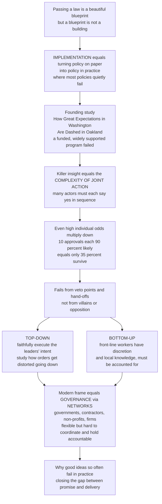

# 🏗️ Policy Implementation and Governance

> [!abstract] TL;DR
> **Implementation** is the stage of the policy process where an adopted decision is actually *put into effect* — the "missing link" between what a law promises and what citizens experience. It was long neglected (assumed to happen automatically once a law passed) and turns out to be **decisive**: policies fail in execution as often as in design. The founding insight (Pressman and Wildavsky's 1973 *Implementation*, subtitled *How Great Expectations in Washington Are Dashed in Oakland*) is the **complexity of joint action** — implementation forces many actors and agencies to cooperate through a long chain of decision or **veto points**, so that even when each link is individually likely to say "yes," the odds of *all* of them lining up collapse as the chain grows. Scholars split between a **top-down** view (implementation as faithful execution of leaders' intent) and a **bottom-up** view (front-line "street-level" workers exercise discretion and effectively remake policy in delivery). The modern reality is **governance**: policy is increasingly delivered not by one hierarchy but through **networks** of governments, contractors, and non-profits — flexible but far harder to coordinate and hold accountable.

---

## Intuition

**Analogy — a blueprint is not a building.** Passing a law is like drawing a beautiful architectural blueprint. Everyone admires the clean lines, the elegant intent, the way it solves the problem *on paper*. But a blueprint is not a building. Turning that drawing into a standing structure is the messy, unglamorous, decisive work: pouring concrete, wiring, plumbing, inspections, dozens of separate crews each doing their part in the right order. **Implementation is the construction phase of policy** — and it is where most policies quietly succeed or fail, long after the ribbon-cutting speeches are forgotten.

Here is the sobering discovery that founded this whole field. A landmark study followed a federal jobs program sent to Oakland, California, in the late 1960s. It had money, political goodwill, and near-universal consensus — nobody was against it. And it bogged down and failed anyway. Why? Because making it happen required *dozens of separate agencies and actors* to each say "yes" and do their part in sequence. This is the killer insight the authors called the **complexity of joint action**: even if every single link in a long chain has a *high* probability of cooperating, the chance that *all* of them line up plummets as the chain grows. If a policy needs 10 approvals, each 90 percent likely, the whole thing has only about a **35 percent** chance of surviving — not because anyone is a villain, but because of the sheer number of veto points, hand-offs, and moving parts. Implementation is where good ideas go to meet reality, and reality is a long, leaky relay race.

---

## How It Works

### Core mechanics

1. **Implementation is a stage, not an afterthought.** In the standard policy cycle — agenda-setting → formulation → adoption → *implementation* → evaluation — implementation is the step that converts an authoritative decision into concrete action. It was long treated as a black box ("the law passed, so it happens"). The 1970s taught the field the opposite: the black box is where the action, and the failure, lives.

2. **The arithmetic of joint action.** Implementation almost never runs through a single actor. It runs through a *chain* of decision or clearance points — appropriations, sign-offs, hand-offs between agencies, contracts, local approvals. Model each point as cooperating with some probability. Because the points are *sequential and dependent*, overall success is roughly the **product** of the per-point probabilities. Products of numbers below one shrink fast: many high-probability steps still multiply down to a low-probability whole. Delay and failure emerge **without any opposition** — purely from the length of the chain.

3. **Determinants of success.** Whether the chain holds depends on: clear and consistent **goals**; adequate **resources** (money, staff, administrative capacity); a valid **causal theory** (will the intervention actually produce the intended outcome, or is the underlying logic wrong?); the **number of actors and veto points**; the **incentives and compliance** of implementers; **target-group behaviour** (do the people the policy aims at actually respond?); **communication**; and sustained **political and administrative support**. Common barriers are the mirror image: fragmentation, conflicting goals, capacity gaps, and resistance.

4. **Two lenses on the same chain.** The **top-down** school (Sabatier and Mazmanian) starts from the statute and asks how to *faithfully execute* leaders' objectives — studying the conditions for control and compliance down the hierarchy (tractability of the problem, clarity of goals, resources, causal theory). The **bottom-up** school (Lipsky, Hjern) starts from the *front line* — the caseworkers, teachers, police, and clerks who exercise **discretion** and local knowledge, and who effectively *make* policy as they deliver it. Matland's ambiguity-conflict model synthesises the two: which mode dominates depends on how ambiguous and how conflictual the policy is.

5. **From government to governance.** Modern policy is rarely implemented by one agency inside one hierarchy. It is delivered through **governance networks** — intergovernmental webs (federal, state, local), contracted-out private firms, non-profits, and public-private partnerships. This is "governing *without* government": more flexible and expert, but even harder to coordinate, and it raises hard questions about **accountability** and democratic legitimacy when delegated actors deliver public policy (the risk of a "hollow state").

### Flow / Architecture



---

## Key Concepts

### Secondary

- **Implementation** — the "doing" stage of policy: turning a decision into real action that reaches people. The construction phase after the blueprint is drawn.
- **The implementation gap** — the difference between what a policy *intends* and what it actually *delivers*. Many "good" laws never fully arrive.
- **Why chains fail** — when a policy needs many people and offices to each cooperate in order, even small chances of a hold-up at each step add up to a big chance of failure overall — no villains required.
- **Veto point** — any step where someone can slow, block, or water down the policy as it moves along.
- **Street-level workers** — the front-line staff (teachers, caseworkers, police, clerks) who actually deliver policy and make countless day-to-day judgment calls that shape what citizens really get.

### Undergraduate

- **Complexity of joint action** (Pressman and Wildavsky) — implementation requires cooperation across many sequential **decision/clearance points**; overall success is roughly the *product* of per-point cooperation probabilities, so long chains erode success even when every step is likely. The "arithmetic of joint action."
- **Top-down approach** (Sabatier and Mazmanian) — implementation as *faithful execution* of the statute's objectives; success conditions include clear goals, a valid causal theory, adequate resources, few veto points, and compliant implementers. Good for tightly-drafted, low-conflict policy.
- **Bottom-up approach** (Lipsky's *street-level bureaucracy*; Hjern) — policy is effectively *made in delivery* by front-line staff exercising **discretion** under scarce time and resources; you cannot understand or fix a policy without studying the people who deliver it and the groups they serve.
- **Determinants of success** — goal clarity and consistency, resources and capacity, causal validity, number of actors, implementer incentives and compliance, target-group behaviour, communication, and political support.
- **Governance** — steering delivered through **networks** of state, market, and third-sector actors rather than a single hierarchy; "governing without government."

### Graduate

- **The multiplicative erosion result** — for `N` dependent clearance points each cooperating with probability `p`, `P(success) ≈ p^N`. With `p = 0.9`, going from `N = 1` to `N = 10` drops success from 90 percent to about 35 percent, and to roughly 12 percent by `N = 20`. The policy lever is not just raising `p` but *shortening the chain* (reducing hand-offs and veto players).
- **Matland's ambiguity-conflict model** — the *mode* of implementation depends on two axes. Low ambiguity + low conflict → **administrative** implementation (top-down works). High conflict + low ambiguity → **political** implementation (power decides). High ambiguity + low conflict → **experimental** implementation (context and street-level actors dominate). High ambiguity + high conflict → **symbolic** implementation. This dissolves the top-down/bottom-up war by conditioning it on policy characteristics.
- **The theory-of-action problem** — many failures are not managerial but *causal*: the intervention's underlying logic linking action to outcome is simply wrong. Distinguishing **implementation failure** (right idea, botched delivery) from **theory failure** (wrong idea, delivered faithfully) is essential and often conflated in evaluation.
- **Meta-governance and the hollow state** — as delivery is contracted out and networked, the centre shifts from *rowing* to *steering the steerers*: designing incentives, standards, and monitoring for a web of principals and agents. This trades control and clear accountability for flexibility and expertise, and reopens democratic-legitimacy questions about who answers to voters when a non-profit or firm delivers the policy.
- **Multilevel and collaborative delivery** — intergovernmental implementation (federal mandates executed by states and localities), contracting and privatization, and public-private partnerships each insert new veto points and principal-agent gaps while adding capacity — the coordination-versus-control trade-off in concrete form.

---

## Python Demo

```python
# Two core pictures of why implementation is hard:
#   (a) COMPLEXITY OF JOINT ACTION -> P(success) = p ** N collapses as the
#       chain of veto / clearance points grows, even for high cooperation p.
#   (b) THE IMPLEMENTATION GAP -> intended policy effect erodes stage by
#       stage; top-down (faithful execution) vs bottom-up street-level
#       variance across delivery sites.
# Pure numpy + matplotlib.

import numpy as np
import matplotlib.pyplot as plt

rng = np.random.default_rng(42)
fig, (ax1, ax2) = plt.subplots(1, 2, figsize=(13.5, 5.6))

# ---------------------------------------------------------------------------
# (a) The arithmetic of joint action: P(success) = p ** N
# ---------------------------------------------------------------------------
N = np.arange(0, 31)
for p in [0.99, 0.95, 0.90, 0.80]:
    ax1.plot(N, p ** N, lw=2.2, marker="o", ms=3,
             label=f"per-point cooperation p = {p:.2f}")

# Pressman & Wildavsky's flagship number: 10 points, each 90 percent likely.
ax1.scatter([10], [0.9 ** 10], color="black", zorder=5)
ax1.annotate("10 clearance points, each 90 percent likely\n-> only ~35 percent survive",
             xy=(10, 0.9 ** 10), xytext=(11.5, 0.58),
             arrowprops=dict(arrowstyle="->"), fontsize=9)
ax1.axhline(0.5, ls="--", color="grey", alpha=0.7)
ax1.set_xlabel("Number of veto / clearance points  N")
ax1.set_ylabel("Probability of successful implementation  =  p ** N")
ax1.set_title("Complexity of joint action:\neven high cooperation collapses over a long chain")
ax1.legend(fontsize=8)
ax1.grid(alpha=0.3)

# ---------------------------------------------------------------------------
# (b) The implementation gap: intended effect eroding stage by stage,
#     with bottom-up street-level variance across many delivery sites.
# ---------------------------------------------------------------------------
stages = ["Statute\nintent", "Federal\nagency", "State\nagency",
          "Local\noffice", "Front-line\ndelivery", "Target-group\nuptake"]
mean_retention = np.array([1.00, 0.90, 0.88, 0.85, 0.80, 0.82])

# Top-down: tight control -> deterministic cumulative product of retentions.
topdown = np.cumprod(mean_retention)

# Bottom-up: each site's per-stage retention varies (discretion, local
# knowledge, capacity). Simulate many sites and take a percentile band.
sites = 500
stage_std = np.array([0.0, 0.05, 0.06, 0.08, 0.12, 0.10])
site_ret = np.clip(rng.normal(mean_retention, stage_std,
                              size=(sites, len(stages))), 0.30, 1.0)
site_cum = np.cumprod(site_ret, axis=1)
p05, p50, p95 = np.percentile(site_cum, [5, 50, 95], axis=0)

x = np.arange(len(stages))
ax2.plot(x, topdown, lw=2.6, color="black", marker="s",
         label="Top-down (faithful execution)")
ax2.plot(x, p50, lw=2.2, color="tab:blue", marker="o",
         label="Bottom-up median across sites")
ax2.fill_between(x, p05, p95, color="tab:blue", alpha=0.20,
                 label="Bottom-up 5th-95th percentile spread")
ax2.annotate("IMPLEMENTATION GAP\nintended vs delivered",
             xy=(x[-1], topdown[-1]), xytext=(1.1, 0.36),
             arrowprops=dict(arrowstyle="->"), fontsize=9)
ax2.set_xticks(x)
ax2.set_xticklabels(stages, fontsize=8)
ax2.set_ylabel("Fraction of intended policy effect delivered")
ax2.set_ylim(0, 1.03)
ax2.set_title("The implementation gap and street-level variance")
ax2.legend(fontsize=8, loc="lower left")
ax2.grid(axis="y", alpha=0.3)

plt.tight_layout()
plt.show()

print(f"Joint action: 10 points at p=0.90 -> {0.9**10*100:.0f} percent survive.")
print(f"Top-down delivered effect after 6 stages: {topdown[-1]*100:.0f} percent of intent.")
print(f"Bottom-up sites deliver roughly {p05[-1]*100:.0f}-{p95[-1]*100:.0f} "
      f"percent of intent -- same policy, very different results by site.")
```

The left panel is the mathematics of why implementation fails: success is the *product* of per-point cooperation, so a long chain of veto points destroys even highly cooperative programs — and the biggest lever is often *shortening the chain*, not exhorting each actor to try harder. The right panel shows the **implementation gap** as a cascade of leakage from statute to citizen, and why the bottom-up view matters: once front-line discretion enters, the *same* policy delivers wildly different results across sites (the shaded band), so an average national figure hides the real story on the ground.

---

## Real-World Applications

- **The founding case — Oakland (EDA, 1966–1969).** The US Economic Development Administration poured funds into Oakland to create jobs for minority residents, with broad support and no organized opposition. Pressman and Wildavsky counted a long chain of required approvals across federal, regional, and local actors; the program stalled and largely failed. It became the template proof that consensus and money are not enough — the *number of hand-offs* was decisive.
- **Street-level bureaucracy — welfare and policing.** Lipsky's caseworkers, teachers, and police officers ration scarce time and resources under ambiguous rules, and their day-to-day discretion *is* the policy the public experiences. Reforms that ignore front-line incentives (e.g., benefit rules that are unworkable at the counter) get quietly rewritten in practice.
- **Networked delivery — contracting and non-profits.** Much of modern social service (job training, refugee resettlement, Medicaid managed care in the US) is delivered by contracted firms and non-profits under government funding. This adds expertise and flexibility but inserts principal-agent gaps and accountability puzzles — the "hollow state" in action, and the core theme of collaborative-governance and public-management practice.
- **Intergovernmental mandates — federal law, local delivery.** Environmental standards, education policy, and public-health rules are frequently *set* nationally but *implemented* by states and municipalities with their own capacity, incentives, and politics. The federalism layer multiplies veto points and produces the site-to-site variance the demo models. See the sibling *Federalism_and_Multilevel_Governance*.
- **Rapid rollout under stress — vaccine and benefit programs.** COVID-era vaccine distribution and emergency income support were textbook joint-action problems: many agencies, supply chains, and front-line clinics had to align at once, and the visible "failures" were overwhelmingly implementation failures (logistics, eligibility systems, staffing), not failures of the underlying policy idea.

---

## Common Pitfalls

- **Assuming implementation is automatic** — the original sin of the field. Designing a policy as if adoption equals delivery ignores the entire construction phase where most failures occur. Budget analytic attention to *how it will be delivered*, not only *what it should be*.
- **Counting only the average, missing the variance** — a national "80 percent delivered" figure can hide sites at 40 percent and sites at 100 percent. Street-level discretion produces spread, and equity lives in the spread. Always disaggregate delivery by site and group.
- **Confusing implementation failure with theory failure** — if a faithfully delivered program still produces no outcome, the *causal theory* may be wrong; no amount of better management fixes a broken theory of change. Diagnose which one you have before "fixing implementation."
- **Adding actors for legitimacy without counting the cost** — every additional stakeholder, sign-off, or partner adds a veto point and lowers `p^N`. Inclusive design and deliverability are in tension; more coordinators is not free.
- **Pure top-down control fantasies** — trying to eliminate front-line discretion usually fails, because discretion absorbs ambiguity and local variation the statute could never anticipate. The goal is to *shape* discretion (incentives, training, feedback), not abolish it.
- **Governance without accountability** — outsourcing delivery to networks buys flexibility but can dissolve the clear line of answerability to voters. If no one can say who is responsible when the network underperforms, the "hollow state" has arrived. Design monitoring and accountability *before* delegating.

---

## Related Concepts

Cross-vault anchors (Glob-verified files elsewhere in the vault):

- [[Policy_Analysis_and_the_Policy_Process]] — the political-science treatment of the policy cycle; implementation is the stage this note zooms into.
- [[Regulatory_Politics_and_Administrative_Law]] — the legal-administrative machinery of the regulatory state, where much implementation actually happens.
- [[Federalism_and_Decentralization]] — the multilevel structure that inserts intergovernmental veto points and site-to-site delivery variance.
- [[Systems_Failure_and_Wicked_Problems]] — the systems-thinking account of why complex, many-actor problems resist clean, controllable solutions.
- [[Cascades_and_Systemic_Risk]] — the general logic of failure propagating through a chain of dependent steps, mirroring joint-action erosion.
- [[Network_Science_Fundamentals]] — the structure of the governance networks through which policy is increasingly delivered.
- [[Delivery_and_Execution]] — the engineering-leadership analogue: turning a plan into shipped results across many dependent teams.
- [[Change_Management]] — managing the human and organizational resistance that stalls implementation on the ground.
- [[Mathematics/06_Probability_and_Statistics/Probability_Theory]] — the multiplication rule for dependent events that gives the `p^N` collapse its bite.

Within this vault (sibling notes in Governance and Implementation, referenced in prose): *Public_Policy_and_Governance_Overview* is the hub this note reports up to; *Bureaucracy_and_Public_Administration* supplies the organizational actors who execute policy; *Federalism_and_Multilevel_Governance* details the intergovernmental delivery layer; *Collaborative_Governance_and_Networks* develops the shift from government to networked steering; and *Public_Management_and_Performance* covers the monitoring, feedback, and accountability tools for holding delegated implementation to account.

---

## Review Questions

1. **(Secondary)** In your own words, why can a law that *everyone supports* and that *has enough money* still fail? Use the idea of a long chain of steps that each have to go right.
2. **(Undergraduate)** A national ministry designs a school-meals program to be delivered through 6 dependent clearance points (funding, procurement, regional office, district, school, and family sign-up), each about 85 percent likely to cooperate. Estimate the overall probability of successful delivery, then explain two concrete design changes — one that raises `p` and one that lowers `N` — and argue which would help more.
3. **(Graduate)** "Whether a policy is best understood top-down or bottom-up is the wrong question." Using Matland's ambiguity-conflict model, specify the conditions under which each perspective dominates. Then explain how moving delivery from a single agency to a contracted network of non-profits changes *both* the arithmetic of joint action *and* the accountability problem, and what a "meta-governance" response would look like.

---

## Sources

- Jeffrey L. Pressman and Aaron Wildavsky, *Implementation: How Great Expectations in Washington Are Dashed in Oakland* (University of California Press, 1973) — the founding study and the complexity of joint action.
- Michael Lipsky, *Street-Level Bureaucracy: Dilemmas of the Individual in Public Services* (Russell Sage Foundation, 1980) — the bottom-up view of discretion in delivery.
- Paul A. Sabatier and Daniel A. Mazmanian, "The Implementation of Public Policy: A Framework of Analysis," *Policy Studies Journal* 8(4), 1980 — the top-down framework of determinants.
- Richard Matland, "Synthesizing the Implementation Literature: The Ambiguity-Conflict Model of Policy Implementation," *Journal of Public Administration Research and Theory* 5(2), 1995 — the ambiguity-conflict synthesis.
- Michael Hill and Peter Hupe, *Implementing Public Policy: An Introduction to the Study of Operational Governance* (Sage) — modern synthesis linking implementation to networked governance.

---

#public-policy #policy-implementation #joint-action #top-down-bottom-up #governance
