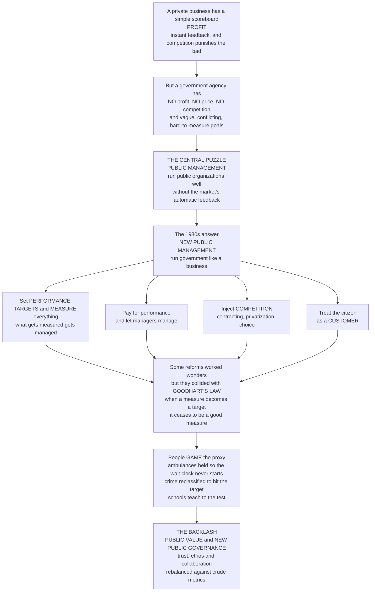

# 📊 Public Management and Performance

> [!abstract] TL;DR
> A private business is guided by a beautifully simple scoreboard — **profit** — that tells managers instantly how they are doing and lets competition punish the bad. But how do you *manage* a school system, a police force, or a benefits office that has **no profit, no price, no competition**, and often vague or conflicting goals? That is the central puzzle of **public management**: running public organizations well without the market's automatic feedback. From the 1980s a hugely influential movement tried to solve it by importing private-sector tools — **New Public Management (NPM)**, whose slogan was "run government like a business": set clear **performance targets** and measure everything ("what gets measured gets managed"), pay for performance, "let managers manage," inject **competition** (contracting-out, privatization, internal markets, choice), and treat the citizen as a **customer**. Some of it worked wonders. But it collided with **Goodhart's Law** — *"when a measure becomes a target, it ceases to be a good measure"* — because complex public goals resist measurement, so rewarding a simple proxy invites **gaming**: hospitals hit wait-time targets by holding patients in ambulances, police cut recorded crime by reclassifying it, schools "teach to the test." The backlash produced newer paradigms — **public value**, **new public governance**, and a rebalancing of metrics with trust, ethos, and collaboration. Understanding public management is understanding how to make government effective when you cannot just chase profit — and why importing business logic into the public sector is both powerful and perilous.

---

## Intuition

**Analogy — running the restaurant with no bill at the end.** A private restaurant has the simplest scoreboard imaginable: money. Customers who like the food come back and pay; customers who do not, leave; a rival opens next door if you slack off. Profit tells the owner *instantly* whether things are going well, and competition punishes failure automatically — nobody has to *decide* the restaurant is bad, the market decides for them. Now imagine you must run a very different kind of kitchen: a public soup kitchen that feeds everyone for free, has no rivals, charges no price, and whose "success" is a tangle of goals — feed the most people? feed the neediest first? nourish them healthily? treat them with dignity? You cannot read your performance off a till at closing time, because **there is no till**. This is the position of *every* public manager: a school principal, a police chief, a passport-office director. They run organizations with **no profit, no price, no competition, and no single clear owner** — often with multiple, ambiguous, and conflicting goals set by many masters. That is why public management is genuinely, structurally hard.

Starting in the 1980s a powerful movement tried to fix this by handing the soup kitchen a business's toolkit — **New Public Management**, whose battle cry was *"run government like a business."* Its reforms swept the world: set explicit **performance targets** and **measure everything** ("what gets measured gets managed"); **pay for performance**; give managers freedom to manage ("let managers manage"); **inject competition** through contracting-out, privatization, internal markets, and school choice; treat citizens as **customers** with service standards; and split the people who *decide* policy from those who *deliver* it. Some of this was transformative. But it ran into a hard truth captured by **Goodhart's Law**: *when a measure becomes a target, it ceases to be a good measure.* Because public goals are complex and hard to count, the moment you reward a simple proxy, people **game** it. Give hospitals a four-hour wait target and ambulances are held on the forecourt so the clock never starts. Reward police for cutting recorded crime and burglaries get reclassified as "lost property." Judge schools by test scores and they teach to the test and quietly drop everything the test ignores. The things easiest to count are rarely the things that matter, and targets distort behavior toward the proxy and away from the point. That collision — between the appeal of business-style measurement and the reality of *publicness* — is what the newer **public value** and **new public governance** movements were built to answer.

---

## How It Works

### Core mechanics

1. **Why the public sector is different — "publicness."** A firm has a single, quantified bottom line (profit), owners with aligned interest, prices that reveal value, and competitors that discipline it. A public agency has **none of these**: its goals are multiple, ambiguous, and often *conflicting* (is a prison meant to punish, deter, or rehabilitate?); it faces **many principals** (ministers, legislators, courts, auditors, the media, citizens) pulling in different directions; it is bound by law, due process, and equity constraints a business ignores; and its "product" is frequently **fairness itself**, which no market prices. James Q. Wilson's insight is that public agencies cannot observe either their *outputs* or their *outcomes* as cleanly as firms observe revenue — which is exactly why managing them is hard.
2. **The evolution of paradigms.** Public management has moved through three broad eras. **Classical public administration** (Weberian bureaucracy — rules, hierarchy, neutral competence) answered the question "how do we administer *fairly*?" **New Public Management** (1980s–90s) re-answered it as "how do we administer *efficiently and responsively*?" by importing markets and metrics. The **post-NPM** wave (**public value**, **new public governance**, digital-era reintegration) is answering "how do we create *value* and rebuild *trust and coordination*?" after NPM's fragmentation and measurement pathologies.
3. **The NPM doctrines (Hood 1991).** NPM is not one theory but a cluster of reforms: (a) **hands-on professional management** — "let managers manage"; (b) **explicit standards and measures of performance** — targets, indicators, results-orientation; (c) a **shift to output/outcome controls** — pay and budgets tied to results, not inputs; (d) **disaggregation** into leaner, single-purpose agencies; (e) **greater competition** — contracting-out, internal markets, the **purchaser–provider split**; (f) **private-sector management styles**; and (g) **discipline and parsimony** in resource use. Its intellectual parents are **public-choice theory** (distrust of self-serving bureaucrats) and **managerialism** (faith in generic professional management).
4. **Performance measurement — the core engine.** The heart of NPM is the **logic model**: *inputs → activities → outputs → outcomes.* Managers define **KPIs**, build **dashboards**, run **benchmarking** against peers, and use **performance budgeting** to link money to results. The promise is powerful: make the invisible visible, hold agencies accountable, and drive improvement. The peril is structural: what you *want* is **outcomes** (health, safety, learning), but outcomes are delayed, multi-causal, and hard to attribute, so you are forced to measure **outputs and proxies** instead — and there the trouble begins.
5. **Goodhart's Law and gaming — the deep problem.** **Goodhart's Law** (and its cousin **Campbell's Law**) states that once a measure becomes a high-stakes **target**, the pressure to hit it *corrupts* the very thing it was meant to track. Agents optimize the **proxy**, not the goal, producing predictable pathologies: **teaching to the test**, **cream-skimming** the easy cases, **hitting the target and missing the point**, the **output–outcome disconnect**, **ratchet effects** (do not over-perform or next year's target rises), and **threshold effects** (pile all effort at the pass mark, ignore everyone else). This is not cheating by bad apples — it is the *rational* response any incentive design invites.
6. **Multitasking and motivation.** Two economic mechanisms sharpen the problem. **Multitasking** (Holmström–Milgrom): when a job has several dimensions but you can only measure one, attaching a **high-powered incentive** to the measured dimension **starves the unmeasured ones** — so effort flows to what is counted and away from what matters but cannot be. And **motivation crowding**: strong extrinsic pay-for-performance can **crowd out** the intrinsic **public-service motivation** — the ethos of duty and vocation — that made public workers effective in the first place, sometimes leaving performance *lower* than before.
7. **The backlash and the newer paradigms.** NPM's costs — fragmentation and coordination failure, accountability confusion, eroded ethos and equity, and rampant gaming — provoked correction. **Public value** management (Moore) reframes the manager's job as *creating value for the public* judged against a "public value account," not hitting metrics. **New public governance** stresses **collaboration, networks, co-production, and trust** over crude targets. **Digital-era governance** (Dunleavy) argues for *reintegrating* the fragments NPM created. None abolishes measurement — they rebalance it with **judgment, mission, and trust**.

### Flow / Architecture



---

## Key Concepts

### Secondary

- **Public management** — the job of running a government organization (a school, a hospital, a benefits office) *well*, when you cannot measure success with profit the way a business can.
- **No scoreboard problem** — a business knows it is doing well when it makes money; a public agency has no equivalent single number, and often several goals that pull against each other, so "doing well" is genuinely hard to judge.
- **"Run government like a business"** — the big 1980s idea (New Public Management) to fix this by copying private-sector tools: set targets, measure results, reward performance, and add competition and choice.
- **"What gets measured gets managed"** — the appealing slogan behind measuring everything. Its trap: people focus on what is *counted* and neglect what is not.
- **Gaming the target** — when a number becomes the thing you are judged on, people find ways to make the number look good without actually doing the real job better — like a school drilling students for a test instead of teaching them to think.

### Undergraduate

- **New Public Management (NPM)** — Hood's (1991) label for the reform movement importing business management into government: performance targets, managerial autonomy ("let managers manage"), marketization (contracting-out, internal markets, the **purchaser–provider split**, vouchers/choice), a **customer** orientation, disaggregation into agencies, and explicit standards with pay-for-performance incentives. Popularized for the public by Osborne and Gaebler's *Reinventing Government*.
- **The performance-measurement logic model** — *inputs → activities → outputs → outcomes.* KPIs, dashboards, benchmarking, and performance budgeting operationalize it. The central difficulty: managers want **outcomes** but can only reliably measure **outputs/proxies**, because outcomes are delayed, multi-causal, and hard to attribute.
- **Goodhart's Law / Campbell's Law** — *"when a measure becomes a target, it ceases to be a good measure"*; quantitative indicators, used for high-stakes decisions, become corrupted and corrupt the processes they monitor. The single most important idea in this note.
- **Perverse effects of targets** — teaching to the test, **cream-skimming** / cherry-picking, hitting the target and missing the point, the output–outcome disconnect, and **ratchet** and **threshold** effects. Symptoms of the same disease: rewarding a proxy.
- **The customer metaphor and its limits** — treating citizens as customers improves responsiveness and service standards, but citizens are also **owners, voters, and rights-bearers**; a prisoner or a tax auditee is not a "customer" who can walk away, and equity is not a market value.

### Graduate

- **Publicness and the many-principals problem** — public organizations lack a residual claimant, prices, and competitive exit, and answer to *multiple principals* with conflicting objectives (Wilson). This makes the standard single-principal **principal–agent** contract inadequate: with many masters and many tasks, *any* high-powered incentive is distortionary.
- **The multitasking model (Holmström–Milgrom 1991)** — when tasks are substitutes in the agent's effort and some are unmeasurable, the *optimal* incentive on the measurable task is **weak, even zero**, because strong incentives divert effort from unmeasured-but-valuable tasks. This is the formal case *against* naive pay-for-performance in complex public jobs — and a rigorous statement of Goodhart's Law.
- **Motivation crowding and public-service motivation (PSM)** — extrinsic incentives can **crowd out** intrinsic PSM (Frey; Perry & Wise); a monetary reward can signal distrust and convert a vocation into a transaction, so pay-for-performance sometimes *lowers* effort. Explains why measurement regimes can demoralize a mission-driven workforce.
- **Bevan and Hood's "targets and terror"** — the empirical anatomy of gaming in the English NHS: **ratchet effects**, **threshold effects**, and outright **output distortion** (ambulance-holding, waiting-list manipulation) under a "targets and terror" regime, alongside genuine improvements — a case study in why the same reform both worked and was gamed.
- **Public value and the public value account (Moore 1995)** — reframes the public manager as a value creator operating in a "strategic triangle" of **public value**, **legitimacy and support**, and **operational capacity**; success is judged against a multidimensional public value account, not a KPI dashboard.
- **New public governance and digital-era governance** — the post-NPM syntheses: NPG (Osborne) centers **inter-organizational networks, co-production, and trust**; DEG (Dunleavy et al.) argues NPM is "dead" and calls for **reintegration**, needs-based holism, and digitalization to undo NPM's fragmentation.

---

## Python Demo

```python
# Two quantitative pictures of why measuring public performance is perilous.
#
#   (a) GOODHART'S LAW / TARGET-GAMING. A hard-to-measure TRUE goal is
#       correlated with an easy PROXY. While no one is judged on the proxy,
#       honest effort lifts BOTH together (the proxy is a good measure). The
#       moment the proxy becomes a high-stakes TARGET, agents optimize the
#       proxy directly -- it soars -- while the true outcome stagnates or
#       declines, because effort is diverted into gaming. The measure, once a
#       target, ceases to measure.
#
#   (b) MULTITASK INCENTIVE DISTORTION (Holmstrom-Milgrom) + MOTIVATION
#       CROWDING. A public job has a MEASURED task and an unmeasured-but-
#       important one. As the high-powered incentive on the measured task
#       rises, measured output climbs but effort drains from the UNMEASURED
#       task, and extrinsic pay crowds out intrinsic public-service ethos.
#       Total TRUE public value is hump-shaped: it peaks at a MODERATE
#       incentive, and strong incentives destroy value.
#
# Pure numpy + matplotlib.

import numpy as np
import matplotlib.pyplot as plt

rng = np.random.default_rng(7)

# ----------------------------------------------------------------------
# (a) Goodhart's Law: the proxy decouples from the goal once it is a target.
# ----------------------------------------------------------------------
T = 40
t = np.arange(T)
t_target = 18                      # the period the proxy becomes a TARGET

true_goal = np.zeros(T)
proxy = np.zeros(T)
true_goal[0] = proxy[0] = 20.0

for i in range(1, T):
    if i < t_target:
        # No target yet: honest effort lifts the true goal, and the proxy
        # faithfully tracks it (they are genuinely correlated).
        gain = 1.4
        true_goal[i] = true_goal[i-1] + gain
        proxy[i] = true_goal[i] + rng.normal(0, 0.6)      # proxy ~ true goal
    else:
        # Target imposed: effort is redirected to inflating the PROXY.
        proxy[i] = proxy[i-1] + 3.2                        # proxy soars
        # gaming diverts effort from real work -> true goal stalls / slips
        true_goal[i] = true_goal[i-1] - 0.25

fig, (ax1, ax2) = plt.subplots(1, 2, figsize=(13, 5.4))

ax1.plot(t, true_goal, lw=2.6, color="#065f46",
         label="TRUE goal (real, hard to measure)")
ax1.plot(t, proxy, lw=2.6, color="#b45309",
         label="PROXY metric (easy, becomes the target)")
ax1.axvline(t_target, ls="--", color="crimson")
ax1.annotate("Proxy becomes a TARGET\n(reward attached)",
             xy=(t_target, proxy[t_target]),
             xytext=(t_target - 16.5, proxy.max() * 0.72),
             color="crimson", fontsize=9,
             arrowprops=dict(arrowstyle="->", color="crimson"))
ax1.annotate("Metric soars,\ntrue outcome decouples",
             xy=(T - 1, proxy[-1]), xytext=(T - 15, proxy[-1] - 4),
             fontsize=9)
ax1.text(2, 22, "Correlated:\nproxy is a GOOD measure", fontsize=8, color="gray")
ax1.set_xlabel("Time")
ax1.set_ylabel("Performance level")
ax1.set_title("(a) Goodhart's Law: when a measure becomes a target")
ax1.legend(loc="upper left", fontsize=8)
ax1.grid(alpha=0.3)

# ----------------------------------------------------------------------
# (b) Multitask distortion + motivation crowding: value peaks at moderate power.
# ----------------------------------------------------------------------
beta = np.linspace(0, 1, 400)         # strength of incentive on the ONE measured task

measured   = 1 - np.exp(-3.6 * beta)  # measured output rises with the incentive
unmeasured = np.exp(-2.9 * beta)      # effort drains FROM unmeasured-but-vital tasks
intrinsic  = 0.6 * np.exp(-4.2 * beta)  # public-service ethos crowded out by pay

# True public value needs the measured task, the unmeasured task, AND the ethos.
true_value = 0.45 * measured + 0.45 * unmeasured + intrinsic
best = beta[np.argmax(true_value)]

ax2.plot(beta, measured, lw=2.2, color="#b45309",
         label="Measured task output (up)")
ax2.plot(beta, unmeasured, lw=2.2, color="#1e40af",
         label="Unmeasured-but-vital task (down)")
ax2.plot(beta, intrinsic, lw=2.0, color="#7c3aed", ls=":",
         label="Intrinsic public-service ethos (crowded out)")
ax2.plot(beta, true_value, lw=2.9, color="black",
         label="TRUE public value (needs all three)")
ax2.axvline(best, ls="--", color="green")
ax2.annotate("Value peaks at\nMODERATE incentive",
             xy=(best, true_value.max()),
             xytext=(best + 0.06, true_value.max() - 0.32),
             fontsize=9,
             arrowprops=dict(arrowstyle="->", color="green"))
ax2.text(0.55, 0.90, "High-powered incentives\nstarve the unmeasured\nand destroy value",
         color="darkred", fontsize=8)
ax2.set_xlabel("Incentive intensity on the measured task  (0 = ethos, 1 = high-powered pay)")
ax2.set_ylabel("Value (0 to 1)")
ax2.set_title("(b) Multitask distortion and motivation crowding")
ax2.legend(loc="center right", fontsize=8)
ax2.grid(alpha=0.3)

plt.tight_layout()
plt.show()

corr_before = np.corrcoef(true_goal[:t_target], proxy[:t_target])[0, 1]
print(f"(a) Before the target, corr(true, proxy) = {corr_before:.2f} "
      f"(a good measure).")
print(f"    After the target: proxy {proxy[t_target-1]:.0f} -> {proxy[-1]:.0f} (soars), "
      f"true goal {true_goal[t_target-1]:.0f} -> {true_goal[-1]:.0f} (stalls).")
print(f"(b) True public value peaks at incentive intensity ~ {best:.2f}, "
      f"NOT at the maximum -- strong single-metric incentives are self-defeating.")
```

**What it shows.** Panel (a) is Goodhart's Law in one picture: while the proxy is merely *observed*, it tracks the true goal almost perfectly (high correlation — it really is a good measure), but the instant it becomes a high-stakes **target**, the metric soars while the true outcome flatlines and slips, because effort is diverted into gaming the number rather than improving the reality. Panel (b) is the multitasking punchline: as you crank up the high-powered incentive on the *one measurable* task, that output rises, but the unmeasured-but-vital task and the intrinsic public-service ethos both collapse — so **true public value is hump-shaped and peaks at a moderate incentive**, and the naive instinct to "reward performance harder" pushes you past the peak into value destruction.

---

## Real-World Applications

> **The English NHS waiting-time targets (Bevan & Hood).** The paradigm case. A four-hour accident-and-emergency target and 18-week waiting-list targets drove *real* improvements — but also textbook gaming: **ambulances held on the forecourt** so the four-hour clock never started, appointments booked just inside the window, and lists reclassified. "What's measured is what matters" — and what is measured is what gets gamed.

> **Policing and recorded crime (Campbell's Law live).** Judging forces by falling *recorded* crime invites **reclassification** and under-recording: burglaries logged as "lost property," assaults downgraded. New York's CompStat sharpened accountability and cut crime, yet audits repeatedly found pressure to "make the numbers" distorting the numbers themselves.

> **Schools and high-stakes testing.** Judging schools by test scores produces **teaching to the test**, narrowing of the curriculum, **cream-skimming** of easier intakes, and — at the extreme — the Atlanta and England exam-manipulation scandals. The measured proxy (test score) drifts away from the true goal (educated citizens).

> **Payment-by-results and contracting-out.** NPM's marketization in action: the UK **Work Programme** and welfare-to-work contracts paid providers for job outcomes — and providers responded by **"parking"** the hardest-to-help claimants and **"creaming"** the easy ones, exactly the cherry-picking the multitask model predicts.

> **Reinventing Government and the reform wave.** Osborne and Gaebler's *Reinventing Government* fueled the Clinton–Gore **National Performance Review**, the UK's **Next Steps** executive agencies and Citizen's Charter, and New Zealand's radical purchaser–provider reforms — the global spread of NPM, whose mixed record motivated the **public value** and **new public governance** correction.

---

## Common Pitfalls

- **The streetlight effect — measuring what is easy, not what matters.** Outcomes (health, safety, learning) are hard to measure, so agencies default to countable outputs (procedures done, calls answered). Managing the proxy is not managing the mission; the two silently diverge.
- **Hitting the target and missing the point.** A regime can meet every KPI while the underlying public purpose deteriorates — the **output–outcome disconnect**. If your dashboard is green while citizens are worse off, the dashboard is the problem.
- **Ignoring the multitask trap.** Attaching a high-powered incentive to the one measurable dimension of a many-dimensional public job **starves the unmeasured dimensions**. Strong incentives on a partial measure are worse than weak ones; sometimes the optimal incentive is *zero*.
- **Crowding out the ethos.** Bolting extrinsic pay-for-performance onto mission-driven public servants can **crowd out intrinsic public-service motivation**, signaling distrust and converting a vocation into a transaction — occasionally lowering performance outright.
- **Ratchet and threshold effects.** Never over-perform, or next year's target rises (**ratchet**); pile all effort at the pass line and abandon those far above or below it (**threshold**). Both are rational responses to fixed targets, and both distort effort.
- **Over-importing business logic — forgetting publicness.** The public sector has no single bottom line, multiple conflicting principals, and produces fairness and legitimacy that markets do not price. "Run it like a business" that ignores this trades due process and equity for a speed the balance sheet never captures.
- **Mistaking measurement for management.** Building a dashboard is not managing; a metric is a *map*, not the *territory*. The mature move is to hold measurement in tension with **professional judgment, trust, and mission** — Moore's public value, not a KPI monoculture.

---

## Related Concepts

Cross-vault anchors (Glob-verified files elsewhere in the vault):

- [[The_State_Markets_and_Governance]] — the market-versus-state debate whose "marketization" wing (competition, contracting, purchaser–provider splits) NPM imported into government.
- [[Program_Evaluation_and_Causal_Inference]] — the rigorous way to measure *outcomes* and attribution, the antidote to naive proxy-chasing and the backbone of evidence-based management.
- [[Public_Economics_and_Welfare]] — the welfare-economics account of value and efficiency that "public value" reframes for organizations without a profit line.
- [[Behavioral_Public_Policy_and_Nudges]] — the behavioral and design turn in contemporary public management, and a study in how incentives reshape behavior.
- [[Regulation_and_Regulatory_Economics]] — regulators are the arena where performance targets, gaming, and the purchaser–provider logic play out under legal constraint.
- [[Regulatory_Politics_and_Administrative_Law]] — the political-science treatment of the administrative state whose control problem NPM tried to re-engineer.
- [[Revelation_Principle_and_IC]] — mechanism design and incentive compatibility: how to design incentives so that gaming does not pay, the formal frontier beyond crude targets.
- [[Signaling_Games]] — the game-theoretic backbone of the principal–agent problem: action and effort under asymmetric information, which underlies target-gaming.
- [[Engineering_Metrics_and_Health]] — the same Goodhart trap inside technical organizations (DORA metrics, velocity), where a measure gamed becomes a measure meaningless.
- [[Product_Analytics_and_Metrics]] — "vanity metrics," goal-metric drift, and the discipline of picking measures that resist gaming — NPM's problem in a product setting.
- [[Social_Preferences_Fairness_and_Reciprocity]] — the behavioral basis of intrinsic and prosocial motivation that extrinsic pay-for-performance can crowd out.

Within this vault (siblings in the governance-and-implementation arc): this note extends *Bureaucracy_and_Public_Administration* (the classical-administration paradigm NPM reacted against) and *Policy_Implementation_and_Governance* (the delivery gap NPM's performance regimes tried to close); its public-value and new-governance responses run into *Collaborative_Governance_and_Networks* (networks, co-production, and trust) and *Digital_Government_and_Govtech* (the digital-era reintegration of NPM's fragments); and its gaming-and-accountability themes feed *Corruption_Accountability_and_Transparency* (holding the measured state honest).

---

## Review Questions

1. **(Secondary)** A business knows it is doing well when it makes a profit. Name one reason a public school cannot judge itself the same way, and explain what could go wrong if it simply decided that "average test score" is its profit number.
2. **(Undergraduate)** A hospital is set a strict four-hour target for accident-and-emergency waits. Using Goodhart's Law, describe two distinct ways staff might *game* the target without actually treating patients faster, and explain why this is a rational response to the incentive rather than mere dishonesty.
3. **(Undergraduate)** New Public Management said "run government like a business." Pick one NPM doctrine (targets, competition, or the customer metaphor), state one thing it genuinely improves, and one feature of *publicness* it neglects.
4. **(Graduate)** Using the Holmström–Milgrom multitasking model and the motivation-crowding literature, explain why the *optimal* pay-for-performance incentive for a complex public job (e.g., a caseworker) may be weak or even zero — and why a well-meaning reformer who "rewards performance harder" can end up destroying public value.
5. **(Graduate)** Bevan and Hood found the NHS target regime both improved care *and* was heavily gamed. Reconcile these facts, and evaluate whether Moore's "public value" framework or a redesigned incentive-compatible mechanism is the better response to the measurement pathologies of NPM.

---

## Sources

- Hood, C. (1991). ["A Public Management for All Seasons?"](https://onlinelibrary.wiley.com/doi/10.1111/j.1467-9299.1991.tb00779.x) *Public Administration*, 69(1), 3–19 — the founding anatomy of NPM's doctrines.
- Osborne, D. & Gaebler, T. (1992). *Reinventing Government: How the Entrepreneurial Spirit Is Transforming the Public Sector.* Addison-Wesley — the popular manifesto of "run government like a business."
- Moore, M. H. (1995). *Creating Public Value: Strategic Management in Government.* Harvard University Press — the strategic triangle and the public value account.
- Bevan, G. & Hood, C. (2006). ["What's Measured Is What Matters: Targets and Gaming in the English Public Health Care System."](https://onlinelibrary.wiley.com/doi/10.1111/j.1467-9299.2006.00600.x) *Public Administration*, 84(3), 517–538 — the empirical case study of targets and gaming.
- Pollitt, C. & Bouckaert, G. (2017). *Public Management Reform: A Comparative Analysis* (4th ed.). Oxford University Press — the comparative survey of NPM, post-NPM, and their outcomes.

---

#public-policy #new-public-management #performance-measurement #goodharts-law #public-value
