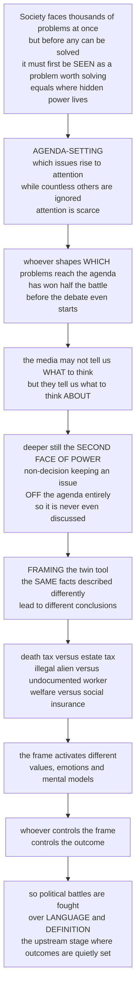

# 🗣️ Agenda-Setting and Framing

> [!abstract] TL;DR
> Long before the visible fight over *which* policy to pass, a quieter and far more consequential contest has already been decided: *which problems get seen as problems at all*, and *how* they are described. **Agenda-setting** is the process by which a handful of issues rise to the top of public, media, and government attention while thousands of others are ignored — because **attention is scarce**, whoever shapes *which* issues reach the agenda has won half the battle before debate even begins (the media "may not be successful in telling us what to think, but they are stunningly successful in telling us what to think *about*" — **McCombs & Shaw, 1972**). Deeper still lies the **second face of power** (**Bachrach & Baratz, 1962**): the power of **non-decision** — keeping an issue *off* the agenda entirely so it is never even discussed. Its twin is **framing** (**Entman, 1993**): selecting and emphasizing some aspects of a reality to promote one interpretation over another, so the *same* facts described differently yield *different* conclusions — a "death tax" versus an "estate tax," an "illegal alien" versus an "undocumented worker," poverty as personal failure versus structural injustice. Because problems are **constructed, not given**, **problem definition** is the most contested step in policymaking, and whoever controls the terms of debate has quietly pre-decided much of its outcome.

---

## Intuition

**Analogy — the doorman before the debate.** Picture a grand hall where society argues out its choices: taxes, health, guns, climate, immigration. Everyone watches the shouting inside. But the real power sits at the *door* — a doorman deciding which of the thousands of clamoring issues even gets *into* the room, and on any given night only a handful fit. A problem the doorman never admits is a problem that is never solved, never voted on, never even named. Half of politics is the loud debate we can see; the other, larger half is the silent triage at the entrance, where attention — the scarcest resource in public life — is rationed out. Whoever influences *what we argue about* has shaped the outcome before a single word is spoken inside.

Now notice a second, subtler trick. Even for the issues that *do* get in, the way they are *introduced* changes the whole conversation. The same policy walks through the door wearing a different name — is it a "death tax" or an "estate tax"? Is a program "welfare" or "social insurance"? Are people "illegal aliens" or "undocumented workers"? Is the glass half-empty or half-full? Each label switches on a different set of values, emotions, and mental pictures, and the room leans a different way — *without one fact having changed*. That is why political battles are so often fought over **language and definition**: control the terms, and you have tilted the table before the game begins. **Agenda-setting** is the fight over *what enters the room*; **framing** is the fight over *how it is dressed once inside* — and both happen upstream of every visible decision, which is exactly where an enormous amount of political power quietly lives.

---

## How It Works

### Core mechanics

1. **Attention is a scarce resource — hence an agenda exists at all.** Society faces effectively unlimited problems, but the **systemic agenda** (issues the public sees as legitimate concerns) and especially the **institutional/formal agenda** (issues policymakers are actively working on) can hold only a few at once. Because human and institutional attention is finite and processed *serially*, most issues never break through the **bottleneck** (Baumgartner & Jones). Getting *onto* the agenda is therefore the first and often decisive victory — power that operates *upstream* of any decision.

2. **How issues climb the agenda.** Rising salience is driven by: **problem indicators** (a worsening statistic — crime, prices, emissions); **focusing events** (crises, disasters, scandals, a viral incident that suddenly makes an issue undeniable); **policy entrepreneurs and advocates** who invest energy to push a pet issue; **interest-group mobilization**; **venue-shopping** (moving a fight from a hostile committee to a friendlier court, agency, or the mass public); and **symbols and framing** that dramatize a condition. In Kingdon's language, a **policy window** opens when a live problem, a ready solution, and a favorable political mood briefly align.

3. **The media's agenda-setting role.** McCombs & Shaw's classic finding: the *rank order* of issues the news emphasizes becomes the rank order of issues the public deems important. The media rarely dictate *opinions*, but they powerfully set the *priority list* — what we think *about*. Downs' **issue-attention cycle** describes the temporal shape: a problem is largely ignored, then a focusing event triggers alarmed discovery and a burst of attention, then — as costs of solving it become clear and novelty fades — attention declines and the issue slides back into the shadows, often unresolved.

4. **The three faces of power.** The **first face** (Dahl) is visible decision-making — who prevails in open conflict. The crucial **second face** (Bachrach & Baratz) is **non-decision-making** — the power to keep issues *off* the agenda so no decision is ever taken. Schattschneider's **mobilization of bias** captures it: "some issues are organized *into* politics while others are organized *out*." Lukes' **third face** goes furthest: shaping people's very *preferences and beliefs* so that grievances never even form and the status quo is accepted as natural — the most invisible and effective power of all.

5. **Problems are constructed, not given — problem definition.** A raw *condition* (people lack health insurance; the climate is warming) becomes a *problem needing action* only through interpretation. Stone shows this happens through **causal stories**: is the condition an accident, an act of nature, someone's deliberate fault, or a systemic failure? The answer implies who is to blame and what should be done. Problem definition is thus the most consequential — and most contested — step in the whole process.

6. **Framing — the twin tool.** Entman: to frame is to **select** some aspects of a perceived reality and make them **more salient**, promoting a particular problem definition, causal interpretation, moral evaluation, and remedy. Two families: **equivalence frames** (logically identical options worded as gains vs losses — "90 percent employment" vs "10 percent unemployment") and **emphasis frames** (highlighting *which considerations* are relevant — an immigration debate framed around *economy* vs *security* vs *humanitarianism*). Frames work by **activating values, emotions, and mental models** — Lakoff's point that metaphors and moral worldviews, not facts alone, decide which argument feels true. Politics becomes **frame competition**, and the power of **naming** ("death tax," "pro-life/pro-choice," "climate change" vs "global warming") is the power of quietly pre-loading the conclusion.

### One diagram — the hidden upstream stage of politics



---

## Key Concepts

### Secondary (the big picture)
- **Attention is scarce.** Society has countless problems but only a few can occupy the agenda at once — so *getting noticed* is itself a huge form of power.
- **Agenda-setting.** The media and other actors may not tell us *what* to think, but they are stunningly good at telling us what to think *about*.
- **The second face of power.** The most effective way to defeat something is to make sure it is *never raised* — keeping an issue off the agenda entirely (**non-decision**).
- **Framing.** The same facts, described differently, lead to different conclusions: "death tax" vs "estate tax," "welfare" vs "social insurance," glass half-empty vs half-full.

### Undergraduate (the mechanisms)
- **Two agendas.** The **systemic agenda** (issues the public sees as legitimate) vs the narrower **institutional/formal agenda** (issues government is actually working on); most issues never cross from one to the other.
- **Drivers of agenda change:** problem **indicators**, **focusing events** (crises, disasters, scandals), **policy entrepreneurs**, **interest-group mobilization**, **venue-shopping**, and **symbols**. Downs' **issue-attention cycle** traces the rise-then-fade of salience.
- **The three faces of power:** first face = visible decisions (Dahl); **second face = non-decision-making** and the **mobilization of bias** (Bachrach & Baratz; Schattschneider); **third face = shaping preferences** so grievances never form (Lukes).
- **Problem definition and framing:** problems are **constructed** via **causal stories** (Stone — whose fault, what kind of problem); Entman's framing = **selection + salience**; **equivalence frames** (gain/loss) vs **emphasis frames** (which considerations are highlighted).
- **Media effects trio:** **agenda-setting** (what to think about), **priming** (the criteria by which we then judge leaders and policies), and **framing** (how an issue is interpreted).

### Graduate (frontiers and synthesis)
- **Attention as the master variable.** Baumgartner & Jones's **punctuated equilibrium** grounds agenda dynamics in disproportionate, bounded information-processing: long stasis under a **policy monopoly** broken by rapid attention cascades once an **image** or **venue** shifts. Agenda-setting is the micro-story behind those punctuations.
- **First- vs second-level agenda-setting.** First level transfers *issue* salience; **second-level (attribute) agenda-setting** transfers the salience of particular *attributes* of an issue — the empirical bridge from agenda-setting to framing, with ongoing debate over how sharply the three concepts (agenda-setting, priming, framing) should be distinguished.
- **Agenda control and the manipulability of collective choice.** Formal results (McKelvey chaos, Riker's **heresthetics**) show that whoever controls the *order and dimensions* of what is voted on can often engineer the outcome — the social-choice underpinning of why controlling the agenda is controlling the result (see the sibling *Social_Choice_and_Voting*).
- **The changing information environment.** The **attention economy**, algorithmic curation, social-media virality, and **misinformation** reshape who sets agendas and frames — decentralizing agenda power away from legacy gatekeepers while intensifying the **contest over reality** itself.
- **Normative stakes.** Agenda-setting and framing pose the democratic questions *who gets to define problems?* and *whose issues are heard or silenced?* — and, for policy analysis, the imperative to **frame the problem well** before optimizing any solution.

---

## Python Demo

```python
"""
Agenda-Setting and Framing -- two computational signatures.

(a) ATTENTION SCARCITY / AGENDA COMPETITION.
    Attention is a scarce resource: many issues compete but only a few fit on
    the agenda at once. We show (i) Downs' ISSUE-ATTENTION CYCLE -- each issue
    spikes after a focusing event, then fades as attention moves on, so the
    agenda is dominated by only one or two issues at a time; and (ii) the
    AGENDA BOTTLENECK -- of many competing issues, only the top few by salience
    break through a hard capacity cutoff; the rest are 'organized out'.

(b) FRAMING EFFECT / PREFERENCE REVERSAL (Tversky & Kahneman's Asian-disease).
    The SAME policy outcome, described as a GAIN ('lives saved') vs a LOSS
    ('lives lost'), flips the majority's preferred choice -- a preference
    reversal produced by framing alone, with the facts held identical. We
    model a heterogeneous population with a prospect-theory value function and
    aggregate their choices under each frame.
"""
import numpy as np
import matplotlib.pyplot as plt

rng = np.random.default_rng(7)

# ============================================================
# (a) ATTENTION SCARCITY -- issue-attention cycle + bottleneck
# ============================================================
T = 240                        # months (20 years)
t = np.arange(T)

def attention_cycle(t, onset, height, rise=6.0, decay=30.0):
    """Downs-style spike-and-fade: fast alarmed rise, slow decline."""
    x = np.zeros_like(t, dtype=float)
    after = t >= onset
    dt = t[after] - onset
    x[after] = height * (1 - np.exp(-dt / rise)) * np.exp(-dt / decay)
    return x

issues = {
    "issue A": attention_cycle(t, 12, 1.00),
    "issue B": attention_cycle(t, 60, 0.85),
    "issue C": attention_cycle(t, 108, 0.70),
    "issue D": attention_cycle(t, 156, 0.95),
    "issue E": attention_cycle(t, 200, 0.60),
}

# The BOTTLENECK: a snapshot where 30 issues compete for scarce agenda slots.
n_issues = 30
salience = np.sort(rng.exponential(1.0, n_issues))[::-1]
capacity = 5                   # the agenda holds only a few issues at once
on_agenda = np.arange(n_issues) < capacity

# ============================================================
# (b) FRAMING EFFECT -- preference reversal from identical facts
# ============================================================
# 600 lives at stake; two programs described two ways:
#   GAIN frame: SURE = 200 saved;   RISK = 1/3 chance 600 saved, else 0
#   LOSS frame: SURE = 400 die;     RISK = 2/3 chance 600 die,  else 0
# The SURE options are the same outcome; the RISK options are the same gamble.
# Only the reference point (the frame) differs.
def w(p, gamma=0.61):
    """Tversky-Kahneman probability weighting (overweight small chances)."""
    return p**gamma / (p**gamma + (1 - p)**gamma) ** (1.0 / gamma)

def v(x, alpha, lam):
    """Prospect-theory value: gains x>=0 concave; losses x<0 steeper by lam."""
    x = np.asarray(x, dtype=float)
    return np.where(x >= 0, x**alpha, -lam * (-x)**alpha)

N = 20000
alpha = np.clip(rng.normal(0.88, 0.05, N), 0.5, 1.0)   # value curvature
lam   = np.clip(rng.normal(2.25, 0.40, N), 1.0, 4.0)   # loss aversion
temp  = 0.20                                            # choice noise

def pct_choosing_sure(V_sure, V_risk):
    """Logit choice, normalized by each frame's own value scale."""
    scale = 0.5 * (np.abs(V_sure) + np.abs(V_risk))
    z = (V_sure - V_risk) / (temp * scale)
    return 100.0 * (1.0 / (1.0 + np.exp(-z))).mean()

# GAIN frame: reference = 0 saved, outcomes are gains
sure_gain = pct_choosing_sure(v(200, alpha, lam), w(1/3) * v(600, alpha, lam))
# LOSS frame: reference = all 600 saved, outcomes are losses
sure_loss = pct_choosing_sure(v(-400, alpha, lam), w(2/3) * v(-600, alpha, lam))

# ============================================================
# Plots
# ============================================================
fig, ax = plt.subplots(1, 3, figsize=(15.5, 4.4))

# (a-i) issue-attention cycles over time
for name, series in issues.items():
    ax[0].plot(t, series, lw=1.4, label=name)
ax[0].set_title("Downs' issue-attention cycle\nattention spikes then fades, "
                "few issues at a time")
ax[0].set_xlabel("months"); ax[0].set_ylabel("issue salience")
ax[0].legend(fontsize=7, loc="upper right")

# (a-ii) the agenda bottleneck
colors = ["#d62728" if a else "#c7c7c7" for a in on_agenda]
ax[1].bar(np.arange(n_issues), salience, color=colors)
ax[1].axvline(capacity - 0.5, color="black", ls="--", lw=1.2)
ax[1].set_title(f"The agenda bottleneck\ntop {capacity} of {n_issues} break "
                "through, rest organized out")
ax[1].set_xlabel("issues, ranked by salience"); ax[1].set_ylabel("salience")

# (b) framing preference reversal
frames = ["GAIN frame\n'lives saved'", "LOSS frame\n'lives lost'"]
sure_vals = [sure_gain, sure_loss]
risk_vals = [100 - sure_gain, 100 - sure_loss]
xpos = np.arange(2)
ax[2].bar(xpos - 0.19, sure_vals, width=0.38, color="#1f77b4",
          label="chose the SURE program")
ax[2].bar(xpos + 0.19, risk_vals, width=0.38, color="#ff7f0e",
          label="chose the GAMBLE")
ax[2].axhline(50, color="grey", ls=":", lw=1.0)
ax[2].set_xticks(xpos); ax[2].set_xticklabels(frames)
ax[2].set_ylabel("percent of population"); ax[2].set_ylim(0, 100)
ax[2].set_title("Framing effect\nidentical facts, reversed majority choice")
ax[2].legend(fontsize=7, loc="upper center")

plt.tight_layout()
plt.show()

print(f"GAIN frame: {sure_gain:4.1f} percent chose the SURE program")
print(f"LOSS frame: {sure_loss:4.1f} percent chose the SURE program")
print("Same facts, opposite majorities -- the frame, not the facts, decided.")
```

**What to notice.** The left panel is agenda-setting's core scarcity: attention is a spotlight that can rest on only one or two issues at a time, and each is soon displaced — so *timing a focusing event* is how an entrepreneur seizes the beam. The middle panel is the **mobilization of bias**: a hard capacity cutoff means most issues are silently "organized out," never reaching the debate at all (the second face of power made quantitative). The right panel is framing: the *identical* underlying policy flips from a majority choosing the sure program to a majority choosing the gamble, purely because "lives saved" sets a gain reference and "lives lost" sets a loss reference — proof that the frame, not the facts, drove support.

---

## Real-World Applications

> **"Death tax" vs "estate tax" (equivalence framing and naming).** The U.S. estate tax touched only a tiny share of very large estates, yet re-labeling it the "death tax" reframed it as a universal, morally offensive penalty on dying — activating fairness and mortality intuitions across the whole electorate. The relabel, more than any new fact, drove decades of political momentum to shrink it. Naming *is* framing.

> **The 9/11 attacks and the security agenda (focusing event + agenda displacement).** A single catastrophic focusing event vaulted terrorism and homeland security to the top of the agenda essentially overnight, displacing issues that had dominated months earlier and opening a policy window for reforms (the Patriot Act, a new department) that were politically unthinkable the week before. The event set the agenda; competing issues were crowded out of the scarce spotlight.

> **Tobacco's long non-decision, then reframing (second face, then venue shift).** For decades a policy monopoly kept smoking framed as a matter of adult choice and agricultural jobs, effectively an *organized-out* issue — a textbook **non-decision**. Health advocates broke the stasis by *reframing* it as addiction, corporate deception, and harm to children, and by **venue-shopping** into courts, the FDA, and the states — flipping the same underlying facts into a public-health emergency and triggering rapid change.

> **"Global warming" vs "climate change" and message framing.** Strategists recognized that the phrase itself carried a frame (one emphasizing catastrophe, the other gradual variation), and that framing the issue around *economy and jobs*, *national security*, or *public health* rather than *distant environmental risk* shifts which audiences engage. The scientific facts are constant; the frame decides which values — and which coalitions — are activated.

---

## Common Pitfalls

- **Mistaking framing for lying.** Framing does not require any false claim — "90 percent survival" and "10 percent mortality" are *both* true. The power lies in **selection and emphasis**, which is why fact-checking alone rarely neutralizes a strong frame; you must contest the frame itself, not just the facts inside it.
- **Ignoring the second face of power.** Analysts who study only visible decisions (who won the vote) miss the *bigger* exercise of power: the issues that never reached a vote at all. Absence of conflict is not the same as absence of a grievance — it may be a triumph of **non-decision**.
- **Treating problems as objectively "given."** Assuming a condition self-evidently *is* the problem hides the contested step of **problem definition**. Every problem statement smuggles in a **causal story** (whose fault, what remedy) — accept it uncritically and you have already conceded the argument.
- **Confusing agenda-setting, priming, and framing.** They are distinct: agenda-setting sets *what* we attend to; **priming** sets the *criteria* by which we then judge; **framing** sets *how* the issue is interpreted. Collapsing them muddies both analysis and strategy.
- **Assuming framing effects are unbounded.** Frames compete, and strong prior values, credible counter-frames, and repeated exposure can blunt or reverse a frame. Treating audiences as infinitely manipulable overstates the effect and ignores **frame competition**.
- **Forgetting the normative question.** A purely technical view asks "which framing wins?" and skips the democratic one: *whose* problems get defined and heard, and whose are silenced. Agenda power is a distributional and legitimacy question, not just a communications tactic.

---

## Related Concepts

- [[Media_Propaganda_and_Political_Communication]] — the media-studies companion: agenda-setting, priming, and framing as *effects*; read it for the empirical program (McCombs & Shaw onward) that this note applies to the policy agenda.
- [[Public_Opinion_and_Political_Socialization]] — agenda-setting and framing are precisely how issue salience and interpretations are transmitted into public opinion; this note supplies the opinion-formation half of the loop.
- [[Reference_Dependence_and_Framing]] — the behavioral-economics twin of framing: *equivalence* frames work by moving the **reference point** (gain vs loss), the exact mechanism behind the Python demo's preference reversal.
- [[Prospect_Theory]] — the formal value function (concave in gains, convex and steeper in losses) that explains *why* a gain-frame and a loss-frame of identical facts flip risk attitudes and therefore choices.
- [[Political_and_Public_Rhetoric]] — the rhetoric of naming, metaphor, and definition ("death tax," "pro-life") is framing's craft; this note grounds why "you can win the argument by controlling the terms."
- [[Persuasion_and_Audience]] — framing activates values and emotions in specific audiences; the classical persuasion toolkit (ethos, pathos, logos, audience adaptation) is the mechanics beneath a successful frame.

Within this vault, this note sits directly beside its section siblings (files to come): *Public_Choice_and_Political_Economy* (the interests-and-incentives lens on who supplies agendas and frames), *Social_Choice_and_Voting* (the formal manipulability of agendas — agenda control and heresthetics), *Theories_of_the_Policy_Process* and *The_Policy_Process_and_Policy_Cycle* (where focusing events, policy windows, and punctuations locate this stage in the larger process), and *Collective_Action_and_Interest_Groups* (how groups mobilize bias to organize some issues in and others out).

---

## Review Questions

**Secondary.** Explain in your own words the difference between *what* people think and what people think *about*, and why controlling the second can be more powerful than controlling the first. Give one example of a policy whose name is itself a frame.

**Undergraduate.** Distinguish the **first**, **second**, and **third** faces of power, giving a concrete example of each. Then, using an issue of your choice, trace how a **focusing event**, a **policy entrepreneur**, and **venue-shopping** could move it from being "organized out" onto the formal agenda — and explain how a rival could try to *keep* it off through **non-decision**.

**Graduate.** "Framing is not deception, and its effects are neither unlimited nor evenly distributed." Defend or challenge this claim, drawing on the distinction between **equivalence** and **emphasis** frames, the concept of **frame competition**, and the difference between **agenda-setting**, **priming**, and **framing**. Then connect the argument to the *manipulability of collective choice*: how do results on **agenda control** (McKelvey/Riker) sharpen the worry that whoever sets the agenda has pre-decided the outcome, and what does this imply for democratic legitimacy and for the practice of policy analysis?

---

## Sources

- McCombs, M. E. & Shaw, D. L. (1972) — ["The Agenda-Setting Function of Mass Media," *Public Opinion Quarterly*](https://www.jstor.org/stable/2747787)
- Bachrach, P. & Baratz, M. S. (1962) — ["Two Faces of Power," *American Political Science Review*](https://www.jstor.org/stable/1952796)
- Entman, R. M. (1993) — ["Framing: Toward Clarification of a Fractured Paradigm," *Journal of Communication*](https://doi.org/10.1111/j.1460-2466.1993.tb01304.x)
- Tversky, A. & Kahneman, D. (1981) — ["The Framing of Decisions and the Psychology of Choice," *Science*](https://www.science.org/doi/10.1126/science.7455683)
- Stone, D. — [*Policy Paradox: The Art of Political Decision Making* (W. W. Norton)](https://wwnorton.com/books/9780393912722)

---

#public-policy #agenda-setting #framing #problem-definition #second-face-of-power
