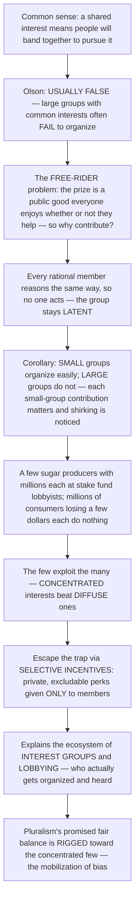

# 🤝 Collective Action and Interest Groups

> [!abstract] TL;DR
> Common sense says that if a group of people shares an interest, they will naturally band together to pursue it — workers unionize, consumers organize against price-gouging, the public mobilizes for clean government. **Mancur Olson's** revolutionary insight in *The Logic of Collective Action* (1965) is that this is **usually false**: large groups with shared interests routinely **fail to organize**, even when every member would gain. The culprit is the **free-rider problem** — when the benefit of the group's success is a **public good** everyone enjoys whether or not they helped (cleaner air, a higher industry price, honest government), each rational individual reasons "my little contribution won't make or break the outcome, and I get the benefit anyway, so why bother?" Everyone reasons this, so no one acts. The devastating corollary is the **group-size effect**: **small groups organize far more easily than large ones**, because in a small group each member's contribution visibly matters and shirking is noticed, while in a huge group free-riding dominates. Hence the master pattern of democratic politics — **concentrated benefits, diffuse costs**: a handful of sugar producers, each with millions at stake in a subsidy, will happily fund lobbyists, while the hundreds of millions of consumers who each pay a few extra dollars will not lift a finger, so **"the few exploit the many."** Groups escape the trap only through **selective incentives** — private perks (or sanctions) given *only* to members: a union's job protections, a professional body's certification, member-only insurance and magazines — that reward joining regardless of the collective goal. This logic explains the entire ecosystem of **interest groups and lobbying** — which interests get organized and heard (concentrated producers, professions) versus which stay voiceless (consumers, taxpayers, future generations) — and why the pluralist hope that competing groups would balance out fairly is **rigged toward the concentrated few**. Understanding collective action is understanding the deep logic of **who** gets organized in a democracy, and therefore **whose interests policy actually serves**.

---

## Intuition

**Analogy — the potluck no one cooks for.** Imagine a giant neighborhood potluck of ten thousand people. The rule is: whatever food appears on the table, everyone may eat, whether or not they cooked. You love a full table, and so does everyone else — a shared interest if ever there was one. So do you spend your Saturday cooking a lasagna? You reason: with ten thousand people, my one dish barely changes how full the table looks, and I get to eat regardless of whether I cook — so why bother? The trouble is that **all ten thousand people reason exactly the same way**, and the table stays empty. Everyone wanted the feast; no one produced it. That is the **collective action problem** in its purest form: a benefit everyone shares and no one is excluded from is a benefit almost no one will pay to create.

Now shrink the party to **four close friends**. Suddenly cooking makes sense again. Your dish is a quarter of the whole table, not a ten-thousandth — your effort visibly matters. And if you show up empty-handed, the other three *notice*, and you will pay for it in awkwardness and reputation. So the small group feasts while the giant one starves. This is Olson's **group-size effect**, and it is the single most counterintuitive result in the study of politics: **shared interest does not produce cooperation; small numbers and private stakes do.**

Here is the twist that turns a party anecdote into the machinery of government. Not everyone at the giant potluck is equally invested. Suppose one guest owns the catering company that would win a lucrative contract if the party is a success — for *that* guest the feast is worth millions, so they cook a banquet single-handedly, and everyone else free-rides on it. That is exactly how a small band of **sugar producers**, each with millions riding on a subsidy, out-organizes the hundreds of millions of consumers who each lose only a few dollars. The producers cook; the consumers eat the cost. This asymmetry — **concentrated benefits, diffuse costs** — is why "the few exploit the many" is not a slogan but a prediction. And the way a large group finally *does* organize is by handing out **doggy bags no one else can have**: a private perk you only get if you contribute — a union card that protects your job, a certification only members receive, a discount insurance plan. People join for the doggy bag and the feast (the collective good) comes along as a **by-product**. Once you see this, the whole zoo of lobbyists, trade associations, and professional bodies snaps into focus: it is a map of **which interests found a doggy bag and which never could**.

---

## How It Works

### Core Mechanics

1. **The benefit is a public good, so it is non-excludable.** The prize a group seeks — a tariff, cleaner air, a higher industry price, honest government — is typically enjoyed by *every* member of the group whether or not they helped win it. You cannot fence off the higher wage from the union member who skipped the strike, nor cleaner air from the citizen who never marched. Non-excludability is what makes free-riding rational (see [[Public_Goods]]).

2. **Each member's contribution is a drop in the bucket.** In a group of $n$ members sharing a total collective benefit $B$, each member's private slice is only $B/n$. As $n$ grows, that slice shrinks toward nothing, while the *cost* of contributing (dues, time, a day on strike) stays fixed. The individual calculus — "does my slice of the benefit exceed my personal cost?" — tips toward **not contributing** for almost everyone in a large group.

3. **Everyone free-rides, so the group under-provides.** The collective good is not provided at all (a **latent group** that never mobilizes) or is provided far below what all members would have wanted and paid for collectively. This is the same structure as an **n-player Prisoner's Dilemma**: the individually rational choice (don't contribute) yields a collectively irrational outcome (nothing gets done), even though everyone prefers universal contribution to universal free-riding (see [[Nash_Equilibrium]]).

4. **Group size flips the outcome.** Olson's taxonomy:
   - **Privileged group** — at least one member's private stake $B_i$ exceeds the *whole* cost $C$ of providing the good, so they provide it single-handedly and everyone else free-rides. (The catering guest cooks the banquet.)
   - **Intermediate group** — small enough that each member's contribution is noticeable and non-contribution is detected, so social pressure and strategic bargaining can sustain provision.
   - **Latent group** — so large that no member's contribution matters or is noticed; free-riding dominates and the group **cannot** organize on the strength of the collective good alone.

5. **Selective incentives break the deadlock.** A **selective incentive** is a private benefit or penalty applied *only* to those who contribute — it is **excludable**, unlike the collective good. Material perks (member-only insurance, publications, legal defense), social/solidary incentives (status, belonging, friendship), purposive incentives (the felt reward of the cause itself), and outright coercion (the closed/union shop, professional licensing you cannot practice without). People join to get the selective perk; the collective good is produced as a **by-product** of an organization sustained by private rewards.

6. **Concentrated interests systematically win.** Combine the group-size effect with unequal stakes and you get the master law of interest-group politics — **concentrated benefits, diffuse costs**. A few producers with enormous per-capita stakes clear the organizing hurdle easily; the vast public with tiny per-capita stakes never does. Policy therefore bends toward **rent-seeking** minorities — subsidies, tariffs, occupational licensing — at the expense of consumers and taxpayers who are individually too lightly affected to fight back.

7. **This shapes the whole ecosystem of representation.** Which groups get organized determines which voices policymakers hear. Producers, industries, and professions are over-represented in the lobbying ecosystem; consumers, taxpayers, the diffuse general public, and future generations are under-represented — Schattschneider's **"mobilization of bias,"** the observation that the pressure-group chorus "sings with a strong upper-class accent."

### Flow / Architecture



---

## Key Concepts

### 🟢 Secondary (the core idea)

- **Collective action problem** — the difficulty of getting people to cooperate for a *shared* goal when each individual is tempted to let others do the work.
- **Free-rider problem** — enjoying a benefit without paying for it. If everyone can free-ride, no one pays, and the benefit never gets made.
- **Public good** — something everyone can use and no one can be shut out of (clean air, national defense, an industry-wide price rise). Its non-excludability is what invites free-riding.
- **Small groups win** — a handful of people who each care a lot will organize; a huge crowd who each care only a little will not.
- **Selective incentive** — a private reward you get *only* if you join (a members-only discount, a union card, a certificate). It is the trick that gets big groups to organize.
- **Concentrated vs diffuse** — a few winners with a lot at stake beat a mass of losers with a little at stake, even when the losers' total loss is bigger. This is why "the few exploit the many."
- **Interest group / lobby** — an organized group that tries to influence government (a trade association, a union, a professional body, a cause group).

### 🟡 Undergraduate (Olson's logic and the interest-group ecosystem)

- **Olson's core theorem** — "unless the number of individuals is quite small, or unless there is coercion or some other special device to make individuals act in their common interest, rational, self-interested individuals will *not* act to achieve their common or group interests." This overturns the naive **pluralist** assumption that a shared interest automatically breeds an organization to defend it.
- **The three group types** — *privileged* (one member gains enough to provide the good alone), *intermediate* (small enough for strategic interaction and monitoring), *latent* (too large; free-riding dominates and organization requires selective incentives).
- **The by-product theory** — large lobbying organizations survive not on the collective good they pursue but as a **by-product** of selling excludable selective incentives (insurance, publications, services) to members.
- **Taxonomy of selective incentives** — *material* (money, services, discounts), *solidary* (friendship, status, identity), *purposive* (the intrinsic satisfaction of advancing a cause — crucial for public-interest groups that lack material perks), and *coercive* (closed shops, mandatory bar membership, licensing).
- **Concentrated benefits, diffuse costs** — the political economy of asymmetric stakes. Narrow producer interests organize and lobby; the broad consuming/taxpaying public does not. The predictable outputs are **rent-seeking** policies: tariffs, quotas, subsidies, occupational licensing, regulatory capture.
- **Types of interest groups** — *economic* (business/trade, labor unions, professional associations) versus *cause / public-interest* groups (environmental, consumer, civil-rights) that face a *special* free-rider problem because their benefit is a pure public good with few natural selective incentives.
- **Channels of influence** — direct **lobbying**, campaign finance and PACs, expert **information provision**, **litigation** (test cases), **grassroots** mobilization, **astroturf** (fake grassroots), and the **revolving door** between industry and regulators.
- **Policy subsystems** — **iron triangles** (a cozy, stable alliance of an agency, a congressional committee, and an interest group) and looser, more contested **issue networks** describe how organized interests embed themselves in day-to-day policymaking.
- **The mobilization of bias** — Schattschneider's point that the interest-group universe is skewed toward the organized and the affluent, so "the flaw in the pluralist heaven is that the heavenly chorus sings with a strong upper-class accent."

### 🔴 Graduate (formal structure, critiques, and the escape routes)

- **The n-player Prisoner's Dilemma** — collective action formalized: "don't contribute" is a dominant strategy for each player, so the unique Nash equilibrium is universal defection, Pareto-dominated by universal cooperation. Group size worsens the gap between individual and collective rationality.
- **Marginal per-capita return (MPCR)** — in the linear public-goods game, each unit contributed returns $a/n$ to the contributor (where $1 < a < n$). Since $a/n < 1$, contributing is dominated, and the incentive to free-ride *rises* as $n$ grows — the analytic engine of Olson's group-size result.
- **Critiques and refinements of Olson** — the **critical-mass / threshold** models of Marwell, Oliver, and Granovetter show heterogeneity (a few high-interest, low-cost "early risers") can ignite production even in large groups; **Hardin (1982)** reframes collective action as a many-person PD and stresses conventions and contracts by convention; behavioral evidence shows conditional cooperation and warm-glow giving that pure self-interest cannot explain.
- **Ostrom's rejoinder** — *Governing the Commons* (1990) empirically refutes the claim that large groups *always* fail: communities *do* self-organize to manage common-pool resources when Ostrom's **design principles** hold (clear boundaries, congruence of rules with local conditions, collective-choice arrangements, **monitoring**, **graduated sanctions**, cheap conflict resolution, recognized rights to organize, nested enterprises). See [[Overexploitation_and_Sustainable_Harvesting]].
- **Repeated interaction and reciprocity** — in ongoing relationships, cooperation becomes an equilibrium via credible punishment (grim trigger, tit-for-tat) once players value the future enough — the **Folk Theorem** escape hatch from the one-shot dilemma (see [[Repeated_Games_and_Folk_Theorems]]).
- **Resource mobilization & political-entrepreneur theories** — social movements arise not from grievance alone but from mobilizable resources, organizational infrastructure, and **entrepreneurs** who supply selective incentives and bear start-up costs; **federated** structures (national body + local chapters) and patrons/foundations subsidize the fixed costs of organizing.
- **Corporatism vs pluralism** — where **pluralism** (Dahl, Truman) imagines many competing groups freely balancing, **neo-corporatism** describes a small number of peak associations (labor, capital, state) formally incorporated into bargaining — a different institutional answer to who gets organized.
- **Political inequality** — the normative payoff: because collective action is systematically easier for the concentrated and the affluent, unregulated interest-group politics reproduces and amplifies inequality, under-representing diffuse and disadvantaged interests. This is the theoretical bridge to capture, rent-seeking, and the accountability failures analyzed elsewhere in this vault.
- **Digital and low-cost mobilization** — the internet lowers the fixed costs of coordination and information-sharing, partially relaxing Olson's constraint for some latent groups — though it also enables cheap **astroturf** and can substitute shallow "clicktivism" for durable organization.

---

## Python Demo

```python
# Collective action, modeled three ways:
#   (a) FREE-RIDING vs GROUP SIZE  -> Olson's "small groups win"
#   (b) CONCENTRATED vs DIFFUSE    -> the few beat the many
#   (c) SELECTIVE INCENTIVES       -> rescuing a large, latent group
import numpy as np
import matplotlib.pyplot as plt

# ---- Shared behavioral rule ------------------------------------------
# An individual mobilizes (contributes / joins) with a probability that
# RISES with their PER-CAPITA STAKE in the collective good and FALLS with
# the private COST of participating -- a logistic cost-benefit weighing.
def prob_mobilize(per_capita_stake, cost, sharpness):
    z = sharpness * (per_capita_stake - cost)
    return 1.0 / (1.0 + np.exp(-z))

# =====================================================================
# (a) FREE-RIDING vs GROUP SIZE  ->  "small groups win"
# =====================================================================
# A collective good worth B in TOTAL is split among n members, so each
# member's private slice is only B/n. The cost of contributing is fixed.
B_total = 100.0                              # total value of the collective good
cost_a  = 1.0                                # private cost of contributing
n_vals  = np.logspace(0, 6, 300)            # group size: 1 -> 1,000,000
per_cap = B_total / n_vals                   # each member's slice shrinks with n
organized = prob_mobilize(per_cap, cost_a, sharpness=3.0)

# =====================================================================
# (b) CONCENTRATED vs DIFFUSE  ->  the few beat the many
# =====================================================================
# Producers: few actors, huge per-capita stake.  Consumers: vast numbers,
# tiny per-capita stake -- even though their TOTAL loss is LARGER.
labels       = ["Producers\n(concentrated)", "Consumers\n(diffuse)"]
n_members    = np.array([20.0, 50_000_000.0])
total_stake  = np.array([200.0, 300.0])      # consumers lose MORE in total
per_capita_b = total_stake / n_members       # 10.0 each  vs  6e-6 each
p_mob        = prob_mobilize(per_capita_b, cost=0.1, sharpness=100.0)
pressure     = n_members * p_mob * per_capita_b   # effective political pressure

# =====================================================================
# (c) SELECTIVE INCENTIVES  ->  rescuing the large latent group
# =====================================================================
# Take a HUGE (latent) group and add a private, MEMBER-ONLY perk of value
# v (job protection, certification, insurance). The join decision now
# weighs (tiny collective slice + selective perk) against the cost.
n_big       = 1_000_000
tiny_slice  = B_total / n_big                # ~1e-4: essentially nothing
v_vals      = np.linspace(0.0, 3.0, 300)     # value of the selective perk
with_incent = prob_mobilize(tiny_slice + v_vals, cost_a, sharpness=3.0)
baseline    = prob_mobilize(tiny_slice, cost_a, sharpness=3.0)  # no perk -> latent

# ---------------------------------------------------------------------
fig, ax = plt.subplots(1, 3, figsize=(16, 4.6))

# Panel (a): free-riding rises with group size
ax[0].plot(n_vals, organized, color="crimson", lw=2.2)
ax[0].set_xscale("log")
ax[0].axvspan(1, 10,     alpha=0.12, color="green")
ax[0].axvspan(10, 1000,  alpha=0.12, color="orange")
ax[0].axvspan(1000, 1e6, alpha=0.12, color="gray")
ax[0].text(3,   0.06, "Privileged",   ha="center", fontsize=8)
ax[0].text(100, 0.06, "Intermediate", ha="center", fontsize=8)
ax[0].text(3e4, 0.06, "Latent",       ha="center", fontsize=8)
ax[0].set_xlabel("Group size n  (log scale)")
ax[0].set_ylabel("Fraction who organize / contribute")
ax[0].set_title("(a) Free-riding rises with group size\nSMALL groups win")

# Panel (b): concentrated beat diffuse
ax[1].bar(labels, pressure, color=["steelblue", "lightgray"], edgecolor="black")
for i, p in enumerate(p_mob):
    ax[1].text(i, pressure[i], f"mobilized: {p*100:.0f}%\ntotal stake: {total_stake[i]:.0f}",
               ha="center", va="bottom", fontsize=8)
ax[1].set_ylabel("Effective political pressure")
ax[1].set_title("(b) Concentrated beat diffuse\nconsumers lose MORE in total, yet stay silent")

# Panel (c): selective incentives rescue the latent group
ax[2].plot(v_vals, with_incent, color="darkgreen", lw=2.2, label="With selective incentive")
ax[2].axhline(baseline, ls="--", color="red", label="No incentive (latent group)")
ax[2].set_xlabel("Value of selective (member-only) incentive v")
ax[2].set_ylabel("Fraction who join")
ax[2].set_title("(c) Selective incentives rescue\nthe large latent group")
ax[2].legend(fontsize=8, loc="center right")

plt.tight_layout()
plt.savefig("collective_action.png", dpi=120)
plt.show()

# ---- Numbers that make Olson's point ----
print(f"(a) organize fraction at n=10:        {prob_mobilize(B_total/10, cost_a, 3.0):.3f}")
print(f"(a) organize fraction at n=1,000,000: {prob_mobilize(B_total/1e6, cost_a, 3.0):.3f}")
print(f"(b) producers mobilized: {p_mob[0]*100:5.1f}%   pressure = {pressure[0]:7.1f}")
print(f"(b) consumers mobilized: {p_mob[1]*100:5.1f}%   pressure = {pressure[1]:7.3f}")
print(f"(c) join fraction  no perk: {baseline:.3f}   with perk v=2: "
      f"{prob_mobilize(tiny_slice+2.0, cost_a, 3.0):.3f}")
```

**What you see.** Panel (a): as group size climbs from a handful to a million, each member's slice of the collective good shrinks below the cost of acting, so the fraction who organize collapses from ~100% (a *privileged* group) toward ~0% (a *latent* one) — Olson's "small groups win," drawn as a curve. Panel (b): producers (20 firms, $10M each) mobilize fully while consumers (50 million people, a few dollars each) stay essentially silent — **even though the consumers' total stake ($300) is larger than the producers' ($200)** — so effective political pressure is lopsidedly concentrated. Panel (c): bolt a private, member-only perk onto the hopeless million-member group and watch the join rate climb from near-zero back to near-total as the perk's value rises — the selective-incentive escape hatch, restoring organization *independently* of the collective goal.

---

## Real-World Applications

- **Trade protection (sugar, steel, ethanol).** The textbook case of concentrated benefits and diffuse costs: a few dozen U.S. sugar producers reap billions from price supports and import quotas that cost each consumer only a few dollars a year. The producers lobby relentlessly; the consumers never organize. Protectionism, farm subsidies, and import quotas are the recurring political fingerprint of the group-size effect.
- **Occupational licensing.** Incumbent practitioners (hairdressers, interior designers, taxi medallion holders) are a concentrated interest that captures large per-capita rents from licensing rules; would-be entrants and the diffuse consuming public bear the cost. Licensing boards are near-perfect **iron triangles**.
- **Labor unions and the closed/union shop.** A pure Olsonian solution: because a negotiated wage is a public good for all workers in a firm, unions historically relied on **coercive selective incentives** (union shops requiring membership) plus material perks (grievance representation, benefits) to overcome free-riding. The decline of union security laws is, in Olson's terms, the removal of the selective incentive.
- **Professional associations (AMA, ABA, engineering bodies).** Sustained less by their lobbying output (a collective good) than by **selective incentives** — certification, journals, insurance, continuing education, conferences — the classic **by-product theory** in action.
- **Environmental and consumer groups.** Public-interest groups pursue pure public goods (clean air, product safety) with almost no natural material selective incentives, which is exactly why they are perennially under-funded relative to the industries they oppose — and why they lean on **purposive** and **solidary** incentives, foundation grants, and political entrepreneurs. AARP is the exception that proves the rule: it thrives on member-only discounts and insurance.
- **Ostrom's commons success stories.** Swiss alpine grazing commons, Japanese village forests, Spanish *huerta* irrigation, and Maine lobster gangs show large-ish groups *escaping* the trap through monitoring, graduated sanctions, and locally crafted rules — the empirical counterweight to Olson's pessimism.
- **Climate change — the collective action problem at planetary scale.** Emission cuts are a global public good; every country is tempted to free-ride on others' abatement, and future generations (the most diffuse interest imaginable) cannot lobby at all. The entire architecture of climate treaties is an attempt to manufacture selective incentives and monitoring for a latent global group.

---

## Common Pitfalls

- **Assuming shared interest implies organization (the pluralist fallacy).** The single most important lesson: a common interest does **not** conjure a group to defend it. Most large latent interests are *never* organized, and their silence is not consent — it is the free-rider problem. Always ask "who found a selective incentive?" before asking "who benefits?"
- **Confusing total stake with political power.** Consumers and taxpayers lose *more in aggregate* than producers gain, yet lose politically, because power tracks **per-capita** stakes and organizability, not totals. Reading policy off "who has the biggest total interest" gets the prediction backwards.
- **Treating selective incentives as merely material.** Many real groups run on **solidary** (identity, belonging) and **purposive** (moral commitment to the cause) incentives, not cash perks. Ignoring these makes public-interest and social movements look impossible when they demonstrably exist.
- **Over-reading Olson as an iron law.** Olson describes a strong *tendency*, not a certainty. Threshold/critical-mass dynamics, repeated interaction, entrepreneurs, federation, and Ostrom's design principles all let some large groups organize. "Large groups can never act" is a caricature.
- **Mistaking astroturf for grassroots.** Because genuine mass mobilization is hard, well-funded concentrated interests manufacture the *appearance* of a diffuse movement (astroturf) to borrow its legitimacy. Corporate campaigns dressed as citizen uprisings are a predictable product of the asymmetry, not evidence against it.
- **Ignoring the by-product logic when reading lobbying budgets.** An association's political clout often has little to do with its members' agreement on policy and everything to do with the revenue from selling them insurance or certification. Judge influence by the organization's *selective-incentive* base, not its stated mission.
- **Assuming digital tools dissolve the problem.** Low coordination costs help, but they also enable shallow, disposable participation and cheap astroturf. Lower fixed costs relax Olson's constraint; they do not repeal it.

---

## Related Concepts

- [[Public_Goods]] — the non-excludable, non-rival good at the heart of the free-rider problem; collective action is the *political* face of what public-goods theory is the *economic* face of.
- [[Political_Participation_and_Civil_Society]] — applies Olson, Ostrom, and Putnam directly to voting, social movements, and the associational life that mediates state and citizen.
- [[Nash_Equilibrium]] — collective action is an n-player Prisoner's Dilemma whose unique equilibrium (universal free-riding) is Pareto-dominated by cooperation; the formal engine of Olson's pessimism.
- [[Repeated_Games_and_Folk_Theorems]] — the escape hatch: ongoing interaction plus credible punishment (grim trigger, tit-for-tat) can sustain cooperation that the one-shot game destroys.
- [[Overexploitation_and_Sustainable_Harvesting]] — the tragedy of the commons is collective action's mirror image (over-consuming a shared resource rather than under-providing a shared good), and Ostrom's design principles show how communities self-organize to solve it.

Within this vault, collective action is the analytic core that connects to **Public_Choice_and_Political_Economy** (rent-seeking and the supply side of concentrated-interest capture), **Public_Goods_and_Collective_Provision** (why markets and voluntary effort under-provide), **Institutions_Rules_and_Commons_Governance** (Ostrom's rules that let groups escape the trap), **Social_Choice_and_Voting** (aggregating the preferences that groups mobilize around), and **Corruption_Accountability_and_Transparency** (what happens when concentrated interests capture the agencies meant to check them).

---

## Review Questions

**🟢 Secondary.** Ten thousand neighbors would all enjoy a cleaner shared park, yet the park stays dirty because no one volunteers to clean it. Using the words *free-rider* and *public good*, explain why. Then explain why a block of four neighbors would probably keep *their* small shared courtyard clean.

**🟡 Undergraduate.** A tariff on imported steel gives 30 domestic steel firms $60 million in extra profit while raising costs for 300 million consumers by about $0.50 each. Total consumer loss ($150M) exceeds producer gain ($60M), yet the tariff passes. Explain the outcome using *concentrated benefits and diffuse costs*, the *group-size effect*, and *selective incentives*. Which side is a latent group, and why can it not fight back?

**🔴 Graduate.** Olson predicts that large latent groups cannot organize on the strength of the collective good alone, yet mass environmental movements, large unions, and Ostrom's commons associations demonstrably exist. Reconcile the theory with the evidence: identify at least three distinct mechanisms (formal or empirical) by which large groups escape the collective action trap, and explain the conditions under which each operates. Where do these mechanisms leave Olson's core theorem — refuted, bounded, or merely qualified?

---

## Sources

- Olson, Mancur. *The Logic of Collective Action: Public Goods and the Theory of Groups.* Harvard University Press, 1965.
- Schattschneider, E. E. *The Semisovereign People: A Realist's View of Democracy in America.* Holt, Rinehart and Winston, 1960.
- Hardin, Russell. *Collective Action.* Johns Hopkins University Press / Resources for the Future, 1982.
- Ostrom, Elinor. *Governing the Commons: The Evolution of Institutions for Collective Action.* Cambridge University Press, 1990.
- Truman, David B. *The Governmental Process: Political Interests and Public Opinion.* Alfred A. Knopf, 1951.

---

#public-policy #collective-action #free-rider-problem #interest-groups #selective-incentives
