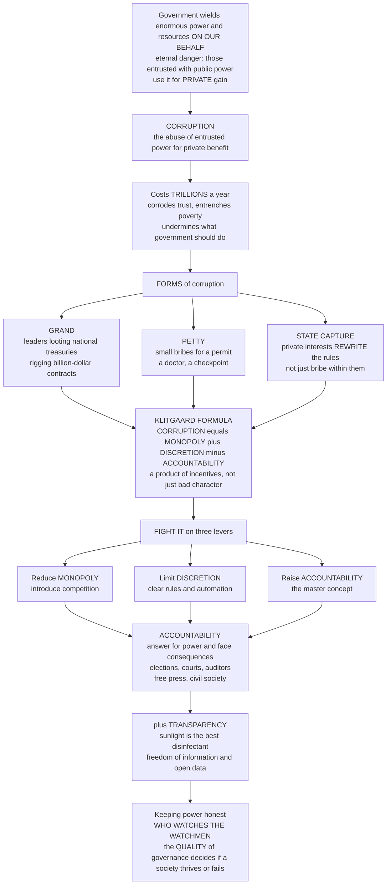

# 🔍 Corruption, Accountability, and Transparency

> [!abstract] TL;DR
> Government wields enormous power and controls vast resources *on our behalf*, which creates an eternal danger: the people entrusted with public power will use it for **private** gain instead. That abuse is **corruption** — "the abuse of entrusted power for private benefit" — and it is one of the most destructive forces in human affairs, estimated to cost **trillions** a year while corroding trust, entrenching poverty, and undermining everything government is supposed to do. Corruption ranges from **grand** (leaders looting treasuries, rigging billion-dollar contracts) to **petty** (the small bribe for a permit, a doctor, a checkpoint) to systemic **state capture** (where private interests do not merely bribe *within* the rules but rewrite the rules themselves). Klitgaard's formula captures why it is a predictable product of incentives, not just bad character: **corruption = monopoly + discretion − accountability**. So the whole science of fighting it targets those three levers — reduce monopoly (competition), limit discretion (clear rules, automation), and above all raise **accountability**, the master concept: power-holders must *answer* for their actions and face *consequences* through elections (vertical), courts and auditors and watchdogs (horizontal), and a free press and civil society (social) — reinforced by **transparency**, on the principle that "sunlight is the best disinfectant." Understanding these three ideas is understanding how societies try to keep power honest — the eternal problem of "who watches the watchmen" — and why the *quality* of governance, more than its mere form, decides whether a society thrives or fails.

---

## Intuition

**Analogy — the treasurer with the only key.** Imagine a village that pools its harvest into one great storehouse and hands the single key to one trusted person, the treasurer, to manage on everyone's behalf. This is government in miniature: we surrender power and resources to officials because collective goods — roads, courts, defence, schools — cannot be provided any other way. But the moment we hand over the key, a permanent temptation is born. The treasurer alone decides who eats and when; no one else can open the door; and if the villagers are too busy, too scattered, or too afraid to check the ledgers, the treasurer can quietly skim grain for himself, sell the best sacks to his cousin, and charge a "fee" to anyone wanting their fair share. That skim is **corruption**: the abuse of *entrusted* power — power we lent — for *private* benefit. It is not exotic; it is the default outcome whenever one person holds a **monopoly** over something valuable, has **discretion** to decide with little constraint, and faces no **accountability** because no one is watching or able to punish.

That is why Robert Klitgaard reduced the whole problem to a chalkboard equation: **corruption = monopoly + discretion − accountability**. Corruption flourishes wherever an official is the *only* one who can grant your licence (monopoly), *decides* your case with wide latitude (discretion), and answers to *no one* who can catch and sanction the abuse (missing accountability). Read the formula and the cure writes itself: introduce competition so the treasurer is not the only key-holder; write clear rules so his decisions are constrained; and — the master lever — build **accountability** so he must answer for the ledgers and face consequences if they do not add up. Accountability comes in layers: the villagers can vote for a new treasurer (elections), a council of elders can audit the store (courts, auditors, watchdogs), and a village crier can shout what he sees (a free press and civil society). And the cheapest, most powerful reinforcement of all is **transparency** — simply hanging the ledger on the storehouse wall for everyone to read. "Sunlight is the best disinfectant": what is visible is harder to steal. Corruption, accountability, and transparency are the three sides of one eternal question — *who watches the watchmen?* — and the answer a society gives determines whether the storehouse feeds everyone or just the man with the key.

---

## How It Works

### Core mechanics

1. **The entrustment problem.** All government rests on delegation: citizens (principals) entrust power and money to officials (agents) to act for the common good. Wherever there is entrusted power, there is the risk of its abuse — the agent serving himself rather than the principal. Corruption is that risk realized.
2. **The economics of the bribe (Becker / Rose-Ackerman).** Corruption is a *rational choice*, not merely a moral failing. An official offends when the **expected gain exceeds the expected cost**: bribe value versus (probability of detection × penalty), net of any moral cost or lost salary. Raise detection or penalty enough that expected punishment outweighs the bribe, and the calculus flips toward honesty. This is Becker's crime-deterrence logic applied to graft.
3. **Klitgaard's structural formula.** *Corruption = Monopoly + Discretion − Accountability.* Monopoly gives the official something scarce to sell; discretion lets him decide who gets it and on what terms; the absence of accountability means no one detects or punishes the deal. The three combine multiplicatively in effect: high monopoly and high discretion with low accountability is the danger zone.
4. **The forms, by scale and mechanism.** By **scale**: *grand* corruption (high-level looting, kleptocracy, rigged mega-contracts) versus *petty* corruption (everyday bribes to low-level officials). By **mechanism**: bribery, embezzlement, extortion, fraud, nepotism and cronyism, conflict of interest, and patronage/clientelism. The most corrosive form is **state capture** — private interests shaping the laws, regulators, and institutions *themselves*, so the abuse becomes legal and self-perpetuating rather than a violation of the rules.
5. **Accountability as the master remedy.** Accountability = **answerability** (power-holders must explain and justify) + **enforceability** (consequences must follow). It runs in three directions: **vertical** (citizens over rulers via elections and participation), **horizontal** (state institutions checking each other — courts, legislatures, audit offices, ombudsmen, anti-corruption agencies, separation of powers), and **social/diagonal** (media, NGOs, whistleblowers — the "fourth estate" pulling the fire alarm).
6. **Transparency as the enabler.** Transparency makes accountability *possible*: freedom-of-information laws, open budgets and open contracting, asset and interest disclosure, and open data raise the probability that wrongdoing is *seen*, which raises detection, which raises deterrence. Visibility is necessary but not sufficient — someone must be able to *act* on what the light reveals.
7. **The trap.** Because each person's honesty is cheaper when others are honest and pointless when everyone else is corrupt, corruption can be a **self-sustaining equilibrium** — a collective-action problem with two stable states. That is why isolated, incremental fixes often fail where corruption is systemic, and why a coordinated shift (or a hard enforcement shock) may be needed to *tip* a society from a dirty to a clean equilibrium.

### Flow / Architecture



---

## Key Concepts

### Secondary

- **Corruption** — the abuse of *entrusted* power for *private* gain. The key word is "entrusted": the power was lent by the public, so using it for yourself is a betrayal, not just a crime.
- **Grand vs petty corruption** — *grand* is the powerful stealing big (a president looting a treasury, a minister taking a cut of a highway contract); *petty* is the small, everyday shakedown (a clerk who will only stamp your form for a "tip," a nurse who wants cash to see you sooner). Petty corruption hits the poor hardest, like a hidden tax.
- **Bribery, embezzlement, nepotism** — the everyday faces of corruption: paying an official to bend a decision (bribery), stealing money you were trusted to manage (embezzlement), and handing jobs or favours to relatives and friends instead of the deserving (nepotism and cronyism).
- **Accountability** — the simple demand that people with power must *answer* for what they do and *face consequences* if they abuse it. If nothing happens to a cheat, cheating pays.
- **Transparency** — letting the public *see* what government does: its budgets, its contracts, its data. "Sunlight is the best disinfectant" — it is far harder to steal in the open than in the dark.

### Undergraduate

- **Klitgaard's formula** — *Corruption = Monopoly + Discretion − Accountability.* A diagnostic tool: to predict where corruption will appear, look for scarce things controlled by a single official (monopoly) who decides with little constraint (discretion) and is not watched or punishable (weak accountability). To reduce it, move any of the three levers.
- **The economics of corruption (Becker, Rose-Ackerman)** — the official as a rational calculator who takes a bribe when the expected gain beats the expected cost, where expected cost = probability of detection × penalty. This reframes anti-corruption from moralizing to *incentive design*: raise detection (transparency, audits) and penalties, raise the cost of losing an honest salary (decent pay), and the math tilts toward integrity.
- **State capture vs bribery within the rules** — ordinary corruption breaks the rules; **state capture** *buys the rules*. Powerful interests fund campaigns, revolving-door regulators, and tailor-made laws so that the outcome they want becomes *legal*. Capture is more dangerous precisely because it needs no illegal act — it corrupts the institutions themselves.
- **The typology** — bribery, embezzlement, extortion (demanding payment under threat), fraud, conflict of interest, patronage and clientelism (trading public jobs and benefits for political loyalty), and legal-but-improper influence. Corruption overlaps with, but is distinct from, **rent-seeking**: lobbying to capture unearned wealth through the political process, often perfectly legal.
- **The three directions of accountability** — **vertical** (citizens judging rulers through elections and protest), **horizontal** (state bodies checking each other: courts, legislatures, supreme audit institutions, ombudsmen, anti-corruption commissions, separation of powers), and **social/diagonal** (press, NGOs, and whistleblowers mobilizing the other two). Effective control usually needs all three; any one alone can be captured or asleep.
- **Consequences** — economically, corruption lowers growth and investment, misallocates resources, and acts as a *regressive tax* that falls hardest on the poor; politically, it erodes legitimacy, trust, and the rule of law, breeding instability; socially, it entrenches inequality and poverty. It is a core barrier to development. The old claim that corruption "greases the wheels" of a slow bureaucracy is largely **refuted**: it mostly *sands* the wheels, because officials have every incentive to create more delays to extract more bribes.
- **Freedom of information and open government** — right-to-know laws, open budgets, open contracting, and asset disclosure operationalize transparency. The causal chain is: visibility → higher probability of detection → deterrence → accountability.

### Graduate

- **The principal-agent framing** — corruption as the agency problem of governance: citizen-principals cannot fully observe or control official-agents who hold private information and their own interests. Classic **principal-agent** anti-corruption assumes a *clean principal at the top* who will police corrupt agents (via monitoring, incentives, penalties). This underpins most "good-governance" reform toolkits.
- **The collective-action critique (Persson, Rothstein, Teorell; Mungiu-Pippidi)** — where corruption is *systemic*, there is no clean principal — everyone, including the would-be enforcers, is embedded in the corrupt norm. Corruption becomes a **self-reinforcing equilibrium**: being honest is costly and futile when all others are corrupt, so the honest defect. This yields **multiple equilibria** — a "clean" and a "corrupt" stable state — and explains why importing anti-corruption agencies into captured states so often fails. The remedy is a *coordinated* shift (a "big-bang" change in shared expectations plus credible enforcement) that tips society across the unstable threshold.
- **Answerability + enforceability** — accountability decomposes into the obligation to *explain and justify* (answerability) and the capacity to *impose consequences* (enforceability). Many "transparency" reforms deliver answerability without enforceability — reports no one can act on — which is why sunlight alone rarely disinfects.
- **The resource curse and enabling conditions** — natural-resource rents, weak institutions, low state capacity, low official pay, wide discretionary regulation, and weak rule of law are structural accelerants. Windfall rents in particular sever the fiscal link between rulers and taxpayers, weakening vertical accountability (no representation without taxation, and vice versa).
- **Measuring the unmeasurable** — corruption is hidden, so we rely on *perception* indices (Transparency International's **Corruption Perceptions Index**, the World Bank's **Control of Corruption** indicator) and experience surveys. These are noisy, perception-laden, and endogenous to development, complicating causal inference and cross-country ranking; treating a perceptions index as a precise measure of *behaviour* is a category error.
- **Ethical universalism vs particularism (Mungiu-Pippidi)** — the deep transition is from a *particularistic* order (state resources distributed by personal connection and status) to **ethical universalism** (impartial treatment, "the same rules for everyone"). Control of corruption is less a matter of catching bad apples than of shifting the *governance equilibrium* toward impartiality — the essence of "good governance" and, empirically, a leading determinant of prosperity.
- **The anti-corruption strategy space** — reduce monopoly (competition, deregulation, market reform), limit discretion (clear rules, simplification, automation and e-government), and raise accountability and detection (independent audits, an autonomous and empowered anti-corruption agency, a free press, asset declarations, whistleblower protection, e-procurement), plus positive incentives (merit hiring, adequate pay, meritocracy). Internationally, the **UN Convention against Corruption (UNCAC)**, the OECD Anti-Bribery Convention, and cross-border asset recovery attack the *supply* side and safe havens.

---

## Python Demo

```python
# Two quantitative pictures of corruption as a problem of INCENTIVES.
#
#   (a) KLITGAARD DRIVERS / BECKER DETERRENCE. Model the fraction of officials
#       who take bribes as a logistic function of (Monopoly + Discretion) minus
#       ACCOUNTABILITY. Accountability = detection probability x penalty. As
#       accountability rises past the point where expected punishment exceeds
#       the bribe gain, corruption collapses. Higher monopoly+discretion shifts
#       the whole curve right: you need more accountability to hold the line.
#
#   (b) THE CORRUPTION TRAP -- MULTIPLE EQUILIBRIA. Model corruption as a norm:
#       an official's incentive to be corrupt RISES with the fraction of others
#       who are corrupt (detection is diluted, stigma vanishes, honesty is
#       pointless). The best-response map can cross the 45-degree line THREE
#       times -> two STABLE equilibria (a clean state near 0 and a corrupt state
#       near 1) plus an unstable tipping point. Raising enforcement/transparency
#       enough makes the corrupt equilibrium DISAPPEAR: society tips to clean.
#
# Pure numpy + matplotlib.

import numpy as np
import matplotlib.pyplot as plt

fig, (ax1, ax2) = plt.subplots(1, 2, figsize=(13, 5.4))

# ----------------------------------------------------------------------
# (a) Klitgaard drivers + Becker deterrence.
#     corruption(A) = logistic( k * ( MD - A ) )
#       MD = monopoly + discretion pressure (0..1), A = accountability (0..1)
#     Corruption crosses 0.5 exactly where A = MD, i.e. where the expected
#     penalty equals the bribe gain -- the Becker threshold.
# ----------------------------------------------------------------------
A = np.linspace(0, 1, 400)          # accountability = detection prob x penalty
k = 11.0

def corruption_level(MD, A):
    return 1.0 / (1.0 + np.exp(-k * (MD - A)))

for MD, lab, col in [(0.85, "High monopoly + discretion", "darkred"),
                     (0.55, "Medium", "orange"),
                     (0.30, "Low: competition + clear rules", "green")]:
    ax1.plot(A, corruption_level(MD, A), lw=2.6, color=col, label=lab)
    ax1.axvline(MD, ls=":", color=col, alpha=0.5)

ax1.annotate("Becker threshold:\nexpected penalty = bribe gain",
             xy=(0.85, 0.5), xytext=(0.30, 0.72), fontsize=8, color="darkred",
             arrowprops=dict(arrowstyle="->", color="darkred"))
ax1.set_xlabel("Accountability  A  (detection probability x penalty)")
ax1.set_ylabel("Fraction of officials corrupt")
ax1.set_title("Klitgaard: corruption = monopoly + discretion - accountability")
ax1.legend(loc="upper right", fontsize=8)
ax1.grid(alpha=0.3)

# ----------------------------------------------------------------------
# (b) The corruption trap: best-response map next_x(x) with a norm effect.
#     benefit of corruption rises with x (fraction already corrupt);
#     enforcement e (transparency + sanctions) is the cost.
#     next_x(x) = logistic( beta * ( b0 + b1*x - e ) )
#     Fixed points where next_x(x) = x. Slope > 1 in the middle -> 3 crossings.
# ----------------------------------------------------------------------
x = np.linspace(0, 1, 400)
beta, b0, b1 = 8.0, 0.15, 0.90

def next_x(x, e):
    return 1.0 / (1.0 + np.exp(-beta * (b0 + b1 * x - e)))

def fixed_points(e):
    xs = np.linspace(0, 1, 4001)
    g = next_x(xs, e) - xs
    pts = []
    for i in range(len(xs) - 1):
        if g[i] == 0.0:
            pts.append((xs[i], g[i + 1] < 0))          # stable if g goes + -> -
        elif g[i] * g[i + 1] < 0:
            x0 = xs[i] - g[i] * (xs[i + 1] - xs[i]) / (g[i + 1] - g[i])
            pts.append((x0, g[i] > 0))                 # + then - => stable
    return pts

ax2.plot(x, x, ls="--", color="gray", lw=1.4, label="45-degree line (x = x)")

for e, lab, col in [(0.50, "Low enforcement / transparency  (TRAP)", "darkred"),
                    (0.85, "High enforcement / transparency", "green")]:
    ax2.plot(x, next_x(x, e), lw=2.6, color=col, label=lab)
    for xf, stable in fixed_points(e):
        ax2.plot(xf, xf, "o", ms=11, mfc=(col if stable else "white"),
                 mec=col, mew=2, zorder=5)

ax2.text(0.02, 0.93, "filled = stable equilibrium\nopen = unstable tipping point",
         fontsize=8)
ax2.set_xlabel("Fraction of society currently corrupt  x")
ax2.set_ylabel("Best-response fraction next period")
ax2.set_title("The corruption trap: two stable equilibria -> tip to clean")
ax2.legend(loc="lower right", fontsize=8)
ax2.grid(alpha=0.3)

plt.tight_layout()
plt.show()

# --- report the equilibria ---
for e in (0.50, 0.85):
    fps = fixed_points(e)
    tags = ", ".join(f"{xf:.2f}{'(stable)' if s else '(unstable)'}" for xf, s in fps)
    print(f"enforcement e = {e:.2f} -> equilibria at x = {tags}")
```

The left panel turns Klitgaard's chalkboard formula into a curve: corruption stays high until **accountability** (detection probability times penalty) rises past the point where the expected punishment outweighs the bribe — the Becker threshold, where each curve crosses 0.5 exactly at `A = MD`. Crucially, higher **monopoly + discretion** shifts the whole curve to the right, so a captured, high-discretion office needs far more accountability to stay clean. The right panel shows why corruption is so sticky: when being corrupt is more tempting the more others are corrupt, the best-response map crosses the 45-degree line three times, giving a **clean** stable equilibrium near zero, a **corrupt** stable equilibrium near one, and an unstable tipping point between them — a genuine trap. Raise enforcement and transparency enough (the green curve) and the corrupt equilibrium *vanishes*: society has only one place to settle, and it is honest.

---

## Real-World Applications

- **Transparency International's Corruption Perceptions Index (CPI).** The best-known global scorecard, ranking ~180 countries on perceived public-sector corruption. It made corruption comparable and politically salient — while also illustrating the graduate-level caveat that a *perceptions* index is not a direct measure of behaviour.
- **Independent anti-corruption agencies that worked.** Hong Kong's **ICAC** (1974) and Singapore's **CPIB** are the textbook successes: autonomous, well-resourced, empowered to investigate the powerful, and paired with decent civil-service pay and merit hiring — a coordinated shock that helped tip both places from endemic to low corruption, matching the "big-bang" logic of the trap model.
- **E-government and reduced discretion.** Digitizing services strips out the human gatekeeper who could demand a bribe. India's direct-benefit transfers and biometric ID cut "ghost" beneficiaries and leakage in welfare delivery; Georgia's and Estonia's e-services slashed petty corruption in permits and registries; e-procurement platforms open contracting to competition and audit trails.
- **Freedom of information and open government.** Right-to-know laws and the Open Government Partnership operationalize "sunlight." Open budgets and open contracting let journalists and civil society detect anomalies — the social-accountability channel — turning raw disclosure into pressure.
- **State-capture reckonings.** South Africa's **Zondo Commission** documented how private interests captured state-owned enterprises and procurement under "state capture"; Malaysia's **1MDB** scandal showed grand corruption and cross-border laundering at sovereign scale. Both underline that capture bends institutions, not just individuals.
- **The free press and whistleblowers as the fourth estate.** Cross-border investigative consortia (the Panama and Pandora Papers) and protected whistleblowers act as a distributed "fire alarm," triggering the horizontal and vertical accountability that formal watchdogs alone could not.

---

## Common Pitfalls

- **Blaming culture and character instead of incentives.** "Some societies are just corrupt" is fatalistic and wrong. Klitgaard and Becker show corruption tracks *structure* — monopoly, discretion, weak accountability. Fix the incentives and behaviour changes; the same people are honest under different rules.
- **Treating transparency as a cure-all.** Sunlight enables accountability but does not deliver it. Disclosure without the *capacity and will to act* — the enforceability half — produces reports that gather dust. Transparency can even be **gamed** (data buried in unusable formats) or backfire (naming corrupt norms can normalize them).
- **Deploying anti-corruption tools that assume a clean principal.** Monitoring-and-punishment reforms presume honest enforcers at the top. Where corruption is the *equilibrium*, the watchdogs are captured too, so the toolkit fails — or becomes a weapon to jail rivals. Systemic corruption needs the collective-action, not the principal-agent, remedy.
- **Eliminating all discretion.** Zero discretion means rigid, unresponsive rules and "computer says no." The goal is *bounded, accountable* discretion, not none — a direct link to the fairness-versus-flexibility trade-off of the bureaucracy that must exercise it.
- **Reading the CPI as a precise thermometer.** Perceptions indices are noisy, lag reality, and are contaminated by a country's income and reputation. Ranking two similar countries to the decimal, or inferring behaviour change from a small score move, over-reads a fuzzy instrument.
- **The "grease the wheels" myth.** The claim that bribes lubricate slow bureaucracies ignores that officials *create* the delays to extract the bribes. Corruption is not a workaround for bad rules; it is an incentive to make rules worse.
- **Confusing legal capture with clean government.** A state where powerful interests have *rewritten the rules* in their favour can score "low corruption" because nothing illegal happens — yet be deeply captured. Legality is not integrity.

---

## Related Concepts

Cross-vault anchors (Glob-verified files elsewhere in the vault):

- [[Rule_of_Law_and_Due_Process]] — the legal bedrock of accountability: no one above the law, impartial courts, and due process are what make horizontal accountability and enforceability real rather than nominal.
- [[Political_Institutions_and_Constitutions]] — separation of powers, checks and balances, and independent courts and audit offices are the *horizontal accountability* machinery that constrains discretion.
- [[Authoritarianism_and_Hybrid_Regimes]] — where vertical and horizontal accountability collapse, corruption concentrates into kleptocracy and state capture; a natural contrast case for control of corruption.
- [[Political_Participation_and_Civil_Society]] — the *social/diagonal* accountability channel: a free press, NGOs, and an engaged citizenry as the fourth estate that pulls the fire alarm.
- [[State_Formation_and_Political_Development]] — the historical rise of merit-based, impartial administration and state capacity, the shift from particularism to ethical universalism that *is* control of corruption.
- [[Development_Economics]] — corruption as a first-order barrier to growth and investment, and control of corruption as a leading institutional determinant of prosperity.
- [[Development_Economics_and_Political_Development]] — the institutions-and-development lens on why weak accountability keeps societies poor.
- [[Political_Ethics_and_Civil_Disobedience]] — the normative side of entrusted power: the ethics of public office, conflicts of interest, and the duties officials owe the citizens who lent them authority.

Within this vault (siblings in the political-economy and governance arc, prose-only): this note is the culmination of the vault's *political economy of decision-making* thread. It builds directly on *Public_Choice_and_Political_Economy* (rent-seeking, the self-interested state, and the economics of politics that make corruption legible), *Bureaucracy_and_Public_Administration* (the principal-agent control of the unelected state and the discretion corruption exploits), *Institutions_and_Institutional_Design* (the rules and constraints whose strength decides whether accountability bites), *Regulation_and_Regulatory_Economics* (discretionary regulation and capture as corruption's habitat), and *Digital_Government_and_Govtech* (e-government and open data as modern anti-corruption tools), and it returns to the hub, *Public_Policy_and_Governance_Overview*, with the vault's deepest claim: the *quality* of governance, more than its form, decides whether a society thrives.

---

## Review Questions

1. **(Secondary)** In your own words, why is it *corruption* when a clerk demands a bribe to stamp your form, but not corruption when a shopkeeper charges you for bread? Use the idea of "entrusted power" in your answer, and give one everyday example of grand and one of petty corruption.
2. **(Undergraduate)** A city's licensing office has long, corrupt queues. Using Klitgaard's formula, name the specific reform you would apply to *each* of the three levers — monopoly, discretion, and accountability — and explain, using the expected-gain-versus-expected-cost logic, why simply "telling officials to be honest" is unlikely to work.
3. **(Graduate)** "You cannot fight systemic corruption the way you fight isolated corruption." Contrast the *principal-agent* and *collective-action* diagnoses of corruption, explain why the standard anti-corruption toolkit (audits, monitoring, an anti-corruption agency) can fail where corruption is the prevailing equilibrium, and describe what the multiple-equilibria model implies about how — and how fast — a society can actually tip to a clean state.

---

## Sources

- Susan Rose-Ackerman and Bonnie J. Palifka, *Corruption and Government: Causes, Consequences, and Reform* (2nd ed., Cambridge University Press, 2016) — the standard economic-and-political analysis of corruption's causes, effects, and remedies.
- Robert Klitgaard, *Controlling Corruption* (University of California Press, 1988) — origin of the *corruption = monopoly + discretion − accountability* formula and the incentive-design approach.
- Transparency International, *Corruption Perceptions Index* and its methodology (annual) — the leading global measure and definition ("the abuse of entrusted power for private gain").
- Alina Mungiu-Pippidi, *The Quest for Good Governance: How Societies Develop Control of Corruption* (Cambridge University Press, 2015) — the collective-action, ethical-universalism account of how societies actually build control of corruption.
- Anna Persson, Bo Rothstein, and Jan Teorell, "Why Anticorruption Reforms Fail — Systemic Corruption as a Collective Action Problem," *Governance* 26(3), 2013 — the collective-action critique of principal-agent reform.

---

#public-policy #corruption #accountability #transparency #good-governance
