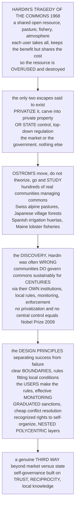

# 🏛️ Institutions, Rules, and Commons Governance

> [!abstract] TL;DR
> Garrett **Hardin's "Tragedy of the Commons"** (1968) told a grim, influential story: a resource shared and open to all — a pasture, a fishery, the atmosphere — is inevitably **overused and destroyed**, because each user takes the full benefit of grabbing more while sharing the cost of depletion with everyone. Hardin concluded there were only **two escapes**: **privatize** the resource or hand it to the **state**. "The market or the government" became gospel. Then Elinor **Ostrom** did something revolutionary — instead of theorizing, she went out and **studied hundreds of real communities** managing shared resources (Swiss alpine pastures, Japanese village forests, Spanish irrigation *huertas*, Maine lobster fisheries) and found Hardin was often **wrong**: communities can and *do* govern their commons sustainably for **centuries**, through neither privatization nor the state but their own homegrown **institutions** — locally-crafted rules, monitoring, and enforcement. For this she won the 2009 Nobel Prize (the first woman to win it in economics). Her key contribution was the set of **design principles** separating commons that succeed from those that fail — clear boundaries, locally-fitted rules made by the users, effective monitoring, **graduated sanctions**, cheap conflict resolution, recognized rights to self-organize, and **nested, polycentric** layers. The deep lesson is a genuine **third way** beyond the sterile market-versus-state debate: self-governance built on trust, reciprocity, and local knowledge. This is the Ostrom / institutional-analysis view of collective action — the political-economy complement to the ecology of [[Overexploitation_and_Sustainable_Harvesting]] and the game theory of cooperation ([[Repeated_Games_and_Folk_Theorems]]).

---

## Intuition

**Analogy — the alpine pasture that a village has grazed for six hundred years without destroying it.** High in the Swiss Alps sits the village of Törbel, where families have shared a common summer pasture since the 1200s. By Hardin's logic this should have been a disaster: every herder gains the full milk of an extra cow put on the common meadow, while the cost of the overgrazed, trampled grass is spread across the whole village — so each rationally adds cows until the pasture is ruined. Yet the meadow is *still there*, still productive, seven centuries on. Why? Because in 1517 the villagers wrote down a rule that survives to this day: **no one may send more cows to the common pasture in summer than they can feed on their own land through the winter.** A local official counts the cows each year; anyone over their quota pays a fine. The rule was crafted by the herders themselves, it fits their local conditions exactly, it is cheap to monitor (everyone sees everyone's herd), and it is enforced by escalating penalties among neighbours who must deal with each other again next summer.

That is the whole discovery in miniature. Hardin assumed the herders were **isolated strangers**, each optimizing against an anonymous crowd with no way to talk, agree, or punish. Real communities are almost never like that: they are people embedded in **repeated relationships** who can **communicate, make rules, watch each other, and sanction cheaters**. Where Hardin saw an inescapable tragedy demanding either private fences or a government warden, Ostrom saw thousands of Törbels — Japanese forests governed by village *kumi*, Spanish irrigation canals run by farmer assemblies for a thousand years, Maine lobstermen enforcing their own harbour boundaries — solving the problem **themselves**, through institutions no economist designed. The tragedy is not a law of nature. It is what happens when the *institutions* that let people cooperate are **absent**. Commons governance is the study of the institutions that make the difference.

---

## How It Works

### Core mechanics

1. **Name the beast — a common-pool resource (CPR).** The problem lives in a specific box of the goods taxonomy: resources that are **rival / subtractable** (what I take, you cannot) but **non-excludable** (it is hard or costly to keep anyone out). Fisheries, forests, groundwater basins, grazing land, irrigation systems, and the atmosphere are all CPRs. Subtractability creates the possibility of overuse; non-excludability blocks the simple market fix of just charging for entry.
2. **Trace Hardin's tragedy.** For each user, the marginal benefit of grabbing one more unit is **private and full**, while the marginal cost of depletion is **shared across all users**. So the individually rational choice is always "take more," and when everyone does, aggregate extraction races past the resource's regeneration rate and the stock **collapses**. This is the *n*-person collective-action / free-rider problem applied to a resource — a many-player prisoner's dilemma (see [[Nash_Equilibrium]]).
3. **Hardin's two prescribed remedies.** Because he modeled users as isolated, non-communicating optimizers, Hardin saw only two exits: **privatize** the commons (carve it into owned parcels so each owner internalizes the cost) or impose **state control** (a central authority — a "Leviathan" — that regulates use top-down). Hence the enduring dichotomy: **the market or the government**, and nothing in between.
4. **Ostrom's empirical challenge.** Ostrom refused to settle the question by assumption. She and colleagues assembled **field studies of hundreds of real CPR institutions** worldwide and asked which endured and which collapsed. The finding overturned the theory: a great many communities **self-govern** their commons sustainably over **long horizons**, with neither privatization nor central control — through **locally-devised institutions** of rules, monitoring, and sanction. Tragedy is one possible outcome, not the inevitable one.
5. **Extract the design principles.** The enduring, robust CPR institutions were not random — they shared a recurring set of **institutional features** (the eight design principles below). These are not a blueprint to copy but **diagnostic regularities**: the presence of clear boundaries, locally-fitted rules, user participation, monitoring, graduated sanctions, cheap conflict resolution, recognized autonomy, and nested layers strongly predicts long-run success.
6. **Generalize to a framework — and beyond.** Ostrom folded this into the **Institutional Analysis and Development (IAD)** framework — a way to analyze how *rules-in-use* structure the incentives inside an "action situation" — and into the idea of **polycentric governance**: many overlapping, semi-autonomous decision centers rather than one, which turns out to be more **robust** for complex, multi-scale problems than a single monolithic authority. The upshot: **beyond markets and states** lies a vast, diverse space of self-organized institutions, and there is **no panacea** — the right arrangement depends on the resource and the community.

### Flow / Architecture



---

## Key Concepts

### Secondary

- **The commons** — a resource that a whole group shares and that is hard to fence off, like a village pasture, a fishing ground, or the air. If everyone grabs as much as they can, it gets used up.
- **The tragedy of the commons** — the grim prediction that shared resources are always ruined, because each person gains from taking more while the harm is spread across everyone.
- **Hardin's two fixes** — he said the only ways to save a commons were to **privatize** it (split it into private property) or have the **government** control it.
- **Ostrom's surprise** — she actually visited communities around the world and found many had protected their commons for **hundreds of years** on their own, with neither privatization nor government, by making and enforcing their **own rules**.
- **Rules that work** — the successful communities knew clearly who could use the resource, made the rules **themselves**, watched to catch cheaters, and punished violations with fines that started small and grew for repeat offenders.

### Undergraduate

- **Common-pool resources (CPRs) in the goods taxonomy.** Cross *rival / non-rival* with *excludable / non-excludable*. CPRs are the **rival + non-excludable** cell: what one user extracts is truly gone (unlike a public good), yet excluding users is hard (unlike a private good). This is why they suffer **overuse** (the tragedy) rather than the **under-provision** that afflicts non-rival public goods — the two are mirror-image collective-action failures.
- **The tragedy as an n-player prisoner's dilemma.** Restraint is collectively best but individually dominated: unilateral restraint just leaves more for others to grab. The Nash equilibrium of one-shot, anonymous extraction is over-harvesting. The escape routes all work by **changing the game** — repetition, communication, monitoring, and sanctions — not by moralizing.
- **Ostrom's eight design principles** (features of long-enduring CPR institutions):
  1. **Clearly defined boundaries** — who the authorized users are and what the resource is.
  2. **Congruence** — rules fit **local conditions**, and the benefits to users are proportional to the costs they bear.
  3. **Collective-choice arrangements** — the **users themselves** participate in making and modifying the rules.
  4. **Monitoring** — monitors who actively audit conditions and behaviour, and who are **accountable to the users** (often *are* the users).
  5. **Graduated sanctions** — penalties that **escalate** with the severity and repetition of violations, not zero and not draconian.
  6. **Low-cost conflict-resolution mechanisms** — fast, cheap local arenas to settle disputes.
  7. **Minimal recognition of rights to organize** — external authorities do **not** undermine the community's right to make its own rules.
  8. **Nested enterprises** — for larger CPRs, governance is organized in **multiple layered tiers** (the seed of polycentricity).
- **Conditions that favour self-governance** — smaller groups, stable membership, good **communication**, **repeated interaction**, shared understanding of the resource, low-cost monitoring, and salience of the resource to livelihoods. Where these are strong, homegrown institutions emerge; where they are weak (mobile strangers, huge scale, no communication), tragedy is more likely.
- **The false dichotomy dissolved.** Ostrom's central negative claim: it is **not** "market or state." Privatization and central control are two institutional options among **many**, each with failure modes of their own (privatized fisheries can still collapse; distant state regulators lack local knowledge and are captured). Self-governance is a real, often superior, third option.

### Graduate

- **The IAD framework (Institutional Analysis and Development).** Ostrom's general grammar for analyzing institutions: an **action situation** (participants, positions, actions, information, payoffs) is structured by **rules-in-use** operating at three nested levels — **operational** (day-to-day harvesting/monitoring), **collective-choice** (how operational rules are set), and **constitutional** (how collective-choice rules are set). Institutions are analyzed by asking how these rules shape incentives, interactions, and outcomes — a research programme far richer than "public vs private ownership."
- **Polycentric governance.** A system with **many overlapping, semi-autonomous decision centers** operating at different scales, each with some independent authority, versus a **monocentric** single hub. Ostrom argued (Nobel lecture, "Beyond Markets and States," 2010) that polycentric systems are more **robust and adaptive** for complex resource problems: they enable local experimentation, redundancy, cross-scale learning, and error correction, at the cost of some duplication and coordination friction. Climate governance is the paradigm case — no world government exists, so mitigation is emerging polycentrically across cities, firms, states, and treaties.
- **Second-generation collective-action theory.** The behavioural turn: real humans are not uniformly selfish payoff-maximizers but a mix of **conditional cooperators** (who cooperate if enough others do) and **willing punishers** (who pay personal costs to sanction free-riders — *altruistic* or *costly* punishment). Communication ("cheap talk") reliably raises cooperation in commons experiments even without binding contracts, because it builds **trust, shared norms, and credible commitment**. This overturns the first-generation prediction of zero cooperation and grounds the design principles in micro-behaviour (see [[Institutions_Cooperation_and_Norms]]).
- **Robustness and institutional diversity ("no panacea").** Ostrom's mature stance rejected universal blueprints — including her own principles applied mechanically. Institutions must be **matched to context** (the resource's physics, the community's culture, the wider political economy); a rule that saves a Nepali irrigation system may wreck a Pacific fishery. Diagnostic frameworks (the SES / social-ecological-systems framework) replace one-size-fits-all policy with **context-sensitive institutional analysis**.
- **Scaling to the global commons.** The design principles are **hardest to satisfy at global scale**: boundaries are planet-wide, "users" are billions across sovereign states, monitoring the atmosphere is costly, sanctions on sovereign nations are weak, and there is no overarching authority to grant or protect rights to organize. This is why climate, high-seas fisheries, and biodiversity are the **least-well-governed** commons — and why polycentric, nested, treaty-plus-subnational approaches, rather than a mythical single world regulator, are the realistic path (see [[Environmental_Policy_and_Governance]]).
- **Knowledge and digital commons — the "comedy of the commons."** Non-rival information goods invert the logic: more users add value rather than subtracting it (Wikipedia, open-source software, open science). Here the governance problem is not overuse but **under-contribution and enclosure**; Ostrom-style institutions (contributor norms, graduated moderation, forking rights, licences like the GPL) sustain production. Carol Rose's "comedy of the commons" and Ostrom & Hess's *Understanding Knowledge as a Commons* extend the framework beyond natural resources.

---

## Python Demo

```python
# Institutions, rules, and commons governance, made concrete with numpy + matplotlib.
#
#   (a) TRAGEDY vs SELF-GOVERNANCE of a common-pool resource.
#       A renewable stock X (a fishery / pasture) grows logistically:
#           growth = r * X * (1 - X / K)
#       and is reduced by harvest H = (q*E) * X  (catch proportional to effort E
#       and stock X). We contrast two REGIMES:
#         - OPEN ACCESS (the tragedy): with no rules, effort ESCALATES over time
#           as each user races to grab more (rent dissipation). Harvest eventually
#           outruns regrowth and the stock COLLAPSES.
#         - SELF-GOVERNED (Ostrom): users agree a sustainable harvest rule and
#           MONITOR it, capping effort near the maximum-sustainable-yield level.
#           The stock is MAINTAINED and delivers a steady yield for centuries.
#
#   (b) MONITORING + GRADUATED SANCTIONS sustain cooperation.
#       A user is tempted to defect (over-harvest) for a private gain g. A defector
#       is caught with monitoring probability m and pays a sanction s. The expected
#       payoff advantage of DEFECTING over cooperating is  (g - m*s). We model the
#       group's equilibrium cooperation rate as a soft best-response:
#           coop_rate = 1 / (1 + exp(beta * (g - m*s)))
#       => with s = 0 (no enforcement) cooperation COLLAPSES for any monitoring;
#          with a modest, CREDIBLE sanction, once m passes the threshold m* = g/s
#          the group TIPS into stable cooperation.

import numpy as np
import matplotlib.pyplot as plt

fig, (ax1, ax2) = plt.subplots(1, 2, figsize=(13, 5.4))

# ----------------------------------------------------------------------
# (a) TRAGEDY vs SELF-GOVERNANCE: the resource stock over time
# ----------------------------------------------------------------------
r, K, X0, T = 0.6, 1000.0, 800.0, 60          # growth rate, carrying cap, start, years
t = np.arange(T + 1)

def simulate(effort_schedule):
    X = np.empty(T + 1); X[0] = X0
    yield_series = np.zeros(T + 1)
    for i in range(T):
        qE = effort_schedule[i]
        growth = r * X[i] * (1 - X[i] / K)
        H = qE * X[i]
        yield_series[i] = H
        X[i + 1] = max(X[i] + growth - H, 0.0)
    return X, yield_series

# Self-governed: effort capped at the sustainable level qE = r/2 -> stock settles at K/2
effort_self = np.full(T, r / 2.0)
# Open access: effort escalates as the race for the resource intensifies
effort_open = 0.30 + (1.00 - 0.30) * (np.arange(T) / T)

X_self, Y_self = simulate(effort_self)
X_open, Y_open = simulate(effort_open)

ax1.plot(t, X_self, "-", color="seagreen", lw=2.4,
         label="Self-governed (rules + monitoring)")
ax1.plot(t, X_open, "-", color="crimson", lw=2.4,
         label="Open access (the tragedy)")
ax1.axhline(K / 2, color="seagreen", ls=":", lw=1.2, alpha=0.8)
ax1.annotate("sustainable stock ~ K/2", xy=(T * 0.6, K / 2),
             xytext=(T * 0.30, K / 2 + 120), fontsize=8,
             arrowprops=dict(arrowstyle="->"))
ax1.annotate("stock COLLAPSES", xy=(T * 0.92, X_open[int(T * 0.92)] + 10),
             xytext=(T * 0.55, 220), color="crimson", fontsize=8,
             arrowprops=dict(arrowstyle="->", color="crimson"))
ax1.set_xlabel("Year")
ax1.set_ylabel("Resource stock X")
ax1.set_title("Commons: self-governance sustains what open access destroys")
ax1.set_ylim(0, K)
ax1.legend(fontsize=8, loc="upper right")
ax1.grid(alpha=0.3)

# ----------------------------------------------------------------------
# (b) MONITORING + GRADUATED SANCTIONS -> stable cooperation
# ----------------------------------------------------------------------
m = np.linspace(0, 1, 400)      # monitoring probability
g = 1.0                          # private temptation to defect (over-harvest)
beta = 8.0                       # steepness of the group's best response
sanctions = [0.0, 0.5, 1.5, 3.0]
colors = ["#9e9e9e", "#f9a825", "#fb8c00", "#c62828"]

for s, c in zip(sanctions, colors):
    coop = 1.0 / (1.0 + np.exp(beta * (g - m * s)))
    lbl = "s = 0  (no enforcement)" if s == 0 else f"sanction s = {s}"
    ax2.plot(m, coop, lw=2.2, color=c, label=lbl)

# threshold for the strongest sanction: m* = g / s
m_star = g / 3.0
ax2.axvline(m_star, color="#c62828", ls="--", lw=1.1, alpha=0.7)
ax2.annotate("tipping point  m* = g/s",
             xy=(m_star, 0.5), xytext=(m_star + 0.06, 0.30),
             fontsize=8, color="#c62828",
             arrowprops=dict(arrowstyle="->", color="#c62828"))
ax2.set_xlabel("Monitoring probability m")
ax2.set_ylabel("Equilibrium cooperation rate")
ax2.set_title("Modest, credible enforcement tips a group into cooperation")
ax2.set_ylim(-0.02, 1.02)
ax2.legend(fontsize=8, loc="center right")
ax2.grid(alpha=0.3)

plt.tight_layout()
plt.show()

print(f"(a) Final stock -- self-governed: {X_self[-1]:.0f}  |  open access: "
      f"{X_open[-1]:.0f}.  Cumulative harvest over {T} years -- self-governed: "
      f"{Y_self.sum():.0f}  |  open access: {Y_open.sum():.0f}: the restrained "
      f"regime actually TAKES MORE in total by not killing the resource.")
print(f"(b) With no enforcement (s=0), cooperation stays near "
      f"{1/(1+np.exp(beta*g)):.2f} for every monitoring level. With sanction s=3, "
      f"once monitoring passes m* = g/s = {m_star:.2f} the group tips into near-full "
      f"cooperation -- the essence of Ostrom's monitoring + graduated sanctions.")
```

The left panel is the tragedy and its escape made quantitative: under **open access** the effort put into extraction escalates as each user races the others, harvest overruns the resource's regrowth, and the stock **collapses** to near zero — Hardin's prophecy. Under **self-governance**, a user-made rule caps effort near the sustainable level, monitored by the users themselves, and the stock **settles at about half the carrying capacity**, yielding a steady harvest indefinitely; the printout shows the restrained community actually **harvests more in total** over the horizon precisely because it does not destroy the golden goose. The right panel isolates *why* the rule holds: cooperation is not sustained by good intentions but by **credible enforcement**. With no sanction (grey) the group defects at every monitoring level; with a modest, credible sanction, once the monitoring probability crosses the threshold `m* = g/s` the group **tips** into stable cooperation — the mathematical signature of Ostrom's monitoring-plus-graduated-sanctions principles.

---

## Real-World Applications

- **Swiss alpine grazing commons (Törbel).** Village herders have governed shared summer pastures since the 1200s under a written rule (1517) limiting each family's cows to what they can overwinter on their own land — clear boundaries, locally-fitted congruent rules, cheap monitoring, and graduated fines. A live, six-century refutation of the inevitability of tragedy.
- **Spanish *huerta* irrigation (Valencia, Murcia).** Farmer-run irrigation communities have allocated scarce canal water for roughly a thousand years, complete with elected officials, a customary rulebook, and the *Tribunal de las Aguas* — a public water court meeting weekly for cheap, fast conflict resolution. A textbook instance of collective-choice arrangements plus low-cost dispute resolution.
- **Maine lobster fisheries.** Harbour gangs enforce informal territorial boundaries, trap limits, and conservation norms (v-notching egg-bearing females), backed by graduated social and physical sanctions on interlopers — a self-governed CPR institution that has kept the fishery productive where many open-access fisheries collapsed. Contrast the tragedy of unmanaged high-seas stocks like Atlantic cod.
- **Japanese village common forests (*iriai*).** Centuries-old communal woodlands governed by village associations (*kumi*) with detailed rules on who may cut what, when, and how much, monitored by rotating village members — nested within larger regional arrangements.
- **Groundwater basins in Southern California.** Ostrom's own dissertation studied how competing pumpers, facing saltwater intrusion, built **polycentric** institutions — water associations, litigation, and special districts across many overlapping units — to manage a shared aquifer without nationalizing it, an early model of polycentric CPR governance.
- **The global climate as a commons.** The atmosphere is the ultimate CPR, and its governance shows exactly why the design principles are hardest at planetary scale (no boundaries, sovereign "users," weak sanctions). The emerging response — the Paris Agreement plus a patchwork of city, state, and corporate commitments — is **polycentric governance** in action, precisely as Ostrom argued the global commons would have to be managed (see [[Environmental_Policy_and_Governance]]).
- **Digital and knowledge commons.** Wikipedia, open-source projects, and open-science repositories are governed by Ostrom-style institutions adapted to non-rival goods — contributor norms, graduated moderation and bans, transparent edit histories (monitoring), and forking rights (an exit that disciplines governance) — the "comedy of the commons" where use adds rather than subtracts value.

---

## Common Pitfalls

- **Treating "the tragedy of the commons" as an iron law.** Hardin's model is a *conditional* result that holds when users are isolated, non-communicating, and unable to make rules or sanctions. Its most-quoted conclusion — inevitable ruin — is exactly what Ostrom's evidence refutes. Citing "the tragedy" as though it settles policy is quoting the setup and ignoring the discovery.
- **Confusing common-pool resources with public goods.** Both are non-excludable, but CPRs are **rival** (fisheries, forests) and so suffer **overuse**, whereas pure public goods are **non-rival** (defense, clean air) and suffer **under-provision**. The institutions that fix one are not the institutions that fix the other; conflating them mis-diagnoses the problem.
- **Assuming the only choices are privatize or nationalize.** This is the very dichotomy Ostrom dissolved. Both real markets and real states fail commons routinely (privatized fisheries still crash; distant regulators lack local knowledge and get captured). Self-governance is a genuine third option, and often the most robust — but it too can fail, so the point is *comparative institutional analysis*, not a new dogma.
- **Copying the eight design principles as a checklist / panacea.** Ostrom herself warned against "panaceas." The principles are diagnostic regularities, not a transplantable blueprint; a rule set that sustains a Nepali irrigation system can wreck a Pacific tuna fishery. Institutions must be **matched to the specific resource and community**, not stamped from a template.
- **Ignoring that monitoring and sanctions must be graduated and credible, not zero and not draconian.** The demo shows why: zero enforcement collapses to defection, but harsh, all-or-nothing punishment destroys the trust and reciprocity that make communities cohere. The magic is in *graduated* sanctions among people locked in repeated relationships — a lesson lost when reformers impose either laissez-faire or heavy-handed policing.
- **Assuming self-governance scales effortlessly to the global commons.** The design principles get **harder** as boundaries widen, users multiply across sovereign borders, monitoring costs rise, and sanctions weaken. Expecting a Törbel-style solution to simply "scale up" to the atmosphere ignores why climate governance must instead be built polycentrically across nested layers.
- **Romanticizing communities.** Self-governance is not automatically equitable or just: local institutions can entrench elites, exclude outsiders and women, and lock in unsustainable customs. The design principles describe what makes commons *durable*, which is not the same as *fair* — a caveat Ostrom's careful institutional analysis keeps in view.

---

## Related Concepts

Cross-vault anchors (Glob-verified files elsewhere in the vault):

- [[Overexploitation_and_Sustainable_Harvesting]] — the **ecology** of the same problem: how harvest above the maximum-sustainable-yield collapses a stock. This note is its political-economy / institutional complement — the *governance* that determines whether harvest stays sustainable; distinct basename, linked to deliberately.
- [[Environmental_Policy_and_Governance]] — the environmental-policy view of managing shared natural resources; commons self-governance and polycentricity are the Ostrom-flavoured heart of how the *global* commons (climate, oceans, biodiversity) can be governed.
- [[Ecological_Economics_and_Natural_Capital]] — values natural capital and ecosystem services; commons institutions are the social technology that keeps that capital from being liquidated by overuse.
- [[Ecosystem_Services]] — many ecosystem services flow from common-pool resources (fisheries, forests, watersheds) whose sustained delivery depends on the governance institutions analyzed here.
- [[Repeated_Games_and_Folk_Theorems]] — the game-theoretic engine of self-governance: repeated interaction lets communities sustain cooperation (via reciprocity and the threat of sanction) that a one-shot game cannot, formalizing why repetition escapes the tragedy.
- [[Nash_Equilibrium]] — the tragedy is the (bad) Nash equilibrium of one-shot anonymous extraction; institutions work by changing the game so that restraint becomes an equilibrium.
- [[Price_of_Anarchy]] — quantifies how much worse the selfish (open-access) outcome is than the coordinated optimum — a formal measure of the efficiency loss that commons governance recovers.
- [[Institutions_Cooperation_and_Norms]] — the complexity-economics view of how norms, trust, and institutions evolve to sustain cooperation; the behavioural micro-foundations of the design principles.
- [[Cooperation_and_Evolutionary_Game_Theory]] — how conditional cooperation and costly punishment can be evolutionarily stable, underpinning the "willing punisher" behaviour that makes graduated sanctions work.

Within this vault, this note sits in the *Political Economy and Decision-Making* section beside prose-referenced siblings: *Institutions_and_Institutional_Design* (the general theory of how rules structure incentives, of which the IAD framework is a landmark instance), *Collective_Action_and_Interest_Groups* (Olson's logic of why groups fail to provide their common interest — the problem commons institutions solve), *Public_Goods_and_Collective_Provision* (the non-rival mirror image, under-provision rather than overuse), *Public_Choice_and_Political_Economy* (the rational-actor analysis of political institutions that both frames and is qualified by Ostrom's findings), and *Federalism_and_Multilevel_Governance* (the constitutional counterpart to polycentricity — many governments at many scales).

---

## Review Questions

1. **(Secondary)** A village shares a fishing lake. Explain, using the words *shared* and *overused*, why Hardin predicted the fish would be wiped out — and then describe two things the villagers could do *themselves*, without either selling off the lake or calling in the government, to keep the fishery healthy.
2. **(Undergraduate)** Distinguish a **common-pool resource** from a **public good** in terms of rivalry and excludability, and explain why one suffers *overuse* while the other suffers *under-provision*. Then list four of Ostrom's design principles and, for each, say concretely how it changes the incentives facing a would-be over-harvester.
3. **(Graduate)** Ostrom argued for a "third way beyond markets and states." (a) Explain why both privatization and central regulation can fail a common-pool resource, using the concepts of local knowledge and capture. (b) Using the IAD framework's three levels of rules, describe how a self-governing community sets and revises its own operational rules. (c) Explain why the eight design principles are hardest to satisfy for a *global* commons such as the climate, and why **polycentric governance** is Ostrom's proposed response rather than a single world regulator.

---

## Sources

- Elinor Ostrom, *Governing the Commons: The Evolution of Institutions for Collective Action* (Cambridge University Press, 1990) — the founding empirical and theoretical statement, including the eight design principles.
- Garrett Hardin, "The Tragedy of the Commons," *Science* 162, 1968 — the influential thesis Ostrom challenged, with its privatize-or-state-control dichotomy.
- Elinor Ostrom, "Beyond Markets and States: Polycentric Governance of Complex Economic Systems," *American Economic Review* 100(3), 2010 — her Nobel Prize lecture on polycentricity and second-generation collective-action theory.
- Amy R. Poteete, Marco A. Janssen, and Elinor Ostrom, *Working Together: Collective Action, the Commons, and Multiple Methods in Practice* (Princeton University Press, 2010) — methods and the SES / "no panacea" diagnostic turn.
- Charlotte Hess and Elinor Ostrom (eds.), *Understanding Knowledge as a Commons: From Theory to Practice* (MIT Press, 2007) — extending the framework to digital and knowledge commons.

---

#public-policy #commons-governance #ostrom #design-principles #polycentric-governance
