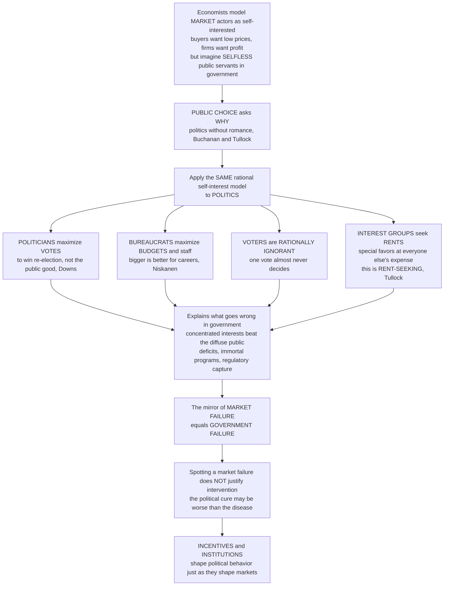

# 🏛️ Public Choice and Political Economy

> [!abstract] TL;DR
> Economists have always modeled people in **markets** as self-interested — buyers want low prices, firms want profit — yet when those same people step into **government** we imagine a different creature entirely: the noble, selfless public servant acting only for "the public interest." **Public choice theory** (Buchanan & Tullock; Buchanan's 1986 Nobel) asks a devastatingly simple question — *why?* Its founding move is to apply the **same** rational, self-interested model to **politics**. This is **"politics without romance,"** and it changes everything: politicians maximize **votes** (to win re-election), not the public good; bureaucrats maximize **budgets and staff** (bigger is better for careers); voters are **rationally ignorant** (why study issues when your one vote almost never decides?); and interest groups seek **rents** — special favors extracted from government at everyone else's expense (**rent-seeking**). This lens explains why small, **concentrated** interests routinely beat the **diffuse** public, why governments run **deficits**, why programs never die, and why regulators get **captured**. Crucially, it is the mirror image of **market failure**: government fails just as predictably (**government failure**), so spotting a market failure never automatically justifies intervention — the political cure may be worse than the disease. The claim is not that everyone is evil, but that **incentives and institutions** shape political behavior exactly as they shape market behavior.

---

## Intuition

**Analogy — the person who "becomes selfless" at the office door.** Picture a shrewd shopper who haggles over every rupee, a landlord who charges what the market will bear, a firm chasing profit — economics models all of them as clear-eyed self-interested actors, and it works. Now that same shopper wins an election, or takes a civil-service job, or joins a lobbying firm. The old models say: *poof* — she is now a selfless steward of the common good, weighing only society's welfare. Public choice theory refuses the magic trick. It asks: **why would a person's motives evaporate the instant they cross the threshold of a government building?** If we model people as self-interested in the supermarket, intellectual honesty demands we model them the same way in the legislature, the ministry, and the lobby.

Run that single assumption forward and a whole hidden machinery of politics snaps into view. The politician is not maximizing the public good; she is maximizing **votes**, because losing means unemployment. The bureaucrat is not minimizing cost; he is maximizing his **budget and headcount**, because a bigger department means a bigger career. The voter is not a diligent civic scholar; she is **rationally ignorant** — spending an evening studying trade policy is pure cost when her single ballot has essentially zero chance of being decisive. And the interest group is not lobbying for the common good; it is hunting **rents** — subsidies, tariffs, licenses, protections — carved out of the public at large. This is the hard-nosed economics of politics, and it is a permanent corrective to naive faith in government: not cynicism for its own sake, but the recognition that **institutions and incentives**, not intentions, drive what governments actually do.

---

## How It Works

### Core Mechanics

1. **The founding move — one model, applied everywhere.** Public choice is the application of **economic method** (rational self-interested actors, methodological individualism, exchange and equilibrium) to **political and collective decision-making**. Buchanan & Tullock's *The Calculus of Consent* and the "Virginia school" reject the **benevolent-despot / public-interest** assumption and instead model politicians, bureaucrats, voters, and interest groups as ordinary self-interested people. Buchanan called it **"politics without romance."** It is *positive* political economy: describing how politics *does* work, not how we wish it would.

2. **Politicians as vote-maximizers.** Anthony Downs modeled the party as a firm whose "profit" is **votes**: it adopts whatever platform wins re-election. On a single left–right issue dimension this drives the famous **median-voter theorem** — two competing parties converge toward the position of the **median voter**, because whoever captures the middle captures the majority. (Its limits matter: convergence breaks down with multiple issue dimensions, differential turnout, and intensity of preference.)

3. **Bureaucrats as budget-maximizers.** William Niskanen modeled the bureau not as a cost-minimizer but as a **budget- and utility-maximizer**: salary, prestige, perks, and power all rise with the size of the agency, so bureaucrats systematically push for **over-supply and empire-building**, exploiting their information monopoly over the true cost of the services they provide.

4. **Voters as rationally ignorant.** The expected payoff to being well-informed is the value of a better outcome *times the probability your vote is decisive* — and in a large electorate that probability is essentially zero. So the rational voter stays **shallowly informed** (rational ignorance), which even shades into **rational irrationality** (Bryan Caplan): holding comfortable but mistaken beliefs is nearly costless when your vote doesn't swing the result. This also frames the **paradox of voting** — why turn out at all?

5. **Interest groups as rent-seekers.** **Rent-seeking** (Gordon Tullock; Anne Krueger) is spending resources to obtain economic **rents** — pure transfers and favors (subsidies, tariffs, licenses, monopoly protection, tax breaks) — rather than creating new value. Its deep insight is the **social waste**: the resources *dissipated competing* for the rent (lobbyists, campaign contributions, legal battles) are a **deadweight loss on top of the transfer itself**.

6. **Concentrated benefits, diffuse costs.** Mancur Olson's **logic of collective action** is the engine that makes special interests win. A small, concentrated, well-organized group with a **huge per-member stake** will out-organize and out-lobby the large, diffuse public whose members each lose only a little and rationally **free-ride**. The result: protectionism, farm subsidies, and occupational licensing — policies that benefit the few at the expense of the many, breeding **institutional sclerosis**.

7. **Government failure — the payoff.** Assembled, these mechanisms are the mirror of market failure. **Government failure** is the systematic set of reasons intervention can worsen outcomes: rent-seeking and **capture**, the information and incentive problems of politicians and bureaucrats, **log-rolling** and pork-barrel vote-trading, **deficit/debt bias** (spend on today's voters, defer the bill — "fiscal illusion"), the near-impossibility of **policy termination**, and short time horizons. The lesson is **comparative institutions**: never weigh an imperfect market against an idealized government — weigh government failure against market failure.

8. **The constitutional response.** Buchanan's **constitutional political economy** shifts the question from *choices within* the political game to the **rules of the game** themselves: if players are self-interested, design the *constitution* — balanced-budget rules, fiscal constraints, transparency, competition — to constrain the damage in advance, at the level where narrow interests are hardest to predict.

### Flow / Architecture



---

## Key Concepts

### Secondary (intuitive foundations)

- **The core question.** We assume people chase their own interests in shops and businesses — so why assume they turn selfless the moment they enter government? Public choice says: *don't*. Model them the same way.
- **What politicians really maximize.** Not "the public good" in the abstract, but **votes** — because losing an election costs them their job.
- **What bureaucrats really maximize.** A **bigger department**: more budget, more staff, more prestige. Bigger is better for their careers, so agencies tend to grow.
- **Why voters don't study the issues.** Your single vote almost never decides an election, so spending hours researching policy is effort for essentially no payoff — most people rationally stay only lightly informed.
- **Why the few beat the many.** A handful who each gain a lot fight hard; millions who each lose a little don't bother. That is why special interests so often win.
- **Government fails too.** Just as markets fail in predictable ways, so does government. Spotting a market failure does not automatically mean the government should step in — the fix can be worse than the problem.

### Undergraduate (formal political economy)

- **Public choice / positive political economy.** Economic method — rational actors, methodological individualism, exchange, equilibrium — applied to collective choice (Buchanan & Tullock, *The Calculus of Consent*; the Virginia school).
- **The median-voter theorem (Downs).** With single-peaked preferences on one issue dimension, majority rule selects the median voter's ideal point, and two vote-maximizing parties **converge** to it. Limits: multidimensional issue spaces (McKelvey–Schofield chaos), abstention, and preference **intensity**.
- **Niskanen's budget-maximizing bureau.** Asymmetric information plus a monopoly supplier of a public service leads to **over-provision** relative to the efficient level; the sponsor cannot easily observe true costs.
- **Rational ignorance and rational irrationality.** The probability of being pivotal is negligible, so the return to information is tiny (Downs); Caplan extends this to systematically **biased beliefs** that are cheap to hold.
- **Rent-seeking (Tullock, Krueger).** Using political influence to capture transfers. The **social cost exceeds the transfer**: resources are *dissipated competing* for the rent. In a symmetric Tullock contest for a rent `R` among `n` players, equilibrium total spending is `R(n-1)/n`, approaching the full rent as `n` grows.
- **Concentrated benefits, diffuse costs (Olson).** Small groups solve the collective-action problem cheaply; large groups free-ride. Predicts the systematic bias toward producer over consumer interests.
- **Government failure vs market failure.** A symmetric taxonomy — the honest policy comparison is between **two** imperfect institutions, not one real market and one idealized state.

### Graduate (synthesis and frontier)

- **Constitutional political economy (Buchanan).** The distinction between choices *within* rules and choice *of* the rules; the **veil of uncertainty** at the constitutional stage makes agreement on general, self-interest-constraining rules possible (fiscal constitutions, balanced-budget amendments).
- **Peltzman–Becker generalization of capture.** Regulation as equilibrium in a market for political influence: a support-maximizing regulator balances producer and consumer pressure groups, with deadweight-loss "pressure" partially disciplining outcomes — capture as equilibrium, not conspiracy.
- **Log-rolling, cycling, and the instability of majority rule.** Vote-trading can pass inefficient omnibus packages; Arrow's theorem and the McKelvey chaos results show majority rule can cycle endlessly absent structure-induced equilibria (Shepsle) from institutions and agenda control.
- **Deficit bias and dynamic political economy.** Fiscal illusion, common-pool problems over the budget, and strategic debt (Alesina–Tabellini) formalize *why* democracies over-borrow — spending on current voters while deferring costs to future ones.
- **Critiques and empirical limits.** Does public choice overstate cynicism? Turnout, honest bureaucrats, deliberation, and other-regarding preferences all complicate pure self-interest; behavioral and experimental work (and Ostrom's polycentric governance) show norms and institutions can *solve* collective-action problems the base model predicts are hopeless.

---

## Python Demo

```python
# Public Choice and Political Economy -- the economics of politics, in three pictures.
#
# (a) CONCENTRATED BENEFITS, DIFFUSE COSTS: why a small organized group beats the
#     diffuse public. A policy hands a large TOTAL benefit B to a few firms while
#     imposing a larger TOTAL cost C on millions of citizens (C > B, so the policy
#     DESTROYS net welfare). Per member, the firm's stake dwarfs the citizen's, so
#     the few lobby hard while the many stay "rationally ignorant" -- and the
#     inefficient rent-granting policy passes anyway.
#
# (b) RENT-SEEKING WASTE (Tullock): competing FOR a rent burns real resources. In a
#     Tullock contest, n players spend to win a rent R; the symmetric equilibrium
#     total spending is R*(n-1)/n, which rises toward the WHOLE rent as competitors
#     multiply -- a deadweight loss ON TOP of the transfer itself.
#
# (c) MEDIAN-VOTER THEOREM (Downs): two vote-maximizing parties on a single issue
#     dimension both converge to the MEDIAN voter's ideal point.
#
# Pure numpy + matplotlib.

import numpy as np
import matplotlib.pyplot as plt

rng = np.random.default_rng(42)
fig, (ax1, ax2, ax3) = plt.subplots(1, 3, figsize=(16, 5))

# ---------------------------------------------------------------------------
# (a) Concentrated benefits, diffuse costs
# ---------------------------------------------------------------------------
n_firms  = 20
n_public = 300_000_000
B = 2.0e9          # total benefit handed to the industry
C = 3.0e9          # total cost imposed on the public  (C > B -> net loss of C - B)
per_firm    = B / n_firms
per_citizen = C / n_public

labels = ["Industry\ntotal benefit B", "Public\ntotal cost C",
          "Per-FIRM\nstake", "Per-CITIZEN\nstake"]
vals   = [B, C, per_firm, per_citizen]
colors = ["steelblue", "firebrick", "steelblue", "firebrick"]
bars = ax1.bar(labels, vals, color=colors, alpha=0.85)
ax1.set_yscale("log")
ax1.set_ylabel("US dollars, log scale")
ax1.set_title("(a) Concentrated benefits, diffuse costs\nhuge stake for the few, trivial stake for the many")
for r, v in zip(bars, vals):
    ax1.text(r.get_x() + r.get_width() / 2, v * 1.6, f"${v:,.0f}",
             ha="center", fontsize=7.5)
ax1.text(0.5, 0.02,
         f"Net welfare loss = C - B = ${C-B:,.0f}\n"
         f"Per-firm stake beats per-citizen stake {per_firm/per_citizen:,.0f} to 1",
         transform=ax1.transAxes, ha="center", fontsize=8,
         bbox=dict(boxstyle="round", fc="lightyellow", ec="gray"))
ax1.grid(alpha=0.3, axis="y")

# ---------------------------------------------------------------------------
# (b) Rent-seeking dissipation (symmetric Tullock contest)
# ---------------------------------------------------------------------------
R = 1.0
n = np.arange(1, 26)
total_spending = R * (n - 1) / n          # equilibrium resources burned competing
ax2.plot(n, total_spending, "o-", color="darkorange", lw=2,
         label="Resources dissipated")
ax2.axhline(R, color="crimson", ls="--", lw=1.5,
            label="Full dissipation = the entire rent R")
ax2.fill_between(n, 0, total_spending, color="darkorange", alpha=0.15)
ax2.set_xlabel("Number of rent-seekers competing for the rent")
ax2.set_ylabel("Resources burned / rent value")
ax2.set_title("(b) Rent-seeking waste, Tullock\ncompeting FOR the rent dissipates it")
ax2.set_ylim(0, 1.1)
ax2.legend(loc="lower right", fontsize=8)
ax2.grid(alpha=0.3)

# ---------------------------------------------------------------------------
# (c) Median-voter theorem (Downsian convergence)
# ---------------------------------------------------------------------------
voters = rng.beta(2, 5, size=200_000)     # a skewed electorate on a [0,1] issue axis
m = np.median(voters)                     # the median voter's ideal point
iters = 12
pA = np.zeros(iters); pB = np.zeros(iters)
pA[0], pB[0] = 0.05, 0.95                  # two parties start far apart
alpha = 0.45
for t in range(1, iters):                  # each vote-maximizer edges toward the median
    pA[t] = pA[t-1] + alpha * (m - pA[t-1])
    pB[t] = pB[t-1] + alpha * (m - pB[t-1])

ax3.plot(range(iters), pA, "o-", color="steelblue", lw=2, label="Party A")
ax3.plot(range(iters), pB, "s-", color="firebrick", lw=2, label="Party B")
ax3.axhline(m, color="black", ls="--", lw=1.5, label=f"Median voter m={m:.2f}")
ax3.set_xlabel("Campaign iteration")
ax3.set_ylabel("Party position on the issue axis")
ax3.set_title("(c) Median-voter theorem, Downs\nvote-maximizers converge to the median")
ax3.set_ylim(0, 1)
ax3.legend(loc="center right", fontsize=8)
ax3.grid(alpha=0.3)

plt.tight_layout()
plt.savefig("public_choice_political_economy.png", dpi=120)
plt.show()

print("(a) Concentrated benefits, diffuse costs:")
print(f"    Net welfare loss C - B = ${C-B:,.0f}, yet the policy passes.")
print(f"    Per-firm ${per_firm:,.0f} vs per-citizen ${per_citizen:,.2f} "
      f"-> {per_firm/per_citizen:,.0f} : 1 stake asymmetry.")
print("(b) Rent-seeking (Tullock): with n=25 competitors, "
      f"{100*total_spending[-1]:.0f}% of the rent is dissipated as pure waste.")
print(f"(c) Median-voter theorem: both parties converge to m = {m:.2f}.")
```

**What it shows.** Panel **(a)** quantifies why concentrated interests win: the policy is *socially inefficient* (public cost `$3B` exceeds industry benefit `$2B`, a net loss), yet each of 20 firms stands to gain `$100,000,000` while each of 300 million citizens loses about `$10`. The stake asymmetry is millions-to-one, so the firms mobilize and the public rationally shrugs — the inefficient rent-granting policy passes anyway. Panel **(b)** is Tullock's darkest result: as more players compete for a fixed rent, the resources they *burn competing for it* climb toward the **entire value of the rent** — pure deadweight loss stacked on top of the transfer. Panel **(c)** is Downsian convergence: two parties that begin at opposite extremes both march to the **median voter's** ideal point, because that is where the decisive vote sits — vote-maximizing, not principle, drives them to the middle.

---

## Real-World Applications

> **Sugar and farm subsidies (concentrated benefits, diffuse costs).** US sugar quotas and tariffs hand a few thousand producers billions in support while raising each consumer's grocery bill by only a few dollars a year. The producers lobby relentlessly; consumers barely notice. Olson's logic, live for decades — and a program that never dies.

> **Occupational licensing (rent-seeking and capture).** Licensing that began as consumer protection frequently hardens into an **entry barrier** protecting incumbents — from taxi medallions to hair-braiding. The regulated capture the rules that govern them, exactly as public choice predicts, converting "safety" into a moat.

> **The deficit / debt bias (fiscal illusion).** Democracies across the developed world run structural deficits in normal times, spending on **current** voters (pensions, tax cuts) while deferring the bill to **future** ones who cannot yet vote — the political economy of debt that constitutional balanced-budget rules try to fence in.

> **Median-voter convergence in two-party systems.** The perennial complaint that major parties "sound the same" on core issues is the median-voter theorem in action: both chase the decisive middle voter. Where it *breaks* — primaries, polarization, multidimensional culture-war issues — is exactly where the theorem's assumptions fail.

---

## Common Pitfalls

- **Mistaking the model for misanthropy.** Public choice is not the claim that politicians and bureaucrats are wicked; it is the claim that **incentives and institutions** shape their behavior, just as they shape a shopper's. Attacking it as "cynical" misses that it is *symmetric* — it applies the same lens to markets and states alike.
- **The Nirvana fallacy in reverse.** Having learned "government fails," some conclude the market always wins. Wrong direction, same error: government failure must be weighed against **market failure** case by case. Neither institution is idealized.
- **Assuming a market failure justifies intervention.** Diagnosing a market failure is **necessary but not sufficient**. If the government failure is worse, doing nothing — or using community/constitutional governance — can be the better choice. The problem does not identify its own solver.
- **Forgetting rent-seeking's hidden cost.** People tally the *transfer* a subsidy creates but ignore the far larger waste of **resources dissipated competing** for it. The deadweight loss of rent-seeking is often bigger than the deadweight loss of the distortion itself.
- **Over-reading the median-voter theorem.** It holds only on a **single** issue dimension with single-peaked preferences and full turnout. Multidimensional politics, abstention, and intensity of preference all break convergence — treating it as a universal law is a classic exam trap.
- **Ignoring the counter-evidence.** Norms, professional ethics, deliberation, and Ostrom-style self-governance genuinely *do* solve collective-action problems the base model calls hopeless. The honest public-choice analyst uses the lens as a corrective, not a totalizing worldview.

---

## Related Concepts

**Cross-vault links (Glob-verified):**

- [[Market_Failures]] — the mirror concept: government failure is to public choice what market failure is to microeconomics; this note is the reason a market failure never *automatically* licenses intervention.
- [[Monopoly]] — the deadweight loss of monopoly is the value of the rent that lobbyists compete to *win and protect*, connecting price theory to rent-seeking.
- [[Political_Economy_and_Market_State_Relations]] — the political-science treatment of the same market-versus-state boundary that public choice analyzes with economic tools.
- [[Regulatory_Politics_and_Administrative_Law]] — the politics of the regulatory state where capture and rent-seeking play out in practice.
- [[Price_of_Anarchy]] — the game-theoretic measure of how far self-interested equilibrium falls short of the social optimum: the formal cousin of rent-seeking waste and government failure.
- [[Nash_Equilibrium]] — the median-voter convergence and the Tullock rent-seeking contest are both equilibria of self-interested players; the underlying solution concept.
- [[Bounded_Rationality_and_Satisficing]] — the cognitive backdrop to *rational ignorance* and *rational irrationality*: voters economize on costly information.
- [[The_State_Markets_and_Governance]] — supplies the government-failure half of the comparative-institutional choice this note develops in full.
- [[Rationales_for_Government_Intervention]] — the market-failure case *for* intervention that public choice cross-examines and qualifies.
- [[Regulation_and_Regulatory_Economics]] — where Stigler capture, concentrated benefits, and rent-seeking are worked through as the economics of regulation.
- [[Institutions_and_Institutional_Design]] — Buchanan's constitutional response: design the rules of the game to constrain self-interested politics in advance.

**Within this vault (siblings, prose references):** this note is the analytic engine of the S05 section and is cross-examined throughout the vault. It supplies the "hard-nosed economics of politics" promised in *Public_Policy_and_Governance_Overview*; Olson's logic is developed at length in *Collective_Action_and_Interest_Groups*; the voting-rule machinery (median voter, Arrow, cycling) is the subject of *Social_Choice_and_Voting*; Niskanen's budget-maximizing bureau is the economic core of *Bureaucracy_and_Public_Administration*; and rent-seeking's darkest expression is the theme of *Corruption_Accountability_and_Transparency*.

---

## Review Questions

1. **(Secondary)** In your own words, what is the single assumption that separates public choice theory from the older "public interest" view of government, and why does the author call it "politics without romance"?
2. **(Secondary → Undergraduate)** A tariff gives a domestic industry a large total benefit while imposing a slightly larger total cost spread across all consumers. Using "concentrated benefits, diffuse costs," explain why it can pass even though it makes society *poorer* on net.
3. **(Undergraduate)** State the median-voter theorem precisely. Give two realistic conditions under which it *fails*, and explain what feature of the model each one violates.
4. **(Undergraduate)** Distinguish the *transfer* created by a rent from the *social waste* of rent-seeking. Why can the second be larger than the first, and what does the Tullock contest predict as the number of competitors grows?
5. **(Graduate)** "Every market failure is a case for government intervention." Using the government-failure taxonomy and the comparative-institutions principle, dismantle this claim — then state the strongest *rebuttal* a critic of public choice could offer.
6. **(Graduate)** Buchanan's constitutional political economy asks us to choose *rules* behind a veil of uncertainty rather than police *choices within* the rules. Explain why this is a more promising remedy for self-interested politics than electing better people, and give one concrete constitutional rule and its likely failure mode.

---

## Sources

- James M. Buchanan & Gordon Tullock, *The Calculus of Consent: Logical Foundations of Constitutional Democracy* (University of Michigan Press, 1962).
- Anthony Downs, *An Economic Theory of Democracy* (Harper & Row, 1957).
- Mancur Olson, *The Logic of Collective Action: Public Goods and the Theory of Groups* (Harvard University Press, 1965).
- Gordon Tullock, "The Welfare Costs of Tariffs, Monopolies, and Theft," *Western Economic Journal* 5(3), 1967, 224–232.
- William A. Niskanen, *Bureaucracy and Representative Government* (Aldine-Atherton, 1971).

---

#public-policy #public-choice #rent-seeking #government-failure #political-economy
