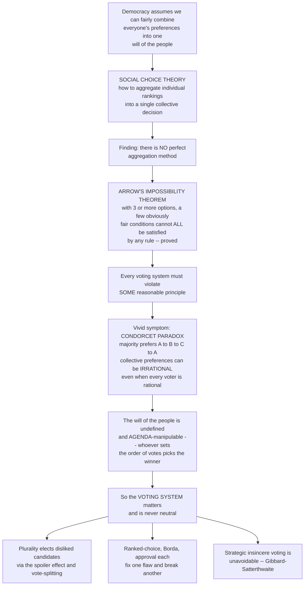

# 🗳️ Social Choice and Voting

> [!abstract] TL;DR
> **Social choice theory** studies how to combine many individuals' preferences into one collective decision — the mathematics behind "the will of the people." Its central findings are genuinely unsettling. **Arrow's impossibility theorem** (Kenneth Arrow, Nobel Prize) proves that once there are three or more options, *no* aggregation rule can satisfy even a short list of obviously reasonable fairness conditions at once — unanimity, no dictator, and independence of irrelevant alternatives. This is not a flaw in one voting system to be patched; it is a **fundamental limit** — every method must violate *some* sensible principle. The **Condorcet paradox** makes the limit vivid: a majority can prefer A to B, B to C, and yet also C to A, so collective preferences can be **cyclic and irrational even when every individual is perfectly rational**, rendering "the majority's will" undefined and manipulable by whoever controls the **agenda**. That is why the **choice of voting system is never neutral**: plurality invites **spoilers** and elects candidates most voters dislike; ranked-choice, Borda, and approval each fix one flaw and introduce another; and the **Gibbard-Satterthwaite theorem** shows strategic (insincere) voting is mathematically unavoidable. Social choice is where the deep limits of democracy meet the very real engineering of how we actually vote.

## Intuition

**Analogy — the group that cannot agree where to eat.** Three friends pick a restaurant by majority vote across pairs. Ann prefers Thai to Italian to Burgers; Ben prefers Italian to Burgers to Thai; Cara prefers Burgers to Thai to Italian. Ask "Thai or Italian?" — two of three say Thai. "Italian or Burgers?" — two say Italian. So Thai beats Italian, Italian beats Burgers; surely Thai wins? But ask "Thai or Burgers?" and two of three say **Burgers**. The group majority prefers Thai to Italian to Burgers *to Thai* — a loop with no top. Each friend is perfectly rational and consistent, yet **the group is not**. There is no "the group's favorite." And notice: whoever gets to pick *which pair to vote on last* can hand victory to any restaurant they like.

That tiny dinner is the whole subject. **Social choice theory** asks whether there is a fair, rational way to distill many individual rankings into one collective ranking — a genuine "will of the people." Democracy quietly assumes the answer is yes. The theory's shocking reply is **no**: Kenneth Arrow proved that with three or more options, you cannot write down any aggregation rule that meets a handful of conditions every reasonable person would demand — if everyone prefers A to B then society should too, no single person dictates, and whether society ranks A above B should not flip because some unrelated option C entered the race. Some sensible principle *must* break. The restaurant loop (the **Condorcet paradox**) is the everyday symptom, and it is why the *rules* of voting matter enormously: change plurality to ranked-choice to Borda to approval and, on the exact same ballots, the winner can change. The voting system is not a neutral pipe that reveals a pre-existing collective will — it is a **choice that partly manufactures the outcome**, and no version of it is flawless.

---

## How It Works

### Core mechanics

Social choice formalizes the friends-at-dinner problem. Each voter $i$ has a rational (complete, transitive) preference ranking over a set of alternatives. A **social welfare function** aggregates the *profile* of individual rankings into a single social ranking; a **social choice function** aggregates it into a single winner. The whole field asks which properties such an aggregator can and cannot have.

1. **The aggregation problem.** Given every individual's ranking, is there a fair, rational rule that produces "society's ranking"? Majority rule is the obvious candidate — and it fails, as the dinner loop shows.

2. **Arrow's fairness axioms.** Arrow wrote down minimal conditions any good rule *should* meet: **unrestricted domain** (accept any profile of rational preferences), **Pareto/unanimity** (if everyone prefers A to B, society ranks A above B), **independence of irrelevant alternatives** or IIA (society's A-vs-B ranking depends only on how voters rank A vs B, not on some third option C), a **transitive/rational** social ranking, and **non-dictatorship** (no single voter's ranking always becomes society's, ignoring everyone else).

3. **Arrow's impossibility theorem (1951).** For three or more alternatives, **no** aggregation rule satisfies all of those at once. Any rule guaranteeing a rational social ranking while respecting unanimity and IIA must be a **dictatorship**. So there is no perfect democratic method — every rule sacrifices *some* desideratum. "The will of the people" is not a well-defined object waiting to be measured.

4. **The Condorcet paradox and voting cycles.** Pairwise majority rule can produce **intransitive** collective preferences (A beats B, B beats C, C beats A) from perfectly transitive individuals. Then there is **no Condorcet winner** — no option that beats all others head-to-head — and majority rule has no stable answer.

5. **Agenda control and chaos.** When preferences cycle, **whoever sets the order of votes controls the outcome**: schedule the pairwise contests so your favorite enters last and it wins. McKelvey's chaos theorem sharpens this — in multiple dimensions, an agenda-setter can steer a majority to *literally any* outcome through a sequence of majority votes.

6. **Voting systems trade one flaw for another.** **Plurality/first-past-the-post** is simple but splits votes, wastes votes, and lets **spoilers** flip elections. The **Borda count** (points by rank) is more consensual but manipulable and violates IIA. **Instant-runoff/ranked-choice (IRV)** kills simple spoilers but is **non-monotonic** (ranking a candidate *higher* can make them lose). **Approval and score/range** voting sidestep some paradoxes but discard preference *intensity* information inconsistently. Each satisfies some criteria (majority, Condorcet, monotonicity, later-no-harm, participation) and fails others — exactly as Arrow guarantees.

7. **Strategic voting is unavoidable.** The **Gibbard-Satterthwaite theorem** (1973/1975): every non-dictatorial voting rule over three or more outcomes is **manipulable** — there exist situations where a voter does better by ranking insincerely. No reasonable system is strategy-proof. Tactical voting, agenda manipulation, and gerrymandering are not aberrations; they are baked in.

8. **Escapes and responses.** Impossibility is escaped only by *giving something up*. Restrict the domain to **single-peaked** preferences (voters arrayed on one dimension, each with a single ideal point) and majority rule becomes transitive again: the **median voter theorem** yields a stable Condorcet winner. Or add information ordinal rankings throw away — Sen's move to **cardinal welfare and capabilities**, or interpersonal comparisons. Or lean on **deliberation, consensus, or sortition**. Each escape trades a piece of Arrow's generality for a usable rule.

### Flow / Architecture



---

## Key Concepts

### Secondary Level

- **The will of the people is slippery.** We assume everyone's preferences can be fairly boiled down to one group choice. Sometimes they simply cannot — the group can want A over B, B over C, and C over A all at once.
- **No perfect voting system exists.** This is a proven mathematical fact (Arrow's theorem), not an opinion. Every method of voting has to break at least one rule of fairness you would want it to keep.
- **The system changes the winner.** Run the same ballots through different voting rules and a different candidate can win. The rules are not a neutral pipe; they help decide the result.
- **The spoiler effect.** Under simple "most votes wins" (plurality), a third candidate who splits one side's vote can hand victory to the side most voters actually oppose.

### Undergraduate Level

- **Social welfare vs social choice function.** A social *welfare* function outputs a full collective *ranking*; a social *choice* function outputs a single *winner*. Arrow's theorem targets the former; Gibbard-Satterthwaite targets the latter.
- **Arrow's axioms in one breath.** Unrestricted domain, Pareto/unanimity, independence of irrelevant alternatives (IIA), transitivity of the social ranking, and non-dictatorship — mutually incompatible for three or more options.
- **Condorcet winner and criterion.** A **Condorcet winner** beats every other option in head-to-head majority votes. A method "satisfies the Condorcet criterion" if it always elects that winner when one exists. Plurality, Borda, and IRV all can fail it.
- **The paradox and agenda-setting.** Pairwise majorities can cycle, so there may be *no* Condorcet winner. Then the sequence of votes decides — real committee chairs exploit this. Connects to [[Democracy_Types_and_Electoral_Systems]].
- **Method zoo and their trade-offs.** Plurality (spoilers, wasted votes) → runoff/IRV (non-monotonic) → Borda (IIA violation, manipulable) → approval/score (discards ordinal structure). No free lunch — Arrow again.
- **Strategic voting.** Because Gibbard-Satterthwaite guarantees manipulability, sincere voting is not always optimal; "vote for the lesser evil" is rational tactical behavior, not a failure of virtue. See [[Voting_Behavior_and_Electoral_Psychology]].

### Graduate Level

- **Arrow's proof architecture.** The decisive-coalition / contagion argument: show a group decisive over one pair is decisive over all pairs, then shrink it to a single **pivotal dictator**. IIA is the load-bearing axiom — relaxing it (as Borda does) escapes impossibility but admits manipulation and clones.
- **Gibbard-Satterthwaite via Arrow.** Strategy-proofness plus onto plus three-plus alternatives implies dictatorship; the theorem is essentially Arrow re-expressed on social choice functions through the monotonicity-implies-IIA bridge. See [[Revelation_Principle_and_IC]].
- **Single-peakedness and the median voter.** Black's theorem: if all preferences are single-peaked on a common one-dimensional ordering, pairwise majority rule is transitive and the **median voter's ideal point is the unique Condorcet winner** — the domain restriction that rescues majority rule and underpins spatial models of politics and the median-voter logic of public choice.
- **McKelvey-Schofield chaos.** In two or more dimensions the majority-rule core is generically empty, and an agenda-setter can construct a finite sequence of majority votes leading from any point to any other — majoritarian instability at its most extreme.
- **Sen's liberal paradox and the informational turn.** Sen showed even minimal individual rights conflict with Pareto under unrestricted domain, and argued impossibility stems from **informational parsimony** — using only ordinal, non-comparable preferences. Admitting cardinal utility, interpersonal comparison, or the **capability** metric changes the space of possible rules.
- **Manipulation complexity and mechanism design.** One modern response: make manipulation *computationally hard* (Bartholdi-Tovey-Trick) rather than impossible; another embeds voting in **mechanism design** where the designer engineers incentive-compatible rules within the limits Gibbard-Satterthwaite allows.

---

## Python Demo

```python
# Social choice and voting, made concrete:
#   (a) ONE preference PROFILE, several voting METHODS, DIFFERENT winners --
#       and pairwise majority rule CYCLES (Condorcet paradox), so the
#       "majority's will" is genuinely undefined. Plurality & Borda crown A,
#       instant-runoff crowns B, and the Condorcet method crowns no one
#       because B beats A, A beats C, and C beats B.
#   (b) The SPOILER effect under plurality: a majority prefers EITHER left
#       candidate to the right one, yet splitting the left vote hands the
#       win to the right -- vote-splitting flips the outcome.
import numpy as np
import matplotlib.pyplot as plt
from itertools import combinations

# ---------- (a) same ballots, different winners + a Condorcet cycle ----------
# Each key is a ranking best-to-worst; the value is how many voters hold it.
profile = {
    ("A", "C", "B"): 7,
    ("A", "B", "C"): 3,
    ("B", "A", "C"): 5,
    ("B", "C", "A"): 3,
    ("C", "B", "A"): 5,
    ("C", "A", "B"): 1,
}
candidates = ["A", "B", "C"]
N = sum(profile.values())

def plurality(prof, cands):
    tally = {c: 0 for c in cands}
    for ranking, n in prof.items():
        tally[ranking[0]] += n
    return tally

def borda(prof, cands):
    m = len(cands)
    tally = {c: 0 for c in cands}
    for ranking, n in prof.items():
        for pos, c in enumerate(ranking):
            tally[c] += (m - 1 - pos) * n        # top gets m-1 ... last gets 0
    return tally

def pairwise_margins(prof, cands):
    margin = {x: {y: 0 for y in cands} for x in cands}
    for x, y in combinations(cands, 2):
        vx = sum(n for r, n in prof.items() if r.index(x) < r.index(y))
        vy = N - vx
        margin[x][y], margin[y][x] = vx - vy, vy - vx
    return margin

def condorcet_winner(margin, cands):
    for x in cands:
        if all(margin[x][y] > 0 for y in cands if y != x):
            return x
    return None                                  # None => a majority CYCLE

def instant_runoff(prof, cands):
    remaining, rounds = set(cands), []
    while True:
        tally = {c: 0 for c in remaining}
        for ranking, n in prof.items():
            for c in ranking:
                if c in remaining:
                    tally[c] += n
                    break
        rounds.append(dict(tally))
        total, leader = sum(tally.values()), max(tally, key=tally.get)
        if tally[leader] * 2 > total:            # strict majority reached
            return leader, rounds
        remaining.discard(min(tally, key=tally.get))   # drop the weakest
        if len(remaining) == 1:
            return next(iter(remaining)), rounds

plu, bor = plurality(profile, candidates), borda(profile, candidates)
mar = pairwise_margins(profile, candidates)
cw = condorcet_winner(mar, candidates)
irv_win, irv_rounds = instant_runoff(profile, candidates)
plu_win, bor_win = max(plu, key=plu.get), max(bor, key=bor.get)

print(f"Ballots cast: {N}")
print(f"Plurality tally {plu} -> winner {plu_win}")
print(f"Borda     tally {bor} -> winner {bor_win}")
print(f"IRV       winner {irv_win} (rounds {irv_rounds})")
print("Pairwise margins (row beats column when positive):")
for x in candidates:
    print("   ", x, {y: mar[x][y] for y in candidates if y != x})
print(f"Condorcet winner: {cw}  <- None means a CYCLE (Condorcet paradox)")

# ---------- (b) the spoiler effect under plurality ----------
two_way   = {"Left": 55, "Right": 45}                         # Left wins head-to-head
three_way = {"Left": 30, "Left-2\n(spoiler)": 25, "Right": 45}  # split -> Right wins
print(f"\nTwo-way plurality winner:   {max(two_way, key=two_way.get)}")
print(f"Three-way plurality winner: {max(three_way, key=three_way.get)}  "
      f"(Left camp still totals {30 + 25} vs Right 45)")

# ---------- figure ----------
cand_color = {"A": "#1f77b4", "B": "#ff7f0e", "C": "#2ca02c", None: "#7f7f7f"}
fig, ((ax1, ax2), (ax3, ax4)) = plt.subplots(2, 2, figsize=(13, 10))

# ax1: the Condorcet cycle as a directed graph (arrow = "beats")
pos = {"A": (0.5, 0.88), "B": (0.10, 0.14), "C": (0.90, 0.14)}
ax1.set_xlim(0, 1); ax1.set_ylim(0, 1); ax1.axis("off")
ax1.set_title("Pairwise majority rule CYCLES\nCondorcet paradox: no option beats all others")
for c, (x, y) in pos.items():
    ax1.add_patch(plt.Circle((x, y), 0.075, color="#cfe3f7", ec="k", zorder=3))
    ax1.text(x, y, c, ha="center", va="center", fontsize=15, fontweight="bold", zorder=4)
for x in candidates:                              # exactly one arrow per pair
    for y in candidates:
        if x != y and mar[x][y] > 0:
            (x0, y0), (x1, y1) = pos[x], pos[y]
            ax1.annotate("", xy=(x1, y1), xytext=(x0, y0),
                         arrowprops=dict(arrowstyle="-|>", lw=2.4, color="#d62728",
                                         shrinkA=22, shrinkB=22), zorder=2)
            ax1.text((x0 + x1) / 2, (y0 + y1) / 2, f"beats +{mar[x][y]}",
                     fontsize=8, ha="center", va="center", color="#d62728",
                     bbox=dict(boxstyle="round", fc="white", ec="none"))

# ax2: winner by method -- same ballots, different winners
methods = ["Plurality", "Borda", "IRV", "Condorcet"]
winners = [plu_win, bor_win, irv_win, cw]
ax2.bar(methods, [1, 1, 1, 1], color=[cand_color[w] for w in winners], edgecolor="k")
for i, w in enumerate(winners):
    ax2.text(i, 0.5, w if w is not None else "none\ncycle!", ha="center", va="center",
             fontsize=13, fontweight="bold", color="white")
ax2.set_ylim(0, 1.25); ax2.set_yticks([])
ax2.set_title("Same ballots, DIFFERENT winner per method\n=> the method, not just the voters, decides")

# ax3 / ax4: the spoiler effect
ax3.bar(list(two_way.keys()), list(two_way.values()),
        color=["#1f77b4", "#d62728"], edgecolor="k")
ax3.axhline(50, ls="--", color="gray"); ax3.set_ylabel("Vote share (percent)")
ax3.set_title("Two-way race: Left wins 55 to 45")
ax4.bar(list(three_way.keys()), list(three_way.values()),
        color=["#1f77b4", "#9ecae1", "#d62728"], edgecolor="k")
ax4.axhline(50, ls="--", color="gray")
ax4.set_title("Spoiler enters: Left vote SPLITS -> Right wins with 45\nthough 55 prefer a Left candidate")

plt.tight_layout()
plt.savefig("social_choice_and_voting.png", dpi=130)
```

Running it prints the punchline in numbers: on the *identical* 24 ballots, plurality and Borda crown **A**, instant-runoff crowns **B**, and the Condorcet method crowns **no one** — because the pairwise majorities cycle (B beats A, A beats C, C beats B). Part (b) shows the spoiler: Left wins a straight 55-to-45 race, but add a second left-leaning candidate who peels off 25 points and the Right wins with a mere 45, even though 55 percent still prefer *some* Left candidate. The winner was engineered by the rules, not chosen by the voters.

---

## Real-World Applications

> **Ranked-choice voting adoption (Maine, Alaska, New York City, Ireland, Australia).** Jurisdictions switching from plurality to instant-runoff explicitly aim to kill the spoiler effect and let voters rank sincerely. The trade-off is real: IRV is non-monotonic, and Alaska's 2022 special election became a textbook case where the Condorcet winner was eliminated early — social choice theory made operational.

> **Committee and legislative agenda control.** Parliamentary procedure — the order of amendments and the sequence of pairwise votes — is agenda-setting power in action. When members' preferences cycle, the chair who controls the schedule can steer the majority to a chosen outcome, exactly as McKelvey's theorem warns. The design of "germaneness" and amendment rules is an attempt to tame this.

> **Proportional vs majoritarian constitutional design.** Choosing an electoral system for a new or reforming democracy is choosing which of Arrow's impossibilities to live with: plurality/FPTP buys decisiveness and local accountability at the cost of disproportionality and spoilers; proportional representation buys fidelity to vote shares at the cost of fragmented coalitions. Neither is "the neutral" choice. See [[Democracy_Types_and_Electoral_Systems]].

> **Participatory budgeting and referendums.** Cities allocating budgets by citizen vote, and multi-option referendums (e.g., a three-way independence/status-quo/reform choice), run headlong into vote-splitting and no-Condorcet-winner problems; the choice of ballot format (single-mark, ranked, approval) quietly determines results.

> **Recommender systems, rank aggregation, and metasearch.** The same mathematics governs merging many ranked lists into one — combining search-engine results, aggregating referee scores, or fusing recommender rankings. Arrow's theorem and Condorcet methods reappear as engineering constraints on how machines aggregate "preferences," linking social choice to computer science.

---

## Common Pitfalls

- **Believing "the will of the people" is a well-defined thing.** The single deepest error. When preferences cycle there is no majority favorite to discover — the question has no answer, so any confident claim about what "the people really want" is smuggling in a particular aggregation rule.
- **Treating impossibility as a fixable bug.** Arrow's theorem is not waiting for a clever new voting app to solve it. It proves that *no* rule can satisfy all the fairness conditions at once. Anyone selling a "perfect" system is quietly abandoning one of the axioms — ask which.
- **Assuming the voting method is a neutral instrument.** The rules co-produce the outcome. Comparing election results across countries or reforms without accounting for plurality vs runoff vs PR confuses a property of the *method* with a fact about the *electorate*.
- **Reading a plurality winner as "what most people want."** With three or more candidates, plurality can elect the option a *majority actively opposes* (the spoiler/vote-splitting effect). A plurality is not a majority.
- **Condemning tactical voting as mere cynicism.** Gibbard-Satterthwaite guarantees every reasonable system is manipulable, so voting for the "lesser evil" is a rational response to the rules, not a moral failing. Design should assume strategic voters, not wish them away.
- **Forgetting the escape hatch has a cost.** The median-voter theorem restores a stable winner — but *only* under single-peaked, one-dimensional preferences. Invoking "the median voter" for genuinely multidimensional politics quietly assumes away the very complexity that produces cycles.

---

## Related Concepts

Cross-vault links (verified to exist):

- [[Revelation_Principle_and_IC]] — the game-theory sibling: the Gibbard-Satterthwaite theorem, strategy-proofness, and social choice functions, with the formal bridge from Arrow's theorem to the impossibility of a non-manipulable rule.
- [[Democracy_Types_and_Electoral_Systems]] — the comparative-politics view of plurality/FPTP, majoritarian, and proportional systems whose properties this note derives from first principles.
- [[Power_Indices]] — the Banzhaf and Shapley-Shubik measures of *voting power* in weighted-voting bodies, a quantitative complement to who "decides" in an aggregation rule.
- [[Voting_Behavior_and_Electoral_Psychology]] — how real voters behave, including the tactical/strategic voting that Gibbard-Satterthwaite proves is unavoidable in principle.
- [[Public_Economics_and_Welfare]] — the welfare-economics setting where Arrow's theorem constrains the construction of a social welfare function that scores whether policy makes society better off.
- [[Paradoxes_and_Logical_Puzzles]] — the Condorcet paradox as a canonical case of collective intransitivity, kin to the self-reference and inconsistency puzzles catalogued there.

Within this section (siblings referenced in prose): *Public_Choice_and_Political_Economy* extends the median-voter and agenda-setting logic into the economics of politics; *Collective_Action_and_Interest_Groups* takes up who mobilizes to shape the aggregation; *Agenda_Setting_and_Framing* is the applied face of the agenda-control power that cyclic preferences expose; and the institutional-design implications connect to *Institutions_and_Institutional_Design*, since choosing a voting rule is an act of institutional engineering.

---

## Review Questions

**Secondary.** Three friends rank three restaurants and, by majority, prefer Thai to Italian, Italian to Burgers, and Burgers to Thai. Explain in plain words why there is no "group favorite" here, even though each friend has clear, consistent tastes. Why does this make the *order* in which they vote so powerful?

**Undergraduate.** (a) State Arrow's five conditions and explain, in one sentence each, why every one of them seems reasonable. (b) Borda count escapes Arrow's impossibility of a rational social ranking — which axiom does it violate, and give a concrete example of how adding a losing "clone" candidate can change the Borda winner. (c) On identical ballots, plurality elects A while instant-runoff elects B. Explain how that is possible and what it tells you about calling either "the people's choice."

**Graduate.** (a) Sketch how the Gibbard-Satterthwaite theorem follows from Arrow's theorem, identifying the role of monotonicity and the onto condition. (b) The median voter theorem restores a stable majority winner — state precisely the domain restriction it requires and explain why McKelvey's chaos theorem shows that relaxing it to two dimensions destroys the result. (c) Sen argues impossibility stems from "informational parsimony." Explain what informational enrichment (cardinal utility, interpersonal comparison, or capabilities) buys you, and what it costs in terms of measurability and legitimacy.

---

## Sources

- Arrow, K. J. — *Social Choice and Individual Values* (3rd ed., Yale University Press, 2012). [Yale UP](https://yalebooks.yale.edu/book/9780300179316/social-choice-and-individual-values/)
- Sen, A. — *Collective Choice and Social Welfare* (Expanded ed., Harvard University Press, 2017). [HUP](https://www.hup.harvard.edu/catalog.php?isbn=9780674919211)
- Riker, W. H. — *Liberalism against Populism* (Waveland Press, 1988). [Publisher](https://www.waveland.com/browse.php?t=390)
- Gibbard, A. — "Manipulation of Voting Schemes: A General Result," *Econometrica* 41(4), 1973. [JSTOR](https://www.jstor.org/stable/1914083)
- Satterthwaite, M. — "Strategy-proofness and Arrow's Conditions," *Journal of Economic Theory* 10(2), 1975. [ScienceDirect](https://www.sciencedirect.com/science/article/abs/pii/0022053175900502)

---

#public-policy #social-choice #arrows-theorem #condorcet-paradox #voting-systems
