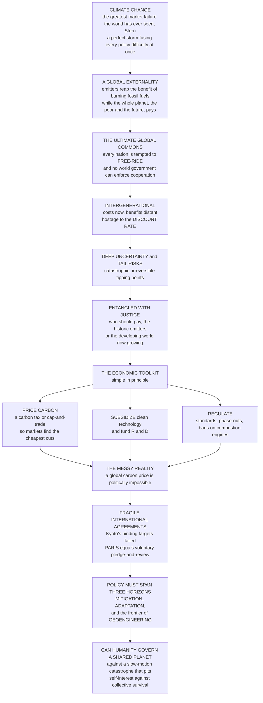

# 🌍 Environmental and Climate Policy

> [!abstract] TL;DR
> Climate change is, in Stern's phrase, **"the greatest market failure the world has ever seen"** — and it is also the hardest policy problem humanity has ever faced, a *perfect storm* that fuses **every** difficulty in the entire policy playbook at once. It is a **global externality**: emitters pocket the benefit of burning fossil fuels while the whole planet — especially future generations and poor countries who did least to cause it — bears the cost. It is the ultimate **global commons** and collective-action problem: no single country can solve it, each is tempted to **free-ride**, and there is no world government to enforce cooperation. It is **intergenerational** — costs fall now, benefits accrue decades or centuries away — so the whole thing is hostage to the **discount rate**. It is shot through with deep **uncertainty** and catastrophic, irreversible **tail risks** (tipping points), and it is entangled with **justice**. The economic toolkit is, at its core, simple: **put a price on carbon** (a tax or cap-and-trade) so markets find the cheapest cuts, **subsidize** clean alternatives, **regulate** with standards and bans, and invest in **R&D**. But because a global carbon price is politically impossible, the world governs climate through fragile **international agreements** — Kyoto's binding targets failed; the **Paris Agreement** works instead by voluntary "pledge and review." Policy must span **mitigation**, **adaptation**, and the fraught frontier of **geoengineering**. This is the climate-**policy-domain** view — the culmination of this vault's externality, commons, discounting, and governance themes — complementing Microeconomics's [[Externalities_and_Pigouvian_Tax]], Ecology's [[Environmental_Policy_and_Governance]], Energy's [[Energy_Policy_and_Decarbonization]], and Climatology's [[Anthropogenic_Climate_Change]].

---

## Intuition

**Analogy — the shared meadow that is also on fire and no one owns.** Picture an old village commons: a shared pasture where every herder can graze for free. Each grazes one more animal because *he* gets the full benefit while the cost of the thinning grass is spread across everyone — so the meadow is stripped bare. That is the classic **tragedy of the commons**. Now make it far worse. The meadow is the entire planet's atmosphere. The "grass" being consumed is a stable climate. The herders are not a dozen neighbors who could meet at the pub, but ~200 sovereign nations with no shared government, no police, and no way to force each other to hold back. The damage from over-grazing does not fall on today's herders at all — it falls on their *grandchildren*, and on the poorest villages downwind who never owned an animal. And the grass, once gone past a certain point, may never grow back. Climate change is that meadow: a commons problem with the volume turned up on every dial at once.

Here is why it is uniquely hard, dial by dial. It is a **global externality** — burning fossil fuel is cheap and profitable to the burner, while the harm is diffuse, global, and uncounted in any price, exactly as smoke from a factory is free to the factory and costly to the town downstream. It is the **ultimate global commons**: the benefit of cutting emissions is shared by everyone whether they paid for it or not, so every nation has an incentive to let *others* do the cutting and **free-ride** on their effort — and with no world government, cooperation is fiendishly fragile. It is **intergenerational**: we pay now, the payoff arrives in a century, which means the entire case for acting hangs on the **discount rate** — how much we choose to care about people not yet born. It is drenched in **uncertainty** and haunted by catastrophic, irreversible **tail risks** — ice-sheet collapse, methane release, tipping points we cannot undo. And it is knotted together with **justice**: the rich countries that grew wealthy burning coal are not the ones who will suffer most.

The remarkable thing is that the *economics* of the fix is almost simple. **Put a price on carbon** — a tax or a cap-and-trade market — and self-interested firms will hunt down the cheapest tonne of emissions to cut, all on their own. **Subsidize** clean alternatives so they win in the market. **Regulate** where prices are politically blocked — efficiency standards, bans on combustion-engine cars. **Fund the R&D** that makes clean energy cheaper than dirty. Get the price right and the problem is, in principle, solvable and even cheap. The *politics*, though, is brutal: a single global carbon price is impossible because no one can impose it, so the world falls back on **fragile voluntary agreements**. Kyoto tried binding, top-down targets and largely collapsed under free-riding and non-participation; **Paris** replaced it with bottom-up, self-chosen pledges that are flexible and nearly universal but do not yet add up to enough. And because some warming is already locked in, policy must do three things at once — **mitigation** (cut emissions), **adaptation** (cope with the warming we can no longer avoid), and confront **geoengineering** (the desperate, dangerous option of deliberately cooling the planet). Understanding climate and environmental policy is understanding *how — or whether — humanity can govern a shared planet* against a slow-motion catastrophe that pits every nation's self-interest against our collective survival.

---

## How It Works

### Core mechanics

1. **Frame environmental policy first.** The broader field protects environmental **quality** and natural **resources**: pollution (air, water, waste), biodiversity and land, and resource management. Over the last half-century it shifted from blunt **command-and-control** (mandate this technology, ban that substance) toward **market-based** and **mixed** instruments that harness self-interest, governed across many scales from local to global.
2. **See climate as the paradigmatic hard case.** Every environmental problem has *some* of the difficulties; climate has *all* of them, at planetary scale. This is why it is the culmination, not just another topic.
3. **Diagnose the four fused failures.** (a) A **global externality** — greenhouse emissions impose uncosted, worldwide damage. (b) The **ultimate global commons** — mitigation is a non-excludable global public good, so nations **free-ride** with no supranational enforcer. (c) An **intergenerational** transfer — costs now, benefits far in the future, making the answer hyper-sensitive to the **discount rate** and to intergenerational equity. (d) Deep **uncertainty** with catastrophic, **irreversible tail risks** and tipping points, plus long time lags and system inertia — all entangled with **justice** (historic vs current emitters, rich vs poor, common-but-differentiated responsibilities) and with the entire **energy** and economic system.
4. **Reach for the toolkit.** The economist's first-best is **carbon pricing**: set a price equal to the **social cost of carbon** so the externality is internalized *least-cost*, via a **carbon tax** (fix the price, let quantity adjust) or **cap-and-trade** (fix the quantity, let the price adjust). Around it sit **regulations and standards** (efficiency/emission rules, phase-outs, bans), **subsidies and R&D support** for clean tech (plus *removing* fossil subsidies), and **information/nudges**. Because pricing alone is politically insufficient, real policy is an **instrument mix** in a **second-best** world.
5. **Act across three horizons.** **Mitigation** cuts emissions (decarbonizing energy, transport, industry, land). **Adaptation** copes with unavoidable warming (resilient infrastructure, early-warning systems, managed retreat), and pays into **loss and damage**. **Geoengineering** — carbon removal and solar-radiation management — is the contested frontier, freighted with governance and **moral-hazard** risk. Over all three sit **net-zero** targets and transition pathways.
6. **Govern without a world government.** Because no one can levy a global price, climate is run through the treaty regime: the **UNFCCC**, the failed top-down **Kyoto Protocol**, and the bottom-up **Paris Agreement** of self-set Nationally Determined Contributions — flexible and near-universal, but voluntary and currently short of its own targets. **Climate clubs** and **border carbon adjustments** try to punish free-riding through trade; finance and technology transfer try to bridge the North-South divide.

### The economics is easy, the politics is hard

The deepest lesson is the **gap between the economics and the politics**. With the right carbon price the problem is analytically solvable and even cheap; yet it goes unsolved because a global price is politically impossible, fossil-fuel interests lobby hard, publics resist visible energy-price increases, political horizons are short while climate horizons are long, and existing fossil infrastructure creates **carbon lock-in** and path dependence. Climate policy is therefore as much a problem of **political economy** and **institutional design** as of economics.



---

## Key Concepts

### Secondary (intuitive grasp)

- **A shared sky no one owns.** The atmosphere is a commons: everyone can dump carbon into it for free, so everyone dumps too much and the shared climate degrades.
- **Free-riding.** Cutting emissions helps *everyone*, so each country is tempted to sit back and let others do the cutting — and if everyone thinks that way, no one cuts enough.
- **Costs now, benefits later.** We pay to cut emissions today; the reward — a livable climate — arrives generations from now. How much we care about the far future decides how much we act.
- **The simplest fix: make pollution cost money.** Put a price on carbon and dirty things get expensive, so people and firms switch to clean ones on their own.
- **Three jobs at once.** *Mitigation* = stop making it worse; *adaptation* = cope with the warming already coming; *geoengineering* = the risky emergency lever of deliberately cooling the planet.

### Undergraduate (mechanisms and vocabulary)

- **The four fused market failures.** Climate is (1) a **negative externality** (uncosted greenhouse damage), (2) a **global public good** with **free-riding**, (3) an **intergenerational** problem (discount-rate sensitive), and (4) a **deep-uncertainty** problem with fat-tailed, irreversible risks. Most policy problems have one; climate has all four.
- **Carbon pricing, two forms.** A **carbon tax** fixes the price per tonne and lets emissions adjust; **cap-and-trade** fixes total emissions and lets the permit price adjust. A single price makes every emitter cut until its **marginal abatement cost** equals that price — the least-cost condition for hitting any target.
- **The social cost of carbon (SCC).** The efficient carbon price equals the **SCC** — the present value of the damage from one extra tonne of CO₂. Because those damages stretch centuries ahead, the SCC is dominated by the **discount rate**.
- **Revenue and distribution.** A carbon price raises revenue that can be **recycled** as a per-capita **dividend** or used to cut other taxes (the **double dividend**). Because energy is a larger budget share for the poor, an unrecycled price is **regressive** and politically fragile.
- **The instrument mix.** Pricing is paired with **standards** (fuel-economy, emission limits, appliance efficiency), **phase-outs/bans** (coal, internal-combustion cars), **subsidies** and **R&D** for clean tech, and removal of **fossil-fuel subsidies** — because pricing alone is politically insufficient.
- **Mitigation vs adaptation vs geoengineering.** **Mitigation** cuts emissions; **adaptation** builds resilience to locked-in warming; **loss and damage** compensates unavoided harm; **geoengineering** (carbon dioxide removal, solar-radiation management) is the governance-fraught last resort with **moral-hazard** risk.
- **The treaty regime.** **UNFCCC** (the umbrella) → **Kyoto** (top-down binding targets on rich countries — largely failed) → **Paris** (bottom-up **NDCs**, "pledge and review," near-universal but voluntary and insufficient).

### Graduate (critique and theory)

- **Prices vs quantities under uncertainty (Weitzman).** For a *stock* pollutant like CO₂ with a relatively flat marginal-damage curve but steep, uncertain abatement costs, a **price** (tax) hedges cost blowups better than a hard cap; hybrids (price collars, banking/borrowing, safety valves) blend the two. The instrument choice is not neutral.
- **The Stern–Nordhaus divide.** The dispute over how aggressively to mitigate lived almost entirely in the **discount rate**: Stern's near-zero pure time preference yields a high SCC and urgent action; Nordhaus's market-calibrated rate yields a gradual "policy ramp" in the **DICE** integrated-assessment model. Same physics, opposite policies.
- **Climate clubs and border carbon adjustments (Nordhaus, 2015).** A stable coalition can overcome free-riding only if defection is *punished* — e.g. a uniform club carbon price enforced by **trade tariffs / border carbon adjustments** on non-members, converting a hopeless global commons into a self-enforcing arrangement backed by market access.
- **International Environmental Agreements as coalition games.** Formal IEA models (Barrett; Carraro–Siniscalco) show that *self-enforcing* treaties tend to be either **small** (deep cooperation among few) or **shallow** (broad but weak) — the "broad-but-deep" ideal is game-theoretically fragile, which is precisely the Paris predicament.
- **Fat tails and the Dismal Theorem (Weitzman).** When catastrophic outcomes have fat-tailed probabilities, expected discounted damages can be unbounded and the *tail risk*, not the central estimate, dominates the case for precaution — undercutting naive expected-cost-benefit and motivating a robust/precautionary stance on tipping points.
- **Carbon leakage and competitiveness.** Unilateral carbon prices can shift emissions-intensive production abroad (**leakage**), eroding both environmental gains and domestic political support — the technical rationale for border adjustments and sectoral agreements.
- **Directed technical change.** The strongest long-run case for a durable, credible carbon price is **induced innovation** (Acemoglu et al.): it redirects R&D toward clean technology and helps escape **carbon lock-in**, a channel that command-and-control standards capture only clumsily.
- **The equity architecture.** **Common-but-differentiated responsibilities**, historical-emissions accounting, climate finance (the contested 100-billion-a-year pledge), and **loss and damage** funds are attempts to make a globally efficient outcome also *just* — and to make cooperation politically feasible for the Global South.

---

## Python Demo

```python
# Environmental & climate policy made concrete in four panels:
#   (a) CLIMATE FREE-RIDER GAME -- N countries each choose abatement (costly to
#       self) while ALL share the global benefit. Individually-rational
#       free-riding leads to far too little global abatement (the tragedy):
#       non-cooperative Nash vs the full-cooperation social optimum.
#   (b) SHIFTING THE EQUILIBRIUM -- a climate CLUB (enforced by reciprocity /
#       border carbon adjustments) internalises benefits among its members;
#       as the coalition grows from 1 (non-coop) to N (full coop), global
#       abatement climbs -- how mechanisms escape the free-rider trap.
#   (c) CARBON PRICE & MARGINAL ABATEMENT COST -- a rising carbon price unlocks
#       progressively more expensive abatement; the EFFICIENT price is where
#       marginal abatement cost equals the SOCIAL COST OF CARBON.
#   (d) MITIGATION vs DAMAGE (a DICE-lite trade-off) -- spend on abatement now
#       vs bear future climate damage; the "optimal" abatement level and its
#       sharp sensitivity to the DISCOUNT RATE (Stern vs Nordhaus).
# Pure numpy + matplotlib.

import numpy as np
import matplotlib.pyplot as plt

fig, ax = plt.subplots(2, 2, figsize=(13, 9))

# ----------------------------------------------------------------------
# (a) & (b) THE CLIMATE PUBLIC-GOODS / FREE-RIDER GAME
#   Country i payoff:  U_i = b * sum_j(a_j)  -  0.5 * c * a_i^2
#     -> it enjoys the GLOBAL benefit of total abatement, pays only its OWN cost.
#   Non-cooperative Nash:  dU_i/da_i = b - c*a_i = 0  ->  a_i = b/c   (each ignores
#     the benefit its cutting confers on the other N-1 countries: FREE-RIDING).
#   Full cooperation (planner max sum U): N*b - c*a_i = 0 -> a_i = N*b/c
#     -> each abates N times as much, internalising all N countries' benefit.
# ----------------------------------------------------------------------
N, b, c = 8, 1.0, 1.0
a_nc   = b / c                  # abatement per country, non-cooperative
a_coop = N * b / c             # abatement per country, full cooperation
tot_nc, tot_coop = N * a_nc, N * a_coop

ax[0, 0].bar(["Non-cooperation\n(free-riding Nash)", "Full cooperation\n(social optimum)"],
             [tot_nc, tot_coop], color=["#c0392b", "#27ae60"], alpha=0.85)
for x, v in zip([0, 1], [tot_nc, tot_coop]):
    ax[0, 0].text(x, v + 1.5, f"{v:.0f}", ha="center", fontsize=11)
ax[0, 0].set_ylabel("Total GLOBAL abatement")
ax[0, 0].set_title(f"(a) Free-riding -> {tot_coop/tot_nc:.0f}x too little abatement")
ax[0, 0].grid(alpha=0.3, axis="y")

# (b) CLIMATE CLUB / coalition of size k: members internalise each other's benefit,
#     outsiders act alone.  a_member = k*b/c,  a_outsider = b/c.
#     total(k) = k*(k*b/c) + (N-k)*(b/c).  k=1 -> non-coop ; k=N -> full coop.
ks = np.arange(1, N + 1)
tot_by_k = ks * (ks * b / c) + (N - ks) * (b / c)
ax[0, 1].plot(ks, tot_by_k, "-o", color="#2e86de", lw=2)
ax[0, 1].axhline(tot_nc,   color="#c0392b", ls=":", label="non-cooperation")
ax[0, 1].axhline(tot_coop, color="#27ae60", ls=":", label="full cooperation")
ax[0, 1].set_xlabel("Climate-club size k (enforced cooperators)")
ax[0, 1].set_ylabel("Total global abatement")
ax[0, 1].set_title("(b) A club with enforcement escapes the trap")
ax[0, 1].legend(fontsize=8); ax[0, 1].grid(alpha=0.3)

# ----------------------------------------------------------------------
# (c) CARBON PRICE and the MARGINAL ABATEMENT COST curve.
#   MAC(a) = slope * a  -- each extra tonne cut costs more than the last.
#   A rising carbon price p unlocks all abatement whose MAC <= p.
#   Efficient price = SOCIAL COST OF CARBON; efficient abatement a* solves MAC=SCC.
# ----------------------------------------------------------------------
mac_slope, SCC = 1.5, 90.0
a_grid = np.linspace(0, 100, 400)
MAC = mac_slope * a_grid
a_star = SCC / mac_slope
ax[1, 0].plot(a_grid, MAC, color="#8e44ad", lw=2, label="marginal abatement cost")
ax[1, 0].axhline(SCC, color="black", ls="--", lw=1.6, label=f"social cost of carbon = {SCC:.0f}")
ax[1, 0].axvline(a_star, color="green", ls=":", lw=1.4)
ax[1, 0].fill_between(a_grid[a_grid <= a_star], 0, MAC[a_grid <= a_star],
                      color="#27ae60", alpha=0.18, label="worthwhile abatement")
ax[1, 0].annotate("efficient abatement\nMAC = SCC", xy=(a_star, SCC),
                  xytext=(a_star - 44, SCC + 18), fontsize=8,
                  arrowprops=dict(arrowstyle="->"))
ax[1, 0].set_xlabel("Abatement (tonnes CO2 cut)")
ax[1, 0].set_ylabel("Cost per tonne")
ax[1, 0].set_title("(c) Carbon price = SCC picks the efficient cut")
ax[1, 0].legend(fontsize=7.5, loc="upper left"); ax[1, 0].grid(alpha=0.3)

# ----------------------------------------------------------------------
# (d) MITIGATION vs DAMAGE (DICE-lite) and the DISCOUNT-RATE knife-edge.
#   Choose abatement fraction mu in [0,1].
#   Mitigation cost (convex, paid now):  A_mit * mu^2
#   Future climate damage (a discounted stream, convex in residual emissions):
#       PV_damage(mu) = (D_flow / r) * (1 - mu)^2   -- lower r -> heavier future.
#   Total social cost(mu) = A_mit*mu^2 + (D_flow/r)*(1-mu)^2.
#   Optimum: mu*(r) = (D_flow/r) / (A_mit + D_flow/r).
# ----------------------------------------------------------------------
A_mit, D_flow = 30.0, 1.0
mu = np.linspace(0, 1, 400)

def total_cost(mu, r):
    return A_mit * mu**2 + (D_flow / r) * (1 - mu)**2

def mu_star(r):
    pv = D_flow / r
    return pv / (A_mit + pv)

for r, name, col in [(0.050, "Nordhaus-like  r=5%", "#e67e22"),
                     (0.014, "Stern-like  r=1.4%",  "#16a085")]:
    tc = total_cost(mu, r)
    ms = mu_star(r)
    ax[1, 1].plot(mu * 100, tc, lw=2, color=col, label=name)
    ax[1, 1].scatter([ms * 100], [total_cost(ms, r)], color=col, zorder=5)
    ax[1, 1].annotate(f"optimal\n{ms*100:.0f}% cut", xy=(ms * 100, total_cost(ms, r)),
                      xytext=(ms * 100 + 3, total_cost(ms, r) + 6), fontsize=8, color=col)
ax[1, 1].set_xlabel("Abatement effort mu (percent of emissions cut)")
ax[1, 1].set_ylabel("Total social cost (mitigation + PV damage)")
ax[1, 1].set_title("(d) The discount rate decides how much to mitigate")
ax[1, 1].legend(fontsize=8); ax[1, 1].grid(alpha=0.3)

plt.tight_layout()
plt.savefig("environmental_and_climate_policy.png", dpi=120)
plt.show()

# --- Numeric takeaways -------------------------------------------------
print(f"(a) Non-cooperative global abatement = {tot_nc:.0f} vs full-cooperation "
      f"{tot_coop:.0f}  -> free-riding delivers only 1/{N} of the efficient effort.")
print(f"(b) Climate club of size k lifts abatement from {tot_nc:.0f} (k=1) "
      f"to {tot_coop:.0f} (k={N}); enforcement/border adjustments make cooperation stick.")
print(f"(c) Efficient carbon price = SCC = {SCC:.0f}/tonne -> abate a* = {a_star:.0f} tonnes.")
print(f"(d) Optimal mitigation: {mu_star(0.014)*100:.0f}% at r=1.4% (Stern) "
      f"vs {mu_star(0.050)*100:.0f}% at r=5% (Nordhaus) -- same physics, the rate decides.")
```

Panel **(a)** is the tragedy made numeric: because each country enjoys the *global* benefit of abatement but pays only its *own* cost, non-cooperative self-interest delivers just a fraction — here one-eighth — of the abatement a cooperating world would choose. Panel **(b)** shows the escape: a **climate club** whose members internalize each other's benefits (kept together by reciprocity and **border carbon adjustments**) raises global abatement steadily as the coalition grows from one free-riding singleton to full cooperation — the Nordhaus argument for enforceable clubs over toothless universalism. Panel **(c)** is the pricing logic: a rising carbon price walks up the **marginal abatement cost** curve, and the efficient stopping point is exactly where the price equals the **social cost of carbon**. Panel **(d)** is the punchline that ties climate policy back to this vault's discounting theme: the "optimal" amount of mitigation swings enormously — here from a Nordhaus-style modest cut to a Stern-style aggressive one — driven not by the climate science but by the **discount rate** alone.

---

## Real-World Applications

> **Example — The Paris Agreement (bottom-up "pledge and review").** After Kyoto's top-down binding targets fractured on free-riding and non-participation (the US never ratified; Canada withdrew; big emerging emitters had no targets), Paris (2015) inverted the design: every country sets its *own* **Nationally Determined Contribution**, submits it to transparency and periodic "ratcheting," and is bound only to *report*, not to *achieve*. The result is near-universal participation — its great strength — but pledges that, even if fully met, currently fall short of the 1.5–2 °C goal. Paris is the world's live experiment in governing a commons without a government.

> **Example — Carbon markets (cap-and-trade in practice).** The **EU Emissions Trading System**, the world's largest carbon market, caps emissions across power and industry and lets ~10,000 installations trade allowances; early over-allocation crashed the price, later repaired by a Market Stability Reserve. California's linked market, the northeastern **RGGI**, and China's national ETS extend the model — concrete demonstrations of the *quantity* instrument and the price volatility that motivates hybrid price-floor designs.

> **Example — Carbon taxes and border adjustments.** Sweden's carbon tax (1991, among the world's highest) and British Columbia's revenue-neutral tax (2008) are direct **Pigouvian** corrections that recycle revenue to blunt regressivity. The EU's **Carbon Border Adjustment Mechanism (CBAM)** operationalizes Nordhaus's **climate-club** idea: charge imports for their embedded carbon so that domestic carbon pricing does not simply push production — and emissions — abroad (**leakage**), turning trade access into an enforcement lever against free-riding.

> **Example — Subsidies and industrial policy for clean tech.** The US **Inflation Reduction Act** (2022) bet on *carrots* rather than a *price*: hundreds of billions in tax credits for solar, wind, batteries, EVs, and hydrogen, deliberately chosen because a carbon tax was politically impossible. It exemplifies the **second-best** reality — subsidies and standards substituting for the first-best carbon price — and the **induced-innovation** case that cheap clean tech can outcompete fossils outright.

> **Example — Adaptation and the frontier of geoengineering.** The Netherlands' Delta Works and "Room for the River," Bangladesh's cyclone shelters, and debates over **managed retreat** from flood zones are **adaptation** to warming already locked in. Meanwhile research into **solar-radiation management** (stratospheric aerosols) and **carbon dioxide removal** raises acute governance and **moral-hazard** questions — a cheap "thermostat" any single actor could deploy, with no agreed rules and the risk that its mere availability erodes the will to mitigate.

---

## Common Pitfalls

- **Treating climate as "just another externality."** It *is* an externality — but layering the global-commons free-rider structure, the intergenerational discount-rate sensitivity, and fat-tailed irreversible risk on top is what makes it categorically harder than acid rain or local smog. A Pigouvian tax that one government can simply impose does not exist at global scale; pretending otherwise skips the entire governance problem.
- **Assuming a carbon price alone will do it.** Economically, uniform carbon pricing is first-best and least-cost. Politically, it is fragile (visible energy-price hikes trigger backlash, as with the *gilets jaunes*), so real policy must blend pricing with standards, subsidies, and R&D. Dismissing the messy instrument mix as "inefficient" mistakes the first-best for the feasible.
- **Getting the social cost of carbon wrong via the discount rate.** The efficient carbon price equals the SCC, which is dominated by the discount rate applied to century-scale damages. Quoting a single "objective" SCC hides an ethical choice about future generations; a flat high rate can make catastrophic future damage look negligible today.
- **Confusing Kyoto's and Paris's failure modes.** Kyoto failed from *too much* bindingness (nations refused to join or exited); Paris risks failing from *too little* (voluntary pledges that do not add up). The lesson is not "binding good, voluntary bad" but that self-enforcing cooperation among sovereigns is intrinsically hard — hence clubs and border adjustments.
- **Ignoring distribution and the just transition.** Carbon prices are regressive and hit fossil-dependent regions and workers hardest; the North-South equity divide can veto global deals. Efficiency without a credible **just transition** and revenue recycling is not just unfair — it is politically unworkable, which makes it *ineffective*.
- **Treating geoengineering as a substitute for mitigation.** Solar-radiation management masks symptoms without removing CO₂ (leaving ocean acidification untouched) and creates termination-shock and governance hazards. Its greatest danger is **moral hazard**: the mere prospect of a cheap thermostat can sap the will to cut emissions.
- **Mistaking mitigation for the whole job.** Some warming is already locked in by past emissions and system inertia, so **adaptation** and **loss and damage** are not optional add-ons. A policy that funds only emission cuts abandons the communities already exposed to the warming we can no longer prevent.

---

## Related Concepts

Cross-vault anchors (Glob-verified files elsewhere in the vault):

- [[Externalities_and_Pigouvian_Tax]] — the Microeconomics *theory* of the uncosted greenhouse externality and the corrective carbon tax that this domain applies at planetary scale.
- [[Environmental_Policy_and_Governance]] — Ecology's governance-and-institutions treatment of environmental protection; this note supplies the climate-policy-domain and economic-instrument view atop it. Distinct basename, linked to deliberately.
- [[Climate_Change_Ecology]] — the ecological impacts (range shifts, phenology, tipping points) that mitigation and adaptation policy are trying to head off.
- [[Ecological_Economics_and_Natural_Capital]] — valuing the natural capital and ecosystem services that the climate externality silently degrades, and the deep-discounting of non-substitutable goods.
- [[Energy_Policy_and_Decarbonization]] — where carbon pricing, standards, and subsidies meet the energy system that produces most emissions; the sectoral engine of mitigation.
- [[The_Energy_Transition_and_Net_Zero]] — the net-zero pathways and transition dynamics that climate targets set in motion.
- [[Carbon_Capture_Utilization_and_Storage]] — an engineered mitigation and (with direct air capture) carbon-removal option that sits between deep abatement and geoengineering.
- [[Anthropogenic_Climate_Change]] — Climatology's account of the physical science and radiative forcing that make this the defining externality of our era.
- [[Geoengineering_and_Climate_Intervention]] — Climatology's treatment of solar-radiation management and carbon removal, the contested frontier whose governance and moral-hazard risks this note frames as policy.
- [[Repeated_Games_and_Folk_Theorems]] — the game-theoretic backbone of climate clubs: how reciprocity, punishment, and repeated interaction can sustain cooperation that one-shot self-interest destroys.
- [[Price_of_Anarchy]] — the formal measure of how far self-interested (free-riding) behavior falls short of the social optimum — the abstract sibling of the abatement gap in panel (a).

Within this vault, this note is the capstone policy domain of the *Policy Domains and Frontiers* section and draws every earlier thread together in prose: *Externalities_and_Environmental_Policy* (the instrument logic — carbon tax vs cap-and-trade — applied here to climate), *Discounting_and_Valuing_the_Future* (which fixes the social cost of carbon and drives the Stern–Nordhaus divide), *Risk_Analysis_and_Decision_Under_Uncertainty* (deep uncertainty, fat tails, and tipping-point tail risk), *Public_Goods_and_Collective_Provision* and *Collective_Action_and_Interest_Groups* (the global free-rider structure), *Institutions_and_Institutional_Design* (governing a commons without a world government), *Public_Choice_and_Political_Economy* and *Agenda_Setting_and_Framing* (fossil-fuel lobbying, carbon lock-in, and why the politics lags the economics), and *Science_Technology_and_Innovation_Policy* (the R&D and directed-technical-change leg of the toolkit).

---

## Review Questions

1. **(Secondary)** Explain, using the shared-meadow analogy, why climate change is harder to solve than a factory polluting a single river. Name three distinct features (for example free-riding, the far-future payoff, and no world government) that make it worse, and in your own words describe the *simplest* economic fix.
2. **(Undergraduate)** A world of eight countries can each abate emissions at private cost while all share the global benefit. Show why non-cooperative self-interest yields far less abatement than full cooperation, and explain how a **climate club** with **border carbon adjustments** shifts the equilibrium toward cooperation. Then explain why the *efficient* carbon price equals the social cost of carbon.
3. **(Graduate)** Kyoto's binding top-down targets largely failed; Paris's voluntary bottom-up pledges are near-universal but insufficient. Using coalition/IEA theory and Nordhaus's climate-club argument, explain why *self-enforcing* international cooperation among sovereigns tends to be either narrow-but-deep or broad-but-shallow, and design a mechanism (clubs, border adjustments, side-payments, finance) to escape the trap. How does the **discount rate** determine both the target you are enforcing and the case for enforcing it at all?

---

## Sources

- Nicholas Stern — *The Economics of Climate Change: The Stern Review*, Cambridge University Press, 2007 (climate as "the greatest market failure the world has ever seen").
- William D. Nordhaus — "Climate Clubs: Overcoming Free-Riding in International Climate Policy," *American Economic Review* 105(4), 2015; and *The Climate Casino*, Yale University Press, 2013.
- IPCC — *Sixth Assessment Report (AR6), Working Group III: Mitigation of Climate Change*, 2022.
- Joseph E. Aldy and Robert N. Stavins — "The Promise and Problems of Pricing Carbon: Theory and Experience," *Journal of Environment and Development* 21(2), 2012.
- Scott Barrett — *Environment and Statecraft: The Strategy of Environmental Treaty-Making*, Oxford University Press, 2003 (self-enforcing international environmental agreements).

---

#public-policy #climate-policy #carbon-pricing #global-commons #paris-agreement
