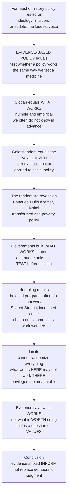

# 🔬 Evidence-Based Policy and Policy Experiments

> [!abstract] TL;DR
> **Evidence-based policy** is the radical-sounding idea that we should figure out whether a policy works the *same way* we figure out whether a medicine works — by **testing it rigorously**, ideally with **experiments**, before rolling it out to millions. Its slogan is *"what works"*: a deliberately humble, empirical stance admitting we often *do not know* in advance whether a well-intentioned program will help. The gold-standard tool is the **randomized controlled trial (RCT)** applied to social policy, and the "**randomista**" revolution (Banerjee, Duflo, Kremer — Nobel 2019) ran thousands of them, transforming anti-poverty policy. The lessons are humbling: many beloved, expensive programs *do not work* — some *backfire* (Scared Straight *increased* youth crime) — while cheap interventions like deworming work wonders. Governments institutionalized this with "**what works**" centers and behavioral "**nudge units**" that test before scaling. But the limits are real: not everything can be randomized, *what works here may not work there* (**external validity**), it can privilege the measurable over the important, and — most fundamentally — evidence tells you what *works*, never what is *worth doing*. That is a question of **values**, not data. Evidence should **inform** democratic judgment, not replace it.

---

## Intuition

**Analogy:** For most of history, governments made policy the way a medieval physician prescribed treatment — on the basis of **ideology, intuition, tradition, anecdote, and the loudest voice in the room**, rarely on solid evidence about what actually *works*. A doctor "knew" bloodletting cured fevers because it was obvious, everyone did it, and the patients who lived proved it. Then medicine did something revolutionary: it started *testing* treatments — giving some patients the drug and others a placebo, at random, and measuring the difference. Most cherished remedies turned out to be useless or harmful. **Evidence-based policy** is the movement to do the same thing to *governing*: to stop assuming that a well-meaning program helps and instead **find out**, by testing it — ideally through a **randomized experiment** — *before* spending billions rolling it out to millions of people.

The slogan is *"what works,"* and the humility in that phrase is the whole point. It concedes that a program can be *popular, expensive, and completely ineffective* — even counterproductive — and that we usually cannot tell which from the armchair. The **randomized controlled trial** does for social policy exactly what it does for a new drug: randomly assign some people or places to receive the program and others not, then measure the gap. This "**randomista**" revolution — Abhijit Banerjee, Esther Duflo, and Michael Kremer, who won the 2019 Nobel — ran thousands of field experiments on deworming pills, cash transfers, and teacher incentives, learning which anti-poverty ideas *actually* reduce poverty and which, despite good intentions, do not. The results are humbling and valuable: the notorious **Scared Straight** program, which took at-risk teens to meet prisoners, was beloved and intuitive — and rigorous trials found it *increased* youth crime. But evidence has hard limits, and the honest position is the one that keeps it in its place: evidence can tell you what *works*, but never what is *worth doing* — because that is a question of **values**, and you cannot experiment your way to deciding what a society *should want*.

---

## How It Works

### Core mechanics

1. **Start from humility ("what works").** Reject *policy-based evidence* (start with the conclusion, cherry-pick support) in favor of *evidence-based policy*: treat a program's effectiveness as an **open empirical question** whose answer is often surprising and unknown in advance.
2. **Demand a credible counterfactual.** "Participants improved" is not proof — they might have improved *anyway*. Rigorous **impact evaluation** estimates what would have happened *without* the program, separating the true **causal effect** from everything else (the sibling deep-dive *Program_Evaluation_and_Causal_Inference* formalizes this).
3. **Test small, ideally by experiment.** Run a **policy experiment** — an **RCT** where random assignment makes treatment and comparison groups alike except for the program, so any outcome gap *must* be caused by it. When randomization is impossible, fall back on **quasi-experiments** (difference-in-differences, regression discontinuity, natural experiments), each buying credibility with an explicit assumption.
4. **Climb the evidence hierarchy.** A single study is weak; the pyramid runs from anecdote and monitoring data at the base, up through observational studies and single RCTs, to **systematic reviews and meta-analysis** that pool many trials at the apex (the Campbell and Cochrane Collaborations do this for social and medical evidence respectively).
5. **Institutionalize the loop: test, learn, adapt.** Governments build **"what works" centers** and clearinghouses to grade and synthesize evidence, and **behavioral-insights / "nudge" units** that run cheap **A/B tests** on real policies (letter wording, default enrollment) and scale only the winners.
6. **Kill the duds, scale the winners, then re-check.** Piloting lets you *avoid* rolling out ineffective or harmful programs and concentrate money on what works — but always re-test at scale, because **external validity** is not guaranteed.
7. **Keep evidence in its lane.** Evidence establishes *means* (does X produce Y?); it cannot settle *ends* (is Y what we should want, and at what cost to other values?). Those are democratic, ethical, value-laden judgments that evidence can **inform but never replace**.



---

## Key Concepts

### Secondary (intuitive grasp)
- **"What works" is a question, not a slogan of certainty.** A program can be well-meaning, popular, and expensive — and *still* not work. The only way to know is to test it.
- **Test before you scale.** Trying a program on a small group first (a **pilot**) and measuring the result is cheaper than rolling it out to millions and discovering later it failed.
- **Some programs backfire.** *Scared Straight* seemed obviously helpful — yet trials showed it made teens *more* likely to offend. Good intentions do not guarantee good outcomes.
- **Evidence tells you what works, not what is right.** Data can show a policy reduces crime; it cannot tell you whether the trade-offs in liberty or fairness are worth it. That is a **values** question.

### Undergraduate (mechanisms and vocabulary)
- **Evidence-based vs policy-based evidence:** the difference between letting data shape the decision and manufacturing data to justify a decision already made.
- **The evidence hierarchy / pyramid:** anecdote and monitoring < observational study < single RCT < **systematic review and meta-analysis**. Higher tiers control more threats to a causal claim.
- **Impact vs process vs monitoring:** *impact* asks "did it cause the outcome?", *process* asks "was it delivered as designed?", and *monitoring* just tracks inputs and outputs — only impact evaluation answers the causal question.
- **RCTs and quasi-experiments:** randomization balances observed *and unobserved* confounders (gold standard); quasi-experiments approximate it when randomizing is infeasible, at the cost of extra assumptions.
- **Rapid-cycle testing and A/B tests:** nudge units treat policy delivery like a product experiment — many cheap, fast randomized tests on messaging, defaults, and forms.
- **External vs internal validity:** *internal* — is the effect real *here*? *External* — does it *travel* to other places, populations, and scales? A study can ace one and fail the other.

### Graduate (critique and theory)
- **The randomista revolution and its critics:** Banerjee, Duflo, and Kremer (J-PAL; Nobel 2019) made field experiments the default in development economics. Critics — **Angus Deaton** and **Martin Ravallion** — argue RCTs are often *theory-free* and *narrow*: they estimate a local average treatment effect without explaining the *mechanism*, displace structural and general-equilibrium reasoning, and mislead when scaled. The **transportability** literature (Pearl, Bareinboim; Cartwright and Hardie) asks *formally* when an effect estimated in one context can be exported to another.
- **External validity and scale-up effects:** the effect measured in a small NGO-run pilot can vanish at national scale because implementation quality falls, **general-equilibrium** effects kick in (a job-training program that helps trainees when small may just reshuffle who gets scarce jobs when universal), and **spillovers** violate the independence assumption (SUTVA). "What works here" is a claim about a context, not a law of nature.
- **The streetlight bias:** like the drunk searching for keys under the lamppost because the light is better, evidence-based policy can privilege the *easily measured and short-term* (test scores, quarterly outcomes) over the *important and long-term* (civic capacity, dignity, institutions) — distorting priorities toward what randomizes cleanly.
- **Gaming, publication bias, and the winner's curse:** measured targets get gamed (Goodhart's law); the literature over-represents *significant, surprising* findings, so published effects are **inflated** and fail to replicate; a single "successful" pilot may be a lucky draw from a noisy distribution.
- **Institutional architecture:** the UK **What Works Network** and Education Endowment Foundation, US **evidence clearinghouses** and **tiered-evidence** grant-making, **Pay-for-Success / Social Impact Bonds**, and open-data mandates operationalize a **test-learn-adapt** cycle inside government — with the science-policy interface (think tanks, academics, advisers) mediating between evidence and decision.
- **The is/ought gap — the fundamental limit:** evidence concerns *means*, values concern *ends*. No quantity of RCTs can establish what a society *should* value, how to weigh efficiency against equity, or whose welfare counts. Evidence *informs* but cannot *replace* the political, normative, democratic judgment at the heart of governing — the honest role is "speaking truth to power," not ruling by data.

---

## Python Demo

```python
# Evidence-based policy, hand-rolled with numpy + matplotlib.
#   (a) VALUE OF EVIDENCE: expected net benefit of TEST-THEN-SCALE vs SCALE-ON-FAITH,
#       and how the payoff of testing GROWS with the fraction of duds and the cost of failure.
#   (b) THE SURPRISE: a plausible program (Scared Straight) that intuition rates positive
#       but a rigorous trial reveals to be HARMFUL -- contrasted with a cheap winner (deworming).
#   (c) EXTERNAL VALIDITY: an effect measured high at "site A" fails to transfer -- the
#       distribution of the SAME program's effect across many heterogeneous sites.
#   (d) WINNER'S CURSE / PUBLICATION BIAS: keeping only "significant" studies inflates
#       the published effect far above the small true effect.
import numpy as np
import matplotlib.pyplot as plt

rng = np.random.default_rng(2019)  # the randomista Nobel year

# ---------- (a) Value of evidence: test-then-scale vs scale-on-faith ----------
# Per-program economics (in arbitrary "benefit units"):
B_win     = 10.0    # net social benefit if a program truly works and is scaled
C_scale   = 3.0     # cost of scaling a program nationally
c_test    = 0.4     # cost of a small pilot / RCT to learn if it works
dud_loss  = -2.0    # a dud that is scaled anyway destroys value (waste + harm)

frac_dud = np.linspace(0.0, 1.0, 200)      # fraction of proposed programs that do NOT work
p_work   = 1.0 - frac_dud

# Scale-on-faith: scale EVERY proposed program, winners and duds alike.
scale_faith = p_work * (B_win - C_scale) + frac_dud * (dud_loss - C_scale)
# Test-then-scale: pay c_test on every program, then scale ONLY the winners.
test_scale  = -c_test + p_work * (B_win - C_scale) + frac_dud * 0.0
value_of_evidence = test_scale - scale_faith   # = -c_test + frac_dud*(C_scale - dud_loss)

# How the value of evidence grows with the COST OF FAILURE (steeper duds hurt more).
frac_dud_grid = np.linspace(0, 1, 100)

# ---------- (c) External validity: same program, many sites ----------
n_sites = 4000
site_effect = rng.normal(1.5, 3.0, n_sites)   # heterogeneous; mean positive, wide spread
site_A = 6.5                                   # the flagship pilot where it looked great
frac_fail_elsewhere = np.mean(site_effect <= 0)

# ---------- (d) Winner's curse / publication bias ----------
n_studies = 6000
true_effect = 0.6                              # small but real
se = 1.0                                        # noisy estimates
est = rng.normal(true_effect, se, n_studies)
published = est[est > 1.96 * se]               # only "significant" positives get published
published_mean = published.mean()

# ---------------- Plots ----------------
fig, ax = plt.subplots(2, 2, figsize=(13, 9.5))

# (a) net benefit curves + value of evidence
ax[0, 0].plot(frac_dud, scale_faith, color="#c0392b", lw=2.2, label="Scale on faith (roll out all)")
ax[0, 0].plot(frac_dud, test_scale,  color="#16a085", lw=2.2, label="Test then scale (pilot first)")
ax[0, 0].fill_between(frac_dud, scale_faith, test_scale,
                      where=(test_scale > scale_faith), color="#16a085", alpha=0.15)
ax[0, 0].axhline(0, color="grey", lw=0.8, ls=":")
ax[0, 0].set_xlabel("Fraction of proposed programs that do NOT work")
ax[0, 0].set_ylabel("Expected net benefit per program")
ax[0, 0].set_title("(a) Testing pays off more as duds get more common")
ax[0, 0].legend(fontsize=8, loc="lower left")

# (a-inset via twin panel) value of evidence vs cost of failure
for cost_fail in [-1.0, -3.0, -6.0]:
    voe = -c_test + frac_dud_grid * (C_scale - cost_fail)
    ax[0, 0].plot(frac_dud_grid, voe, lw=1.0, ls="--", alpha=0.6)
ax[0, 0].text(0.02, ax[0, 0].get_ylim()[1]*0.55,
              "dashed = value of evidence\n(steeper as failure gets costlier)",
              fontsize=7.5, color="#555555")

# (b) the surprise: intuition vs trial
progs   = ["Scared\nStraight", "Deworming\npills"]
intuit  = [5.0, 1.0]     # what the armchair expects
trial   = [-3.0, 8.0]    # what the RCT actually found
x = np.arange(len(progs)); w = 0.36
ax[0, 1].bar(x - w/2, intuit, w, color="#95a5a6", label="Intuition / expectation")
ax[0, 1].bar(x + w/2, trial,  w, color="#2980b9", label="Rigorous trial (RCT)")
ax[0, 1].axhline(0, color="black", lw=0.9)
ax[0, 1].set_xticks(x); ax[0, 1].set_xticklabels(progs)
ax[0, 1].set_ylabel("Effect on the outcome")
ax[0, 1].set_title("(b) Testing overturns intuition\n(Scared Straight backfired; deworming won)")
ax[0, 1].legend(fontsize=8, loc="lower right")
ax[0, 1].annotate("backfires!", xy=(0 + w/2, -3.0), xytext=(0.25, -6.0),
                  fontsize=8, color="#c0392b",
                  arrowprops=dict(arrowstyle="->", color="#c0392b"))

# (c) external validity: distribution of site effects
ax[1, 0].hist(site_effect, bins=45, color="#7f8c8d", alpha=0.75)
ax[1, 0].axvline(0, color="black", lw=1.0, ls=":")
ax[1, 0].axvline(site_A, color="#c0392b", lw=2.0,
                 label=f"Site A pilot = {site_A:.1f} (looks great)")
ax[1, 0].axvline(site_effect.mean(), color="#16a085", lw=2.0,
                 label=f"Mean across sites = {site_effect.mean():.1f}")
ax[1, 0].set_xlabel("Program effect at a given site")
ax[1, 0].set_ylabel("Number of sites")
ax[1, 0].set_title(f"(c) What works HERE may not work THERE\n{frac_fail_elsewhere*100:.0f}% of sites see zero or harm")
ax[1, 0].legend(fontsize=8, loc="upper left")

# (d) winner's curse / publication bias
ax[1, 1].hist(est, bins=50, color="#bdc3c7", alpha=0.8, label="All studies")
ax[1, 1].hist(published, bins=50, color="#8e44ad", alpha=0.75, label="Published (significant only)")
ax[1, 1].axvline(true_effect, color="#16a085", lw=2.0,
                 label=f"TRUE effect = {true_effect:.1f}")
ax[1, 1].axvline(published_mean, color="#c0392b", lw=2.0,
                 label=f"Published mean = {published_mean:.1f}")
ax[1, 1].set_xlabel("Estimated effect")
ax[1, 1].set_ylabel("Number of studies")
ax[1, 1].set_title("(d) Winner's curse: publishing only wins\ninflates the apparent effect")
ax[1, 1].legend(fontsize=8, loc="upper left")

plt.tight_layout()
plt.savefig("evidence_based_policy.png", dpi=120)
plt.show()

print(f"(a) Value of testing at 50% duds : {(-c_test + 0.5*(C_scale - dud_loss)):.2f} benefit units/program")
print(f"(b) Scared Straight: intuition +5 vs trial -3  -> a beloved program that BACKFIRES")
print(f"(c) Site A pilot {site_A:.1f} vs cross-site mean {site_effect.mean():.1f}; "
      f"{frac_fail_elsewhere*100:.0f}% of sites see zero-or-harm")
print(f"(d) True effect {true_effect:.1f} vs published mean {published_mean:.2f}  <- inflated by the winner's curse")
```

Panel **(a)** makes the core case for experimentation: when few programs are duds, testing barely beats scaling on faith, but as the dud fraction and the *cost of failure* rise, the **value of evidence** climbs steeply — piloting lets you *avoid* pouring money into losers. Panel **(b)** delivers the humbling surprise: intuition rates *Scared Straight* highly, yet the trial finds it *harmful*, while cheap deworming quietly wins. Panels **(c)** and **(d)** are the cautions: the same program's effect is **wildly heterogeneous across sites**, so a stellar flagship pilot need not travel; and keeping only "significant" studies **inflates** the published effect far above the modest truth.

---

## Real-World Applications

> **Example — J-PAL and the deworming revolution:** The Abdul Latif Jameel Poverty Action Lab (J-PAL), founded by Banerjee and Duflo, ran hundreds of RCTs across the developing world. Kremer's Kenyan **deworming** trials showed that a pill costing pennies dramatically cut school absenteeism — a stunningly cost-effective anti-poverty lever that anecdote and intuition had overlooked. The body of work won the 2019 Nobel and made randomized field experiments the default in development economics.

> **Example — Scared Straight (the cautionary tale):** Taking at-risk teenagers into prison to be confronted by inmates *felt* obviously deterrent, was widely adopted, and was even celebrated in an Oscar-winning documentary. But randomized trials, later pooled in a **Campbell Collaboration systematic review**, found it *increased* the odds of offending. It is the textbook case that a beloved, plausible program can *backfire* — and that only rigorous testing reveals it.

> **Example — The UK Behavioural Insights Team ("Nudge Unit"):** Spun out of the Cabinet Office, BIT embedded **rapid A/B testing** into government. A famous trial found that adding "most people in your area pay their tax on time" to reminder letters raised on-time tax payment — a near-costless tweak, discovered by experiment, that scaled nationally. BIT's "**test, learn, adapt**" mantra exemplifies institutionalized evidence-based policy.

> **Example — The What Works Network:** The UK government funds a network of independent "**what works**" centers (the Education Endowment Foundation, the College of Policing's crime-reduction center, and others) that commission trials, grade evidence, and publish plain-language guidance so that schools, police, and councils can choose interventions by proven effectiveness rather than fashion. The US equivalents include the What Works Clearinghouse and tiered-evidence grant programs.

> **Example — Conditional cash transfers (Progresa/Oportunidades):** Mexico rolled out its conditional-cash-transfer program in a *randomized phase-in* across villages, creating a natural RCT. It credibly showed that paying poor families conditional on school attendance and clinic visits improved education and health — evidence so persuasive that dozens of countries adopted the design, a landmark of evidence *driving* policy diffusion.

---

## Common Pitfalls

- **Policy-based evidence (motivated reasoning)** — Deciding first, then commissioning research to justify it and burying inconvenient results. The antidote is pre-registration, independent evaluators, and a genuine willingness to *kill* the program if it fails.
- **Mistaking monitoring data for impact** — Tracking that a program was delivered and that outcomes rose is *not* evidence the program *caused* the rise. Without a credible counterfactual you are measuring the trend, not the treatment.
- **Over-generalizing a single pilot (external-validity failure)** — Assuming a stellar result in one context, population, or small scale will hold everywhere. Scaling changes delivery quality, triggers general-equilibrium and spillover effects, and can shrink or reverse the effect. Replicate before you universalize.
- **The streetlight bias** — Optimizing for what randomizes cleanly and measures quickly (test scores, short-term metrics) while neglecting the hard-to-quantify but important (institutions, dignity, long-run capacity). Do not let measurability set the agenda.
- **The winner's curse and publication bias** — Acting on a lone "significant" study when surprising, significant findings are systematically inflated and often fail to replicate. Weight *systematic reviews and meta-analyses*, not one exciting headline.
- **Gaming the measured target (Goodhart's law)** — Once a metric becomes the reward, people optimize the metric rather than the goal (teaching to the test, cream-skimming easy cases). Anticipate gaming when designing evidence standards and incentives.
- **Ethical and feasibility blind spots** — Some policies cannot or should not be randomized (you cannot randomize a constitution or withhold a plainly life-saving intervention). Treating "not randomizable" as "not worth knowing" is a category error.
- **Confusing what works with what is worth doing (the is/ought slip)** — The deepest pitfall: presenting a value-laden choice as a purely technical one, using evidence to *smuggle in* an ends judgment. Evidence can rank means to a goal; it cannot choose the goal. Keep the normative debate explicit and democratic.

---

## Related Concepts

- [[Randomized_Controlled_Trials_in_Populations]] — the Epidemiology treatment of the gold-standard experimental design that evidence-based policy borrows wholesale from medicine and public health.
- [[Systematic_Reviews_and_Meta_Analysis]] — the Epidemiology account of how many trials are pooled at the top of the evidence pyramid (Cochrane and Campbell), the method behind synthesizing "what works."
- [[Potential_Outcomes_Framework]] — the Econometrics formalization of the counterfactual and the average treatment effect that make an experiment's causal claim precise.
- [[Evidence_Based_Medicine_and_Clinical_Trials]] — the Clinical Medicine sibling movement whose "test the treatment" logic evidence-based policy explicitly imported into governing.
- [[Scientific_Reasoning_and_Method]] — the Logic and Critical Thinking note on hypothesis testing and empirical inference, the epistemic backbone of the "what works" stance.

This note lives in the **Policy Domains and Frontiers** section of the **Public_Policy_and_Governance** vault and is meant to be read alongside its sibling notes in prose. *Program_Evaluation_and_Causal_Inference* supplies the methodological engine — RCTs, quasi-experiments, and the counterfactual — that this note situates inside a broader reform movement; *Policy_Analysis_Methods* provides the prospective, ex-ante toolkit that evidence complements ex-post; *Behavioral_Public_Policy_and_Nudges* is the domain where cheap A/B experimentation and nudge units became the default proving ground; *Cost_Effectiveness_and_Multi_Criteria_Analysis* takes a credibly-estimated effect and asks whether it is worth the money and how to weigh incommensurable values; and *The_Reach_and_Future_of_Public_Policy* closes the vault by reflecting on exactly the promise and the limits — evidence informing, never replacing, democratic judgment — that this note defends.

---

## Review Questions

1. **(Secondary)** A mayor is proud that a new after-school program is "obviously working" because attending kids get better grades than kids who do not attend. Explain in plain language why this is not proof the program works, and describe how you would run a fairer test before spending money to expand it citywide.
2. **(Undergraduate)** Define *external validity* and explain, using a concrete example, why an anti-poverty intervention that produced large gains in a randomized pilot might produce little or no effect when scaled to an entire country. Name two distinct mechanisms (e.g., implementation quality, general-equilibrium effects, spillovers) that could cause the shrinkage.
3. **(Graduate)** "Evidence-based policy tells us what works; it therefore tells us what we ought to do." Critique this claim. Distinguish the *is* from the *ought*, explain why no volume of RCTs can settle a question of ends, and then argue for a principled division of labor between rigorous evidence and democratic, value-laden judgment in a specific contested policy area (e.g., criminal sentencing or welfare conditionality). Address at least one critique from the "randomista" debate (Deaton or Ravallion) in your answer.

---

## Sources

- Banerjee, A. V. & Duflo, E. — *Poor Economics: A Radical Rethinking of the Way to Fight Global Poverty* (2011); and their randomized-field-experiment program with M. Kremer (J-PAL; Nobel Memorial Prize in Economics, 2019).
- Deaton, A. (2010) — "Instruments, Randomization, and Learning about Development," *Journal of Economic Literature*, 48(2).
- Cartwright, N. & Hardie, J. (2012) — *Evidence-Based Policy: A Practical Guide to Doing It Better*, Oxford University Press.
- Haskins, R. & Margolis, G. (2014) — *Show Me the Evidence: Obama's Fight for Rigor and Results in Social Policy*, Brookings Institution Press.
- Petrosino, A., Turpin-Petrosino, C. & Buehler, J. — "Scared Straight and Other Juvenile Awareness Programs for Preventing Juvenile Delinquency," *Campbell Systematic Reviews* (updated meta-analysis of the RCT evidence).

---

#public-policy #evidence-based-policy #randomized-controlled-trials #what-works #external-validity
