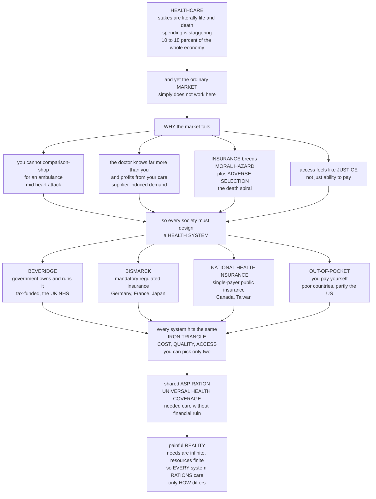

# 🏥 Health Policy and Systems

> [!abstract] TL;DR
> Healthcare is the policy domain where the stakes are literally **life and death**, the money is **staggering** (rich countries spend 10–18 percent of their entire economy on it), and — crucially — the ordinary **market does not work**, because healthcare violates almost every assumption that makes markets efficient. You cannot comparison-shop for an ambulance mid-heart-attack; the doctor who profits from your surgery knows far more than you do about whether you need it (**information asymmetry** and **supplier-induced demand**); insurance breeds **moral hazard** (once insured, you use more care) and **adverse selection** (the sick most want coverage, so premiums spiral and the healthy drop out — a **death spiral**); and most people believe access is a matter of **justice**, not just ability to pay. So every society must design a **health system** to solve the same problems, and they have done so in strikingly different ways — the **Beveridge** model (government owns and runs it, tax-funded — the UK's NHS), the **Bismarck** model (mandatory insurance via regulated non-profit funds — Germany), **national health insurance** (single-payer public insurance, private delivery — Canada), and the **out-of-pocket** market model (you pay yourself — most poor countries, and partly the US). Every one confronts the same brutal **iron triangle** — **cost, quality, access**, of which you can generally optimize only two — aspires toward **universal health coverage**, and faces the inescapable reality that because health needs are effectively infinite while resources are finite, **every system rations care**; the only question is *how*.

---

## Intuition

**Analogy — a restaurant where you can't read the menu, don't know if you're hungry, and someone else picks your order and pays the bill.** Imagine a restaurant unlike any other. You arrive not because you chose to but because you collapsed at the door. You cannot read the menu — the dishes are in a language only the chef speaks — so you cannot compare prices or judge quality. Worse, you don't even know whether you need to eat: the chef, who is paid per dish served, is the one who tells you that you must have the expensive seven-course tasting menu, and you have no way to check. You didn't bring your wallet, because a third party — your insurance fund — is footing the bill, so you shrug and order freely, and so does everyone else. Meanwhile the only customers who bothered to buy a meal plan in advance are the ones who already knew they'd be sick tonight, which is exactly why meal plans keep getting more expensive until healthy people stop buying them. And overshadowing it all is a shared moral conviction that *nobody should be turned away at this particular door just because they can't pay* — this is not a restaurant a decent society lets people starve outside of.

Every feature of that bizarre restaurant is a real, well-named failure of the healthcare market: you cannot shop mid-emergency; the seller knows more than the buyer and profits from doing more (**supplier-induced demand** driven by **information asymmetry**); the third-party payer detaches you from cost (**moral hazard**); the sick self-select into coverage and unravel the risk pool (**adverse selection** and its **death spiral**); and the whole thing is shot through with the belief that access is a matter of **justice** rather than willingness-to-pay. Because the market cannot fix these on its own, *government is deeply involved in healthcare everywhere on Earth* — even in the most market-friendly countries. The economist **Kenneth Arrow** laid this out in a famous 1963 paper, and it remains the intellectual foundation of the entire field: healthcare is *special*, and pretending it is just another product you buy like a toaster is the original sin of health policy.

So every society has to *design* a health system, and the striking thing is that only a handful of basic blueprints exist. **T.R. Reid** popularized four: **Beveridge** (the government both insures and delivers, paid for out of taxes — Britain's NHS, the Nordics, Spain); **Bismarck** (mandatory insurance bought through tightly regulated non-profit "sickness funds," financed by employer and employee premiums — Germany, France, Japan); **national health insurance** (a single government insurer pays private and public providers — Canada, Taiwan, South Korea); and **out-of-pocket** (you pay yourself, or you go without — the reality for most of the world's poor, and one large slice of the fragmented American system, which uniquely contains all four models at once). Whatever the blueprint, each one runs headlong into the same wall: the **iron triangle** of *cost, quality, and access*. You want care that is cheap, excellent, and available to everyone — but you can generally have only two. Better access and higher quality cost more; cheaper systems must ration access or shave quality. The universal aspiration is **universal health coverage** — everyone gets the care they need without being financially ruined by it — and the eternal, painful reality underneath it is **rationing**: because health needs are effectively bottomless and resources are finite, *every* system limits care. The only real question a health system ever answers is *how* it rations — by price, by queue, by explicit cost-effectiveness rules, or by bureaucratic judgment. Understanding health policy is understanding how societies grapple with the most personal, expensive, and morally fraught service of all.

---

## How It Works

### Core mechanics

1. **Diagnose the market failure first.** Healthcare departs from the competitive ideal on nearly every axis Arrow identified: **uncertainty** (you can't predict when or how much care you'll need), **information asymmetry** (patients can't judge what care they need or whether it worked; the physician can — and is often paid to do more, hence **supplier-induced demand** and the fraught **agency relationship**), **externalities** (your vaccination protects your neighbors — herd immunity), **high and catastrophic costs**, and a widely shared conviction that access is a matter of **equity and rights**, not pure purchasing power. These are *why* pure markets fail and government is everywhere involved.
2. **See why insurance is both the fix and a new problem.** Insurance solves the catastrophic-cost problem by **pooling risk**, but it introduces two classic failures. **Moral hazard**: once shielded from the price, insured people (and their doctors) use more care than they otherwise would. **Adverse selection**: because the sick know they're sick and value coverage most, a voluntary pool fills with high-cost enrollees, premiums rise to match, the healthy exit, average cost climbs again — a **death spiral** that can unravel the market entirely. Insurers respond with **risk selection** ("cream-skimming" the healthy), which is efficient for them and corrosive for the system.
3. **Break the health system into its functions.** Any system, whatever its politics, performs four jobs: **financing** (raising money — taxes, premiums, or out-of-pocket), **pooling** (combining risks so the healthy subsidize the sick and this year subsidizes a bad year), **purchasing** (paying providers, and how you pay shapes what you get), and **delivery** (the hospitals, clinics, and clinicians). The WHO frames these as the health-system **building blocks**; the goals are better **health**, **responsiveness**, and **financial protection**.
4. **Recognize the four organizing models.** Countries mix financing and delivery differently: **Beveridge** (tax-financed, government-provided), **Bismarck** (mandatory social insurance through regulated non-profit funds), **national health insurance / single-payer** (one public insurer, mixed delivery), and **out-of-pocket** (individual payment, dominant where the state is weak). Real systems blend these; the US notably contains all four for different populations.
5. **Confront the iron triangle.** Hold up three goals — **cost** control, high **quality**, and universal **access** — and you find they trade off. Expanding access and raising quality costs money; containing cost forces you to ration access or accept lower quality. No system escapes; each simply chooses *which* corner to sacrifice, and *how*.
6. **Fight the cost problem, knowing why costs rise.** Health spending climbs because of new **technology**, **aging** populations, **Baumol's cost disease** (labor-intensive care can't get cheaper the way manufacturing does), and **fee-for-service incentives** that reward volume. Levers include shifting provider payment from **fee-for-service → capitation → value-based / bundled payment**, **price regulation**, and standardized case payments like **DRGs**.
7. **Chase universal health coverage — and accept that rationing is unavoidable.** UHC (a WHO and Sustainable Development Goal target) means everyone can access needed care without financial hardship, expandable along three dimensions of the **UHC cube**: *breadth* (who is covered), *depth* (which services), and *height* (what share of the cost). But because needs outstrip resources, *every* system **rations** — the only choice is *how*: **implicitly** (by price/ability-to-pay, by queue/waiting list, by clinical discretion) or **explicitly** (by cost-effectiveness / health-technology assessment, using QALYs and thresholds — the NICE approach). Rationing is "the R-word": inescapable, and politically radioactive.

### Flow / Architecture



---

## Key Concepts

### Secondary

- **Healthcare isn't a normal market.** You can't shop for an ambulance during a heart attack, you can't judge whether you really need that surgery, and someone else often pays the bill. That's why governments are involved in healthcare in *every* country.
- **The four models.** *Beveridge* — the government runs the hospitals and pays with taxes (UK). *Bismarck* — you must buy insurance from tightly regulated non-profit funds (Germany). *National health insurance* — one government insurer pays private doctors (Canada). *Out-of-pocket* — you pay yourself or go without (poor countries, and part of the US).
- **The iron triangle.** Everyone wants healthcare that is *cheap*, *high quality*, and *available to all*. In practice you can usually only get two of the three at once.
- **Universal health coverage.** The global goal that everyone can get the care they need without being bankrupted by it.
- **Rationing.** Because health needs are basically endless and money isn't, *every* system limits care somehow — by price, by waiting lists, or by rules. The debate is never *whether* to ration but *how*.

### Undergraduate

- **Arrow's market-failure case (1963).** Kenneth Arrow's landmark analysis showed healthcare systematically violates competitive-market assumptions: pervasive **uncertainty**, **information asymmetry** between doctor and patient, the **agency relationship** (your doctor acts on your behalf but has their own incentives), **externalities**, and a norm that care shouldn't be allocated by willingness-to-pay alone. Conclusion: unregulated markets under-provide and misallocate care, so collective intervention is nearly universal.
- **The insurance failures, precisely.** **Moral hazard** = insured people use more care because they don't face the marginal price (addressed with copays, deductibles, gatekeeping). **Adverse selection** = when the sick disproportionately buy voluntary insurance, the pool's average cost rises, premiums rise, the healthy exit, and the cycle repeats — the **death spiral**; countered by an individual **mandate**, automatic/universal enrollment, or subsidies. **Risk selection / cream-skimming** = insurers competing to enroll the healthy and avoid the sick, undermining pooling (addressed with **risk adjustment**).
- **Health-system functions.** Financing, pooling, purchasing, delivery — the WHO **building blocks**. *How you purchase matters*: **fee-for-service** rewards volume; **capitation** pays per patient and rewards restraint (sometimes too much); **value-based / bundled** payment tries to reward outcomes; **DRGs** pay a fixed sum per diagnosis-related group.
- **Comparing the four models.** Beveridge systems control cost well and cover everyone but can generate queues; Bismarck systems offer choice and quality but are administratively complex and pricey; single-payer systems have low overhead and universal coverage but centralize rationing decisions; out-of-pocket systems are the harshest, leaving the poor exposed to **catastrophic health spending**. The US uniquely runs all four for different groups (VA = Beveridge; employer insurance ≈ Bismarck; Medicare ≈ NHI; uninsured = out-of-pocket) — which is a large part of why it's the world's costliest system.
- **Why costs rise.** Technology (new, better, and more expensive), aging demographics, **Baumol's cost disease**, and volume-rewarding incentives. Cost containment means fighting all four with payment reform, price regulation, and demand-side cost-sharing — each with its own side effects.
- **The UHC cube.** Progress toward universal coverage moves along three axes — *breadth* (population covered), *depth* (services included), *height* (fraction of cost covered) — and you can rarely expand all three at once. **Financial protection** — preventing care from causing impoverishment — is the point.
- **Explicit vs implicit rationing.** *Implicit*: price, queues, clinical discretion — diffuse and deniable. *Explicit*: cost-effectiveness thresholds and priority-setting (QALYs, NICE) — transparent and defensible but politically exposed. The choice between them is itself a values decision.

### Graduate

- **Formalizing supplier-induced demand and agency.** Because the physician is a better-informed agent who often shares in the revenue, the demand curve is partly *set by the supplier*. This breaks the standard welfare theorems (price no longer signals marginal value), rationalizes **provider-payment reform** as incentive design, and explains why "let patients be smart shoppers" high-deductible schemes underperform for the complex, high-cost care that drives most spending.
- **The RAND Health Insurance Experiment and demand elasticity.** The classic randomized evidence: cost-sharing meaningfully reduces utilization (price elasticity of demand for care ≈ −0.2), and mostly *without* harming health for the average patient — but it also cuts *effective* care and disproportionately harms the poor and sick. This is the empirical spine of moral-hazard policy and a caution that blunt cost-sharing rations by health status, not by value.
- **Adverse-selection theory and its unraveling.** In the Akerlof/Rothschild–Stiglitz tradition, if insurers can't distinguish risks and pricing reflects the pool average, low-risk buyers are overcharged and exit, iterating to a "lemons" collapse or to only-the-sickest equilibria. Mandates, community rating **plus** an individual mandate, risk adjustment, and reinsurance are the standard repair kit; the Affordable Care Act's "three-legged stool" (guaranteed issue + mandate + subsidies) is a textbook attempt to hold the pool together.
- **The iron triangle as a constrained optimization.** Cost, quality, and access are not independent goals but a **production-possibility frontier** under a resource constraint: at the efficient frontier, improving any two degrades the third, and the "sacrifice" is the marginal rate of transformation among them. Systems below the frontier (waste, low-value care — see the "flat of the curve" and Wennberg's practice variation) can improve on all three at once; near it, the trade-offs bind. This reframes reform as *both* moving toward the frontier (eliminating low-value care) *and* choosing where on it to sit.
- **Value-based purchasing and the measurement problem.** Shifting from volume to value requires measuring quality and outcomes — but risk-adjustment is imperfect, so pay-for-performance can reward patient selection over genuine improvement, and outcome metrics invite **gaming** (Goodhart's law). Bundled payments and accountable-care organizations transfer financial risk to providers, trading moral hazard on the patient side for potential *under*-provision on the provider side.
- **Cost-effectiveness rationing and the QALY.** Explicit priority-setting allocates a fixed budget across interventions by **cost per QALY** up to a **willingness-to-pay threshold**, which is properly interpreted as the **opportunity cost / shadow price** of the budget constraint — the health displaced elsewhere by the marginal dollar. Critiques: QALYs can undervalue life-extension for disabled/elderly patients, embed contestable equity judgments, and presume interpersonal comparability — hence equity-weighted QALYs and distributional cost-effectiveness analysis.
- **The politics and ethics of "the R-word."** Because explicit rationing makes trade-offs visible, it is politically punished ("death panels"), pushing systems toward *implicit* rationing that is less accountable but more survivable. The normative literature (Daniels's "accountability for reasonableness," the "fair innings" argument, prioritarianism) supplies procedural and substantive criteria for legitimate rationing — the recognition that a *defensible process* may matter as much as the allocation itself.

---

## Python Demo

```python
# Health policy, made concrete, in two panels:
#   (a) THE IRON TRIANGLE / DIMINISHING RETURNS: plot stylized cross-country data --
#       health spending per capita vs life expectancy -- to show that spending MORE
#       buys steeply diminishing gains, and that the US is a high-cost, middling-
#       outcome OUTLIER. Access (coverage) is encoded in the marker size.
#   (b) THE ADVERSE-SELECTION DEATH SPIRAL: simulate a voluntary insurance pool where
#       rising premiums drive the healthy out, raising average cost and premiums
#       further until the market unravels -- then show how a universal MANDATE stops
#       the spiral cold.
# Pure numpy + matplotlib.

import numpy as np
import matplotlib.pyplot as plt

rng = np.random.default_rng(7)
fig, (ax1, ax2) = plt.subplots(1, 2, figsize=(13.5, 5.6))

# ----------------------------------------------------------------------
# (a) IRON TRIANGLE: spend more, gain less -- and the US outlier
# ----------------------------------------------------------------------
country = np.array(["Ethiopia", "India", "Mexico", "Poland", "S. Korea",
                    "UK", "Japan", "Canada", "France", "Germany",
                    "Switzerland", "USA"])
spend   = np.array([  80,  250,  1150, 1800, 3300,
                    5400, 4700, 5900, 5500, 6700,
                    8000, 12500], dtype=float)          # $ per capita per year
life    = np.array([65.0, 70.0, 75.0, 78.0, 83.5,
                    81.3, 84.5, 82.0, 82.5, 81.0,
                    83.7, 76.5])                         # life expectancy, years
coverage = np.array([0.35, 0.55, 0.90, 0.98, 1.00,
                     1.00, 1.00, 1.00, 1.00, 1.00,
                     1.00, 0.91])                        # share with coverage (access)

# Fit a diminishing-returns curve: life = a + b * log(spend).
b, a = np.polyfit(np.log(spend), life, 1)
xs = np.linspace(spend.min(), spend.max(), 300)
ax1.plot(xs, a + b * np.log(xs), color="gray", ls="--", lw=1.5,
         label="diminishing-returns fit")

ax1.scatter(spend, life, s=coverage * 320 + 20, c=coverage,
            cmap="viridis", edgecolor="black", zorder=3)
for nm, x, y in zip(country, spend, life):
    ax1.annotate(nm, (x, y), fontsize=7,
                 xytext=(4, 4), textcoords="offset points")
# Flag the USA as the high-cost, middling-outcome outlier.
ax1.annotate("USA: spends the MOST,\nyet lags on outcome\n(high-cost outlier)",
             (12500, 76.5), fontsize=8, color="#d62728",
             xytext=(-40, -34), textcoords="offset points",
             arrowprops=dict(arrowstyle="->", color="#d62728"))
ax1.set_xlabel("Health spending per capita  ($ / year)")
ax1.set_ylabel("Life expectancy  (years)")
ax1.set_title("The iron triangle: spend more, gain less\nmarker size and color = ACCESS (coverage)")
ax1.legend(fontsize=8, loc="lower right")
ax1.grid(alpha=0.3)

# ----------------------------------------------------------------------
# (b) ADVERSE-SELECTION DEATH SPIRAL vs a universal MANDATE
# ----------------------------------------------------------------------
N = 20000
# Each person has an expected annual health cost (lognormal: many cheap, few very costly).
cost_i = rng.lognormal(mean=np.log(3000), sigma=1.0, size=N)
# Risk-averse buyers will pay a margin above their own expected cost.
gamma = 1.30                                # willingness-to-pay = gamma * expected cost
wtp   = gamma * cost_i
admin_load = 1.10                           # insurer premium = 10 percent above pool cost

def simulate(mandate, iters=25):
    prem_hist, enroll_hist = [], []
    enrolled = np.ones(N, dtype=bool)       # start with everyone in the pool
    premium = admin_load * cost_i.mean()
    for _ in range(iters):
        if mandate:
            enrolled = np.ones(N, dtype=bool)          # everyone is required to enroll
        else:
            enrolled = wtp >= premium                  # buy only if it is worth it to you
        if enrolled.sum() == 0:                        # market has fully collapsed
            prem_hist.append(premium); enroll_hist.append(0.0)
            break
        premium = admin_load * cost_i[enrolled].mean() # reprice off the surviving pool
        prem_hist.append(premium)
        enroll_hist.append(enrolled.mean())
    return np.array(prem_hist), np.array(enroll_hist)

prem_vol, enr_vol = simulate(mandate=False)
prem_man, enr_man = simulate(mandate=True)

ln1 = ax2.plot(prem_vol, "-o", color="#d62728", lw=2, ms=4,
               label="voluntary: premium spirals up")[0]
ln2 = ax2.plot(prem_man, "-s", color="#2ca02c", lw=2, ms=4,
               label="mandate: premium stays flat")[0]
ax2.set_xlabel("Repricing round")
ax2.set_ylabel("Premium  ($ / year)", color="black")
ax2.set_title("The adverse-selection DEATH SPIRAL\nand how a mandate stops it")
ax2.grid(alpha=0.3)

# Twin axis: show the healthy fleeing the voluntary pool.
ax2b = ax2.twinx()
ln3 = ax2b.plot(enr_vol * 100, ":", color="#1f77b4", lw=2,
                label="voluntary: percent still enrolled")[0]
ax2b.set_ylabel("Share still enrolled  (percent)", color="#1f77b4")
ax2b.set_ylim(0, 105)
ax2.legend(handles=[ln1, ln2, ln3], fontsize=8, loc="center right")

plt.tight_layout()
plt.show()

# ----- narrative output -------------------------------------------------
print("(a) Iron triangle / diminishing returns:")
print(f"    Each extra dollar of log-spending buys ~{b:.2f} yrs of life -- and the")
print(f"    curve FLATTENS: past ~$5-6k/capita, more money barely moves outcomes.")
print(f"    USA spends ${spend[-1]:,.0f}/capita (the most) for {life[-1]:.1f} yrs")
print(f"    -- BELOW UK ({life[5]:.1f}) at less than half the cost. Cost != outcome.\n")

print("(b) Adverse-selection death spiral:")
print(f"    Voluntary pool: premium ${prem_vol[0]:,.0f} -> ${prem_vol[-1]:,.0f}, "
      f"enrollment {enr_vol[0]*100:.0f}% -> {enr_vol[-1]*100:.0f}%.")
print(f"    As premiums rise the HEALTHY exit, the pool gets sicker, premiums rise")
print(f"    again -- the classic unraveling.")
print(f"    Mandate pool: premium holds at ~${prem_man[-1]:,.0f} with 100% enrolled.")
print(f"    Universal enrollment keeps the healthy in the pool -> the spiral never starts.")
```

The **left panel** is the iron triangle made empirical: plotting health spending per capita against life expectancy across countries reveals a **diminishing-returns** curve — the first few thousand dollars per person buy enormous gains in longevity, but past roughly \$5,000–\$6,000 per capita the curve flattens and extra money barely moves the outcome. Marker size and color encode **access** (coverage), the third corner of the triangle. The **USA** sits as the notorious outlier: it spends by far the most yet posts a *lower* life expectancy than systems costing half as much, a vivid demonstration that spending, quality, and access do not automatically move together. The **right panel** simulates the **adverse-selection death spiral**: in a voluntary pool, the insurer must price off whoever is enrolled, so when premiums rise the *healthiest* buyers — those whose expected cost is well below the premium — walk away, the surviving pool gets sicker, the repriced premium climbs again, and enrollment (the dotted blue line) collapses as the market unravels. The green line shows the fix: a **universal mandate** forces everyone to stay in the pool, so the premium reflects the *whole population's* average cost and holds flat. It is the "three-legged stool" of insurance-market design compressed into one plot — and the reason nearly every universal system rests on compulsory or automatic enrollment.

---

## Real-World Applications

- **The United Kingdom's NHS (Beveridge in the flesh).** The government owns the hospitals, employs the clinicians, and funds care from general taxation; care is free at the point of use. It delivers universal coverage at comparatively low cost — the "cost" corner and "access" corner won — but rations the "access-to-specific-care" corner through **waiting lists** and, explicitly, through **NICE**, which uses cost-per-QALY thresholds to decide what the NHS will pay for.
- **Germany's statutory health insurance (Bismarck).** Employees and employers pay income-based premiums into competing, tightly regulated non-profit **sickness funds**; providers are mostly private. It delivers choice, quality, and universal coverage — at higher administrative cost — and uses **risk-structure adjustment** across funds to blunt cream-skimming, a direct policy answer to risk selection.
- **Canada and Taiwan (single-payer / national health insurance).** A single government insurer pays private and public providers, keeping administrative overhead low and coverage universal. Taiwan famously *designed* its single-payer system in the 1990s by studying the world's models — a rare case of deliberate, evidence-based health-system architecture — while Canada's Medicare shows the single-payer trade-off of queues for elective care.
- **The United States (all four models at once).** The VA is Beveridge, employer-sponsored insurance is quasi-Bismarck, Medicare resembles national health insurance, and the uninsured face out-of-pocket reality. This fragmentation, fee-for-service incentives, and administrative complexity make it the world's most expensive system without universal coverage — the case study in *how not to* resolve the iron triangle. The **ACA's** guaranteed-issue-plus-mandate-plus-subsidy design is a live attempt to defeat the adverse-selection spiral.
- **Universal health coverage as a global goal.** The WHO and the UN's Sustainable Development Goal 3.8 make UHC a worldwide target; low- and middle-income countries (Thailand, Rwanda, Mexico's Seguro Popular) expand along the **UHC cube** — deciding whom to cover, which services, and what share of cost — while measuring success by reductions in **catastrophic and impoverishing health spending**.
- **Explicit rationing by health-technology assessment.** England's NICE, Australia's PBAC, Canada's CADTH, and the US ICER decide which drugs and devices public systems fund by estimating **cost per QALY** against a willingness-to-pay threshold — the concrete, institutionalized machinery of choosing *how* a system rations.

---

## Common Pitfalls

- **Assuming healthcare is a normal market.** The original sin of health policy is treating care like a toaster — "just let consumers shop and competition will sort it out." Information asymmetry, emergencies, third-party payment, and externalities mean market forces underperform exactly where the money is (complex, high-cost care). Pure consumer-directed schemes work least well where they are needed most.
- **Ignoring adverse selection when designing insurance.** Offering voluntary insurance with community-rated premiums and *no* mandate or subsidy invites the death spiral: the healthy leave, premiums climb, the pool sickens. Guaranteed issue **without** a mandate or auto-enrollment is a textbook policy error.
- **Believing spending more automatically buys better health.** The diminishing-returns curve is real: past a threshold, more money yields little outcome improvement, and much high-cost care is "flat of the curve" or outright low-value. The US outlier proves cost, quality, and access can move independently. Reform is often about *reallocating* spending, not just adding it.
- **Pretending your system doesn't ration.** Systems that recoil from *explicit* rationing simply ration *implicitly* — by queues, by ability to pay, by clinical discretion — which is less transparent and often *less* equitable. "We don't ration" is never true; it only means "we ration in ways we don't admit."
- **Fee-for-service tunnel vision.** Paying providers per service rewards **volume**, not value or health, and is a primary engine of cost growth and supplier-induced demand. But naive fixes overshoot: pure capitation risks *under*-provision, and pay-for-performance invites metric-gaming and patient cherry-picking (Goodhart's law). Payment design is incentive design, with side effects in every direction.
- **Copy-pasting another country's system.** Models are embedded in institutions, financing, culture, and history; lifting the NHS or Singapore's system wholesale ignores path dependence and political feasibility. The transferable lessons are *principles* (pool broadly, align payment with value, protect against catastrophic cost), not blueprints.
- **Treating the QALY as ethically neutral.** Cost-per-QALY rationing embeds contestable value judgments and can undervalue life-extension for disabled or elderly patients. Explicit priority-setting is more honest than implicit rationing, but the numbers are not the whole ethics — pair them with distributional and procedural-justice analysis.

---

## Related Concepts

Cross-vault anchors (Glob-verified files elsewhere in this vault):

- [[Health_Policy_and_Economics_of_Public_Health]] — the epidemiology-side companion covering the health-economics view (demand, insurance, cost-effectiveness, financing); *this* note is the health-*systems and policy-design* counterpart. Distinct basename, linked deliberately.
- [[Public_Health_Systems_and_Functions]] — the population-health infrastructure (surveillance, prevention, the WHO functions) that sits alongside the personal-medical-care system this note focuses on.
- [[Social_Determinants_and_Health_Equity]] — the upstream reason access and outcomes diverge; the "equity" corner of the iron triangle and the case that health is a matter of justice.
- [[Evidence_Based_Medicine_and_Clinical_Trials]] — supplies the effectiveness and outcome evidence that value-based purchasing and cost-effectiveness rationing depend on; a health system is only as good as the evidence steering its purchasing.
- [[Global_Health_and_Health_Systems]] — the global-and-comparative view of health systems, UHC, and financing across rich and poor countries.
- [[Determinants_of_Health]] — the biological, behavioral, and social inputs to health that a system's spending is ultimately trying to improve, explaining why medical care alone yields diminishing returns.
- [[Vaccination_Herd_Immunity_and_Elimination]] — the paradigm **externality** in healthcare (your immunity protects others), a core reason markets under-provide prevention and government steps in.
- [[Adverse_Selection]] — the microeconomic engine of the insurance death spiral modeled in the demo; why voluntary pools unravel without a mandate.
- [[Moral_Hazard]] — the other insurance failure: shielding people from price raises utilization, motivating copays, deductibles, and gatekeeping.
- [[Asymmetric_Information]] — the root condition (patients can't judge need or quality) behind supplier-induced demand, the agency problem, and both insurance failures.

Within this vault, this note sits among its policy-domain and analytic siblings (prose references, some to be built): *Rationales_for_Government_Intervention*, whose market-failure taxonomy this domain instantiates most vividly; *Cost_Effectiveness_and_Multi_Criteria_Analysis*, the toolkit that operationalizes explicit rationing via QALYs and thresholds; *Social_Policy_and_the_Welfare_State*, the broader social-insurance family healthcare belongs to; *Regulation_and_Regulatory_Economics*, the machinery that disciplines sickness funds, providers, and drug prices; and *Evidence_Based_Policy_and_Policy_Experiments*, whose randomized and quasi-experimental evidence (the RAND HIE, Oregon Medicaid study) grounds what health policy actually does.

---

## Review Questions

1. **(Secondary)** In plain language, explain why you cannot "shop around" for healthcare the way you shop for a phone, and give two reasons this means governments end up involved in healthcare in every country. Then name the four basic ways countries organize their health systems.
2. **(Undergraduate)** A country offers voluntary health insurance with the same premium for everyone and no requirement to buy it. Walk through what happens to the premium and the pool over time (the "death spiral"), then explain how an individual mandate, subsidies, or automatic enrollment each break the spiral. Connect your answer to the concept of adverse selection.
3. **(Graduate)** The US spends far more per capita on health than the UK yet has a *lower* life expectancy. Using the iron triangle and the idea of a cost-quality-access production frontier, give at least three distinct explanations for this pattern, and argue whether the US problem is primarily one of being *below* the efficiency frontier (waste and low-value care) or of *where it chooses to sit* on the frontier (the access it forgoes). What reform implications follow from each diagnosis?

---

## Sources

- Kenneth J. Arrow, "Uncertainty and the Welfare Economics of Medical Care," *American Economic Review* 53, no. 5 (1963): 941–973 — the founding analysis of healthcare's departures from the competitive-market ideal.
- T. R. Reid, *The Healing of America: A Global Quest for Better, Cheaper, and Fairer Health Care* (Penguin Press, 2009) — the accessible comparative tour that popularized the Beveridge / Bismarck / national-health-insurance / out-of-pocket taxonomy.
- World Health Organization, *The World Health Report 2010: Health Systems Financing — The Path to Universal Coverage* (WHO, 2010) — the authoritative statement of health-system functions, financing, and the road to universal health coverage.
- David M. Cutler, *Your Money or Your Life: Strong Medicine for America's Health Care System* (Oxford University Press, 2004) — a leading health economist on value, spending, and the diminishing returns of health-care dollars.
- Joseph P. Newhouse and the Insurance Experiment Group, *Free for All? Lessons from the RAND Health Insurance Experiment* (Harvard University Press, 1993) — the randomized evidence on moral hazard, cost-sharing, and demand for care.

---

#public-policy #health-policy #health-systems #iron-triangle #universal-health-coverage
