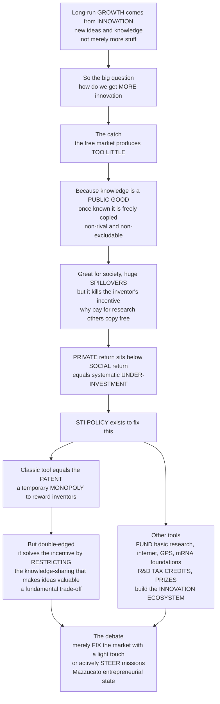

# 💡 Science, Technology, and Innovation Policy

> [!abstract] TL;DR
> Almost the entire reason we are vastly richer than our ancestors is not that we work harder or hoard more stuff, but that we **innovate** — new ideas, technologies, and knowledge drive nearly all long-run economic growth (this is the message of endogenous [[Endogenous_Growth_Theory|growth theory]]). So a defining question for any society is: *how do you get more innovation?* And here is the catch that makes it a **policy** problem — the free market, left alone, will systematically produce **too little** of it. Why? Because knowledge is a strange good: it is a **public good** (see [[Public_Goods]]) — once you invent something and it is known, others can copy and use it freely (it is **non-rival** and largely **non-excludable**). Wonderful for society (ideas spread, generating huge positive **spillovers**), but ruinous for the inventor's incentive: why spend a fortune on risky research if rivals copy your success for free? The **private return** to invention falls far below its **social return**, so firms under-invest. **Science, Technology, and Innovation (STI) policy** exists to fix this market failure. The classic tool is the **patent** — a temporary government-granted **monopoly** (see [[Monopoly]]) that lets inventors profit, but a double-edged one: it fixes the incentive by *restricting* the very knowledge-sharing that makes ideas valuable. So governments also **fund basic research** (the internet, GPS, the foundations of mRNA vaccines all came from public money), offer **R&D tax credits**, award **prizes**, and cultivate whole **innovation ecosystems** (universities, skilled workers, venture capital, clusters like Silicon Valley). The live modern debate: should government merely *fix* the market with a light touch, or actively *steer* innovation toward missions — Mazzucato's **entrepreneurial state**?

---

## Intuition

**Analogy — the recipe nobody wants to be the first to write down.** Imagine a village of cooks. One cook spends a year of hard, uncertain experiments and finally discovers a spectacular new recipe. The moment she serves it, every other cook can taste it, reverse-engineer it, and cook it in their own kitchens — for free, forever, without diminishing her ability to cook it too. This is glorious for the *village*: one year of one person's effort now feeds everyone, for all time. But look at it from the *discoverer's* chair. She bore the whole cost and the whole risk, yet captures only a sliver of the benefit, because the recipe leaks the instant it exists. Knowing this in advance, why would any cook ever gamble a year on invention? Each waits for someone else to take the risk — and far too few recipes get written.

That village is the whole economy, and the recipe is **knowledge**. New ideas are the ultimate **non-rival** good — my using the Pythagorean theorem, the transistor design, or the mRNA platform takes nothing away from your using it — and once revealed they are hard to keep locked up (**non-excludable**), so their benefits **spill over** to everyone. That is exactly why knowledge is the engine of long-run **growth**: unlike land or machines, ideas can be used by everyone at once and never wear out. But the same properties that make ideas so valuable to society make them a lousy private investment, so the market delivers *too little* invention. **STI policy** is the set of tools a society uses to bribe, reward, and organize its cooks into writing more recipes — and to steer them toward the recipes that matter most. The oldest tool, the **patent**, is a deliberate bargain with the devil: the state hands the discoverer a temporary *monopoly* over her recipe so she has a reason to invent — accepting that, for a while, everyone else is *forbidden* from using the very idea we most want shared. Every other instrument in the kit is an attempt to buy more innovation while paying less of that price.

---

## How It Works

### Core mechanics

1. **Start from the growth fact.** Sustained rises in living standards come overwhelmingly from **total factor productivity** — better ideas and technology — not from piling up more capital or labor. Endogenous growth theory (Romer) models ideas as the input whose accumulation *is* growth, so the *rate and direction* of innovation is a first-order policy lever, not a footnote.
2. **Diagnose the market failure.** Knowledge is **non-rival** (infinite copies at near-zero marginal cost) and only **partially excludable**, so it behaves like a **public good** with large positive **spillovers**. The inventor captures only a fraction of the value she creates — the **appropriability** problem — so the **private return to R&D sits far below the social return**, and profit-seeking firms rationally **under-invest** (Arrow 1962; Nelson 1959).
3. **Note that basic research is worst-hit.** The further research sits from a marketable product — fundamental, curiosity-driven science — the harder it is to appropriate, the riskier, the longer the horizon, and the larger the spillovers. So **basic science is the most under-provided of all**, which is precisely why governments fund universities and national labs directly rather than waiting for firms.
4. **Reach for the classic fix — the patent.** A patent grants a *temporary legal monopoly* over an invention, raising the private return enough to justify the R&D. But it works by **restricting diffusion**: during the patent term the monopolist prices above marginal cost, creating a **static deadweight loss** and potentially blocking follow-on inventors. The design problem is to choose patent **length** and **breadth** that balance *dynamic* innovation gains against *static* access losses.
5. **Add complementary instruments, each with a different trade-off.** Because no single tool is ideal, governments layer several: **direct public funding** of research the market will not touch; **R&D tax credits and subsidies** that raise private returns without granting monopoly; **innovation prizes and advance market commitments** that reward outcomes while leaving the knowledge open; **procurement and demand-side** pull; and investment in the whole **innovation system** — human capital and STEM education, university tech transfer, venture capital, and geographic **clusters**.
6. **Argue about rate versus direction.** A **market-fixing** view says government should merely correct the failure and stay neutral about *what* gets invented. A **market-shaping**, **mission-oriented** view (Mazzucato's *entrepreneurial state*) argues the state has historically been the boldest, most patient, most transformative investor — funding the risky early bets behind the internet, GPS, touchscreens, and biotech — and should actively *steer* innovation toward grand challenges like decarbonization.

The linear model — *science → technology → product* in a tidy pipeline — has largely given way to the **systems-of-innovation** view: innovation emerges from a web of interacting actors and **institutions** (firms, universities, financiers, standards bodies, regulators) whose linkages, not any single lab, determine a nation's innovative capacity.

### Flow / Architecture



---

## Key Concepts

### Secondary

- **Innovation drives prosperity.** The reason we live far better than people a century ago is mostly *new ideas and technology* — electricity, antibiotics, computers, the internet — not that we simply own more things. Getting more innovation is one of the most important things a society can do.
- **Knowledge is easy to copy.** Once someone invents something and explains it, everyone else can use the idea for free, and one person using it does not stop others from using it too. That is wonderful for society but bad for the inventor, who paid all the costs.
- **The under-investment problem.** Because inventors cannot capture most of the value they create, businesses invent *less* than would be good for everyone. The free market alone gives us too little research.
- **The patent — a deal with a catch.** To give inventors a reason to invent, government grants a **patent**: a temporary right to be the only seller of the new idea. This rewards inventors — but for a while it also *stops* everyone else from freely using the very idea we want shared.
- **The government's toolkit.** Besides patents, governments **fund research directly** (universities and labs — this is where the internet and GPS came from), give **tax breaks** for company research, offer **prizes**, and build the surroundings that innovation needs — good schools, universities, and investors.

### Undergraduate

- **Private vs social return to R&D.** The **social** return to an innovation (value to everyone, including imitators and follow-on inventors) far exceeds the **private** return the inventor captures. Estimates commonly put social returns to R&D at two-to-four times private returns — the empirical signature of a spillover-driven market failure.
- **Knowledge as a public good.** Non-rivalry means the marginal cost of another user is essentially zero; partial non-excludability means the inventor cannot fully fence off the benefit. Together these make knowledge the textbook case of positive **externalities** (see [[Externalities_and_Pigouvian_Tax]]) and one of the canonical [[Market_Failures]].
- **The appropriability problem (Arrow).** Kenneth Arrow's 1962 "information paradox": information is costly to produce but nearly free to reproduce, cannot be sold efficiently (a buyer will not pay without seeing it, but once shown, has no reason to pay), and is risky and indivisible — so private markets systematically under-produce it.
- **The patent trade-off, formally.** A patent trades a *dynamic* gain (more innovation induced by higher expected profit) against a *static* loss (monopoly deadweight loss during the term, plus possible blocking of cumulative innovation). Optimal **length** and **breadth** balance these; too-strong patents create **thickets**, **hold-up**, and litigation that *slow* follow-on innovation.
- **The instrument menu and its trade-offs.** *Patents* reward without government picking winners but grant monopoly; *direct funding* reaches non-appropriable basic science but requires the state to allocate; *tax credits* boost private R&D broadly but are hard to target and can subsidize inframarginal spending; *prizes and advance market commitments* reward outcomes and keep knowledge open but require specifying the goal in advance.
- **The innovation system.** Innovative capacity is a *system* property: STEM **human capital**, research **universities** and their tech-transfer offices, **venture capital** and patient finance, geographic **clusters** and agglomeration (Silicon Valley, Boston biotech), technical **standards**, and mechanisms of **diffusion** and absorption. Weakness in any link throttles the whole.
- **Rate vs direction.** Policy can aim to raise the *amount* of innovation or to steer its *direction*. Innovation is not automatically welfare-improving (surveillance tech, pollution-intensive processes), so directing it toward social goals — health, climate, security — is itself a policy choice.

### Graduate

- **Endogenous growth microfoundations (Romer 1990).** Modeling ideas as non-rival, partially excludable inputs produced by a research sector yields growth that is *endogenous* to R&D incentives and inherently involves **imperfect competition** (monopoly rents fund research) and **increasing returns** (non-rivalry breaks the replication argument for constant returns). Policy that raises the research share raises the *growth rate*, not just the level — the theoretical case for STI policy at its strongest.
- **Optimal patent design (Nordhaus; Gilbert–Shapiro; Scotchmer).** Nordhaus's length–breadth frontier balances incentive against deadweight loss; Gilbert–Shapiro analyze the length-vs-breadth mix; Scotchmer's work on **cumulative innovation** shows that when today's invention is an input to tomorrow's, strong first-generation patents can *retard* aggregate progress, motivating research exemptions, licensing, and patent pools.
- **Nelson's economics of basic research (1959).** Basic research yields broad, unpredictable, hard-to-appropriate spillovers with long and uncertain horizons, so private incentives are weakest exactly where social value is highest — the rigorous case for *public* funding of fundamental science and for a division of labor between public basic and private applied R&D.
- **Mechanism comparison: patents vs prizes vs procurement (Wright; Kremer).** Prizes and **advance market commitments** (used for pneumococcal vaccines) reward the *outcome* and place the invention in the public domain, avoiding monopoly deadweight loss — but require the sponsor to specify and value the target ex ante, shifting the information burden. Patents decentralize that judgment to the market at the cost of monopoly pricing. The optimal instrument depends on how well the sponsor can define the goal.
- **National / regional systems of innovation (Freeman; Lundvall; Nelson).** Reject the linear pipeline: innovative performance is co-produced by interacting **institutions** (see the systems-of-innovation literature). This reframes policy from "fund more R&D" to "strengthen the linkages, absorptive capacity, and institutions of the system."
- **Mission-oriented innovation and the entrepreneurial state (Mazzucato).** The state as an *active, risk-taking, market-shaping* investor and mission-setter (Apollo, DARPA, the internet, foundational biotech) rather than a passive market-fixer — reviving **industrial policy**, but raising sharp questions about state capacity, capture, portfolio risk, and how to socialize *returns* as well as risks.
- **Emerging-technology governance and the Collingridge dilemma.** Regulating a young technology is a trap: *early*, when intervention is cheap, we know too little to regulate wisely; *late*, when we understand it, the technology is entrenched and change is costly. Combined with the **pacing problem** (technology outrunning law), **dual-use** risk, and **responsible research and innovation (RRI)**, this frames governance of AI, biotech, and nanotech — where **technology sovereignty** and the geopolitics of semiconductors and AI now dominate the agenda.

---

## Python Demo

```python
# Two core pictures of INNOVATION POLICY, with numpy + matplotlib.
#
#   (a) KNOWLEDGE SPILLOVERS => UNDER-INVESTMENT, and how a subsidy closes the gap.
#       Firms invest in R&D up to where the return they CAPTURE (private) equals
#       the marginal cost. But knowledge spills over: the SOCIAL return is larger
#       because imitators and follow-on inventors also benefit. The inventor
#       appropriates only a fraction theta of the social return, so the market
#       stops at R_market < R_social -- an UNDER-INVESTMENT gap. An R&D subsidy /
#       tax credit / patent that raises the PRIVATE return shifts the private
#       curve up until it meets marginal cost at the socially optimal R.
#
#   (b) THE PATENT TRADE-OFF: choosing the optimal patent LENGTH.
#       A longer patent term induces MORE innovation (dynamic benefit) but with
#       diminishing returns, while imposing MORE cumulative monopoly deadweight
#       loss (static cost) that grows with the term. Net social value is
#       benefit minus cost; it peaks at an INTERIOR optimal patent length T*.

import numpy as np
import matplotlib.pyplot as plt

fig, (ax1, ax2) = plt.subplots(1, 2, figsize=(13, 5.4))

# ----------------------------------------------------------------------
# (a) PRIVATE vs SOCIAL return to R&D  ->  under-investment gap
#     Social marginal return:  SMR(R) = a - b*R      (diminishing returns to R&D)
#     Private marginal return:  PMR(R) = theta*(a - b*R)   (inventor captures theta)
#     Marginal cost of R&D:      MC = c  (constant)
# ----------------------------------------------------------------------
a, b, theta, c = 100.0, 1.0, 0.5, 20.0
R = np.linspace(0, 100, 500)
SMR = a - b * R
PMR = theta * (a - b * R)

R_social = (a - c) / b                       # SMR = MC
R_market = (a - c / theta) / b               # PMR = MC
subsidy  = c - theta * (a - b * R_social)    # per-unit subsidy to reach R_social
PMR_sub  = theta * (a - b * R) + subsidy      # subsidized private return

ax1.plot(R, SMR, lw=2.2, color="green", label="Social marginal return")
ax1.plot(R, PMR, lw=2.2, color="crimson", label="Private marginal return (captures theta)")
ax1.plot(R, PMR_sub, lw=1.8, ls="--", color="darkorange",
         label="Private return WITH R&D subsidy")
ax1.axhline(c, color="black", ls=":", lw=1.4, label=f"Marginal cost = {c:.0f}")

for Rx, col, lab in [(R_market, "crimson", "Market R"),
                     (R_social, "green", "Optimal R")]:
    ax1.axvline(Rx, color=col, ls=":", lw=1.2)
    ax1.scatter([Rx], [c], color=col, s=45, zorder=5)
    ax1.annotate(f"{lab} = {Rx:.0f}", xy=(Rx, c), xytext=(Rx - 4, c + 12),
                 fontsize=8, color=col)

ax1.fill_betweenx([0, c], R_market, R_social, color="orange", alpha=0.18)
ax1.annotate("UNDER-INVESTMENT\ngap", xy=((R_market + R_social) / 2, c / 2),
             ha="center", fontsize=8, color="saddlebrown")
ax1.set_xlabel("R&D investment R")
ax1.set_ylabel("Marginal return / cost")
ax1.set_title("Spillovers: private return below social return => under-investment")
ax1.legend(fontsize=7.5, loc="upper right")
ax1.set_ylim(0, 105)
ax1.grid(alpha=0.3)

# ----------------------------------------------------------------------
# (b) OPTIMAL PATENT LENGTH: dynamic innovation gain vs static deadweight loss
#     Innovation benefit induced (saturating):  Bnf(T) = B * (1 - exp(-k*T))
#     Cumulative monopoly deadweight loss:       Cost(T) = d * T
#     Net social value:                          Net(T) = Bnf(T) - Cost(T)
#     Optimum:  dNet/dT = 0  ->  T* = (1/k) * ln( B*k / d )
# ----------------------------------------------------------------------
B, k, d = 100.0, 0.15, 3.0
T = np.linspace(0, 40, 500)
Bnf  = B * (1 - np.exp(-k * T))
Cost = d * T
Net  = Bnf - Cost
T_star = (1.0 / k) * np.log(B * k / d)
Net_star = B * (1 - np.exp(-k * T_star)) - d * T_star

ax2.plot(T, Bnf, lw=2.0, color="green", label="Dynamic benefit (innovation induced)")
ax2.plot(T, Cost, lw=2.0, color="crimson", label="Static cost (cumulative deadweight loss)")
ax2.plot(T, Net, lw=2.4, color="navy", label="Net social value")
ax2.axvline(T_star, color="navy", ls=":", lw=1.4)
ax2.scatter([T_star], [Net_star], color="navy", s=55, zorder=5)
ax2.annotate(f"Optimal patent length\nT* = {T_star:.1f} years",
             xy=(T_star, Net_star), xytext=(T_star + 2, Net_star + 8),
             fontsize=8, color="navy",
             arrowprops=dict(arrowstyle="->", color="navy"))
ax2.axhline(0, color="gray", lw=0.8)
ax2.set_xlabel("Patent length T (years)")
ax2.set_ylabel("Social value")
ax2.set_title("Patent trade-off: balancing innovation gains against monopoly loss")
ax2.legend(fontsize=7.5, loc="lower right")
ax2.grid(alpha=0.3)

plt.tight_layout()
plt.show()

print("(a) Spillovers and under-investment:")
print(f"    Market R&D  (private return = MC): R = {R_market:.0f}")
print(f"    Optimal R&D (social return = MC):  R = {R_social:.0f}")
print(f"    Under-investment gap = {R_social - R_market:.0f} units of R&D;")
print(f"    a per-unit R&D subsidy of {subsidy:.0f} raises private return to close it.")
print("(b) Patent trade-off:")
print(f"    Optimal patent length T* = {T_star:.1f} years, net social value = {Net_star:.1f};")
print("    longer than T* the extra monopoly deadweight loss outweighs the extra innovation.")
```

The **left panel** is the market failure made quantitative. The green **social** marginal-return curve lies above the red **private** curve everywhere, because the inventor captures only a fraction `theta = 0.5` of the value her research creates — the rest spills over. Each curve meets marginal cost at a different point: the profit-seeking firm stops at `R = 60`, but the socially optimal level is `R = 80`, and the shaded wedge between them is the **under-investment gap** that spillovers open. An **R&D subsidy or tax credit** of `20` per unit lifts the private curve (dashed) up to the social one, so the firm now invests exactly the optimal amount — the same logic by which a patent, prize, or grant closes the gap. The **right panel** is the **patent trade-off**. A longer patent term induces more innovation (green, but with *diminishing* returns as it saturates) while piling up more cumulative monopoly deadweight loss (red, growing with the term). Their difference, net social value (navy), rises then falls, peaking at an **interior optimal patent length** `T* ≈ 10.7 years`: protection strong enough to spur invention, but not so long that the static costs of monopoly swamp the dynamic gains. That single hump is the entire economics of "how strong should intellectual property be."

---

## Real-World Applications

- **The publicly funded technologies you use every day.** The **internet** (ARPANET, funded by DARPA), **GPS** (a US military program opened to civilians), the **web** (CERN, a publicly funded lab), the **touchscreen and voice assistant** components, and the foundational **mRNA** and monoclonal-antibody science behind modern vaccines all trace to government or university research the market would not have funded — the empirical backbone of Mazzucato's *entrepreneurial state* argument.
- **DARPA and mission-oriented R&D.** The US Defense Advanced Research Projects Agency's high-risk, program-manager-driven model — small, autonomous, tolerant of failure, chasing hard missions — is the template now copied worldwide (ARPA-E, the UK's ARIA) as a way for the state to fund transformative rather than incremental research.
- **The pharmaceutical patent bargain and its limits.** Drug patents are the clearest live instance of the patent trade-off: they finance enormously expensive, risky trials, but the resulting monopoly pricing collides with access — visible in HIV/AIDS medicine access battles, biosimilar delays, and **patent thickets** that extend exclusivity ("evergreening"). Compulsory licensing and the TRIPS framework are society renegotiating the length–breadth terms.
- **Advance market commitments for vaccines.** The pneumococcal AMC (Kremer's mechanism) and COVAX-era commitments show **prizes/AMCs** in action: donors promise to buy a defined product at a set price, rewarding the *outcome* and keeping supply open, instead of granting monopoly — the prizes-vs-patents choice made real.
- **R&D tax credits and innovation clusters.** Most advanced economies subsidize private research through **R&D tax credits**, while place-based policy tries to grow **clusters** — Silicon Valley, Cambridge/Boston biotech, Shenzhen hardware, Bangalore software — by co-locating universities, venture capital, and skilled workers, the systems-of-innovation view operationalized.
- **The semiconductor and AI industrial-policy revival.** The US **CHIPS and Science Act**, the EU Chips Act, and comparable programs mark the return of overt **industrial policy** and **technology sovereignty**, steering innovation for economic security in a geopolitical race — mission-oriented STI policy at national scale, with all its promise and capture risk.

---

## Common Pitfalls

- **Treating R&D spending as the goal instead of the outcome.** More R&D dollars are an *input*, not innovation itself. Poorly directed, uncoordinated, or duplicative spending can raise the number while barely moving productivity; the systems-of-innovation lesson is that linkages and absorptive capacity matter as much as the budget.
- **Assuming stronger patents always mean more innovation.** The patent trade-off is a *hump*, not a ramp. Beyond the optimum, longer or broader patents create thickets, hold-up, and litigation that *block* cumulative innovation — especially where today's invention is an input to tomorrow's. "More IP protection" is not a free good.
- **Ignoring the difference between private and social returns.** Debates that judge public research by whether *it* turned a profit miss the point: the justification for public funding is precisely that the returns are *social* and non-appropriable. Basic science looks like a bad private investment because it is a *public* one.
- **Confusing invention with diffusion.** An idea creates value only when it is *adopted* and *diffused* (see [[Diffusion_of_Innovations_and_Adoption_Dynamics]]). Policy that funds discovery but neglects skills, standards, adoption incentives, and complementary infrastructure leaves the gains stranded in the lab.
- **Believing the state can only fix, never shape.** The market-failure framing quietly assumes government should stay directionally neutral. But every funding choice *is* a direction; refusing to steer is itself a direction. The honest debate is not fix-vs-shape but *how* to steer with accountability, not *whether*.
- **Forgetting government failure and capture.** Industrial policy and mission-setting can be captured by incumbents, misallocate through political rather than technical logic, and pick losers as well as winners. Diagnosing a market failure is necessary but not sufficient to justify a *particular* program — the honest comparison is an imperfect market against an imperfect state.
- **Regulating emerging tech at the wrong moment.** The Collingridge dilemma warns that acting too early risks strangling a technology we do not yet understand, while acting too late faces entrenched interests. Rigid, premature rules and paralytic delay are both failure modes; adaptive, staged governance is the aim.

---

## Related Concepts

Cross-vault anchors (Glob-verified files elsewhere in the vault; this note is the **public-policy** view of innovation — distinct basename, linked deliberately):

- [[Endogenous_Growth_Theory]] — the macroeconomic theory (Romer) that ideas are non-rival inputs whose accumulation *is* long-run growth; the intellectual foundation for treating innovation as a first-order policy target.
- [[Technological_Progress]] — the growth-accounting recognition that productivity gains, not capital deepening, dominate long-run living standards; STI policy is the attempt to raise this residual.
- [[Public_Goods]] — the microeconomics of non-rival, non-excludable goods; knowledge is the archetypal public good, which is *why* markets under-provide it.
- [[Externalities_and_Pigouvian_Tax]] — knowledge spillovers are a positive externality; R&D subsidies and tax credits are the Pigouvian remedy that raises private return toward social return.
- [[Market_Failures]] — the umbrella diagnosis; innovation under-investment is a canonical failure combining public-good and externality features with risk and indivisibility.
- [[Monopoly]] — the deadweight-loss economics behind the *cost* side of the patent trade-off; a patent deliberately creates a temporary monopoly to buy innovation.
- [[Intellectual_Property_Law]] — the legal machinery of patents, copyright, and trade secrets that this note analyzes through an economic and policy lens.
- [[Diffusion_of_Innovations_and_Adoption_Dynamics]] — how inventions actually spread and get adopted; the reminder that invention without diffusion yields no social value.

Within this vault, this note sits in the *Policy Domains and Frontiers* section beside prose-referenced siblings (some to be built): *Rationales_for_Government_Intervention* (the disciplined "why" — public goods and externalities — that justifies STI policy in the first place); *Public_Goods_and_Collective_Provision* (the collective-provision counterpart, since basic knowledge is a public good the state must fund); *Regulation_and_Regulatory_Economics* (the governance of emerging technologies and the capture risks that shadow industrial policy); *Environmental_and_Climate_Policy* (mission-oriented innovation aimed at decarbonization); and *The_Reach_and_Future_of_Public_Policy* (where the geopolitics of technology and the governance of AI and biotech point next).

---

## Review Questions

1. **(Secondary)** A scientist spends years and a fortune discovering a new idea; the moment she publishes it, anyone can copy and use it for free without diminishing her own use. Using the words *public good* and *spillover*, explain why this is wonderful for society but discourages inventing — and name two different tools a government could use to encourage more invention.
2. **(Undergraduate)** Explain why the *private* return to R&D lies below the *social* return, and show with a diagram how this produces under-investment. Then explain the fundamental trade-off in patents: what does society gain by granting a temporary monopoly, and what does it lose? Why might a prize or an advance market commitment be preferable for some goals?
3. **(Graduate)** "Government should fix the innovation market, not steer it." State the market-failure case for STI policy rigorously (appropriability, non-rivalry, basic-research under-provision), then set it against Mazzucato's *entrepreneurial state* and mission-oriented view. Which failures does each framing address, what government-failure and capture risks does the market-shaping approach add, and how would you design a program to capture the benefits of direction while disciplining its risks?

---

## Sources

- Kenneth J. Arrow, "Economic Welfare and the Allocation of Resources for Invention," in *The Rate and Direction of Inventive Activity* (Princeton University Press / NBER, 1962) — the foundational statement of the appropriability problem and the under-production of knowledge.
- Richard R. Nelson, "The Simple Economics of Basic Scientific Research," *Journal of Political Economy* 67(3), 1959 — why private markets especially under-provide fundamental research, the case for public funding.
- Paul M. Romer, "Endogenous Technological Change," *Journal of Political Economy* 98(5, Part 2), 1990 — ideas as non-rival inputs and the endogenous-growth microfoundation for innovation policy.
- Mariana Mazzucato, *The Entrepreneurial State: Debunking Public vs. Private Sector Myths* (Anthem Press, 2013) — the market-shaping, mission-oriented case for the state as an active, risk-taking investor.
- William D. Nordhaus, *Invention, Growth, and Welfare: A Theoretical Treatment of Technological Change* (MIT Press, 1969) — the classic analysis of optimal patent length and the innovation-vs-deadweight-loss trade-off.

---

#public-policy #innovation-policy #patents #public-funding-of-research #entrepreneurial-state
