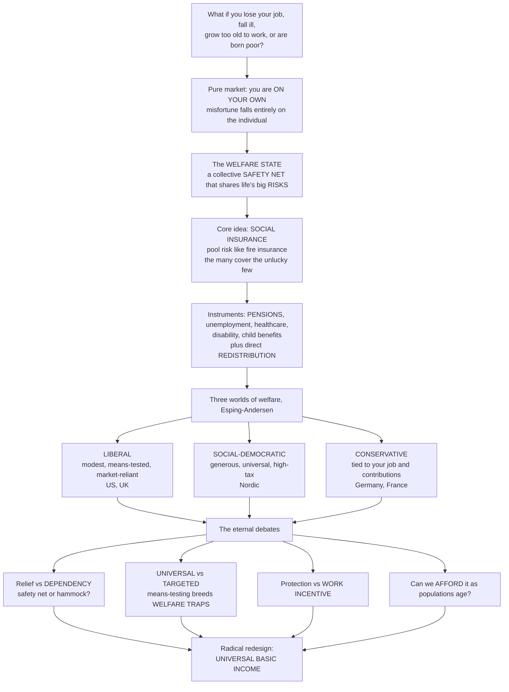

# 🛡️ Social Policy and the Welfare State

> [!abstract] TL;DR
> What happens to you if you lose your job, fall too sick to work, grow too old to earn, or are born into poverty? In a **pure market** the answer is grim — you are on your own. The **welfare state** is the modern answer societies developed: a collective system in which government provides a **safety net** and shares the big **risks** of life. Its core mechanism is beautifully simple — **social insurance**: just as you pool risk with strangers to buy fire insurance (most houses don't burn, so the many cover the unlucky few), the welfare state pools the risks of unemployment, sickness, disability, and old age across the whole society — everyone pays in via taxes and everyone is protected when misfortune strikes — complemented by direct **redistribution** to relieve poverty. Countries built strikingly different welfare states — Esping-Andersen's famous **three worlds**: the **liberal** model (US, UK — modest, means-tested, market-oriented), the **social-democratic** model (Scandinavia — generous, universal, high-tax), and the **conservative/corporatist** model (Germany, France — benefits tied to your job). The debates are fierce: does welfare relieve poverty or breed **dependency** (a net or a hammock)? Should benefits be **universal** or **targeted** at the cost of **welfare traps** that punish extra work? How do you balance security against work incentives, and can aging societies even **afford** their promises — or should they embrace a radical redesign like **universal basic income**? Understanding social policy is understanding how societies decide to care for their members and share the fundamental risks of being human. *(This is the policy-design view; it complements the comparative-politics treatment in [[Welfare_States_and_Social_Policy]].)*

---

## Intuition

**Analogy — pooling the risks of being human, the way you pool the risk of a house fire.** Nobody knows in advance whose house will burn down, so a community of homeowners each pays a small premium into a common pot; the vast majority never claim, and their contributions cover the catastrophic loss of the unlucky few. That is **insurance**, and it works because it converts a *ruinous individual risk* into a *manageable shared cost*. Now widen the lens from house fires to the hazards of a human life: losing your job in a recession, being diagnosed with a costly illness, being injured and unable to work, growing too old to earn, or simply being born into a poor family. In a pure market, each of these falls entirely on the individual — you are on your own. The **welfare state** is the collective answer: it treats unemployment, sickness, disability, and old age as *shared social risks* and pools them across the whole population. Everyone pays in through taxes and contributions; everyone is protected when misfortune strikes. Pensions, unemployment benefits, public healthcare, disability support, and child benefits are all this same fire-insurance logic applied to the life course — plus a dose of straight **redistribution** to lift people out of poverty.

Run that single idea forward and the great arguments of modern politics come into view. Different societies drew the boundaries very differently — some help only the demonstrably poor (means-testing), others give the same benefit to everyone (universalism, like public schools). Each choice has a shadow. Means-testing looks efficient but is stigmatizing and can spring a cruel **welfare trap**: if every extra dollar you earn is clawed back almost dollar-for-dollar in lost benefits, you are effectively *punished for working*. Universalism is simple and dignified but expensive, and critics ask whether a generous safety net quietly becomes a **hammock** that saps the will to work. Layer on an **aging population** — fewer workers supporting more pensioners — and the question becomes whether we can afford the promises we have made at all. These are not abstractions; they decide whether a laid-off parent keeps their home, whether a sick worker goes bankrupt, whether an old person retires in dignity. Social policy is where a society makes those decisions concrete.

---

## How It Works

### Core Mechanics

1. **The problem — social risks the market handles badly.** A well-functioning market cannot insure many life-course risks on its own. Private unemployment insurance barely exists (the risk is correlated — everyone loses their job in the same recession — and riddled with **adverse selection**, where only the high-risk buy in and the pool collapses). Health and old-age risks are similarly hard to price and easy to be shut out of. Add **poverty relief** (a floor no one should fall below), **merit goods** (education, health that society wants everyone to have), and plain **redistribution** (reducing inequality), and you have the classical rationale for the welfare state.

2. **Social citizenship — the founding idea.** T.H. Marshall framed the welfare state as the third stage of citizenship: after **civil** rights (rule of law) and **political** rights (the vote) come **social** rights — a guaranteed minimum of economic security and welfare as a *right of membership* in society, not charity. This is the moral spine of universal provision.

3. **The historical rise.** Two blueprints dominate. **Bismarck** (1880s Germany) built the first modern **social insurance** — contributory, work-based schemes for sickness, accident, and old age. **Beveridge** (1942 Britain) proposed a comprehensive, more universal system to slay the **"five giants"** — Want, Disease, Ignorance, Squalor, and Idleness — launching the post-war expansion of pensions, national health services, and universal benefits across the West.

4. **The core instruments.** The welfare state deploys three main tools. **(a) Social insurance** — contributory, **risk-pooling** programs against life-course risks: old-age **pensions**, unemployment insurance, health insurance, disability, and work-injury cover. **(b) Social assistance** — **means-tested**, tax-funded benefits targeted at the poor (a residual net for those who fall through). **(c) Universal / categorical benefits** — paid to everyone in a category regardless of income (child benefits, universal healthcare and education). Cross-cutting choices: **cash vs in-kind** transfers, and the whole **tax-and-transfer system** as the engine of redistribution.

5. **The three worlds of welfare (Esping-Andersen).** Welfare states cluster into three **regimes**. The **liberal** regime (US, UK, Anglo world) is *residual* — modest, means-tested, market-reliant, keeping benefits low to preserve work incentives. The **social-democratic** regime (Nordic) is *universal and generous*, aiming to **de-commodify** welfare (make your living standard independent of the market) and funded by high taxes. The **conservative / corporatist** regime (Germany, France, continental Europe) is *status-preserving* — benefits tied to your job and contributions, channeled through occupational schemes and the family. The key analytical yardsticks are **de-commodification** (how far benefits free you from market dependence) and **stratification** (how the system reshapes class and status).

6. **The central trade-off — universalism vs targeting.** Targeting (means-testing) concentrates scarce money on the poorest and looks efficient — but it stigmatizes, suffers low **take-up** (eligible people don't claim), is costly to administer, and springs the **welfare trap**. Universalism is simple, dignified, and politically durable (the middle class defends programs it benefits from) but expensive. Korpi & Palme's **"paradox of redistribution"** is the counter-intuitive punchline: universal programs often redistribute *more* than tightly targeted ones, because they command broad political support and larger budgets — the tightly targeted program "for the poor" tends to become a poor program.

7. **The welfare trap — the hidden tax on work.** When means-tested benefits are **withdrawn** as earnings rise, the combined loss of benefits plus income tax produces a punishing **effective marginal tax rate (EMTR)**. If earning an extra dollar costs you ninety cents of lost benefit plus twenty cents of tax, your EMTR is 110 percent — you are *poorer* for working more. This is the efficiency-equity tension made concrete, and the strongest design argument for smoother phase-outs, **negative income tax**, or **UBI**.

8. **Fiscal sustainability and reform frontiers.** **Aging populations** strain pay-as-you-go pensions and health budgets (fewer workers per retiree), driving debates over **funded vs PAYG** financing, retrenchment, and **"new social risks"** (single parenthood, precarious gig work, care needs) that the old male-breadwinner model never anticipated. The frontier ideas: **universal basic income** (an unconditional grant for all), **conditional cash transfers** (the developing-world success stories), and **social investment** (early-childhood, activation, human capital) — reimagining the welfare state for an age of automation and inequality.

### Flow / Architecture



---

## Key Concepts

### Secondary (intuitive foundations)

- **The basic problem.** In a pure market, losing your job, getting sick, growing old, or being born poor leaves you to cope alone. The welfare state is society's collective answer.
- **Social insurance = risk pooling.** Everyone pays a little (through taxes); the unlucky few who suffer misfortune are covered. Exactly like fire or car insurance, but for the hazards of a whole life — unemployment, illness, disability, old age.
- **Safety net vs redistribution.** Two jobs in one: *insure* everyone against risk (pensions, unemployment cover) **and** *redistribute* from rich to poor to reduce poverty and inequality.
- **Universal vs targeted.** Give a benefit to *everyone* (like public schools — simple and dignified but costly), or only to *the poor* (efficient but stigmatizing, and it can trap people).
- **The welfare trap, in plain terms.** If earning an extra dollar makes you lose almost a dollar of benefits, why bother working more? Badly designed means-testing can *punish* work.
- **Three kinds of welfare state.** Modest and market-oriented (US/UK), generous and universal (Scandinavia), or tied to your job (Germany/France).

### Undergraduate (formal social policy)

- **Social citizenship (Marshall).** Social rights as the third pillar of citizenship after civil and political rights: a guaranteed minimum of welfare as a *right of membership*, the normative basis for universalism.
- **Origins — Bismarck and Beveridge.** Bismarck's contributory, work-based social insurance (1880s) vs Beveridge's comprehensive, more universal blueprint against the **five giants** (1942) — the two archetypes underlying continental and Anglo welfare states.
- **Rationales.** Insurance-market failure (correlated risk, **adverse selection**), merit goods, poverty relief, redistribution/equity, life-course risk-sharing, and macroeconomic stabilization (welfare spending as an **automatic stabilizer**).
- **Instruments taxonomy.** Social insurance (contributory) vs social assistance (means-tested) vs universal/categorical benefits; cash vs in-kind; the tax-and-transfer system as the redistribution engine.
- **Esping-Andersen's three worlds.** Liberal (residual, means-tested), social-democratic (universal, **de-commodifying**, high-tax), conservative/corporatist (status-preserving, contribution-based, **familialist**); analyzed via **de-commodification** and **stratification** scores.
- **The paradox of redistribution (Korpi & Palme).** Universal, encompassing programs often redistribute *more* than narrowly targeted ones, because broad benefits build the political coalitions that sustain large budgets — "the more we target benefits at the poor, the less we reduce poverty."
- **Welfare trap and EMTR.** The **effective marginal tax rate** combines benefit withdrawal (taper) and income tax; steep tapers can drive EMTRs toward or above 100 percent, destroying the incentive to earn more — the efficiency-equity tension in one number.

### Graduate (synthesis and frontier)

- **Regime critiques and variants.** Feminist critiques of the **male-breadwinner / familialist** bias (unpaid care, **de-familialization**); the distinct **Southern European**, **East Asian productivist**, and **developing-world** welfare configurations that the three-worlds typology under-captures.
- **New social risks and social investment.** Post-industrial risks — single parenthood, precarious/gig work, skill obsolescence, long-term care — reframe policy from *compensating* risk to **investing** in human capital (early-childhood education, active labor-market policy, **activation**), the "social investment state."
- **Financing and demographic sustainability.** **PAYG vs funded** pensions, the old-age dependency ratio, health-cost pressure, and the political economy of **retrenchment** (Pierson: welfare states are resilient because beneficiaries are concentrated and defend their programs).
- **Deservingness, conditionality, and activation.** **Workfare**, benefit sanctions, and conditionality trade moral-hazard control against coverage and dignity; the deservingness heuristic shapes which groups get generous vs stigmatized treatment.
- **UBI, NIT, and CCTs.** **Universal basic income** (unconditional, universal grant) and the equivalent **negative income tax** promise to abolish the welfare trap, simplify administration, and "automation-proof" livelihoods — against objections on cost, work incentives, and mixed pilot evidence; **conditional cash transfers** are the demonstrated developing-world innovation.
- **Moral hazard vs protection; adequacy vs affordability.** The perennial optimization: enough security to protect people without so much as to blunt effort, at a cost aging societies can bear — the frontier where every welfare-state reform is fought.

---

## Python Demo

```python
# Social Policy and the Welfare State -- the two central mechanics, in three pictures.
#
# (a) SOCIAL INSURANCE / RISK POOLING: many people each face a small chance of a large
#     loss (job loss / serious illness). WITHOUT insurance the unlucky few are
#     devastated; WITH social insurance everyone pays a small premium (a tax) and the
#     pool reimburses the losers. For RISK-AVERSE people (concave utility) the variance
#     reduction is worth more than the modest admin cost -- pooling raises welfare.
#
# (b/c) THE WELFARE TRAP vs UBI: with a means-tested benefit that is WITHDRAWN as
#     earnings rise, the effective marginal tax rate (benefit taper + income tax) can
#     exceed 100 percent -- earning more leaves you WORSE off. A universal basic income
#     (or negative income tax) gives a flat floor plus a gentle flat tax, so working
#     always pays. This is the targeting-vs-incentive trade-off, made visible.
#
# Pure numpy + matplotlib.

import numpy as np
import matplotlib.pyplot as plt

rng = np.random.default_rng(7)
fig, (ax1, ax2, ax3) = plt.subplots(1, 3, figsize=(17, 5))

# ---------------------------------------------------------------------------
# (a) Social insurance = risk pooling
# ---------------------------------------------------------------------------
N     = 200_000
w     = 30_000.0     # baseline income
L     = 20_000.0     # size of the loss (job loss / illness)
p     = 0.15         # probability of the loss in a year
load  = 0.10         # 10% administrative loading on the fair premium
premium = p * L * (1 + load)               # everyone pays this tax/premium

shock            = rng.random(N) < p
income_uninsured = np.where(shock, w - L, w)          # bimodal: fine, or devastated
income_insured   = np.full(N, w - premium)            # loss reimbursed -> everyone equal

# risk-averse welfare: log utility -> certainty equivalent = exp(mean(log(income)))
ce_uninsured = np.exp(np.mean(np.log(income_uninsured)))
ce_insured   = np.exp(np.mean(np.log(income_insured)))

bins = np.linspace(5_000, 32_000, 60)
ax1.hist(income_uninsured, bins=bins, color="firebrick", alpha=0.55,
         label="Uninsured: the unlucky few are devastated")
ax1.hist(income_insured, bins=bins, color="steelblue", alpha=0.80,
         label="Social insurance: everyone shares the risk")
ax1.axvline(ce_uninsured, color="firebrick", ls="--", lw=1.6)
ax1.axvline(ce_insured,   color="steelblue", ls="--", lw=1.6)
ax1.set_xlabel("Net income after misfortune, US dollars")
ax1.set_ylabel("Number of people")
ax1.set_title("(a) Social insurance = risk pooling\ncatastrophe becomes a small shared cost")
ax1.legend(loc="upper left", fontsize=7.5)
ax1.text(0.03, 0.55,
         f"Risk-averse certainty equivalent\n"
         f"Uninsured: ${ce_uninsured:,.0f}\n"
         f"Insured:   ${ce_insured:,.0f}\n"
         f"Pooling wins by ${ce_insured - ce_uninsured:,.0f}",
         transform=ax1.transAxes, fontsize=8,
         bbox=dict(boxstyle="round", fc="lightyellow", ec="gray"))

# ---------------------------------------------------------------------------
# (b) Net income vs gross earnings: means-tested benefit vs UBI
# ---------------------------------------------------------------------------
gross  = np.linspace(0, 40_000, 400)
G      = 12_000.0    # income guarantee / basic-income floor
taper  = 0.90        # means-tested benefit withdrawn 90 cents per dollar earned
allow  = 10_000.0    # income-tax personal allowance
t_inc  = 0.20        # income-tax rate above the allowance

benefit         = np.maximum(0.0, G - taper * gross)
tax             = t_inc * np.maximum(0.0, gross - allow)
net_meanstested = gross - tax + benefit

tau     = 0.35       # flat tax that funds a universal basic income
net_ubi = G + gross * (1 - tau)

ax2.plot(gross, net_meanstested, color="firebrick", lw=2.4,
         label="Means-tested benefit (steep taper)")
ax2.plot(gross, net_ubi, color="steelblue", lw=2.4,
         label="Universal basic income / NIT")
ax2.plot(gross, gross, color="gray", ls=":", lw=1.2, label="No benefit (net = gross)")
trap = (gross > allow) & (benefit > 0)                 # the region where net income falls
ax2.fill_between(gross, 0, net_meanstested, where=trap, color="firebrick", alpha=0.15)
ax2.set_xlabel("Gross earnings, US dollars")
ax2.set_ylabel("Net income (earnings - tax + benefit)")
ax2.set_title("(b) The welfare trap vs UBI\nmeans-testing can punish extra work")
ax2.legend(loc="upper left", fontsize=8)

# ---------------------------------------------------------------------------
# (c) Effective marginal tax rate (the hidden tax on working)
# ---------------------------------------------------------------------------
emtr_meanstested = 1 - np.gradient(net_meanstested, gross)
emtr_ubi         = np.full_like(gross, tau)
ax3.plot(gross, 100 * emtr_meanstested, color="firebrick", lw=2.4, label="Means-tested")
ax3.plot(gross, 100 * emtr_ubi, color="steelblue", lw=2.4, label="UBI / NIT")
ax3.axhline(100, color="black", ls="--", lw=1.3,
            label="100%: keep none of an extra dollar")
ax3.set_xlabel("Gross earnings, US dollars")
ax3.set_ylabel("Effective marginal tax rate, %")
ax3.set_title("(c) Effective marginal tax rate\nthe hidden tax on the poor who work")
ax3.legend(loc="upper right", fontsize=8)

plt.tight_layout()
plt.savefig("social_policy_and_the_welfare_state.png", dpi=120)
plt.show()

print("(a) Social insurance / risk pooling:")
print(f"    Uninsured certainty equivalent: ${ce_uninsured:,.0f}")
print(f"    Insured   certainty equivalent: ${ce_insured:,.0f}")
print(f"    Risk-averse people prefer pooling even though it costs "
      f"${p*L*load:,.0f} in admin load.")
peak_emtr = 100 * emtr_meanstested[trap].max()
print("(b/c) The welfare trap:")
print(f"    Peak effective marginal tax rate under means-testing: {peak_emtr:.0f}%")
print("    Above 100% means earning more leaves you WORSE off -- the trap.")
```

**What it shows.** Panel **(a)** is the elegant core of the welfare state. Without social insurance, incomes are **bimodal** — most people fine at `$30,000`, the unlucky 15 percent devastated at `$10,000`. With social insurance everyone pays a small premium and lands at the same secure `$26,700`. Crucially, even though the pool skims a `$300` administrative load off the average, the **risk-averse certainty equivalent** is *higher* under insurance: the value of eliminating the catastrophic downside outweighs the cost. That gap is exactly why societies collectivize these risks. Panels **(b)** and **(c)** expose the design failure that haunts targeting: under a means-tested benefit with a steep taper, net income goes *flat and even falls* as a low earner works more — the shaded **welfare trap** — because the **effective marginal tax rate** climbs past 100 percent (benefit withdrawal plus income tax). A **universal basic income** (or its mirror image, a negative income tax) keeps the same income floor but replaces the steep taper with a gentle flat tax, so the EMTR stays modest and working *always* pays. The picture makes the trade-off unmissable: tight targeting concentrates money on the poor but can hammer their incentive to escape poverty.

---

## Real-World Applications

> **The Nordic social-democratic model (Sweden, Denmark).** Universal pensions, tax-funded healthcare, generous parental leave, subsidized childcare, and active labor-market "flexicurity" — high taxes buy near-comprehensive **de-commodification**. The living illustration of Esping-Andersen's social-democratic regime and of Korpi & Palme's paradox: broad universalism sustains the large budgets that actually cut poverty and inequality.

> **The US liberal / means-tested model.** A residual patchwork — Social Security (contributory pensions) and Medicare (universal for the old) sit atop tightly means-tested programs (SNAP, Medicaid, TANF) and the work-conditioned **EITC**. The 1996 welfare reform ("end welfare as we know it") added time limits and work requirements — the deservingness/activation turn in action, and a textbook liberal regime.

> **Bismarckian social insurance (Germany).** Occupational, contribution-based insurance for pensions, health, unemployment, and long-term care, administered through employer-employee funds — status-preserving and work-linked. The 2000s **Hartz reforms** recalibrated its unemployment system toward activation, showing conservative regimes adapting under fiscal and labor-market pressure.

> **Conditional cash transfers (Bolsa Família, Progresa/Oportunidades).** The developing-world breakthrough: cash to poor families *conditional* on keeping children in school and attending health checkups. Mexico's Progresa was rolled out with a randomized design, so its effects on schooling, nutrition, and poverty were rigorously measured — a landmark in evidence-based social policy that spread across dozens of countries.

> **UBI pilots (Finland 2017-18, GiveDirectly Kenya, Stockton SEED).** Experiments testing whether an unconditional cash floor improves wellbeing without collapsing work effort. Results so far show gains in wellbeing and financial stability with little or no drop in employment — feeding the live debate over basic income as a structural redesign for an age of automation.

---

## Common Pitfalls

- **Confusing "the welfare state" with "welfare" (means-tested handouts).** The bulk of welfare-state spending in rich countries is **social insurance for the middle class** — pensions and healthcare — not poverty relief for a stigmatized minority. Treating the whole edifice as "handouts to the poor" misreads what it is and whom it serves.
- **Assuming targeting is always more redistributive.** The intuitive "concentrate money on the poorest" logic collides with the **paradox of redistribution**: narrowly targeted programs command narrow political support and shrinking budgets, so they often reduce poverty *less* than universal ones. Efficiency-per-dollar is not the same as total redistribution.
- **Designing a means test without checking the EMTR.** Stacking benefit tapers, tax, and phase-outs can push **effective marginal tax rates** above 100 percent — the **welfare trap** — so recipients are punished for working. Always compute the combined withdrawal rate across *all* interacting programs, not one at a time.
- **Assuming generous benefits necessarily kill work incentives.** The "safety net becomes a hammock" claim is an empirical question, not an axiom. Evidence is mixed and context-dependent; UBI pilots and many benefit studies find modest or negligible employment effects. Beware both naive optimism and reflexive dependency-panic.
- **Quoting UBI's gross cost as its net cost.** "A basic income for everyone costs trillions" ignores that much of it is **clawed back through the tax system** from those who don't need it (a UBI plus flat tax is arithmetically close to a negative income tax). Judge redesigns on *net* fiscal cost and distributional effect.
- **Ignoring take-up and stigma.** Means-tested benefits are routinely **under-claimed** — the eligible don't apply because of complexity, stigma, or lack of information. A benefit that looks well-targeted on paper can miss the very people it was designed for. This is where behavioral design (defaults, auto-enrollment) matters.
- **Taking a static snapshot instead of a life-course view.** Cross-sectional data make it look like a fixed group of "recipients" lives off a fixed group of "taxpayers." Over a lifetime, **most people are both** — net contributors when working, net beneficiaries when young, sick, unemployed, or old. The welfare state largely redistributes across *your own life stages*, not just between people.

---

## Related Concepts

**Cross-vault links (Glob-verified):**

- [[Welfare_States_and_Social_Policy]] — the comparative-politics companion to this note: where this entry takes the **policy-design** view (instruments, incentives, welfare traps, reform), that one takes the political-science view of welfare-state *variation, power resources, and regime politics*. Read them together.
- [[Distributive_Justice_and_Inequality]] — the normative philosophy *beneath* redistribution: Rawls' difference principle, egalitarianism, and desert supply the moral arguments for how much the welfare state should equalize and why.
- [[Development_Economics]] — the developing-world arena of social policy, home to the **conditional cash transfer** revolution (Progresa, Bolsa Família) and the debate over cash vs in-kind and universal vs targeted at low income levels.
- [[Poverty_Social_Mobility_and_Life_Chances]] — the sociological account of the poverty, mobility, and life-chance outcomes the welfare state exists to improve; the *target* against which social policy is measured.
- [[Public_Choice_and_Political_Economy]] — the hard-nosed politics of the welfare state: deficit/aging-affordability pressures, the concentrated interests that defend programs, and why welfare states are so resilient to retrenchment.
- [[Behavioral_Public_Policy_and_Nudges]] — the behavioral toolkit for the take-up and welfare-trap problems: default enrollment, simplification, and framing that determine whether benefits actually reach people and whether work pays.
- [[Program_Evaluation_and_Causal_Inference]] — the methods that turned social policy into an evidence-based field: the randomized rollout of Progresa and the UBI pilots depend on exactly this causal machinery.
- [[Public_Goods_and_Collective_Provision]] — the economics of collective provision that underpins universal, tax-funded services (public health and education) as an alternative to individual market purchase.

**Within this vault (siblings, prose references):** as the S06 opener, this note draws the *market-failure and equity* rationales together from *Rationales_for_Government_Intervention*; the redistribution engine it describes is the tax-and-transfer system analyzed in *Taxation_and_Public_Finance*; its welfare-economics foundations (efficiency-equity, social welfare functions, the leaky bucket) are developed in *Public_Economics_and_Welfare*; healthcare — the single largest social-insurance program in most countries — is the subject of *Health_Policy_and_Systems*; and the automation-and-inequality frontier it gestures toward is revisited in *The_Reach_and_Future_of_Public_Policy*.

---

## Review Questions

1. **(Secondary)** Explain the welfare state to someone who has never heard the term, using the idea of insurance. Why is unemployment or old age a "risk" that a whole society might want to pool, and what does "pooling" actually mean here?
2. **(Secondary → Undergraduate)** A benefit for the poor is withdrawn by 90 cents for every extra dollar the recipient earns. Describe what happens to their take-home income as they work more hours, and explain why this is called a "welfare trap."
3. **(Undergraduate)** Name and characterize Esping-Andersen's three worlds of welfare capitalism, giving a country example of each and the analytical yardstick (de-commodification) that distinguishes them.
4. **(Undergraduate)** State the "paradox of redistribution" (Korpi & Palme). Why might a universal program that also pays benefits to the non-poor end up reducing poverty *more* than a program tightly targeted at the poor?
5. **(Graduate)** Design a reform that removes the welfare trap in Question 2 without either raising the income floor or blowing up the budget. Discuss the negative-income-tax / UBI approach, and state precisely what you trade off (marginal tax rates elsewhere, cost, incentives) to smooth the phase-out.
6. **(Graduate)** "An aging population means the welfare state is unaffordable and must be cut." Evaluate this claim using the distinction between PAYG and funded financing, the life-course view of who pays and who benefits, and the political-economy reasons (Pierson) welfare states resist retrenchment. Where is the claim strongest and where does it fail?

---

## Sources

- Gøsta Esping-Andersen, *The Three Worlds of Welfare Capitalism* (Princeton University Press, 1990).
- William Beveridge, *Social Insurance and Allied Services* (the Beveridge Report), Cmd. 6404 (HMSO, 1942).
- Walter Korpi & Joakim Palme, "The Paradox of Redistribution and Strategies of Equality: Welfare State Institutions, Inequality, and Poverty in the Western Countries," *American Sociological Review* 63(5), 1998, 661–687.
- Nicholas Barr, *The Economics of the Welfare State*, 5th ed. (Oxford University Press, 2012).
- T.H. Marshall, "Citizenship and Social Class," in *Citizenship and Social Class and Other Essays* (Cambridge University Press, 1950).

---

#public-policy #welfare-state #social-insurance #universal-vs-targeted #basic-income
