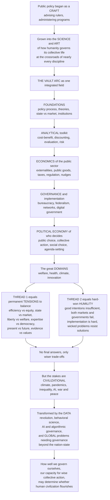

# 🏔️ The Reach and Future of Public Policy

> [!abstract] TL;DR
> This is the **capstone** of the Public Policy and Governance vault — the synthesis that reveals the field's full reach. Public policy began as a practical **craft** (advising rulers, administering programs) and has grown into the **science and art of how humanity governs its collective life** and confronts its shared problems, standing at the crossroads of nearly every discipline. The vault's arc — from **foundations** through the **analytical toolkit**, the **economics of the public sector**, the **machinery of governance**, the **political economy of who decides**, and the great **domains** where it all comes together — is unified by two great threads: a permanent set of **unresolvable tensions** (efficiency vs equity, state vs market, liberty vs collective welfare, expertise vs democracy, present vs future, evidence vs values) that policy must forever balance with *no final answers, only wiser trade-offs*; and a hard-won **humility** — good intentions are never enough, because markets fail but so do governments, well-designed policies fail in implementation, and "wicked" problems resist tidy solutions. Yet the stakes could not be higher: every civilizational challenge — climate, pandemics, inequality, AI, war and peace — is ultimately a **policy problem** of whether humanity can organize collective action wisely. The field is now being transformed by the **data revolution**, **behavioral science**, **AI and algorithmic governance**, and the rise of **global problems no nation can solve alone**. The culminating insight: *how well we govern ourselves — our capacity for wise collective action — may be the single most important determinant of whether human civilization flourishes.*

---

## Intuition

**Analogy — the view from the summit.** Every note in this vault was a step on a long climb. Down in the foothills we learned *what policy is* and *how it is made*; through the middle slopes we picked up the tools to *weigh costs and benefits* and *tell what works*; higher up we saw the *economics of the public sector*, the *machinery of governance*, and the *political economy of who really decides*; near the top we surveyed the great *domains* where it all comes together — welfare, health, climate, innovation. Now, standing at the summit, you can finally turn around and see the **whole terrain at once** — and, beyond it, the horizon. From here the individual paths resolve into a single landscape. That landscape is a field that began as a humble craft of advising rulers and administering programs and has grown into something far grander: **the science and art of how a species governs its collective life.**

Two features dominate the view. The first is a **permanent set of tensions** running like fault lines through every valley below — efficiency against equity, state against market, liberty against collective welfare, expertise against democracy, the present against the future, evidence against values. These are not bugs to be fixed but the very structure of the terrain; policy is the endless work of choosing *where on each fault line to stand*, and there is no summit that is best for everyone. The second is a bracing **humility**: from up here you can see all the places where good intentions ran onto the rocks — where markets failed but so did governments, where elegant policies died in implementation, where "wicked" problems refused to hold still. And yet the horizon is what matters most: every storm gathering out there — a warming climate, the next pandemic, widening inequality, thinking machines, the perennial question of war and peace — is, at bottom, a **question of whether we can organize collective action wisely**. The reach of public policy is nothing less than the reach of that question.

---

## How It Works

### The grand synthesis: one field in six movements

The vault is not six loosely related topics but **one integrated field**, best read as a single argument:

1. **Foundations (S01)** — *What policy is and why the state acts.* The policy process and cycle, theories of how policy changes, the deep state–market relationship, the rationales for intervention, and the institutions that authorize and constrain it. This movement poses the field's founding question: *when should collective action override or shape individual and market choices?*
2. **The analytical toolkit (S02)** — *How to reason about policy rigorously.* Policy analysis, cost–benefit analysis, discounting the future, program evaluation and causal inference, cost-effectiveness, and decision under risk and uncertainty. This is the field's claim to be a **social science**: alternatives compared against explicit criteria and evidence.
3. **The economics of the public sector (S03)** — *The economic logic of what the state should do.* Welfare economics, externalities, public goods, taxation and public finance, regulation, and behavioral policy. Here the abstract "market failure" rationale becomes concrete instruments — prices, rules, provision, and nudges.
4. **Governance and implementation (S04)** — *Where policy lives or dies.* Bureaucracy, implementation, federalism and multilevel governance, collaborative networks, public management, and digital government. A statute is only a promise; this movement is about **delivery**.
5. **Political economy of who decides (S05)** — *The hard-nosed reality of collective choice.* Public choice, collective action and interest groups, social choice and voting, agenda-setting and framing, commons governance, and accountability. Policy is not chosen by a benevolent planner but by **self-interested actors inside institutions**.
6. **The great domains (S06)** — *Where it all comes together.* Social policy and the welfare state, health, environmental and climate policy, innovation, and evidence-based policy. The domains are the field's **test cases**, each pulling on every tool from the previous five movements.

What binds these movements is a small set of **recurring concepts** that reappear in every section: the **state–market boundary**, the twin possibilities of **market failure and government failure**, the shaping power of **incentives and institutions**, the ever-present **collective-action problem**, and the unavoidable **policy trade-offs**. Master these five and you hold the whole field.

### Thread one: the enduring tensions

Running underneath the synthesis is a spine of **permanent, unresolvable trade-offs**. Policy cannot *solve* these; it can only choose, again and again, a defensible point along each axis:

- **Efficiency vs equity** — Okun's "leaky bucket": redistribution can raise fairness but may shrink the pie.
- **State vs market** — the founding tension, revisited in every domain.
- **Liberty vs collective welfare** — from seatbelts to lockdowns, coercion in the name of the common good.
- **Expertise / technocracy vs democracy / participation** — who should decide, the knowledgeable or the affected?
- **The present vs the future** — the discount rate made political; today's costs against tomorrow's benefits.
- **National vs global** — problems that spill across borders against tools that stop at them.
- **Evidence vs values** — analysis can tell us *what works*, never *what we should want*.

The lesson is not relativism but **maturity**: there are no final answers, only reasoned trade-offs and the democratic process of choosing among them.

### Thread two: the hard-won humility

The second thread is a set of recurring, sobering lessons:

- **Good intentions are insufficient** — the road to bad policy is paved with them.
- **Both markets and governments fail** — the correct comparison is *institution vs institution*, not real markets against an idealized state or vice versa.
- **Implementation is where policy lives or dies** — most failures are in delivery, not design.
- **Incentives and institutions shape everything** — get them wrong and even the "right" policy misfires.
- **Unintended consequences abound**, and **wicked problems resist solution** — climate, poverty, and inequality have no definitive formulation and no stopping rule.
- **Analysis informs but cannot replace politics and values** — and complex social systems impose hard **limits on prediction and control**.

### Flow / Architecture



---

## Key Concepts

### Secondary

- **The grand synthesis** — this whole vault is one field seen from six angles: what policy *is*, how to *analyze* it, its *economics*, how it is *governed and delivered*, *who* decides, and the *domains* where it plays out. They are chapters of a single story about governing our shared life.
- **The enduring tensions** — policy is a set of permanent trade-offs (fairness vs efficiency, government vs market, freedom vs the common good, now vs later). There is no "correct" answer that makes everyone happy — only choices, and the politics of making them.
- **The humility** — good intentions are not enough. Markets fail, but governments fail too; a great plan on paper can collapse in practice; and the biggest problems (climate, poverty) have no neat solution.
- **Policy as the master challenge** — almost every huge problem facing humanity — climate change, pandemics, inequality, the rise of AI, war and peace — is at heart a **policy problem**: can we cooperate and decide wisely, together?
- **Why it matters** — how well a society governs itself may be the single biggest factor in whether it thrives or falls apart.

### Undergraduate

- **The five unifying concepts** — the whole field rests on: (1) the **state–market boundary**; (2) **market failure and government failure** as twin possibilities; (3) **incentives and institutions** as the engines of behavior; (4) the **collective-action problem**; and (5) **trade-offs** as the inescapable form of every choice.
- **The seven tensions, spelled out** — efficiency/equity, state/market, liberty/welfare, expertise/democracy, present/future, national/global, evidence/values. Each recurs in every domain; a mature analyst names *which* tension a debate is really about.
- **Comparative institutions, not nirvana** — the amateur compares a flawed real institution to a perfect imagined one (real markets vs ideal government, or real government vs ideal markets). The professional compares **feasible alternative institutions**, each with its own failure modes.
- **Wicked problems** — Rittel and Webber's insight: many policy problems have no definitive formulation, no stopping rule, no true/false solution (only better/worse), and every attempt changes the problem. Climate and poverty are canonical.
- **The frontiers reshaping the field** — the **data and evidence revolution** (RCTs, big data, computational social science), **behavioral and design approaches** (nudges, choice architecture), **AI and algorithmic governance** (promise and peril), and the surge of **global problems** demanding governance beyond any single state.

### Graduate

- **The impossibility results and the primacy of politics** — Arrow's theorem (no aggregation rule satisfies all reasonable fairness conditions) and the Condorcet paradox mean there is *no* neutral, technocratic way to distill "the public interest" from individual preferences. Politics is therefore not a flaw in policymaking to be engineered away; it is **structurally unavoidable**. Analysis narrows the choice set; it cannot make the choice.
- **The two-sided failure literature** — welfare economics catalogs *market* failure (externalities, public goods, information asymmetries, market power); public choice and Wolf's "nonmarket failure" catalog *government* failure (rent-seeking, capture, bureaucratic drift, the disjunction of costs and benefits). Coase and Williamson reframe the question as **transaction-cost comparative institutional analysis**: which governance structure — market, hierarchy, hybrid, or commons (Ostrom) — best fits a given problem?
- **The global collective-action gap** — the defining structural deficit of the century. Climate, pandemics, AI safety, and financial stability are **global public goods and commons**, yet we have only national governments and weak international institutions. The mismatch between the scale of the problems and the scale of the governance is the missing capacity that makes these problems so intractable (multilevel and polycentric governance are partial responses).
- **Democratic innovation and crisis** — even as trust in traditional democracy erodes, a wave of **deliberative and participatory** experiments (citizens' assemblies, deliberative polling, participatory budgeting) tries to combine expertise with legitimacy, engaging the expertise-vs-democracy tension head-on. Whether these renew democratic governance or remain boutique experiments is an open question.
- **Anticipatory, mission-oriented, and systems-aware policymaking** — from reactive fire-fighting toward **foresight** (governing emerging technologies and existential risks *before* harms crystallize), Mazzucato-style **mission-oriented** direction of innovation, and **systems-aware** design that treats policy as intervening in a complex adaptive system rather than a machine.
- **Policy as science *and* art** — the deepest synthesis: public policy is simultaneously a **rigorous, evidence-hungry social science** and a **value-laden democratic art**. It draws on economics, politics, law, ethics, data science, and systems thinking; it is genuinely difficult; and its stakes are civilizational. The ultimate claim of the field is that **the quality of our collective decision-making is a first-order determinant of the human future.**

---

## Python Demo

```python
# THE REACH AND FUTURE OF PUBLIC POLICY -- a synthesis visualization.
#
#   (a) THE POLICY-SPACE / TENSIONS MAP.
#       Every real policy is a TRADE-OFF POINT located by the field's
#       permanent tensions. Two axes here:
#           x: reliance on the STATE   (0 = pure market ... 1 = pure state)
#           y: priority on EQUITY      (0 = pure efficiency ... 1 = pure equity)
#       Real policies scatter across the WHOLE space -- there is no
#       universally-best location, only positions chosen by politics + values.
#
#   (b) THE COLLECTIVE-ACTION STAKES.
#       A shared resource (a commons: fishery, aquifer, or the climate's
#       safe carbon budget) regrows logistically and is harvested. Same
#       biology in both runs; only the QUALITY OF COLLECTIVE ACTION differs.
#       Cooperation / good governance -> restrained harvest -> the stock
#       persists. Non-cooperation (tragedy of the commons) -> overharvest
#       -> collapse. Governance quality determines the long-run trajectory.
#
# Pure numpy + matplotlib.

import numpy as np
import matplotlib.pyplot as plt

# ----------------------------------------------------------------------
# (a) The policy-space / tensions map
# ----------------------------------------------------------------------
policies = {
    "Laissez-faire\nfree market":       (0.08, 0.15),
    "Deregulated\nlabor market":        (0.20, 0.20),
    "Nudges /\nchoice architecture":    (0.32, 0.35),
    "Cap-and-trade":                    (0.42, 0.42),
    "Carbon tax\n(Pigouvian)":          (0.48, 0.46),
    "Means-tested\nwelfare":            (0.68, 0.74),
    "Single-payer\nhealthcare":         (0.84, 0.80),
    "Universal\nbasic income":          (0.74, 0.88),
    "Central\nplanning":                (0.96, 0.58),
}
names = list(policies.keys())
xs = np.array([policies[n][0] for n in names])
ys = np.array([policies[n][1] for n in names])

fig, (ax1, ax2) = plt.subplots(1, 2, figsize=(14, 6))

sc = ax1.scatter(xs, ys, s=140, c=xs + ys, cmap="viridis",
                 edgecolor="black", zorder=3)
for n, x, y in zip(names, xs, ys):
    ax1.annotate(n, (x, y), textcoords="offset points", xytext=(7, 6),
                 fontsize=7.5, ha="left")
# axis lines through the neutral midpoint
ax1.axhline(0.5, color="grey", lw=1, ls="--", alpha=0.6)
ax1.axvline(0.5, color="grey", lw=1, ls="--", alpha=0.6)
ax1.text(0.02, 0.96, "more EQUITY", fontsize=8, color="darkred", va="top")
ax1.text(0.02, 0.03, "more EFFICIENCY", fontsize=8, color="darkred")
ax1.text(0.98, 0.03, "more STATE", fontsize=8, color="navy", ha="right")
ax1.text(0.02, 0.03, "", fontsize=8)   # spacing
ax1.set_xlim(0, 1); ax1.set_ylim(0, 1)
ax1.set_xlabel("State reliance  (0 = pure market  ->  1 = pure state)")
ax1.set_ylabel("Equity priority  (0 = efficiency  ->  1 = equity)")
ax1.set_title("The policy-space: every policy is a trade-off point\n(no location is universally best)")
ax1.grid(alpha=0.25)

# ----------------------------------------------------------------------
# (b) The collective-action stakes: a shared commons under two regimes
# ----------------------------------------------------------------------
T   = 80          # time steps
K   = 100.0       # carrying capacity
g   = 0.35        # intrinsic regrowth rate
R0  = 80.0        # initial stock

def simulate(effort):
    """Logistic regrowth minus proportional harvest = effort * stock."""
    R = np.zeros(T); R[0] = R0
    for t in range(T - 1):
        growth  = g * R[t] * (1.0 - R[t] / K)
        harvest = effort * R[t]
        R[t + 1] = max(R[t] + growth - harvest, 0.0)
    return R

coop   = simulate(effort=0.085)   # restrained, near sustainable yield
defect = simulate(effort=0.42)    # each grabs -> effort exceeds regrowth
t = np.arange(T)

ax2.plot(t, coop,   lw=2.6, color="green",
         label="Cooperation / good governance  (sustainable)")
ax2.plot(t, defect, lw=2.6, color="firebrick",
         label="Non-cooperation  (tragedy of the commons -> collapse)")
ax2.axhline(0, color="black", lw=0.8)
ax2.fill_between(t, defect, 0, color="firebrick", alpha=0.08)
ax2.annotate("stock sustained", xy=(70, coop[70]),
             xytext=(45, 88), fontsize=9, color="green",
             arrowprops=dict(arrowstyle="->", color="green"))
ax2.annotate("collapse", xy=(28, defect[28]),
             xytext=(40, 40), fontsize=9, color="firebrick",
             arrowprops=dict(arrowstyle="->", color="firebrick"))
ax2.set_xlabel("Time")
ax2.set_ylabel("Shared resource stock  (e.g. fishery / carbon budget)")
ax2.set_title("The collective-action stakes:\ngovernance quality determines the long-run trajectory")
ax2.legend(loc="upper right", fontsize=8)
ax2.grid(alpha=0.25)

plt.tight_layout()
plt.show()

print(f"Cooperative regime  -> final stock ~ {coop[-1]:5.1f}  (sustained)")
print(f"Non-cooperative regime -> final stock ~ {defect[-1]:5.1f}  (collapsed)")
print("Same resource, same biology. Only the QUALITY OF COLLECTIVE ACTION differs.")
```

The left panel is the field in one picture: real policies scatter across the *entire* policy-space, and no point is best for everyone — a carbon tax sits near the center, laissez-faire hugs one corner, single-payer healthcare another. Choosing a location is an act of **politics and values**, not of pure analysis. The right panel is the stakes in one picture: a commons with identical underlying biology either **persists or collapses** depending only on whether the actors can coordinate restraint. Scale that model up from a fishery to the climate's carbon budget, and you have the defining challenge of the century — whether humanity can solve collective-action problems at planetary scale before the resource is gone.

---

## Real-World Applications

- **Climate change — the master collective-action problem.** A global negative externality and a shared commons with a fixed carbon budget, requiring cooperation among nearly 200 sovereign states with divergent interests. The Paris Agreement's pledge-and-review architecture is a live experiment in **governance beyond the nation-state** — and its shortfalls expose the global collective-action gap with painful clarity.
- **COVID-19 — every tension at once.** The pandemic was a compressed seminar in the whole vault: liberty vs collective welfare (lockdowns), expertise vs democracy (the authority of public-health advice), present vs future (school closures), national vs global (vaccine nationalism, the failure of global preparedness), and evidence vs values under deep uncertainty. A textbook **wicked problem** with civilizational stakes.
- **Inequality and the welfare state.** The paradigm case of the efficiency–equity tension: pensions, health systems, and transfers sit on Okun's leaky-bucket frontier, and different societies visibly choose different points. Rising inequality and technological disruption keep this at the center of democratic politics.
- **AI and algorithmic governance.** The frontier where **promise and peril** meet: algorithms now allocate credit, screen job applicants, and inform sentencing, while states race to regulate frontier models (the EU AI Act). It is simultaneously a *tool* of governance (better targeting, prediction) and an *object* of governance (fairness, accountability, existential risk).
- **Democratic innovation.** Ireland's Citizens' Assembly, which broke the abortion deadlock and fed a national referendum, and participatory budgeting from Porto Alegre to hundreds of cities worldwide, show experiments that try to fuse **expertise with legitimacy** — direct engagements with the expertise-vs-democracy tension rather than surrender to it.
- **The global governance deficit.** Pandemic preparedness, financial stability, and AI safety are all **global public goods** chronically under-provided because no institution has authority at the scale of the problem — the single most consequential missing capacity in twenty-first-century governance.

---

## Common Pitfalls

- **Seeking final answers to permanent tensions.** The tensions (efficiency/equity, state/market, present/future) are structural, not solvable. Treating them as engineering problems with an optimal answer produces brittle dogma of the left or the right; the mature stance chooses a defensible point and revisits it as conditions change.
- **The nirvana fallacy (single-institution comparison).** Comparing a flawed *real* market to an idealized *government* (or a flawed real government to idealized markets) rigs every argument. The honest comparison is **feasible institution vs feasible institution**, each with its own failure modes.
- **Technocratic overreach.** Believing that enough data, models, or experts can *replace* politics. Arrow's theorem and the values/evidence distinction guarantee that analysis can inform but never settle the question of *what we should want*. Pretending otherwise breeds a legitimacy crisis.
- **The good-intentions fallacy and the implementation blind spot.** Judging a policy by the nobility of its goals rather than its results, and assuming that a well-designed statute will deliver itself. Most failures live in **delivery** — underfunded agencies, misaligned incentives, street-level discretion — not in design.
- **Treating wicked problems as tame.** Demanding a single "correct," permanent fix for climate, poverty, or inequality. These problems have no stopping rule; adaptive, iterative, portfolio approaches beat grand master plans.
- **Solutionism.** Assuming that a new technology — big data, AI, blockchain, "the platform" — will dissolve what are really **value conflicts and collective-action problems**. Tools change the menu of options; they do not decide which values win.
- **Confusing national tools with global problems.** Reaching for national policy instruments against genuinely transnational challenges (climate, pandemics, AI, financial contagion) and being surprised when they fall short. The missing layer is governance *between* and *above* states.

---

## Related Concepts

Cross-vault anchors (Glob-verified files elsewhere in the vault):

- [[Political_Economy_and_Market_State_Relations]] — the state-versus-market question that frames the vault's founding tension and recurs in every domain.
- [[Market_Failures]] — the core economic rationale for *when* collective action is justified; one half of the two-sided failure story.
- [[Systems_Failure_and_Wicked_Problems]] — the systems-thinking account of why the hardest policy problems resist definitive solution.
- [[Sustainability_and_Planetary_Boundaries]] — the civilizational, planetary-scale stakes that make global collective action non-negotiable.
- [[Distributive_Justice_and_Inequality]] — the ethical substance of the efficiency-versus-equity tension: what a *fair* allocation of benefits and burdens even means.
- [[Climate_Politics_and_Environmental_Governance]] — climate as the master collective-action problem and the archetype of governance beyond the nation-state.
- [[The_Future_of_Global_Order]] — the international-relations frame for the global governance gap that no national toolkit can close.
- [[Democracy_Types_and_Electoral_Systems]] — the democratic machinery at the heart of the expertise-versus-democracy tension and its participatory renewal.
- [[Technology_AI_and_Politics]] — AI and algorithmic governance as both a new tool of the state and a new object requiring it.
- [[Future_Generations_and_Intergenerational_Justice]] — the ethics of the present-versus-future tension, the moral counterpart of discounting.
- [[Development_Economics_and_Political_Development]] — the evidence that the *quality of governance and institutions* is decisive for human flourishing.

Within this vault, this capstone gathers the whole arc. It closes the loop opened by the vault hub, *Public_Policy_and_Governance_Overview*, and rejoins the founding state-versus-market debate of *The_State_Markets_and_Governance*; it takes the hard-nosed realism of *Public_Choice_and_Political_Economy* about who actually decides, the domain-defining stakes of *Environmental_and_Climate_Policy*, the frontier methods of *Evidence_Based_Policy_and_Policy_Experiments*, and the shaping power of *Institutions_and_Institutional_Design*, and it threads them — together with every note across Foundations, Analysis, Public Economics, Governance, Political Economy, and the Domains — into a single portrait of a field whose reach is the reach of collective human self-government.

---

## Review Questions

1. **(Secondary)** In your own words, explain why public policy has "no final answers, only wiser trade-offs." Pick one everyday example (for instance, how much the government should tax and spend) and describe two of the tensions — such as fairness versus efficiency, or freedom versus the common good — that pull the decision in opposite directions.
2. **(Undergraduate)** "Both markets and governments fail." Explain the difference between market failure and government failure, why comparing a real market to an *idealized* government (or vice versa) is a fallacy, and how the correct "comparative institutions" approach would evaluate whether to address a problem — say, air pollution — through a market, a regulation, or a self-governing commons.
3. **(Graduate)** The capstone claims that "how well we govern ourselves may be the single most important determinant of the human future." Defend or challenge this thesis with reference to (a) the global collective-action gap on at least one civilizational challenge, (b) Arrow's impossibility result and why it makes politics structurally unavoidable, and (c) at least one frontier — the data revolution, behavioral policy, AI/algorithmic governance, or deliberative democracy — that could plausibly raise or lower our collective capacity for wise action.

---

## Sources

- Deborah Stone, *Policy Paradox: The Art of Political Decision Making* (W. W. Norton) — policy as a contest over values and framing, not a technical optimization; the case for the "art" alongside the science.
- David L. Weimer and Aidan R. Vining, *Policy Analysis: Concepts and Practice* (Routledge) — market-failure and government-failure rationales and the analytic toolkit that unify the vault.
- Francis Fukuyama, *Political Order and Political Decay* (Farrar, Straus and Giroux, 2014) — governance as state capacity, and why the quality of institutions is decisive for whether societies flourish or decay.
- Horst W. J. Rittel and Melvin M. Webber, "Dilemmas in a General Theory of Planning," *Policy Sciences* 4(2), 1973 — the founding statement of "wicked problems" that resist definitive solution.
- Elinor Ostrom, *Governing the Commons* (Cambridge University Press, 1990) — self-governance of common-pool resources beyond the pure state-versus-market binary, and the polycentric answer to collective-action problems.

---

#public-policy #synthesis #policy-tensions #wicked-problems #future-of-governance
