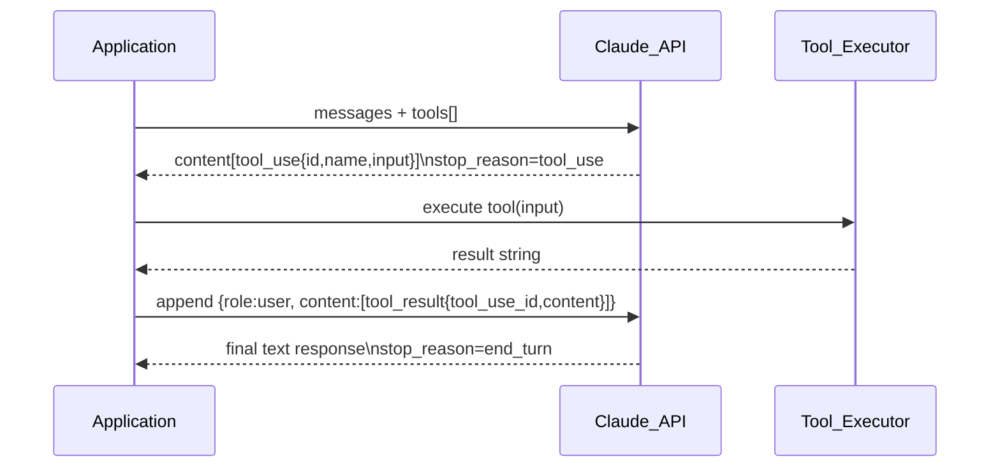
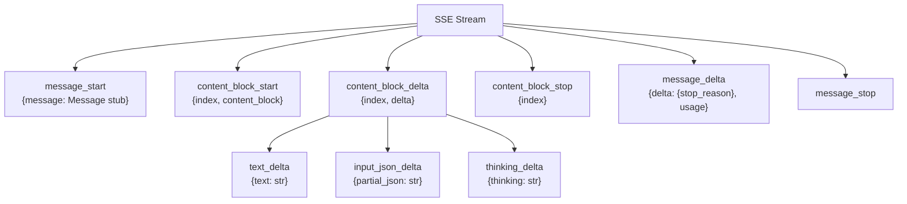
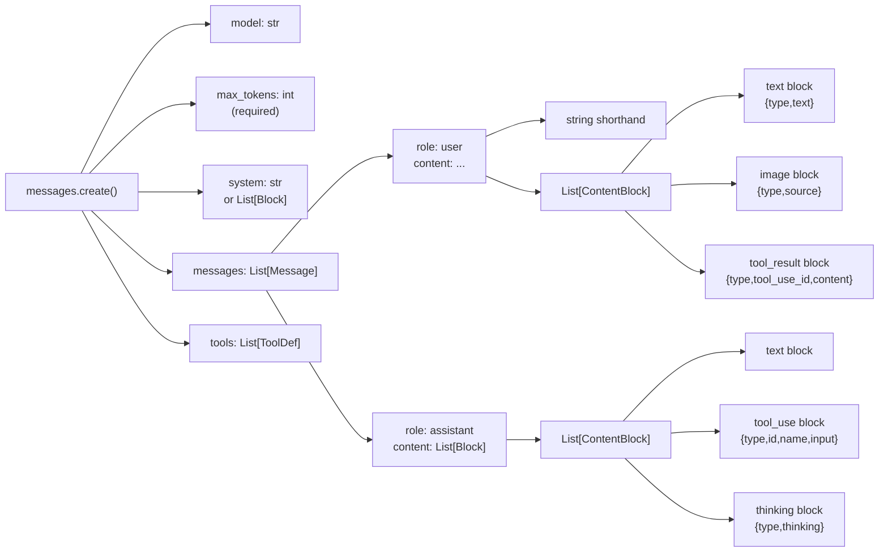

# 🐍 Anthropic API with Python

> [!abstract] TL;DR
> The `anthropic` Python SDK wraps Anthropic's Messages API — a conversation model that takes a `messages` list (alternating user/assistant turns) and returns typed content blocks (text, tool_use, thinking). Key differentiators from other LLM SDKs: `max_tokens` is required, tool results must go back as a user message, prompt caching can cut costs 90% on repeated large contexts, and streaming accumulates JSON fragments for tool inputs rather than yielding complete arguments.

---

## Intuition

**Analogy:** The Messages API is like a structured conversation logbook on a ship. Every exchange is written into the log in alternating turns (user / assistant). When the captain (Claude) needs to consult the navigator (a tool), the tool's answer is written back into the log as a new user entry — only then can the captain continue writing. The `system` parameter is the ship's standing orders posted permanently above the log, always in scope but never part of the conversation turns themselves.

Prompt caching is the quartermaster who photocopies the standing orders once and hands out copies — every subsequent reader gets the copy at a fraction of the cost of re-printing the original.

---

## How It Works

### 1. SDK Setup

```python
import anthropic

# Standard sync client — thread-safe, reuse at module level
client = anthropic.Anthropic(
    api_key="sk-ant-...",   # or set ANTHROPIC_API_KEY env var
    max_retries=3,           # automatic retry on 529 / connection errors
    timeout=60.0,            # request timeout in seconds
)

# Async client for async frameworks
async_client = anthropic.AsyncAnthropic()

# Custom httpx transport (proxy, mTLS, local bind address)
import httpx
client_with_proxy = anthropic.Anthropic(
    http_client=httpx.Client(proxies="http://proxy.corp:8080")
)

# Cloud deployment clients
bedrock = anthropic.AnthropicBedrock(
    aws_access_key="AKIA...",
    aws_secret_key="...",
    aws_region="us-east-1",
)
vertex = anthropic.AnthropicVertex(
    region="us-east5",
    project_id="my-gcp-project",
)
```

**SDK version compatibility**: always pin `anthropic>=0.40.0` in `requirements.txt`. Beta features (batches, computer use, PDF documents) are accessed via `client.beta.*` and require the `betas=["..."]` header.

---

### 2. Messages API

```python
response = client.messages.create(
    model="claude-opus-4-5",
    max_tokens=1024,          # REQUIRED — no default (unlike OpenAI)
    system="You are a concise technical assistant.",
    messages=[
        {"role": "user", "content": "Explain backpressure in one sentence."}
    ],
    temperature=0.7,          # 0–1, default 1
    top_p=0.95,               # nucleus sampling
    top_k=50,                 # optional top-k
    stop_sequences=["###"],   # stop generation at these strings
)

# Accessing the response
text = response.content[0].text
print(f"Output tokens: {response.usage.output_tokens}")
print(f"Stop reason: {response.stop_reason}")
# stop_reason values: "end_turn" | "max_tokens" | "stop_sequence" | "tool_use"

# Usage fields including cache stats
u = response.usage
print(u.input_tokens, u.output_tokens,
      u.cache_creation_input_tokens,   # tokens written to cache this call
      u.cache_read_input_tokens)       # tokens served from cache this call
```

**Multi-turn conversation** — keep appending to `messages`:
```python
messages = [{"role": "user", "content": "What is Redis?"}]
resp = client.messages.create(model="claude-opus-4-5", max_tokens=512, messages=messages)
messages.append({"role": "assistant", "content": resp.content})
messages.append({"role": "user", "content": "How does it handle persistence?"})
```

---

### 3. Content Blocks

`content` can be a **string shorthand** or a **list of typed blocks**:

```python
# String shorthand
{"role": "user", "content": "Hello"}

# List of blocks — allows mixing text and images in one turn
{"role": "user", "content": [
    {"type": "text", "text": "Describe this image:"},
    {
        "type": "image",
        "source": {
            "type": "base64",
            "media_type": "image/jpeg",
            "data": "<base64_encoded_bytes>",
        },
    },
    # URL source (no download from Anthropic side — URL must be publicly accessible)
    {
        "type": "image",
        "source": {"type": "url", "url": "https://example.com/chart.png"},
    },
]}

# Assistant prefill — force the model to start with specific text
# (append to messages before streaming)
{"role": "assistant", "content": [{"type": "text", "text": "```python\n"}]}
```

**Document blocks (PDF — beta):**
```python
{
    "type": "document",
    "source": {
        "type": "base64",
        "media_type": "application/pdf",
        "data": "<base64_pdf>",
    },
}
```

---

### 4. Tool Use (Function Calling)

Tools are defined with a JSON Schema `input_schema`. Claude may return one or more `tool_use` blocks; the application must execute them and return `tool_result` blocks in a new user message.

```python
tools = [
    {
        "name": "search_web",
        "description": "Search the web and return top results.",
        "input_schema": {
            "type": "object",
            "properties": {
                "query": {"type": "string", "description": "Search query"},
                "num_results": {"type": "integer", "default": 3},
            },
            "required": ["query"],
        },
    }
]

# tool_choice controls whether/which tool to use
# {"type": "auto"}   — Claude decides (default)
# {"type": "any"}    — Claude must use some tool
# {"type": "tool", "name": "search_web"} — force a specific tool
response = client.messages.create(
    model="claude-opus-4-5",
    max_tokens=1024,
    tools=tools,
    tool_choice={"type": "auto"},
    messages=[{"role": "user", "content": "What are the latest Python releases?"}],
)
```

**Tool use response block:**
```python
# response.stop_reason == "tool_use"
for block in response.content:
    if block.type == "tool_use":
        print(block.id)     # unique ID — must be echoed in tool_result
        print(block.name)   # "search_web"
        print(block.input)  # {"query": "Python releases"}
```

**Returning tool results:**
```python
# Must be a NEW user message — tool_result is NOT a standalone message role
tool_result_message = {
    "role": "user",
    "content": [
        {
            "type": "tool_result",
            "tool_use_id": block.id,
            "content": "Python 3.13.1 released 2024-12-05...",
            # For failed tools:
            # "is_error": True,
            # "content": "Connection timeout",
        }
    ],
}
```

**Parallel tool use**: Claude may return multiple `tool_use` blocks in a single response. Collect ALL results and return them together in one user message.



> [!warning] Critical Rule
> `stop_reason == "tool_use"` means you **must** provide the tool result before calling the API again. Sending a new user message without the tool result causes a validation error.

---

### 5. Streaming

**Simplest interface — text only:**
```python
with client.messages.stream(
    model="claude-opus-4-5",
    max_tokens=1024,
    messages=[{"role": "user", "content": "Write a haiku about distributed systems."}],
) as stream:
    for text in stream.text_stream:      # yields str chunks as they arrive
        print(text, end="", flush=True)

final = stream.get_final_message()       # complete Message object after loop
print(f"\nTotal tokens: {final.usage.output_tokens}")
```

**Raw event stream** — needed for tool inputs and thinking blocks:
```python
with client.messages.stream(...) as stream:
    for event in stream:
        if event.type == "content_block_delta":
            delta = event.delta
            if delta.type == "text_delta":
                print(delta.text, end="")
            elif delta.type == "input_json_delta":
                # JSON fragments for tool input — accumulate, then json.loads
                accumulated_json += delta.partial_json
            elif delta.type == "thinking_delta":
                print("[thinking]", delta.thinking, end="")
```

**Streaming event type hierarchy:**



**Async streaming:**
```python
async with async_client.messages.stream(
    model="claude-opus-4-5",
    max_tokens=1024,
    messages=messages,
) as stream:
    async for text in stream.text_stream:
        yield text
```

---

### 6. Prompt Caching (Beta)

Add `"cache_control": {"type": "ephemeral"}` to a content block to mark a **cache breakpoint** — Anthropic caches all tokens **up to and including** that block.

```python
LARGE_SYSTEM = "You are an expert SQL optimizer. " + ("Rule: always use indexes. " * 200)

response = client.messages.create(
    model="claude-opus-4-5",
    max_tokens=512,
    system=[
        {
            "type": "text",
            "text": LARGE_SYSTEM,
            "cache_control": {"type": "ephemeral"},   # cache this block
        }
    ],
    messages=[{"role": "user", "content": "Optimize: SELECT * FROM orders"}],
)
```

**Cache economics:**
| | Cost (relative to base) |
|---|---|
| Cache creation (first call) | 125% of base input price |
| Cache read (subsequent calls) | 10% of base input price |
| No cache | 100% of base input price |

**Rules and limits:**
- Minimum cacheable block: ~1024 tokens (smaller blocks are ignored silently)
- Cache TTL: ~5 minutes (ephemeral) — resets on each cache hit
- Breakpoints can be placed on: system blocks, user content blocks, tool definitions, document blocks
- Up to 4 cache breakpoints per request
- Cache is per API key and model — shared across your org's requests to the same model

**When prompt caching pays off:**
- Long system prompt reused across many conversations (e.g., 4000-token persona/instructions)
- Large reference document analyzed with multiple questions
- Many-shot examples prepended before each user query

---

### 7. Message Batches API (Beta)

For bulk workloads that don't need real-time responses. Up to 100,000 requests per batch, 50% cost reduction, 24-hour completion window.

```python
batch = client.beta.messages.batches.create(
    requests=[
        {
            "custom_id": f"item-{i}",
            "params": {
                "model": "claude-haiku-3-5",
                "max_tokens": 50,
                "messages": [{"role": "user", "content": prompt}],
            },
        }
        for i, prompt in enumerate(prompts)
    ]
)

# Poll for completion
import time
while True:
    batch = client.beta.messages.batches.retrieve(batch.id)
    if batch.processing_status == "ended":
        break
    time.sleep(60)

# Stream results
for result in client.beta.messages.batches.results(batch.id):
    if result.result.type == "succeeded":
        text = result.result.message.content[0].text
        print(f"{result.custom_id}: {text}")
```

**Use batch when:** offline classification, embedding generation, report generation, nightly data enrichment.
**Use real-time when:** user-facing chat, tool use that chains on results, latency-sensitive pipelines.

---

### 8. Token Counting

Count tokens **before** sending a request — useful for budget planning, chunking decisions, and choosing between models.

```python
count = client.messages.count_tokens(
    model="claude-opus-4-5",
    system="You are a helpful assistant.",
    messages=[{"role": "user", "content": "Summarize the French Revolution."}],
    tools=tools,         # tool schemas add tokens
)
print(count.input_tokens)   # e.g., 47
```

`count_tokens` makes a lightweight API call (no generation) and returns an `InputTokensCount` object. The `max_tokens` parameter is not needed here since no generation happens. Use this to implement **context budget checks** before expensive API calls.

---

### 9. Extended Thinking (Reasoning)

Enables a "chain-of-thought scratchpad" inside the model. Claude thinks before answering; thinking tokens are billed separately and often at higher cost.

```python
response = client.messages.create(
    model="claude-opus-4-5",           # also: claude-3-7-sonnet-20250219
    max_tokens=16000,                  # must exceed budget_tokens
    thinking={
        "type": "enabled",
        "budget_tokens": 10000,        # max tokens for internal reasoning
    },
    messages=[{"role": "user", "content": "Prove that sqrt(2) is irrational."}],
)

for block in response.content:
    if block.type == "thinking":
        print("Reasoning:", block.thinking[:300], "...")
    elif block.type == "text":
        print("Answer:", block.text)
```

**Streaming extended thinking** — use `thinking_delta` events (same event stream structure as text).

**Interleaved thinking** (`interleaved_thinking` beta): allows reasoning between tool calls — useful for complex agentic tasks where each tool result needs re-analysis before the next action.

**When to enable thinking:**
- Multi-step math, logic puzzles, theorem proofs
- Complex code generation with correctness requirements
- Tasks where step-by-step reasoning reduces hallucination risk

**Cost note**: thinking tokens count as output tokens and are billed at output token rates. Set `budget_tokens` conservatively — the model uses up to this limit but often uses far less.

---

### 10. Async and Production Patterns

**Rate limiting with semaphore:**
```python
import asyncio
import anthropic

client = anthropic.AsyncAnthropic()
sem = asyncio.Semaphore(10)   # max 10 concurrent requests

async def safe_create(messages):
    async with sem:
        return await client.messages.create(
            model="claude-opus-4-5",
            max_tokens=512,
            messages=messages,
        )
```

**Error handling:**
```python
try:
    response = client.messages.create(...)
except anthropic.RateLimitError:
    # HTTP 429 — back off and retry (SDK retries automatically with max_retries)
    pass
except anthropic.APIStatusError as e:
    # e.status_code, e.message
    pass
except anthropic.APIConnectionError:
    # Network failure
    pass
except anthropic.APITimeoutError:
    # Request exceeded timeout
    pass
```

**LiteLLM for multi-provider abstraction:**
```python
import litellm

response = litellm.completion(
    model="anthropic/claude-opus-4-5",
    messages=[{"role": "user", "content": "Hello"}],
)
```

---

### Flow / Architecture — Messages API Structure



---

## Code Demo

### Demo 1 — Async Multi-Turn Streaming in FastAPI

```python
# app.py — run with: uvicorn app:app
from fastapi import FastAPI
from fastapi.responses import StreamingResponse
from pydantic import BaseModel
import anthropic

app = FastAPI()
client = anthropic.AsyncAnthropic()   # reuse single instance; thread-safe

class ChatRequest(BaseModel):
    messages: list[dict]
    system: str = "You are a helpful assistant."

@app.post("/chat/stream")
async def chat_stream(req: ChatRequest):
    async def generate():
        async with client.messages.stream(
            model="claude-opus-4-5",
            max_tokens=1024,
            system=req.system,
            messages=req.messages,
        ) as stream:
            async for text in stream.text_stream:
                yield f"data: {text}\n\n"
        yield "data: [DONE]\n\n"

    return StreamingResponse(generate(), media_type="text/event-stream")
```

---

### Demo 2 — Tool Use Loop with Parallel Tool Calls

```python
import anthropic
import json

client = anthropic.Anthropic()

tools = [
    {
        "name": "get_weather",
        "description": "Get current weather for a city.",
        "input_schema": {
            "type": "object",
            "properties": {"city": {"type": "string"}},
            "required": ["city"],
        },
    },
    {
        "name": "get_population",
        "description": "Get the population of a city.",
        "input_schema": {
            "type": "object",
            "properties": {"city": {"type": "string"}},
            "required": ["city"],
        },
    },
]

def execute_tool(name: str, tool_input: dict) -> str:
    if name == "get_weather":
        return f"Sunny, 22 C in {tool_input['city']}"
    if name == "get_population":
        data = {"Paris": "2.1M", "Berlin": "3.7M", "London": "8.9M"}
        return data.get(tool_input["city"], "Unknown")
    return "Tool not found"

messages = [
    {"role": "user", "content": "What are the weather and population for Paris and Berlin?"}
]

while True:
    response = client.messages.create(
        model="claude-opus-4-5",
        max_tokens=1024,
        tools=tools,
        messages=messages,
    )

    # Always append the full assistant response to keep history consistent
    messages.append({"role": "assistant", "content": response.content})

    if response.stop_reason == "end_turn":
        for block in response.content:
            if block.type == "text":
                print("Final:", block.text)
        break

    if response.stop_reason == "tool_use":
        # Parallel tool calls — collect ALL results before re-calling API
        results = []
        for block in response.content:
            if block.type == "tool_use":
                output = execute_tool(block.name, block.input)
                results.append({
                    "type": "tool_result",
                    "tool_use_id": block.id,
                    "content": output,
                })
        messages.append({"role": "user", "content": results})
```

---

### Demo 3 — Prompt Caching: Cache Hit on Second Request

```python
import anthropic

client = anthropic.Anthropic()

# Simulate a large system prompt (~1500 tokens)
LARGE_POLICY = (
    "You are an expert compliance officer. "
    + "Policy: " + ("Always verify regulatory alignment before advising. " * 100)
)

def ask(question: str, call_num: int) -> str:
    response = client.messages.create(
        model="claude-opus-4-5",
        max_tokens=256,
        system=[
            {
                "type": "text",
                "text": LARGE_POLICY,
                "cache_control": {"type": "ephemeral"},  # mark cache breakpoint
            }
        ],
        messages=[{"role": "user", "content": question}],
    )
    u = response.usage
    print(
        f"Call {call_num} | input={u.input_tokens} | "
        f"cache_created={u.cache_creation_input_tokens} | "
        f"cache_read={u.cache_read_input_tokens}"
    )
    # Call 1 → cache_created > 0, cache_read == 0  (pays 125%)
    # Call 2 → cache_created == 0, cache_read > 0  (pays 10%)
    return response.content[0].text

result1 = ask("Is crypto trading allowed for institutional accounts?", call_num=1)
result2 = ask("What documents are needed for onboarding?", call_num=2)
```

---

### Demo 4 — Message Batches for Bulk Sentiment Classification

```python
import anthropic
import time

client = anthropic.Anthropic()

reviews = [
    "Incredible product, exceeded all my expectations!",
    "Stopped working after two days. Very disappointed.",
    "Average quality, does the job but nothing special.",
    "Best purchase of the year, highly recommend!",
    "Misleading description, nothing like the photos.",
]

batch = client.beta.messages.batches.create(
    requests=[
        {
            "custom_id": f"review-{i}",
            "params": {
                "model": "claude-haiku-3-5",
                "max_tokens": 10,
                "messages": [{
                    "role": "user",
                    "content": (
                        f"Reply with only POSITIVE, NEGATIVE, or NEUTRAL.\n"
                        f"Review: {text}"
                    ),
                }],
            },
        }
        for i, text in enumerate(reviews)
    ]
)
print(f"Batch {batch.id} submitted — status: {batch.processing_status}")

# Poll until the batch finishes (max 24 hours in production)
while True:
    batch = client.beta.messages.batches.retrieve(batch.id)
    if batch.processing_status == "ended":
        break
    print("Still processing... sleeping 60s")
    time.sleep(60)

# Stream results in order of completion (not submission order)
labels = {}
for result in client.beta.messages.batches.results(batch.id):
    if result.result.type == "succeeded":
        label = result.result.message.content[0].text.strip()
        labels[result.custom_id] = label

for i, text in enumerate(reviews):
    sentiment = labels.get(f"review-{i}", "UNKNOWN")
    print(f"[{sentiment}] {text[:60]}")
```

---

## Real-World Example

> **Example:** The production **Claude.ai** chat interface uses prompt caching on the multi-thousand-token system prompt that defines Claude's identity, safety guidelines, and capabilities. Because every conversation turn re-sends the same system prompt, caching it once and reading from cache on subsequent turns cuts the effective input cost by ~90% for long conversations. The streaming interface returns `content_block_delta` SSE events within 200-400ms of the API call, allowing the frontend to begin rendering before generation is complete — the Time-to-First-Token difference between streaming and non-streaming is perceived as the difference between "instant" and "slow" by end users.

---

## Trade-offs

### Anthropic API vs OpenAI API

| Aspect | Anthropic | OpenAI |
|--------|-----------|--------|
| Tool result placement | Must be in a `user` message | Separate `tool` role message |
| `max_tokens` | **Required** (no default) | Optional (has a default) |
| Prompt caching | Built-in (`cache_control`) | Available (requires `Prefer: cache` in some endpoints) |
| Streaming tool inputs | `input_json_delta` (JSON fragments) | `function_arguments` chunks (same pattern) |
| Extended thinking | `thinking` param with `budget_tokens` | `reasoning_effort` (o-series models) |
| Context window | Up to 200K tokens | Up to 128K (GPT-4o) |
| System prompt format | Separate `system` param or blocks | First message with `role: system` |

### Prompt Caching vs No Caching

| Aspect | With Caching | Without Caching |
|--------|-------------|-----------------|
| First-call cost | 125% of base (creation overhead) | 100% of base |
| Repeat-call cost | 10% of base (90% savings) | 100% per call |
| Latency | Cache read is faster (skips prefill) | Full prefill every call |
| TTL constraint | ~5 min — infrequent callers lose benefit | No expiry concern |
| Minimum block size | ~1024 tokens — small blocks wasted | No minimum |
| Debugging | Cache hit/miss in `usage` fields only | Simpler to reason about |

### Streaming vs Non-Streaming

| Aspect | Streaming | Non-Streaming |
|--------|-----------|---------------|
| Time-to-first-token (TTFT) | Immediate (sub-second) | Full generation time |
| User experience | Progressive rendering | All-at-once display |
| Error detection | Mid-stream errors require partial rollback | Single error point |
| Tool input accumulation | Must accumulate `input_json_delta` fragments | `block.input` is already a dict |
| Connection management | Long-lived HTTP connection | Short request/response |
| Serverless compatibility | May time out on short-lived functions | Simpler to deploy |

---

## When to Use vs Avoid

**Use when:**
- Building a chat application where latency matters — stream responses to users
- Processing large, repeated reference documents — add `cache_control` to save cost
- Implementing AI agents that need to call external functions — use tool use loop
- Running offline batch classification, enrichment, or summarization — use Message Batches
- Tasks requiring multi-step reasoning (math, proofs, complex planning) — enable extended thinking
- Counting tokens before an expensive API call to decide on chunking strategy

**Avoid when:**
- You need sub-10ms responses — LLM generation is inherently slow (100-2000ms TTFT minimum)
- Tasks are purely deterministic (parsing, regex, simple lookups) — use code instead
- Context changes every call and is small — prompt caching adds 25% creation cost with no benefit
- Real-time constraint is tighter than 24 hours and you're considering batches — use real-time API

---

## Common Pitfalls

- **Omitting `max_tokens`** — the Anthropic SDK raises a validation error immediately; this surprises developers coming from OpenAI where it has a default. Always set it explicitly.
- **Returning tool result as a standalone message** — `tool_result` blocks must be wrapped inside a `user` role message (`{"role": "user", "content": [tool_result_block]}`). Sending them at the top level causes an API error.
- **Not appending the full assistant content before tool results** — the messages list must alternate correctly. Append `{"role": "assistant", "content": response.content}` (the entire content list, not just text) before appending the tool results user message.
- **Streaming tool inputs as complete JSON** — `input_json_delta` events carry *partial JSON strings* that must be concatenated before calling `json.loads`. Trying to parse each delta individually always fails with a JSON decode error.
- **Placing cache breakpoints on small blocks** — blocks under ~1024 tokens are silently not cached. The API does not return an error; `cache_creation_input_tokens` in usage will be 0, signalling the block was too small.
- **Expecting the cache to last indefinitely** — the ephemeral cache TTL is ~5 minutes, reset on each hit. Workflows with >5 minutes between requests (e.g., nightly jobs) see no cache benefit.
- **Using `thinking` without accounting for token budget in `max_tokens`** — `max_tokens` must be *greater than* `budget_tokens` plus the expected output length. If `max_tokens=1000` and `budget_tokens=2000`, the request fails.
- **Forgetting `betas=[...]` header for beta features** — batches, computer use, and PDF documents require `extra_headers={"anthropic-beta": "message-batches-2024-09-24"}` or the `client.beta.*` namespaced methods which handle this automatically.

---

## Related Concepts

- [[Tool_Use_and_Function_Calling]] — the provider-agnostic pattern that the Anthropic tool use loop implements; covers OpenAI format comparison
- [[Constitutional_AI]] — the alignment technique used to train Claude; explains why Claude behaves differently from other models on sensitive requests
- [[Streaming_Responses]] — SSE streaming mechanics, FastAPI `StreamingResponse`, and how to pipe LLM tokens to the browser
- [[Context_Windows_and_Tokens]] — understanding token budgets, context limits (200K for Claude), and strategies for long documents
- [[Reasoning_Models]] — extended thinking / chain-of-thought models; covers `budget_tokens` and test-time compute scaling
- [[Model_Context_Protocol]] — Anthropic's open standard for connecting Claude to external tools and resources without custom tool schemas per application
- [[Concurrency_in_Python]] — `asyncio`, `AsyncAnthropic`, `Semaphore` for rate-limiting concurrent Claude calls
- [[FastAPI_Deep_Dive]] — building the streaming API endpoint that wraps `client.messages.stream()`
- [[LLM_Application_Architecture]] — where the Anthropic API fits in the broader stack: orchestration, memory, vector stores, observability
- [[Prompt_Engineering]] — system prompt design, few-shot examples, and chain-of-thought that determine response quality
- [[Generation_Controls]] — temperature, top_p, top_k, stop sequences — the sampling parameters shared across all LLM APIs
- [[LLM_Observability]] — tracing Anthropic API calls with LangSmith / Langfuse; monitoring token costs and cache hit rates
- [[Multimodal_AI]] — image and document content blocks; vision capabilities of Claude

---

## Review Questions

1. **Structure question**: A user asks Claude to search two databases simultaneously. Claude returns two `tool_use` blocks in a single response. Describe exactly how the `messages` list must look after you execute both tools and before you make the next API call — what roles, content types, and IDs must appear?

2. **Scenario question**: You have a 3000-token system prompt used in a customer-support chatbot that handles 500 requests per minute. You enable prompt caching. On the first request of each 5-minute window the cache expires and is recreated. Estimate the cost impact compared to no caching, given that cache creation costs 125% and cache reads cost 10% of base input price.

3. **Trade-off question**: You need to run Claude on 80,000 product descriptions overnight to classify them into 12 categories. You have no latency requirement — results needed by morning. Compare the Message Batches API against running 80,000 individual `messages.create()` calls with `asyncio` concurrency: what are the cost, complexity, and reliability differences?

4. **Pitfall question**: You enable extended thinking with `budget_tokens=8000` and set `max_tokens=8192`. Claude returns a thinking block that uses 7500 tokens. How many tokens remain for the text response? Why might this cause the final answer to be truncated, and how should you fix it?

---

## Sources

- [Anthropic Python SDK — GitHub](https://github.com/anthropics/anthropic-sdk-python)
- [Messages API Reference — Anthropic Docs](https://docs.anthropic.com/en/api/messages)
- [Tool Use Guide — Anthropic Docs](https://docs.anthropic.com/en/docs/build-with-claude/tool-use)
- [Prompt Caching Guide — Anthropic Docs](https://docs.anthropic.com/en/docs/build-with-claude/prompt-caching)
- [Message Batches API — Anthropic Docs](https://docs.anthropic.com/en/docs/build-with-claude/message-batches)
- [Streaming API — Anthropic Docs](https://docs.anthropic.com/en/api/messages-streaming)
- [Extended Thinking — Anthropic Docs](https://docs.anthropic.com/en/docs/build-with-claude/extended-thinking)

---

#python #anthropic #claude #llm #api #tool-use #prompt-caching
