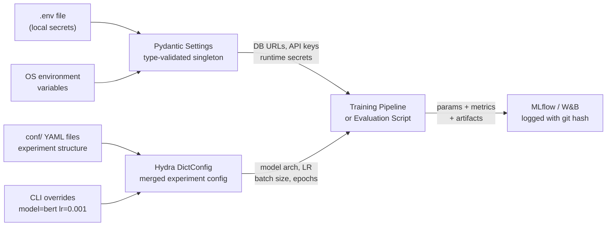

# ML Project Structure

> [!abstract] TL;DR
> A professional ML project uses a `src/` layout for import-safe packages, Pydantic Settings for environment-aware secrets, Hydra for composable experiment configs with CLI overrides, Typer for typed CLI commands, DVC for data versioning, and MLflow/W&B for experiment tracking — so any experiment from six months ago can be reproduced exactly from a single Git commit hash.

---

## Intuition

**Analogy:** A professional kitchen has exactly one place for every tool — knives on the magnetic strip, pans on the rack, mise en place bowls filled in order of use. A chef who leaves knives on random counters, stores spices inside pans, and wings ingredient ratios each service will never run a consistent kitchen. An ML project is identical: the mise en place is your config management, the prep bowls are your `data/raw/`, `data/processed/`, and `models/` directories, and the recipe is your DVC pipeline and Hydra YAML. Structure is not bureaucracy — it is the mechanism that makes experimentation fast and results reproducible.

The `src/` layout is analogous to separating kitchen stations: pastry, grill, and saute stations are physically isolated so they do not contaminate each other. Similarly, `src/data/`, `src/features/`, `src/models/`, and `src/serving/` are isolated Python packages that can be tested, imported, and versioned independently.

---

## How It Works

### 1. Standard ML Project Layout

The `src/` layout is the key architectural decision. All importable Python code lives inside `src/my_project/`, making the package import-safe regardless of where scripts are invoked from.

```text
my-project/
├── pyproject.toml            # build system, deps, tool configs (ruff, mypy, pytest)
├── Makefile                  # task runner: make data, make train, make test
├── .env                      # local secrets and env overrides — GITIGNORED
├── .env.example              # committed template with placeholder values
├── docker-compose.yml        # local dev services (postgres, redis, mlflow UI)
├── dvc.yaml                  # DVC pipeline DAG definition
├── README.md
│
├── conf/                     # Hydra configuration root
│   ├── config.yaml           # base config (selects default config groups)
│   ├── model/
│   │   ├── resnet.yaml
│   │   └── bert.yaml
│   ├── data/
│   │   └── default.yaml
│   └── trainer/
│       └── default.yaml
│
├── src/
│   └── my_project/
│       ├── __init__.py
│       ├── config/           # Pydantic Settings: env + secrets singleton
│       │   └── settings.py
│       ├── data/             # Dataset classes, DataModule, data loading
│       │   ├── dataset.py
│       │   └── datamodule.py
│       ├── features/         # Pure, stateless feature engineering functions
│       │   └── transforms.py
│       ├── models/           # Model architectures (abstract base + concrete)
│       │   ├── base.py
│       │   └── architectures/
│       ├── training/         # Trainer, loss functions, optimizer factories
│       │   ├── trainer.py
│       │   ├── loss.py
│       │   └── optimizer.py
│       ├── evaluation/       # Metrics computation, evaluator runner
│       │   ├── metrics.py
│       │   └── evaluator.py
│       ├── serving/          # FastAPI inference endpoint
│       │   └── app.py
│       └── utils/            # Seed setting, logging setup, project root discovery
│           └── reproducibility.py
│
├── data/                     # DVC-tracked; never commit raw data to Git
│   ├── raw/                  # Original, immutable dump from source
│   ├── interim/              # Intermediate transformed data
│   ├── processed/            # Final clean dataset ready for training
│   └── external/             # Third-party reference data
│
├── models/                   # Saved checkpoints and artifacts (DVC or MLflow)
├── notebooks/                # Exploratory analysis only — no business logic here
│   └── 01_eda_user_features.ipynb
├── reports/                  # Generated figures, metrics JSON, eval reports
├── scripts/                  # One-off ETL, evaluation runs, data downloads
│   ├── download_data.sh
│   └── evaluate_prod.py
└── tests/
    ├── unit/
    └── integration/
```

**Why `src/` layout?** Without it, running `python train.py` from the project root puts `.` on `sys.path`, making `import my_project` resolve to the local directory rather than the installed package. This silently breaks when CI or Docker runs scripts from a different directory. The `src/` layout forces `pip install -e .` once, which ensures the same import resolution everywhere — dev machine, CI, and container.

**`pyproject.toml`** replaces five scattered config files. Build system (`hatchling`/`setuptools`), linter (`ruff`), type checker (`mypy`), test runner (`pytest`), and formatter (`black`) all read from a single file.

### 2. Configuration Flow Architecture



**Two-layer config philosophy:**

- **Pydantic Settings** owns machine-specific secrets and deployment config: database URLs, API keys, artifact storage paths. Loaded once at startup via `@lru_cache` — identical value for the whole process lifetime.
- **Hydra** owns experiment configuration: model architecture, hyperparameters, dataset splits. Composable YAML groups, overridable from the CLI, with automatic per-run output directories.

This separation means a database URL never leaks into a logged experiment config, and a hyperparameter never requires an environment variable to change.

### 3. Data Pipeline Structure

```text
dvc.yaml stages (mirrors src/ package structure):

data/raw/  ──[src/data/make_dataset.py]──►  data/interim/
                                                   │
                                    [src/data/preprocess.py]
                                                   │
                                                   ▼
                                          data/interim/clean/
                                                   │
                                  [src/features/build_features.py]
                                                   │
                                                   ▼
                                          data/processed/
                                                   │
                                          [src/training/trainer.py]
                                                   │
                                                   ▼
                                            models/checkpoint.pt
```

`src/features/` functions must be **stateless and pure** — no file I/O, no global state. This makes them unit-testable in isolation and safe to call in both batch training and real-time serving without behavioral divergence.

### 4. Makefile for ML Workflows

```makefile
# Makefile
.PHONY: data train evaluate serve test docker-build docker-run clean

PYTHON := python
MODEL  ?= resnet
EPOCHS ?= 50
LR     ?= 0.001

## Download and preprocess all data
data:
	$(PYTHON) scripts/download_data.sh
	$(PYTHON) -m my_project.data.make_dataset
	$(PYTHON) -m my_project.data.preprocess
	$(PYTHON) -m my_project.features.build_features
	dvc push

## Run training with configurable overrides
train:
	$(PYTHON) scripts/train.py model=$(MODEL) trainer.epochs=$(EPOCHS) trainer.lr=$(LR)

## Evaluate the latest checkpoint on the test split
evaluate:
	$(PYTHON) scripts/cli.py evaluate models/best_checkpoint.pt --split test

## Start FastAPI inference server
serve:
	$(PYTHON) scripts/cli.py serve models/best_checkpoint.pt --port 8000

## Run the full test suite
test:
	pytest tests/ -v --cov=src/my_project --cov-report=term-missing

## Build Docker image
docker-build:
	docker build -t my-ml-project:latest .

## Run Docker container
docker-run:
	docker run --gpus all -p 8000:8000 my-ml-project:latest

## Remove compiled files and caches
clean:
	find . -type f -name "*.pyc" -delete
	find . -type d -name "__pycache__" -delete
	find . -type d -name ".pytest_cache" -delete
	rm -rf .mypy_cache dist/ build/ *.egg-info
```

---

## Code Demo

### 1. Pydantic Settings — Environment-Aware Config Singleton

```python
# src/my_project/config/settings.py
# pip install pydantic-settings

from __future__ import annotations
from functools import lru_cache
from pathlib import Path

from pydantic import Field, field_validator
from pydantic_settings import BaseSettings, SettingsConfigDict


class DatabaseSettings(BaseSettings):
    host: str = "localhost"
    port: int = Field(default=5432, gt=0, lt=65536)
    name: str = "mldb"
    user: str = "postgres"
    password: str = Field(default="", repr=False)   # excluded from logs/repr

    @property
    def url(self) -> str:
        return f"postgresql://{self.user}:{self.password}@{self.host}:{self.port}/{self.name}"


class ModelSettings(BaseSettings):
    artifact_dir: Path = Path("models/")
    max_checkpoints: int = Field(default=5, gt=0)
    checkpoint_metric: str = "val_loss"


class Settings(BaseSettings):
    """
    Single source of truth for deployment-level configuration.
    Reads from .env file first, then OS environment variables.
    Field names map to env vars with APP_ prefix:
      APP_DEBUG=true        -> settings.debug = True
      APP_DB__HOST=myhost   -> settings.db.host = "myhost"
    """
    model_config = SettingsConfigDict(
        env_file=".env",
        env_file_encoding="utf-8",
        env_prefix="APP_",           # APP_SEED=0 -> settings.seed = 0
        env_nested_delimiter="__",   # APP_DB__HOST -> settings.db.host
        case_sensitive=False,
        extra="ignore",              # silently ignore unknown env vars
    )

    # Core
    project_name: str = "my-ml-project"
    debug: bool = False
    seed: int = 42
    device: str = "cuda"

    # Nested settings blocks
    db: DatabaseSettings = DatabaseSettings()
    model_cfg: ModelSettings = ModelSettings()

    # Storage and tracking
    data_dir: Path = Path("data/")
    mlflow_tracking_uri: str = "http://localhost:5000"
    wandb_project: str = "my-ml-project"
    wandb_api_key: str = Field(default="", repr=False)

    @field_validator("device")
    @classmethod
    def validate_device(cls, v: str) -> str:
        allowed = {"cpu", "cuda", "mps"}
        if v not in allowed:
            raise ValueError(f"device must be one of {allowed}, got {v!r}")
        return v


@lru_cache(maxsize=1)
def get_settings() -> Settings:
    """
    Singleton accessor. Reads .env on first call; returns the cached
    instance on every subsequent call — zero re-parsing overhead.

    In tests: call get_settings.cache_clear() in teardown to reset
    the singleton when OS environment variables change between tests.
    """
    return Settings()


# Usage anywhere in the codebase:
# from my_project.config.settings import get_settings
# settings = get_settings()
# print(settings.db.url)
# print(settings.model_cfg.artifact_dir)
```

### 2. Hydra — Composable Experiment Configuration

```yaml
# conf/config.yaml — base config; selects defaults from config groups
defaults:
  - model: resnet         # loads conf/model/resnet.yaml
  - data: default         # loads conf/data/default.yaml
  - trainer: default      # loads conf/trainer/default.yaml
  - _self_                # keys here override group defaults

project: my-ml-project
seed: 42
output_dir: outputs/
```

```yaml
# conf/model/resnet.yaml
_target_: my_project.models.architectures.ResNet
hidden_dim: 512
num_layers: 4
dropout: 0.1
pretrained: true
```

```yaml
# conf/model/bert.yaml
_target_: my_project.models.architectures.BERTClassifier
encoder_name: bert-base-uncased
num_labels: 2
freeze_encoder: false
```

```yaml
# conf/trainer/default.yaml
lr: 0.001
epochs: 50
batch_size: 32
optimizer: adam
scheduler: cosine
```

```python
# scripts/train.py
import subprocess
import hydra
import mlflow
from omegaconf import DictConfig, OmegaConf

from my_project.config.settings import get_settings
from my_project.utils.reproducibility import set_all_seeds


@hydra.main(config_path="../conf", config_name="config", version_base=None)
def train(cfg: DictConfig) -> float:
    """
    Hydra injects cfg by merging YAML files + CLI overrides before this runs.

    Single run:
      python train.py model=bert data.batch_size=64

    Multirun sweep (6 combinations):
      python train.py --multirun model=resnet,bert trainer.lr=0.001,0.0001,0.00001
    """
    settings = get_settings()
    set_all_seeds(cfg.seed)

    # Instantiate model class directly from _target_ in the YAML
    model = hydra.utils.instantiate(cfg.model)

    # Dump the full resolved config as experiment params
    flat_cfg = OmegaConf.to_container(cfg, resolve=True)

    mlflow.set_tracking_uri(settings.mlflow_tracking_uri)
    mlflow.set_experiment(cfg.project)

    with mlflow.start_run():
        mlflow.log_params(flat_cfg)
        mlflow.log_param("git_hash", _git_hash())

        val_loss = _run_training_loop(model, cfg, settings)
        mlflow.log_metric("val_loss", val_loss)

    return val_loss   # returned value is used by Hydra multirun for ranking


def _git_hash() -> str:
    try:
        return subprocess.check_output(
            ["git", "rev-parse", "--short", "HEAD"],
            text=True, stderr=subprocess.DEVNULL
        ).strip()
    except Exception:
        return "unknown"


def _run_training_loop(model, cfg, settings) -> float:
    # Real implementation lives in src/my_project/training/trainer.py
    return 0.42


if __name__ == "__main__":
    train()
```

### 3. Typer — Multi-Command ML CLI

```python
# scripts/cli.py
# pip install "typer[all]"

import typer
from pathlib import Path
from typing import Optional

app = typer.Typer(
    name="mlcli",
    help="ML project command-line interface.",
    rich_markup_mode="rich",
)

# Sub-app: data commands grouped under "mlcli data ..."
data_app = typer.Typer(help="Data download, preprocessing, and validation.")
app.add_typer(data_app, name="data")


@data_app.command("download")
def download_data(
    source: str = typer.Argument(..., help="Data source URL or identifier"),
    output_dir: Path = typer.Option(Path("data/raw"), "--out", "-o"),
    force: bool = typer.Option(False, "--force", "-f", help="Overwrite existing files"),
):
    """Download raw data from SOURCE into OUTPUT_DIR."""
    if output_dir.exists() and not force:
        overwrite = typer.confirm(f"{output_dir} already exists. Overwrite?")
        if not overwrite:
            raise typer.Abort()
    typer.echo(f"Downloading {source} -> {output_dir}")
    # actual download logic here


@data_app.command("preprocess")
def preprocess(
    input_dir: Path = typer.Option(Path("data/raw"), help="Raw data directory"),
    output_dir: Path = typer.Option(Path("data/processed")),
    workers: int = typer.Option(4, "--workers", "-w", help="Parallel workers"),
):
    """Preprocess raw data and write cleaned output to OUTPUT_DIR."""
    typer.echo(f"Preprocessing {input_dir} with {workers} workers -> {output_dir}")


@app.command()
def train(
    model: str = typer.Argument("resnet", help="Model config group (resnet | bert)"),
    epochs: int = typer.Option(10, "--epochs", "-e"),
    lr: float = typer.Option(0.001, "--lr", help="Initial learning rate"),
    batch_size: int = typer.Option(32, "--batch-size", "-b"),
    experiment: str = typer.Option("default", "--experiment"),
    dry_run: bool = typer.Option(False, "--dry-run", help="Validate config only"),
):
    """Train MODEL for EPOCHS. Delegates to Hydra train.py with CLI overrides."""
    typer.echo(f"Training {model} — lr={lr}, epochs={epochs}, batch={batch_size}")
    if dry_run:
        typer.echo("Dry run: config valid.")
        raise typer.Exit(code=0)
    # invoke: python scripts/train.py model={model} trainer.lr={lr} ...


@app.command()
def evaluate(
    checkpoint: Path = typer.Argument(..., help="Path to model checkpoint"),
    split: str = typer.Option("test", "--split", help="Data split: val | test"),
    output: Optional[Path] = typer.Option(None, "--output", help="Save metrics JSON"),
):
    """Evaluate a trained model CHECKPOINT on SPLIT."""
    if not checkpoint.exists():
        typer.echo(f"[red]Checkpoint not found:[/red] {checkpoint}", err=True)
        raise typer.Exit(code=1)
    typer.echo(f"Evaluating {checkpoint} on {split} split")


@app.command()
def serve(
    checkpoint: Path = typer.Argument(..., help="Path to model checkpoint"),
    host: str = typer.Option("0.0.0.0", "--host"),
    port: int = typer.Option(8000, "--port", "-p"),
    workers: int = typer.Option(1, "--workers"),
):
    """Start the FastAPI inference server with CHECKPOINT loaded."""
    import uvicorn
    typer.echo(f"Serving {checkpoint} on {host}:{port} with {workers} worker(s)")
    uvicorn.run(
        "my_project.serving.app:app",
        host=host, port=port, workers=workers,
    )


if __name__ == "__main__":
    app()

# Auto-generated --help output (no argparse boilerplate):
#   mlcli --help
#   mlcli train --help
#   mlcli data download --help
#   mlcli data preprocess --help
#   mlcli evaluate --help
#   mlcli serve --help
```

### 4. Reproducibility — Seed Setting and MLflow Training Loop

```python
# src/my_project/utils/reproducibility.py

import os
import platform
import random
import subprocess

import numpy as np


def set_all_seeds(seed: int = 42) -> None:
    """
    Set every random number generator that could influence training output.
    Call BEFORE model construction, data loading, and any weight initialization.
    """
    os.environ["PYTHONHASHSEED"] = str(seed)   # affects dict ordering in CPython
    random.seed(seed)
    np.random.seed(seed)

    try:
        import torch
        torch.manual_seed(seed)
        if torch.cuda.is_available():
            torch.cuda.manual_seed(seed)
            torch.cuda.manual_seed_all(seed)        # required for multi-GPU
        # cuDNN will select the same conv algorithm every run
        torch.backends.cudnn.deterministic = True
        # benchmark=True auto-selects fastest algorithm at runtime (non-deterministic)
        torch.backends.cudnn.benchmark = False
    except ImportError:
        pass


def get_environment_metadata() -> dict:
    """
    Collect metadata sufficient to reproduce this run's environment.
    Log the returned dict to MLflow/W&B alongside every experiment.
    """
    meta: dict = {
        "python_version": platform.python_version(),
        "platform": platform.platform(),
        "git_hash": _git_hash(),
        "git_branch": _git_branch(),
    }
    for lib in ["numpy", "torch", "sklearn", "transformers", "hydra"]:
        try:
            mod = __import__(lib)
            meta[f"{lib}_version"] = getattr(mod, "__version__", "unknown")
        except ImportError:
            pass
    return meta


def _git_hash() -> str:
    try:
        return subprocess.check_output(
            ["git", "rev-parse", "--short", "HEAD"],
            text=True, stderr=subprocess.DEVNULL,
        ).strip()
    except Exception:
        return "unknown"


def _git_branch() -> str:
    try:
        return subprocess.check_output(
            ["git", "rev-parse", "--abbrev-ref", "HEAD"],
            text=True, stderr=subprocess.DEVNULL,
        ).strip()
    except Exception:
        return "unknown"


# ── MLflow training loop integration ──────────────────────────────────────────
def train_with_tracking(
    model,
    train_loader,
    val_loader,
    optimizer,
    criterion,
    epochs: int,
    experiment_name: str,
    cfg_dict: dict,
    seed: int = 42,
) -> None:
    """Training loop with full MLflow tracking and environment metadata logging."""
    import mlflow
    import mlflow.pytorch
    import torch

    set_all_seeds(seed)
    env_meta = get_environment_metadata()

    mlflow.set_experiment(experiment_name)
    with mlflow.start_run():
        mlflow.log_params({**cfg_dict, **env_meta})

        for epoch in range(epochs):
            # ── train ──────────────────────────────────────────────────────
            model.train()
            epoch_loss = 0.0
            for batch_x, batch_y in train_loader:
                optimizer.zero_grad()
                loss = criterion(model(batch_x), batch_y)
                loss.backward()
                optimizer.step()
                epoch_loss += loss.item()
            train_loss = epoch_loss / len(train_loader)
            mlflow.log_metric("train_loss", train_loss, step=epoch)

            # ── validate ───────────────────────────────────────────────────
            model.eval()
            val_loss = 0.0
            with torch.no_grad():
                for batch_x, batch_y in val_loader:
                    val_loss += criterion(model(batch_x), batch_y).item()
            val_loss /= len(val_loader)
            mlflow.log_metric("val_loss", val_loss, step=epoch)

        mlflow.pytorch.log_model(model, artifact_path="model")
```

---

## Real-World Example

> **Example:** Hugging Face's `transformers` repository uses exactly this structure at scale. All importable Python lives in `src/transformers/`, model architectures are isolated under `src/transformers/models/` (one sub-package per architecture), training is handled by `src/transformers/trainer.py`, and evaluation utilities live under `src/transformers/trainer_utils.py`. Configuration is handled by `TrainingArguments` — a Pydantic-style dataclass that reads from environment variables and CLI flags, directly analogous to the Settings pattern here. Every model pushed to the Hugging Face Hub stores the git commit hash of the training code and the exact library versions in `config.json` — the same reproducibility metadata strategy described in `get_environment_metadata()`. The result is that any community member can trace any Hub model back to the exact code version that produced it.

---

## Trade-offs

### Config Management: Hydra vs Pydantic Settings vs argparse

| Aspect | Hydra | Pydantic Settings | argparse / click |
|--------|-------|-------------------|-----------------|
| Experiment sweeps | Built-in `--multirun` with grid/random/Optuna | Not supported | Manual scripting |
| Config format | Composable YAML groups | Python class + `.env` file | CLI args only |
| CLI overrides | `model=bert lr=0.001` (dotted path) | Env var overrides only | `--lr 0.001` (explicit) |
| Output management | Auto `outputs/YYYY-MM-DD/HH-MM-SS/` per run | Manual | Manual |
| Secrets handling | No native secret masking | `Field(repr=False)`, `.env` gitignored | No |
| Complexity | Medium-high (`conf/` directory, `defaults:` block) | Low | Low |
| Best for | Research experiments, hyperparameter sweeps | Deployment / serving config | Simple one-off scripts |

### Experiment Tracking: MLflow vs W&B vs TensorBoard

| Aspect | MLflow | W&B | TensorBoard |
|--------|--------|-----|-------------|
| Self-hosted | Yes (free, runs locally) | Paid enterprise only | Yes (no remote sync) |
| Setup effort | Medium (deploy tracking server) | Low (SaaS, 1-line `wandb.init`) | Low (local only) |
| Hyperparameter sweeps | Via Optuna/Ray Tune plugin | Native Sweeps with Bayesian opt | No |
| Model registry | Full-featured lifecycle | Available | No |
| Team collaboration | Shared tracking server | Excellent (SaaS dashboards) | Not practical |
| Best for | Enterprise, on-prem, Databricks | Research labs, deep learning | Quick local debugging |

### Task Runners: Makefile vs just vs taskipy

| Aspect | Makefile | `just` | `taskipy` |
|--------|----------|--------|-----------|
| Platform portability | Unix/Mac native; Windows needs WSL/Git Bash | Cross-platform binary install | Pure Python — pip install |
| Syntax clarity | Cryptic (`$@`, `$<`, `$$VAR`) | Clean, shell-like | Python string commands |
| Dependency tracking | File-based (full `make` feature) | None (recipe runner only) | None |
| Python integration | External shell calls | External shell calls | Direct in `pyproject.toml` |
| Industry adoption | Universal in ML repos | Growing in Rust/systems | Niche, Python-only teams |

### Data Versioning: DVC vs Git LFS

| Aspect | DVC | Git LFS |
|--------|-----|---------|
| Storage backends | S3, GCS, Azure, SSH, HTTP | GitHub LFS, Bitbucket LFS |
| ML-specific features | Pipeline DAGs, experiment tracking, metrics diff | None |
| Large file handling | Handles TBs; fetches only what changed | Bandwidth charges per GB |
| Pipeline support | `dvc.yaml` DAG with stage caching | None |
| Complexity | Higher (init, remote config, dvc.yaml) | Lower (`git lfs track "*.pkl"`) |
| Best for | Full ML project with pipelines and experiments | Simple binary asset versioning |

---

## When to Use vs Avoid

**Use this full structure when:**
- A project will be maintained for more than one week or by more than one person
- Experiments need to be reproduced weeks or months later (research, regulated industries)
- The trained model will be deployed to a production serving endpoint
- Multiple engineers collaborate on data, features, and model code simultaneously

**Simplify or skip pieces when:**
- Rapid Kaggle prototyping — start with notebooks and graduate to `src/` when notebooks grow unwieldy
- A one-off analysis script with no reuse expectation — a single `.py` file is fine
- A project with a single static data source — skip DVC until data changes become a problem
- Learning a new framework — start simple; add structure incrementally as complexity grows

---

## Common Pitfalls

- **Business logic in notebooks** — Jupyter notebooks cannot be `import`-ed or unit-tested. Any function called in more than one notebook cell, or referenced in training, belongs in `src/my_project/`. Notebooks are for exploration and visualization only; treat them as disposable scratch paper.

- **Relative paths that break on invocation directory** — `open("data/raw/train.csv")` works from the project root but fails from `scripts/` or Docker. Use `Path(__file__).parent.parent / "data" / "raw" / "train.csv"`, or define `PROJECT_ROOT = Path(__file__).parents[3]` relative to the `settings.py` file location.

- **Global mutable config at module level** — a bare `settings = Settings()` at module scope is created at import time, before `.env` is guaranteed to be loaded, and cannot be reset between tests. Always wrap in `@lru_cache(maxsize=1)` on a `get_settings()` function so tests can call `get_settings.cache_clear()` in teardown to reset the singleton.

- **Hyperparameters in three different places** — when some live in Hydra YAML, some are hardcoded in the training script, and others arrive as Typer CLI flags, experiments become irreproducible because no single config dump captures the full experiment state. Enforce one source of truth: Hydra owns all experiment hyperparameters; Pydantic Settings owns all deployment config.

- **Not pinning dependencies** — `pip install torch` installs the latest version, which differs across machines and CI builds and produces non-identical results. Always commit `poetry.lock` (Poetry) or a fully-pinned `requirements.txt` (`pip freeze > requirements.txt`). Use Docker for byte-for-byte environment identity.

- **Committing `.env` or model weights to Git** — `.env` contains secrets that become permanent in Git history the moment they are committed (even after deletion). Model weight files bloat history and make clone and CI times grow unbounded. Add both to `.gitignore`; use a secrets manager (AWS SSM, HashiCorp Vault) for credentials and DVC for weight artifacts.

---

## Related Concepts

- [[Data_Versioning_DVC]] — DVC tracks `data/raw/`, `data/processed/`, and `models/`; the `dvc.yaml` pipeline directly mirrors the `src/data/` to `src/features/` to `src/models/` code structure
- [[MLflow]] — `mlflow.start_run()` and `mlflow.log_params()` integrate directly with the Hydra config dump and `get_environment_metadata()` reproducibility pattern
- [[Weights_and_Biases]] — `wandb.init(project=cfg.project, config=OmegaConf.to_container(cfg))` is a drop-in alternative to MLflow for research teams preferring cloud dashboards
- [[Experiment_Tracking_Overview]] — the conceptual motivation for why every run must log params, metrics, git hash, and environment metadata before results are meaningful
- [[ML_Pipelines_Overview]] — the `dvc.yaml` pipeline DAG is a lightweight alternative to Kubeflow/Airflow for project-scoped orchestration
- [[FastAPI_Deep_Dive]] — `src/serving/app.py` is a FastAPI application; `get_settings()` integrates as a FastAPI dependency via `Depends(get_settings)`
- [[FastAPI_for_ML]] — patterns for packaging a trained model behind a FastAPI endpoint for real-time inference serving
- [[PyTorch_Training_Loop]] — `src/training/trainer.py` implements the inner loop; `set_all_seeds()` and MLflow logging wrap it with reproducibility guarantees
- [[PyTorch_DataLoader]] — `src/data/dataset.py` and `src/data/datamodule.py` wrap `torch.utils.data.Dataset` and `DataLoader`; the `worker_init_fn` must also be seeded for full determinism
- [[Decorators_and_Metaprogramming]] — `@lru_cache(maxsize=1)` on `get_settings()` and `@hydra.main(...)` are decorator patterns covered in depth; `@app.command()` is a class-decorator-based registration system
- [[Type_Hints_and_Static_Analysis]] — Pydantic Settings and Typer CLI rely entirely on Python type annotations for automatic validation, coercion, and `--help` documentation generation

---

## Review Questions

1. Why does the `src/` layout prevent the "accidental namespace package" import bug, and what single command makes the package importable from any directory without modifying `sys.path`?

2. `get_settings()` is decorated with `@lru_cache(maxsize=1)`. A test sets `os.environ["APP_DEBUG"] = "true"` before calling `get_settings()`. A second test later sets `os.environ["APP_DEBUG"] = "false"` and calls `get_settings()` again — but still sees `debug=True`. Why, and exactly what must the test teardown do to fix this?

3. Your team wants to sweep 3 learning rates times 2 model architectures overnight, generating 6 independent training runs each with their own output directory and MLflow run. Write the exact Hydra CLI command that triggers this, and describe what the `conf/` directory must contain to support both model variants.

4. List every seed-setting call required to make a single-GPU PyTorch training run deterministic. Why is `torch.backends.cudnn.benchmark = False` required in addition to the RNG seed calls, even though it is not technically a seed?

---

## Sources

- [Cookiecutter Data Science](https://drivendata.github.io/cookiecutter-data-science/) — canonical ML project layout reference; the structure in this note is a modernized derivation
- [Hydra Documentation](https://hydra.cc/docs/intro/) — composable YAML configuration framework by Meta
- [Pydantic Settings Documentation](https://docs.pydantic.dev/latest/concepts/pydantic_settings/) — environment-aware settings management built on Pydantic v2
- [Typer Documentation](https://typer.tiangolo.com/) — typed CLI framework by Sebastian Ramirez, built on Click
- [Python Packaging — src layout guidance](https://packaging.python.org/en/latest/discussions/src-layout-vs-flat-layout/) — official rationale for import-safe project layout
- [PyTorch Reproducibility Guide](https://pytorch.org/docs/stable/notes/randomness.html) — official documentation on deterministic training
- Huyen, Chip. *Designing Machine Learning Systems*. O'Reilly, 2022. Chapter 6 (Model Development) and Chapter 7 (Model Deployment).
- [Real Python — pyproject.toml Guide](https://realpython.com/pyproject-toml/)

---

#python #ml #project-structure #hydra #pydantic #typer #mlops #reproducibility
