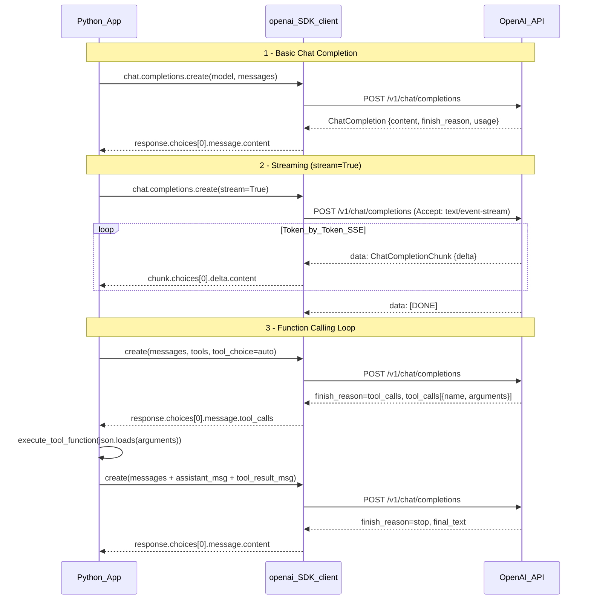

# OpenAI API with Python

> [!abstract] TL;DR
> The `openai` Python SDK (v1+) provides a typed, thread-safe client to call GPT models, embeddings, and the Assistants API. Mastering it means knowing which primitive to reach for — streaming vs batch, function calling vs structured output, Assistants vs raw completions — and how to handle errors, count tokens, and keep costs predictable in production.

---

## Intuition

**Analogy:** The OpenAI SDK is a universal remote for language models. The remote (SDK client) has dedicated buttons for different actions: chat completion, embed, generate image. Pressing a button (calling an API method) sends a command to the TV (OpenAI servers) and you get a response back. Some buttons have special modes: the streaming mode shows you the picture frame-by-frame as it renders instead of waiting for the final image; the function-calling mode lets the TV pause and ask you to look something up in the program guide before finishing.

Under the hood it is all HTTPS POST requests to `api.openai.com/v1/*`. The SDK's job is to eliminate boilerplate: authentication headers, JSON serialization, retry-after logic, response deserialization, and async plumbing are handled for you. You focus on what you want the model to do; the SDK handles how to ask for it.

---

## How It Works

### Core Mechanics

#### 1. SDK Setup

```python
# pip install openai tiktoken httpx tenacity
import httpx
from openai import OpenAI, AsyncOpenAI, AzureOpenAI

# OPENAI_API_KEY is read from environment automatically — no explicit api_key needed
client = OpenAI()

# Full configuration for production
client = OpenAI(
    api_key="sk-...",               # or set OPENAI_API_KEY env var
    organization="org-...",          # optional: for multi-org accounts
    base_url="https://api.openai.com/v1",  # override for proxies / local models
    max_retries=3,                   # auto-retry 429 and 5xx with exponential backoff
    timeout=httpx.Timeout(
        connect=5.0,
        read=60.0,   # long reads for slow completions; o1 can take 30–120s
        write=10.0,
        pool=5.0,
    ),
)

# Async client — identical API surface, every method is awaitable
async_client = AsyncOpenAI()

# Azure OpenAI — same SDK interface, different endpoint config
azure_client = AzureOpenAI(
    azure_endpoint="https://<resource>.openai.azure.com",
    api_version="2024-02-01",
    api_key="...",
)

# Thread safety: OpenAI() manages an internal httpx connection pool.
# Create one instance at module/app level and reuse — never instantiate per-request.
```

#### 2. Chat Completions API

The core primitive: takes a `messages` list with roles and returns a completion.

```python
response = client.chat.completions.create(
    model="gpt-4o",
    messages=[
        {"role": "system", "content": "You are a concise technical assistant."},
        {"role": "user",   "content": "Explain transformer architecture in 2 sentences."},
    ],
    temperature=0.7,        # 0 = deterministic, 2 = most random
    max_tokens=512,         # hard cap on output tokens; triggers finish_reason="length"
    top_p=1.0,              # nucleus sampling; leave at 1.0 when adjusting temperature
    frequency_penalty=0.0,  # -2 to 2; penalizes repeated tokens
    presence_penalty=0.0,   # -2 to 2; penalizes already-mentioned topics
    stop=["\n\n"],          # stop sequences (list of strings)
    n=1,                    # number of completions; n>1 costs n× more
    seed=42,                # soft determinism — same seed ≈ same output (not guaranteed)
    logprobs=True,          # return per-token log-probabilities
)

content    = response.choices[0].message.content
finish     = response.choices[0].finish_reason  # "stop" | "length" | "tool_calls" | "content_filter"
p_tokens   = response.usage.prompt_tokens
c_tokens   = response.usage.completion_tokens
total      = response.usage.total_tokens

# Multi-turn: append the assistant reply and continue
messages = [
    {"role": "system",    "content": "You are a Python expert."},
    {"role": "user",      "content": "What is a generator?"},
]
response = client.chat.completions.create(model="gpt-4o-mini", messages=messages)
messages.append({"role": "assistant", "content": response.choices[0].message.content})
messages.append({"role": "user",      "content": "Show me a lazy fibonacci example."})
# next call has full context — the model "remembers" the conversation
```

**Message roles:**
- `system` — persistent instructions; sets the model's persona and constraints; appears first
- `user` — human turn
- `assistant` — prior model replies (for multi-turn context)
- `tool` — result of a function call (see §4)

#### 3. Streaming

With `stream=True` the API returns tokens as they are generated, eliminating the blank-screen wait for long outputs. For the full protocol (SSE, nginx buffering, backpressure), see [[Streaming_Responses]].

The SDK exposes two streaming APIs:

```python
# Iterator API (simple, low-level)
stream = client.chat.completions.create(
    model="gpt-4o-mini",
    messages=[{"role": "user", "content": "List 5 Python tips."}],
    stream=True,
)
for chunk in stream:
    delta = chunk.choices[0].delta.content or ""
    print(delta, end="", flush=True)
# finish_reason appears on the final chunk

# Context manager API (v1.2+, preferred for production)
with client.chat.completions.stream(
    model="gpt-4o-mini",
    messages=[{"role": "user", "content": "Explain async/await."}],
) as stream:
    for text in stream.text_stream:        # yields only text, strips SSE metadata
        print(text, end="", flush=True)
final_msg = stream.get_final_message()     # ChatCompletion with full usage stats

# Async streaming (for FastAPI / asyncio)
async with async_client.chat.completions.stream(...) as stream:
    async for text in stream.text_stream:
        yield text                          # yield into an async generator
```

**Key insight:** When a model outputs tool calls during streaming, `delta.content` is `None` and `delta.tool_calls` contains partial JSON fragments. You must accumulate all fragments before `json.loads()` — see Code Demo §2.

#### 4. Function Calling and Tool Use

The model signals it wants to call a function by returning structured JSON instead of text. For architectural depth, see [[Tool_Use_and_Function_Calling]].

```python
tools = [
    {
        "type": "function",
        "function": {
            "name": "get_weather",
            "description": "Get current weather for a city. Use when user asks about weather.",
            "parameters": {
                "type": "object",
                "properties": {
                    "city": {"type": "string", "description": "City name, e.g. 'Tokyo'"},
                    "unit": {"type": "string", "enum": ["celsius", "fahrenheit"]},
                },
                "required": ["city"],
            },
        },
    }
]

response = client.chat.completions.create(
    model="gpt-4o-mini",
    messages=[{"role": "user", "content": "What's the weather in London?"}],
    tools=tools,
    tool_choice="auto",  # "auto" | "required" | {"type":"function","function":{"name":"..."}}
)

# When finish_reason == "tool_calls":
tool_calls = response.choices[0].message.tool_calls  # list[ChatCompletionMessageToolCall]
for tc in tool_calls:
    fn_name = tc.function.name         # "get_weather"
    fn_args = json.loads(tc.function.arguments)  # {"city": "London", "unit": "celsius"}
    result = execute(fn_name, fn_args)
    messages.append(response.choices[0].message)   # append the assistant tool_calls message
    messages.append({
        "role": "tool",
        "tool_call_id": tc.id,         # must match — this is how the model correlates
        "content": json.dumps(result),
    })
# Then call chat.completions.create again with updated messages
```

**Parallel tool calls:** One response can contain multiple `tool_calls`. Execute them concurrently with `asyncio.gather()`, then append all tool results before the next completion call.

**Structured output via JSON schema** (model-enforced, no Pydantic required):
```python
response = client.chat.completions.create(
    model="gpt-4o",
    messages=[...],
    response_format={
        "type": "json_schema",
        "json_schema": {
            "name": "sentiment_result",
            "strict": True,
            "schema": {
                "type": "object",
                "properties": {
                    "label": {"type": "string", "enum": ["positive","negative","neutral"]},
                    "score": {"type": "number"},
                },
                "required": ["label", "score"],
                "additionalProperties": False,
            },
        },
    },
)
```

#### 5. Structured Output with Pydantic

`client.beta.chat.completions.parse()` generates the JSON schema from a Pydantic model automatically and returns a typed object — no manual JSON parsing.

```python
from pydantic import BaseModel, Field

class ExtractedEntity(BaseModel):
    name: str
    entity_type: str = Field(description="person, organization, or location")
    confidence: float = Field(ge=0.0, le=1.0)

response = client.beta.chat.completions.parse(
    model="gpt-4o-mini",
    messages=[{"role": "user", "content": "OpenAI was founded by Sam Altman in San Francisco."}],
    response_format=ExtractedEntity,
)
entity: ExtractedEntity = response.choices[0].message.parsed
# entity.name, entity.entity_type, entity.confidence — fully typed, validated
```

| Output mode | Schema validated | Type-safe | Use when |
|-------------|-----------------|-----------|----------|
| `{"type": "json_object"}` | None (model best-effort) | No | Quick hacks; schema doesn't matter |
| `{"type": "json_schema", "strict": True}` | Model-enforced | No (manual `json.loads`) | Schema matters; no Pydantic dependency |
| `beta.parse(response_format=Model)` | Model-enforced + Pydantic | Yes | Production typed output |

`json_object` mode only guarantees valid JSON — it does **not** validate field names, types, or required fields.

#### 6. Embeddings API

Converts text to dense vectors for semantic search, clustering, and RAG retrieval. For model comparisons and RAG patterns, see [[Embedding_Models]] and [[RAG_Fundamentals]].

```python
response = client.embeddings.create(
    model="text-embedding-3-small",
    input=["The OpenAI API", "Machine learning with Python"],  # batch: up to 2048 items
    dimensions=256,   # Matryoshka: reduce from 1536 without retraining; 6x memory savings
)
vectors   = [item.embedding for item in response.data]  # list[list[float]]
tok_count = response.usage.total_tokens
```

| Model | Default dims | Cost / 1M tokens | Notes |
|-------|-------------|-----------------|-------|
| `text-embedding-3-small` | 1536 | $0.02 | Best default for most use cases |
| `text-embedding-3-large` | 3072 | $0.13 | Maximum quality; supports MRL dim reduction |
| `text-embedding-ada-002` | 1536 | $0.10 | Legacy — prefer 3-small for new work |

Cosine similarity (use after normalizing; `text-embedding-3-*` outputs are already normalized):
```python
import numpy as np
def cosine_sim(a: list[float], b: list[float]) -> float:
    a, b = np.array(a), np.array(b)
    return float(np.dot(a, b) / (np.linalg.norm(a) * np.linalg.norm(b)))
```

#### 7. Assistants API (v2)

Built-in state management (Threads), file handling (file_search), and built-in tools (code_interpreter, function). Use when you need persistent conversation state or file search without building RAG yourself.

```python
# Create once — store the assistant_id; never recreate per session
assistant = client.beta.assistants.create(
    model="gpt-4o",
    name="Data Analyst",
    instructions="Analyze uploaded data files and answer questions concisely.",
    tools=[{"type": "code_interpreter"}, {"type": "file_search"}],
)

# Thread = persistent conversation container
thread = client.beta.threads.create()
client.beta.threads.messages.create(
    thread_id=thread.id, role="user", content="Summarize the attached CSV."
)

# Run = one execution; create_and_poll blocks until completion
run = client.beta.threads.runs.create_and_poll(
    thread_id=thread.id,
    assistant_id=assistant.id,
)
if run.status == "completed":
    msgs = client.beta.threads.messages.list(thread_id=thread.id)
    print(msgs.data[0].content[0].text.value)
```

**Assistants vs raw `chat.completions`:**

| Dimension | Assistants API | Raw chat.completions |
|-----------|---------------|---------------------|
| State management | Automatic (Threads persist) | Manual — maintain messages list |
| File handling | Built-in file_search, code_interpreter | Manual — build your own RAG |
| Cost overhead | +20–30% (thread/run management tokens) | Pay only for what you send |
| Latency | Higher — polling run status adds round-trips | Lower — one API call per turn |
| Flexibility | Limited — fixed tool types | Full — any tool, any orchestration |
| Best for | Stateful multi-session apps, file QA | Custom agents, batch processing, low cost |

#### 8. Retry and Error Handling

```python
import openai

try:
    response = client.chat.completions.create(model="gpt-4o-mini", messages=[...])
except openai.RateLimitError as e:       # 429: throttled — back off
    retry_after = e.response.headers.get("retry-after", "unknown")
    print(f"Rate limited. Retry after {retry_after}s")
except openai.APIConnectionError:        # DNS/TCP-level failure
    pass
except openai.APITimeoutError:           # request exceeded timeout setting
    pass
except openai.BadRequestError as e:      # 400: invalid params or content_filter
    if e.code == "content_filter":
        print("Content filtered by safety system")
    print(e.message)
except openai.AuthenticationError:       # 401: bad API key
    pass

# Automatic retries: max_retries=3 handles 429 and 5xx with jittered exponential backoff
client = OpenAI(max_retries=3)

# Custom backoff with tenacity (for finer control)
from tenacity import retry, stop_after_attempt, wait_exponential, retry_if_exception_type

@retry(
    retry=retry_if_exception_type(openai.RateLimitError),
    wait=wait_exponential(multiplier=1, min=4, max=60),
    stop=stop_after_attempt(6),
    reraise=True,
)
def resilient_call(messages: list) -> str:
    return client.chat.completions.create(
        model="gpt-4o-mini", messages=messages
    ).choices[0].message.content

# Always check finish_reason — "content_filter" means output was truncated by safety
if response.choices[0].finish_reason == "content_filter":
    return "[Response filtered by content policy]"
```

#### 9. Cost Management and Token Counting

```python
import tiktoken

def count_message_tokens(messages: list[dict], model: str = "gpt-4o") -> int:
    """Estimate token count for a messages list, including formatting overhead."""
    enc = tiktoken.encoding_for_model(model)
    tokens_per_message = 3   # <|start|>role\ncontent<|end|> wrapping
    tokens_per_name = 1      # extra token if 'name' field is present
    total = sum(
        tokens_per_message
        + len(enc.encode(msg.get("content", "")))
        + (tokens_per_name if "name" in msg else 0)
        for msg in messages
    )
    total += 3  # reply priming: <|start|>assistant<|message|>
    return total

# Approximate 2024/2025 pricing (verify at platform.openai.com/pricing)
PRICING = {  # USD per 1M tokens
    "gpt-4o":      {"input": 2.50,  "output": 10.00},
    "gpt-4o-mini": {"input": 0.15,  "output":  0.60},
    "o1":          {"input": 15.00, "output": 60.00},
    "o3-mini":     {"input": 1.10,  "output":  4.40},
}

def estimate_cost(prompt_tokens: int, completion_tokens: int, model: str) -> float:
    p = PRICING[model]
    return (prompt_tokens * p["input"] + completion_tokens * p["output"]) / 1_000_000

# Prompt caching: no code change needed.
# Repeated prefixes ≥ 1024 tokens get a 50% input discount automatically.
# Cache hits appear in response.usage.prompt_tokens_details.cached_tokens.

# Batch API: 50% discount, async, 24-hour processing window
upload = client.files.create(file=open("batch_requests.jsonl", "rb"), purpose="batch")
batch = client.batches.create(
    input_file_id=upload.id,
    endpoint="/v1/chat/completions",
    completion_window="24h",
)
# Poll batch.status until "completed"; fetch output_file_id to retrieve results
```

**Prompt caching conditions:** the cached prefix must be identical in bytes (same system prompt, same few-shot examples, same leading context), at least 1024 tokens long, and the cached portion must appear at the start of the prompt. Each cache entry expires after 5–10 minutes of non-use.

#### 10. Production Patterns

```python
# Pattern 1: Singleton async client — create once at app startup via lifespan
from contextlib import asynccontextmanager
from fastapi import FastAPI
from openai import AsyncOpenAI

_client: AsyncOpenAI | None = None

@asynccontextmanager
async def lifespan(app: FastAPI):
    global _client
    _client = AsyncOpenAI(max_retries=2)
    yield
    await _client.close()

app = FastAPI(lifespan=lifespan)

# Pattern 2: Redis response caching (for deterministic queries, temperature=0)
import hashlib, json, redis
r = redis.Redis()
CACHE_TTL = 3600

def cached_completion(messages: list, model: str = "gpt-4o-mini") -> str:
    key = "llm:" + hashlib.sha256(json.dumps({"m": model, "msgs": messages}).encode()).hexdigest()
    if hit := r.get(key):
        return hit.decode()
    content = client.chat.completions.create(
        model=model, messages=messages, temperature=0
    ).choices[0].message.content
    r.setex(key, CACHE_TTL, content)
    return content

# Pattern 3: LiteLLM for multi-provider fallback
# pip install litellm
import litellm
response = litellm.completion(
    model="gpt-4o-mini",
    messages=[{"role": "user", "content": "Hello"}],
    fallbacks=["claude-3-haiku-20240307"],  # automatic fallback on failure
)
```

---

### Flow / Architecture



---

## Code Demo

### Demo 1 — Multi-Turn Streaming in an Async FastAPI Endpoint

```python
import json
from fastapi import FastAPI, Request
from fastapi.responses import StreamingResponse
from openai import AsyncOpenAI
from typing import AsyncIterator

app = FastAPI()
client = AsyncOpenAI()  # singleton: created once, reused across all requests

async def token_stream(messages: list[dict]) -> AsyncIterator[str]:
    """Async generator that forwards OpenAI token deltas as SSE events."""
    async with client.chat.completions.stream(
        model="gpt-4o-mini",
        messages=messages,
        max_tokens=1024,
    ) as stream:
        async for text in stream.text_stream:
            yield f"data: {json.dumps({'delta': text, 'done': False})}\n\n"
    yield f"data: {json.dumps({'delta': '', 'done': True})}\n\n"

@app.post("/chat")
async def chat(request: Request):
    body = await request.json()
    history: list[dict] = body.get("messages", [])  # full conversation from client
    return StreamingResponse(
        token_stream(history),
        media_type="text/event-stream",
        headers={
            "Cache-Control": "no-cache",
            "Connection": "keep-alive",
            "X-Accel-Buffering": "no",  # prevents Nginx from buffering the SSE stream
        },
    )
```

### Demo 2 — Function Calling Loop: Weather + Calculator Until Resolved

```python
import json
from openai import OpenAI

client = OpenAI()

TOOLS = [
    {
        "type": "function",
        "function": {
            "name": "get_weather",
            "description": "Get current weather for a city. Use when user asks about weather.",
            "parameters": {
                "type": "object",
                "properties": {
                    "city": {"type": "string", "description": "City name, e.g. 'Tokyo'"},
                    "unit": {"type": "string", "enum": ["celsius", "fahrenheit"]},
                },
                "required": ["city"],
            },
        },
    },
    {
        "type": "function",
        "function": {
            "name": "calculate",
            "description": "Evaluate a safe arithmetic expression. Use when user asks to calculate.",
            "parameters": {
                "type": "object",
                "properties": {
                    "expression": {"type": "string", "description": "e.g. '15 * 24 + 100'"},
                },
                "required": ["expression"],
            },
        },
    },
]

def get_weather(city: str, unit: str = "celsius") -> dict:
    # In production: call a real weather API
    return {"city": city, "temperature": 22, "unit": unit, "condition": "partly cloudy"}

def calculate(expression: str) -> dict:
    # Restrict to safe builtins to prevent injection
    allowed = {k: v for k, v in __builtins__.items() if k in ("abs", "round", "min", "max")} \
        if isinstance(__builtins__, dict) else {}
    try:
        result = eval(expression, {"__builtins__": allowed})
        return {"expression": expression, "result": result}
    except Exception as e:
        return {"error": str(e)}

TOOL_REGISTRY = {"get_weather": get_weather, "calculate": calculate}

def run_agent(user_message: str) -> str:
    """Keep calling the LLM until it stops requesting tool calls."""
    messages = [{"role": "user", "content": user_message}]

    while True:
        response = client.chat.completions.create(
            model="gpt-4o-mini",
            messages=messages,
            tools=TOOLS,
            tool_choice="auto",
        )
        choice = response.choices[0]

        if choice.finish_reason == "stop":
            return choice.message.content  # LLM is done — return final answer

        # finish_reason == "tool_calls": execute each requested tool
        messages.append(choice.message)   # critical: append the assistant msg first

        for tc in choice.message.tool_calls:
            fn_args = json.loads(tc.function.arguments)
            result = TOOL_REGISTRY[tc.function.name](**fn_args)
            messages.append({
                "role": "tool",
                "tool_call_id": tc.id,       # must match to correlate result
                "content": json.dumps(result),
            })
        # loop: next iteration sends messages + all tool results back to LLM

# May trigger both tools in a single response (parallel tool calls)
print(run_agent("What's the weather in Tokyo? Also, what is 15 * 24 + 100?"))
```

### Demo 3 — Structured Output with Pydantic Model Parsing

```python
from openai import OpenAI
from pydantic import BaseModel, Field

client = OpenAI()

class MovieReview(BaseModel):
    title: str
    year: int
    rating: float = Field(ge=0.0, le=10.0, description="Rating from 0 to 10")
    pros: list[str] = Field(description="Positive aspects, 2–4 items")
    cons: list[str] = Field(description="Negative aspects, 1–3 items")
    verdict: str = Field(description="One-sentence summary verdict")

response = client.beta.chat.completions.parse(
    model="gpt-4o-mini",
    messages=[
        {"role": "system", "content": "You are a film critic. Be concise and accurate."},
        {"role": "user",   "content": "Review Inception (2010)."},
    ],
    response_format=MovieReview,
)

review: MovieReview = response.choices[0].message.parsed
print(f"{review.title} ({review.year}) — {review.rating}/10")
print(f"Pros: {review.pros}")
print(f"Verdict: {review.verdict}")
# All fields are typed and validated by Pydantic — no json.loads() needed
```

### Demo 4 — Batch Embedding Generation with tiktoken Cost Estimation

```python
import tiktoken
import numpy as np
from openai import OpenAI

client = OpenAI()
MODEL = "text-embedding-3-small"
PRICE_PER_1M = 0.02  # USD, verify at platform.openai.com/pricing

def estimate_embedding_cost(texts: list[str], model: str = MODEL) -> tuple[int, float]:
    enc = tiktoken.encoding_for_model(model)
    tokens = sum(len(enc.encode(t)) for t in texts)
    cost = (tokens / 1_000_000) * PRICE_PER_1M
    return tokens, cost

def embed_batch(
    texts: list[str],
    model: str = MODEL,
    dimensions: int = 512,  # MRL: reduce from 1536; 512 dims keeps ~95% quality
) -> list[list[float]]:
    tokens, cost = estimate_embedding_cost(texts, model)
    print(f"Embedding {len(texts)} texts | {tokens:,} tokens | ~${cost:.6f}")

    response = client.embeddings.create(model=model, input=texts, dimensions=dimensions)
    # data is returned in the same order as input — safe to zip
    return [item.embedding for item in response.data]

def cosine_similarity(a: list[float], b: list[float]) -> float:
    a_arr, b_arr = np.array(a), np.array(b)
    return float(np.dot(a_arr, b_arr) / (np.linalg.norm(a_arr) * np.linalg.norm(b_arr)))

# ── Example: semantic search ──────────────────────────────────────────────────
documents = [
    "Python is a high-level programming language known for simplicity.",
    "The OpenAI Python SDK provides typed access to GPT models.",
    "Machine learning models learn patterns from training data.",
    "REST APIs communicate over HTTP using JSON payloads.",
    "Deep learning uses multi-layer neural networks.",
]
query = "How do I call GPT-4 from Python?"

all_texts = documents + [query]
all_vectors = embed_batch(all_texts)

doc_vecs = all_vectors[:-1]
query_vec = all_vectors[-1]

ranked = sorted(
    ((cosine_similarity(query_vec, dv), doc) for dv, doc in zip(doc_vecs, documents)),
    reverse=True,
)
for score, doc in ranked:
    print(f"{score:.4f}  {doc}")
# Output (expected top): "The OpenAI Python SDK provides typed access..." — 0.85+
```

---

## Real-World Example

> **Example:** Cursor (the AI code editor) uses function calling to power its "edit file," "run terminal command," and "search codebase" actions. The model generates a `tool_call` with the desired file path and replacement text; Cursor's application layer executes the diff and streams the result back as a tool message. The model never directly touches the file system — it only requests actions. This separation is what makes the system safe and auditable. Cursor uses streaming for all chat responses so engineers see generated code appear token-by-token rather than waiting for a full function to materialize.

---

## Trade-offs

### Model Selection

| Model | Input cost / 1M | Output cost / 1M | Speed | Reasoning | Context |
|-------|----------------|-----------------|-------|-----------|---------|
| `gpt-4o` | $2.50 | $10.00 | Fast | Strong (MMLU 88%) | 128K |
| `gpt-4o-mini` | $0.15 | $0.60 | Very fast | Good (MMLU 82%) | 128K |
| `o1` | $15.00 | $60.00 | Slow (thinking tokens) | Exceptional (math, code) | 200K |
| `o3-mini` | $1.10 | $4.40 | Medium | Very strong | 200K |

> Rule of thumb: start with `gpt-4o-mini` for all routes; upgrade to `gpt-4o` only for routes where quality measurably matters; use `o3-mini` for multi-step reasoning tasks (code review, math, logic).

### Streaming vs Non-Streaming

| Aspect | Streaming | Non-Streaming |
|--------|-----------|--------------|
| Perceived latency (TTFT) | Low — first token in ~300ms | High — user waits for full response |
| Error handling | Complex — errors mid-stream are harder to surface | Simple — single try/except |
| Structured output | Not compatible — partial JSON is unparseable | Fully compatible |
| Tool call handling | Requires accumulating argument fragments | Complete JSON available immediately |
| Infrastructure | Requires SSE-aware proxy config | Standard HTTP |
| Best for | Interactive chat, long outputs, coding UIs | Batch processing, structured output, pipelines |

### Assistants API vs Raw Chat Completions

| Dimension | Assistants API | Raw chat.completions |
|-----------|---------------|---------------------|
| State persistence | Built-in (Thread stores messages) | Manual — you manage the list |
| File handling | Built-in file_search, code_interpreter | Build your own RAG pipeline |
| Cost | 20–30% overhead per token (run overhead) | Pay only for tokens you send |
| Latency | Higher — polling adds round-trips | One API call per turn |
| Control | Limited — locked to OpenAI tool types | Total — any tool, any framework |
| Portability | OpenAI-only; hard to migrate | Swap model/provider easily |

---

## When to Use vs Avoid

**Use streaming when:**
- Building chat UIs where users read responses in real time.
- Generating long outputs (>300 tokens) to avoid blank-screen wait.
- You can configure your proxy/CDN to not buffer `text/event-stream`.

**Avoid streaming when:**
- Processing the output programmatically before displaying (structured JSON, tool results, safety filtering).
- Running offline batch jobs where throughput matters more than latency.

**Use function calling when:**
- The model needs real-time or user-specific data (weather, database records, prices).
- You need reproducible, auditable LLM-to-system interactions.
- Building agents that take side-effecting actions (send email, update ticket).

**Use Pydantic `.parse()` instead of `json_object` when:**
- You need validated, typed output with no extra parsing code.
- Your schema evolves — Pydantic catches model regressions automatically.

**Avoid Assistants API when:**
- You need cost transparency or budget control.
- Your system already implements conversation state and RAG.
- You need to swap providers (Anthropic, Gemini) without rewriting orchestration.

---

## Common Pitfalls

- **Not accumulating tool_call argument fragments in streaming** — During streaming, `delta.tool_calls[i].function.arguments` arrives as partial JSON strings (e.g., `'{"city": "To'` then `'kyo"}'`). Calling `json.loads()` on any individual chunk raises `JSONDecodeError`. Fix: collect all `delta.function.arguments` fragments into a string, then parse only after the stream ends.

- **Using `json_object` mode and expecting schema validation** — `response_format={"type": "json_object"}` only guarantees the output is parseable JSON. Field names, types, and required properties are not enforced. Fix: use `json_schema` with `"strict": True` or `beta.parse()` with a Pydantic model.

- **Forgetting to append the assistant message before tool results** — After a tool call response, you must append `choice.message` (the assistant message containing `tool_calls`) to your messages list before appending the tool result messages. Sending tool results without the preceding assistant message causes a 400 error. Fix: always `messages.append(choice.message)` first, then append each `{"role": "tool", ...}`.

- **Token counting misses message formatting overhead** — Each message in the conversation adds ~3–4 tokens of formatting overhead (`<|start|>role\ncontent<|end|>`). Counting only content tokens underestimates cost by 10–20% for conversations with many short messages. Fix: use the `count_message_tokens()` pattern shown in §9 which includes per-message overhead.

- **`seed` does not guarantee determinism** — The `seed` parameter is a best-effort hint, not a guarantee. Infrastructure changes, model updates, and floating-point nondeterminism mean the same seed can produce different outputs across calls. The `system_fingerprint` field in the response indicates whether the model changed between calls. Fix: for deterministic output, post-process with Pydantic validation and retry on schema mismatch rather than relying on seed.

- **Creating a new `OpenAI()` client per request** — Each instantiation creates a new `httpx.Client` with its own connection pool, TCP handshakes, and TLS negotiation. Under load this exhausts file descriptors and adds latency. Fix: create one `OpenAI()` (or `AsyncOpenAI()`) instance at module/startup level and reuse it everywhere.

---

## Related Concepts

- [[Streaming_Responses]] — full breakdown of SSE protocol, Nginx buffering, and backpressure; the streaming patterns in §3 are a simplified view of what that note covers in depth
- [[Tool_Use_and_Function_Calling]] — architectural analysis of the function calling lifecycle, JSON schema design, and parallel tool call patterns across OpenAI and Anthropic
- [[Embedding_Models]] — compares `text-embedding-3-small/large`, sentence-transformers, and Cohere; the embedding API in §6 connects directly to the retrieval use cases there
- [[RAG_Fundamentals]] — embeddings from §6 feed into the RAG retrieval pipeline; this note covers the retrieval and generation orchestration
- [[Context_Windows_and_Tokens]] — explains token limits (128K for GPT-4o, 200K for o1), prompt prefill cost, and why tiktoken counting matters for cost management
- [[Generation_Controls]] — covers `temperature`, `top_p`, `frequency_penalty`, and `presence_penalty` in mathematical depth; §2 above uses these as black-box parameters
- [[Prompt_Engineering]] — system prompt patterns, few-shot examples, and chain-of-thought that feed into the `messages` list
- [[AI_Agents_Overview]] — the function calling loop in §4 and Demo 2 is the micro-level implementation of what AI_Agents_Overview describes at the architectural level
- [[Reasoning_Models]] — `o1` and `o3-mini` in the model comparison table; reasoning models have different latency/cost profiles and do not support streaming or function calling in the same way
- [[FastAPI_Deep_Dive]] — Demo 1 uses FastAPI's `StreamingResponse` and `lifespan` patterns; that note covers them in full
- [[Concurrency_in_Python]] — `AsyncOpenAI` and `asyncio.gather()` for parallel tool calls rely on the async primitives covered there
- [[Redis_with_Python]] — Demo 4 in production patterns uses Redis for response caching; that note covers `setex`, connection pooling, and cache invalidation patterns
- [[LLM_Observability]] — logging all requests, responses, latencies, and costs (LangFuse, Helicone) is the operational complement to the production patterns in §10
- [[Vector_Databases_Overview]] — embedding vectors from §6 are stored and searched in vector databases; that note covers Pinecone, Weaviate, Chroma, and pgvector

---

## Review Questions

1. Your agent uses parallel tool calls — the LLM returns `message.tool_calls` with three entries in a single response. You need to minimize latency. Describe the exact sequence of operations: how do you execute the three functions, what Python primitives do you use to run them concurrently, and in what exact order do you append messages before the next `chat.completions.create` call?

2. You want to use prompt caching to get a 50% discount on a large system prompt. List every condition that must be true for a cache hit to occur, explain what `response.usage.prompt_tokens_details.cached_tokens` tells you, and describe what you would change in your messages structure to maximize cache hit rate across consecutive requests.

3. You enable `stream=True` and your model decides to call a tool mid-generation. Walk through exactly how `delta.content` and `delta.tool_calls` behave across chunks, why calling `json.loads(delta.function.arguments)` on any individual chunk will fail, and how you accumulate the complete arguments before executing the function.

4. A teammate argues that `response_format={"type": "json_object"}` is equivalent to `{"type": "json_schema", "json_schema": {...}, "strict": True}` because "both return JSON." Explain the precise difference in what each mode guarantees, give a concrete example where `json_object` mode would silently produce an incorrect result that `json_schema` strict mode would prevent, and describe when you would use each.

---

## Sources

- [OpenAI Python SDK GitHub](https://github.com/openai/openai-python)
- [OpenAI API Reference](https://platform.openai.com/docs/api-reference)
- [OpenAI Function Calling Guide](https://platform.openai.com/docs/guides/function-calling)
- [OpenAI Structured Outputs Guide](https://platform.openai.com/docs/guides/structured-outputs)
- [OpenAI Streaming Guide](https://platform.openai.com/docs/guides/streaming-responses)
- [OpenAI Embeddings Guide](https://platform.openai.com/docs/guides/embeddings)
- [OpenAI Assistants API v2](https://platform.openai.com/docs/assistants/overview)
- [OpenAI Prompt Caching](https://platform.openai.com/docs/guides/prompt-caching)
- [OpenAI Batch API](https://platform.openai.com/docs/guides/batch)
- [tiktoken library](https://github.com/openai/tiktoken)

---

#python #openai #llm #api #function-calling #embeddings #streaming #structured-output #assistants #production
