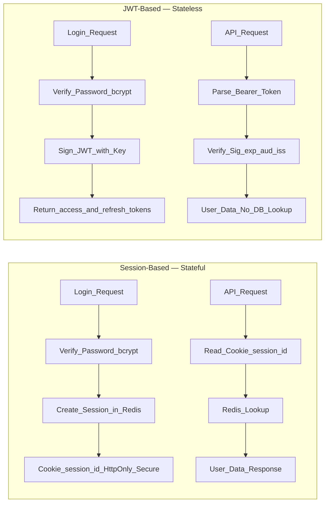
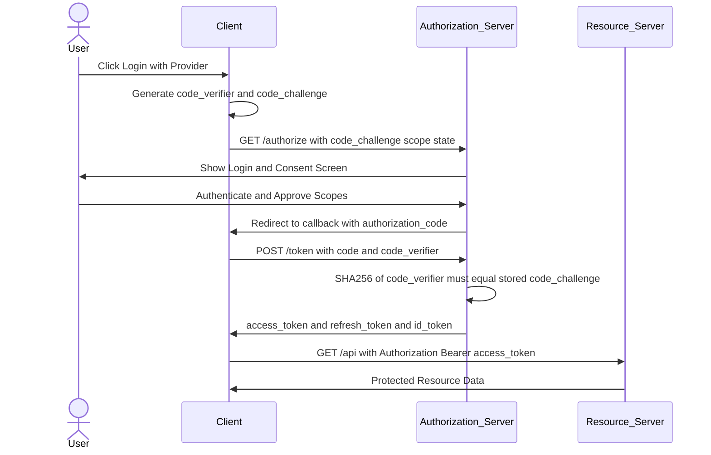
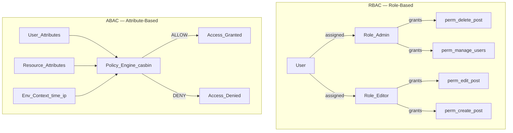

# Authentication and Authorization in Python

> [!abstract] TL;DR
> Authentication answers "who are you?" (verify identity); authorization answers "what can you do?" (enforce permissions). Getting either wrong is the most common source of data breaches. This note covers the full production stack: password hashing, sessions, JWTs, OAuth2 + PKCE, API keys, RBAC, ABAC, CORS, secure headers, and the six vulnerability classes you must actively defend against.

---

## Intuition

**Analogy:** A nightclub has two checkpoints. The first is the ID check (authentication) — the bouncer verifies your government ID proves you are who you claim. The second is the VIP list (authorization) — the bouncer checks whether your name is on the list for the back room. Passing the ID check does not grant VIP access. Failing either means you don't get in.

Sessions are the bouncer stamping your hand — the stamp (session cookie) is checked on re-entry, and the club (server) holds the master guest list. JWTs are a sealed letter with the club owner's wax seal — anyone can verify the seal without calling the club, but revoking a valid letter before it expires requires an extra denylist step.

---

## How It Works

### Core Mechanics

Every authentication and authorization system reduces to three steps:

1. **Identity proof** — the user supplies a credential (password, token, certificate) the system can verify.
2. **Session or token issuance** — on success, the server issues a portable proof of identity (session ID, JWT, API key) so the user does not re-authenticate every request.
3. **Authorization check** — for each protected resource, the system evaluates whether the proven identity has the right to perform the requested action.

---

### 1. Password Hashing

Never store plaintext passwords. Store a one-way hash with a built-in per-password salt.

**bcrypt**: The industry standard for 15+ years. An adaptive cost factor (`rounds`) controls CPU work — as hardware improves, raise `rounds`. Includes a random 16-byte salt automatically. Hard limit: silently truncates passwords at 72 bytes.

**Argon2id**: Winner of the 2015 Password Hashing Competition. **Memory-hard** — requires large RAM (configurable), not just CPU cycles, making ASIC and GPU attacks far more expensive. NIST SP 800-63B recommends it. Preferred for all new systems.

**PBKDF2**: Django's default. NIST-approved and standards-compliant, but not memory-hard — GPU cracking is significantly cheaper than Argon2id.

**`passlib` CryptContext**: Enables algorithm agility. Define a preferred scheme and a deprecated fallback list. On the next successful login, `deprecated="auto"` transparently re-hashes old bcrypt hashes to Argon2id without any user-facing disruption.

```
$argon2id$v=19$m=65536,t=3,p=2$<16-byte-salt>$<32-byte-hash>
└────────┘      └─────────────┘
 algorithm id     parameters
```

**`hmac.compare_digest`**: Standard `==` comparison short-circuits on the first mismatched byte, leaking how many leading characters matched (timing oracle). `hmac.compare_digest` always runs in constant time regardless of where strings diverge — mandatory for any security-sensitive token comparison.

---

### 2. Session-Based Authentication

The server owns all session state; the client holds only an opaque identifier.

1. Client POSTs credentials to `/login`
2. Server verifies password, creates a session record in Redis/DB, assigns a random session ID
3. Server responds: `Set-Cookie: session_id=<random>; HttpOnly; Secure; SameSite=Strict`
4. Browser stores the cookie and sends it automatically on every subsequent request to the same origin
5. Server reads `session_id`, looks it up in Redis, retrieves user data
6. On logout: **server deletes the session record** — the cookie becomes meaningless

**Critical cookie flags:**
- `HttpOnly` — JavaScript cannot read the cookie; blocks XSS-based cookie theft
- `Secure` — transmitted only over HTTPS
- `SameSite=Strict` — cookie not sent on cross-site requests; primary CSRF defense

**Session fixation attack**: Before accepting credentials, always regenerate the session ID immediately after successful login. An attacker who planted a known session ID pre-login would otherwise inherit the authenticated session.

**CSRF**: Session-based auth requires explicit CSRF tokens (Django ``, Flask-WTF) because browsers send cookies automatically on cross-origin form submissions. JWT in an `Authorization: Bearer` header is immune — browsers never auto-attach custom headers cross-origin.

---

### 3. JWT — JSON Web Tokens

A JWT is a compact, self-contained token encoding verifiable claims.

**Structure**: `Base64URL(Header) . Base64URL(Payload) . Signature`

```
Header:  {"alg": "HS256", "typ": "JWT"}
Payload: {"sub": "alice", "role": "admin", "exp": 1753574400,
          "iat": 1753570800, "iss": "myapi", "aud": "myapi-clients"}
```

**HS256**: Symmetric — the same shared secret signs and verifies. Simple but requires sharing the secret with every verifying service.

**RS256**: Asymmetric — private key signs, public key verifies. Any service can validate tokens by fetching the public JWKS endpoint without ever touching the signing secret. Preferred in multi-service architectures.

**Access + Refresh token pattern:**
- **Access token**: short-lived (15 min–1 hr), sent as `Authorization: Bearer <token>`, stateless validation
- **Refresh token**: long-lived (7–30 days), stored in an `HttpOnly` cookie, used only at the token-refresh endpoint, **rotated on every use** (old refresh token invalidated when new one is issued)

**JWT revocation problem**: A signed JWT is valid until `exp`. After logout or compromise, you cannot "un-sign" it. Solutions:
1. Short expiry + refresh token rotation (recommended — limits exposure window)
2. Token denylist in Redis keyed by JTI claim (checked per request — sacrifices statelessness)
3. Accept the short exposure window for low-sensitivity apps

**Validation checklist**: signature → `exp` (not expired) → `iat` (not in future) → `iss` (correct issuer) → `aud` (correct audience). Skipping `aud` allows a token issued for Service A to be accepted by Service B.

---

### Flow / Architecture — Session vs JWT



---

### 4. OAuth2 Flows

OAuth2 is an authorization delegation framework — it lets a third-party app act on a user's behalf without the user sharing their password with that app.

**Authorization Code + PKCE** (recommended for web apps and SPAs):
PKCE (Proof Key for Code Exchange, RFC 7636) prevents authorization code interception. The client generates a random `code_verifier`, computes `code_challenge = BASE64URL(SHA-256(code_verifier))`, and sends only the challenge to the auth server. When exchanging the authorization code for tokens, the client sends the original `code_verifier`. The auth server recomputes the hash and compares — a stolen authorization code is useless without the verifier.

**Client Credentials** (machine-to-machine): No user involved. A service authenticates with `client_id` + `client_secret` to receive an access token. Used for backend-to-backend API calls.

**Implicit** (deprecated): Replaced entirely by Authorization Code + PKCE for SPAs.

**Resource Owner Password** (legacy): User sends credentials directly to the client app. Only acceptable when migrating first-party apps; never use for third-party integrations.

**OpenID Connect (OIDC)** = OAuth2 + identity layer. Adds an `id_token` (a JWT containing user profile claims: `sub`, `email`, `name`, `picture`) alongside the access token. This is the protocol behind "Sign in with Google/GitHub."

**Scopes**: `read:profile`, `write:posts`, `admin` — granular permission grants the user approves on the consent screen. The access token carries only the approved scopes.

### OAuth2 Authorization Code + PKCE Flow



---

### 5. API Key Authentication

API keys are long-lived credentials issued to client applications (not individual users).

- Generate with `secrets.token_urlsafe(32)` — 256 bits of cryptographically random entropy
- **Store the hash in the DB** (bcrypt or SHA-256), never the raw key — treat it like a password
- Transmit in `X-API-Key: <token>` header; never in query parameters (query strings appear in web server access logs)
- Rate-limit per key to detect abuse and prevent credential stuffing
- Support key rotation: issue a new key, grant a deprecation grace period, then revoke the old one
- Maintain an audit log of every request with the key ID (not the raw key)

**API Key vs JWT comparison:**

| Aspect | API Key | JWT |
|--------|---------|-----|
| State | Stateful (DB lookup per request) | Stateless (signature verification) |
| Revocation | Immediate (delete from DB) | Requires denylist or wait for expiry |
| Per-request overhead | DB lookup O(1) with index | CPU: SHA-256 or RSA verify |
| Best for | SDKs, machine clients, webhooks | User sessions, microservices |

---

### 6. Role-Based Access Control (RBAC)

Users are assigned **roles**; roles are granted **permissions**. A user's effective access is the union of permissions from all assigned roles.

```
User → [Role_Admin, Role_Editor] → [perm_delete, perm_edit, perm_create, perm_manage_users]
```

**Django built-in**: `user.has_perm("app.can_publish")`, `@permission_required("app.can_publish")`, `@login_required`. Django's Group model is a named role; permissions attach to Groups. This is group-based RBAC out of the box.

**FastAPI**: Permissions enforced via `Depends()` — see Code Demo 3.

**Performance**: Never query the DB for permissions on every request. Cache the permission set in Redis with a short TTL (5 min), or embed permissions as a JWT claim (`"perms": ["edit_post", "create_post"]`). A DB query on every request is the most common RBAC performance bug.

---

### 7. Attribute-Based Access Control (ABAC)

ABAC evaluates **policies** that combine attributes of the user, the resource, and the environment. More expressive than RBAC for complex rules.

```
Policy: ALLOW if user.department == resource.department
            AND resource.sensitivity <= user.clearance
            AND env.time.is_business_hours()
```

**`casbin`**: Leading Python ABAC/RBAC library. Policies are defined in a `.conf` model file and a `.csv` or DB-backed policy file. Supports ACL, RBAC, ABAC, and multi-tenant models.

**Row-level security** (a focused ABAC pattern): "A user can only access rows they own." This is the defense against BOLA (Broken Object-Level Authorization — OWASP API Security #1). Always filter by `owner_id = current_user.id` in queries; never accept an unchecked resource ID from the client.

### Permission Model Comparison



---

### 8. CORS — Cross-Origin Resource Sharing

Browsers block cross-origin requests by default (Same-Origin Policy). CORS is the server mechanism to explicitly allow exceptions.

**Preflight**: For non-simple requests (POST with JSON, custom headers like `Authorization`), the browser first sends an `OPTIONS` request to verify the server allows the origin, method, and headers. The server must respond with the correct `Access-Control-*` headers or the browser blocks the actual request — the server never sees it.

**Key response headers:**
- `Access-Control-Allow-Origin: https://myapp.com` — allowlist specific origins; **never use `*` when `Allow-Credentials: true`**
- `Access-Control-Allow-Methods: GET, POST, PUT, DELETE`
- `Access-Control-Allow-Headers: Authorization, Content-Type`
- `Access-Control-Allow-Credentials: true` — required to send cookies/auth headers cross-origin
- `Access-Control-Max-Age: 600` — browser caches the preflight response for 10 minutes

**FastAPI setup:**
```python
from fastapi.middleware.cors import CORSMiddleware

app.add_middleware(
    CORSMiddleware,
    allow_origins=["https://myapp.com"],   # never ["*"] with credentials
    allow_credentials=True,
    allow_methods=["*"],
    allow_headers=["Authorization", "Content-Type"],
)
```

---

### 9. Secure Headers and HTTPS

Security headers defend against entire vulnerability classes with a single server-side configuration change.

| Header | Recommended Value | Defends Against |
|--------|-------------------|----------------|
| `Strict-Transport-Security` | `max-age=31536000; includeSubDomains` | SSL stripping, HTTPS downgrade |
| `Content-Security-Policy` | `default-src 'self'; script-src 'self'` | XSS by allowlisting script sources |
| `X-Frame-Options` | `DENY` | Clickjacking and UI redress attacks |
| `X-Content-Type-Options` | `nosniff` | MIME-type sniffing attacks |
| `Referrer-Policy` | `strict-origin-when-cross-origin` | Leaking sensitive paths in Referer header |

**Python libraries**: `django-csp` for per-view CSP in Django; the `secure` library (`pip install secure`) adds all security headers in one call for any WSGI/ASGI app.

**TLS**: Terminate TLS at the load balancer (Nginx, AWS ALB). Set HSTS to force HTTPS for the entire domain duration. Never serve plaintext HTTP for authenticated endpoints, even on internal networks — lateral movement attacks are real.

---

### 10. Common Vulnerabilities and Defenses

| Vulnerability | Impact | Defense |
|---------------|--------|---------|
| **SQL Injection** | Full DB compromise | ORM parameterized queries; `cursor.execute("... WHERE id=%s", (uid,))`; never f-strings in SQL |
| **XSS** | Session hijacking, credential theft | Escape template output; `HttpOnly` cookies; `Content-Security-Policy` header |
| **CSRF** | Unauthorized state changes via forged requests | CSRF tokens for session-based auth; `SameSite=Strict` for JWT cookie auth |
| **SSRF** | Access internal metadata/services | Validate URLs against scheme+host allowlist; block RFC 1918 private ranges |
| **Mass Assignment** | Privilege escalation | Explicit Pydantic field allow-lists; never `User(**request.json())` without filtering |
| **IDOR / BOLA** | Access other users' data | Always filter `WHERE owner_id = current_user.id`; never trust client-supplied resource IDs |

---

## Code Demo

### 1. FastAPI JWT Authentication — Login + Protected Endpoint

```python
# pip install fastapi uvicorn "python-jose[cryptography]" "passlib[bcrypt]" pydantic

from datetime import datetime, timedelta, timezone
from typing import Optional
from fastapi import FastAPI, Depends, HTTPException, status
from fastapi.security import OAuth2PasswordBearer, OAuth2PasswordRequestForm
from jose import JWTError, jwt
from passlib.context import CryptContext
from pydantic import BaseModel

# Production: use secrets.token_hex(32) and load from environment variable
SECRET_KEY = "replace-with-64-char-hex-from-secrets-token-hex-32"
ALGORITHM = "HS256"
ACCESS_TOKEN_EXPIRE_MINUTES = 15
REFRESH_TOKEN_EXPIRE_DAYS = 7

pwd_context = CryptContext(schemes=["bcrypt"], deprecated="auto")
oauth2_scheme = OAuth2PasswordBearer(tokenUrl="/auth/login")

# Simulated DB — in production, query your ORM (SQLAlchemy, Tortoise, etc.)
FAKE_USERS_DB = {
    "alice": {
        "username": "alice",
        "hashed_password": pwd_context.hash("supersecret"),
        "role": "admin",
    }
}

app = FastAPI()


class Token(BaseModel):
    access_token: str
    refresh_token: str
    token_type: str = "bearer"


class TokenData(BaseModel):
    sub: Optional[str] = None
    role: Optional[str] = None


def create_token(data: dict, expires_delta: timedelta) -> str:
    payload = {
        **data,
        "exp": datetime.now(timezone.utc) + expires_delta,
        "iat": datetime.now(timezone.utc),
        "iss": "myapi",
        "aud": "myapi-clients",
    }
    return jwt.encode(payload, SECRET_KEY, algorithm=ALGORITHM)


def get_current_user(token: str = Depends(oauth2_scheme)) -> TokenData:
    """FastAPI dependency: validates JWT signature + claims, returns parsed user."""
    credentials_exc = HTTPException(
        status_code=status.HTTP_401_UNAUTHORIZED,
        detail="Could not validate credentials",
        headers={"WWW-Authenticate": "Bearer"},
    )
    try:
        payload = jwt.decode(
            token,
            SECRET_KEY,
            algorithms=[ALGORITHM],
            audience="myapi-clients",   # MUST validate audience
        )
        sub: str = payload.get("sub")
        if sub is None:
            raise credentials_exc
        return TokenData(sub=sub, role=payload.get("role"))
    except JWTError:
        raise credentials_exc


@app.post("/auth/login", response_model=Token)
def login(form_data: OAuth2PasswordRequestForm = Depends()):
    user = FAKE_USERS_DB.get(form_data.username)
    if not user or not pwd_context.verify(form_data.password, user["hashed_password"]):
        raise HTTPException(
            status_code=status.HTTP_401_UNAUTHORIZED,
            detail="Incorrect username or password",
        )
    access_token = create_token(
        {"sub": user["username"], "role": user["role"]},
        timedelta(minutes=ACCESS_TOKEN_EXPIRE_MINUTES),
    )
    refresh_token = create_token(
        {"sub": user["username"], "type": "refresh"},
        timedelta(days=REFRESH_TOKEN_EXPIRE_DAYS),
    )
    return Token(access_token=access_token, refresh_token=refresh_token)


@app.get("/me")
def read_me(current_user: TokenData = Depends(get_current_user)):
    return {"username": current_user.sub, "role": current_user.role}
```

---

### 2. Passlib CryptContext — Argon2id + bcrypt with Algorithm Agility

```python
# pip install "passlib[argon2,bcrypt]" argon2-cffi

import hmac
import secrets
from passlib.context import CryptContext

# Preferred: argon2id for new hashes; bcrypt as deprecated fallback for legacy hashes.
# deprecated="auto": bcrypt hashes are verified correctly AND silently re-hashed to
# argon2id on the next successful login — zero disruption to users.
pwd_context = CryptContext(
    schemes=["argon2", "bcrypt"],
    deprecated="auto",
    argon2__time_cost=3,
    argon2__memory_cost=65536,   # 64 MB RAM required — GPU/ASIC cracking is ~1000x more expensive
    argon2__parallelism=2,
    bcrypt__rounds=12,           # 2^12 = 4,096 iterations
)


def hash_password(plain: str) -> str:
    """Returns an Argon2id hash string with embedded salt and algorithm parameters."""
    return pwd_context.hash(plain)


def verify_password(plain: str, hashed: str) -> bool:
    """Constant-time comparison — passlib handles this internally for all schemes."""
    return pwd_context.verify(plain, hashed)


def needs_rehash(hashed: str) -> bool:
    """True if this hash should be upgraded on next login (e.g., bcrypt → argon2)."""
    return pwd_context.needs_update(hashed)


def generate_api_key() -> tuple[str, str]:
    """
    Returns (raw_key_to_send_to_client_once, hashed_key_to_store_in_db).
    Never store the raw key — treat it exactly like a password.
    """
    raw_key = secrets.token_urlsafe(32)       # 256 bits of entropy, URL-safe
    hashed_key = pwd_context.hash(raw_key)
    return raw_key, hashed_key


def safe_compare(a: str, b: str) -> bool:
    """Constant-time string comparison — prevents timing oracle attacks on tokens."""
    return hmac.compare_digest(a.encode("utf-8"), b.encode("utf-8"))


# --- Demo ---
hashed = hash_password("my-strong-password")
print(hashed[:35])                                      # $argon2id$v=19$m=65536,t=3...

print(verify_password("my-strong-password", hashed))   # True
print(verify_password("wrong-password", hashed))        # False

raw, stored = generate_api_key()
print(f"Send to client once: {raw[:20]}...")            # e.g. xK7mN2...
print(f"Store in DB:         {stored[:30]}...")         # $argon2id$...
```

---

### 3. RBAC Dependency in FastAPI with Row-Level Ownership Check

```python
from enum import Enum
from typing import Set
from fastapi import Depends, HTTPException, status
# Assumes TokenData and get_current_user are imported from Demo 1

class Role(str, Enum):
    ADMIN = "admin"
    EDITOR = "editor"
    VIEWER = "viewer"


# Role hierarchy: ADMIN implicitly holds all EDITOR and VIEWER rights
ROLE_GRANTS: dict[Role, Set[Role]] = {
    Role.ADMIN:  {Role.ADMIN, Role.EDITOR, Role.VIEWER},
    Role.EDITOR: {Role.EDITOR, Role.VIEWER},
    Role.VIEWER: {Role.VIEWER},
}


def require_role(*allowed: Role):
    """
    Dependency factory: returns a FastAPI dependency that enforces the given roles.
    Usage: Depends(require_role(Role.ADMIN, Role.EDITOR))
    """
    def _checker(current_user: TokenData = Depends(get_current_user)) -> TokenData:
        try:
            user_role = Role(current_user.role)
        except ValueError:
            raise HTTPException(status_code=403, detail="Unknown role in token")

        effective = ROLE_GRANTS.get(user_role, set())
        if not effective.intersection(set(allowed)):
            raise HTTPException(
                status_code=status.HTTP_403_FORBIDDEN,
                detail=f"Role '{user_role}' insufficient — requires one of "
                       f"{[r.value for r in allowed]}",
            )
        return current_user
    return _checker


def assert_owner_or_admin(resource_owner_id: int, current_user: TokenData) -> None:
    """
    Row-level security (BOLA/IDOR defense).
    Raise 403 unless the current user owns the resource or is an admin.
    Call this AFTER confirming the resource exists to avoid leaking IDs via 403 vs 404.
    """
    is_admin = current_user.role == Role.ADMIN.value
    is_owner = current_user.sub == str(resource_owner_id)
    if not (is_admin or is_owner):
        raise HTTPException(
            status_code=status.HTTP_403_FORBIDDEN,
            detail="You do not have permission to access this resource",
        )


# --- Endpoint examples using the dependencies ---
@app.delete("/users/{user_id}")
def delete_user(
    user_id: int,
    _: TokenData = Depends(require_role(Role.ADMIN)),
):
    return {"deleted": user_id}


@app.put("/posts/{post_id}")
def update_post(
    post_id: int,
    owner_id: int,
    current_user: TokenData = Depends(require_role(Role.EDITOR, Role.ADMIN)),
):
    # Fetch post from DB here, get actual owner_id, then:
    assert_owner_or_admin(owner_id, current_user)   # row-level check
    return {"updated": post_id}
```

---

### 4. OAuth2 Authorization Code + PKCE — Client-Side Key Steps

```python
# Demonstrates the PKCE mechanics performed by the client (SPA or backend)
# pip install authlib httpx  (production libraries)

import base64
import hashlib
import secrets
import urllib.parse


def generate_pkce_pair() -> tuple[str, str]:
    """
    Returns (code_verifier, code_challenge).
    code_verifier: stored secretly client-side; sent to token endpoint later.
    code_challenge: SHA-256 hash of verifier; sent to /authorize upfront.
    """
    # RFC 7636: verifier must be 43–128 chars from the unreserved charset
    code_verifier = secrets.token_urlsafe(64)   # yields 86 URL-safe characters
    digest = hashlib.sha256(code_verifier.encode("ascii")).digest()
    code_challenge = (
        base64.urlsafe_b64encode(digest)
        .rstrip(b"=")          # strip Base64 padding per RFC 7636
        .decode("ascii")
    )
    return code_verifier, code_challenge


def build_authorization_url(
    auth_server: str,
    client_id: str,
    redirect_uri: str,
    scopes: list[str],
    code_challenge: str,
) -> tuple[str, str]:
    """Returns (authorization_url, state). Store state to verify on callback."""
    state = secrets.token_urlsafe(16)   # CSRF protection for the OAuth redirect itself
    params = {
        "response_type": "code",
        "client_id": client_id,
        "redirect_uri": redirect_uri,
        "scope": " ".join(scopes),
        "state": state,
        "code_challenge": code_challenge,
        "code_challenge_method": "S256",
    }
    url = f"{auth_server}/authorize?" + urllib.parse.urlencode(params)
    return url, state


def build_token_exchange_payload(
    auth_code: str,
    code_verifier: str,
    client_id: str,
    redirect_uri: str,
) -> dict:
    """
    POST this dict to {auth_server}/token.
    Auth server recomputes SHA-256(code_verifier) and checks it equals the stored
    code_challenge. A stolen auth_code is useless without the code_verifier.
    No client_secret is needed — PKCE replaces it for public clients.
    """
    return {
        "grant_type": "authorization_code",
        "code": auth_code,
        "redirect_uri": redirect_uri,
        "client_id": client_id,
        "code_verifier": code_verifier,
    }


# --- Demo run ---
verifier, challenge = generate_pkce_pair()
print(f"code_verifier (keep secret, 86 chars): {verifier[:20]}...")
print(f"code_challenge (send to auth server):  {challenge[:20]}...")

auth_url, state = build_authorization_url(
    auth_server="https://auth.example.com",
    client_id="my-spa",
    redirect_uri="https://myapp.com/callback",
    scopes=["openid", "profile", "email"],
    code_challenge=challenge,
)
print(f"\nRedirect user to:\n{auth_url[:90]}...")
print(f"\nStore state for CSRF check on callback: {state}")
```

---

## Real-World Example

> **Example — Auth0 + FastAPI (dominant SaaS pattern):** Most production SaaS products offload authentication entirely to an identity provider (Auth0, Okta, AWS Cognito). The FastAPI backend receives RS256-signed JWTs in the `Authorization: Bearer` header. At startup, it fetches the identity provider's public keys from the JWKS endpoint (`/.well-known/jwks.json`) and caches them locally. Every subsequent token validation is a pure CPU operation — no network call to Auth0 per request. The `iss` (issuer) and `aud` (audience) claims are always validated to prevent a token issued for Service A from being accepted by Service B. Scopes in the token drive the RBAC layer. This pattern handles password reset, MFA, social login, and brute-force throttling without the backend team writing any auth UI — and scales to millions of requests with zero shared session state.

---

## Trade-offs

### JWT vs Session-Based

| Aspect | JWT — Stateless | Session-Based — Stateful |
|--------|----------------|--------------------------|
| **Scalability** | Excellent — any replica validates without shared state | Requires shared session store (Redis) across all instances |
| **Revocation** | Hard — needs denylist or short expiry | Trivial — delete the session record immediately |
| **Client storage** | Access token in JS memory; refresh in httpOnly cookie | Session ID in httpOnly cookie only |
| **CSRF risk** | Low when sent via Authorization header | High — must use explicit CSRF tokens |
| **Token size** | Large (1–4 KB with claims) | Small (32-byte opaque ID) |
| **Payload visibility** | Readable by anyone (Base64, not encrypted) | Opaque to client |

### bcrypt vs Argon2id

| Aspect | bcrypt | Argon2id |
|--------|--------|----------|
| **Memory hardness** | No — CPU-bound only | Yes — configurable RAM (64 MB+) |
| **GPU resistance** | Moderate | High — memory bandwidth bottleneck |
| **ASIC resistance** | Low | High |
| **Max password length** | 72 bytes (silently truncates longer) | Unlimited |
| **Standard** | De facto industry standard | NIST SP 800-63B recommended |
| **Migration path** | Widely deployed | Use passlib CryptContext for transparent migration |

### RBAC vs ABAC

| Aspect | RBAC | ABAC |
|--------|------|------|
| **Simplicity** | Simple — assign users to roles | Complex — policies reference multiple attributes |
| **Flexibility** | Low — roles are predefined at design time | High — any attribute combination |
| **Performance** | Fast — cache role-permission map | Slower — policy evaluated per request |
| **Auditability** | Easy — who has role X? | Harder — which policies apply to user Y on resource Z? |
| **Best for** | Most enterprise apps | Multi-tenant, row-level security, compliance rules |

---

## When to Use vs Avoid

**Use JWTs when:**
- Horizontal scaling with multiple stateless backend replicas
- Microservices architecture where several services validate the same token
- Mobile or SPA clients where httpOnly cookies require careful CORS configuration

**Use sessions when:**
- Server-rendered web apps (Django, Flask + Jinja2)
- Sensitive applications requiring immediate revocation (banking, healthcare, government)
- Simple single-server deployments without Redis operational overhead

**Use RBAC when:**
- Roles map cleanly to job functions (admin, editor, viewer)
- The access model is stable and can be fully enumerated at design time

**Use ABAC / casbin when:**
- Access depends on resource ownership, tenant, time-of-day, or sensitivity level
- Row-level security is required (users see only their own data)
- Compliance policies cannot be expressed as flat role assignments

---

## Common Pitfalls

- **JWT in `localStorage`** — any XSS vulnerability immediately steals the token; JavaScript can read `localStorage` freely. Store access tokens in a JavaScript memory variable (lost on page reload — intentional) and refresh tokens in an `HttpOnly` cookie. Re-issue the access token silently on load using the cookie.

- **Not validating `aud` and `iss` claims** — a JWT signed by your auth server for Service A is cryptographically valid at Service B if B checks only the signature. Always pass `audience=` and `issuer=` to the JWT decode call.

- **HS256 with a short or predictable secret** — HS256 secrets can be brute-forced offline from an intercepted token. Use at minimum 256 bits (`secrets.token_hex(32)`), load from an environment variable, and prefer RS256 for any multi-service setup.

- **Not rotating refresh tokens** — a stolen refresh token grants indefinite access if rotation is disabled. Every `/auth/refresh` call must issue a new refresh token and invalidate the previous one. Detect reuse: if an old refresh token is presented after rotation, invalidate the entire token family (refresh token reuse attack).

- **Timing attack on token comparison** — `if api_key == stored_key` short-circuits on the first differing byte, leaking timing information about prefix matches. Even for 64-character tokens this is exploitable with ~200 requests over a network. Use `hmac.compare_digest` for all security-sensitive comparisons.

- **No JWT invalidation on logout** — the user logs out, the session is cleared client-side, but the access token is still valid at the server until `exp`. At minimum keep access token expiry to 15 minutes; for higher security, maintain a Redis JTI denylist and check it on every request.

- **Mass assignment via `**request_body`** — `User(**request.json())` allows a malicious client to inject `"role": "admin"` or `"is_staff": true`. Always route request data through an explicit Pydantic model that lists only the fields the endpoint should accept.

- **`allow_origins=["*"]` with `allow_credentials=True`** — browsers reject this combination by spec. An explicit origin allowlist is mandatory whenever credentials (cookies, authorization headers) are involved in cross-origin requests.

---

## Related Concepts

- [[FastAPI_for_ML]] — FastAPI's dependency injection system (`Depends`) is the exact mechanism used to wire `get_current_user` and `require_role` into endpoints; that note covers the full request lifecycle and async middleware
- [[Decorators_and_Metaprogramming]] — Django's `@login_required` and `@permission_required` are function decorators; FastAPI's `Depends()` pattern is the async equivalent; understanding decorator stacking order matters for auth middleware chains
- [[Concurrency_in_Python]] — async FastAPI endpoints must perform session store lookups (Redis) and token denylist checks without blocking the event loop; requires async Redis clients (`aioredis`, `redis.asyncio`)
- [[Type_Hints_and_Static_Analysis]] — Pydantic models (`Token`, `TokenData`, request schemas) in all four code demos rely on Python type hints for automatic validation, serialization, and OpenAPI schema generation

---

## Review Questions

1. **JWT revocation:** A user logs out of your FastAPI app that issues 1-hour access tokens and 7-day refresh tokens. What attack surface remains open after logout, and describe two architecturally different approaches to close it. Which approach preserves JWT's stateless horizontal-scaling benefit, and which does not?

2. **PKCE purpose:** An attacker intercepts the `authorization_code` in the redirect URL during an OAuth2 Authorization Code flow. With PKCE enabled, can they exchange this code for tokens? Explain exactly what cryptographic property prevents the exchange, and why PKCE replaces the need for a `client_secret` in public clients such as SPAs and mobile apps.

3. **RBAC vs ABAC:** Your multi-tenant SaaS has this access rule: "A user may edit a document only if they belong to the same tenant as the document AND the document's sensitivity level does not exceed the user's clearance." Can RBAC alone express this rule? If not, explain what ABAC or row-level security adds, and write the SQL `WHERE` clause that enforces the ownership component server-side.

4. **`hmac.compare_digest`:** A developer argues that comparing two 64-character hex API keys with `==` is "basically constant time" on modern hardware. Construct a concrete timing attack: specify what the attacker measures, how many requests are needed to determine the correct key prefix character by character, and explain precisely why `hmac.compare_digest` defeats this attack even over a noisy network.

---

## Sources

- [OWASP Authentication Cheat Sheet](https://cheatsheetseries.owasp.org/cheatsheets/Authentication_Cheat_Sheet.html)
- [OWASP JWT Security Cheat Sheet](https://cheatsheetseries.owasp.org/cheatsheets/JSON_Web_Tokens_Cheat_Sheet_for_Java.html)
- [OWASP API Security Top 10 — 2023](https://owasp.org/API-Security/editions/2023/en/0x00-header/)
- [FastAPI Security Documentation](https://fastapi.tiangolo.com/tutorial/security/)
- [passlib Documentation — CryptContext](https://passlib.readthedocs.io/en/stable/lib/passlib.context.html)
- [python-jose Documentation](https://python-jose.readthedocs.io/en/latest/)
- [RFC 7636 — PKCE for OAuth 2.0](https://www.rfc-editor.org/rfc/rfc7636)
- [RFC 7519 — JSON Web Token](https://www.rfc-editor.org/rfc/rfc7519)
- [Argon2 — Password Hashing Competition](https://www.password-hashing.net/)
- [casbin Python — Getting Started](https://casbin.org/docs/get-started)
- [NIST SP 800-63B — Digital Identity Guidelines](https://pages.nist.gov/800-63-3/sp800-63b.html)

---

#python #authentication #authorization #jwt #oauth2 #security #backend
